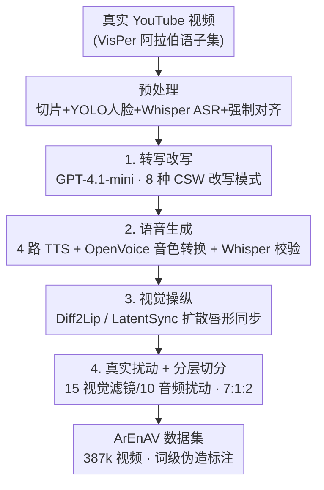

# Tell me Habibi, is it Real or Fake?

**会议**: ICLR 2026  
**OpenReview**: [https://openreview.net/forum?id=EbrPXZTVJ9](https://openreview.net/forum?id=EbrPXZTVJ9)  
**代码**: 数据集公开（论文称 public，具体链接以原文为准）  
**领域**: AIGC检测 / 音视频深度伪造 / 数据集与基准  
**关键词**: 深度伪造检测、Arabic-English语码转换、音视频数据集、时序定位、多语种

## 一句话总结
本文提出 **ArEnAV**——首个面向「阿拉伯语-英语句内语码转换（code-switching, CSW）」的大规模音视频深度伪造数据集（387k 视频、765+ 小时），用一条整合 4 个 TTS + 2 个唇形同步模型的生成流水线，把真实 YouTube 视频里说话内容做「内容驱动」的语义篡改，并系统证明现有 SOTA 检测/定位模型与人类在这种多语种、语码转换场景下几乎全部失效。

## 研究背景与动机

**领域现状**：深度伪造检测的数据集和方法绝大多数是「单语种 + 单模态」的——要么只改视频（FaceSwap/Face2Face，如 FaceForensics++、DFDC），要么只改音频（TTS/VC，如 ASVspoof、WaveFake），后来才出现联合篡改音视频的 FakeAVCeleb、AV-Deepfake1M。即便近年开始有多语种数据集（PolyGlotFake 覆盖 7 种语言、Illusion 覆盖 26 种），它们的非英语数据量都很小，而且**每条样本内部仍是单语种**。

**现有痛点**：现实世界里双语者说话经常在**同一句话里**来回切换语言（句内语码转换）。在阿拉伯世界这尤其普遍——ZAEBUC-Spoken 语料显示约 19% 的口语句子含 CSW、平均 44% 是英文词；ArzEn 语料里 63% 的句子涉及 CSW。再叠加阿拉伯语本身的「双言现象（diglossia）」：现代标准阿拉伯语（MSA）和各国方言（埃及、黎凡特、海湾）并存。现有检测模型几乎只见过单语种数据，碰到句内语码转换就会把「人自然切换语言时的语调变化」误当成伪造痕迹。

**核心矛盾**：语码转换既是检测的「噪声源」（自然的语言/语调跳变像伪造），又是攻击者可利用的「藏身处」（在英文词上做篡改更难被发现）。但**没有任何数据集刻画句内语码转换的音视频伪造**，导致这个真实威胁完全无法被研究和评测。

**本文目标**：构建首个 Arabic-English 句内 CSW 音视频深度伪造数据集，覆盖双语切换与双言切换（MSA↔方言），并系统刻画它对现有模型和人类的难度。

**切入角度**：与其从零生成假人脸，不如**保留原视频的身份与环境、只篡改"说了什么"**——用 LLM 做内容驱动的转写文本改写，再让音频和唇形跟着新文本走。这样伪造点精准落在词级、又天然带上语码转换，最贴近真实滥用场景（造谣、断章取义）。

**核心 idea**：用「转写改写 → 语音合成 → 唇形重渲染」三段流水线，把真实视频改造成**词级、语码转换、音视频一致**的伪造样本，并以此构建数据集 + 基准。

## 方法详解

### 整体框架
ArEnAV 的核心是一条**内容驱动（content-driven）的数据生成流水线**：输入是真实 YouTube 阿拉伯语视频，输出是带词级伪造区间标注的音视频深度伪造样本。先做数据采集与预处理（切片、检测人脸、ASR 得转写、强制对齐得词级时间戳），然后进入三段式生成——① 用 GPT-4.1-mini 按 8 种规则改写转写文本（注入语义改变 + 语码转换）；② 在保留原说话人音色的前提下为新文本合成音频；③ 用扩散唇形同步模型把人脸唇动重渲染到匹配新音频。最后叠加真实场景扰动，按 7:1:2 分层切分 train/val/test。

伪造遵循三种策略：**假音+假视频**（音视频都合成）、**假音+真视频**（只改音频注入反语义/CSW 内容）、**真音+假视频**（保留原音、只改唇动）。

### 关键设计

**1. 八模式转写改写：用 LLM 把"语义篡改 + 语码转换"精准注入词级**

这一步针对的痛点是：要让伪造既「改变了意思」又「自然带上语码转换」，还要可控、可批量。作者用 GPT-4.1-mini 定义了 **8 种转写改写模式**，覆盖语码转换句和纯阿拉伯语句两类语境，归纳为三类主操作：*meaning only*（只改词义、语言不变）、*meaning + dialect*（改词义并切到另一种阿拉伯语变体，MSA 或方言）、*meaning + translation*（改词义并翻成英文，即制造语码转换）。比如把「我们创造希望」改成「我们创造乐趣」。借助 15 个示例的少样本提示，模型自发产生 94.6% 替换、5.1% 插入、0.3% 删除。

为保证改写**真的改变了语义却不破坏流畅度**，作者用两个互补指标量化：**双向蕴含质量均值（Bidirectional Entailment Quality Mean）**取 Real→Fake 与 Fake→Real 两个方向 NLI 蕴含分的平均（$1.0$ 表示完全语义蕴含、$0.0$ 表示直接矛盾），结果显示各子集中大量样本落在 $0.5$ 阈值以下甚至矛盾区，说明语义确实被改动；**困惑度（Perplexity）**用 Jais-3B 与 Qwen-2.5-7B 评估，真/假转写困惑度差异极小，说明假文本依旧流畅自然。这种「内容大改、表面流畅」的平衡正是高质量音视频伪造的前提。

**2. 四路 TTS + 音色转换 + ASR 回环校验：跨语种零样本语音克隆**

针对的痛点是：常见零样本声音克隆（如 YourTTS）在英文上强、但在阿拉伯语音系和跨语种合成上很弱，直接用会露馅。作者据此设计**四种针对性克隆策略**：(a) XTTS-v2 原生支持阿/英/语码转换的多语种零样本 TTS；(b) XTTS-v2 + OpenVoice-v2，有参考音样时先合成再做说话人转换提高保真；(c) Fairseq Arabic TTS + OpenVoice-v2，专攻纯阿拉伯语句；(d) GPT-TTS + OpenVoice-v2，从 29 个音色里随机取一个生成再转换到目标说话人。

关键的质量闸门是**生成-校验回环**：对插入/替换操作先重新合成整句，再用 Whisper-Turbo 转写并要求与目标文本**逐字匹配**，不匹配就丢弃；对删除操作直接移除语音段、只留背景噪声。每次编辑后还会把篡改段的响度归一化到原音频水平并与环境噪声重组。这样既保证可懂度，又保证时间戳对齐准确、能无缝拼回原音轨——音频指标 SECS 0.990、FAD 0.140，逼近 AV-Deepfake1M。

**3. 扩散唇形重渲染 + 真实扰动：让视觉伪造高质且抗"切割痕迹"作弊**

视觉端针对的痛点是：早期数据集的唇形同步偏弱，检测器常靠拼接边界处的低级伪影（splice artifact）作弊，而非真正理解内容。作者经反复实验选用两个**基于扩散的零样本唇形同步模型 Diff2Lip 与 LatentSync**，用新音频和原视频帧重渲染人脸：替换/插入操作生成对应新词的假帧，删除操作生成闭唇（无音）人脸。视觉指标 PSNR 37.70、SSIM 0.971、FID 0.68，接近最强的 AV-Deepfake1M。论文还通过 BA-TFD+ 的频谱定性分析确认编辑边界处**无能量突变/不连续**，证明伪造难度来自内容本身而非拼接痕迹。

此外为贴近真实流媒体，作者对真/假视频都叠加**局部扰动**：15 种视觉滤镜（椒盐噪声、镜头抖动等）和 10 种音频处理（时间拉伸、随机响度、变调等），每个视频随机采 1–3 个视觉扰动、1–2 个音频扰动。这让检测器无法靠「画质差异」区分真假，迫使它面对内容层面的伪造。

### 一个完整示例
以一条阿拉伯语-英语语码转换视频为例走一遍流水线：原句「…deepfake detection 这个话题非常重要」先被切片、YOLO 检出人脸、Whisper-v2 转出阿拉伯语转写、wav2vec2 强制对齐得到每个词（含英文词 "deepfake detection"）的时间戳；GPT-4.1-mini 按模式 7（纯阿语 → 改义并译成英文）把某个阿拉伯语词改义并替换成英文词，制造一处语码转换 + 语义反转；XTTS-v2 用原说话人音色重合成这一小段、Whisper-Turbo 校验逐字匹配通过后按响度归一拼回原音轨；LatentSync 把这几帧的唇动重渲染到匹配新词；最后叠加一个镜头抖动滤镜。产出一条**真音背景 + 局部假音假唇、伪造区间精确标在那个英文词上**的样本——这正是人类最难识别（英文词上 85% 漏检）的伪造类型。

## 实验关键数据

### 主实验：现有 SOTA 在 ArEnAV 上几乎全线崩溃
数据集规模与质量（与多语种数据集对比）：

| 数据集 | 总视频 | 阿拉伯语视频 | CSW 视频 | 多语种 | 语码转换 |
|--------|--------|--------------|----------|--------|----------|
| PolyGlotFake | 15,238 | 1,403 | 0 | ✓ | ✗ |
| Illusion | 1,376,371 | 极少 | 0 | ✓ | ✗ |
| **ArEnAV (本文)** | **387,072** | **287,280** | **99,792** | ✓ | **✓** |

音视频时序定位（Temporal Localization，AP@0.5，越高越好）——跨数据集对比凸显泛化崩塌：

| 方法 | LAV-DF | AV-1M | **ArEnAV** |
|------|--------|-------|-----------|
| BA-TFD | 79.15 | 37.37 | **2.42** |
| BA-TFD+ | 96.30 | 44.42 | **3.74** |

深度伪造检测（AUC，越高越好）；图像类纯靠视频级标签的模型几乎等于瞎猜（≈50%）：

| 设定 | 方法 | 模态 | Fullset AUC |
|------|------|------|------------|
| Zero-Shot (AV-1M) | BA-TFD | AV | 61.73 |
| 训练于 ArEnAV | Xception (frame) | V | 74.21 |
| 训练于 ArEnAV | XLSR-Mamba | A | 73.00 |
| AV-1M + ArEnAV 微调 | BA-TFD | AV | 75.91 |
| **AV-1M + ArEnAV 微调** | **BA-TFD+** | **AV** | **79.97（最佳）** |

跨数据集检测（AUC）：在 FF++/CelebDF/DFDC 上表现优异的 SOTA 检测器，到 ArEnAV 上全部跌到 50% 瞎猜水平：

| 方法 | 会议 | ArEnAV | DFDC | FF++ |
|------|------|--------|------|------|
| Face-X-Ray | CVPR-20 | 55.56 | 80.92 | 98.52 |
| LipForensics | CVPR-21 | 49.76 | 73.50 | 97.10 |
| LAA-Net | CVPR-24 | 50.04 | 86.94 | 99.96 |
| ForensicsAdaptor | CVPR-25 | 50.58 | 88.70 | – |

### 人类用户研究
19 名参与者（15 名阿拉伯语母语）对 20 个视频判断，**人类检测准确率仅 60%**，定位更难（AP@0.5 仅 0.79）。当篡改发生在**英文词**上时，**85% 的人漏检**——归因于英文声音克隆质量更高 + 语码转换时音调本就自然变化。判假理由分布：语音不可懂 36.5%、唇音不同步 25.1%、音频听着假 24.7%，而「视频看着假」只占 8.7%（说明扩散唇形质量极高）。

### 关键发现
- **泛化崩塌的根因是内容而非伪影**：BA-TFD/BA-TFD+ 从 AV-1M 迁移到 ArEnAV，AP@0.5 暴跌 35%+；定性分析显示编辑边界无频谱突变，证明难度来自句内语码转换这种「语言学精准」的篡改，而非拼接痕迹。
- **模型把"真实语码转换"误判为伪造**：BA-TFD+ 在真实 CSW 视频上频繁把阿/英切换区间预测为假段，说明它分不清「自然语言切换」和「合成不一致」。
- **伪造区间更长更难**：ArEnAV 假段平均时长是 AV-1M 的 2.1 倍（相对长度），佐证性能下降源于内在难度。
- **模态特异性**：XLSR-Mamba 在纯音频子集 A 上更强、且在语码转换音频上明显比纯阿拉伯语更差；图像类模型在纯视觉子集 V 上更强。

## 亮点与洞察
- **把"语码转换"从语言学现象变成深度伪造的攻击面**：作者敏锐地指出双语者句内切换语言既是检测噪声、又是攻击藏身处，并用数据证明英文词上篡改人类 85% 漏检——这个视角此前完全被忽视。
- **内容驱动 + ASR 逐字回环校验的生成范式可复用**：用 LLM 改写转写、TTS 重合成、Whisper 逐字校验丢弃不匹配样本，这套「生成-验证」闭环能保证词级时间戳精确，可迁移到任何语种的内容驱动伪造数据构建。
- **用扩散唇形 + 真实扰动主动消除"作弊捷径"**：刻意让真假视频都加扰动、并验证无拼接伪影，逼检测器面对内容而非低级特征——这种「反作弊」数据设计思路值得其他 benchmark 借鉴。
- **双指标量化生成质量**：用 NLI 双向蕴含证明"语义真的改了"、用困惑度证明"文本依旧流畅"，把"高质量伪造文本"这个模糊概念做成可测量的两维度。

## 局限与展望
- 作者承认数据集**真假视频数量不平衡**（假远多于真），训练时需子采样去类不平衡。
- 阿拉伯语 ASR（Whisper-v2）和语音活动检测性能不如英语，导致**部分噪声转写**；LLM 在语码转换场景指令遵循能力有限，尤其 *meaning + translation* 模式下 GPT 常常没真正改变语义，使真假转写过于相似。
- **仅限两种语言**（阿/英），尚未覆盖更多语种与多向语码转换；其它语言对、三语切换都是开放方向。
- 自己发现的局限：论文主要提供数据集与基准，**没有提出新的检测方法**——它指出了问题但把"怎么解"留给社区；另外评测的"最佳"模型 AUC 也仅 80%，离实用还很远。

## 相关工作与启发
- **vs FakeAVCeleb / AV-Deepfake1M (AV-1M)**：它们是英语单语种音视频伪造，AV-1M 引入了内容驱动的转写篡改；本文沿用 AV-1M 的内容驱动思路与三类伪造分类，但**首次引入句内语码转换与阿拉伯语双言变体**，并证明在 AV-1M 上训练的模型迁移到 ArEnAV 会暴跌 35%+。
- **vs PolyGlotFake / Illusion**：同为多语种音视频数据集，但它们每条样本内部仍是单语种、阿拉伯语数据极少（PolyGlotFake 仅 1,403 条）；本文规模与语码转换覆盖远超两者（99,792 条 CSW 视频）。
- **vs LipForensics / Face-X-Ray / ForensicsAdaptor 等视觉检测器**：这些方法在 FF++/CelebDF/DFDC 上 AUC 90%+，但在 ArEnAV 上跌到 50% 瞎猜——本文借此论证现有数据集的人口学与语言学同质性限制了模型鲁棒性，主张架构必须设计为能跨越这些偏置。

## 评分
- 新颖性: ⭐⭐⭐⭐⭐ 首个 Arabic-English 句内语码转换音视频深度伪造数据集，把被忽视的语码转换变成可研究的攻击面。
- 实验充分度: ⭐⭐⭐⭐⭐ 覆盖时序定位、检测、跨数据集、人类研究、质量四维量化，证据链完整。
- 写作质量: ⭐⭐⭐⭐ 流水线与基准叙述清晰，表格信息密集；个别表格排版与缩写需对照原文。
- 价值: ⭐⭐⭐⭐⭐ 揭示现有 SOTA 在多语种/语码转换场景全面失效，为下一代多语种深伪检测提供关键基准。

<!-- RELATED:START -->

## 相关论文

- [\[ICLR 2026\] Enabling Your Forensic Detector Know How Well It Performs on Distorted Samples](enabling_your_forensic_detector_know_how_well_it_performs_on_distorted_samples.md)
- [\[ICLR 2026\] TSM-Bench: Detecting LLM-Generated Text in Real-World Wikipedia Editing Practices](tsm-bench_detecting_llm-generated_text_in_real-world_wikipedia_editing_practices.md)
- [\[ACL 2026\] DetectRL-X: Towards Reliable Multilingual and Real-World LLM-Generated Text Detection](../../ACL2026/aigc_detection/detectrl-x_towards_reliable_multilingual_and_real-world_llm-generated_text_detec.md)
- [\[ACL 2026\] C-ReD: A Comprehensive Chinese Benchmark for AI-Generated Text Detection Derived from Real-World Prompts](../../ACL2026/aigc_detection/c-red_a_comprehensive_chinese_benchmark_for_ai-generated_text_detection_derived_.md)
- [\[ICLR 2026\] A Rich Knowledge Space for Scalable Deepfake Detection](a_rich_knowledge_space_for_scalable_deepfake_detection.md)

<!-- RELATED:END -->
