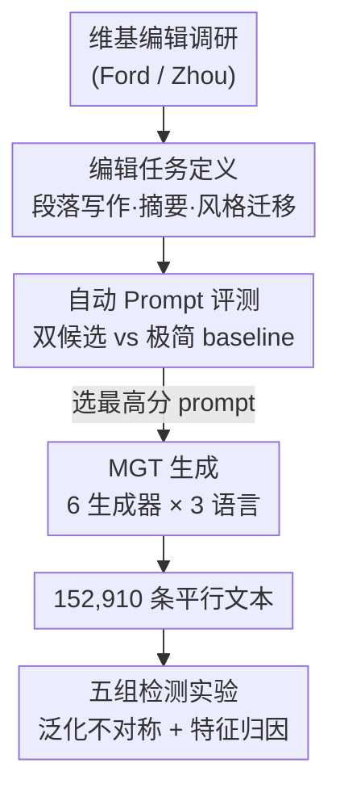

# TSM-Bench: Detecting LLM-Generated Text in Real-World Wikipedia Editing Practices

**会议**: ICLR 2026  
**OpenReview**: [https://openreview.net/forum?id=zimuL7ZmIi](https://openreview.net/forum?id=zimuL7ZmIi)  
**代码**: https://github.com (论文称已开源，仓库地址见正文)  
**领域**: AIGC检测 / 机器生成文本检测 / NLP理解  
**关键词**: MGT检测、维基百科、任务特定生成、多语言基准、泛化不对称

## 一句话总结
作者指出现有机器生成文本（MGT）检测基准都用「写一篇关于机器学习的文章」这类自由生成的 prompt，而真实维基百科编辑其实是用 LLM 做摘要、续写、中立化改写这类**受约束的任务特定生成**——这种文本和人写文本更像，于是构建了覆盖 3 语言 / 4 任务 / 6 生成器 / 12 检测器、含 152,910 条平行文本的 TSM-Bench，证明所有 SOTA 检测器在任务特定数据上准确率比通用数据掉 10–40%，且存在「任务特定数据能泛化到通用数据、反之不行」的不对称。

## 研究背景与动机
**领域现状**：维基百科是 AI 社区最重要的高质量多语种人写语料之一，几乎进了所有 LLM 的训练集。但 Wikimedia 基金会警告 MGT 在维基百科上扩散会侵蚀其知识完整性，甚至可能让在污染数据上训练的模型逐步退化乃至「模型崩溃」。因此自动区分 MGT 与人写文本（HWT）成了活跃研究方向，社区也积累了 TuringBench、MULTITuDE、MAGE、M4 / M4GT 等一批检测基准。

**现有痛点**：这些基准几乎都用**通用生成 prompt**（generic generation），即「写一篇关于神经网络的文章」这种自由发挥、几乎不带约束的指令。但真实编辑场景完全不是这样：编辑实际是让 LLM 做摘要、续写段落、把带偏见的句子改中立这类**有明确任务定义、且带上下文条件**的活儿。

**核心矛盾**：通用生成和任务特定生成（task-specific generation）产出的文本性质不同——前者在用词和语义上往往离人写文本较远，后者因为受任务约束和上下文限定，**在风格和含义上都更贴近人写文本**。论文用 Levenshtein 距离、余弦相似度、unigram 重叠、困惑度四个指标证实：任务特定 MGT 的分布明显比通用 MGT 更靠近 HWT。而检测理论早已表明，当人写与机器分布之间的总变差距离收窄时，检测性能必然下降。换句话说，现有基准都在「简单模式」下评测，系统性高估了检测器的真实可用性。

**本文目标**：把 MGT 检测评测从「通用生成」搬到「贴近真实编辑实践的任务特定生成」上，回答三个子问题——(1) SOTA 检测器在任务特定 MGT 上到底掉多少？(2) 在通用数据上训练的检测器能不能泛化到任务特定数据（反之呢）？(3) 通用 vs 任务特定训练让模型学到了什么不同的特征？

**切入角度**：作者从 Ford et al. (2023) 和 Zhou et al. (2025) 对维基百科编辑 LLM 使用习惯的实证调研出发，把真实编辑行为归纳成三类（四个子任务）写作任务，用它们来生成「像真的」的 MGT，而非靠对抗扰动事后造难样本。

**核心 idea**：用「编辑真实会用 LLM 做的受约束任务」来生成 MGT，建立一个多语言 / 多生成器 / 多任务的检测基准 TSM-Bench，暴露现有检测器在真实场景下的不可靠，并揭示训练数据分布对泛化方向的决定性影响。

## 方法详解

### 整体框架
TSM-Bench 本质是一个**基准构建 + 系统评测**的流水线，目标是产出 152,910 条「人写 / 机器写」平行文本，并在其上把 12 个检测器扒个底朝天。整条流水线分四步：① 基于编辑调研定义编辑任务；② 为每个任务从 NLG 文献里挑两套候选 prompt，用自动指标和一个极简 baseline 比较，选出最高分 prompt；③ 用最优 prompt 驱动 6 个生成器在 3 语言上批量生成 MGT；④ 跑五组实验，分别考察现成检测器、零样本/监督检测器、跨域泛化、特征归因、跨任务泛化。

这里有一个贯穿全文的关键区分：**任务定义**。给定语言模型 $f_\theta$，通用生成写作 $o_{gt} = f_\theta(g_t)$，其中 $g_t$ 是几乎不带约束的自由 prompt；任务特定生成写作 $o_{ts} = f_\theta(i_t, C_t)$，其中 $i_t$ 是详细的任务指令、$C_t$ 是该任务的上下文（如检索到的证据段落、待改写的偏见句）。整个基准就建立在 $o_{ts}$ 这一侧。MGT 检测则被形式化为二分类：检测器学一个打分函数 $f: X \to \mathbb{R}$，对阈值 $\tau$ 输出 $\hat{y} = 1$ 当 $f(x) \ge \tau$。

### 关键设计

**1. 三类（四子任务）真实编辑任务：让 MGT 贴近编辑真实在做的事**

现有基准的 MGT 离人写文本太远，根子在于生成任务太宽松。作者据编辑调研把任务收敛到三类、四个子任务。**段落写作（Paragraph Writing）**拆成两个子任务：「引导段（Introductory Paragraph）」写一个新章节的开头段，全是机器文本；「段落续写（Paragraph Continuation）」接着一段不完整的人写段落往下写，是人写 + 机器写**混合文本**，专门用来考验检测器在人机交织时的表现。**摘要（Summarisation）**让模型基于文章正文生成一段长度与人写参考相当的导言段（lead section），按维基的 Manual of Style 当成单文档抽象式摘要来做。**文本风格迁移（TST）**定义为中立化（neutralise）违反 NPOV 中立观点政策的句子——给一个带偏见的句子/段落，让模型按维基中立性指南改写，直接对齐维基核心内容政策。这套任务设计的价值在于：它不是凭空造难样本，而是复刻编辑真实的工作流，因此生成的 MGT「天然地」更像人写文本。

**2. 自动 Prompt 评测：用指标挑出「最像真人」的生成 prompt，而非随手写一个**

任务定下来后，每个任务用什么 prompt 直接决定 MGT 质量。作者不拍脑袋，而是为每个任务从 NLG 文献里取两套有效 prompt，加上一个极简 baseline，三者放在一起用自动指标比。段落写作的候选是：Minimal（只给文章和章节标题）、Content Prompts（额外塞进至多十个关于目标段的内容问题）、Naive RAG（在 Content Prompts 上再增检索到的相关内容）；摘要和 TST 用结构类似的 Minimal / Instruction（补上 lead section 或 NPOV 政策的详细定义）/ Few-shot。评测指标用 BLEU、ROUGE 测 n-gram 重叠，BERTScore 测语义相似，段落写作和摘要另用 QAFactEval 测事实性，TST 则微调语言模型做二分类风格准确率。在 10% 长度分层样本上用 GPT-4o mini 评测，最终选出：段落写作 → RAG、摘要 → One-shot、TST → Five-shot。结论很直接：上下文越丰富、指令越详细，生成文本质量越高、越像人写，这恰恰说明任务特定 MGT 比通用 MGT 更难检测。

**3. 多语言 / 多生成器的平行语料构建：把「难」做成系统覆盖而非个例**

为了让结论站得住，基准在两个维度上铺开。**语言**选英语、葡萄牙语、越南语三种不同资源水平的语言，资源水平由两个指标界定——活跃维基用户数、以及该语言在 Common Crawl 语料中的占比，目的是研究英语维基之外的社区。人写语料用 WikiPS（段落与摘要-文章对）和 mWNC（WNC 的多语言扩展），每个任务每种语言随机抽 2,700 条 HWT，并按长度三分位平衡。**生成器**用 6 个不同规模的模型：GPT-4o、GPT-4o mini、Gemini 2.0 Flash、DeepSeek 四个 LLM，外加 Qwen2.5-7B、Mistral-7B 两个 SLM。每个「任务–语言」子集都用各自最优 prompt 在 6 个生成器上跑一遍，最终汇成 152,910 条平行文本。平行结构（同一条人写文本对应机器改写）让评测能用准确率作主指标，也让跨任务、跨域比较干净可控。

### 损失函数 / 训练策略
这是一篇基准/评测论文，无新模型训练目标。评测侧：监督检测器（XLM-RoBERTa、mDeBERTa）按每个「任务–语言–生成器」配置做超参搜索微调；零样本方法用 Youden's J 标定最优分类阈值。共评测 12 个检测器——现成检测器 RADAR、Binoculars、Desklib、e5-small；零样本白盒 Binoculars、LLR、FastDetectGPT(WB)；零样本黑盒 BiScope、Revise-Detect、GECScore、FastDetectGPT(BB)。

## 实验关键数据

### 主实验
五组实验的核心发现：现成检测器在通用数据上 >93% 几乎完美，一到任务特定数据就崩。

| 检测器 | 通用数据 ACC | 引导段 | 段落续写 | 摘要 | 风格迁移 |
|--------|------|------|------|------|------|
| Binoculars | 0.97 | 0.56 | 0.47 | 0.58 | 0.53 |
| Desklib | 0.93 | 0.73 | 0.67 | 0.72 | 0.55 |
| RADAR | 0.92 | 0.61 | 0.58 | 0.54 | 0.55 |
| e5-small | 0.98 | 0.68 | 0.68 | 0.70 | 0.56 |

通用数据上四个检测器全在 0.92–0.98，搬到任务特定数据后掉到 0.47–0.73，风格迁移（中立化）任务尤其惨，几乎全部贴近 0.55 的随机水平。

按检测器族系看（Experiment 2，6 生成器平均的监督模型平均准确率）：

| 任务 | 监督检测器均值 ACC | 零样本最佳 |
|------|------|------|
| 引导段 | 85.9% | 白盒 Binoculars 61.8% / 黑盒 GECScore 69.7% |
| 段落续写 | ~86% | 多数零样本掉到接近随机（BiScope 例外） |
| 摘要 | 89.8–91.8% | BiScope 69.7% / Binoculars 64.8% |
| 句级 TST | 65.1% | GECScore 64.2%（罕见地接近监督） |

监督模型整体在 79.7–91.8% 之间（句级 TST 除外），零样本平均不超过 64.7%。摘要任务检测分最高，因为维基导言段有独特风格、给检测器留了强线索；段落续写因人机文本混合打乱了零样本方法依赖的统计差异，多数零样本掉到接近随机；句级 TST 最难，但改成段落级（English P.）后监督检测器准确率猛涨 15.7%。

### 泛化与特征分析

| 实验 | 关键结论 | 代表数字 |
|------|---------|---------|
| Exp 3 跨域泛化 | **泛化不对称**：任务特定数据训练→能泛化到通用数据（域内+跨域）；通用数据训练→连同域任务特定数据都泛化不了 | 英语任务特定训练跨测试集均值 89.7%；通用数据训练最高仅 73.3% |
| Exp 4 特征归因(SHAP) | 通用数据训练的模型过拟合到表层格式线索（如「==」「#」章节标记）；任务特定训练更倚重语义 token | 通用模型最高 SHAP 特征为「==」(4.7)、「#」(3.6) |
| Exp 5 跨任务泛化 | 跨任务普遍低，不同任务留下不同的 MGT 痕迹 | 英语跨任务均值：摘要 72.1% / 引导段 60.5% / 另两任务接近随机 |

### 关键发现
- **泛化不对称是全文最重磅的发现**：在任务特定数据上微调的 mDeBERTa 能很好泛化到通用 MGT（域内域外都行），反过来在通用数据上微调却连同域的任务特定数据都识别不了——这直接说明现有基准（全是通用数据）训练出来的检测器在真实场景下不可靠。
- **过拟合表层 artefact**：SHAP 分析揭示通用数据训练的模型靠「==」「#」这类章节格式标记来判别，而非语义——这解释了它「域内强、域外弱」的怪象，也坐实了通用基准会高估检测性能。
- **任务难度梯度清晰**：摘要最好检测（维基导言段风格独特），段落续写因人机混合而打乱零样本统计信号，句级 TST 最难（粒度太细），同样内容做成段落级立刻好检测很多。

## 亮点与洞察
- **把「难度」从对抗扰动换成「真实任务约束」**：以往造难样本靠事后对抗攻击，本文论证任务特定生成产生的样本更真实也更难，因为难来自真实使用模式而非人为扰动——这是更有说服力的「现实主义」难度。
- **泛化方向的不对称性可直接指导实践**：既然任务特定数据能向上覆盖通用数据、反之不行，那训练未来检测器就该用「多种真实写作任务的混合数据」，而不是省事用通用 prompt 批量造。这个结论可迁移到任何 UGC 平台的内容审核检测器训练。
- **SHAP 揭示「检测器在偷看格式」**：用可解释性把「为什么通用训练会高估」讲透——检测器学的是「==」这种维基排版残留而非生成文本本质，提醒整个领域评测时要警惕表层捷径。

## 局限与展望
- **任务覆盖有限**：只选了三类编辑任务，翻译等同样重要的任务没纳入；且任务来自对编辑 LLM 使用的定性调研，无法保证所有编辑都按这几种方式用 LLM。
- **TST 风格分类器偏弱**：用于 TST prompt 评测的部分风格分类器即便大量微调表现仍不佳，NPOV 风格分类本身就很难，可能影响该任务的评测可信度。
- **未深究文本长度的影响**：作者按长度分层来规避混淆，但没细究长度如何影响任务特定 MGT 检测，留作未来工作。
- **自评补充**：12 个检测器虽多但仍是某一时间点快照，新一代检测器是否依旧崩需持续维护；另外结论高度依赖维基百科语料风格，迁移到论坛、社交评论等其他 UGC 平台的程度还需更多验证（论文 Exp 3 已部分涉及但域仍有限）。

## 相关工作与启发
- **vs 通用 MGT 基准（MAGE / M4 / M4GT / MULTITuDE 等）**：它们用通用自由生成 prompt 评测、报告近乎完美的检测准确率；本文证明这类评测系统性高估了真实可用性，把场景换成任务特定生成后准确率掉 10–40%。
- **vs 对抗攻击类工作（He et al. 2024 / Wu et al. 2024 / Zheng et al. 2025）**：它们靠生成后施加对抗扰动来降低检测性能；本文的数据更难也更真实，难度来自真实任务约束而非人为扰动。
- **vs 作者前作（Quaremba et al. 2025，WikiPS + mWNC）**：本文在其基础上扩展了更多任务、检测器和 LLM，并新增 SOTA 检测器评测、域内/跨域与跨任务泛化、特征归因等更系统的实验。

## 评分
- 新颖性: ⭐⭐⭐⭐ 把检测评测从「通用生成」搬到「真实编辑任务特定生成」，并揭示泛化不对称，视角扎实且有现实意义。
- 实验充分度: ⭐⭐⭐⭐⭐ 3 语言 × 4 任务 × 6 生成器 × 12 检测器 + 五组实验（含跨域、跨任务、SHAP 归因），覆盖面非常广。
- 写作质量: ⭐⭐⭐⭐ 任务定义、形式化和结论链条清晰，图表略密但论证完整。
- 价值: ⭐⭐⭐⭐⭐ 直接给 UGC 平台内容审核敲警钟，并给出「用任务特定混合数据训练检测器」的可落地建议，基准本身也可持续维护扩展。

<!-- RELATED:START -->

## 相关论文

- [\[ACL 2026\] DetectRL-X: Towards Reliable Multilingual and Real-World LLM-Generated Text Detection](../../ACL2026/aigc_detection/detectrl-x_towards_reliable_multilingual_and_real-world_llm-generated_text_detec.md)
- [\[ICLR 2026\] Learn-to-Distance: Distance Learning for Detecting LLM-Generated Text](learn-to-distance_distance_learning_for_detecting_llm-generated_text.md)
- [\[ACL 2026\] C-ReD: A Comprehensive Chinese Benchmark for AI-Generated Text Detection Derived from Real-World Prompts](../../ACL2026/aigc_detection/c-red_a_comprehensive_chinese_benchmark_for_ai-generated_text_detection_derived_.md)
- [\[ICLR 2026\] EditLens: Quantifying the Extent of AI Editing in Text](editlens_quantifying_the_extent_of_ai_editing_in_text.md)
- [\[ICLR 2026\] HLD: Approximate Hierarchical Linguistic Distribution Modeling for LLM-Generated Text Detection](hld_approximate_hierarchical_linguistic_distribution_modeling_for_llm-generated_.md)

<!-- RELATED:END -->
