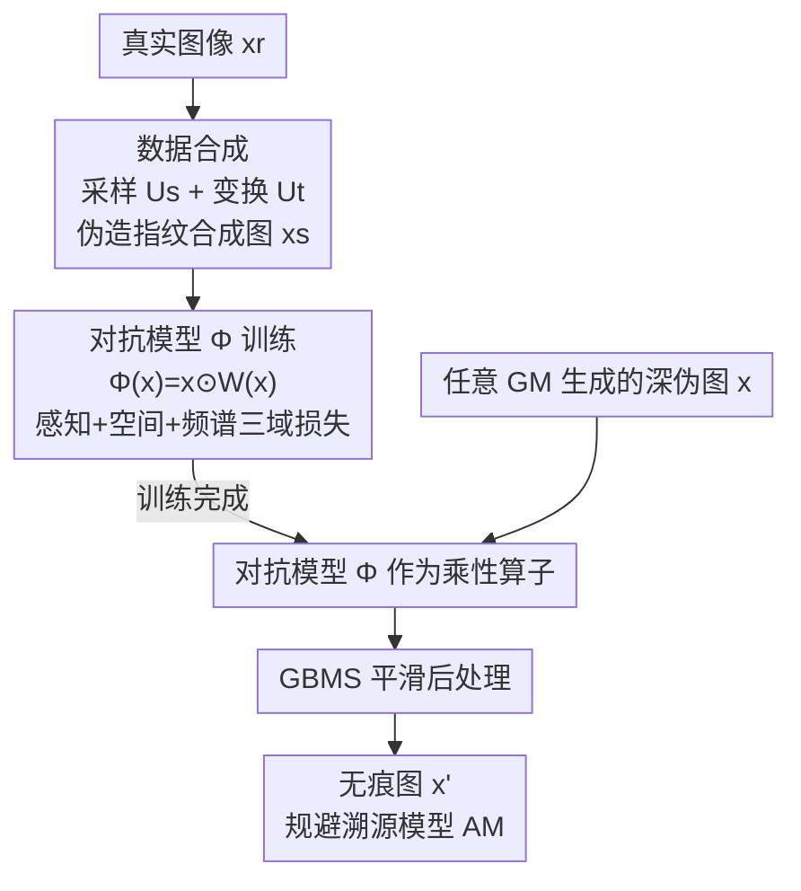

# Untraceable DeepFakes via Traceable Fingerprint Elimination

**会议**: ICLR 2026  
**OpenReview**: [https://openreview.net/forum?id=LkWsQ3Tawx](https://openreview.net/forum?id=LkWsQ3Tawx)  
**领域**: AIGC检测 / 深度伪造溯源 / 对抗攻击  
**关键词**: 深度伪造溯源, 模型指纹, 乘性攻击, 反取证, 黑盒攻击

## 一句话总结
本文指出现有规避溯源的攻击都是"加性"的——只能遮挡却无法消除生成模型留在图像里的指纹，因而容易被对抗训练防住；作者转而提出"乘性攻击"，用一个仅靠真实数据训练的对抗网络把指纹从根上抹掉，在 12 个生成模型、6 个溯源模型上取得 97.08% 的平均攻击成功率（ASR），即使面对防御仍超过 72.39%。

## 研究背景与动机

**领域现状**：深度伪造溯源（DeepFakes attribution）比单纯的真假检测更进一步——它要从图像里提取出生成模型（GM）留下的"模型指纹"（model fingerprint），从而判定这张假图是哪个模型、哪类架构生成的。这类技术对追责和版权保护很有价值，于是又催生了"溯源攻击"（attribution attack），专门探查溯源模型（AM）的脆弱性。

**现有痛点**：作者通过分析和预实验发现，现有攻击（PGD、TraceEvader、FakePolisher 等）本质上都是**加性攻击**——往图像里加一层扰动 $p$，即 $T_{add}(x)=x+p$。这种做法只是"搅浑"了指纹、增加了提取难度，但指纹本身仍完整保留在图里。结果就是它们极其脆弱：防御方只要用对抗训练增强溯源模型，攻击就失效——例如 TraceEvader 的 ASR 会从 98.28% 暴跌到 25.10%；频域分析也显示被攻击图像和原图在频谱上依旧高度相似。

**核心矛盾**：真正的"不可溯源"要求**消除指纹**而非遮挡指纹，但消除会面临三重困难——① 指纹消除与视觉不可感知之间的权衡（改得越多越好攻击，但画质会塌）；② 生成模型种类繁多、指纹各异，不可能为每个模型定制方法；③ 实战中攻击者根本不知道防御方用的是哪个溯源模型，必须是黑盒、模型无关的。

**切入角度**：作者借鉴相机指纹研究，把生成图像建模为 $x = x_0 + x_0 f_M + \Theta$，其中 $x_0$ 是视觉内容、$f_M$ 是模型 $M$ 的指纹、$\Theta$ 是其他噪声。关键观察是：**生成模型的指纹不是独立噪声，而是与图像内容耦合（content-coupled）的结构化调制**——它来自上/下采样这类依赖内容的操作，表现为网格状的周期纹理。既然指纹是"乘"在内容上的调制，那就该用"乘"的方式去破坏它。

**核心 idea**：用一个对抗矩阵 $W$ 做**乘性攻击** $T_{mul}(x)=x\odot W$，直接扰乱内容耦合的调制机制，把原指纹 $f_M$ 改成 $f'_M=f_M\odot W\neq f_M$，从源头消除可溯源信息；并把 $W$ 参数化成一个只用真实数据训练的神经网络，实现通用、黑盒、可证明不可逆的指纹消除。

## 方法详解

### 整体框架

整个方法分两层：**理论层**先证明"乘性攻击能可证地消除指纹、且统计上不可逆"，为攻击的有效性和抗防御性奠基；**框架层**再用一条只依赖真实数据的端到端流水线，把这个乘性矩阵 $W$ 学成一个对抗网络 $\Phi$。

流水线由三个紧耦合模块串成：① **数据合成**——对真实图像施加采样和变换操作，伪造出"长得像深伪指纹"的合成图 $x_s$，从而在完全不接触任何生成模型的前提下模拟出各类指纹；② **模型构建**——用真实/合成图对 $(x_r, x_s)$ 训练对抗网络 $\Phi$，让它学会从合成图里抹掉人造指纹、同时保住视觉保真度，训练靠感知、空间、频谱三域联合损失驱动；③ **指纹消除（推理）**——训练好的 $\Phi$ 直接当作参数化的乘性算子，对任意生成模型产出的深伪图 $x$ 做一次前向，再叠加一道平滑后处理，输出无痕图 $x'$。贯穿三个模块的核心原则始终是"消除（eliminate）而非遮挡（obscure）"。

### 关键设计

**1. 乘性攻击：用内容耦合的结构先验从根上消除指纹**

这一设计针对的是"加性攻击只遮不消、易被防御"的根本缺陷。作者先在理论上把攻击分类：加性攻击 $T_{add}(x)=x_0+f_M+p+\Theta$ 里指纹 $f_M$ 原封不动，所以对抗训练一上就能把它识破。而乘性攻击 $T_{mul}(x)=x\odot W$ 展开后变成 $x_0\odot W + f_M\odot W + \Theta$，指纹项被改写为 $f'_M=f_M\odot W$，只要优化 $W$ 让 $f'_M\neq f_M$，源模型就再也对不上——因为可溯源的残留信息已被抹除。

这之所以成立，正是因为指纹是**内容耦合的调制**（来自上采样等内容相关操作的网格状纹理），乘法正好直接作用在这套调制机制上。作者进一步给出两条理论保证：一是证明这样的对抗矩阵 $W$ 必然存在（既能骗过溯源模型 $F$ 又能保住画质，见原文 Theorem 1，⚠️ 证明以原文为准）；二是证明乘性攻击**统计不可逆**——无配对数据时反演 $x$ 是不可辨识的，即便有 $N$ 对配对样本，按逐像素高斯模型，任何无偏估计满足 $\mathrm{Var}(\hat{W}_j)\geq \sigma^2/(N\,\mathbb{E}[x_j^2])$，要把 MSE 压到 $\varepsilon^2$ 需要 $N\gtrsim \sigma^2/(\varepsilon^2\mathbb{E}[x_j^2])$ 这种不切实际的样本量。这就解释了为什么它天然能扛住防御。

**2. 仅用真实数据合成指纹模仿样本**

要训练一个能消除指纹的网络，最直接的想法是拿大量"真图 + 深伪图"配对来学，但这要求攻击者能访问各种生成模型、还得知道目标溯源模型——违背了通用和黑盒的目标。作者的破局点是：**生成模型的指纹主要来自采样和变换操作的副产物**，那就用同类操作在真实图像上人造出相似的指纹，从而绕开对生成模型的依赖。

数据合成模块先后过两个单元。**采样单元 $U_s$** 用最近邻、双线性、双三次三种插值：把真图 $x_r$ 先下采样到一半尺寸 $x_{down}$ 再上采样回原尺寸 $x_{up}$，以概率 $p_1$ 随机施加、且 $s_{down},s_{up}$ 随机选取，以引入多样的网格状空间伪影。**变换单元 $U_t$** 再从一组操作里随机选一个以概率 $p_2$ 施加：高斯噪声（$\sigma^2\in[5,20]$）、高斯滤波（核 $\{1,3,5\}$）、随机裁剪（偏移 5–20%）、JPEG 压缩（质量 $[10,75]$）、重打光（亮度/对比度/饱和度 $[0.5,1.5]$），以及把这些按序组合。其依据是模糊、加噪等核操作在数学上与生成模型里的卷积/采样高度相似，因此留下的痕迹也类似指纹。这样合成出的 $x_s$ 就成了训练 $\Phi$ 的"带指纹样本"。

**3. 参数化乘性矩阵与多域消除损失**

理论保证了 $W$ 存在，但直接优化一个矩阵有两个硬伤：① 为每张输入存一个 $W$ 在存储和计算上都不可行，何况溯源模型还不可访问、没法优化；② 在单张图上优化出的固定 $W$ 泛化不了，因为不同生成模型的指纹模式各异。作者的做法是把 $W$ 参数化成**输入相关的函数** $W(x)$，用一个紧凑的编码器-解码器网络 $\Phi$ 实现 $\Phi(x)=x\odot W(x)$（编码器 3 层卷积 + 5 个残差块，解码器 2 个上采样层 + 1 卷积层）——既只需存固定参数、又因输入相关而天然具备跨模型泛化能力，同时保留了乘性结构和数值稳定性。

网络在 $(x_r, x_s)$ 对上端到端训练，损失显式分解为保真和消除两路。**保真**用预训练 VGG-16 的感知损失 $L_{perceptual}=\sum_i w_i\|f^i_{\Phi(x_s)}-f^i_{x_r}\|^2$ 维持语义。**指纹消除**双管齐下：空间损失 $L_{spatial}=\|\Phi(x_s)-x_r\|^2$ 抹掉像素域低级伪影；多尺度频谱损失在 $s\in\{1,0.5,0.25\}$ 三个尺度上对图像做傅里叶变换、取对数幅度后比对，$L_{spectral}=\sum_{s_i} w_i\|L(\Phi(x_s),s_i)-L(x_r,s_i)\|_1$（其中 $L(x,s_i)=\log(|\mathrm{fft}(x_{s_i})|+\varepsilon)$，权重 $\{0.5,0.3,0.2\}$），专攻频域的网格状指纹。总损失 $L_{total}=\beta_1 L_{perceptual}+\beta_2 L_{spatial}+\beta_3 L_{spectral}$。推理阶段还额外叠一道 **GBMS 平滑**（高斯模糊 + 均值漂移滤波）$G(\cdot)$ 去除残余瑕疵，最终 $x'=G(\Phi(x))$，进一步提升规避能力。

### 损失函数 / 训练策略
总损失 $L_{total}=\beta_1 L_{perceptual}+\beta_2 L_{spatial}+\beta_3 L_{spectral}$，最优权重经实验定为 $(\beta_1,\beta_2,\beta_3)=(0.5,0.1,0.4)$。整个训练**只用真实数据**，不接触任何深伪图、生成模型或溯源模型，因此天然满足通用与黑盒。

## 实验关键数据

实验覆盖 7 个 GAN、5 个扩散模型（共 12 个 GM）、4 个数据集，对抗 6 个先进溯源模型（DNA-Det、AttNet、DCT、Reverse、POSE、LTracer），并与 8 种攻击方法比较（含 PGD/BIM/MIFGSM/DiffAttack 等迁移攻击、Transformation/FakePolisher/TraceEvader 等黑盒方法、以及一个再生成攻击）。

### 主实验

| 攻击方法 | 平均 ASR(%) | SSIM | LPIPS |
|----------|------------|------|-------|
| DiffAttack | 62.24 | 0.962 | 0.095 |
| Transformation | 67.60 | 0.941 | 0.151 |
| FakePolisher | 71.17 | 0.994 | 0.067 |
| Regeneration | 78.60 | 0.912 | 0.210 |
| TraceEvader（前 SOTA） | 87.11 | **0.995** | **0.038** |
| **本文** | **97.08** | 0.963 | 0.093 |

本文在 6 个溯源模型上取得最高平均 ASR 97.08%，比 TraceEvader 高出近 10 个百分点，且在 DCT、AttNet 等上达到 100% ASR；画质与 TraceEvader 同档（SSIM 0.963 / LPIPS 0.093）。在对扩散模型的专门测试（DNA-Det-DMs）上接近 100% ASR，验证了对 DM 指纹的消除能力。

### 抗防御实验

| 防御场景 | 本文 ASR(%) | 对照（同场景）|
|----------|------------|--------------|
| 对抗训练·黑盒 | >72.39 | 加性攻击大幅下滑 |
| 对抗训练·白盒（防御方直接用本文样本增强） | **100.0** | TraceEvader 仅 25.1 |
| 近似反演（用神经网络复原原图） | 97.68 / 99.97 | —— |

最反直觉的结果是白盒场景：即便防御方直接拿本文生成的对抗图去增强 DNA-Det，也毫无缓解效果，ASR 反而到 100%——因为对抗图里已经不含任何源模型信息，对抗训练学不到可用的判别线索。

### 消融实验

| 配置 | 平均 ASR(%) | 说明 |
|------|------------|------|
| Full | 97.08 | 完整模型 |
| w/o $U_s$（采样单元） | 95.32 | 去掉采样合成 |
| w/o $U_t$（变换单元） | 93.80 | 去掉变换合成 |
| w/o GBMS（平滑后处理） | 89.82 | 仍是 SOTA，但掉 ~7.3 点 |
| w/o $L_{spatial}$ | 94.21 | 去空间损失 |
| w/o $L_{spectral}$ | 80.31 | 对 Reverse 仅 50.04% |

### 关键发现
- **频谱损失贡献最大**：去掉 $L_{spectral}$ 平均 ASR 从 97.08% 掉到 80.31%，对 Reverse 溯源模型更是只剩 50.04%——印证了指纹主要藏在频域、必须显式在频域消除。
- **乘性本质的实证**：残差 $\Delta=T(x)-x$ 的分析显示，本文残差方差大（L2 距离主要落在 [10,30]）、且与原图的皮尔逊相关系数 |PCC| 主要落在 [0.5,1]，符合 $\Delta=x\odot(W-1)$ 的乘性特征；而 TraceEvader 残差稳定、PCC 落在 [0,0.25]，是典型加性。
- **效率优势**：单次前向即可同时规避所有溯源模型，生成 2 万张对抗图仅需 60.6s，远快于 TraceEvader 的 732.7s。
- **权重敏感性**：$(\beta_1,\beta_2,\beta_3)=(0.5,0.1,0.4)$ 为最优，ASR 97.1% 且 SSIM/LPIPS 在 0.963–0.964 / 0.092–0.097 间稳定。

## 亮点与洞察
- **把攻击范式从"加性"提升到"乘性"**：一句话点破了所有现有攻击的共性缺陷（只遮不消），并用内容耦合先验给出乘法这个对症的破解算子，是漂亮的"重新定义问题"。
- **理论 + 实证双线坐实"不可逆"**：不仅给出统计不可逆的样本量下界，还用残差方差和 PCC 分布从数据上验证了攻击确实是乘性的——攻击有效性有了可解释的根据。
- **只用真实数据训练**：用采样/变换操作伪造"类指纹"来摆脱对生成模型和溯源模型的依赖，这套"自造训练信号"的思路可迁移到其他需要黑盒、跨模型泛化的反取证/对抗任务。
- **白盒防御反而 100% ASR**：当攻击真正抹掉了源信息，对抗训练这种依赖"可学线索"的防御就彻底失灵——这是对防御方很有警示意义的结论。

## 局限与展望
- 作者承认：彻底消除指纹比加性扰动需要更多结构性修改，因此画质略逊于 TraceEvader（虽仍优于多数方法），未来想做更省失真的消除机制。
- 自己发现的局限：方法本质是"反取证攻击工具"，伦理风险显著（作者专门写了 Ethics Statement）；所有指纹消除的有效性依赖"指纹是内容耦合调制"这一结构先验，若未来生成模型的指纹特性变化（如非采样来源的指纹），乘性假设可能不再完全成立。
- 改进思路：探索攻防协同演化（co-evolution）的防御机制；从防御侧看，也许需要超越"反演/对抗训练"的全新溯源范式才能应对乘性攻击。

## 相关工作与启发
- **vs TraceEvader**：两者都是通用黑盒攻击，但 TraceEvader 往高频加扰动、对低频模糊，本质仍是加性、只是搅浑指纹，因此对抗训练后 ASR 从 98.28% 崩到 25.10%；本文从根上消除指纹，对抗训练后仍 >72.39%，且乘性使其统计不可逆。
- **vs FakePolisher / StealthDiffusion**：它们也走"减少伪影而非加扰动"的路线，但目标是骗过真假检测器、且不保证消除溯源指纹；本文显式面向溯源模型，并用频谱损失定点清除频域指纹。
- **vs 再生成攻击（Regeneration）**：再生成在部分溯源模型上 ASR 尚可，但对 POSE/LTracer 分别掉到 39.71%/0.0%，因为它会把重建网络自身的指纹印到图上；本文的乘性算子不引入新的可溯源指纹，泛化更稳。

## 评分
- 新颖性: ⭐⭐⭐⭐⭐ 把"加性 vs 乘性"提炼为攻击范式的分水岭，并配上存在性与不可逆性的理论，视角新颖。
- 实验充分度: ⭐⭐⭐⭐⭐ 12 GM × 6 AM × 多防御场景 + 残差/频域定量分析，证据链完整。
- 写作质量: ⭐⭐⭐⭐ 逻辑清晰、动机—理论—框架层层递进，但部分理论细节需查附录。
- 价值: ⭐⭐⭐⭐ 揭示了乘性攻击这一现实威胁、对溯源防御有强警示价值；但本质是攻击工具，正向价值需配套防御研究兑现。

<!-- RELATED:START -->

## 相关论文

- [\[ICLR 2026\] RelayFormer: A Unified Local-Global Attention Framework for Scalable Image and Video Manipulation Localization](relayformer_a_unified_local-global_attention_framework_for_scalable_image_and_vi.md)
- [\[ICLR 2026\] Enabling Your Forensic Detector Know How Well It Performs on Distorted Samples](enabling_your_forensic_detector_know_how_well_it_performs_on_distorted_samples.md)
- [\[ICLR 2026\] DMAP: A Distribution Map for Text](dmap_a_distribution_map_for_text.md)
- [\[ICLR 2026\] Unveiling Perceptual Artifacts: A Fine-Grained Benchmark for Interpretable AI-Generated Image Detection](unveiling_perceptual_artifacts_a_fine-grained_benchmark_for_interpretable_ai-gen.md)
- [\[ICLR 2026\] Omni-IML: Towards Unified Interpretable Image Manipulation Localization](omni-iml_towards_unified_interpretable_image_manipulation_localization.md)

<!-- RELATED:END -->
