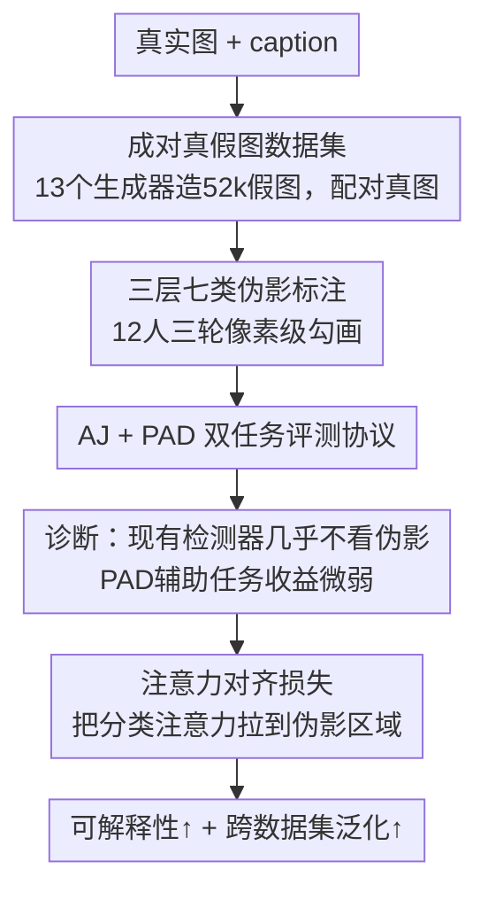

# Unveiling Perceptual Artifacts: A Fine-Grained Benchmark for Interpretable AI-Generated Image Detection

**会议**: ICLR 2026  
**OpenReview**: [https://openreview.net/forum?id=Tk8ujiOgHM](https://openreview.net/forum?id=Tk8ujiOgHM)  
**代码**: https://github.com/Coxy7/X-AIGD  
**领域**: AIGC检测 / 可解释性 / 评测基准  
**关键词**: AI生成图检测, 感知伪影, 像素级标注, 注意力对齐, 可解释性

## 一句话总结
针对现有 AI 生成图（AIGI）检测器只会输出"真/假"二分类、给不出依据的问题，本文构建了带像素级、三层七类伪影标注的成对真假图基准 X-AIGD，系统诊断出现有检测器"几乎不看感知伪影"，并提出把分类注意力显式对齐到伪影区域的训练方法，在跨数据集泛化上明显涨点。

## 研究背景与动机

**领域现状**：AIGI 检测主流是把"真图 vs 生成图"当成二分类，靠手工或学到的低层指纹特征（上采样痕迹、频域特征等）做判断。近期一批工作开始借多模态大模型（MLLM）给检测结果生成文字解释，试图增加可解释性。

**现有痛点**：二分类检测器虽然在特定数据集上准确率高，但只给一个 0/1 标签、说不出"凭哪块伪影判它是假的"，泛化也差、易被结构/内容扰动击穿。MLLM 路线的解释又多半是用 GPT-4o 等更强模型自动标注训练出来的，既不可靠也缺空间定位——它的文字解释和图像里真正出问题的区域对不上。少数提供人工定位标注的数据集（LOKI、SynthScars）则把"伪影定位"和"真假判定"当成两个割裂任务，且大多没有配对真图，伪影类别也粗。

**核心矛盾**：要评测"检测器到底有没有在看人类能理解的视觉证据"，需要一个既有**配对真假图**（控制语义、排除"靠整体语义猜"）、又有**细粒度、定位到像素、分好类**的伪影标注的基准——而这样的数据集此前不存在，导致可解释 AIGI 检测的研究一直被卡住。

**本文目标**：(1) 造一个能做细粒度可解释性评测的基准；(2) 用它诊断现有检测器是否、以及如何利用感知伪影；(3) 探索能真正把判定依据落到伪影上的训练方法。

**切入角度**：作者认为"感知伪影"是人类辨别假图最自然、也最可迁移的线索，于是把它系统化成一套**三层级（低层失真 / 高层语义 / 认知层反事实）七类别**的分类体系，并请人工逐像素勾画。有了这套 ground truth，就能定量回答"模型注意力和人类感知到的伪影对得齐不齐"。

**核心 idea**：先用细粒度伪影标注暴露"检测器其实没在看伪影"这一事实，再用一个**注意力对齐损失**把分类注意力直接拉到标注的伪影区域，从而同时提升可解释性与泛化。

## 方法详解

### 整体框架
本文不是一个单一模型，而是"建基准 → 诊断 → 改进"三段递进的研究：先收集成对真假图并做三层七类的像素级人工标注，得到 X-AIGD；在其上定义真假判定（AJ）与感知伪影检测（PAD）两个子任务，用它们诊断现有检测器，发现它们几乎不依赖伪影；进而探索把 PAD 当辅助任务（迁移/多任务），发现收益微弱；最后提出显式注意力对齐，把分类注意力直接约束到伪影区域。

### 关键设计

**1. 成对真假图 + 像素级伪影标注的数据集：让"看证据"变得可量化**

要诊断检测器是否真的在看伪影，先得有一份"人类认为哪里是伪影"的可靠 ground truth，而且真假图必须语义对齐，才能排除模型"靠整体语义猜真假"的捷径。为此作者从 MSCOCO、LAION-Aesthetic、Conceptual Captions、SA-1B 四个数据集取真实图，抽取不同详略程度的 caption 当生成提示，用 13 个先进文生图模型（PixArt-α、FLUX.1-dev、SD 3.5 等，含 Civitai 社区微调的写实模型）配合提示工程压制非写实风格，得到 4,000 张真图 + 每个生成器 4,000 张共 52,000 张假图，与真图一一配对。标注上请 12 名标注者用像素级多边形 mask 勾画伪影并打类别，每图经 **3 轮不同标注者**叠加以提升完整性，剔除被判为低质/不真实的图，最终留下 3,035 个有效标注样本（测试集每个生成器 200 张、训练集取 5 个生成器子集）。标注质量由 3 名独立标注者按 {0, 0.5, 1} 打置信分复核，分布显示整体质量高（如表 1 所示，X-AIGD 是少数同时具备配对真图、像素 mask、类别标注的数据集）。

**2. 三层七类感知伪影分类体系：把"假在哪"从模糊感觉变成结构化标签**

以往数据集要么没分类、要么类别粗，无法支撑细粒度可解释性分析。本文把感知伪影组织成 3 个层级、7 个具体类别：**低层失真**（不自然纹理 Textures、扭曲的边缘与形状 Edges&Shapes、错乱符号 Symbols、颜色不一致 Color）刻画最基础的视觉异常；**高层语义**（Semantics）针对破坏物体完整性与逻辑排布的结构性错误；**认知层反事实**（违背常识 Commonsense、违背物理 Physics）涵盖那些需要现实世界知识才能识破的逻辑/物理矛盾（如不可能的物体关系、错误的反射）。这套自上而下的层级既覆盖一眼可见的失真，也覆盖深层语义不一致，从而能逐类别评估检测器在不同难度伪影上的能力——后续实验正是靠它揭示"模型擅长低层边缘/符号、却几乎抓不住认知层伪影"。

**3. AJ / PAD 双任务协议与"检测器忽视伪影"的核心诊断：暴露真问题**

X-AIGD 把可解释 AIGI 检测拆成两个子任务：**真假判定 AJ** 预测二值标签 $y \in \{0,1\}$，用平衡准确率（真图准确率与假图准确率的均值）及 P/R/F1 评估；**感知伪影检测 PAD** 在判为假时检出每个伪影实例的区域 $r_i$ 与类别 $c_i \in C$（$|C|=7$），用 IoU 及像素级 PixP/PixR/PixF1 评估，并提出**类别无关 PAD**（把所有类别标注取并集成二值 mask）以兼容不感知类别的模型。基于这套协议，作者对现有端到端检测器（CNNSpot、UnivFD、FatFormer、DRCT、CoDE 等）做诊断：用 Grad-CAM / Relevance Map 把"假类"解释热图二值化（阈值 0.5）后与伪影 mask 比对，发现**热图与人类感知对齐极弱**；更反直觉的是，检测器准确率与图像保真度（NIQE、MDFS、伪影比例 PAR）**几乎无相关**——伪影更多（PAR>0）的假图并不比没明显伪影（PAR=0）的更容易被识别，说明它们基本没把伪影当线索。进一步把 PAD 当辅助任务（迁移学习 / 多任务），虽然能训出非平凡的伪影分割能力，但 AJ 提升至多边际，且分类热图仍高亮在分割未覆盖的背景区域，证明判定依据仍是不可解释特征。

**4. 显式注意力对齐损失：把分类注意力直接拉到伪影区域**

既然"附加 PAD 任务"不足以让模型真正看伪影，本文转向更直接的做法——直接正则化分类注意力的空间分布。对 ViT 类检测器，用 **Gradient Attention Rollout** 计算分类 logit 对所有 $h\times w$ patch 的聚合注意力图 $A_{cls}\in[0,1]^{h\times w}$；同时把像素级伪影标注下采样成 patch 级伪影图 $A_{art}\in[0,1]^{h\times w}$（每个 patch 取其内属于伪影的像素比例，真图则置零矩阵）。因为 $A_{cls}$ 可微，便能把两张图的均方误差当辅助损失优化。但若把注意力**只**限制在伪影区域，会妨碍模型学习良性区域里同样有用的特征，于是引入良性区域权重 $\lambda\in[0,1]$ 调节对非伪影区惩罚的强度：

$$\mathcal{L}_{align}=\frac{1}{hw}\sum_{i=1}^{h}\sum_{j=1}^{w}W^{(i,j)}\big(A_{cls}^{(i,j)}-A_{art}^{(i,j)}\big)^2,\quad W^{(i,j)}=\begin{cases}1,& A_{art}^{(i,j)}>0\\ \lambda,& A_{art}^{(i,j)}=0\end{cases}$$

最终训练目标在标准二分类 BCE 上加权该项：$\mathcal{L}=\mathcal{L}_{BCE}+\beta\,\mathcal{L}_{align}$（$\beta>0$）。其效果是把注意力扩展到肢体、复杂结构与纹理等真正可解释的区域，并在跨数据集评测上明显涨点；而 $\lambda$ 控制着"依赖伪影线索"与"保留低层指纹/全局特征"之间的权衡——中等 $\lambda$（如 0.4/0.6）能缩小精度远高于召回的失衡，泛化 F1 最佳。

## 实验关键数据

### 主实验
在 X-AIGD 上对比现有检测器与在本数据上训练的模型（AJ 用平衡准确率，类别无关 PAD 用 IoU/PixF1）：

| 模型 | AJ Acc | AJ F1 | PAD IoU | PAD PixF1 |
|------|--------|-------|---------|-----------|
| CNNSpot | 48.6 | 9.8 | 0.9 | 1.8 |
| FatFormer | 52.1 | 25.4 | 0.5 | 0.9 |
| DRCT-ConvB（现有最佳） | 82.5 | 81.0 | 9.0 | 16.6 |
| CoDE | 76.5 | 70.9 | 2.9 | 5.7 |
| AJ-only（本数据训练） | 89.3 | 90.2 | / | / |
| PAD-only | / | / | 27.2 | 42.7 |
| 迁移学习（全微调） | 89.9 | 92.5 | / | / |
| 多任务学习 | 89.1 | 92.3 | 27.3 | 42.8 |

要点：现有检测器在类别无关 PAD 上 IoU 普遍 <10（最高 DRCT-ConvB 仅 9.0），印证"基本不看伪影"；在本数据训练后 PAD IoU 跳到 27+，但把 PAD 当辅助任务对 AJ 的增益至多边际（多任务/全微调 F1 仅比 AJ-only 的 90.2 略高到 92+）。

注意力对齐在 4 个跨源数据集上的消融（AJ F1）：

| 对齐方式 | X-AIGD | Synthbuster | Chameleon | CommFor |
|----------|--------|-------------|-----------|---------|
| 无对齐（β=0） | 84.3 | 55.9 | 62.7 | 58.2 |
| 显著性对齐 | 86.4 | 60.7 | 58.3 | 59.7 |
| 伪影对齐（本文） | **87.4** | **63.2** | **63.5** | **61.4** |

用伪影 mask 对齐全面优于不对齐基线，也优于把注意力对到显著性物体——说明涨点来自"对齐到伪影"而非"对齐到任何显著区域"。

### 消融实验

| 配置 | 关键指标 | 说明 |
|------|---------|------|
| 完整（伪影对齐, 中等 λ） | 跨集 F1 最高 | 兼顾伪影线索与其他有用特征 |
| 显著性 mask 替换伪影 mask | 跨集 F1 普遍更低 | 对齐到显著物体≠对齐到伪影，增益消失 |
| 无对齐 β=0 | 基线 | 精度远高于召回，泛化弱 |
| λ 增大（更重伪影） | 召回下降、F1 走低 | 过度依赖难检的高层伪影反而拖累 |

按伪影类别看 PAD（表 3）：模型在低层的 Edges&Shapes、Symbols 上 PixR 可达 50%+，但在认知层 Physics 上 PixR 近乎 0，高层语义也只能"把某些物体整体关联到结构错误"而难区分语义正确与否。

### 关键发现
- **检测器准确率与图像保真度无显著相关**：伪影更多的假图并不更容易被现有检测器识别，直接证伪了"它们靠伪影判真假"的假设。
- **PAD 当辅助任务收益边际**：能训出分割能力，但分类热图仍高亮背景，判定依据并未真正迁移到伪影上——可解释性和准确性是两件事。
- **难度随层级上升**：低层失真（边缘/符号）可检，高层语义勉强，认知层反事实（常识/物理）几乎检不出，这是传统视觉模型缺乏推理能力的体现。
- **λ 存在甜区**：中等 $\lambda$（0.4/0.6）平衡了"看伪影"与"看指纹/全局"，把精度-召回失衡缩小，泛化最好。

## 亮点与洞察
- **用配对真假图 + 像素标注把"可解释性"做成可量化命题**：以往可解释 AIGI 检测多在图像级比文字，本文把评测落到"注意力 vs 伪影区域"的像素对齐，第一次能验证模型解释是否基于真实视觉证据。
- **先证伪、再改进的研究范式很扎实**：先用基准揭示"检测器不看伪影""PAD 辅助没用"，再顺势引出注意力对齐，论证链条完整，结论可信。
- **注意力对齐 + 良性区域权重 λ 的思路可迁移**：把"人工定位的关键区域"作为注意力监督、并用一个权重平衡"只看关键区"与"保留其他线索"，这套机制可搬到其他需要"判定要落到证据上"的检测/取证任务。
- **三层七类伪影分类体系本身是可复用资产**：从低层失真到认知层反事实的层级，给后续工作提供了统一的难度刻度与评测维度。

## 局限与展望
- 认知层伪影（常识/物理违背）检测几乎失效，说明纯视觉模型缺乏推理能力，本文方法也未解决这一根本短板，未来或需引入 MLLM/世界知识。
- 注意力对齐主要适用于 ViT 类（依赖 Attention Rollout），对 CNN/patch-based 检测器的迁移性未充分验证。
- PAD 标注虽经三轮、置信分复核，但伪影感知主观性强，仍存在小比例有争议实例；高层/认知层类别的标注一致性可能更难保证。
- 注意力对齐带来的 AJ 提升以 F1/泛化为主，单看 X-AIGD 内分布提升有限；λ 与 β 需按数据调参，缺乏自适应方案。

## 相关工作与启发
- **vs LOKI / SynthScars（带定位标注的基准）**: 它们提供人工 bbox/mask 定位，但把伪影检测与真假判定当割裂任务、且多无配对真图；本文提供配对真图 + 像素 mask + 七类标注，并显式研究两任务协同与"判定是否落到伪影"。
- **vs FakeBench / MMFR 等 MLLM 文字解释基准**: 它们在图像级比文字解释，缺空间 grounding，无法核验解释是否基于真实证据；本文用像素级对齐把可解释性评测做实。
- **vs PAL4VST / SynArtifact 等感知伪影定位**: 它们的伪影标注服务于"修图/调生成模型"，只覆盖损害画质的特定伪影、且无真图；本文面向"作为检测线索的全谱伪影 + 可解释性分析"。

## 评分
- 新颖性: ⭐⭐⭐⭐ 三层七类配对像素基准 + 注意力对齐，"先证伪再改进"的视角扎实，但单个组件均有前序。
- 实验充分度: ⭐⭐⭐⭐ 覆盖 7 个现有检测器、迁移/多任务/对齐多设定、4 个跨源数据集与逐类别分析。
- 写作质量: ⭐⭐⭐⭐ 逻辑递进清晰，发现表述直白；部分指标定义需翻附录。
- 价值: ⭐⭐⭐⭐ 为可解释 AIGI 检测立了像素级评测标准，数据与代码开源，影响面广。

<!-- RELATED:START -->

## 相关论文

- [\[ICLR 2026\] Preserving Forgery Artifacts: AI-Generated Video Detection at Native Scale](preserving_forgery_artifacts_ai-generated_video_detection_at_native_scale.md)
- [\[ICLR 2026\] Omni-IML: Towards Unified Interpretable Image Manipulation Localization](omni-iml_towards_unified_interpretable_image_manipulation_localization.md)
- [\[CVPR 2026\] Fine-grained Image Aesthetic Assessment: Learning Discriminative Scores from Relative Ranks](../../CVPR2026/aigc_detection/fine-grained_image_aesthetic_assessment_learning_discriminative_scores_from_rela.md)
- [\[ICLR 2026\] FakeXplain: AI-Generated Image Detection via Human-Aligned Grounded Reasoning](fakexplain_ai-generated_image_detection_via_human-aligned_grounded_reasoning.md)
- [\[ACL 2025\] HACo-Det: A Study Towards Fine-Grained Machine-Generated Text Detection under Human-AI Coauthoring](../../ACL2025/aigc_detection/haco-det_a_study_towards_fine-grained_machine-generated_text_detection_under_hum.md)

<!-- RELATED:END -->
