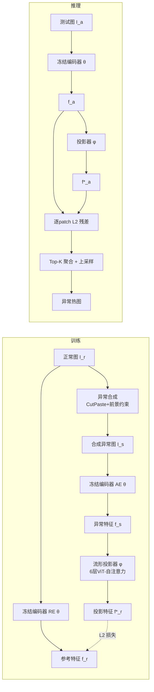

# Foundation Visual Encoders Are Secretly Few-Shot Anomaly Detectors

**会议**: ICLR 2026  
**OpenReview**: [https://openreview.net/forum?id=YRrlJ8oVEH](https://openreview.net/forum?id=YRrlJ8oVEH)  
**代码**: [https://github.com/ymxlzgy/FoundAD](https://github.com/ymxlzgy/FoundAD)  
**领域**: 异常检测 / 工业质检 / 表示学习  
**关键词**: 少样本异常检测, 基础视觉编码器, DINOv3, 自然图像流形, 流形投影  

## 一句话总结
作者发现冻结的基础视觉编码器其实"悄悄"已经能区分异常——图像中异常区域的面积与其特征到自然图像流形的距离成正相关，于是只在编码器之上训练一个轻量非线性投影算子（FOUNDAD），把异常特征拉回正常流形、再用投影前后差异打分，就在少样本、多类别工业异常检测上达到 SOTA。

## 研究背景与动机
- **领域现状**：少样本异常检测（few-shot anomaly detection, FSAD）只用极少量正常样本训练，对工业安全质检很有吸引力——因为生产中收集缺陷样本既昂贵又不现实，缺陷类型在量产前往往未知。近期主流方法（WinCLIP、PromptAD、AnomalyCLIP、IIPAD 等）大多依赖 CLIP 这类视觉-语言模型，靠精心设计的**文本提示**来辅助判别正常/异常。
- **现有痛点**：样本稀缺让"正常 vs 异常"的细微差异难以学到，多类别（category-agnostic）条件下更难；而引入文本提示又带来额外设计复杂度，且把异常检测能力绑定到了"语言对齐"上。
- **核心矛盾**：基础视觉编码器是在海量自然图像上预训练的，其特征空间天然学到了**正常图像的总体分布**——但社区一直把它当作下游任务的通用特征提取器，没人系统利用它对"偏离正常分布"的天然敏感性。
- **关键观察**：作者发现一个有趣性质——**图像中异常区域的像素面积越大，其嵌入特征到正常特征的 L2 距离越大**（Figure 2 在 SigLIP、DINOv2 上都成立）。这说明基础编码器"秘密地"已经在检测缺陷区域。
- **本文目标**：不微调编码器、不依赖文本，只用纯视觉特征 + 极少正常样本，做出又轻又强的多类别少样本异常检测器。
- **核心 idea**：**【流形投影】** 把"异常 = 偏离自然图像流形"形式化——冻结基础编码器以复用其语义/几何先验，仅训练一个轻量非线性投影算子 $\phi$，把异常特征投回流形上对应的正常特征，再用投影前后的特征差异来定位与打分。

## 方法详解

### 整体框架
FOUNDAD 把异常检测重构为"特征到自然图像流形的投影残差"。训练时给一张正常图 $I_r$，用 CutPaste 风格的合成模块按概率生成结构异常得到 $I_s$；两个**共享参数**的冻结编码器分别编码异常图（Anomaly-Aware Encoder, AE）和原图（Reference Encoder, RE）；唯一可训练的流形投影器 $\phi$ 把异常特征 $f_s$ 映射回正常参考特征 $f_r$，损失只是两者的 L2 距离。推理时对任意图 $I_a$，比较其特征 $f_a$ 与投影特征 $f_a^*=\phi(f_a)$ 的逐 patch 差异作为异常分数，再 Top-K 聚合成图像级分数、上采样成像素级热图。

### 关键设计

**1. 异常面积与特征距离的正相关：把异常检测变成"测离流形多远"。** 这是整篇工作的立论基石。作者在两种不同范式的基础编码器（SigLIP、DINOv2）上做了对照实验：在真实正常图上贴入逐渐增大的合成异常，编码后量测嵌入到原始正常嵌入的 L2 距离，发现距离随异常像素量单调上升。直观解释是：基础模型在海量自然图像上学到一张"自然图像流形"，正常图被嵌入到流形上，带异常的图会被推离流形，且偏离程度与异常占比挂钩。这个性质把"判断是否异常"等价转化为"测量特征偏离自然图像流形的程度"，从而不需要任何缺陷标签或文本先验。

**2. 双共享冻结编码器 + CutPaste 合成：用最简单的扰动驱动训练，又保证正常区域不被误判。** 框架用两个**参数完全相同**的冻结编码器 $\theta$（AE 处理合成异常图、RE 处理原图），共享参数确保两路特征落在同一潜空间、可逐 patch 对齐——这样合成图里的正常 patch 与原图对应 patch 仍然贴得很近，只有被篡改的异常区域才显出差异。异常合成沿用 CutPaste，但作者强调一个关键观察：合成异常在**像素层面**和真实异常差别明显，可一旦进入**潜空间**这种差别就被抹平了，所以"简单合成足以把异常特征推离流形"，无需复杂逼真的缺陷生成。为提升合成真实性，用自适应阈值二值化把异常**约束在前景区域**。训练时按阈值 $\sigma$ 用伯努利门控决定是否合成：$z\sim\text{Bernoulli}(1-\sigma)$，$I_s=(1-z)\,I_r+z\,\text{Syn}(I_r)$，让网络同时见到"已合成异常"和"保持正常"两种情形。

**3. 轻量非线性流形投影器：只训这一个模块，把异常特征拉回流形。** 投影器 $\phi$ 是唯一可训练部件，实现为一个深度为 6 的自注意力 ViT，每个 block 用残差连接 $x_{out}=\text{Attn}(x_{in})+x_{in}$ 稳定训练并保留输入信息。因为特征是 token 化的，自注意力天然支持 patch 间交互，比 MLP 更擅长捕捉细粒度异常（消融里 ViT 在同深度下全面优于 MLP）。训练目标极其简单——只最小化投影特征与参考正常特征的逐 patch L2 距离：

$$\mathcal{L}=D(f_r^*,f_r)=\frac{1}{N}\sum_{i=1}^{N}\left(f_{r,i}^*-f_{r,i}\right)^2,\quad f_r^*=\phi(f_s)$$

整个方法完全在潜空间操作，无需像重建式方法那样回到像素空间，大幅降低计算量。投影器仅 11.8M 参数，配 DINOv3 总参数 97.8M。

**4. Top-K 残差打分与多级输出：从 patch 残差聚合出图像级判别与像素级定位。** 推理时不依赖任何参考库，直接用投影前后的自我对比。逐 patch 异常分数为投影残差 $S_{patch}=D(f_a^*,f_a)=\frac{1}{N}\sum_i (f_{a,i}^*-f_{a,i})^2$；图像级分数取**最高的 K 个 patch 分数求平均** $S_{image}=\frac{1}{K}\sum_{i=1}^{K}S_{patch,i}$（只看最可疑的区域，避免被大量正常 patch 稀释，MVTec-AD 取 K=10、VisA 取 K=6）；像素级热图则把 patch 分数上采样回原分辨率。这套"残差即异常"的打分让整条管线快、轻、易训。

## 实验关键数据

### 主实验表格（多类别-单模型少样本，image-level/pixel-level AUROC、AUPR、PRO，%）
1-shot 下 FOUNDAD 在两大工业数据集上全面领先（✓ 表示无需文本）：

| Shot | 方法 | w/o Texts | MVTec I-AUROC | MVTec PRO | VisA I-AUROC | VisA PRO |
|------|------|:---:|:---:|:---:|:---:|:---:|
| 1 | PatchCore | ✓ | 63.7 | 72.7 | 58.9 | 64.3 |
| 1 | WinCLIP | ✗ | 92.8 | 83.5 | 83.1 | 80.9 |
| 1 | AnomalySD | ✗ | 93.6 | 89.2 | 86.1 | 93.9 |
| 1 | IIPAD | ✗ | 94.2 | 89.8 | 85.4 | 87.3 |
| 1 | **FOUNDAD** | ✓ | **96.1** | **92.8** | **92.6** | **98.0** |
| 2 | **FOUNDAD** | ✓ | **96.8** | **93.3** | **93.5** | **98.0** |

VisA 上的提升尤其显著（I-AUROC 比次优 +6.2、PRO 比次优 +4.1），显示在结构更复杂、多实例的场景下流形投影更稳健。BTAD/DTD 上也持续 SOTA（在 BTAD 上比最接近的 AdaptCLIP 高约 3.0%）。

### 消融实验表格

**编码器对比（1-shot, MVTec-AD）** —— DINOv3 最优，纯视觉监督的编码器整体强于含文本对齐的 CLIP：

| 编码器 | 纯视觉(无文本) | I-AUROC | P-AUROC | PRO |
|------|:---:|:---:|:---:|:---:|
| DINOv3 | ✓ | **96.1** | **96.8** | **92.8** |
| DINOv2 | ✓ | 95.2 | 96.4 | 92.5 |
| DINOSigLIP | ✗ | 92.5 | 93.1 | 87.2 |
| DINO | ✓ | 88.3 | 96.2 | 87.8 |
| SigLIP | ✗ | 87.8 | 86.0 | 71.1 |
| CLIP | ✗ | 79.0 | 90.9 | 70.9 |
| WideResNet | ✓ | 73.1 | 89.4 | 75.6 |

**投影器结构（1-shot, MVTec-AD）** —— ViT 同深度全面胜过 MLP，6 层最优：

| 类型 | 深度 | I-AUROC | PRO |
|------|:---:|:---:|:---:|
| ViT | 4 | 95.5 | 92.6 |
| ViT | **6** | **96.1** | **92.8** |
| ViT | 8 | 95.8 | 92.5 |
| MLP | 6 | 92.1 | 90.7 |
| MLP | 8 | 87.8 | 82.1 |

此外：DINOv3 第 10 层特征最佳（中-后层兼顾语义与空间精度）；Top-K 中 K=10(MVTec)/K=6(VisA) 最优，过大反而下降。

### 关键发现
- **效率优势明显**：投影器仅 11.8M 可训练参数，总参数 97.8M，单张 RTX 3090 上 128.7ms/图（约 7.8 FPS），峰值显存 1386 MiB；在性能-参数权衡上比 LogSAD 少约 13.3×、比 IIPAD 少约 10.3× 参数仍取得最佳精度。
- **文本并非必需**：纯视觉特征（DINO 系列）在无任何文本提示下即可超过依赖 CLIP+文本的强基线，CLIP 因缺乏像素级信息在定位（PRO）上明显落后。
- **简单合成够用**：合成异常与真实异常在潜空间差异被抹平，证明无需复杂逼真的缺陷生成。

## 亮点与洞察
- **"重新解读已有能力"而非堆新模块**：核心贡献是揭示"异常面积 ↔ 流形距离"这一基础编码器的隐藏性质，再用最小代价（一个投影器 + L2 损失）兑现它，是典型的"观察驱动设计"，优雅且可解释。
- **去文本化**：在 CLIP/文本提示几乎成为 FSAD 标配的当下，本文反向论证纯视觉特征已足够，给该方向减负并拓宽了视角。
- **全潜空间操作**：相比重建式方法回到像素空间，纯潜空间投影大幅降低计算量，契合工业部署对轻量、实时的需求。
- **对新基础模型即插即用**：换上更强的 DINOv3 直接涨点，说明方法能随基础模型进步自然受益。

## 局限与展望
- **依赖基础编码器质量**：方法上限被冻结编码器决定（WideResNet、CLIP 表现弱），对没有强自监督视觉基座的场景适配性存疑。
- **合成范式单一**：仅用 CutPaste 风格的结构异常合成，对逻辑异常、纹理细微缺陷等非"剪切-粘贴"型异常的覆盖未充分验证。
- **数据集集中工业域**：评测集中在 MVTec-AD/VisA/BTAD/DTD 等工业质检，对医疗、视频等其他异常域的迁移性尚待考察。
- **Top-K 与层选择需调**：K 值、DINOv3 取层对数据集敏感，跨域部署需重新搜参。

## 相关工作与启发
- **基础视觉编码器**：DINO/DINOv2/DINOv3、SigLIP、CLIP 等提供可迁移特征；本文把它们当作"自然图像流形"的提供者而非通用 backbone。
- **预测式表示学习**：思想上受 JEPA、SimSiam 启发——纯潜空间预测配对输入的表示依赖、不做像素重建；但本文反其道**冻结编码器只训投影器**，享受现成流形。
- **少样本/多类别异常检测**：PatchCore、SPADE、FastRecon（无文本）与 WinCLIP、PromptAD、AnomalyCLIP、IIPAD、AdaptCLIP（依赖文本）是主要对比；本文以无文本路线超越含文本 SOTA。
- **启发**：当面对"标注稀缺"的判别任务时，先系统检查"现成基础模型是否已隐含所需信号"，再以最小投影/适配兑现，可能比从零设计复杂模块更高效。

## 评分
- **新颖性**: ⭐⭐⭐⭐ 「异常面积↔流形距离」这一观察新颖且有解释力，把 FSAD 重构成流形投影、并实证纯视觉特征可去文本化，视角清晰。
- **实验充分度**: ⭐⭐⭐⭐ 覆盖 4 个数据集、多种 shot、7 种编码器、投影器结构/层选/Top-K 等消融充分，并报告参数/时延/显存。
- **写作质量**: ⭐⭐⭐⭐ 故事线（观察→方法→验证）连贯，图示与公式清晰，立论扎实。
- **价值**: ⭐⭐⭐⭐ 轻量、易训、即插即用且 SOTA，对工业质检落地价值高，也为"复用基础模型隐藏能力"提供范式。

<!-- RELATED:START -->

## 相关论文

- [\[CVPR 2026\] Defect Cue-Preserved Structural Feature Refinement for Few-Shot Anomaly Detection](../../CVPR2026/anomaly_detection/defect_cue-preserved_structural_feature_refinement_for_few-shot_anomaly_detectio.md)
- [\[ICLR 2026\] Adaptive Conformal Anomaly Detection with Time Series Foundation Models for Signal Monitoring](adaptive_conformal_anomaly_detection_with_time_series_foundation_models_for_sign.md)
- [\[ICLR 2026\] MRAD: Zero-Shot Anomaly Detection with Memory-Driven Retrieval](mrad_zero-shot_anomaly_detection_with_memory-driven_retrieval.md)
- [\[ICLR 2026\] ReTabAD: A Benchmark for Restoring Semantic Context in Tabular Anomaly Detection](retabad_a_benchmark_for_restoring_semantic_context_in_tabular_anomaly_detection.md)
- [\[ICLR 2026\] Low Rank Transformer for Multivariate Time Series Anomaly Detection and Localization](low_rank_transformer_for_multivariate_time_series_anomaly_detection_and_localiza.md)

<!-- RELATED:END -->
