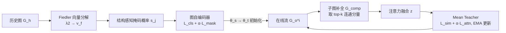

# Healthcare Insurance Fraud Detection via Continual Fiedler Vector Graph Model

**会议**: ICLR 2026  
**OpenReview**: [https://openreview.net/forum?id=ZWDvIKMkMG](https://openreview.net/forum?id=ZWDvIKMkMG)  
**代码**: [https://github.com/yhzhang1309/ConFVG](https://github.com/yhzhang1309/ConFVG)  
**领域**: 图异常检测 / 持续学习 / 医保欺诈  
**关键词**: 欺诈检测, 谱图理论, Fiedler 向量, 图自编码器, 在线持续学习, Mean Teacher  

## 一句话总结
ConFVG 用图拉普拉斯的第二小特征向量（Fiedler 向量）指导图自编码器的掩码策略来在标签稀缺时学结构感知表征，再用子图注意力融合 + Mean Teacher 在无标签的在线流里持续适应不断变化的欺诈模式，实现医保欺诈的实时检测。

## 研究背景与动机
**领域现状**：医保欺诈每年造成巨额损失（报告称美国联邦 Medicare 欺诈约 610 亿美元，占联邦医疗支出约 7%）。由于欺诈实体（患者、医生、理赔）之间存在复杂的关系结构，基于图神经网络的方法（CARE-GNN、PC-GNN 等）成为主流，能很好建模这种关系依赖。

**现有痛点**：真实部署有两道坎被以往工作分开处理。其一是**预训练阶段标签极度稀缺**——人工核验成本高、周期长，某些医保系统中只有 0.062% 样本被标为欺诈；全监督方法在标签不足时性能骤降，而普通自监督自编码器虽不依赖标签，却抓不住「合谋团伙」「社区异常」这类结构性欺诈信号。其二是**在线流非平稳**——欺诈模式随时间演化、不断以新的关系结构出现，而在线测试阶段几乎拿不到标签，使得依赖真值更新的在线模型无法适应。

**核心矛盾**：极端标签稀缺与欺诈模式漂移在真实医保流里**同时发生**，而以往要么只做「标签高效的预训练」、要么只做「演化环境下的自适应」，缺一个二者统一的方案。

**本文目标**：提出一个面向「标签稀缺 + 非平稳」的统一框架，既能从有限监督中泛化，又能在无标签在线流里持续适应。

**核心 idea**：**用谱图信号当无标签的「欺诈先验」**——欺诈节点常表现为非平滑信号（孤立点或异常稠密子图，破坏图的全局同质性），而 Fiedler 向量恰好编码了社区边界与连通瓶颈这类全局拓扑，把它注入自编码器的掩码概率，就能在没有标签时也突出欺诈相关结构；在线阶段再用**子图补全 + 注意力融合 + Mean Teacher**做无监督持续更新。

## 方法详解

### 整体框架
ConFVG 分两阶段。**预训练阶段**只能访问历史图 $G_h$，用 Fiedler 向量引导的图自编码器学结构感知表征 $\theta_{history}$；**在线阶段**任务以长序列 $G_o$ 到来，模型只能看当前任务 $G_o^i$（拿不到历史也拿不到标签），用子图注意力融合（SAF）模块和 Mean Teacher 持续更新参数。问题被简化成「预训练部分有标签、在线全无标签」的挑战性设定。

### 关键设计
**1. Fiedler 向量引导的掩码策略：让谱信号决定「该遮哪些特征」。** 普通随机掩码（如 GraphMAE）可能遮掉无用特征、漏掉关键特征，造成信息丢失。本文从谱图理论出发，把每个节点的平滑度 $q_i$ 组成向量 $q$，全局平滑度定义为 $\text{Graph}_{smooth}=\sum_{(i,j)\in E}(q_i-q_j)^2$。最小化它等价于 $\min q^T L q=\min\sum_i \lambda_i z_i^2$（$L=D-A$ 为拉普拉斯矩阵）；通过约束投影使 $q^T L q=\lambda_2$，于是最优 $q$ 就是第二小特征值对应的特征向量，即 **Fiedler 向量 $v_f=u_2$**，它天然指示每个节点的欺诈概率（社区边界、连通瓶颈处的非平滑节点）。再把 $v_f$ 和归一化节点特征线性投影成掩码概率 $s_j=\big|\sum_{i=1}^n v_{f,i}\cdot X_{norm,ij}\big|$，用 $s$ 替换伯努利掩码矩阵 $M$ 的采样概率，使重建任务聚焦欺诈相关特征。预训练总损失 $L_{pretrain}=L_{cls}+\alpha_{mask}L_{mask}$。

**2. 多连通分量的全连接扰动：救活退化的 Fiedler 向量。** 医保图常不连通、甚至有多个连通分量，此时拉普拉斯谱分解退化（多个零特征值），Fiedler 向量失去捕捉异常的能力。本文给原邻接矩阵加一个全连接弱扰动 $A'=A+\epsilon\cdot(J-I)$（$J$ 为全 1 矩阵，$I$ 为单位阵），把多个分量弱连成单一连通图，从而恢复 $\lambda_2$ 的判别意义，扰动上界在附录讨论。这是让谱方法落地到真实稀疏医保图的关键工程点。

**3. 子图注意力融合（SAF）：补全被忽略的跨分量欺诈关联。** GraphSAGE/GAT 这类只在原始连通子图内 top-k 邻居间传播信息，高度依赖初始连接、且看不到分量之间相似的欺诈模式，在动态环境下泛化弱。SAF 取图的 top-k 个最大连通分量，构造**补图** $G_{comp}$（连接原本不相连的节点对），分别编码得 $z_{orig}=E(G)$、$z_{comp}=E(G_{comp})$，再做注意力融合 $z=\sigma(W_2\,\text{ReLU}(W_1[z_{orig};z_{comp}]+b_1)+b_2)$。注意力损失 $L_{attn}=\text{ReLU}\big(\frac{1}{|V\setminus V_G|}\sum_{i\in V\setminus V_G}a_i-\frac{1}{|V_G|}\sum_{i\in V_G}a_i\big)$ 控制模型对补图的权重，迫使其自适应地放大新出现的高风险结构（异常稠密簇、时间同步活动）。

**4. Mean Teacher 无监督在线更新：在没标签的流里防遗忘。** 在线阶段标签不可得，用师生结构：教师 $M_t$ 对新任务出预测，学生 $M_s$ 用 KL 散度对齐 $L_{sim}=\text{KL}(\text{Softmax}(z_s)\|\text{Softmax}(z_t))$。在线总损失 $L_{online}=L_{sim}+\alpha_{attn}L_{attn}$ 更新学生；教师用指数滑动平均 $\theta_t^{(i)}=\alpha\theta_t^{(i-1)}+(1-\alpha)\theta_s^{(i)}$ 缓慢跟进，稳定更新、防止灾难性遗忘，实现无监督的结构感知持续适应。

## 实验关键数据

### 主实验（医保数据集，不同标签率，AUC / F1）
真实大规模医保数据集（>10 万受益人、517,737 条理赔），前 15 天作历史集、其余作在线集；历史集随机保留 1%/10% 标签，在线集全部去标。100%* 表示传统全标签在线场景。

| 模型 | 类型 | 1% AUC | 1% F1 | 10% AUC | 10% F1 | 100%* AUC | 100%* F1 |
|------|------|--------|-------|---------|--------|-----------|----------|
| PC-GNN | 离线 | 63.75 | 50.16 | 69.38 | 54.25 | 78.11 | 60.10 |
| GAD | 半监督 | 73.29 | 56.81 | 76.54 | 61.73 | 77.56 | 62.35 |
| POCL | 在线 | 70.64 | 52.45 | 74.76 | 60.31 | 80.32 | 63.56 |
| **ConFVG（本文）** | — | **76.13** | **62.24** | **80.48** | **64.48** | **80.61** | 63.24 |

ConFVG 在 1% 和 10% 标签率下 AUC/F1 均领先；标签从 10% 降到 1% 时退化最小，凸显标签稀缺下的鲁棒性。即便在 100%* 全标签传统场景也保持 SOTA AUC（F1 与最优在线模型差距极小）。

### 跨数据集泛化（10% 标签率，AUC / F1）

| 模型 | Medical | YelpChi | Amazon |
|------|---------|---------|--------|
| GAD | 76.54 / 61.73 | 75.22 / 62.61 | 89.56 / 85.05 |
| POCL | 74.76 / 60.31 | 73.18 / 61.60 | 87.57 / 80.12 |
| **ConFVG** | **80.48 / 64.48** | **76.85 / 64.53** | **91.07 / 87.32** |

在 YelpChi、Amazon 两个通用欺诈数据集上同样全面领先，证明方法不限于医保。

### 消融实验（医保，AUC / F1 / Acc）

| 自编码器 | 图补全 | Mean-Teacher | AUC | F1 | Acc |
|:---:|:---:|:---:|---|---|---|
| × | × | × | 67.21 | 39.13 | 63.43 |
| ✓ | × | × | 76.13 | 61.56 | 74.29 |
| ✓ | ✓ | × | 78.21 | 63.11 | 74.12 |
| ✓ | × | ✓ | 77.35 | 64.25 | 73.81 |
| **✓** | **✓** | **✓** | **80.48** | **64.48** | **76.45** |

### 关键发现
- **Fiedler 自编码器是性能基石**：单加自编码器就把 AUC 从 67→76、F1 从 39→62，是提升最大的单一组件。
- **三组件互补**：图补全主要补 AUC/F1，Mean Teacher 主要稳准确率与防遗忘，三者齐备才达最优；缺自编码器时（仅补全+Teacher）准确率明显回落到 66.56，说明结构感知预训练不可或缺。
- **在线曲线更平**：按月平均准确率上，ConFVG 在线学习过程中几乎不衰减，而传统模型随时间持续下降、波动大。

## 亮点与洞察
- **把谱图理论的 Fiedler 向量用作「无标签欺诈先验」**，逻辑闭环漂亮：合谋欺诈 → 破坏同质性 → 非平滑信号 → $\lambda_2$ 特征向量 → 掩码概率，是个有理论支撑又能落地的设计。
- **直面真实部署的两难**（标签稀缺 + 流漂移），并把二者统一在一个框架里，而非分别解决。
- **对图退化的工程处理**（全连接弱扰动救活 Fiedler 向量）很实在，是谱方法在稀疏真实图上能用的前提。
- **完全无标签在线更新**：Mean Teacher + 注意力损失绕开了在线阶段拿不到标签的硬约束。

## 局限与展望
- **谱分解的可扩展性**：拉普拉斯特征分解在超大图上代价高，论文用按天构图缓解，但全图级 Fiedler 计算如何扩展到百万级动态图未充分讨论。
- **全连接扰动的超参敏感性**：$\epsilon$、top-k 分量数等都靠附录调参，缺乏自适应选择机制。
- **Fiedler 向量假设单一主导社区结构**，对多尺度/层次化合谋是否仍最优值得验证（或可考虑多个小特征向量）。
- **F1 在 100%* 全标签场景未超在线 SOTA**，说明谱自监督的优势主要体现在标签稀缺区间。

## 相关工作与启发
- **图欺诈检测**：CARE-GNN、PC-GNN（全监督，标签感知邻居选择）；SemiGNN、GTAN、SAD、GAD（半监督，自监督/伪标签）；POCL、ContinualGNN、FGN（在线，参数级持续更新）。ConFVG 的差异是**把谱自监督与无标签在线自适应合一**。
- **持续学习**：参数正则（EWC、EVCL）、数据回放（iCaRL、GEM）、动态结构（DEN、BC-DEN）三大流派；多数假设在线有真值标签，本文用 Mean Teacher 摆脱该假设。
- **启发**：谱图量（Fiedler 向量、拉普拉斯特征）作为「结构先验」去指导自监督掩码/采样，是一条可迁移到其他图异常检测、社区发现任务的通用思路；「补图 + 注意力融合」也为只看局部连通子图的 GNN 提供了捕捉跨分量长程关联的轻量方案。

## 评分
- **新颖性**: ⭐⭐⭐⭐ — Fiedler 向量引导掩码 + 补图注意力融合 + 无标签 Mean Teacher 的组合在图欺诈检测里较新颖，谱信号当欺诈先验的动机干净。
- **实验充分度**: ⭐⭐⭐⭐ — 三数据集、多标签率、完整 2³ 消融、在线月度曲线齐全，覆盖到位；但缺大图可扩展性与超参敏感性的系统分析。
- **写作质量**: ⭐⭐⭐⭐ — 动机与方法推导清晰，谱理论到掩码的链条讲得明白；部分细节（扰动上界、top-k 选择）压到附录。
- **价值**: ⭐⭐⭐⭐ — 直击医保欺诈真实部署的标签稀缺+漂移痛点，方法可迁移到通用图欺诈/异常检测，实用价值高。

<!-- RELATED:START -->

## 相关论文

- [\[ICLR 2026\] UniOD: A Universal Model for Outlier Detection across Diverse Domains](uniod_a_universal_model_for_outlier_detection_across_diverse_domains.md)
- [\[ICLR 2026\] MRAD: Zero-Shot Anomaly Detection with Memory-Driven Retrieval](mrad_zero-shot_anomaly_detection_with_memory-driven_retrieval.md)
- [\[ICLR 2026\] ReTabAD: A Benchmark for Restoring Semantic Context in Tabular Anomaly Detection](retabad_a_benchmark_for_restoring_semantic_context_in_tabular_anomaly_detection.md)
- [\[ICLR 2026\] Low Rank Transformer for Multivariate Time Series Anomaly Detection and Localization](low_rank_transformer_for_multivariate_time_series_anomaly_detection_and_localiza.md)
- [\[ICLR 2026\] Adaptive Conformal Anomaly Detection with Time Series Foundation Models for Signal Monitoring](adaptive_conformal_anomaly_detection_with_time_series_foundation_models_for_sign.md)

<!-- RELATED:END -->
