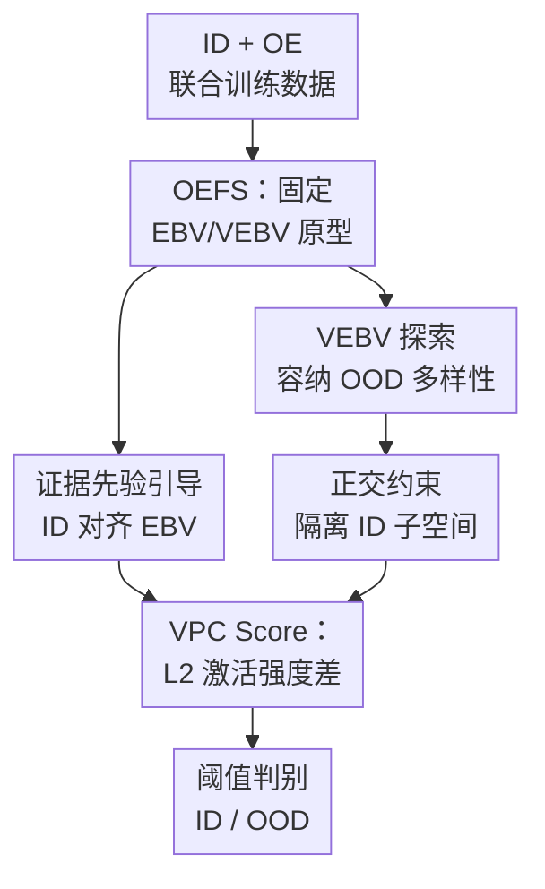

# Let OOD Feature Exploring Vast Predefined Classifiers

**会议**: ICLR 2026  
**OpenReview**: [https://openreview.net/forum?id=DtkIH5TKe6](https://openreview.net/forum?id=DtkIH5TKe6)  
**代码**: 有（论文称已开源）  
**领域**: 异常检测 / OOD 检测  
**关键词**: OOD检测, Outlier Exposure, 神经坍缩, 预定义分类器, Evidential Learning

## 一句话总结
这篇论文提出 VPC，用一组固定的等角原型把 ID 类别和 OOD 样本分别拉到两个预定义子空间，再用两个子空间上的 L2 激活强度差做 OOD 分数，在 CIFAR 和 ImageNet-1k 的 OE 训练场景中稳定降低 FPR95。

## 研究背景与动机
**领域现状**：OOD 检测的核心目标是在保持 ID 分类准确率的同时，把训练分布之外的样本识别出来。早期方法多依赖训练好的分类器输出，例如最大 softmax 概率、energy、Mahalanobis 距离或 kNN 距离；近年的强基线则常引入辅助 OOD 数据，也就是 Outlier Exposure（OE），让模型在 ID 数据和外部异常数据上联合训练。

**现有痛点**：OE 的直觉很直接：ID 样本正常分类，OE 样本不要对任何 ID 类别过度自信。经典 OE 因此会把 OOD 输出推向均匀分布，Energy-OE 等方法也多是在 logit 或后验分数上做正则。但这类做法没有显式规定特征空间应该长成什么样。模型一边要用同一套 ID 分类器区分细粒度 ID 类别，一边又要用这套分类器拒绝大量多样的 OOD 样本，优化目标天然纠缠。

**核心矛盾**：OOD 的真实分布非常宽，而且会持续变化；只让 OE 样本“低置信度”并不等于给它们安排了足够丰富的表示空间。结果是 ID 特征可能被 OE 梯度干扰，难以稳定收敛到紧凑、可分的 Neural Collapse 几何；OOD 特征也可能只是被压到分类边界附近，而不是形成可控、可解释、容量足够大的异常子空间。

**本文目标**：作者想解决两个子问题。第一，怎样让 ID 特征保持稳定的类内坍缩和类间等角分离，不被 OE 数据破坏；第二，怎样给多样 OOD 样本提供一个专门的、可扩展的几何空间，而不是只在 ID 分类头上做低置信度约束。

**切入角度**：论文从 Neural Collapse 和 Equiangular Tight Frame（ETF）出发。既然分类模型在理想末期会趋向一组等角分离的类别原型，那么不如把这种几何结构提前固定下来：前一部分原型专门服务 ID 类别，后一大组原型专门容纳 OOD 特征。这样，OOD 检测就不再只是“看模型对 ID 类别有多不自信”，而是“看特征到底激活了 ID 子空间还是 OOD 子空间”。

**核心 idea**：用固定的 Orthogonal Equiangular Feature Space（OEFS）替代单纯的可学习分类头，让 ID 特征对齐 EBV 原型、OE 特征探索 VEBV 子空间，并用两类预定义分类器上的激活强度差得到 VPC Score。

## 方法详解

### 整体框架
VPC 的输入是 ID 分类数据和辅助 OE 数据，输出仍然是一个可用于分类和 OOD 判别的特征模型。它的关键变化不在数据，而在分类器几何：模型去掉普通可学习分类头，改用固定的预定义原型集合，其中前 $K$ 个 EBV 对应 $K$ 个 ID 类别，后 $V$ 个 VEBV 构成 OOD 子空间。训练时，ID 样本被拉向自己的 EBV，OE 样本被推离 ID EBV 并吸引到 VEBV 子空间；测试时，VPC Score 比较特征在两个子空间中的激活强度。

### 关键设计
**1. OEFS：先把 ID 和 OOD 的几何座位排好**

传统 OE 方法把 OOD 样本交给 ID 分类头处理，这会让同一组类别权重同时承担“分类”和“拒识”两件事。VPC 反过来先构造一组固定原型 $W=\{w_i\}_{i=1}^{K+V}$，这些原型位于单位超球面上，并满足 simplex ETF 的等角关系：

$$
w_{k_1}^\top w_{k_2}=\frac{K+V}{K+V-1}\delta_{k_1,k_2}-\frac{1}{K+V-1}.
$$

这里前 $K$ 个向量是 Equiangular Basic Vectors（EBV），作为 ID 类别的固定原型；剩下 $V$ 个是 Vast EBVs（VEBV），专门作为 OOD 特征可以激活的几何锚点。这个设计的好处是把“ID 要类内紧凑、类间分开”和“OOD 要有足够多方向表达多样模式”拆成两个空间问题，而不是挤在同一个 ID 分类头里。

**2. 证据先验引导 ID 对齐 EBV：让 ID 收敛稳一点**

如果只用普通交叉熵或普通 Neural Collapse loss，OE 样本带来的梯度仍可能干扰 ID 特征收敛。作者把 Evidential Deep Learning 的思想引入特征-原型对齐：证据不再来自一个可学习 logit，而是来自归一化 ID 特征 $\hat m_i^{id}$ 与固定 EBV $\hat w_j^{ebv}$ 的余弦接近程度：

$$
e^*_{i,j}=\exp\left(\hat m_i^{id\top}\hat w_j^{ebv}/\tau\right),\quad \alpha^*_{i,j}=e^*_{i,j}+1.
$$

其中 $+1$ 的均匀先验相当于给几何证据加了缓冲，不让某个类别方向因为短期梯度被过快推到极端。对应的 ENC 损失写成 $L_{ENC}(x_i^{id})=\sum_{j=1}^K y_{i,j}(\log S_i^* - \log \alpha_{i,j}^*)$，其中 $S_i^*=\sum_k \alpha^*_{i,k}$。直观地说，ID 样本只有在确实和正确 EBV 角度对齐时才积累强证据，这比直接最大化分类 logit 更贴合本文预定义几何的目标。

**3. VEBV 探索和正交约束：让 OOD 去专门的异常子空间**

OE 数据的价值在于它们覆盖了许多潜在异常模式，但经典 OE 把这些模式压成“对所有 ID 类都不自信”，会损失方向信息。VPC 用 VEBV loss 直接最大化 OE 特征在 VEBV 子空间里的 L2 投影强度：

$$
L_{VEBV}(x_i^{oe})=-\sqrt{\sum_{j=1}^V\left(\hat m_i^{oe\top}\hat w_j^{vebv}\right)^2}.
$$

因为优化目标是最小化这个负值，所以模型会鼓励 OE 特征更多激活 VEBV 子空间。注意它不是要求每个 OOD 样本贴近某一个 OOD 原型，而是看整个 VEBV 子空间的激活范数，这更适合 OOD 多模式、不可穷举的性质。与此同时，论文还加入正交约束 $L_{OC}$，让 OE 特征在 ID EBV 上的 softmax 分布趋于均匀；在 simplex ETF 几何下，这等价于削弱 OE 特征对任一 ID 类别原型的偏置，从而保护 ID 决策边界。

**4. VPC Score：不用 ID 置信度，而看两个子空间谁更亮**

训练完成后，VPC 不依赖 MSP 这类 ID 类别置信度，而是计算特征在 EBV 子空间和 VEBV 子空间的 L2 激活强度：

$$
\ell^{ebv}_2(x_i)=\left\|[\hat m_i^\top \hat w_1^{ebv},\ldots,\hat m_i^\top \hat w_K^{ebv}]\right\|_2,
\quad
\ell^{vebv}_2(x_i)=\left\|[\hat m_i^\top \hat w_1^{vebv},\ldots,\hat m_i^\top \hat w_V^{vebv}]\right\|_2.
$$

最终分数为 $S_{VPC}(x_i)=-\alpha\ell^{ebv}_2(x_i)+\beta\ell^{vebv}_2(x_i)$。论文默认使用 $\alpha=-1,\beta=100$，分数越偏向 VEBV 激活，越像 OOD。这个分数的可解释性很强：ID 样本应该点亮 EBV，OOD 样本应该点亮 VEBV；当 MSP 被某个相似 ID 类误导时，VPC 仍可以通过 OOD 子空间激活把样本分出来。

### 一个完整示例
假设在 CIFAR-10 上训练，ID 类别数是 $K=10$，作者可以构造 $10+1000$ 个固定原型：前 10 个 EBV 对应 airplane、automobile 等 ID 类别，后 1000 个 VEBV 留给 OE 样本使用。训练时，一张 ID 的 airplane 图片会通过 ENC 损失逐步靠近 airplane 对应的 EBV，同时远离其他 ID EBV；一张来自 80 Million Tiny Images 的辅助异常图片则不会被要求“像某个 CIFAR 类”，而是被 $L_{VEBV}$ 推向 VEBV 张成的 OOD 子空间，并被 $L_{OC}$ 防止对某个 ID EBV 产生强偏置。

测试时，如果一张样本确实来自 CIFAR-10，模型特征在 10 个 EBV 上的投影范数会更大，VEBV 激活较弱；如果它来自 SVHN 或 Textures，特征会更容易激活 VEBV 子空间。VPC Score 就把这两个强度合成一个连续 OOD likelihood，再通过阈值完成 ID/OOD 判别。这个例子也解释了为什么 VEBV 数量很重要：V 太小，OOD 子空间容量不足；V 太大，在类别数较多的数据集上又可能让梯度分散。

### 损失函数 / 训练策略
整体训练目标由三类损失组成：ID 侧用 $L_{ENC}$ 对齐 EBV，OE 侧用 $L_{VEBV}$ 吸引到 VEBV 子空间，同时用 $L_{OC}$ 保持对 ID EBV 的均匀低偏置。论文在 CIFAR 上使用 WideResNet-40-2、ResNet-18、DenseNet-121，先进行常规预训练，再用 ID/OE 数据微调 50 epoch；也额外评估了一阶段联合训练。ImageNet-1k 上使用 ResNet-50 和 ViT-B-16，辅助 OOD 数据来自 ImageNet-21k-p validation subset，微调 5 epoch。所有损失中的温度 $\tau$ 设为 0.1。

作者还比较了不同打分函数：MSP、EDL Prob、Uncertainty、VPC Score，以及只看 EBV 或只看 VEBV 的单子空间变体。默认 VPC Score 使用 $\alpha=-1,\beta=100$，把 ID 子空间和 OOD 子空间的激活强度合起来判别。

## 实验关键数据

### 主实验
论文覆盖 CIFAR-10/100 和 ImageNet-1k，指标主要是 FPR95、AUROC 和 AUPR。下面保留最能说明结论的平均结果：VPC 在有辅助 OE 数据的设置下，相比 OE、Energy-OE、DAL 和 PFS 都更稳定，尤其在 FPR95 上优势更直接。

| 设置 | Backbone | 方法 | 平均 FPR95↓ | 平均 AUROC↑ | ID Acc↑ |
|------|----------|------|-------------|--------------|---------|
| ImageNet-1k | ResNet50 | PFS | 57.85 | 84.13 | 76.02 |
| ImageNet-1k | ResNet50 | VPC | 56.50 | 84.70 | 76.11 |
| ImageNet-1k | ViT-B-16 | DAL | 56.78 | 85.04 | 80.09 |
| ImageNet-1k | ViT-B-16 | VPC | 56.20 | 85.20 | 80.32 |
| CIFAR-10 | WideResNet-40-2 | PFS | 2.68 | 98.66 | - |
| CIFAR-10 | WideResNet-40-2 | VPC | 2.27 | 99.18 | - |
| CIFAR-100 | WideResNet-40-2 | DAL | 32.89 | 93.21 | - |
| CIFAR-100 | WideResNet-40-2 | VPC | 32.04 | 93.65 | - |

在两阶段训练中，VPC 对不同 backbone 的表现也比较稳定。它在 CIFAR-10 的 WideResNet-40-2 和 DenseNet-121 上整体最好，在 ResNet-18 上 FPR95 最低；CIFAR-100 上，DenseNet-121 的 FPR95 从 PFS 的 43.80 降到 31.17，说明预定义 OOD 子空间在更复杂类别体系里仍有明显收益。

| 数据集 | Backbone | 最强基线 | 基线 FPR95/AUROC/AUPR | VPC FPR95/AUROC/AUPR | 主要变化 |
|--------|----------|----------|------------------------|-----------------------|----------|
| CIFAR-10 | WideResNet-40-2 | PFS | 2.68 / 98.66 / 99.65 | 2.27 / 99.18 / 99.81 | FPR95 更低，AUROC/AUPR 更高 |
| CIFAR-10 | DenseNet-121 | DAL | 2.58 / 98.72 / 99.71 | 2.10 / 98.86 / 99.77 | DenseNet 上整体提升 |
| CIFAR-100 | WideResNet-40-2 | DAL/PFS | 32.89 / 93.21 / 98.44 或 34.35 / 93.33 / 98.53 | 32.04 / 93.65 / 98.53 | FPR95 和 AUROC 最优，AUPR 持平 PFS |
| CIFAR-100 | DenseNet-121 | OE | 36.46 / 93.23 / 98.53 | 31.17 / 94.01 / 98.71 | 三项指标同步提升 |

### 消融实验
作者做了两个关键消融：一个看 VEBV 子空间规模 $V$，一个看损失组合。前者回答“要给 OOD 多大的空间”，后者回答“哪些约束真的有用”。

| 配置 | CIFAR-10 FPR95/AUROC/AUPR | CIFAR-100 FPR95/AUROC/AUPR | 说明 |
|------|----------------------------|-----------------------------|------|
| V=10 / V=100 | 2.68 / 98.96 / 99.75 | 34.89 / 92.78 / 98.39 | OOD 子空间较小，容量有限 |
| V=500 | 2.61 / 99.11 / 99.79 | 34.65 / 93.01 / 98.41 | 增大 V 后有改善 |
| V=1000 | 2.27 / 99.18 / 99.81 | 32.04 / 93.65 / 98.53 | CIFAR-100 最优，默认强配置 |
| V=2000 | 2.21 / 99.21 / 99.85 | 32.56 / 93.31 / 98.49 | CIFAR-10 继续提升，但 CIFAR-100 略退化 |

| 训练损失 | CIFAR-10 FPR95/AUROC/AUPR | CIFAR-100 FPR95/AUROC/AUPR | 说明 |
|----------|----------------------------|-----------------------------|------|
| $L_{CE}+L_{OE}$ | 3.44 / 99.05 / 99.79 | 36.14 / 92.76 / 98.38 | 经典 OE 基线 |
| $L_{NC}+L_{OC}$ | 2.71 / 98.97 / 99.74 | 34.65 / 93.05 / 98.41 | 只做 NC 几何和正交约束已有收益 |
| $L_{ENC}+L_{OC}$ | 2.68 / 98.96 / 99.75 | 34.89 / 92.78 / 98.39 | 证据先验单独替换 NC 不足以突破 |
| $L_{ENC}+L_{OC}+L_{VEBV}$ | 2.27 / 99.18 / 99.81 | 32.04 / 93.65 / 98.53 | 加入 VEBV 探索后效果最强 |

### 关键发现
- VPC 的收益主要体现在降低 FPR95，说明它更擅长减少“把 OOD 当 ID 放行”的错误，而不是只做分数校准。
- VEBV 子空间不是越大越无脑好。CIFAR-10 从 $V=10$ 到 $V=2000$ 单调改善，但 CIFAR-100 在 $V=1000$ 最好，继续增大到 $V=2000$ 后 FPR95 从 32.04 上升到 32.56，可能是类别数更大时 OOD 子空间过宽导致优化梯度分散。
- 损失消融显示 $L_{VEBV}$ 是突破点。只有 ID 侧的 NC/ENC 加正交约束，可以改善基线；但真正把 FPR95 明显压低的是让 OE 特征主动探索 VEBV 子空间。
- 打分函数比较表明，VPC Score 在 CIFAR-100 的三个 backbone 上都取得最高 AUROC 和 AUPR，说明两个子空间的 L2 激活差比单纯 MSP 或 uncertainty 更稳定。

## 亮点与洞察
- 最大亮点是把 OOD 检测从“输出置信度问题”改写成“特征几何分配问题”。这让 OOD 不再只是 ID 分类器的剩余空间，而是有一个明确的 VEBV 子空间可以表达。
- VPC Score 很简洁，但和训练目标高度一致。训练时要求 ID 点亮 EBV、OE 点亮 VEBV，测试时就直接比较这两个子空间的激活强度，避免了训练和推理信号脱节。
- 论文把 Evidential Learning 用在特征-原型对齐上，而不是只当输出层不确定性校准工具。这个角度有迁移价值，例如开放集识别、类别增量学习或长尾分类中，也可以用证据先验去稳定固定原型的对齐过程。
- VEBV 数量消融很有启发：OOD 子空间容量是一个真实超参数。它提示后续方法可以根据 ID 类别数、OE 数据多样性或特征维度自适应选择 OOD 原型数量，而不是手工设定。

## 局限与展望
- VPC 依赖辅助 OE 数据。虽然论文覆盖了两阶段和一阶段训练，但如果没有高质量、足够多样的 OE 数据，VEBV 子空间是否还能学到有用异常模式，需要进一步验证。
- 方法需要构造 $K+V$ 个固定原型，并要求特征维度能承载这些等角结构。对于类别极多、V 又很大的场景，计算和投影层维度可能带来额外成本。
- VEBV 子空间规模需要调参。实验显示 CIFAR-10 和 CIFAR-100 的最佳 $V$ 不完全一致，说明容量过小和过大都会影响效果；未来可以考虑动态分配或层次化 VEBV。
- 论文主要在图像分类式 OOD 检测上验证。若迁移到文本、多模态或开放词表识别，OOD 的语义结构更复杂，固定等角原型是否仍然足够表达，需要更多实验。
- VPC Score 中 $\alpha,\beta$ 的默认权重有效，但不同数据集和 backbone 是否需要重新校准仍是实际部署问题。一个自然方向是把权重选择和阈值校准一起做成验证集驱动或理论约束的过程。

## 相关工作与启发
- **vs OE**: OE 让 OOD 输出接近均匀分布，本文则给 OOD 分配 VEBV 子空间。前者是输出层低置信度正则，后者是特征空间结构化分离，因此更能表达 OOD 多样性。
- **vs Energy-OE**: Energy-OE 通过 energy score 改善 OOD 判别，但仍依赖普通分类器 logit 的统计性质；VPC Score 直接来自预定义 ID/OOD 子空间的 L2 激活强度，训练目标和测试分数更一致。
- **vs PFS**: PFS 也借助 Neural Collapse 做特征分离，但主要围绕 ID 分类器权重约束；VPC 进一步扩展出大量 VEBV，把 OOD 表示容量显式纳入几何设计。
- **vs Prototype Learning**: 许多原型学习方法会动态学习或更新原型，容易受训练数据和 OOD 混合分布影响；VPC 固定原型，优点是几何目标稳定，缺点是原型数量和结构需要预先设定。
- **对后续研究的启发**: 可以把“预定义 ID 原型 + 可扩展 OOD 原型”的思想迁移到开放集分割、多模态幻觉检测、异常检索等任务，只要能定义清楚 ID 子空间和异常子空间的激活模式。

## 评分
- 新颖性: ⭐⭐⭐⭐  把固定 ETF/Neural Collapse 几何扩展为 ID+OOD 双子空间，思路清晰且有辨识度。
- 实验充分度: ⭐⭐⭐⭐  覆盖 CIFAR、ImageNet、多 backbone、两阶段/一阶段训练和多组消融，但跨模态和无 OE 场景还不足。
- 写作质量: ⭐⭐⭐⭐  论文主线完整，公式和消融能支撑核心论点；少数段落术语较密，需要读者熟悉 OOD 和 Neural Collapse 背景。
- 价值: ⭐⭐⭐⭐  对 OE-based OOD 检测很有参考价值，尤其是训练目标与测试分数一致的几何化设计，适合后续方法复用和扩展。

<!-- RELATED:START -->

## 相关论文

- [\[CVPR 2026\] Defect Cue-Preserved Structural Feature Refinement for Few-Shot Anomaly Detection](../../CVPR2026/anomaly_detection/defect_cue-preserved_structural_feature_refinement_for_few-shot_anomaly_detectio.md)
- [\[CVPR 2026\] LayoutAD: Exploring Semantic-Geometric Misalignment Reasoning for Scene Layout Anomaly Detection](../../CVPR2026/anomaly_detection/layoutad_exploring_semantic-geometric_misalignment_reasoning_for_scene_layout_an.md)
- [\[ICLR 2026\] PIRN: Prototypical-based Intra-modal Reconstruction with Normality Communication for Multi-modal Anomaly Detection.](pirn_prototypical-based_intra-modal_reconstruction_with_normality_communication_.md)
- [\[ICLR 2026\] Foundation Visual Encoders Are Secretly Few-Shot Anomaly Detectors](foundation_visual_encoders_are_secretly_few-shot_anomaly_detectors.md)
- [\[ICLR 2026\] Adaptive Conformal Anomaly Detection with Time Series Foundation Models for Signal Monitoring](adaptive_conformal_anomaly_detection_with_time_series_foundation_models_for_sign.md)

<!-- RELATED:END -->
