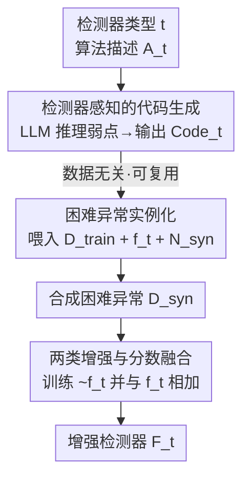

# LLM as an Algorithmist: Enhancing Anomaly Detectors via Programmatic Synthesis

**会议**: ICLR 2026  
**OpenReview**: [https://openreview.net/forum?id=5rV8ML7Q3r](https://openreview.net/forum?id=5rV8ML7Q3r)  
**代码**: https://github.com/HangtingYe/LLM_DAS  
**领域**: 异常检测 / 表格数据 / LLM 代码生成  
**关键词**: 表格异常检测, 困难异常合成, LLM 算法推理, 数据无关, 检测器增强

## 一句话总结
把 LLM 从"数据处理器"重新定位为"算法策略师"——它只看检测器的算法描述、不碰任何真实数据，就推理出该检测器的逻辑盲点并生成一段可跨数据集复用的 Python 合成代码，用来造出专门骗过这个检测器的"困难异常"，从而把原本只有正常样本的单类问题升级成更可分的两类问题，在 36 个表格异常检测基准上稳定提升五种主流检测器。

## 研究背景与动机
**领域现状**：表格异常检测（TAD）的主流范式是单类分类——训练集只有正常样本，模型学一个打分函数 $f:\mathcal{X}\to\mathbb{R}$，给测试样本打高分代表更可能异常。不同方法靠各自的"异常长什么样"的假设来建模：PCA 等重构类假设异常重构误差大，密度类假设异常落在低密度区，OCSVM 在正常数据周围画边界，IForest 假设异常容易被孤立。

**现有痛点**：这些假设都很脆弱。异常若恰好贴着正常流形（重构误差不大）、藏在稠密簇内部（局部异常）、或成小簇聚在正常点旁边（孤立路径不再短），对应方法就会失效。现实中异质表格数据五花八门，没有哪个固定假设能普适，导致性能在不同场景上忽高忽低。

**核心矛盾**：与其再设计"又一个带新假设的检测器"——它同样会有自己的脆弱点——不如反过来问：能不能系统性地把已有检测器变得更鲁棒，让它扛住对自身核心逻辑的违背？答案的关键在于造出真正"困难"的异常样本去补盲点，而难点正是"如何造得足够难"：在特征上加点小扰动这种数据级做法，根本打不到检测器的算法逻辑要害。

**切入角度**：把 LLM 直接当数据处理器用在表格上有两个老问题——LLM 处理异质数值特征本来就吃力，而且把原始数据喂给 LLM 有严重隐私风险。但作者发现 LLM 真正的强项是**对抽象算法机制的推理与代码生成**：让它分析"IForest 靠轴对齐分裂孤立点"这种高层逻辑、找出弱点，比让它读一行行特征值靠谱得多。

**核心 idea**：让 LLM 当"算法策略师"——只输入检测器的算法描述（不输入任何数据），让它推理该检测器对哪类异常最无能为力，并生成一段**数据无关、可跨数据集复用**的 Python 困难异常合成代码；再在具体数据集上实例化这段代码造异常、增强检测器。

## 方法详解

### 整体框架
LLM-DAS（LLM-Guided Detector-Aware Anomaly Synthesis）是一个两阶段框架，核心是**把"数据无关的推理"与"数据相关的合成"彻底解耦**。

- **阶段一（数据无关）**：给定一个检测器类型 $t$（如 IForest，对应抽象的、无参数的算法描述 $A_t$），构造提示词让 Gemini-2.5-Pro 推理 $A_t$ 的内在弱点，输出一段通用的 Python 合成代码 $\text{Code}_t$。整个过程 LLM 从不接触任何真实数据或模型参数，所以天然保护隐私，且生成的代码可被任何数据集复用。
- **阶段二（数据相关）**：在具体数据集上把 $\text{Code}_t$ 实例化——喂给它训练集 $D_{\text{train}}$、在该数据集上拟合好的打分函数 $f_t$、以及要合成的异常数量 $N_{\text{syn}}$，执行后得到一批困难异常 $D_{\text{syn}}^t$。把它们并入训练集训练一个二分类增强器 $\tilde f_t$，最后与原检测器 $f_t$ 融合成增强检测器 $F_t$。

整张图的关键是：阶段一对每个检测器类型只跑一次（两次 LLM 调用，见 Eq.2 和 Eq.3），产出的代码在所有数据集上摊薄成本，因此 LLM 用量极省。

### 关键设计

**1. 算法策略师定位：LLM 只读算法、不读数据**

这一设计直击"把 LLM 当数据处理器"带来的异质特征和隐私两大痛点。LLM-DAS 给 LLM 的输入是检测器的高层逻辑而非任何特征值，提示词 $p^t_{\text{code}}=p^t_{\text{description}}+p^t_{\text{objective}}+p^t_{\text{requirements}}$ 由三段拼成：(i) 检测器描述 $p^t_{\text{description}}$ 本身也由 LLM 先自我生成（$p^t_{\text{description}}=\text{LLM}(p^t_{\text{initial}})$，含算法摘要和伪代码），给后续推理打底；(ii) 目标说明 $p^t_{\text{objective}}$ 要求它合成"困难"异常，**核心机制是符号接口**——提示词里把交互写成占位符，例如"函数完成后，用户会提供一个暴露 `predict_score()` 的已训练模型 `model` 和训练样本 `X_train`"，于是 LLM 是在对一套标准 API 编程，写得出能查统计量、能调用检测器打分的通用程序，却全程没见过真实数据；(iii) 生成要求 $p^t_{\text{requirements}}$ 约束代码格式与功能。最终输出严格是 Python 代码 $\text{Code}_t=\text{LLM}(p^t_{\text{code}})$，并被结构化成三部分：合成策略 $S^t_{\text{policy}}$、可执行程序 $S^t_{\text{program}}$、解释注释 $S^t_{\text{explanation}}$——后两者让用户能核验合成逻辑，提升可解释性与可信度。

**2. 边界种子 + 受控外推：把"困难"做实**

合成困难异常的关键不是造一个一眼就能认出的离群点，而是造一个"事实上异常、但检测器看着像正常"的样本。生成要求里鼓励 LLM 采用一条启发式：先找出训练集中位于决策边界附近的"边界正常样本"当种子，再把它们变异成异常。以 IForest 的合成策略 $S^{\text{IForest}}_{\text{policy}}$ 为例——IForest 的弱点是靠轴对齐分裂孤立点、路径短即异常，于是策略分两步：第一步用拟合好的 $f_t$ 给所有训练样本打分，取分数最高的那一档（最靠近边界、模型本来就最没把握）作为种子；第二步做"受控外推"，把种子推进更稀疏的区域使其真的成为异常，同时**算法上确保这次移动不会显著缩短它在 IForest 里的孤立路径**——这样造出来的异常被"伪装"得让 IForest 误以为正常，正是它最容易栽的困难样本。直接加大随机噪声反而会造出路径很短的简单异常，起不到补盲点的作用。

**3. 两类增强与分数融合：把单类问题升级又不丢原检测器**

困难异常造好后并入训练集 $D^t_{\text{aug}}=D_{\text{train}}\cup D^t_{\text{syn}}$，在上面训练一个二分类器 $\tilde f_t$（如决策树）去区分正常与异常——这一步把原本只有正常样本的单类问题转成更可分的两类问题，逼分类器学到两类之间更细的判别模式。但作者不抛弃原检测器，而是把两路分数 min-max 归一化后相加：

$$F_t(x)=\text{Norm}_{\text{min-max}}(f_t(x))+\text{Norm}_{\text{min-max}}(\tilde f_t(x)).$$

这样既保留了原检测器对正常分布的建模偏好，又叠加了从合成困难样本里学到的细化边界。整个流程仍严格属于单类范式——因为 $D_{\text{train}}$ 里只有真实正常数据，异常完全由代码合成而非额外标注。

### 一个例子：用 IForest 走一遍
以 IForest 为例：阶段一只问 LLM 一句"IForest 怎么工作、它怕什么样的异常"，LLM 写出 `generate_hard_anomalies(n_samples, model, X_train)` 这段代码——里面已经写死了"取 top 分数百分位当种子 → 受控外推保持路径长度"的策略，但 `model` 和 `X_train` 都是符号占位符。阶段二在 Thyroid 数据集上拟合出 IForest 的 $f_t$，把真实的 `model`、`X_train` 和 $N_{\text{syn}}$（默认取训练集 10%）传进去执行，吐出一批合成异常。T-SNE 可视化显示这些合成异常（绿星）正好落在正常流形边界上、刻意避开稀疏的明显离群区；KDE 显示它们的原始分数分布与正常、真异常严重重叠（证明确实"难"），而用增强检测器重新打分后合成异常分数整体右移、真异常分布被进一步推离正常分布，边界变得更紧更鲁棒。这段 IForest 代码无需改动即可直接搬到其余 35 个数据集复用。

## 实验关键数据

### 主实验
在 ODDS 和 ADBench 选出的 36 个数据集上，对五种基于不同假设的源检测器做增强（训练集取 50% 正常样本，其余正常样本+全部异常作测试，指标 AUC-PR / AUC-ROC）。Table 1 给出 $F_t$ 相对源检测器 $f_t$ 的平均提升：

| 检测器 | AUC-PR Baseline | AUC-PR 绝对提升 | AUC-PR 相对提升 | Win Count | p-value |
|--------|------|------|------|------|------|
| PCA | .5975 | +.0402 | 21.50% | 30/36 | .0271 |
| IForest | .5724 | +.0617 | 23.60% | 26/36 | .0010 |
| OCSVM | .5295 | +.0723 | 84.49% | 25/36 | .0239 |
| ECOD | .5376 | +.0512 | 23.05% | 28/36 | .0014 |
| DRL | .7437 | +.0412 | 15.81% | 25/36 | .0238 |

五种检测器在两个指标上都被一致提升，配对单尾 t 检验大多数 p-value < 0.05，提升具有统计显著性。与 conventional / advanced TAD 基线横向比，LLM-DAS(DRL) 取得最高平均 AUC-PR；尤其相对同样用 LLM 的 AnoLLM（在每个数据集上微调小 LLM），本文计算成本显著更低却仍胜出——因为本文把 LLM 当算法分析师、数据无关、无需微调。

### 消融实验
通过改提示词构造三个削弱变体（Fig.4b，AUC-PR）：

| 配置 | IForest | PCA | DRL | 说明 |
|------|------|------|------|------|
| Base | .572 | .597 | .744 | 原检测器 |
| Generic | .579 | .593 | .644 | 提示词里去掉检测器原理（不再检测器感知）|
| Simple | .604 | .573 | .681 | 禁用 `predict_score()`，LLM 无法评估异常难度 |
| Random | .481 | .608 | .649 | 变异随机正常样本而非边界样本 |
| LLM-DAS | .634 | .638 | .785 | 完整方法 |

三个变体均明显逊于完整方法，证明检测器感知、生成困难异常的能力、聚焦边界样本三者都不可或缺。

另外与 Gauss / Random outlier / SMOTE 等朴素合成法对比（Fig.4a），朴素法效果不稳定：random 合成对简单的 IForest 偶有小幅增益，却把复杂的 DRL 从 .744 拉到 .615，说明通用策略会和检测器内在逻辑冲突；而 LLM-DAS 对三种检测器都稳定大幅提升。

### 关键发现
- **检测器感知是制胜关键**：跨检测器实验（Table 2）把 OCSVM 用 IForest/PCA 的合成代码增强，"错配"结果不稳定（在 Vowels 上暴跌 0.1899），而 OCSVM 用自己的代码平均提升最稳（+6.53%）——增益不来自泛泛的数据增广，而来自针对目标检测器机制的精准利用。
- **"困难"被定量验证**：Thyroid 上合成异常的分数分布与正常/真异常严重重叠，证明它们确实骗过了源检测器；增强后真异常分布被推离正常分布，边界更紧。
- **成本极低**：每个检测器类型只需两次 Gemini-2.5-Pro 调用，代码全数据集复用，后续实例化与训练在本地零额外货币成本。

## 亮点与洞察
- **角色重定位本身就是最大创新**：把"LLM 该不该读表格数据"这个老难题直接绕过——让它读算法不读数据，一举同时解决异质特征处理、隐私、复用性三件事。这种"让 LLM 当策略师而非工人"的思路可迁移到任何"模型有已知算法弱点、但不便把数据外传给 LLM"的场景。
- **符号接口是落地关键的工程巧思**：用 `predict_score()`、`X_train` 这类占位符当标准 API，让 LLM 写出既能访问数据统计量、又全程不见数据的通用程序，是"数据无关"能成立的技术支点。
- **把单类问题转成两类是经典却有效的视角转换**：困难异常充当了缺失的负样本，让检测器从"只会描述正常"升级为"会判别正常与异常的细微差异"。

## 局限与展望
- 合成策略的质量依赖 LLM 对检测器机制的推理是否正确；对没有清晰可言说算法逻辑的复杂深度检测器，LLM 能否推出有效弱点存疑。
- 实验主要在经典/中等规模检测器（PCA/IForest/OCSVM/ECOD/DRL）上验证，对大型深度异常检测模型的适用性还需更多证据。
- 困难异常合成依赖"边界种子 + 受控外推"启发式，虽允许 LLM 自行发现更优策略，但其对超高维或强类别型特征的鲁棒性、以及 $N_{\text{syn}}$（默认 10%）的敏感性仍有进一步系统分析空间。

## 相关工作与启发
- **vs AnoLLM（微调式 LLM-TAD）**: AnoLLM 在每个目标数据集上微调一个开源小 LLM、学一个数据专用模型，受限于数据访问和算力成本；本文把 LLM 当数据无关的算法分析师，代码一次生成全数据集复用，成本更低且性能更优。
- **vs 传统 TAD 检测器（PCA/IForest/OCSVM/ECOD/DRL）**: 它们各靠一套脆弱假设，假设被违背即失效；本文不替换它们而是当 plug-and-play 模块去**增强**它们，针对各自盲点补样本。
- **vs 朴素异常合成（Gauss/Random/SMOTE）**: 朴素法在数据层加扰动、策略与检测器逻辑无关，对复杂检测器可能有害；本文在逻辑层针对检测器机制定制，合成的异常始终具信息量。

## 评分
- 新颖性: ⭐⭐⭐⭐⭐ "LLM 当算法策略师只读算法不读数据"是一个干净且少见的范式转换。
- 实验充分度: ⭐⭐⭐⭐⭐ 36 个数据集 × 5 种检测器，含消融、跨检测器、可视化、显著性检验。
- 写作质量: ⭐⭐⭐⭐ 框架与符号接口讲得清楚，公式与案例衔接到位。
- 价值: ⭐⭐⭐⭐⭐ 即插即用、隐私友好、成本极低，对工业表格异常检测落地很实用。

<!-- RELATED:START -->

## 相关论文

- [\[ICLR 2026\] Foundation Visual Encoders Are Secretly Few-Shot Anomaly Detectors](foundation_visual_encoders_are_secretly_few-shot_anomaly_detectors.md)
- [\[CVPR 2026\] Multi-Prototype Compactness and Boundary-Aware Synthesis for Unsupervised Anomaly Detection](../../CVPR2026/anomaly_detection/multi-prototype_compactness_and_boundary-aware_synthesis_for_unsupervised_anomal.md)
- [\[ICLR 2026\] ReTabAD: A Benchmark for Restoring Semantic Context in Tabular Anomaly Detection](retabad_a_benchmark_for_restoring_semantic_context_in_tabular_anomaly_detection.md)
- [\[ICLR 2026\] MRAD: Zero-Shot Anomaly Detection with Memory-Driven Retrieval](mrad_zero-shot_anomaly_detection_with_memory-driven_retrieval.md)
- [\[ICLR 2026\] Low Rank Transformer for Multivariate Time Series Anomaly Detection and Localization](low_rank_transformer_for_multivariate_time_series_anomaly_detection_and_localiza.md)

<!-- RELATED:END -->
