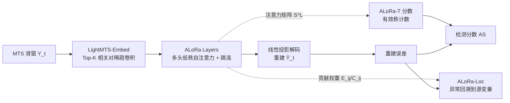

# Low Rank Transformer for Multivariate Time Series Anomaly Detection and Localization

**会议**: ICLR 2026  
**OpenReview**: [https://openreview.net/forum?id=ZtPIBpVojC](https://openreview.net/forum?id=ZtPIBpVojC)  
**代码**: [https://github.com/CharisShimillas/ALoRa](https://github.com/CharisShimillas/ALoRa)  
**领域**: 时间序列 / 多变量异常检测与定位  
**关键词**: 多变量时间序列, 异常检测, 异常定位, 低秩正则, 自注意力, 可解释性  

## 一句话总结
本文从理论上把 Transformer 编码器在多变量时间序列上的学习过程映射到经典 STAR 统计模型，进而提出对自注意力施加低秩正则的 ALoRa-T，用注意力矩阵的"秩"作为异常信号做检测，并借助可解释的贡献权重把异常回溯到具体变量做定位。

## 研究背景与动机
- **领域现状**：多变量时间序列（MTS）异常诊断对工业控制、IT 监控、航天遥测等大规模系统的安全可靠至关重要，包含两个子任务——异常检测（哪些时刻异常）与异常定位（哪条变量导致异常）。重建式深度模型（LSTM-VAE、OmniAnomaly、MEMTO 等）和 Transformer 类方法（Anomaly-Transformer、SARAD）已成主流。
- **现有痛点**：(1) Transformer 在 MTS 上"学到了什么"几乎是黑盒，缺乏理论刻画，在安全攸关场景里难以取信；(2) 异常定位是高价值却长期被忽视的方向，多数方法直接拿重建误差排序变量，但**异常会沿变量传播**，污染真正的异常源；(3) 业界广泛使用的 point-adjustment 评估会虚高指标，连随机打分都能"看起来很强"。
- **核心矛盾**：想要既准确又**可解释、可定位**的异常诊断，必须先理解 Transformer 的学习动力学，而现有方法在"理论解释↔检测分数↔定位归因"三者之间是断裂的。
- **本文目标**：建立 Transformer 编码器在 MTS 上的理论分析，并据此设计一个统一支持检测与定位、且天然可解释的异常诊断方法。
- **核心 idea**：**【理论驱动】** 证明带/不带跳连的自注意力潜空间等价于经典 **STAR（时空自回归）** 结构；**【低秩信号】** 观察到异常时自注意力矩阵的秩会升高，于是显式施加低秩正则放大这一差异作为异常信号；**【传播归因】** 用解析推导出的贡献权重 $E_{ij},C_{ij}$ 把异常沿传播链回溯到源变量。

## 方法详解

### 整体框架
方法包含两个模块：**ALoRa-Det**（检测）= 轻量嵌入 LightMTS-Embed + 多头低秩注意力层（ALoRa layers）+ 线性重建解码器，训练目标为"重建误差 + 低秩正则"，推断时用注意力矩阵的有效秩构造异常分数；**ALoRa-Loc**（定位）复用同一模型解析出的输入→潜空间→重建的贡献权重，把各变量的重建误差按贡献加权汇总成定位分数。两者共享同一套理论基础（第 4 节的 STAR 等价）。

### 关键设计

**1. STAR 等价的理论刻画：给 Transformer 潜空间一个统计学身份。** 论文先把嵌入层的一维卷积证明等价于可学习的向量滑动平均（VMA）滤波，再通过展开残差注意力，得到不带跳连时潜表示 $Z_t = A_t \tilde Y_{[t]} B$，其中 $A_t = S^{(L)}_{t,:}S^{(L-1)}\cdots S^{(1)}$ 是输入相关的注意力连乘、$B=W^{(V,1)}\cdots W^{(V,L)}$ 是与数据无关的学习参数。Proposition 1 据此证明每条潜序列 $z^{(j)}_t=\sum_k b_{kj}\sum_q a_{tq}\tilde y^{(k)}_q$ 与经典 STAR 模型形式完全一致，区别仅在于 STAR 用固定滞后权重、而 Transformer 通过 Q/K 实时动态估计这些权重；带跳连时则是多个 STAR 过程的线性组合，前馈层也不改变这一结构——这正是后文敢于**省掉前馈层**降低复杂度的理论依据。

**2. 低秩正则与"秩即异常"的检测分数：把谱性质变成报警信号。** 既然 $A_t$ 里的自注意力矩阵是唯一输入相关的可学习成分，其谱性质就能反映异常。作者经验性观察到异常窗口下注意力矩阵的秩会上升，于是用截断 Geman 核范数作为 ALoRa 损失惩罚多余奇异值：$L_{\text{ALoRa}}(S^{(l)})=\sum_{i=r+1}^{T}\frac{\sigma^{(l)}_i}{\sigma^{(l)}_i+1}$。由于 $S^{(l)}$ 行随机、最大奇异值恒为 1，取 $r=1$ 不惩罚首个奇异值；多头时对各头注意力取平均 $S^{(l)}=\frac1H\sum_h S^{(l)}_h$。总损失 $L_{\text{Total}}=\|Y-\hat Y\|_F^2+\lambda_{\text{reg}}\sum_l L_{\text{ALoRa}}(S^{(l)})$ 把正常窗口压成低秩、让异常窗口的高秩更突出。推断时检测分数为 $AS(y_t)=\|y_t-\hat y_t\|_2^2\cdot \text{ALoRa-T}(y_t;S^{(L)})$，其中 $\text{ALoRa-T}=\sum_i \mathbb{1}\{\sigma^{(L)}_i>h_1\}$ 数有效奇异值个数（阈值 $h_1$ 是因为正则后奇异值接近零但不严格为零）。这个分数能更早、更可靠地反映异常的时间特征。

**3. 贡献权重驱动的传播感知定位：把异常沿链路追回源头。** 定位的难点是异常会从源变量传播到其他变量，直接按重建误差排序会归错因。本文从 STAR 等价解析出两组权重：输入→潜空间 $E_{ij}=\sum_k(\sum_l w^{(k)}_{i,l})b_{kj}$ 刻画输入序列 $i$ 对潜特征 $j$ 的影响，潜空间→重建 $C_{ij}=\sum_k w^{out}_{kj}E_{ik}$ 进一步延伸到输出序列。据此定义定位分数 $LAS^{(i)}_t=\sum_j C_{ij}\|y^{(j)}_t-\hat y^{(j)}_t\|_2^2$，直觉是每一项度量"变量 $i$ 的异常传播到变量 $j$ 重建上的量级"，对所有 $j$ 求和即变量 $i$ 在系统中的总影响；实践中只对 $C_{ij}$ 最大的 top-k 维求和（ALoRa-Loc top-k）更聚焦关键传播路径。这套权重同时提供了模型决策的可解释性。

**4. LightMTS-Embed 稀疏嵌入：用相关结构换效率与可解释性。** 标准一维卷积用稠密滤波混合所有序列，既贵又不可解释。作者把每个卷积核限制为只聚合**恰好两条**输入序列（每核仅两个非零权重），并按训练集 Spearman 相关排序只保留 top-K 对（常取 $K=512$），不足 $\binom{d}{2}$ 时取全部。该设计在保持性能的同时显著降低参数量并提升稀疏性与可解释性——HAI 数据集上参数从 108M 降到 3.2M。

## 实验关键数据

### 主实验表格（检测，affiliation-based F1）

| 方法 | SMD | PSM | MSL | SWaT | HAI |
|------|-----|-----|-----|------|-----|
| Anomaly Transformer | 0.70 | 0.66 | 0.67 | 0.45 | 0.56 |
| MEMTO | 0.79 | 0.68 | 0.67 | 0.60 | 0.64 |
| NPSR | 0.87 | 0.76 | 0.68 | 0.28 | 0.79 |
| D3R | 0.87 | 0.76 | 0.64 | 0.71 | 0.79 |
| SARAD | 0.78 | 0.56 | 0.67 | 0.41 | 0.66 |
| **ALoRa-Det** | **0.97** | **0.82** | **0.72** | 0.68 | **0.86** |

五个数据集中四个 SOTA，SWaT 上第二但仍大幅领先多数方法；相比次优，SMD/PSM/MSL/HAI 上 F1 绝对提升 11.5%/7.8%/5.9%/8.9%。

### 定位表格（HR/NDCG/IPS @100,150）

| 方法 | SMD HR@100 | SMD IPS@100 | MSDS NDCG@100 | SWaT IPS@100 |
|------|-----------|-------------|---------------|--------------|
| SARAD | 0.44 | 0.55 | 0.31 | 0.11 |
| DAEMON | 0.26 | 0.24 | 0.27 | 0.06 |
| AERCA | 0.21 | 0.13 | 0.31 | 0.028 |
| **ALoRa-Loc** | **0.56** | **0.60** | **0.32** | **0.16** |

定位任务上整体领先现有方法（含专做定位的 AERCA）。

### 消融实验表格

| 配置 | SMD | PSM | MSL | SWaT | HAI |
|------|-----|-----|-----|------|-----|
| 完整（Loss✓ + Score✓） | 0.97 | 0.82 | 0.72 | 0.68 | 0.86 |
| 去 ALoRa-Loss | 0.95 | 0.74 | 0.69 | 0.61 | 0.82 |
| 去 ALoRa-Score | 0.944 | 0.69 | 0.69 | 0.55 | 0.67 |

LightMTS-Embed 在 HAI 上：Top-K 配置 3.2M 参数 / F1 0.86，全配对 108M 参数 / F1 0.85——top-K 几乎不掉点却省 30 倍参数。

### 关键发现
- 低秩正则让正常/异常窗口的注意力秩差异显著放大（Fig.3），是检测增益的主要来源；去掉 Score 比去掉 Loss 掉得更狠，说明"秩计数"分数本身贡献大。
- ALoRa-T 分数能更早触发报警（更短的 waiting time），而 MEMTO/Anomaly Transformer 的分数接近随机猜测。
- Top-K Spearman 相关选对比 Pearson、全配对都更省更准，验证稀疏嵌入设计的合理性。

## 亮点与洞察
- **理论与方法闭环**：不是"先有 trick 再补解释"，而是从 STAR 等价反推出"为什么注意力秩能当异常信号""为什么能省前馈层""贡献权重怎么解析得到"，三个设计都有理论出处。
- **把可解释性变成可定位性**：$E_{ij}/C_{ij}$ 不只是事后解释，而是直接构成传播感知的定位分数，正面解决"异常传播污染归因"这一痛点。
- **评估诚实**：明确弃用会虚高指标的 point-adjustment，改用 affiliation-based / range-based F1，结论更可信。

## 局限与展望
- 低秩"秩升高=异常"的经验观察缺乏严格充要刻画，某些异常类型（如缓慢漂移）是否仍体现为秩变化未充分讨论。
- LightMTS-Embed 把每核限制为两条序列、且依赖训练集相关结构，对高维强耦合系统或非平稳相关关系可能损失信息。
- 阈值 $h_1,h_2$、保留奇异值数 $r$、top-K 等超参需调，跨域迁移时的鲁棒性有待验证；定位评估仅在 3 个数据集上。

## 相关工作与启发
- **重建式异常检测**：OmniAnomaly、InterFusion、MSCRED 等用编码-解码学习正常模式、以重建误差判异常；本文同属重建式但额外引入谱信号。
- **Transformer 检测分数**：Anomaly-Transformer 的 AssDis、MEMTO 的 LSD、SARAD 的 SAR 都在挖注意力/记忆的统计量，本文的"注意力有效秩"是一条新路径，且有 STAR 理论背书。
- **定位方法**：OmniAnomaly/SARAD 直接排序重建误差、InterFusion 用 MCMC 修正、DAEMON 用积分梯度归因、AERCA 专做定位；本文用解析贡献权重统一检测与定位，且显式建模传播。
- **启发**：把深度模型潜空间映射回经典统计模型（STAR/VMA），是获得可解释性与新检测信号的高性价比路线，可推广到其他序列建模任务。

## 评分
- **新颖性**: ⭐⭐⭐⭐ — STAR 等价 + 注意力秩做异常信号 + 解析贡献权重做传播感知定位，理论与方法都新颖，谱视角较少见。
- **实验充分度**: ⭐⭐⭐⭐ — 6 数据集、丰富 baseline、检测/定位双任务、诚实评估指标与计算效率分析；定位数据集偏少、超参敏感性分析略缺。
- **写作质量**: ⭐⭐⭐⭐ — 动机—理论—方法—实验逻辑紧凑，图示清晰；理论部分较密集，需一定统计背景。
- **价值**: ⭐⭐⭐⭐ — 在安全攸关的 MTS 诊断中同时给出准确性、可解释性与可定位性，对工业落地有实际意义。

<!-- RELATED:START -->

## 相关论文

- [\[ICLR 2026\] Adaptive Conformal Anomaly Detection with Time Series Foundation Models for Signal Monitoring](adaptive_conformal_anomaly_detection_with_time_series_foundation_models_for_sign.md)
- [\[ICLR 2026\] ReTabAD: A Benchmark for Restoring Semantic Context in Tabular Anomaly Detection](retabad_a_benchmark_for_restoring_semantic_context_in_tabular_anomaly_detection.md)
- [\[ICLR 2026\] MRAD: Zero-Shot Anomaly Detection with Memory-Driven Retrieval](mrad_zero-shot_anomaly_detection_with_memory-driven_retrieval.md)
- [\[ICLR 2026\] Foundation Visual Encoders Are Secretly Few-Shot Anomaly Detectors](foundation_visual_encoders_are_secretly_few-shot_anomaly_detectors.md)
- [\[ICLR 2026\] UniOD: A Universal Model for Outlier Detection across Diverse Domains](uniod_a_universal_model_for_outlier_detection_across_diverse_domains.md)

<!-- RELATED:END -->
