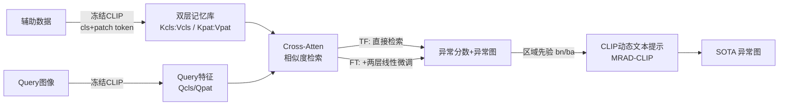

# MRAD: Zero-Shot Anomaly Detection with Memory-Driven Retrieval

**会议**: ICLR 2026  
**OpenReview**: [https://openreview.net/forum?id=TQkFiW3AEX](https://openreview.net/forum?id=TQkFiW3AEX)  
**代码**: [https://github.com/CROVO1026/MRAD](https://github.com/CROVO1026/MRAD)  
**领域**: 异常检测 / 零样本 / 视觉-语言模型  
**关键词**: Zero-Shot Anomaly Detection, Memory Bank, Feature Retrieval, CLIP, Prompt Learning  

## 一句话总结
MRAD 用「特征-标签记忆库的相似度检索」直接替代主流 ZSAD 的参数化拟合 $p(y|x)$，免训练版本就能打过 WinCLIP，再叠两层线性微调与区域先验注入的动态提示，便在 16 个工业/医疗数据集上刷到 SOTA。

## 研究背景与动机
**领域现状**：零样本异常检测（ZSAD）要在没有目标域监督的情况下，仅靠 CLIP 等预训练 VLM 把通用特征对齐到「正常/异常」语义。主流路线分两类——靠手工模板的 prompt-ensemble（WinCLIP、CLIP-AD），以及靠可学习向量做域适应的 prompt-optimization（AnomalyCLIP、AdaCLIP、FAPrompt）。

**现有痛点**：这些方法本质都是**只用一个新训练的组件去拟合条件分布 $p(y|x)$**，由此带来三个问题——(1) prompt 学习、特征工程、视觉分支微调堆高了架构复杂度，反而削弱泛化、抬升算力；(2) 单靠辅助学习器拟合分布会**丢失原始数据中的信息**；(3) 动态提示对「动态信息从哪来」高度敏感，直接影响像素级分割与图文对齐。

**核心矛盾**：参数化拟合是一种有损压缩——它把训练数据的经验分布压进模型权重里，subtle 的正常/异常变化在拟合过程中被抹平；而 ZSAD 恰恰需要保留这些细微差异来跨域判别。

**本文目标**：不再「拟合」分布，而是**直接访问辅助数据的经验分布**做异常判别，同时保持低训练/推理成本与跨域稳定性。

**核心 idea**：作者的跨数据集分析发现——拿 a 数据集的 patch 特征当 query、b 数据集的特征当 key，冻结 CLIP 下的相似度始终满足 $\text{NqNk} > \text{AqNk}$ 且 $\text{AqAk} > \text{NqAk}$（正常 query 更像正常 key、异常 query 更像异常 key），说明**对正常/异常特征集合的相似度本身就是稳定的判别信号**。据此，**用相似度检索替代参数化拟合**：把特征-标签对显式存进记忆库当 key/value，推理时直接检索得异常分数。

## 方法详解

### 整体框架
MRAD 是一个从「免训练」到「轻量微调」再到「提示增强」的渐进式框架：MRAD-TF 冻结 CLIP，从辅助数据建一个图像级+像素级的双层特征-标签记忆库，推理时纯靠相似度检索出异常分数与异常图；MRAD-FT 在检索度量里插两层线性层做轻量微调，拉大正常/异常 margin；MRAD-CLIP 再把 MRAD-FT 产出的区域先验注入 CLIP 可学习文本提示当动态偏置，强化对未见类别的泛化与定位。

### 关键设计

**1. 双层特征-标签记忆库：把"分类器"换成"可检索的原始分布"**。MRAD 把冻结的 CLIP 图像编码器拆成全局分支 $\phi_{cls}$（出 class token）和局部分支 $\phi_{vv}$（V-V 注意力出 patch token），二者共享预训练权重。对辅助集每张图：图像级记忆直接存全局特征 $k_i^{cls}$ 配 one-hot 标签 $e_{norm}/e_{anom}$；像素级记忆则把异常区内/外的 patch 特征各自平均成两个区域原型 $\mu_i^{anom}$（mask=1 的 patch）和 $\mu_i^{norm}$（mask=0 的 patch）再配标签存入。所有特征做 $\ell_2$ 归一化以稳定检索，最终堆成 $K_{cls}\in\mathbb{R}^{N_c\times d}$、$K_{pat}\in\mathbb{R}^{N_p\times d}$ 及对应值矩阵。这一步的精髓是**用区域原型而非整图特征作为像素级 key**，既压缩了存储（VisA 仅 2162/3093 条），又让正常/异常的局部语义显式可查。

**2. MRAD-TF 的检索式判别：softmax 注意力即分类器**。给定 query 的全局/patch 特征 $Q_{cls},Q_{pat}$，分类与分割 logits 都用同一套检索公式得到：$Y_{cls}^{n/a}=[\text{softmax}(Q_{cls}K_{cls}^\top/\tau)V_{cls}]_{n/a}$，$Y_{seg}^{n/a}=[\text{softmax}(Q_{pat}K_{pat}^\top/\tau)V_{pat}]_{n/a}$。其中异常通道 $Y_{seg}^a$ 正是动机里那个稳定的异常相似度信号 $s_{anom}(q)$，上采样后即异常图 $\hat{M}$。图像级最终分数把全局检索与高置信区域聚合相加：$S(I)=Y_{cls}^a+\text{TopKMean}(\hat{M})$，用 top-k 均值突出高置信异常区、压制背景噪声。整个过程零训练、零拟合，纯查表。

**3. MRAD-FT 的轻量度量微调 + 相似度 dropout**：TF 下正常/异常的 margin 偏小，于是只插两个线性映射 $W_q,W_k\in\mathbb{R}^{d\times d}$，把 $QK^\top$ 换成 $(QW_q)(KW_k)^\top$ 来校准检索度量。关键巧思是训练时加一个**相似度 dropout** $M_\rho(\cdot)$——把每个 query 相似度最高的 top-$\rho\%$ logits 置 $-\infty$（推理时全保留），这能避免单数据集下的平凡自匹配，逼模型在不那么像的特征上学会鲁棒判别。损失为分类+分割联合：$\mathcal{L}=\text{BCE}(Y_{cls},y)+\text{Dice}(Y_{seg},M)+\text{Focal}(Y_{seg},M)$，仅训 1 个 epoch。

**4. MRAD-CLIP 的区域先验动态提示：让"动态"来源更可靠**。在 "good object"/"damaged object" 模板前接 $E$ 个可学习上下文 token 构成类无关静态提示后，对 query 图用 MRAD-FT 的异常图阈值切出正常/异常区，各区 patch 特征平均成原型，经轻量线性层投影成偏置 $b_n/b_a$，加到每个上下文 token 上得到图像专属动态提示 $P_{dyn}^{n/a}$。文本编码后做 prompt-conditioned 余弦分类 $Y_{seg}^{n/a}=\text{softmax}(\frac{1}{\tau}[\cos(t_{norm},Q_{pat}),\cos(t_{anom},Q_{pat})])$，只训文本侧、冻结视觉与记忆库。相比 CoCoOp 用全局 class token 当动态源，MRAD-CLIP 用**显式的区域先验**当偏置，消融证明这是定位精度与未见类泛化的关键。

## 实验关键数据

### 主实验表格（16 数据集平均，A/B 分别为 P-AUROC/PRO 与 I-AUROC/I-AP）

| 方法 | 设定 | 像素级 (P-AUROC/PRO) | 图像级 (I-AUROC/I-AP) |
|---|---|---|---|
| WinCLIP (CVPR'23) | train-free | 73.0 / 42.9 | 75.1 / 73.2 |
| **MRAD-TF (Ours)** | train-free | **85.5 / 64.6** | **81.0 / 83.2** |
| AdaCLIP (ECCV'24) | train-based | 85.6 / 26.2 | 87.8 / 86.3 |
| AnomalyCLIP (ICLR'24) | train-based | 91.0 / 75.7 | 90.1 / 88.9 |
| FAPrompt (ICCV'25) | train-based | 90.7 / 75.6 | 91.3 / 91.2 |
| **MRAD-FT (Ours)** | train-based | 91.9 / 78.3 | 92.0 / 91.9 |
| **MRAD-CLIP (Ours)** | train-based | **92.7 / 80.1** | **92.7 / 92.5** |

注：医疗域图像级因 PDF 表格不全只取了部分平均，趋势一致。

### 消融实验表格（动态提示偏置来源，节选 4 数据集）

| 偏置来源 (bn/a) | MVTec 像素 | MVTec 图像 | Kvasir 像素 | HeadCT 图像 |
|---|---|---|---|---|
| static（=AnomalyCLIP 基线） | 91.5/82.9 | 92.0/96.3 | 83.5/49.5 | 96.1/97.0 |
| + class token（似 CoCoOp） | 86.2/54.9 | 89.6/95.1 | 79.0/45.2 | 90.4/90.8 |
| + cross-patch | 92.5/85.7 | 93.0/96.9 | 83.0/50.0 | 97.4/97.6 |
| + anomaly prior | 92.8/85.2 | 93.6/97.3 | 83.7/51.8 | 96.5/96.7 |
| **+ dual prior（最终）** | **93.0/86.8** | **94.0/97.4** | **84.3/52.7** | 97.1/97.6 |

### 关键发现
- **免训练就够强**：MRAD-TF 在像素级把 WinCLIP 从 73.0/42.9 拉到 85.5/64.6，证明「直接访问经验分布」比拟合更有效，甚至逼近部分训练型方法。
- **每个组件单调递增**：TF→FT→CLIP 在六个工业数据集雷达图上全轴外扩，FT 主要提判别力、CLIP 主要提像素级定位，互补无 trade-off。
- **全局特征是反例**：用 class token 当动态偏置反而把 MVTec 像素从 91.5 砸到 86.2，说明 ZSAD 必须用局部区域先验而非全局特征。
- **记忆库极省且鲁棒**：patch 记忆从 Full 砍到 $n=100$，pixel-AUROC 仅掉零点几，MRAD-CLIP 在小记忆下更稳。
- **极低成本**：CLIP ViT-L/14-336 全程冻结，MRAD-FT 仅训 1 epoch、MRAD-CLIP 5 epoch，单张 RTX 3090 即可。

## 亮点与洞察
- **范式转换**：把 ZSAD 从「拟合 $p(y|x)$」重构成「检索经验分布」，思想上接近 Tip-Adapter 的缓存检索，但把它从闭集分类扩到了开集异常检测，这是非平凡的迁移。
- **动机有实证支撑**：先用跨数据集相似度统计（$\text{AqAk}>\text{NqAk}$ 的稳定序）把「检索可判别」这件事量化证明出来，再设计方法，论证链条扎实。
- **统一框架的可扩展性**：TF/FT/CLIP 三档让用户按算力预算自选，从纯查表到 SOTA 平滑过渡，工程友好。
- **相似度 dropout** 是个轻巧又关键的训练 trick，专治单辅助集下的平凡自匹配。

## 局限与展望
- 检索质量依赖辅助数据集的覆盖度与多样性，跨域差异极大时单一辅助集的经验分布可能不够；论文也坦承未来要扩到更大数据集与在线/增量设定。
- 记忆库虽小但仍需存原始特征，随辅助数据规模增长检索成本与存储会线性上升，缺对超大规模库的近似检索（如 ANN）讨论。
- MRAD-CLIP 的区域先验来自 MRAD-FT 的异常图，存在误差级联——若 FT 异常图定位偏了，动态提示也会被带偏。
- 全部基于 CLIP ViT-L/14，未验证更小 backbone 或非 CLIP VLM 上范式是否同样成立。

## 相关工作与启发
- **谱系定位**：上承 CLIP/CoOp/CoCoOp 的提示适配与 Tip-Adapter 的缓存检索，平行于 AnomalyCLIP/AdaCLIP/FAPrompt/Bayes-PFL 的动态提示路线，但用「免训练检索」另辟蹊径。
- **启发**：在监督稀缺、需跨域稳定的任务里，「保留并检索原始经验分布」可能比「把分布压进参数」更省更稳——这一思路可迁移到 few-shot 分割、开集识别等场景。
- **可借鉴的组合拳**：用免训练强基线打底、再用极轻量微调拉 margin、最后用先验注入做提示增强，是一套低成本逼近 SOTA 的通用配方。

## 评分
- **新颖性**: ⭐⭐⭐⭐ — 把 ZSAD 从参数拟合重构为记忆检索，并用跨数据集相似度统计给出实证动机，范式上有清晰创新；检索思想本身借鉴 Tip-Adapter，故非满分。
- **实验充分度**: ⭐⭐⭐⭐⭐ — 16 个工业+医疗数据集、像素/图像四指标、TF/FT/CLIP 全消融 + 偏置来源消融 + 记忆库规模消融，覆盖全面且有可视化。
- **写作质量**: ⭐⭐⭐⭐ — 动机—方法—实验逻辑顺畅，公式与图清晰；但记忆库构建与 cross-atten 细节略密集，初读需对照图反复理解。
- **价值**: ⭐⭐⭐⭐ — 免训练即超强基线 + 单卡可复现 + 代码开源，对工业/医疗落地实用，且为「检索式异常检测」提供了可扩展的新基线。

<!-- RELATED:START -->

## 相关论文

- [\[CVPR 2026\] RAID: Retrieval-Augmented Anomaly Detection](../../CVPR2026/anomaly_detection/raid_retrieval-augmented_anomaly_detection.md)
- [\[ICLR 2026\] Foundation Visual Encoders Are Secretly Few-Shot Anomaly Detectors](foundation_visual_encoders_are_secretly_few-shot_anomaly_detectors.md)
- [\[CVPR 2026\] Defect Cue-Preserved Structural Feature Refinement for Few-Shot Anomaly Detection](../../CVPR2026/anomaly_detection/defect_cue-preserved_structural_feature_refinement_for_few-shot_anomaly_detectio.md)
- [\[ICLR 2026\] ReTabAD: A Benchmark for Restoring Semantic Context in Tabular Anomaly Detection](retabad_a_benchmark_for_restoring_semantic_context_in_tabular_anomaly_detection.md)
- [\[ICLR 2026\] Low Rank Transformer for Multivariate Time Series Anomaly Detection and Localization](low_rank_transformer_for_multivariate_time_series_anomaly_detection_and_localiza.md)

<!-- RELATED:END -->
