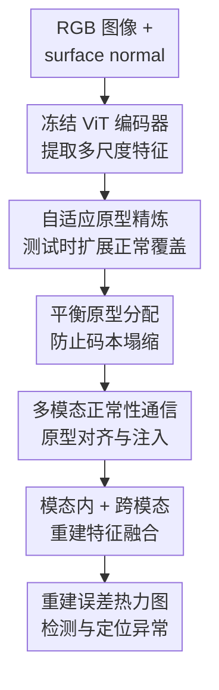

# PIRN: Prototypical-based Intra-modal Reconstruction with Normality Communication for Multi-modal Anomaly Detection.

**会议**: ICLR 2026  
**OpenReview**: [https://openreview.net/forum?id=7L7kmHHfgf](https://openreview.net/forum?id=7L7kmHHfgf)  
**代码**: 未公开（缓存内容未提供代码链接）  
**领域**: 多模态异常检测 / 少样本工业检测 / 3D视觉  
**关键词**: 多模态异常检测、少样本学习、原型重建、最优传输、RGB-3D融合

## 一句话总结
PIRN 面向 RGB 图像与 3D surface normal 的少样本多模态工业异常检测，用自适应原型码本重建每个模态的正常特征，再通过跨模态正常性通信互补纹理和几何线索，在 MVTec 3D-AD、Eyecandies 和 Real-IAD D3 上取得更强的检测与定位表现。

## 研究背景与动机
**领域现状**：多模态异常检测（multimodal anomaly detection, MAD）通常同时利用 RGB 外观和 3D 几何信息。工业缺陷里有些异常主要体现为纹理变化，例如表面污渍、划痕；有些异常主要体现为几何形变，例如凹陷、凸起或边缘破损。把 2D 与 3D 结合起来，比只看单一模态更容易覆盖这些互补信号。

**现有痛点**：现有 MAD 方法大体有两条路线。一类方法学习 RGB 与 3D 之间的稠密跨模态映射，测试时如果一个模态预测不了另一个模态，就把差异当作异常；另一类方法存储正常样本的 memory bank，用测试特征到近邻正常特征的距离打分。这两类方法在全量正常数据下可行，但在 few-shot 场景里很脆弱：跨模态映射会只学到少数训练样本里的窄相关关系，memory bank 也很难覆盖正常样本本身的外观和几何变化，最后常把没见过但仍然正常的模式误报成异常。

**核心矛盾**：少样本 MAD 需要两个看似冲突的能力。一方面，模型必须保守，只允许正常模式被重建出来，否则异常也会被完美复原，重建误差就失效；另一方面，模型又不能死记训练样本，因为真实测试物体会出现训练集中没有覆盖到的正常纹理和几何变化。也就是说，关键不只是“存多少正常样本”，而是如何学到一个既紧凑又能适度扩展的正常性表示。

**本文目标**：PIRN 要解决的是少量正常样本下的 RGB + 3D 异常检测与定位。它需要在每个模态内部过滤异常信息，用有限原型覆盖多样正常模式；同时还要让 RGB 与 3D 在“正常性”层面互相帮助，而不是依赖难学且容易过拟合的 patch-to-patch 稠密对应。

**切入角度**：作者把正常模式抽象成一组可学习原型（prototype codebook）。原型比 memory bank 更紧凑，也比普通自编码器更有信息瓶颈：输入特征必须先被投影到有限原型组合中再重建，异常区域如果不属于正常原型空间，就会留下较大重建误差。少样本场景下，作者进一步用最优传输避免原型塌缩，用测试时的门控更新扩展正常覆盖，并在原型层面做 RGB-3D 通信。

**核心 idea**：用“原型化的模态内正常重建 + 原型级跨模态正常性通信”替代稠密跨模态对齐和大规模 memory bank，让模型在少样本正常数据下仍能保留异常检测需要的正常性瓶颈。

## 方法详解
### 整体框架
PIRN 的输入是一张 RGB 图像和由点云生成的 surface normal map，两个模态分别经过冻结的 DINOv2 ViT 编码器提取 patch 特征。随后，一个级联的 prototype-aware decoder 在每层中依次执行自适应原型更新、平衡原型分配、跨模态正常性通信，输出每个模态的重建特征；测试时用原始编码特征与重建特征的余弦距离生成异常热力图，并把 RGB 与 surface normal 两路异常图相加得到最终分数。

更具体地，RGB 分支和 surface-normal 分支各维护 $K$ 个原型，默认 $K=10$。第一个 decoder layer 的输入是编码器输出 $E_{rgb}$ 和 $E_{sn}$；后续 layer 的输入则是上一层重建后的 token。每层先用当前样本里的可信正常上下文更新原型，再用这些原型重建本模态 token，最后让一个模态的“正常原型”作为另一个模态重建时的高层提示。整套设计始终围绕一个原则：异常不应直接流入正常原型，也不应在跨模态融合里被当作有用信息传播。

### 关键设计
**1. 自适应原型精炼：用门控更新吸收未见过的正常变化**

少样本训练得到的原型码本天然覆盖不足。如果测试样本里出现训练集没见过、但确实正常的纹理或几何形态，静态原型会把它当成异常，导致误报。APR（Adaptive Prototype Refinement）的做法是把原型看成可轻量更新的正常记忆：在每个 decoder layer 里，先把当前 patch token 与原型做一次基于最优传输的匹配，再为每个原型汇总它对应的一小组 token 上下文。

这里的关键不是简单平均所有 token，而是用 OT 权重得到每个原型的上下文 $c_k = \sum_n \bar{\Gamma}^{*}_{nk} z_n$。由于异常 token 往往不像任何正常原型，最优传输会把它们更分散地分配到多个原型上，因此单个原型收到的异常贡献较弱。随后，APR 用 GRU 把旧原型 $p_k$ 与上下文 $c_k$ 融合为新原型 $p'_k$。GRU 的门控相当于一个安全阀：当上下文与原型一致时允许更新，帮助码本覆盖测试时的新正常模式；当上下文可疑时保留旧原型，降低异常污染码本的风险。

**2. 平衡原型分配：用最优传输让每个原型真正参与正常重建**

如果直接用 softmax attention 让 patch token 自由选择原型，少数常见正常模式会吸引大部分 token，其他原型几乎不用，形成 codebook collapse。这样码本表面上有 $K$ 个槽位，实际只剩几个有效原型，少样本下对正常变化的覆盖会更窄。BPA（Balanced Prototype Assignment）把 token-to-prototype 匹配写成平衡最优传输问题：代价矩阵为余弦距离 $C_{nk}=1-\frac{z_n\cdot p_k}{\|z_n\|\|p_k\|}$，求一个传输计划 $T^*$，既让 token 尽量分给相近原型，又约束每个原型接收近似均衡的分配量。

形式上，BPA 解的是 $T^*=\arg\min_T \sum_{n,k}T_{nk}C_{nk}$，约束 $T\mathbf{1}_K=a$、$T^\top\mathbf{1}_N=b$，并用 Sinkhorn 算法处理熵正则后的 OT。得到 $T^*$ 后，每个 patch 的模态内重建为 $z^{bpa}_n=\sum_k T^*_{nk}p_k$。这一步把输入 token 投影回正常原型空间：正常 token 能找到接近的原型组合，重建误差较小；异常 token 即使被迫分配，也只能被拉向正常原型，原始异常特征与重建特征之间会出现更大差异。

**3. 多模态正常性通信：在原型层面对齐 RGB 纹理与 3D 几何**

RGB 和 3D 的互补性很强，但少样本下直接做稠密跨模态 patch 对齐并不稳，因为训练样本太少，模型学到的对应关系可能只适用于少数物体姿态或纹理。MNC（Multimodal Normality Communication）选择在原型层面交换正常知识，而不是在原始 patch 层面硬对齐。它先把 RGB 原型和 surface-normal 原型看成一个含 $2K$ 个节点的图，用跨模态 KNN 连接相近原型，再用 Graph Attention Network 做消息传递，让表示类似正常结构的纹理原型和几何原型靠近。

原型对齐后，MNC 再做跨模态正常性注入。每个模态先用 BPA 得到的 $Z^{bpa}$ 对原始 token 做通道级净化：$Z'=Z\cdot\sigma(Z^{bpa})$，尽量抑制异常细节；然后让一个模态的净化 token 作为 query，另一个模态对齐后的原型作为 key/value 做 cross-attention。例如 RGB 分支会从 surface-normal 原型中读取几何正常性线索，输出 $Z^{mnc}_{rgb}=Z'_{rgb}+g_{rgb}\cdot CA(Z'_{rgb},P'_{sn})$，其中 $g_{rgb}=\tanh(\gamma_{rgb})$ 是可学习门控。这样做的好处是：跨模态信息被限制在“正常原型”这个高层通道里流动，减少异常 patch 互相污染，同时让纹理和几何能弥补彼此没覆盖到的正常变化。

**4. 重建式异常打分：把正常瓶颈转化为可定位的误差图**

PIRN 最终并不是直接分类异常，而是比较编码特征和重建特征。每个 decoder layer 里会把模态内重建 $Z^{bpa}$ 与跨模态净化重建 $Z^{mnc}$ 相加，得到 $Z^{rec}_{rgb}$ 和 $Z^{rec}_{sn}$；训练时只用正常样本，最小化编码器 patch embedding 与重建 embedding 的余弦距离。因为训练目标只鼓励正常区域被重建，模型自然学到“正常可复原、异常被拉回正常空间”的行为。

推理时，对模态 $m\in\{rgb,sn\}$ 的第 $i$ 个 patch 计算 $d_i^{(m)}=1-\cos(E_i^{(m)}, Z_{i}^{rec,(m)})$。RGB 与 surface normal 的 patch-level score 上采样到输入分辨率后相加，得到融合异常热力图；图像级异常分数取热力图最大值。这种打分方式也解释了为什么 PIRN 同时适合检测和定位：如果某个局部缺陷不能被正常原型重建，它在对应空间位置会留下高误差。

### 一个完整示例
假设一个工业零件只有 10 张正常样本用于训练。测试时，RGB 图像里某个区域出现轻微颜色污渍，同时 surface normal 上几乎没有形变；另一个区域则有小凹陷，RGB 外观不明显。PIRN 先用冻结 ViT 抽取两路 patch token，APR 会根据当前样本里与原型高度匹配的正常区域轻微更新原型，例如让“正常边缘”“正常平面”“正常纹理”这些原型适应当前零件的姿态和光照。

接着，BPA 要求所有原型都被合理使用，而不是让所有 patch 都挤到同一个常见原型上。正常平面 patch 可以被某个 surface-normal 原型稳定重建，颜色正常的纹理 patch 也能被 RGB 原型重建；但污渍 patch 与 RGB 正常原型不吻合，凹陷 patch 与 surface-normal 正常原型不吻合，于是它们被拉向最相近的正常原型后仍留下较高误差。MNC 再让两路原型互相传递正常性：对于 RGB 不明显的凹陷，几何原型能帮助 RGB 分支知道该位置的正常结构；对于 surface normal 不敏感的颜色异常，RGB 原型也能补充纹理正常性。最后，两路误差图融合，缺陷区域会比正常未见变化区域更突出。

### 损失函数 / 训练策略
训练阶段只使用正常样本。实现上，作者采用两个冻结的 DINOv2 ViT-B/14 编码器分别处理 RGB 与 surface normal，并聚合第 2 到第 10 层 patch token 得到多尺度特征。decoder 是 $L=2$ 层级联结构，每个模态默认 $K=10$ 个原型；少样本实验训练 60 个 epoch，全量训练训练 8 个 epoch，优化器为 Adam，学习率 $1\times10^{-4}$。

损失主要是模态内特征重建损失，论文实现里采用类似 INP-Former 的 soft mining loss，本质上最小化正常样本中编码特征 $E_{rgb},E_{sn}$ 与重建特征 $Z^{rec}_{rgb},Z^{rec}_{sn}$ 在空间位置上的余弦距离。测试时 APR 仍会基于当前样本做单步受控原型更新，但更新由 OT 匹配和 GRU 门控限制，不是无约束 test-time training，因此在大面积异常情况下也较不容易把异常吸收到原型里。

## 实验关键数据

### 主实验
论文在 MVTec 3D-AD、Eyecandies 和 Real-IAD D3 上评估。MVTec 3D-AD 与 Eyecandies 重点考察 5-shot、10-shot、50-shot 和 all-shot 正常训练设定，指标包括图像级 AUROC（AUROCI）、像素级 AUROC（AUROCP）和 AUPRO。下面摘出 10-shot 与 all-shot 的代表性结果，能看出 PIRN 在少样本时优势更明显。

| 数据集 / 设定 | 指标 | PIRN | 最强对比方法 | 提升 |
|--------|------|------|----------|------|
| MVTec 3D-AD / 5-shot | AUROCI | 0.890 | 0.851（INP-Former） | +0.039 |
| MVTec 3D-AD / 10-shot | AUROCI | 0.922 | 0.885（INP-Former） | +0.037 |
| MVTec 3D-AD / 50-shot | AUROCI | 0.945 | 0.921（INP-Former） | +0.024 |
| MVTec 3D-AD / all-shot | AUROCI | 0.963 | 0.954（CFM） | +0.009 |
| Eyecandies / 5-shot | AUROCI | 0.895 | 0.859（INP-Former） | +0.036 |
| Eyecandies / 10-shot | AUROCI | 0.912 | 0.872（INP-Former） | +0.040 |
| Eyecandies / 50-shot | AUROCI | 0.924 | 0.902（INP-Former） | +0.022 |
| Eyecandies / all-shot | AUROCI | 0.948 | 0.946（3D-ADNAS） | +0.002 |

Real-IAD D3 是更贴近真实工业场景的数据集，论文在 full-data 设定下对比 RGB、3D、2D+3D 方法。PIRN 只使用 RGB + surface normal 两个标准模态，平均 AUROCI 为 0.873，略低于使用三模态表示的 D3M（0.890），但平均 AUROCP 达到 0.961，高于 D3M 的 0.937，说明它在缺陷定位上很强。

| 方法 | 模态 | 平均 AUROCI | 平均 AUROCP | 说明 |
|------|------|---------|---------|------|
| M3DM | 2D+3D | 0.841 | 0.922 | memory-based 多模态基线 |
| D3M | D3 RGB+SN | 0.890 | 0.937 | 使用更丰富的 D3 表示 |
| PIRN | RGB+SN | 0.873 | 0.961 | 检测第二，定位第一 |
| PointMAE+PatchCore | 2D+3D | 0.812 | 0.905 | 传统特征/记忆组合 |

### 消融实验
核心模块消融在 MVTec 3D-AD 的 10-shot 正常训练设定下进行。完整模型 AUROCI 为 0.922；去掉 MNC 后 AUROCI 降到 0.867，是最大跌幅，说明跨模态正常性通信对少样本 MAD 很关键；去掉 BPA 或 APR 也会明显变差。

| 配置 | AUROCI | AUROCP | AUPRO | 说明 |
|------|---------|---------|-------|------|
| 无 BPA / APR / MNC | 0.828 | 0.976 | 0.952 | 只有基础重建框架 |
| w/o BPA | 0.883 | 0.990 | 0.956 | 原型分配不平衡，覆盖不足 |
| w/o APR | 0.916 | 0.990 | 0.961 | 测试时适应正常变化能力下降 |
| w/o MNC | 0.867 | 0.988 | 0.947 | 缺少 RGB-3D 正常性互补 |
| Full PIRN | 0.922 | 0.991 | 0.966 | 三个模块同时使用 |

论文还分析了模态、原型数、decoder 深度和分配策略。MVTec 3D-AD 的 10-shot 中，surface normal 单模态 AUROCI 为 0.879，高于 RGB-only 的 0.827；两者融合后升至 0.922。说明几何信息在该类工业数据上更强，但 RGB 仍提供互补纹理线索。原型数量方面，all-shot 下 $K=10$ 最好，AUROCI 为 0.963；$K=50$ 和 $K=100$ 反而降到 0.940 和 0.901，印证过大码本会削弱信息瓶颈，让异常也更容易被重建。

### 关键发现
- MNC 是少样本多模态设定里最关键的模块之一。去掉 MNC 后 AUROCI 从 0.922 降到 0.867，比去掉 APR 或 BPA 的影响更大，说明简单双流相加不够，必须让两种模态在正常性层面通信。
- 平衡最优传输比普通 attention 更稳。附录中 softmax attention 的 AUROCI 只有 0.832，linear attention 为 0.845，sigmoid attention 为 0.878，而 balanced OT 达到 0.922，直接支持“避免原型塌缩”这一设计动机。
- 计算效率很突出。10-shot MVTec 3D-AD 上，PIRN 的 FLOPs 为 103.36G、延迟 17.49ms，低于 M3DM、CFM 和 FIND；与 FIND 相比，FLOPs 从 728.46G 降到 103.36G，延迟从 76.09ms 降到 17.49ms，同时 AUROCI 还略高。
- 定性结果显示 PIRN 的异常图更锐利，误报更少；作者还用特征位移可视化展示，正常 token 在原型重建前后移动较小，异常 token 被拉向正常原型时移动更大，这给“重建误差区分正常/异常”提供了直观解释。

## 亮点与洞察
- **把少样本 MAD 的核心从“跨模态对齐”转成“正常性原型通信”**：这点很有价值，因为少样本下最不可靠的正是稠密对应。PIRN 只在原型层面交换高层正常概念，既保留了 RGB-3D 互补性，又降低了过拟合少数样本的风险。
- **BPA 的平衡约束很贴合原型方法的失败模式**：很多原型/码本方法名义上有多个 prototype，实际训练后会塌到少数常用槽位。用 OT 强制均衡利用，让每个原型负责不同正常模式，比单纯增加原型数更有效，也解释了为什么 $K=100$ 反而变差。
- **APR 是一个谨慎的测试时适应机制**：它不是把测试样本拿来重新训练，而是在 OT 匹配和 GRU 门控下微调原型。这个设计抓住了工业检测里的现实问题：正常产品本身会有批次、姿态、材质变化，完全静态的正常模板很难不误报。
- **surface normal 的作用被实验清楚量化**：在 MVTec 3D-AD 上，SN-only 明显强于 RGB-only，但 RGB+SN 又进一步提升，说明多模态异常检测不是简单“3D 替代 2D”，而是几何主导、纹理补充的互补关系。
- **可迁移思路**：原型级通信不只适合 RGB-3D 异常检测，也可以迁移到医学影像多模态、遥感多传感器或机器人触觉-视觉检测。关键是把跨模态交互放在“可信正常原型/概念”层，而不是直接对齐带噪局部特征。

## 局限与展望
- PIRN 依赖高质量 surface normal map。论文沿用 FIND 的流程从点云生成 normal map，这要求数据本身有可靠 3D 信息；在只有 RGB 或深度噪声很大的工业场景中，方法收益可能下降。
- 方法主要验证在 normal-only 的少样本异常检测上，没有深入讨论混入少量异常标注、弱监督或开放类别异常时的行为。若实际产线可以获得少量缺陷样本，如何把它们安全地融入原型空间仍是后续问题。
- APR 虽然用 OT 和 GRU 门控降低异常污染，但它仍然会读取测试样本上下文。对于异常占比极高、且异常外观非常接近正常原型的情况，原型是否会被过度适配，需要更系统的 stress test。
- MNC 当前只处理 RGB 与 surface normal 两个模态。Real-IAD D3 中 D3M 使用更多伪 3D / 3D 表示后检测 AUROCI 更高，说明 PIRN 若扩展到三模态或更多传感器，可能还需要更一般化的原型图通信机制。
- 论文没有公开代码信息，复现实验需要重新实现 OT、GRU 原型更新、GAT 原型对齐和跨模态注入等多个模块。虽然思想清晰，但工程复现成本不低。

## 相关工作与启发
- **vs CFM / LSFA**: 这类方法学习 RGB 与 3D 的跨模态特征映射，用预测失败来检测异常。PIRN 不做稠密映射，而是先在每个模态内用正常原型重建，再在原型层面交换正常性，因此更适合正常样本很少、稠密对应不可靠的场景。
- **vs M3DM / SG-DM**: memory-bank 方法存储正常特征并靠近邻距离打分，问题是 few-shot 下 memory 覆盖窄。PIRN 用可学习原型替代大规模记忆，并通过 APR 在测试时轻量扩展正常覆盖，减少把未见正常变化误报成异常的风险。
- **vs INP-Former**: INP-Former 从单张图像中探索 intrinsic normal prototypes，是强 2D 原型重建基线。PIRN 借鉴了原型重建思想，但针对 RGB-3D MAD 加入 BPA、APR 和 MNC，使原型不仅能约束单模态重建，还能承载跨模态正常知识。
- **vs 3D-ADNAS / FIND**: 这些方法更多从多模态融合架构或 normal-only 多模态数据利用角度改进。PIRN 的启发在于：融合不一定要更重，若把交互位置放到原型层，并保持冻结编码器与小 decoder，反而可以在精度和效率之间取得更好的组合。

## 评分
- 新颖性: ⭐⭐⭐⭐☆ 把平衡 OT、测试时原型精炼和原型级跨模态通信组合到少样本 MAD 中，问题抓得准，单个组件不算全新但整体设计很完整。
- 实验充分度: ⭐⭐⭐⭐⭐ 覆盖 MVTec 3D-AD、Eyecandies、Real-IAD D3，多 shot、多指标、模块/超参/效率/定性可视化都比较充分。
- 写作质量: ⭐⭐⭐⭐☆ 方法动机和模块解释清楚，公式也完整；不足是组件较多，读者需要来回对照图和算法才能完全串起来。
- 价值: ⭐⭐⭐⭐⭐ 少样本工业多模态异常检测是很实际的场景，PIRN 同时提升精度、定位和效率，且原型级正常性通信的思想有较强迁移潜力。

<!-- RELATED:START -->

## 相关论文

- [\[CVPR 2026\] Hunting Normality from Query Sample via Residual Learning for Generalist Anomaly Detection](../../CVPR2026/anomaly_detection/hunting_normality_from_query_sample_via_residual_learning_for_generalist_anomaly.md)
- [\[CVPR 2026\] Multi-Prototype Compactness and Boundary-Aware Synthesis for Unsupervised Anomaly Detection](../../CVPR2026/anomaly_detection/multi-prototype_compactness_and_boundary-aware_synthesis_for_unsupervised_anomal.md)
- [\[CVPR 2026\] Dual-Prototype-Guided Multi-task Learning for Unsupervised Anomaly Detection and Classification](../../CVPR2026/anomaly_detection/dual-prototype-guided_multi-task_learning_for_unsupervised_anomaly_detection_and.md)
- [\[ICLR 2026\] ReTabAD: A Benchmark for Restoring Semantic Context in Tabular Anomaly Detection](retabad_a_benchmark_for_restoring_semantic_context_in_tabular_anomaly_detection.md)
- [\[ICLR 2026\] MRAD: Zero-Shot Anomaly Detection with Memory-Driven Retrieval](mrad_zero-shot_anomaly_detection_with_memory-driven_retrieval.md)

<!-- RELATED:END -->
