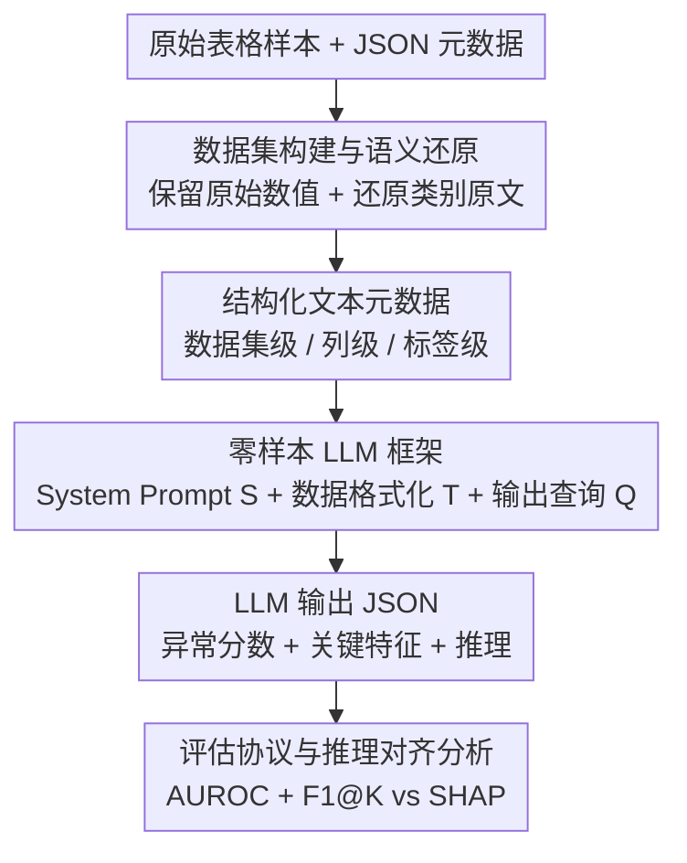

# ReTabAD: A Benchmark for Restoring Semantic Context in Tabular Anomaly Detection

**会议**: ICLR 2026  
**OpenReview**: [https://openreview.net/forum?id=UFwgg44VZq](https://openreview.net/forum?id=UFwgg44VZq)  
**代码**: https://yoonsanghyu.github.io/ReTabAD/  
**领域**: 表格异常检测 / Benchmark / 大语言模型  
**关键词**: 表格异常检测、语义上下文、文本元数据、零样本 LLM、可解释性

## 一句话总结
ReTabAD 是首个"上下文感知"的表格异常检测 benchmark：它把传统基准里被丢弃的文本语义（特征描述、领域知识、类别原文）重新还原回 20 个精选数据集，配齐 20 个跨经典/深度/LLM 的算法实现，并提出一个无需训练的零样本 LLM 框架，实验证明语义上下文能把检测 AUROC 平均提升 7.6 个百分点，让零样本 LLM 逼近 SOTA 训练方法。

## 研究背景与动机

**领域现状**：表格异常检测（tabular AD）是金融、网络安全、制造、医疗等领域的基础任务，主流评测靠 DAMI Repository、ADBench 这类 benchmark，以及 PyOD、DeepOD 这类算法库，提供标准化的数值数据集和算法对比。

**现有痛点**：这些基准都诞生于"只看数值"的旧范式——它们把类别特征强行编码成任意整数、或直接丢弃非数值字段，更关键的是**彻底剔除了文本元数据**：特征含义、计量单位、领域约束、类别的语义。可现实里专家判断异常恰恰高度依赖这些信息。一个成年人静息心率 200 bpm 一眼就是危急医学异常，但归一化后它只剩"统计上罕见"这一层含义，临床意义荡然无存。

**核心矛盾**：异常的定义本质上是"上下文相关"的（context-dependent）——不理解特征语义和领域约束，模型就会把良性偏差误判成异常、或漏掉微妙却致命的异常。但现有 benchmark 只给数值点、不给语义，使得"上下文感知"这一研究方向连可评测的土壤都没有。即便像 AnoLLM 这样的 LLM 方法想利用语义，也只能拿到列名，因为基准里没有更丰富的文本标注。

**本文目标**：拆成三个子问题——(1) 如何构造一个保留并结构化语义的高质量表格 AD 基准；(2) 如何让模型真正用上这些语义；(3) 语义到底对检测性能和推理可解释性贡献多大、哪类语义最有用。

**切入角度**：作者观察到近年 LLM 在"对数值的文本化表示"和上下文推理上能力大涨，于是认为：与其继续在纯数值设定里卷模型，不如**把语义还原回数据**，再用 LLM 把异常检测从"统计模式匹配"升级为"高层上下文理解"。

**核心 idea**：用"还原文本语义 + 零样本 LLM 推理"代替"丢弃语义 + 纯数值建模"，让模型像领域专家一样基于语义定义异常。

## 方法详解

### 整体框架

ReTabAD 本质是一个 benchmark + 一个配套基线，由四块拼成：(1) 20 个精选表格数据集，每个都被还原了原始数值与类别原文、并补上结构化文本元数据；(2) 20 个无监督 AD 算法实现，覆盖经典、深度、LLM 三类；(3) 一个无需任务训练的零样本 LLM 框架，作为"上下文感知 AD"的强基线；(4) 一套统一的评估协议（one-class 设定 + AUROC + 推理对齐分析）。整条 pipeline 的输入是带语义的原始表格 + JSON 元数据，输出是每条样本的异常分数、关键特征和文本推理。

零样本 LLM 框架是本文真正"动手"的部分，它把一条样本变成提示词再喂给 LLM，pipeline 清晰，框架图如下：

### 关键设计

**1. 数据集构建与语义还原：让原始数值和类别原文都活着回来**

针对"基准把语义编码没了"的痛点，ReTabAD 在 ADBench 的覆盖面基础上精选 20 个数据集，筛选标准是：领域明确且有真值异常标签、规模适中且反映真实类别不平衡、文档充分到能还原可靠语义描述、且不能太简单（性能已饱和的丢弃）。在数据本身上坚持两条原则：**原始数值保留**（Raw Numerical Preservation）——不做未说明的归一化/标准化，让"心率 200 bpm"这类带领域意义的数值保持可读；**类别文本还原**（Categorical Text Restoration）——把类别特征还原成原始文本值而非整数编码或 embedding，让语言模型能基于"人能看懂的类别"而不是任意数字代理来推理。这与 ADBench 把 CV/NLP 数据硬塞成表格、用数量换覆盖面的做法形成鲜明对比，ReTabAD 选择以质取胜。

**2. 结构化文本元数据：把专家依赖的领域知识写成可验证的 JSON**

光有数据不够，关键是把"专家脑子里的上下文"显式化。每个数据集配一份 JSON 元数据，分三级组织：**数据集级**给出名称、用途、来源和采集方式，并附原始出处链接以保证可信度与可复现；**列级**给出每列的名称、人类可读描述、逻辑类型（numerical / categorical / ordinal / binary）和计量单位，全部与原始文档交叉核对；**标签级**明确哪些类算正常、哪些算异常，异常定义直接源自原始文档并标注来源。所有解释都给出指向原始数据源的直链，便于研究者核验。这套结构化元数据正是旧基准里缺失、却被实践者天天使用的那部分信息，是"上下文感知 AD"得以被评测的前提。

**3. 零样本 LLM 框架：把一条样本拼成"角色 + 语义上下文 + 指南"的提示词**

这是本文提出的强基线，目标是让 LLM 不经任何任务训练就利用语义做异常检测。对每条样本 $x_i$，提示词由三部分拼成：**系统提示 $S$** = 角色与任务定义 $S_{role}$（给 LLM 一个领域专家人设，如"你是金融领域专家"）+ 语义上下文 $C$ + 分析指南 $S_{guideline}$，其中语义上下文又细分为领域知识 $C_{domain}$（数据集与标签的背景）、特征描述 $C_{feature}$（每个特征的含义/单位）、正常统计 $C_{statistic}$（从训练正常数据导出的正常范围）；**数据格式化器 $T(x_i)$** 把样本序列化成"Record i: [feature\_name\_1=value\_1], ..."这种带特征名而非通用索引的可读文本，用特征名本身携带语义，并支持多条样本批处理以提效；**结构化输出查询 $Q$** 要求 LLM 返回固定 JSON：$\{\text{anomaly\_score}: s,\ \text{key\_features}: F,\ \text{reasoning}: e\}$，其中 $s\in[0,1]$ 是异常分数、$F$ 是关键特征列表、$e$ 是文本解释。这套设计把检测形式化为一个元数据感知的打分函数 $f(x, M)$，衡量样本与"元数据所定义的正常"有多吻合，从而把焦点从纯统计模式转向高层上下文理解。

**4. 评估协议与推理对齐分析：既量性能也量推理质量**

为公平评测，ReTabAD 采用 one-class 设定：训练集只含 50% 正常样本，测试集含剩余正常样本 + 全部异常样本，主指标是 AUROC，每个实验跑 5 个随机种子取均值。更有意思的是它还设计了**推理对齐分析**来回答"LLM 标出的关键特征是不是真正驱动异常的特征"：在真值标签上训练一个 XGBoost，对每条异常样本算 SHAP 值，取绝对值 top-$K$ 的特征作为参考集 $R_i^{(K)}$，与 LLM 预测的 top-$K$ 特征 $\hat{F}_i^{(K)}$ 用 $\text{F1@}K$ 对比，作为"领域知情推理"的代理指标。这让 benchmark 不止评"分对不对"，还能评"理由对不对"，把可解释性纳入量化评测。

## 实验关键数据

### 主实验

在 20 个数据集上对比训练型方法与零样本 LLM（Gemini-2.5-pro），Full Desc 为完整元数据提示，No Desc 为去掉元数据描述：

| 方法 | 类型 | Average AUROC | Average Rank |
|------|------|---------------|--------------|
| MCM | 深度（前 SOTA） | 0.825 | 3.95 |
| NeuTraL | 深度 | 0.818 | 4.30 |
| SLAD | 深度 | 0.817 | 5.50 |
| OCSVM | 经典 | 0.803 | 5.35 |
| AnoLLM | LLM（仅列名） | 0.769 | 7.35 |
| **Zero-shot LLM (Full Desc)** | LLM | **0.847** | **4.10** |
| Zero-shot LLM (No Desc) | LLM | 0.691 | 10.80 |

零样本 LLM 在不做任何训练的情况下平均 AUROC 0.847、平均排名 4.10，逼近甚至略超 SOTA 训练方法 MCM。在 glioma 这类 21 个特征里 20 个是二值类别（yes/no）的数据集上提升尤其明显——裸值如 ATRX=1 几乎没有意义，但靠列级元数据"ATRX mutation present"，LLM 能读懂其临床含义。

### 消融实验

**元数据整体效果**（Table 4，5 个 LLM 在 20 数据集上的平均 AUROC）：

| Evaluator LLM | No Desc | Full Desc | 提升 |
|---------------|---------|-----------|------|
| GPT-4o-mini | 0.692 | 0.726 | +3.4 |
| GPT-4.1 | 0.696 | 0.735 | +3.9 |
| Claude-3.7-sonnet | 0.725 | 0.777 | +5.2 |
| Qwen3-235B | 0.665 | 0.747 | +8.2 |
| Gemini-2.5-pro | 0.691 | 0.847 | +15.6 |

加入语义上下文对所有模型一致带来增益，平均 +7.6 个百分点；推理导向的强模型（Qwen3-235B、Gemini-2.5-pro）相对增益最大。

**上下文类型消融**（Table 5，按 AUROC 算的胜率 Win Rate）：

| 配置 | $C_{statistic}$ | $C_{feature}$ | $C_{domain}$ | 胜率（Gemini-2.5-pro） |
|------|------|------|------|------|
| Type A (No Desc) | ✓ | ✗ | ✗ | 0.05 |
| Type B | ✓ | ✓ | ✗ | 0.00 |
| Type C | ✗ | ✓ | ✓ | 0.15 |
| Type D (Full Desc) | ✓ | ✓ | ✓ | 0.80 |

三类语义齐全（Type D）在所有 LLM 上胜率最高；只给领域知识（Type C）结果参差，说明数值统计上下文对稳定推理不可或缺；三者结合呈现强协同。

### 关键发现
- **统计上下文是地基，语义是放大器**：单给特征描述（A→B）通常已涨点，但领域知识单独使用（Type C）效果不稳，只有与正常统计结合（Type D）才爆发协同——LLM 需要数值锚点 + 领域先验双管齐下。
- **推理对齐随语义大涨**：F1@K 上，glioma 的 F1@1 从 Type A 的 0.009 飙到 Type D 的 0.551，campaign 从 0.086 到 0.344，说明语义让 LLM 真正抓到驱动异常的关键生物标志物/业务因子（IDH1、TP53、poutcome、duration）。
- **推理质量本身可被利用**：把高分异常样本的 Type D 推理文本作为示例放进提示，检测 AUROC 随示例数稳步上升到 5 个后饱和，且 Type D 的提升大于 Type A——高质量、领域相关的推理能反哺检测。
- **语义让模型"越界"补知识**：cirrhosis 例子中，元数据只给了"Prothrombin time in seconds"，LLM 却能推出"凝血酶原时间升高指示肝合成功能受损"——这一中间诊断步骤来自模型自身先验，而非元数据，把浅层数值观察升格成领域感知解释。

## 亮点与洞察
- **把"丢弃的语义"重新定义成研究资源**：以往大家默认表格 AD 就是纯数值问题，这篇论文指出"异常即上下文"，并真的把特征描述/领域知识/类别原文系统化还原回去，开了一个可评测的新方向——这是最"啊哈"的视角转换。
- **零样本逼近 SOTA 的说服力**：一个不训练的 LLM 基线靠语义就追平训练型 SOTA，强烈暗示"建模能力"也许没有"语义信息"重要，这对整个 AD 社区是个有冲击力的结论。
- **可量化的推理评测**：用 XGBoost+SHAP 当"真值归因"、F1@K 量化 LLM 关键特征对齐，是把可解释性从"看着像"变成"可打分"的可复用 trick，可迁移到任何需要评价 LLM 归因质量的任务。
- **元数据三级结构 + 直链溯源**：dataset/column/label 三级 JSON 且每条都附原始来源，既保证可信也方便他人复现，是构造高质量 benchmark 的好范式。

## 局限与展望
- **强依赖元数据质量与人工标注**：20 个数据集靠人工筛选与手动验证，覆盖面（20 个）远小于 ADBench（57 个），规模与自动化是明显代价。
- **零样本 LLM 成本与可复现性**：依赖 GPT-4.1/Claude-3.7/Gemini-2.5-pro 等闭源大模型，调用成本高、版本会漂移，且不同模型增益差异极大（GPT-4o-mini +3.4 vs Gemini +15.6），结论的可移植性需谨慎。
- **横向比较的 caveat**：零样本 LLM 与训练型方法在"是否用语义、是否用训练数据"上并不对等，平均排名 4.10 的优势部分来自额外信息源，不能简单读成"LLM 建模更强"。
- **潜在数据泄漏隐患**：很多数据集来自 UCI 等公开库，LLM 预训练可能见过，零样本性能里有多少来自"记忆"而非"推理"，论文未充分隔离。
- **可改进方向**：把元数据构造自动化（用 LLM 辅助生成 + 人工校验）以扩规模；引入开源可控模型降低成本与漂移；设计能隔离记忆效应的评测协议。

## 相关工作与启发
- **vs ADBench / DAMI Repository**：它们靠数量与标准化协议推动了纯数值 AD，但都丢弃文本元数据、甚至混入图像/语音等非表格模态；ReTabAD 反其道，专注真·表格、以质取胜并还原语义，是"上下文感知"这一维度上的补全而非数量竞赛。
- **vs PyOD / DeepOD**：这两个是算法库（提供实现与 pipeline），不提供带语义的数据；ReTabAD 同时给数据 + 算法 + 元数据 + LLM pipeline，是首个把"数据基准"和"算法库"合并、并独家提供 metadata 与 LLM 支持的资源。
- **vs AnoLLM**：AnoLLM 率先探索 LLM 做表格 AD，但受限于基准只有列名可用；ReTabAD 把领域知识/特征描述/正常统计都喂进去，证明更丰富的语义能把 LLM 的潜力进一步释放出来。

## 评分
- 新颖性: ⭐⭐⭐⭐⭐ 首个上下文感知表格 AD benchmark，视角转换扎实
- 实验充分度: ⭐⭐⭐⭐ 20 数据集 × 20 算法 × 5 LLM，消融与推理分析完整，唯覆盖面与泄漏隔离稍欠
- 写作质量: ⭐⭐⭐⭐ 动机推导清晰，图表与案例（cirrhosis/glioma）很有说服力
- 价值: ⭐⭐⭐⭐⭐ 为社区开辟可评测的新方向，资源公开，影响面大

<!-- RELATED:START -->

## 相关论文

- [\[CVPR 2026\] LayoutAD: Exploring Semantic-Geometric Misalignment Reasoning for Scene Layout Anomaly Detection](../../CVPR2026/anomaly_detection/layoutad_exploring_semantic-geometric_misalignment_reasoning_for_scene_layout_an.md)
- [\[ICLR 2026\] Low Rank Transformer for Multivariate Time Series Anomaly Detection and Localization](low_rank_transformer_for_multivariate_time_series_anomaly_detection_and_localiza.md)
- [\[ICLR 2026\] MRAD: Zero-Shot Anomaly Detection with Memory-Driven Retrieval](mrad_zero-shot_anomaly_detection_with_memory-driven_retrieval.md)
- [\[ICLR 2026\] Adaptive Conformal Anomaly Detection with Time Series Foundation Models for Signal Monitoring](adaptive_conformal_anomaly_detection_with_time_series_foundation_models_for_sign.md)
- [\[ICLR 2026\] Foundation Visual Encoders Are Secretly Few-Shot Anomaly Detectors](foundation_visual_encoders_are_secretly_few-shot_anomaly_detectors.md)

<!-- RELATED:END -->
