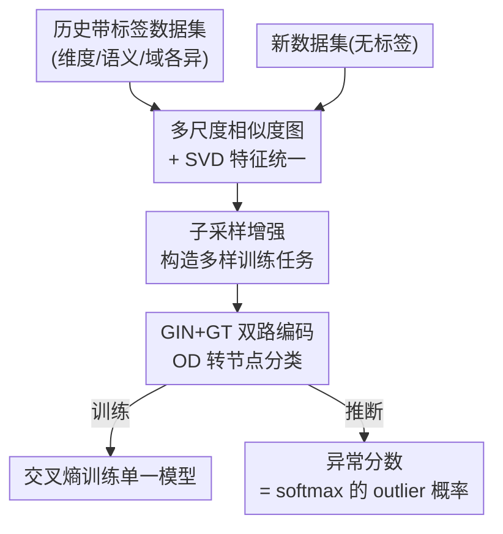

# UniOD: A Universal Model for Outlier Detection across Diverse Domains

**会议**: ICLR 2026  
**OpenReview**: [https://openreview.net/forum?id=Eu25AOvORb](https://openreview.net/forum?id=Eu25AOvORb)  
**代码**: https://github.com/fudazhiaka/UniOD  
**领域**: 异常检测 / 离群点检测 / 表格数据 / 图神经网络  
**关键词**: 通用离群检测, 相似度图, SVD 特征统一, 节点分类, 泛化界

## 一句话总结
UniOD 用一批历史带标签数据集训练**一个**通用离群检测模型：先把任意维度/语义的表格数据集统一成"多尺度相似度图 + SVD 特征"，再用 GIN+GT 双路图网络把离群检测转成节点二分类，训练完成后对**任何未见过的新数据集免训练、免调参**直接打异常分数，在 30 个基准上平均 AUROC/AUPRC 超过 17 个基线且耗时更低。

## 研究背景与动机
**领域现状**：离群检测（OD / 异常检测）是科学与工程里的基础环节，主流方法分两类——传统方法（LOF、Isolation Forest、KDE、kNN、OC-SVM 等）和深度方法（DeepSVDD、NeutralAD、PLAD、DPAD、ICL 等）。它们的共同范式是 **dataset-specific**：来一个新数据集，就要从头训练/拟合一个新模型。

**现有痛点**：这种"一数据集一模型"范式有三个硬伤。其一，**调参极其困难**——无监督场景下没有验证标签，但网络深度、宽度、学习率、方法专属超参的最优组合在不同数据集间差异巨大（论文 Figure 2 显示同一方法换数据集后 AUROC 可以从 90% 掉到 30%），调不好就废。其二，**部署前等待成本高**——每个数据集都要重新训练/拟合，模型和数据一大就很慢。其三，**历史知识被浪费**——大量历史数据集里其实藏着可迁移的"什么样算 inlier、什么样算 outlier"的模式，传统范式完全用不上。

**核心矛盾**：现有方法把每个数据集当成孤岛，既无法跨数据集复用知识，又必须为每个数据集单独承担调参/训练代价。而想做"通用模型"又有一个根本障碍——不同数据集的**特征维度、特征语义、样本量都不一样**（healthcare 的特征和 finance 的特征根本对不上），无法直接喂进同一个网络。已有的迁移学习类方法（如 LOCIT）则要求源域和目标域高度相似、且特征空间维度匹配，实践中很难满足。

**本文目标**：训练一个跨域通用的 OD 模型，对任意新表格数据集免重训、免调参直接出结果。要解决两个子问题：(1) 如何把异构维度/语义的数据集统一成可比的输入；(2) 如何让单一模型同时学到跨数据集的通用离群模式。

**切入角度**：作者的关键观察是——**相似度图能抹掉原始特征维度和语义**。把一个数据集转成点对点相似度矩阵后，剩下的只是"样本间相对结构"，这个结构在不同维度的数据集间是可比的；再用 SVD 取统一维度的嵌入，就得到了跨数据集对齐的特征。这样离群检测就自然变成图上的节点二分类问题。

**核心 idea**：用"多尺度相似度图 + SVD"把异构数据集统一成同维节点特征，用 GIN+GT 把 OD 重写成节点分类，让单一模型吃历史带标签数据集训练、对未见数据集直接推断。

## 方法详解

### 整体框架
UniOD 的目标是训练一个与具体测试数据集**完全解耦**的通用模型。给定一批历史带标签数据集 $D_H=\{D_{H_1},\dots,D_{H_M}\}$（每个样本带 inlier/outlier 标签）和一批无标签测试数据集 $D_T$，整条管线分三步：**特征统一 → 图编码与节点分类 → 训练/推断**。

训练阶段：对每个历史数据集，先用 $K$ 个不同带宽 $\sigma$ 构造多尺度高斯相似度矩阵，对每个矩阵做 SVD 得到统一维度 $d$ 的节点特征；同时对每个数据集做子采样增强，扩出更多样的训练任务。然后把每个数据集当成一组图结构数据，喂进 $K$ 个 GIN（吃相似度矩阵作邻接）和 $K$ 个 GT（图 Transformer），拼接成节点嵌入，最后过 MLP+softmax 预测每个节点是 inlier 还是 outlier，用交叉熵训练。

推断阶段：新数据集走**完全相同**的图构建流程（同样的多尺度相似度矩阵 + SVD），直接喂进已训练好的 GIN/GT/MLP，softmax 输出的"outlier 概率"就是异常分数——整个过程没有任何针对新数据集的参数优化或超参选择。

### 关键设计

**1. 多尺度相似度图 + SVD 特征统一：抹掉维度与语义差异，让异构数据集变可比**

这是整个"通用化"得以成立的地基，专治"不同数据集维度/语义对不上、没法喂同一个模型"这个根本障碍。对每个数据集 $D_{H_i}$，用高斯核构造相似度矩阵 $A^{(a,b)}_{H_i,\sigma}=\exp\!\big(-\|x^{(a)}-x^{(b)}\|^2/2\sigma^2\big)$。这里有两个坑：带宽 $\sigma$ 难选，且把整个数据集压成单一相似度矩阵会丢太多信息。作者的解法是**多尺度**——取 $K$ 个带宽 $\sigma_k=\beta_k\bar\sigma$（$\bar\sigma$ 为数据点间平均距离，$\beta_k$ 取 1 附近），生成 $K$ 个相似度矩阵；再对每个矩阵做 SVD 取前 $d$ 维：

$$A_{H_i,\sigma_k}=U\,\mathrm{diag}(\lambda_1,\dots,\lambda_{n})\,V^\top,\quad X_{H_i,\sigma_k}=[u_1,\dots,u_d]\,\mathrm{diag}(\lambda_1^{1/2},\dots,\lambda_d^{1/2})$$

拼起来得到统一维度 $Kd$ 的节点特征 $\tilde X_{H_i}\in\mathbb{R}^{n_{H_i}\times Kd}$。为什么有效：相似度矩阵只保留"样本间相对结构"，天然摆脱了原始特征的维度和语义，于是 healthcare 的数据集和 finance 的数据集在 SVD 嵌入空间里变得维度一致、可直接比较；多带宽则同时刻画局部（小 $\sigma$）和全局（大 $\sigma$）结构，减少信息损失——理论上也印证（见下）$K$ 越大泛化误差里训练误差越小。

**2. 子采样增强：从有限历史数据集里造出多样训练任务**

通用模型的泛化能力高度依赖训练任务的多样性，但真正可用的带标签历史数据集数量有限。作者用一个简单但有效的增强：对每个历史数据集 $D_{H_i}$ 随机抽 60% 样本、**保持异常比例不变**，造出 5 个合成数据集（记为 $\mathrm{Subsampling}(D_{H_i})$）。这相当于在不引入新标注成本的前提下，把每个历史数据集扩成一族结构相近但不完全相同的"任务"，显著扩充了训练分布的覆盖面。它和设计 1 配合得很紧——正是因为相似度图 + SVD 已经把数据统一成图，子采样才能廉价地批量产出多样的图结构训练样本。

**3. GIN+GT 双路编码、把 OD 写成节点分类：充分榨干相似度信息**

拿到统一特征 $\tilde X$ 后，最省事的做法是直接 MLP 分类，但那样会丢掉相似度矩阵 $A$ 里的点对点结构信息。作者改为把每个数据集看成图结构数据：$\{A_{H_i,\sigma_k}\}$ 当邻接矩阵、$\{X_{H_i,\sigma_k}\}$ 当节点特征，于是 OD 变成图上的**二分类节点分类**。模型用两条并行通路——$K$ 个 GIN（$L_1$ 层，显式吃邻接结构）和 $K$ 个 GT 图 Transformer（$L_2$ 层，捕捉全局依赖）：

$$Z^{GIN}_{H_i}=\mathrm{GIN}_{\theta_1}(\tilde X_{H_i},A_{H_i}),\quad Z^{GT}_{H_i}=\mathrm{GT}_{\theta_2}(\tilde X_{H_i}),\quad Z_{H_i}=[Z^{GIN}_{H_i},Z^{GT}_{H_i}]$$

拼接后过 $L_3$ 层 MLP + softmax 得到 $\hat Y_{H_i}=\mathrm{softmax}(\mathrm{MLP}_{\theta_3}(Z_{H_i}))$，节点异常分数取 softmax 第二维（outlier 概率）$\text{Score}(x^{(j)})=[\hat y^{(j)}]_2$。训练用跨数据集平均交叉熵 $L(\theta)=-\frac1M\sum_i\frac{1}{?}\sum_j\langle y^{(j)}_{H_i},\log\hat y^{(j)}_{H_i}\rangle$。GIN 负责把局部邻域密度差异（离群点邻域稀疏）编码进嵌入，GT 补充全局视角，双路互补让单一模型既能学到"通用的离群结构模式"，又能跨域迁移。

### 损失函数 / 训练策略
训练目标是 $M$ 个历史数据集（含子采样增强出的合成集）上节点二分类的平均交叉熵（式 10）。理论分析中也指出，损失函数不限于交叉熵，MSE、MAE、hinge loss 同样适用。为控制泛化界（谱范数项），实践中可对权重做谱归一化以保证 $b_W$ 较小。整个训练与测试集 $D_T$ 解耦，因此可做"在线"离群检测：模型训练一次，之后对任意新数据集只需一次前向。

## 实验关键数据

### 主实验
数据集用 ADBench 的 30 个真实数据集（覆盖 healthcare、audio、language、finance 等域），均分为 Group I / Group II 互为"历史集/测试集"做交叉验证；对比 17 个基线（传统：KDE/kNN/LOF/OC-SVM/IF/LODA/ECOD；深度：AE/DSVDD/NeutralAD/ICL/SLAD/DTE-NP/DPAD/KPCA+MLP/MLP+TF；模型选择：MetaOD）。指标用阈值无关的 AUROC 与 AUPRC（5 次平均）。

| 设置 | 指标 | UniOD | 次优基线 |
|--------|------|--------|----------|
| Group I（15 个集） | 平均 AUROC | **78.93** | kNN 76.00 |
| Group I | 平均 AUPRC | **45.43** | kNN 44.31 |
| Group II（15 个集） | 平均 AUROC | **78.52** | kNN 78.45 |
| Group II | 平均 AUPRC | **36.69** | KDE 32.24 |

四个设置上 UniOD 平均指标均为最优，AUROC 比次优高约 3 个百分点；尤其在 satellite、satimage-2、http、cover、shuttle 等数据集上明显领先。同样用到历史数据集的 KPCA+MLP、MLP+TF 被显著超过，说明优势来自图统一+双路 GNN 的建模而非"用了历史数据"本身。

| 方法 | AE | DSVDD | NeutralAD | ICL | SLAD | DPAD | UniOD |
|------|----|-------|-----------|-----|------|------|-------|
| 15 个集检测耗时(s) | 384 | 511 | 664 | 1391 | 485 | 788 | **240** |

UniOD 因免重训，检测 15 个数据集仅 240s，比所有 dataset-specific 深度方法都快（且该耗时还不含基线的调参时间）。

### 消融实验

| 配置 | 趋势 | 说明 |
|------|------|------|
| 历史数据集数 $M$：1→3→5→10→15 | 单调上升 | $M$ 越多，泛化性能越好（Figure 4a） |
| 带宽数 $K$ 增大 | 单调上升 | $K$ 越大信息损失越小，泛化能力越强（Figure 4b） |

### 关键发现
- **$M$ 和 $K$ 的实证趋势与泛化界（Theorem 4.1）完全吻合**：界里 $M$ 越大上界越紧、$\sqrt K$ 使增加 $K$ 对泛化 gap 影响很小却能降训练误差从而提升测试精度——理论预测与消融曲线对上。
- **简单传统方法在低维表格上意外强**：kNN、KDE 在不少数据集上反超多数深度方法，作者解释为低维表格里欧氏距离已能反映语义差异；但维度升高后深度方法（含 UniOD）更有优势。
- **学到的表示可解释**：t-SNE 显示多数 outlier 聚成一个小而密的簇、少部分以孤立节点出现，印证节点分类视角的合理性。

## 亮点与洞察
- **"相似度图 + SVD"作为跨域统一接口**：把"维度/语义不一致"这个通用模型最大的拦路虎，用一个不依赖原始特征的相对结构表示一举绕开——这个把异构表格统一成同维图的 trick，可迁移到任何需要跨数据集共享模型的表格任务（如通用分类、表格基础模型）。
- **带理论保证的通用 OD**：少见地为"训练数据由多个不同数据集组成、且图构建让样本不再独立"的复杂设定推出泛化界，并用 $M$、$K$ 的消融实证对齐，让"多数据集 + 多带宽有助泛化"不只是经验直觉。
- **免训练免调参 = 真·即插即用**：无监督 OD 最痛的调参问题被彻底跳过，对新数据集只需一次前向，部署体验接近"上传即出结果"，对工业落地价值大。

## 局限与展望
- 作者指出 UniOD 主要面向 **transductive**（直推式）异常检测；虽然也能通过把训练集与每个测试点都转成图来做 inductive，但那不是主力设定。
- **依赖相似度图的构建质量**：高斯核 + 多带宽对样本量大的数据集要算 $O(n^2)$ 量级的相似度，论文里对 >6000 样本的数据集要子采样到 6000，说明可扩展性受限于相似度矩阵规模。
- **理论假设较强且部分量复杂**：泛化界依赖谱范数、Lipschitz 等假设，界中若干常数（如 $b_Z^{(i-1)}$）较复杂，实际指导性偏弱，更多是定性印证。
- 低维表格上被 kNN/KDE 反超的现象提示：UniOD 的相对优势更多体现在中高维与跨域迁移，并非在所有数据集上都最优（如 optdigits、letter 等仍落后）。

## 相关工作与启发
- **vs 传统/深度 dataset-specific OD（LOF、IF、DeepSVDD、DPAD、ICL）**：它们一数据集一模型、要逐个调参训练；UniOD 单模型通吃，免重训免调参，且检测更快。
- **vs 模型/超参选择方法（MetaOD、HPOD、ROBOD、ELECT、PyOD2、MetaOOD）**：这些方法仍要在历史数据集上穷举评估超参组合，代价高；UniOD 直接学一个通用模型，跳过选择环节。
- **vs 迁移学习类 OD（LOCIT）**：迁移类方法要求源/目标域强相似且特征空间维度匹配；UniOD 用相似度图 + SVD 抹掉维度与语义差异，天然支持异构维度、异构域。

## 评分
- 新颖性: ⭐⭐⭐⭐⭐ "相似度图+SVD 统一异构数据集 + 单模型免重训通用 OD"是 OD 范式上的实质突破。
- 实验充分度: ⭐⭐⭐⭐ 30 个数据集、17 个基线、双指标 + 交叉验证 + 耗时 + 消融齐全，唯部分大数据集需子采样。
- 写作质量: ⭐⭐⭐⭐ 动机—方法—理论—实验闭环清晰，理论部分稍密。
- 价值: ⭐⭐⭐⭐⭐ 免调参即插即用 + 理论保证，对工业级异常检测落地价值高。

<!-- RELATED:START -->

## 相关论文

- [\[ICLR 2026\] Healthcare Insurance Fraud Detection via Continual Fiedler Vector Graph Model](healthcare_insurance_fraud_detection_via_continual_fiedler_vector_graph_model.md)
- [\[ICLR 2026\] ReTabAD: A Benchmark for Restoring Semantic Context in Tabular Anomaly Detection](retabad_a_benchmark_for_restoring_semantic_context_in_tabular_anomaly_detection.md)
- [\[ICLR 2026\] MRAD: Zero-Shot Anomaly Detection with Memory-Driven Retrieval](mrad_zero-shot_anomaly_detection_with_memory-driven_retrieval.md)
- [\[ICLR 2026\] Low Rank Transformer for Multivariate Time Series Anomaly Detection and Localization](low_rank_transformer_for_multivariate_time_series_anomaly_detection_and_localiza.md)
- [\[ICLR 2026\] Adaptive Conformal Anomaly Detection with Time Series Foundation Models for Signal Monitoring](adaptive_conformal_anomaly_detection_with_time_series_foundation_models_for_sign.md)

<!-- RELATED:END -->
