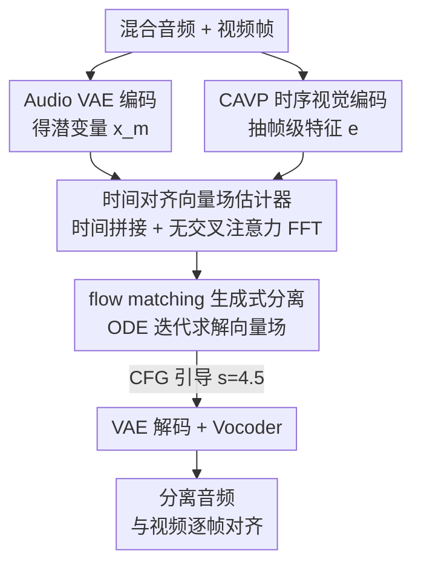

# AlignSep: Temporally-Aligned Video-Queried Sound Separation with Flow Matching

**会议**: ICLR2026  
**OpenReview**: [https://openreview.net/forum?id=DVDkFcxU1D](https://openreview.net/forum?id=DVDkFcxU1D)  
**代码**: https://AlignSep.github.io （项目页，承诺录用后开源）  
**领域**: 音频/语音 · 视听分离 · 流匹配生成  
**关键词**: 视频查询声音分离, flow matching, 时间对齐, 生成式分离, 视听一致性

## 一句话总结
AlignSep 把"视频查询声音分离（VQSS）"从主流的时频掩码判别范式换成基于 flow matching 的生成范式，靠一个用"时间拼接 + 无交叉注意力 Transformer"实现的时间对齐向量场估计器，强制音频与视频帧逐帧同步，从而在同类干扰、声轨重叠的难场景里干净地抠出在屏目标声音，并在自建的 VGGSound-Hard 基准上把时间对齐分数 $T_{A\text{-}V}$ 做到了 95.76%。

## 研究背景与动机
**领域现状**：视频查询声音分离（Video-Queried Sound Separation, VQSS）的目标是：给定一段混合音频和对应视频，把"画面里物体发出的声音"抠出来，同时压掉画外（off-screen）的干扰声。它是视听理解的核心任务，可用于视频剪辑、无障碍增强、内容分析。主流方法（CLIPSep、i-Query、OmniSep）走的是两条腿：用视觉预训练模型抽语义特征做条件，再用时频掩码（time–frequency masking）从混合谱里把目标频带"乘"出来。

**现有痛点**：这条路在两类真实场景下崩掉。其一是**同类干扰**——画面里一只狗在叫、画外另一只狗也在叫，两者语义类别完全一样，只靠"这是狗叫"的语义条件根本分不清哪只在屏内。其二是**声轨重叠**——当多个声源在时间和频率上都交叠时，掩码方法没法把它们干净劈开，会留下"频谱空洞（spectral holes）"和分离不彻底的伪影。

**核心矛盾**：根本原因是现有方法**只建模空间语义、不建模时序对齐**。区分同类的在屏/画外声源，靠的不是"是什么声音"，而是"视觉动作的节奏和音频能量是否逐帧对得上"——比如鼓点停了画面里的敲击动作也停了，目标声音就该跟着停。语义条件天生没有这种帧级时间信息。此外，掩码这种判别式建模在频带重叠时数学上就无法恢复出干净独立的信号。

**本文目标**：(1) 让分离显式利用视听的**细粒度时间对齐**，而不仅是语义；(2) 用生成式建模绕开掩码方法的频谱空洞问题；(3) 提供一个真正考验时间对齐能力的评测基准。

**切入角度**：作者注意到生成式模型（扩散 / flow matching）在每一步推理时都能带着跨模态条件做迭代细化，天然适合把"模糊的能量逐步路由到正确声源"，而且能直接生成完整波形、不留频谱空洞。但 VQSS 与传统单条件 flow matching（如文生音）有本质区别：它是**多条件**任务，同时被"原始混合音频"和"视频序列"约束。

**核心 idea**：把 VQSS 重写成一个**条件 flow matching** 问题——学一个从"混合音频分布"到"干净音频分布"的、以视觉为条件的概率流；并设计一个**强制时间对齐的向量场估计器**，用最简单的时间维拼接把视频特征逐帧贴到音频潜变量上，让生成过程始终被视觉时序钉住。

## 方法详解

### 整体框架
AlignSep 是第一个基于 flow matching 的生成式 VQSS 模型。它要做的事是：把"混合音频的潜变量分布"沿一条以视觉为条件的概率流，搬运到"干净目标音频的潜变量分布"。

整条流水线是这样转的：混合音频 $A^m$ 先经预训练 Audio VAE 编码器压成梅尔谱潜变量 $x^m$（维度 20）；视频帧序列经 CAVP 时序视觉编码器抽成带时间同步信息的特征 $e$（维度 512）。推理时，从混合音频潜变量出发、加高斯噪声扰动，再由一个**时间对齐向量场估计器**预测向量场 $v(x,t,e;\theta)$，用 ODE 求解器（Euler 法）沿时间 $t\in[0,1]$ 迭代积分，逐步把"加噪的混合音频潜变量"去噪成"与视频时间对齐的干净音频潜变量"；最后过 VAE 解码器还原梅尔谱、再经 BigVGAN 声码器合成最终波形。

整个生成过程被视觉条件 $e$ 全程牵引，所以输出的分离音频在时间轴上严格跟随驱动视频。

> VGGSound-Hard 是为评测这套框架而专门构造的难基准，不在推理流水线上，放在关键设计末尾单独讲。

### 关键设计

**1. CAVP 时序视觉编码：用"会看动作节奏"的编码器替掉"只认类别"的语义编码器**

痛点很直接：分同类的在屏/画外声音，靠 ImageBind 这类全局语义表征没用，它只告诉你"画面里有只狗"，不告诉你"狗在第几帧张嘴叫"。AlignSep 改用来自视频转音频（V2A）工作的预训练 CAVP（Contrastive Audio-Visual Pretraining）编码器。CAVP 在预训练时就引入了视频与音频之间的**时间同步监督**，因此抽出来的特征 $e$ 捕捉的是跨帧的动态时序相关性，而非静态语义。这一步是后面所有"时间对齐"能力的源头——只有视觉特征本身带时序信息，下游的向量场估计器才有东西可对齐。视频降采到 4 FPS、8 秒片段，特征维度 512。

**2. 时间对齐向量场估计器：用最朴素的"时间维拼接"把视觉时序钉死在音频上**

这是模型的核心。痛点是：多条件生成里，怎么保证生成的音频和视频帧**逐帧**对得上，而不是只在语义层面"大致相关"。作者的做法刻意避开了交叉注意力（cross-attention），改用一个**无交叉注意力的前馈 Transformer（feed-forward Transformer，4 层、隐藏维 576）**配上一种简单到有点反直觉的**时间拼接（temporal concatenation）**策略：先把 512 维的 CAVP 视频特征沿时间维**扩展**到与 20 维音频潜变量相同的时间长度，保证逐帧一一对应；然后把对齐后的视频特征和音频特征**拼接**起来，再把时间步编码向量 $t$ 接在序列末尾，整个喂进 Transformer 预测向量场。

为什么不用交叉注意力？因为交叉注意力是"软对齐"，模型可以自由地在时间轴上挑选注意哪些帧，反而容易丢掉严格的帧级对应；而硬性的时间拼接强制了"第 $i$ 帧视频特征就贴在第 $i$ 段音频潜变量旁边"，把时间对应关系做成了结构先验，让向量场估计器无从偷懒。这正是 AlignSep 在 $T_{A\text{-}V}$ 上大幅超越基线的结构来源。

**3. flow matching 生成式分离范式 + 多条件流的深度分析：为什么直接搬 rectified flow 会翻车**

把 VQSS 形式化为条件流匹配（Conditional Flow Matching, CFM）：源分布 $x^m\sim p_m(x)$ 是混合音频潜变量，目标分布 $x^c\sim p_c(x)$ 是干净音频潜变量，二者之间的搬运由 ODE $\mathrm{d}x=u(x,t,e)\,\mathrm{d}t$ 描述。由于真实目标分布未知、$u$ 难以直接算，训练用 CFM 目标：

$$\mathcal{L}_{\text{CFM}}(\theta)=\mathbb{E}_{t,\,p_c(x^c),\,p_t(x,x^c)}\big\|v(x,t,e;\theta)-u(x,t,x^c,e)\big\|^2$$

它通过设计可采样的条件概率路径 $p_t(x\mid x^c)$ 来绕开对边缘分布的依赖。相比掩码判别式方法，生成范式每步推理都带着跨模态条件做迭代细化，能逐步把模糊能量"路由"到正确声源、强制混合一致性与相位一致性，从而**根治频谱空洞**。

更有价值的是作者对"多条件流"的分析：VQSS 同时被混合音频 $m$ 和视频序列 $v_{1:T}$ 约束，要做的是"时间–频率–物体"三重路由，导致后验 $p(s\mid m,v_{1:T})$ **高度多模态、分段不光滑**，常出现离散分叉和高曲率的搬运路径。在这种结构下，把轨迹拉直成确定性 ODE 的 **Rectified Flow（RF）加速会失效**——单条确定性轨迹会偏向高密度区、在多个模态间"求平均"，而且 RF 缺少扩散模型那种"去噪—一致性投影"的迭代纠错回路，没法修正早期的错误分配。实验印证：RF 即便跑 100 步，$S_{A\text{-}V}$ 也只有 57.36，远低于扩散式 AlignSep 的 73.64。这解释了为什么生成式分离在 VQSS 里不能图快直接上 RF。

**4. VGGSound-Hard 基准：专为"同类干扰下的时间对齐"造一把尺子**

痛点是现有基准（VGGSound-Clean、MUSIC-Clean）的目标声和干扰声来自**不同类别**，语义就能区分，太简单，根本测不出时间对齐能力。作者从 VGGSound 测试集出发构造难基准：先按类别分组，组内用 CLAP 音频编码器算两两余弦相似度，取最高分的对，得到约 2000 个同类候选对；按 CLIPSep 的合成流程把同类对混合。然后做一轮**人工核验**，标准有两条：(1) 视频里必须有可辨识节奏/时序结构的动作（排除没有可见运动线索的喇叭声），让标注者能从画面推断声音事件的时机；(2) 所有目标声源必须在画面内（在屏），不要求模型分离画外声。过滤后留下 118 个语义同质但时序模式清晰不同的高质量视听对，构成 VGGSound-Hard。这把尺子把"能否靠时间对齐分同类声"逼到了台前。

### 损失函数 / 训练策略
训练目标即上面的条件流匹配损失 $\mathcal{L}_{\text{CFM}}$。推理时配合 **classifier-free guidance（CFG）**：随机丢弃视觉条件 $e$、替换为"null"嵌入来训练无条件分支，采样时按 $\hat{v}(x,t,e;\theta)=s\cdot v(x,t,e;\theta)+(1-s)\cdot v(x,t,\varnothing;\theta)$ 组合条件与无条件输出，引导尺度 $s=4.5$，在质量与多样性之间取舍。ODE 用 Euler 法离散求解，默认 25 步。音频统一 16 kHz、80 维梅尔谱、hop size 256，片段 8 秒。

## 实验关键数据

### 主实验
评测协议分两维：语义对齐（CLAP 算音频–音频 $S_{A\text{-}A}$、ImageBind 算音频–视频 $S_{A\text{-}V}$）和时间同步（对齐准确率 $T_{A\text{-}V}$）。

| 数据集 | 指标 | AlignSep | OmniSep | CLIPSep |
|--------|------|----------|---------|---------|
| VGGSound-Clean | $S_{A\text{-}A}\uparrow$ | **73.38** | 70.83 | 66.74 |
| VGGSound-Clean | $T_{A\text{-}V}\uparrow$ | **96.88** | 81.25 | 79.17 |
| Music-Clean | $T_{A\text{-}V}\uparrow$ | 66.67 | **68.89** | 51.11 |
| VGGSound-Hard | $T_{A\text{-}V}\uparrow$ | **95.76** | 76.27 | 85.59 |

最关键的对比是 VGGSound-Hard 上的时间对齐：AlignSep 95.76% vs OmniSep 76.27%——OmniSep 在简单的 VGGSound-Clean 上靠强语义对齐还行，一到需要时序建模的难基准就掉到 76，印证了"光有语义不够"。主观 MOS（NR/AVC/AQ/OA 四维）上 AlignSep 也几乎全面领先，Music-Clean 上 AVC 4.53、总分 4.31，VGGSound-Hard 总分 4.43。

### 消融实验
去噪步数（ODE 步数）是核心效率–质量权衡：

| 配置 | VGGSound-Clean $T_{A\text{-}V}$ | VGGSound-Hard $T_{A\text{-}V}$ | FPS（吞吐） |
|------|------|------|------|
| AlignSep (Step=5) | 85.42 | 88.14 | 5.56 |
| AlignSep (Step=10) | 92.71 | 94.07 | 4.00 |
| **AlignSep (Step=25)** | **96.88** | **95.76** | 2.17 |
| AlignSep (Step=50) | 95.83 | 93.22 | 1.35 |
| AlignSep (Step=100) | 96.88 | 93.22 | 0.72 |
| Rectified Flow (Step=100) | 84.38 | 92.37 | 0.77 |

### 关键发现
- **25 步是甜点**：$S_{A\text{-}V}$ 随步数从 5→25 升（64.47→73.38），但 25 步后基本饱和；$T_{A\text{-}V}$ 在 25 步就达 96.88，再加步数不升反微降。25 步跑 2.17 FPS，约比 100 步快 3 倍，是质量与效率的最佳折中。
- **VQSS 比一般生成任务需要的步数少**：因为它有强先验——混合音频本身已含目标声大半内容，视频又提供帧级约束，所以不必像文生音那样跑很多步。10 步也能维持 $T_{A\text{-}V}\approx 92\text{–}94$，适合实时场景。
- **Rectified Flow 在 VQSS 上明显劣化**：100 步的 RF $S_{A\text{-}V}$ 只有 57.36（扩散式 73.64），印证多条件、多模态后验下确定性直线轨迹会"求平均"、缺纠错回路。
- **时间信息越多越好**：随参考帧率 FPS 上升，AlignSep 对齐准确率从 0.25 FPS 的 ~0.76 稳升到 4 FPS 的 ~0.95；而纯语义的 CLIPSep 曲线几乎平在 0.81，对视觉时间分辨率毫不敏感——直接证明 AlignSep 真在吃时间线索。

## 亮点与洞察
- **"时间拼接"这种朴素结构反而比交叉注意力更稳**：把视频特征沿时间维扩展后直接拼到音频潜变量旁，用结构先验硬性锁死帧级对应，避开了软注意力可能丢失严格时序的问题——这个"少即是多"的设计是 $T_{A\text{-}V}$ 大幅领先的根。
- **对多条件流不光滑性的分析很有迁移价值**：作者把"为什么 rectified flow 加速在 VQSS 失效"归因到后验分布的多模态、分段不光滑与缺纠错回路，这套论证适用于任何"强条件、多模态后验"的生成分离/编辑任务，提醒人别无脑套加速技巧。
- **生成式范式天然消灭频谱空洞**：直接生成完整波形而非掩码乘谱，从机制上绕开了掩码方法在频带重叠时的伪影——这是把判别式换成生成式带来的"免费午餐"。
- **VGGSound-Hard 的造法可复用**：用 CLAP 组内相似度挑同类对 + 人工核验时序线索，是构造"逼出时间对齐能力"难样本的通用配方。

## 局限与展望
- **依赖外部预训练编码器**：CAVP 视觉编码器和 Audio VAE 都是现成预训练件，AlignSep 的时间对齐能力上限被 CAVP 的同步质量框死；若领域偏移（如非自然声场景），CAVP 失准会直接拖垮分离。
- **生成式推理仍慢于掩码法**：即便 25 步、2.17 FPS，比掩码判别式（OmniSep 11.2 FPS）仍慢约 5 倍，离严格实时还有距离。
- **VGGSound-Hard 规模偏小**：人工核验后只剩 118 对，评测统计量有限，难以充分反映长尾分布；且只覆盖"在屏目标"，没测"目标在画外"的更难设定。
- **多源（>2）分离未验证**：实验都是目标 + 单干扰的两源混合，三源及以上的同类干扰、时间路由是否还稳，论文没给。
- **改进思路**：可探索把时间对齐做成可学习的对齐而非纯结构拼接、或引入蒸馏/一致性模型把步数压到 1–2 步同时保住时间对齐，缓解效率短板。

## 相关工作与启发
- **vs OmniSep / CLIPSep（语义掩码范式）**：它们用视觉语义条件 + 时频掩码，本文换成 CAVP 时序条件 + flow matching 生成。区别在于本文显式建模帧级时间对齐并直接生成波形；优势是难场景（同类干扰、声轨重叠）大幅领先且无频谱空洞，劣势是推理更慢。
- **vs i-Query**：i-Query 用交叉注意力检测发声物体，但依赖预提取的物体框；本文不需要框、也刻意不用交叉注意力，靠时间拼接做硬对齐。
- **vs 通用生成式分离（GAN / 扩散 / flow，如 Yuan et al. 2024）**：前作多是单条件或无视觉时序，本文首次把生成式分离落到"视频查询 + 严格时间对齐"的多条件设定，并给出了 rectified flow 为何在此失效的分析。
- **vs V2A（视频转音频）工作**：本文复用了 V2A 的 CAVP 时序编码器与评测思路，但任务是"从混合里抠出目标"而非"从无到有生成音频"，混合音频提供了强先验，因此所需采样步数更少。

## 评分
- 新颖性: ⭐⭐⭐⭐⭐ 首个 flow-matching 生成式 VQSS，时间拼接对齐 + 多条件流分析都很扎实
- 实验充分度: ⭐⭐⭐⭐ 三基准 + MOS + 步数/FPS/RF 消融齐全，但难基准仅 118 对、缺多源验证
- 写作质量: ⭐⭐⭐⭐ 动机—矛盾—方法链条清晰，rectified flow 失效分析尤其精彩
- 价值: ⭐⭐⭐⭐ 把视听分离推进到时间对齐层面，VGGSound-Hard 与分析对社区有长期价值

<!-- RELATED:START -->

## 相关论文

- [\[ICLR 2026\] Flow2GAN: Hybrid Flow Matching and GAN with Multi-Resolution Network for Few-step High-Fidelity Audio Generation](flow2gan_hybrid_flow_matching_and_gan_with_multi-resolution_network_for_few-step.md)
- [\[NeurIPS 2025\] Shallow Flow Matching for Coarse-to-Fine Text-to-Speech Synthesis](../../NeurIPS2025/audio_speech/shallow_flow_matching_for_coarse-to-fine_text-to-speech_synthesis.md)
- [\[ACL 2026\] ZipVoice-Dialog: Non-Autoregressive Spoken Dialogue Generation with Flow Matching](../../ACL2026/audio_speech/zipvoice-dialog_non-autoregressive_spoken_dialogue_generation_with_flow_matching.md)
- [\[AAAI 2026\] USE: A Unified Model for Universal Sound Separation and Extraction](../../AAAI2026/audio_speech/use_a_unified_model_for_universal_sound_separation_and_extraction.md)
- [\[ICML 2026\] A Semantically Consistent Dataset for Data-Efficient Query-Based Universal Sound Separation](../../ICML2026/audio_speech/a_semantically_consistent_dataset_for_data-efficient_query-based_universal_sound.md)

<!-- RELATED:END -->
