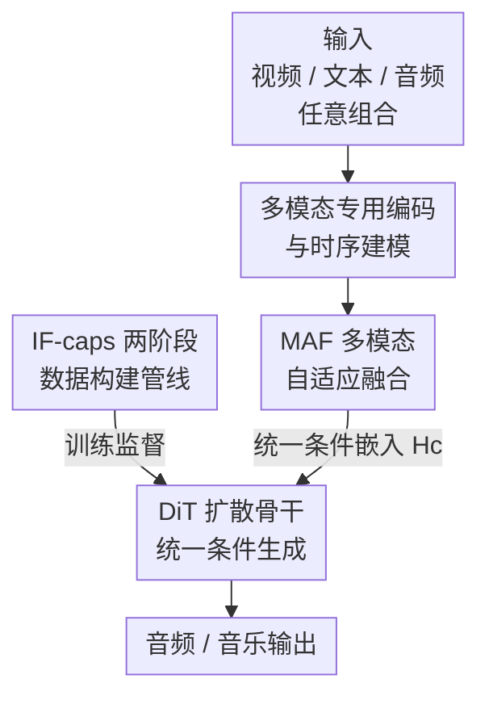

# AudioX: A Unified Framework for Anything-to-Audio Generation

**会议**: ICLR2026  
**OpenReview**: [https://openreview.net/forum?id=qjJWxK3yWo](https://openreview.net/forum?id=qjJWxK3yWo)  
**代码**: https://zeyuet.github.io/AudioX/  
**领域**: 音频生成 / 多模态扩散  
**关键词**: 任意到音频生成, 多模态融合, 扩散 Transformer, 指令跟随, 数据构建

## 一句话总结
AudioX 用一个基于扩散 Transformer（DiT）的统一模型，配上一个轻量的「多模态自适应融合（MAF）」模块和 700 万条自建多模态数据 IF-caps，让单一权重就能从文本、视频、音频的任意组合生成高保真音效与音乐，并在细粒度指令跟随上大幅领先各路专才模型。

## 研究背景与动机
**领域现状**：音效与音乐生成近年随生成模型快速发展，已经在影视、游戏、社交媒体里有实用价值。但主流做法是「一任务一模型」——文本到音频、视频到音频各自为政，输出也往往锁定在音效或音乐其中一类。

**现有痛点**：少数尝试统一的工作虽然能吃多种输入，却普遍缺乏对「任意模态组合」的灵活支持，指令跟随能力也很弱（比如要求「先有脚步声、再有关门声」这种次序/计数控制时基本做不到）。

**核心矛盾**：作者把根因归到数据上——能训练统一模型的高质量多模态数据极度稀缺。现有数据集大多是任务专用、只对单一条件模态有监督（要么只有文本-音频对，要么只有视频-音乐对），既不「多模态」也不「可组合」，统一模型根本喂不饱。

**本文目标**：拆成两个子问题——(1) 设计一个能同时容纳文本/视频/音频条件、并把它们干净融合的统一建模框架；(2) 造出大规模、细粒度、可组合的多模态监督数据。

**切入角度**：作者观察到 Transformer 擅长跨模态对齐、而扩散模型（尤其 DiT）在音频保真度上压过自回归 next-token 预测，于是把两者结合：用 DiT 当生成骨干，再在条件侧加一个专门负责「挑出有用信号、压住跨模态噪声」的融合模块。

**核心 idea**：「统一骨干 + 自适应融合 + 高质量多模态数据」三件套——用一套 DiT 权重覆盖 anything-to-audio，用 MAF 模块解决多模态相互干扰，用两阶段标注管线批量造数据。

## 方法详解

### 整体框架
AudioX 的输入是视频 $X_v$、文本 $X_t$、音频 $X_a$ 的任意子集（缺哪个模态就补零或补默认文本），输出是与条件对齐的高保真音频/音乐波形。整条链路是：三路条件各自过专用编码器并做时序建模，得到模态嵌入 $H_v, H_t, H_a$；这些嵌入送进 MAF 模块做自适应融合，拼成统一条件嵌入 $H_c$；$H_c$ 连同扩散时间步 $t$ 一起，通过交叉注意力去引导 DiT 骨干在隐空间里去噪生成。训练这套统一模型所需的多模态监督，全部来自自建的 IF-caps 数据集（700 万条），它由一条两阶段标注管线离线造好后喂给 DiT。

### 关键设计

**1. IF-caps 两阶段数据构建：用强弱模型分工解决统一训练的数据稀缺**

统一模型最大的瓶颈是数据——现有数据集要么标签粗（只有类别 label）、要么单模态，喂不出「能听懂复杂指令」的模型。作者设计了一条针对已有视频数据集的标注管线：先用强多模态 LLM（Gemini 2.5 Pro）处理每个 10 秒视频-音频片段，产出一个整体 caption 加一组结构化字段（通用音频标注「声音事件类别 + 计数」，音乐标注「曲风 + 乐器 + 节奏」等）。但全量都用 Gemini 太贵，于是第二阶段改用开源的 Qwen2-Audio：以「初始标注 + 原始音频」为条件批量扩写出更多样的 caption，在控制成本的同时把数据多样性拉上来。最终得到约 130 万条视频-音频片段和 570 万条视频-音乐片段的细粒度标注。这种「强模型打底、弱模型放量」的分工，本质是把质量和成本解耦，让 700 万级的细粒度监督在可承受预算内变得可行。

**2. 多模态专用编码与时序建模：把异构条件对齐到同一表示空间**

文本、视频、音频天然异构，直接拼进骨干会让模型学不动。AudioX 给每个模态配专用编码器：视频用 CLIP-ViT-B/32 抽帧级语义特征（5 fps）、再用 Synchformer 抽同步特征（25 fps），两者相加；文本用 T5-base 编码；音频用一个音频自编码器编解码。视频和音频特征还会过一个时序 Transformer 捕捉时间动态，最后经投影头映射成同维的模态嵌入 $H_v, H_t, H_a$。当某个模态缺失时，视频/音频用零填充、文本用自然语言模板替代（如视频到音乐任务里填「Generate music for the video.」），这套「缺啥补啥」的处理让同一模型能无缝吃任意模态组合，是统一框架能成立的工程基础。

**3. MAF 多模态自适应融合：门控 + 专家 query + 自注意力压住跨模态干扰**

这是全文的核心模块，专治「不同模态信号互相打架」。MAF 的流程是：先让每个模态的初始嵌入各过一个门控（gate），过滤并重加权、压低噪声只留最有信息量的线索；接着把门控后的嵌入拼接，由一组可学习 query 通过交叉注意力来「问询」——这些 query 被分成三套模态专属集合，像专家一样分别评估并聚合各数据流的证据；然后一层自注意力把聚合到的上下文做整合，再把精炼后的信息以残差方式回写到各模态路径，得到校准过的模态输出，最后拼成统一条件嵌入：

$$\tilde{H}_v, \tilde{H}_t, \tilde{H}_a = \mathrm{MAF}(H_v, H_t, H_a), \qquad H_c = \mathrm{Concat}\left(\tilde{H}_v, \tilde{H}_t, \tilde{H}_a\right).$$

关键是它很轻——在 2.4B 总参数（1.1B 可训练）里 MAF 只占 60M。消融显示去掉整个 MAF 掉点最狠，单独去掉门控或 query 都会下滑，说明「先门控降噪、再用专家 query 跨模态聚合、最后残差校准」这套设计对减少干扰、提升指令跟随确实是必要的，而不是堆参数。

**4. DiT 扩散骨干的统一条件生成：一套权重覆盖任意到音频任务**

拿到统一条件嵌入 $H_c$ 后，生成交给 DiT 骨干（24 层，初始化自 Stable Audio Open 的预训练权重）。它在隐空间里做标准的去噪扩散：先把真值音频 $A$ 用编码器投到隐表示 $z = E(A)$，前向过程按马尔可夫链逐步加噪 $q(z_t|z_{t-1}) = \mathcal{N}(z_t; \sqrt{1-\beta_t}\,z_{t-1}, \beta_t I)$；反向训练一个网络 $\epsilon_\theta$ 在每个时间步预测噪声，条件是 $z_t$、时间步 $t$ 和 $H_c$，目标就是最小化噪声估计误差：

$$\min_\theta \ \mathbb{E}_{t, z_t, \epsilon}\ \left\| \epsilon - \epsilon_\theta(z_t, t, H_c) \right\|_2^2.$$

正因为所有任务（T2A、V2A、TV2A、T2M、V2M、TV2M、音频补全、音乐续写）都被统一成「给定 $H_c$ 的条件去噪」，同一套 DiT 权重才能覆盖任意到音频的全谱任务。音频补全时 $X_a$ 是被遮挡的真值、模型去填空；音乐续写时 $X_a$ 是前段、模型续后段——都靠改变条件而非换模型来实现。

### 损失函数 / 训练策略
训练目标即上面的噪声预测 MSE。优化用 AdamW，基础学习率 1e-5、权重衰减 0.001，配指数式 ramp-up/decay 调度，并维护权重 EMA 稳定推理。在 3 个集群的 NVIDIA H800（80GB）上训练，约 4k GPU 小时，batch size 48。推理用 250 步、classifier-free guidance 系数 7.0。

## 实验关键数据

### 主实验
单一 AudioX 在多任务多数据集上对比各专才 SOTA（节选 Table 1，IS 越高越好，FAD/FD/KL 越低越好）：

| 数据集 | 任务 | 方法 | IS ↑ | FAD ↓ | FD ↓ |
|--------|------|------|------|-------|------|
| VGGSound | T2A | MMAudio | 17.83 | 2.50 | 11.52 |
| VGGSound | T2A | **AudioX** | **19.58** | **1.33** | **9.01** |
| MusicCaps | T2M | TangoMusic | 2.86 | 1.88 | 15.00 |
| MusicCaps | T2M | **AudioX** | **3.55** | **1.53** | **9.76** |
| AudioCaps | T2A | Tango 2 | 10.37 | 3.20 | 12.22 |
| AudioCaps | T2A | **AudioX** | **12.48** | **1.59** | **11.51** |

文本到音频、文本到音乐上 AudioX 拿下 SOTA（VGGSound 上优势尤其明显）；视频到音频在 VGGSound 和域外的 AVVP 上与最强基线 MMAudio 相当，证明泛化能力不错。

指令跟随对比（Table 2，T2A-bench 的 Cat/Cnt/Ord/TS-acc 越高越好，AudioTime 的 Ordering 越低越好）：

| 方法 | Cat-acc ↑ | Cnt-acc ↑ | Ord-acc ↑ | TS-acc ↑ | AudioTime Ordering ↓ |
|------|-----------|-----------|-----------|----------|----------------------|
| Stable Audio Open | 31.20 | 9.80 | 6.00 | 21.80 | 0.98 |
| Make-An-Audio2 | 32.40 | 4.00 | 19.80 | 18.80 | 0.76 |
| MMAudio | 26.60 | 4.80 | 2.40 | 21.40 | 0.98 |
| **AudioX** | **34.20** | **12.40** | **23.60** | **28.20** | **0.34** |

在需要细粒度控制（类别/计数/次序/时间戳）的任务上，AudioX 全维度领先，Ordering 从基线的 ~0.9 砍到 0.34，是数量级的差距。

### 消融实验

数据构建策略（Table 3，文本监督质量逐级提升）：

| Caption 来源 | Cat-acc ↑ | T2A IS ↑ | V2A FAD ↓ |
|--------------|-----------|----------|-----------|
| Labels（原始类别标签） | 17.35 | 7.59 | 1.81 |
| AudioSetCaps（外部数据集） | 27.85 | 10.08 | 1.33 |
| QwenCap（仅 Qwen 直接生成） | 24.60 | 9.74 | 1.67 |
| GeminiCap（仅 Gemini 初标） | 28.05 | 10.81 | 1.31 |
| **GeminiCap-aug（完整两阶段）** | **28.91** | **10.93** | **1.15** |

MAF 架构（Table 4）：

| 配置 | IS ↑ | FAD ↓ | Ordering ↓ | 说明 |
|------|------|-------|-----------|------|
| w/o MAF | 10.70 | 2.67 | 0.912 | 去掉整个模块，掉点最狠 |
| w/o Gate | 11.66 | 2.00 | 0.876 | 只去门控 |
| w/o Query | 11.72 | 2.08 | 0.912 | 只去专家 query |
| **Full MAF** | **11.84** | **1.98** | 0.888 | 门控 + query 都在 |

### 关键发现
- MAF 里门控和专家 query 都不可省，整体缺失时退化最严重，验证「先降噪再聚合再校准」三步缺一不可。
- **跨模态正则化效应**：提升文本监督的质量与粒度，不只让 T2A 变好，连 V2A 都明显受益（GeminiCap-aug 把 V2A FAD 从 1.81 压到 1.15）。作者据此提出一个对未来有指导意义的结论——高质量文本数据不只是输入，更是构建鲁棒多模态模型的有效策略。
- 高保真不等于强指令跟随：Tango 2 合成质量很高，但在控制类指标上只是中等，说明保真度和可控性是两个相对独立的维度。

## 亮点与洞察
- **「数据 + 架构」双轮驱动讲得很干净**：把统一模型做不好归因到数据稀缺和跨模态干扰两个具体病因，再分别用 IF-caps 和 MAF 对症下药，逻辑闭环、不空谈。
- **MAF 的「门控→专家 query→自注意力→残差回写」是可迁移的融合范式**：任何需要把多路异构条件喂进同一生成骨干的场景（如多条件图像/视频生成），都能借这套「先过滤再专家聚合」的轻量模块思路。
- **跨模态正则化是真正的「啊哈」点**：把文本监督质量当成提升非文本任务（V2A）的杠杆，颠覆了「视频任务就该堆视频数据」的直觉，对多模态数据投资策略有启发。
- **新基准 T2A-bench 补了控制力评测的坑**：现有指标偏重保真度，作者专门造了类别/计数/次序/时间戳四维的指令跟随基准，且其 Ord-acc 与 AudioTime 的 Ordering 趋势一致，互相印证可信度。

## 局限与展望
- **强依赖外部大模型造数据**：IF-caps 的质量被 Gemini 2.5 Pro 和 Qwen2-Audio 的标注能力封顶，标注里的系统性偏差/幻觉会被继承，论文未深入分析这部分噪声。
- **部分任务只是「持平」而非领先**：V2A、TV2A 在多数指标上与 MMAudio 相当但并非全面超越，统一模型相对专才的优势主要体现在文本相关与指令跟随任务上。
- **成本仍偏高**：2.4B 参数、250 步推理、CFG，实时或端侧部署有压力；MAF 虽轻（60M），但骨干和扩散采样开销是大头。
- **改进方向**：可探索更省的采样（蒸馏/一致性模型）、把数据标注闭环到模型自身（用 AudioX 反过来辅助标注），以及在更细的时间对齐（精确时间戳级控制）上继续推进。

## 相关工作与启发
- **vs 专才模型（AudioGen / MusicGen / Tango / Stable Audio Open）**：它们各自锁定单条件单输出，AudioX 用一套权重覆盖文本/视频/音频任意组合，且在 T2A/T2M 上反超，证明统一不必牺牲质量。
- **vs 视频到音频专才（MMAudio / FoleyCrafter / Diff-Foley）**：这些方法专攻 V2A，AudioX 在 V2A 上与最强的 MMAudio 相当，但额外解锁了音乐生成、补全、续写等任务，胜在通用性与指令跟随。
- **vs 早期统一尝试（FoleyCrafter 等多输入工作）**：它们灵活性和指令跟随弱，AudioX 的差异在于把「可组合的高质量数据（IF-caps）」和「专门的自适应融合（MAF）」一起补齐，这两块正是前作的短板。

## 评分
- 新颖性: ⭐⭐⭐⭐ MAF 模块与跨模态正则化发现有新意，统一骨干思路本身是延续 DiT 路线。
- 实验充分度: ⭐⭐⭐⭐⭐ 覆盖 6 类任务、多数据集、双基准 + 用户研究 + 完整消融，证据扎实。
- 写作质量: ⭐⭐⭐⭐ 动机—方法—实验闭环清晰，但部分模块细节（MAF 内部维度）需查附录。
- 价值: ⭐⭐⭐⭐⭐ 统一框架 + 700 万开源数据 + 新基准，对可控音频生成社区是实打实的基础设施。

<!-- RELATED:START -->

## 相关论文

- [\[ICML 2026\] Attend to Anything: Foundation Model for Unified Human Attention Modeling](../../ICML2026/audio_speech/attend_to_anything_foundation_model_for_unified_human_attention_modeling.md)
- [\[ICLR 2026\] UALM: Unified Audio Language Model for Understanding, Generation and Reasoning](ualm_unified_audio_language_model_for_understanding_generation_and_reasoning.md)
- [\[AAAI 2026\] Cross-Space Synergy: A Unified Framework for Multimodal Emotion Recognition in Conversation](../../AAAI2026/audio_speech/cross-space_synergy_a_unified_framework_for_multimodal_emotion_recognition_in_co.md)
- [\[ICLR 2026\] Aurelius: Relation Aware Text-to-Audio Generation At Scale](aurelius_relation_aware_text-to-audio_generation_at_scale.md)
- [\[AAAI 2026\] DualSpeechLM: Towards Unified Speech Understanding and Generation via Dual Speech Token Modeling](../../AAAI2026/audio_speech/dualspeechlm_towards_unified_speech_understanding_and_generation_via_dual_speech.md)

<!-- RELATED:END -->
