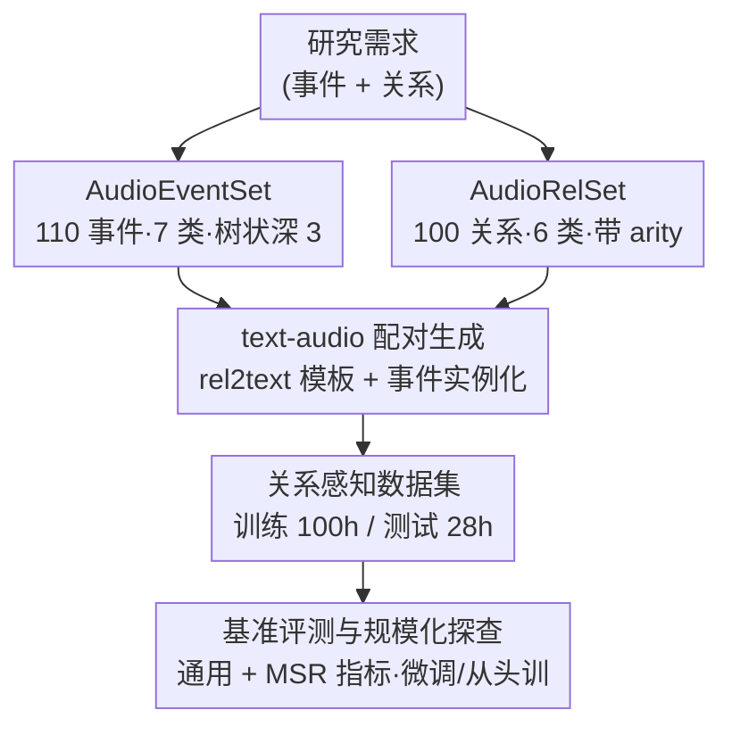

# Aurelius: Relation Aware Text-to-Audio Generation At Scale

**会议**: ICLR2026  
**OpenReview**: [https://openreview.net/forum?id=LAYCYiIgZ1](https://openreview.net/forum?id=LAYCYiIgZ1)  
**代码**: https://github.com/yuhanghe01/Aurelius  
**领域**: 文本到音频生成 / 数据集与基准  
**关键词**: 文本到音频, 关系感知生成, 音频事件语料库, 基准评测, 组合推理

## 一句话总结
Aurelius 构建了两个大规模解耦语料库（110 类音频事件的 AudioEventSet + 100 种关系的 AudioRelSet）和一套文本-音频配对生成策略，把"关系感知的文本到音频生成"从小规模探索推到可规模化研究的程度，并系统基准了 9 个主流 TTA 模型，揭示它们在多事件关系建模上几乎全线失效（关系准确率普遍 <10%）。

## 研究背景与动机
**领域现状**：文本到音频（Text-to-Audio, TTA）生成借助扩散、score-based、flow-matching 等生成式建模，再加上 AudioCaps、AudioSet 这类大规模 `<text,audio>` 配对数据，已经能生成保真度很高的单一音频事件。

**现有痛点**：人类听觉理解依赖两个基本要素——音频事件本身，以及事件之间的关系（时间先后、空间远近、计数、组合逻辑等）。但现有 TTA 模型只擅长"生成一个声音"，一旦提示词要求多个事件并满足某种关系（"先有掌声由远及近，再叠加另一段相同掌声"），就力不从心。此前 RiTTA、CompA 等已初步指出这个问题，但它们的关系/事件语料规模太小（RiTTA 只有 11 种关系），导致无法在规模化条件下深入研究。

**核心矛盾**：关系感知 TTA 同时需要"事件生成"和"关系建模"两种能力，而现有数据集（AudioSet 等）直接从网络视频/音频平台爬取，普遍存在标签缺失、噪声、多声部重叠（polyphonic）、语义歧义等问题，既不干净也没有按关系组织，根本无法支撑可控的关系研究。

**本文目标**：分解为三个子问题——(1) 造一个干净、独特、层级化的音频事件语料；(2) 造一个覆盖物理世界各类关系且可扩展的关系语料；(3) 把二者组合成近乎无限的 `<text,audio>` 配对，用来系统评测与训练。

**切入角度**：作者的关键观察是"事件"和"关系"本质上是两个正交维度，应该**显式解耦**——把它们当成独立语料分别精修，再用一套配对策略动态组合。这样既能保证各自质量，又能用组合爆炸出近乎无限、可定制的数据。

**核心 idea**：用"解耦的事件语料 × 关系语料 + 模板化配对"代替"直接爬取的混杂数据"，为关系感知 TTA 提供可规模化的基准与训练床。

## 方法详解

### 整体框架
Aurelius 不是一个新的生成模型，而是一套**面向关系感知 TTA 的基准与数据生产框架**。它的输入是"想研究什么关系/什么事件"，输出是海量带标注的 `<text,audio>` 配对，以及在这些配对上对现有模型的系统评测结论。整条管线分三块：先独立精修两个树状语料库 AudioEventSet（事件）和 AudioRelSet（关系）；再用"关系→文本模板 + 事件实例化"的配对生成策略把二者笛卡尔式组合成训练/测试数据；最后在这套数据上基准 9 个 TTA 模型，并用微调/从头训练两种策略探查规模化路径。

### 关键设计

**1. AudioEventSet：用树状层级造一个干净、独特、可分辨的音频事件语料**

它要解决的痛点是现有事件数据集"脏"——噪声、多声部、标签缺失、语义歧义，无法做可靠的关系研究。AudioEventSet 是一棵**深度为 3 的树**：从根到叶按"粗到细"组织，顶层是 7 个主类别（五个单源类 Animal / Human / Machinery / Music / Nature，加两个交互类 Human-Object / Object-Object Interaction），每个主类下接子类、再接细粒度叶节点事件，共 **110 个叶事件**（是 RiTTA 的 4 倍）。构建时严格保证每个事件"独特、可被人耳分辨"：凡是会和别的事件混淆的就剔除（例如 AudioSet 里的 engine idling 在不同引擎间差异巨大、还容易和风扇/吹风机混淆，直接全部排除）；同时显式考虑发声机制（Object-Object 类穷举 impact / friction / dropping / explosion 四种机制）。每个叶事件配约 75 条 1–5 秒真实录音，素材来自版权友好的 freesound.org 和 FSD50K，并经人工核验标签一致性。这种"先按 ontology 树建骨架、再用人耳筛独特性"的做法，让语料同时做到**内部可区分**（inter-class discriminative）和**类内多样**（intra-class diversity）。

**2. AudioRelSet：把物理世界的关系形式化成 100 种带 arity 的可扩展关系**

它针对的是"关系语料太小"——以前只有十来种关系，撑不起规模化研究。AudioRelSet 是一棵**深度为 2 的树**，根下挂 6 个主关系类，共 **100 种关系**，并且每种关系都被**数学形式化**：

- **Temporality（时序）**：先于 $E_1 \prec E_2$、后于 $E_1 \succ E_2$、同时 $E_1 \parallel E_2$、重复 $\sim E_1$；
- **Spatiality（空间）**：邻近 $d(E_1,E_2)\le\tau$、更近 $d(E_1)<d(E_2)$、更远、靠近 $\frac{d}{dt}d_{E_1}(t)<0$、远离 $\frac{d}{dt}d_{E_1}(t)>0$；
- **Count（计数）**：$|E|=N,\ N\in\mathbb{Z}^+$；
- **Perceptuality（感知效果）**：均衡、混合、混响、变速、放大、衰减等 6 种声学效果，如混合 $R_{blend}(E_1,E_2,\theta)$；
- **Compositionality（组合逻辑）**：合取 $E_1\wedge E_2$、析取 $E_1\vee E_2$、否定 $\neg E_1$、异或 $(E_1\vee E_2)\wedge\neg(E_1\wedge E_2)$、蕴含 $E_1\Rightarrow E_2,\ \neg E_1\Rightarrow E_3$；
- **Nested Combination（嵌套组合）**：把多个基本关系按有向无环结构嵌套，$R_{nested}(E)=R_n(R_{n-1}(\dots R_2(R_1(E))\dots))$，作者由 5 个基本关系组合出了 79 种嵌套关系（本文约束最多 5 个事件即 Quinary）。

每种关系还带一个 **"arity"（元数）** 属性，表示表达它需要几个音频事件（unary 到 quinary），用来后续连接关系与事件。嵌套时还会跑内部逻辑正确性/可行性检查，剔除非法组合（如 Count 与 Conjunction 嵌套在内部等价于 Count）。把关系写成符号化定义而非自然语言模糊描述，是这个语料能"可扩展、可校验"的根本。

**3. `<text,audio>` 配对生成：模板化关系 + 实例化事件，组合出近乎无限的数据**

事件语料和关系语料解耦后，怎么把它们拼回成训练数据，就是这一步要解决的。流程是：先给 100 种关系每种**手工/GPT-4o 编写 5 个文本模板**（rel2text templatization），模板里留有音频事件名占位符，用来吸收自然语言表达的多样性；再用真实事件名**实例化**模板（event instantiation）得到文本提示，同时检索对应事件的波形按关系合成目标音频。为吸收事件名的同义变体，每个事件维护一份同义词表（如 "hammer nailing" 可替换为 hitting/slapping/smacking/punching），实例化时随机抽一个。文本描述统一采用 **"Head-Modifier + 现在分词"** 结构：以发声主体为 head、动作用进行时作 modifier（"food frying audio" 而非 "frying food"），强调事件正在持续、与音频时序对齐。由于事件和关系正交解耦，该策略能生成**近乎无限、高度多样、可定制**的配对，且能保证训练/测试文本完全不重叠。

**4. 评测协议与规模化探查：通用 + 关系感知双视角，外加微调/从头训对照**

光有数据还不够，得有能"测出关系对不对"的指标。Aurelius 用两套指标：通用指标 FAD / FD / KL（衡量生成音频与参考在嵌入空间的整体相似度，分别用 VGGish 和 PANNs 抽特征）；关系感知指标沿用 RiTTA 的 **MSR（multi-stage relation aware）协议**——先从生成音频里抽出事件与关系 $(E',R')$，再和参考 $(E,R)$ 比对，给出 Presence（mAPre，事件是否出现）、Relation correctness（mARel，关系是否正确）、Parsimony（mAPar，有没有多生成）三个分数，并汇总为 mAMSR。为支撑 MSR，作者在 PANNs 上用百万样本微调出 mAP 0.91 的事件检测器和 95% 准确率的 7 类声学效果分类器。在这套评测之上，作者用**微调**和**从头训练**两种策略对 Tango / Tango2 / TangoFlux 做规模化探查，对比它们能否把通用 TTA 知识迁移到关系任务。

## 实验关键数据

### 主实验：现有 TTA 模型零样本基准
在 100 关系、训练 100h / 测试 28h（10 秒、16kHz）的数据上基准 9 个通用 TTA 模型 + 2 个 agentic 工作流。关系感知指标（×$10^{-2}$，越高越好）几乎全线 <10%：

| 模型 | #Param | FAD↓ | mAPre↑ | mARel↑ | mAPar↑ | mAMSR↑ |
|------|--------|------|--------|--------|--------|--------|
| AudioLDM2 (l-full) | 844M | 4.54 | 0.35 | 0.04 | 0.31 | 0.03 |
| Tango2 | 866M | 9.59 | 9.68 | 2.48 | 5.49 | 1.29 |
| **AudioGen** | 1.5B | 7.97 | 11.3 | 2.84 | **9.13** | **2.22** |
| **TangoFlux** | 576M | 6.01 | **12.38** | **3.34** | 7.28 | 1.77 |
| Qwen2.5-32B+TangoFlux (agentic) | - | 9.70 | 3.79 | 0.96 | 2.41 | 0.60 |

AudioGen 拿到最好的 mAPar 和 mAMSR，TangoFlux 在 mAPre/mARel 上最好，但二者也都只是个位数百分比。**agentic 工作流（用 Qwen 当 agent 拆解事件再交给 TTA）反而比直接生成更差**，说明简单堆叠现有方法救不了关系建模。

### 规模化探查：微调 vs 从头训练（100h 数据集）

| 策略 | 模型 | mAPre↑ | mARel↑ | mAPar↑ | mAMSR↑ |
|------|------|--------|--------|--------|--------|
| 微调 | TangoFlux | 28.57 | 8.02 | 20.84 | 5.58 |
| 从头训练 | TangoFlux | 16.68 | 3.82 | 12.01 | 2.58 |
| 微调 | Tango | 14.58 | 4.18 | 10.16 | 2.73 |
| 从头训练 | Tango | 14.89 | 3.69 | 10.98 | 2.64 |

微调和从头训练都大幅提升关系感知能力，验证了基准可用。TangoFlux 从微调中获益最多（mAMSR 1.77→5.58），说明跨域 TTA 知识可迁移；而 Tango 两种策略差别很小，说明架构/归纳偏置会影响知识迁移程度。

### 关键发现
- **能力断崖**：SOTA 通用模型 TangoFlux 在单事件提示上准确率 75%，但多事件正确率骤降到 12%，关系保真度仅 3%——关系建模几乎是个盲区。
- **数据规模行为分化**：扩到 200h、300h 时，微调早期涨得快但接近 300h 就饱和；从头训练则随数据持续大幅提升——暗示规模化关系 TTA 终究需要海量数据，光靠微调不够。
- **难点集中在嵌套/高 arity**：所有模型在 Nested Combination 和 arity>1 的关系上都很差，正是基准要逼出来的硬骨头。

## 亮点与洞察
- **事件与关系正交解耦**：把"声音是什么"和"声音之间什么关系"拆成两个独立语料再笛卡尔组合，既保证各自质量又换来近乎无限的数据规模——这是整套方法可规模化的根。
- **关系全部符号化 + arity 属性**：用 $\prec,\parallel,\wedge,\Rightarrow$ 这类形式化定义而非自然语言，使关系可校验、可嵌套、可自动配对，arity 还把"需要几个事件"显式化，方便按复杂度分桶评测。
- **"对比指标自相矛盾"的诊断价值**：通用指标（FAD 低）和关系指标（mAMSR 低）常常打架，恰好说明关系保真不是通用质量的副产品，而是一种独立能力——这个 insight 对后续做评测的人很有警示。
- **可迁移性**：AudioEventSet 这种干净层级化的事件库能服务声学场景理解、声事件检测定位等任务；AudioRelSet 的关系本体也能迁移到 CV / NLP / 多模态的关系建模。

## 局限与展望
- **本质是基准而非新模型**：作者提出的 AudioRelGen 只是"解耦事件建模与关系建模"的雏形，并未给出真正解决关系生成的强方法，关系准确率天花板仍很低。
- **嵌套复杂度受限**：本文把嵌套组合约束在最多 5 个事件（Quinary），更复杂的高 arity 嵌套如何写出"简洁且精确"的文本描述仍是开放难题。
- **配对生成依赖模板与同义词表**：rel2text 用 GPT-4o/人工写的 5 个模板，语言多样性仍受模板覆盖面限制；合成音频按关系拼接，可能与真实复杂声场存在差距。
- **评测器引入误差**：MSR 依赖在 PANNs 上微调的事件检测器（mAP 0.91）和效果分类器（95%），评测分数会被这些上游模型的错误传导影响。

## 相关工作与启发
- **vs RiTTA**：本文沿用其 MSR 评测协议与 7 主类划分，但把事件从 ~27 扩到 110、关系从 11 扩到 100，并显式形式化 + 引入 arity 和嵌套组合，把小规模探索升级为可规模化研究床。
- **vs CompA / AudioTime**：它们只覆盖时序或组合等单一关系维度且规模小；AudioRelSet 用 6 大类 100 种关系系统覆盖时序/空间/计数/感知/逻辑/嵌套。
- **vs AudioSet / FSD50K / AudioCaps**：这些数据集直接爬取、噪声多声部标签缺失；AudioEventSet 走"人工精修 + 树状本体 + 独特性筛选"，换来干净、可分辨、可分粒度研究的事件库。

## 评分
- 新颖性: ⭐⭐⭐⭐ 解耦事件/关系 + arity 形式化 + 大规模配对生成，是关系感知 TTA 领域第一个真正可规模化的基准
- 实验充分度: ⭐⭐⭐⭐ 基准 9+2 个模型、双视角指标、微调/从头训对照、100→300h 规模曲线，诊断扎实
- 写作质量: ⭐⭐⭐⭐ 关系定义清晰、图表完整；但 AudioRelGen 框架本身着墨偏少
- 价值: ⭐⭐⭐⭐ 暴露现有 TTA 在关系建模上的系统性失效，并提供可复用的数据/评测床，对后续研究是好脚手架

<!-- RELATED:START -->

## 相关论文

- [\[CVPR 2026\] OmniSonic: Towards Universal and Holistic Audio Generation from Video and Text](../../CVPR2026/audio_speech/omnisonic_towards_universal_and_holistic_audio_generation_from_video_and_text.md)
- [\[CVPR 2026\] SAVE: Speech-Aware Video Representation Learning for Video-Text Retrieval](../../CVPR2026/audio_speech/save_speech-aware_video_representation_learning_for_video-text_retrieval.md)
- [\[ICML 2025\] Sounding that Object: Interactive Object-Aware Image to Audio Generation](../../ICML2025/audio_speech/sounding_that_object_interactive_object-aware_image_to_audio_generation.md)
- [\[ICLR 2026\] AudioX: A Unified Framework for Anything-to-Audio Generation](audiox_a_unified_framework_for_anything-to-audio_generation.md)
- [\[ACL 2026\] ControlAudio: Tackling Text-Guided, Timing-Indicated and Intelligible Audio Generation via Progressive Diffusion Modeling](../../ACL2026/audio_speech/controlaudio_tackling_text-guided_timing-indicated_and_intelligible_audio_genera.md)

<!-- RELATED:END -->
