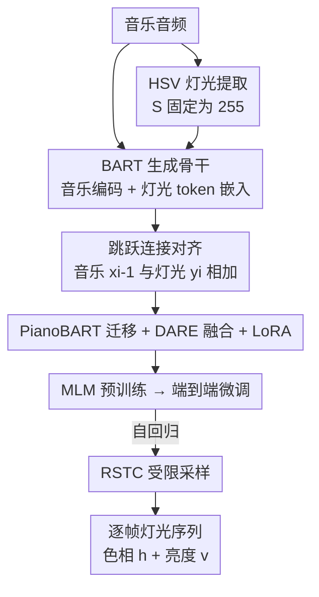

# Automatic Stage Lighting Control: Is it a Rule-Driven Process or Generative Task?

**会议**: ICLR2026  
**OpenReview**: [https://openreview.net/forum?id=a4Got6azjF](https://openreview.net/forum?id=a4Got6azjF)  
**代码**: https://github.com/RS2002/Skip-BART  
**领域**: 音频 / 音乐信息检索 / 序列生成  
**关键词**: 舞台灯光控制, 音乐到灯光生成, BART, 跳跃连接, 迁移学习

## 一句话总结
这篇论文把"自动舞台灯光控制（ASLC）"从沿用多年的"音乐分类 → 查表配灯"范式重新定义为一个**生成任务**，提出端到端模型 Skip-BART：以音乐音频为输入、逐帧自回归生成灯光的色相（Hue）与亮度（Value），靠一个新颖的跳跃连接显式对齐音乐帧与灯光帧，并配套自建数据集、预训练与迁移学习，最终在量化指标和 38 人主观评测上全面超过规则方法，且与真人灯光师无显著差异（p=0.72）。

## 研究背景与动机

**领域现状**：现场音乐演出里，舞台灯光是营造氛围、调动观众情绪的关键，但雇佣/培训专业灯光师成本高，于是出现了自动舞台灯光控制（ASLC）。目前主流做法几乎都是同一个套路——先把音乐分进有限的几类（按风格、按情绪、或按和弦），再为每一类预先定义一套灯光模式，演出时分类命中哪类就放哪套灯。

**现有痛点**：这种"分类 → 查表"范式有两层硬伤。其一，**粒度太粗且分类本身不准**：数据稀缺、标注困难导致分类器精度常常低于 80%，而且类别定义粗糙——比如 black metal 和 folk black metal 氛围完全不同，却可能一起被归进 metal 甚至更大的 rock 类，错分和粗标都直接拉垮效果。其二，**"类别→灯光"的映射缺乏理论支撑**：灯光本质上是技术与艺术的混合体，能不能用几套固定模式去定义它本身就存疑；已有研究（McDonald et al.）甚至表明色相与情绪之间关系有限——论文自己的数据里就观察到 groove metal 配的是绿色而非情绪理论预测的红色。

**核心矛盾**：规则方法把一个**艺术创作过程**强行降维成了一次**机械的离散映射**。真人灯光师并不是"听出情绪→照表配色"，而是根据音乐的流动连续地、有创造性地打灯。用分类+查表去逼近这个过程，从范式上就丢掉了连续性和创造性。

**本文目标**：抛弃分类范式，直接学习真人灯光师的输出。具体落到一个可操作的子问题——**离线主灯生成**：给定一段音乐序列，逐帧预测单束主灯的色相和亮度。

**切入角度**：既然 MIR 里视频配乐、MV 生成、歌词生成等生成式方法都已成功，那么把 ASLC 也当成"内容生成"来做就有希望——让网络直接在真人灯光师的真实数据上端到端训练，而不是去拟合一张人为定义的映射表。

**核心 idea**：用一个生成式序列模型（改造的 BART）**直接从音乐生成灯光序列**，并用跳跃连接强制模型看懂"第 i 帧音乐对应第 i 帧灯光"这一关键对齐关系。

## 方法详解

### 整体框架
Skip-BART 以 BART 为骨干：双向编码器吃整段音乐、提取上下文，单向解码器自回归地逐帧吐出灯光 token。输入侧用 OpenL3 抽音乐音频特征、再接 MLP 对齐到 BART 维度；灯光侧把色相/亮度先在 HSV 空间预处理、离散化成 token 后用嵌入层编码。训练分三步走：先在纯音乐上做 **MLM 预训练**（不碰灯光，防泄漏，让解码器先学到音乐结构），再做**端到端微调**（音乐→灯光的下一 token 预测），推理时用 **RSTC 采样**保证既多样又稳定。两个关键的"黏合剂"是：跳跃连接显式注入帧对齐，以及从 PianoBART 迁移来的预训练参数为冷启动兜底。

### 关键设计

**1. 把 ASLC 重定义为生成任务 + 自建 RPMC-L2 数据集：先有数据才谈得上生成**

规则方法之所以盛行，根本原因是没有"音乐↔灯光"的配对数据，只能退而求其次用人定的规则。论文的第一步是把任务范式从分类换成生成，并配套解决数据荒：作者用一套从视频自动提取灯光标签的方法，构建了首个舞台灯光数据集 **RPMC-L2**（Rock/Punk/Metal/Core - Livehouse Lighting），五年间从大量乐队、Livehouse、4 种采集设备收集，覆盖 metalcore、alternative rock、post-punk 等风格，共 699 个样本、单条 20 秒到约 5 分钟。提取灯光时在 HSV 空间做，并把饱和度 S 固定为 255（100%），用来抵消空气散射、烟雾、表面反射带来的色彩衰减，让提取出的主色在极端强度下仍然鲜明准确（论文 Fig.2 显示在极冷/极暖光下比直接抽 HSV 更贴近原貌）。每帧灯光记为 $y_t=[h_t, v_t]$，即色相与亮度两个分量。

**2. 跳跃连接：显式告诉模型"第 i 帧音乐对应第 i 帧灯光"**

直接把 BART 套上来会发现一个顽疾——模型**学不会节奏**，灯光的变化频率和图案常常跟不上音乐。原因是解码器的注意力很难自己判断哪一帧灯光该对应哪一帧音乐：虽然人一眼就知道音乐 $x$ 和灯光 $y$ 等长、是逐帧一一对应，但从又复杂又含噪的数据里端到端学出这个对应太难。Skip-BART 的解法很直接：在送入解码器之前，把音乐嵌入和灯光嵌入**直接相加**，把对齐关系硬编码进输入——灯光 token $y_i$ 的嵌入会和音乐 token $x_{i-1}$ 的嵌入相加（注意有一位右移，因为解码器输入要整体右移一位）。这相当于在每个时间步给模型一张"对照表"，省去它自己去猜对齐，从而把音乐的节奏直接灌进灯光的变化里。消融显示去掉跳跃连接后亮度 RMSE 从 60.74 升到 68.33，主观 Overall 也从 4.35 掉到 4.11。

**3. 迁移学习 + DARE 参数融合 + LoRA：在小数据上榨出尽量多的外部知识**

MIR 数据本就稀缺，699 条远不够从零训一个生成模型。论文借 PianoBART（一个大规模符号音乐预训练模型）的骨干做冷启动，并用 **DARE（Drop And Rescale）** 把 PianoBART 在多个下游任务（priming、旋律提取、力度预测、作曲家分类、情绪分类）上微调过的参数**融合**进来，尽量把多任务知识塞进一套权重：

$$\theta = \theta_{pre} + \lambda \sum_i (\theta^i_{DARE} - \theta_{pre}), \quad \theta^i_{DARE} = \theta_{pre} + \frac{(\theta^i - \theta_{pre}) \odot m_i}{1-p}, \quad m_i \sim \text{Bernoulli}(p)$$

其中 $p$ 是丢弃率、$\lambda$ 是缩放项、$m_i$ 是随机掩码。融合后再用 **LoRA** 做高效微调，避免在小数据上全参数微调过拟合。此外灯光的色相用嵌入层（而非 MLP）处理，是因为色相是**循环量**——最小值和最大值其实很接近（0° 和 359° 几乎同色），MLP 难处理这种周期性，而嵌入层能天然学到 token 间的关系，更适合循环数据。消融里"w/o light embedding"色相 RMSE 从 36.13 恶化到 51.04，印证了这一点。

**4. 三阶段工作流：MLM 预训练 + 自适应权重微调 + RSTC 采样**

训练与推理被拆成三段，各自解决一个具体问题。**MLM 预训练**只用音乐、不用灯光（防泄漏），随机把 k% 的 token 换成 [MASK] 让模型恢复；由于音乐 token 是连续的，[MASK] 被设计成从正态分布采样的随机变量 $M_i \sim N(\mu_i, \sigma_i)$，并额外用一个 GAN 判别器来提升恢复输出的真实感，预训练损失 $L_{pre}=\alpha_1 l_1 + \alpha_2 l_2 + \alpha_3 l_3$ 同时含重建、掩码恢复、真实性三项。**端到端微调**把灯光生成当成逐帧分类（色相、亮度各一套词表），损失 $L_{stf}=\beta_1\text{CE}(\hat h, h)+\beta_2\text{CE}(\hat v, v)$；因为色相和亮度学习速度不同，$\beta$ 用**自适应权重**——按上一轮验证准确率的倒数归一化，让模型多关注学得慢的那个属性。**RSTC 推理**则在温度采样基础上加一道"防过冲"约束：相邻两帧灯光的色相/亮度变化不能超过阈值 $d_t$（色相用 $\min\{|\Delta|, 180-|\Delta|\}$ 的循环距离），超出阈值的类别概率被直接置零，从而保证生成既有随机多样性又不会忽明忽暗、忽红忽绿地剧烈跳变。

### 损失函数 / 训练策略
预训练用 $L_{pre}=\alpha_1 l_1 + \alpha_2 l_2 + \alpha_3 l_3$（自编码重建 + 掩码恢复 + 判别器真实性），判别器单独优化 $L_{dis}$；微调用色相/亮度的交叉熵之和，权重 $\beta$ 按验证准确率自适应。硬件为 2×4090 + 1×A100，PyTorch 实现。

## 实验关键数据

### 主实验（量化分析）
以"生成结果越接近真人灯光师的 ground truth 越好"为假设，计算 RMSE、MAE（色相用循环角度差）、corr(|Δ|)（一阶差分幅度的 Pearson 相关，×100）三类指标。

| 方法 | RMSE↓ (Hue) | RMSE↓ (Value) | MAE↓ (Hue) | MAE↓ (Value) | corr(\|Δ\|) (Hue) | corr(\|Δ\|) (Value) |
|------|------|------|------|------|------|------|
| Rule-based | 48.67 | 93.39 | 43.43 | 86.55 | 0.50 | 0.58 |
| **Skip-BART** | **36.13** | **60.74** | **28.72** | **51.27** | **0.88** | **2.94** |

Skip-BART 在色相和亮度上误差全面低于规则方法，亮度 RMSE 从 93.39 直接降到 60.74。

### 消融实验

| 配置 | RMSE (Hue) | RMSE (Value) | 说明 |
|------|------|------|------|
| Full (Skip-BART) | 36.13 | 60.74 | 完整模型 |
| w/o skip connection | 36.89 | 68.33 | 去掉跳跃连接，亮度明显变差 |
| w/o light embedding | 51.04 | 67.25 | 色相用 MLP 而非嵌入，色相崩坏 |
| train from scratch | 36.63 | 67.49 | 不用迁移学习冷启动 |
| pre-train w/o random [MASK] | 49.97 | 64.45 | 预训练去掉随机掩码 |
| pre-train w/o discriminator | 50.40 | 68.09 | 预训练去掉 GAN 判别器 |

### 人类主观评测
招募 38 名受试者（含 9 名灯光/音乐/舞美从业者），每人对 3 段音乐、4 个来源（Ground Truth / Skip-BART / Ablation / Rule-based）在 6 个维度上 1–7 分打分，用重复测量 ANOVA + Bonferroni 校正分析。

| 方法 | Overall (M±SD) |
|------|------|
| Ground Truth | 4.51±0.88 |
| **Skip-BART** | 4.35±0.87 |
| Ablation (w/o skip) | 4.11±0.84 |
| Rule-based | 2.67±1.29 |

Skip-BART 紧贴 GT，三种学习方法都显著优于规则方法（p<0.05）；统计上 Skip-BART 与真人 GT **无显著差异（p=0.72）**，与规则方法差异极显著（p<0.001）。跨域（其他音乐风格）评测里 Skip-BART Overall 仍达 4.34，远超规则方法。

### 关键发现
- **跳跃连接对"节奏对齐"贡献突出**：去掉后亮度 RMSE +7.6、Overall 主观分 -0.24，印证显式帧对齐确实让灯光跟得上音乐。
- **色相必须用嵌入层、不能用 MLP**：色相是循环量，换成 MLP 后色相 RMSE 从 36 飙到 51，是所有消融里色相退化最严重的。
- **预训练的随机 [MASK] 与判别器都不可少**：去掉任一个，色相 RMSE 都退回 50 左右，说明小数据下自监督预训练的设计细节直接决定生成质量。
- **情绪维度是唯一 GT 不夺冠的指标**，且规则方法在情绪上得分相对其他维度更高——侧面支持了"情绪与灯光关系有限"的论点，也验证了作者对规则方法的复现是可信的。

## 亮点与洞察
- **范式转换本身就是最大贡献**：第一个把 ASLC 从"分类+查表"重构成"生成任务"，并用主观评测证明生成式能逼近真人——这是一个被长期忽视的小众任务上的视角刷新，为后续研究立了基线。
- **跳跃连接是个朴素但精准的"对齐先验"**：与其让注意力费力学等长一一对应，不如把 $x_{i-1}$ 和 $y_i$ 嵌入直接相加，把已知的结构先验硬塞进去——这种"用领域结构简化学习"的思路可迁移到任何输入输出严格逐帧对齐的跨模态生成（如视频配音、动作配乐）。
- **HSV 里把 S 固定为 255 是个很实用的工程 trick**：现场视频里的灯光会因烟雾/散射褪色，固定饱和度能稳定地抽到"本意的主色"，对任何从演出视频里提取灯光/色彩标签的工作都有借鉴价值。
- **DARE + LoRA 在小数据 MIR 上的组合**：把多个下游微调模型的知识融进一套权重再做低秩微调，给"数据极少但有大预训练可借"的场景提供了一条可复制路径。

## 局限与展望
- **只做了离线、单束主灯**：现实演出是实时、多灯、还要考虑频闪/移动/光束造型，论文明确把范围限定在离线单主灯，距离真正可用的实时多灯系统还有不小距离。
- **数据集偏窄**：RPMC-L2 只覆盖摇滚/朋克/金属/核系等重型现场，699 条规模在 MIR 里算中等，跨到电子、古典、流行等差异巨大的风格时泛化性仍待验证（跨域评测也只在"其他风格"上做了有限测试）。
- **评测假设值得商榷**：量化分析以"越接近 GT 越好"为前提，但灯光是创作、并非只有一个正确答案；虽然作者用人评来缓解，但 38 人、且重型音乐受众为主的样本，结论的普适性有限。
- **改进方向**：扩展到实时在线生成与多灯协同控制、引入更显式的节拍/段落结构条件、把"创造性多样性"也纳入评价而不只是逼近单一 GT。

## 相关工作与启发
- **vs 风格/情绪分类规则法（Stanescu et al. 2018; Hsiao et al. 2017）**: 他们先分类再查表配灯，本文直接端到端生成灯光序列；区别在于规则法受限于分类精度（常 <80%）和粗粒度类别，且"类别→灯光"映射缺理论依据，而生成法直接拟合真人数据，主观评分从 2.67 提升到 4.35。
- **vs 自编码器映射法（Tyroll et al. 2020）**: 他们先用 autoencoder 抽特征再把嵌入映射到灯光，本文用 BART 做端到端自回归生成；区别在于 autoencoder 特征能力有限、嵌入到灯光的映射同样含糊，而本文用更强的生成骨干 + 跳跃连接显式对齐，避免了模糊映射。
- **vs PianoBART（Liang et al. 2024）**: 它是符号音乐的预训练骨干，本文把它当迁移来源、用 DARE 融合其多任务参数为灯光生成冷启动；本文优势是把符号音乐域的知识跨模态迁移到了"音频→灯光"这个全新任务上。

## 评分
- 新颖性: ⭐⭐⭐⭐⭐ 首次把 ASLC 重定义为生成任务，并自建首个舞台灯光数据集，视角与数据双重开创。
- 实验充分度: ⭐⭐⭐⭐ 量化 + 6 维主观 + 跨域 + 6 项消融较完整，但样本/风格覆盖偏窄。
- 写作质量: ⭐⭐⭐⭐ 动机层层递进、方法讲解清晰，公式与图配合到位。
- 价值: ⭐⭐⭐⭐ 小众任务但落地意义明确（降低现场灯光成本），方法与数据集都可被后续复用。

<!-- RELATED:START -->

## 相关论文

- [\[ICLR 2026\] Confident and Adaptive Generative Speech Recognition via Risk Control](confident_and_adaptive_generative_speech_recognition_via_risk_control.md)
- [\[ICLR 2026\] SpeechOp: Inference-Time Task Composition for Generative Speech Processing](speechop_inference-time_task_composition_for_generative_speech_processing.md)
- [\[ACL 2026\] Pseudo2Real: Task Arithmetic for Pseudo-Label Correction in Automatic Speech Recognition](../../ACL2026/audio_speech/pseudo2real_task_arithmetic_for_pseudo-label_correction_in_automatic_speech_reco.md)
- [\[ICLR 2026\] Discovering and Steering Interpretable Concepts in Large Generative Music Models](discovering_and_steering_interpretable_concepts_in_large_generative_music_models.md)
- [\[ICLR 2026\] Improving Black-Box Generative Attacks via Generator Semantic Consistency](improving_black-box_generative_attacks_via_generator_semantic_consistency.md)

<!-- RELATED:END -->
