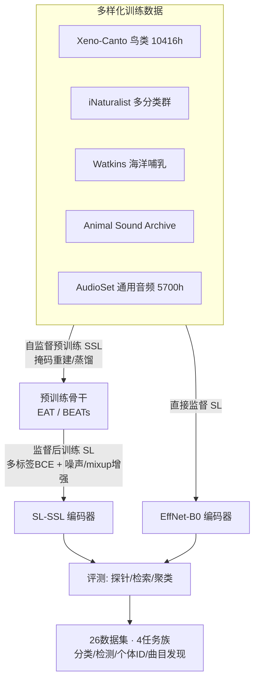

# AVEX: What Matters for Animal Vocalization Encoding

**会议**: ICLR 2026  
**OpenReview**: [https://openreview.net/forum?id=MFuM9KAEYc](https://openreview.net/forum?id=MFuM9KAEYc)  
**代码**: [https://github.com/earthspecies/avex](https://github.com/earthspecies/avex)  
**领域**: 音频与语音 / 生物声学表示学习  
**关键词**: 生物声学、动物发声、自监督预训练、监督后训练、通用音频编码器、跨物种泛化  

## 一句话总结
这是一篇大规模实证研究：作者系统性地拆解了"训练一个能泛化的生物声学编码器到底什么最重要"，结论是**在「多样化生物声学+通用音频」混合数据上先自监督预训练、再监督后训练**这一两阶段配方在分布内外都最强，并在 26 个数据集、四类任务上刷新了 SOTA。

## 研究背景与动机
**领域现状**：生物声学（研究动物发声）对生物多样性监测、物种保护和动物交流建模都至关重要，物种/个体/行为分类与检测等任务天然适合机器学习。被动声学监测（PAM）和 Xeno-Canto、iNaturalist 等公民科学平台积累了海量弱标注数据，催生了 BirdNet、Perch 等"生物声学编码器"——先在大规模数据上学一个通用表示，再在下游任务上线性探针或微调。

**现有痛点**：已有编码器普遍有三个局限——(1) **物种范围窄**，绝大多数只盯着鸟类；(2) **范式单一**，要么纯监督（BirdNet/Perch）要么纯自监督（AVES/Animal2Vec/BirdMAE），没人系统比较两者及其组合；(3) **评测面窄**，几乎只评物种分类，而且训练用 focal 录音、测试用 soundscape 录音，存在隐性的分布偏移，个体识别、发声曲目发现（vocal repertoire discovery）这类对动物交流研究真正关键的任务几乎没被覆盖。

**核心矛盾**：真实保护应用需要的是**跨物种、跨任务、跨录音条件都能泛化**的编码器（识别没见过的物种、从少量声音认个体、无标注刻画曲目），但现有研究既没系统搞清"什么因素决定泛化"，也缺少能衡量这种泛化的评测基准。

**本文目标**：不发明新架构，而是做一次"什么最重要（what matters）"的对照实验——把**模型架构、数据配比、训练范式、评测方法**四个维度拉到统一管线里横评，找出可复用、可随数据/架构进步而扩展的训练配方。

**核心 idea**：**两阶段配方 = 多样化混合数据上的自监督预训练 + 同样混合数据上的监督后训练**。监督擅长分布内、自监督擅长分布外，两者互补；把它们串成"先 SSL 后 SL"的课程式训练，能同时吃到两边的好处。

## 方法详解

### 整体框架
全文是一个受控的实证研究框架（Figure 1）：固定一套近乎一致的训练/评测管线，只变动三个变量——(1) **模型架构**：CNN 系（EfficientNet-B0）vs Transformer 系（BEATs、EAT）；(2) **数据配比**：纯生物声学 (bio)、纯通用音频 (AudioSet)、二者混合 (all)；(3) **训练范式**：纯监督 (SL)、纯自监督 (SSL)、自监督后接监督 (SL-SSL)。然后在一套被显著拓宽的评测协议（26 个数据集 + 4 类任务 + 探针/检索/聚类三种度量）上测每个组合，从而把"哪个变量贡献了泛化"分离出来。

### 关键设计

**1. 数据配方——"生物声学+通用音频"的混合才是泛化的关键。** 作者从 Xeno-Canto（鸟，1 万小时）、iNaturalist（多分类群）、Watkins（海洋哺乳动物）、Animal Sound Archive（多样物种）拼出一个比以往工作物种多样性高得多的生物声学语料，再加入通用音频 AudioSet（5700 小时）。为了把异构数据集对齐，他们把所有物种的拉丁学名统一挂到 GBIF 分类骨架上。实验反复证明：**往生物声学训练里掺通用音频 (all)，在 focal 分类、soundscape 多标签检测、曲目发现、个体识别上都一致带来增益**；反过来，只用通用音频做监督训练则迁移很差——说明生物声学数据是不可替代的核心，而通用音频是有效的"泛化润滑剂"。

**2. 两阶段课程式训练 (SL-SSL)——把自监督的分布外优势和监督的分布内优势缝起来。** 监督模型在贴近训练分布的任务上强、自监督模型在分布外（focal→soundscape）更稳：从 BEANS 分类迁移到 BEANS 检测时，自监督模型的检索 ROC AUC 平均只掉 $0.01$，而监督模型掉 $0.09$。基于这个观察，作者把两者串成"先在混合数据上自监督预训练、再在同一混合数据上监督后训练"的两阶段配方（形式上等价于两步课程学习 / BEATs 式迭代训练）。后训练用多标签二元交叉熵损失，目标是预测物种标签。结果 `sl-BEATS-all` 在分布内外都最强，既保留了 SSL 骨干的 OOD 泛化，又获得了 SL 的判别力。

**3. 鲁棒性增强——噪声注入 + 批内 mixup。** 为提升对真实野外噪声的鲁棒性，预训练与后训练阶段都以 0.5 概率注入环境噪声，信噪比从 $\mathrm{SNR}\sim\mathcal{U}(-10\text{dB}, 20\text{dB})$ 均匀采样（噪声取自 ShipsEar、FSD50K、UrbanSound 等非动物声）。后训练阶段还以 0.5 概率对批内随机两条音频做线性混合，标签取二者的逐元素并集（element-wise OR），模拟 soundscape 中多声源叠加的现实。这套增强对 BirdSet 这种 focal→soundscape 协变量偏移大的基准尤其关键。

**4. 拓宽的评测协议——从"只看鸟类物种分类"到"多任务×多度量"。** 作者把评测从单一探针准确率扩成三种互补视角：**线性探针**（在冻结的时间平均嵌入上训线性分类器，避免模型大小混淆）、**检索**（把每条测试样本当 query，按余弦相似度排序，用 ROC AUC 即 R-AUC 衡量嵌入空间的判别性，无需训练）、**聚类**（已知簇数做 K-means，用归一化互信息 NMI 衡量与真值类别的吻合度）。同时新增两个长期被忽视的任务——**个体识别**和**发声曲目发现**（已知 K 时当作结构恢复问题，用聚类 NMI + 类内检索 R-AUC 评，不训探针），并整理了 8 个全新公开数据集，把分析规模从前人的 2 个数据集扩到 26 个。

## 实验关键数据

### 主实验表格（跨基准聚合，节选关键模型；探针为准确率/mAP，R-auc 为检索 ROC AUC，C-nmi 为聚类 NMI）

| 模型 | 范式 | BEANS分类 Probe | BEANS分类 R-auc | BEANS检测 Probe | BirdSet Probe | 个体ID Probe | 曲目发现 R-auc |
|------|------|------|------|------|------|------|------|
| BEATs (pretrained) | SSL | 0.774 | 0.734 | 0.339 | 0.129 | 0.380 | 0.775 |
| Perch | SL | 0.768 | 0.759 | 0.368 | 0.233 | 0.530 | 0.758 |
| BirdNet | SL | 0.796 | 0.772 | 0.392 | N/A | 0.472 | 0.795 |
| NatureBEATs | SL-SSL | 0.804 | 0.774 | 0.385 | 0.223 | 0.410 | 0.811 |
| EffNetB0-all | SL | 0.800 | 0.809 | 0.362 | 0.279 | **0.531** | **0.830** |
| **sl-BEATS-all** | SL-SSL | **0.832** | **0.813** | **0.408** | **0.294** | 0.511 | 0.798 |
| sl-BEATS-bio | SL-SSL | 0.840 | 0.811 | 0.390 | 0.288 | 0.484 | 0.789 |

> 横线上方为已有/预训练 checkpoint，下方为本文新训模型。`sl-BEATS-all`（先 SSL 后 SL、混合数据）在 BEANS 分类、BEANS 检测、BirdSet 三大既有基准上整体夺得 SOTA；而新训的 `EffNetB0-all` 在新提出的个体识别和曲目发现上最强。

### 消融实验表格（数据配比对 EffNet 监督后训练的影响）

| 数据配比 | BEANS分类 Probe | BEANS分类 R-auc | BirdSet Probe | 个体ID Probe | 曲目发现 C-nmi |
|------|------|------|------|------|------|
| 仅 AudioSet (通用音频) | 0.651 | 0.721 | 0.098 | 0.397 | 0.481 |
| 仅 bio (生物声学) | 0.786 | 0.799 | 0.279 | 0.457 | 0.568 |
| all (bio + AudioSet) | **0.800** | **0.809** | 0.279 | **0.531** | **0.582** |

> 只用通用音频做监督迁移极差（BirdSet 仅 0.098）；加入通用音频到生物声学里（all）几乎在所有任务上稳定优于纯 bio——印证"混合数据"是泛化的关键。

### 关键发现
- **自监督预训练带来分布外优势**：focal→soundscape 迁移时，最强纯 SSL 模型（预训练 BEATs）在 BEANS 检测检索上甚至超过最强纯监督模型；SSL 平均仅掉 0.01 R-AUC，SL 掉 0.09。
- **两阶段是"两全其美"**：后训练让 SSL 骨干保留部分 OOD 泛化的同时获得监督级判别力，`sl-BEATS-all` 分布内外都强。
- **更强的 SSL 骨干 → 更好的后训练模型**：BEATs 后训练比 EAT 后训练更能拿到 SOTA，暗示后训练效果受预训练骨干强度上限制约。
- **大规模物种预测能迁移到非分类任务**：在物种分类上做大规模监督训练，竟也能迁移到个体识别和曲目发现这两个通常被独立研究的任务。

## 亮点与洞察
- **"什么最重要"式的实证范式**：不堆新模块，而是把架构/数据/范式/评测四个维度在统一管线下做大规模对照，结论可复用、可随数据和架构进步而外推——这种"配方说明书"对工程落地价值很高。
- **把自监督与监督从"二选一"变成"互补缝合"**：清晰量化了 SSL 的 OOD 优势和 SL 的 ID 优势，并用两阶段配方同时拿下，给生物声学社区一个尚未普遍采用却简单有效的升级路径。
- **评测基建是真正的长期贡献**：新增个体识别、曲目发现两类任务 + 8 个公开数据集 + 检索/聚类度量，把评测从"鸟类物种分类"扩成多任务多视角，并开源了 AVEX 库和 checkpoint，降低后续研究门槛。

## 局限与展望
- **采样率受限于 16kHz**：为与旧模型公平对比统一在 16kHz 训练，但很多物种的关键听觉信息在 8kHz 以上，可能低估了高频物种的潜力，作者计划后续扩展。
- **检测仍是 segment-based**：把检测当成分段多类分类，未做更精细的 frame-based 或 event-based 时间强检测。
- **OOD 分析缺受控数据集**：用大数据集做 R-AUC 分析是"以控制换规模"，物种分布/噪声等混淆因素未被严格控制，缺少能干净隔离这些变量的受控数据集。
- **仅用最后一层嵌入 + 线性探针**：未做逐层分析，也未做全量微调，可能没榨干各模型的最优表现。

## 相关工作与启发
- **生物声学编码器谱系**：CNN 系的 BirdNet/Perch（EfficientNet + 监督）与 Transformer 系的 AVES（HuBERT）、Animal2Vec（data2vec）、BirdMAE（AudioMAE）、TweetyBert（BERT），本文首次把它们在统一管线下横评。
- **通用音频自监督**：Wav2vec、HuBERT、AudioMAE、BEATs、EAT 等为骨干提供了基础；本文选 EAT 是因为其全开源、训练快，便于改自监督预训练。
- **文本-音频生物声学模型**：BioLingual（CLAP 式）、NatureLM-audio（Llama3 + BEATs + Q-former）是互补方向——它们可被看作编码器的一种"后训练"，本文把 NatureLM 的 BEATs 抽出来作为 NatureBEATs 基线，验证了文本-音频训练也能产出强编码器。
- **启发**：这套"先 SSL 混合数据、再 SL 同分布后训练 + 多任务多度量评测"的范式可迁移到其他低资源、强分布偏移的音频领域（如水声、工业声学异常检测），评测应同时覆盖探针/检索/聚类以避免单一指标的误判。

## 评分
- **新颖性**: ⭐⭐⭐⭐ — 不是新架构，但首次系统性回答"生物声学编码器什么最重要"，并把 SSL+SL 两阶段配方与多任务评测落到实证，定位清晰且填补空白。
- **实验充分度**: ⭐⭐⭐⭐⭐ — 19 个模型 × 26 数据集 × 4 任务族 × 3 度量的横评，配比/范式/数据多维消融，证据扎实全面。
- **写作质量**: ⭐⭐⭐⭐ — 四维变量拆解清晰，结论与图表对应明确；表格信息密度高但需结合附录才能完全消化。
- **价值**: ⭐⭐⭐⭐⭐ — 开源编码器、库、新基准与可复用配方，对动物交流与生态保护的下游研究有直接、长期的推动价值。

<!-- RELATED:START -->

## 相关论文

- [\[ICLR 2026\] When and Where to Reset Matters for Long-Term Test-Time Adaptation](when_and_where_to_reset_matters_for_long-term_test-time_adaptation.md)
- [\[NeurIPS 2025\] WhAM: Towards A Translative Model of Sperm Whale Vocalization](../../NeurIPS2025/audio_speech/wham_towards_a_translative_model_of_sperm_whale_vocalization.md)
- [\[ICML 2026\] Few-Shot Synthetic Accented Speech for ASR Fine-Tuning: What Helps and When?](../../ICML2026/audio_speech/few-shot_synthetic_accented_speech_for_asr_fine-tuning_what_helps_and_when.md)
- [\[CVPR 2026\] Hear What You See: Video-to-Audio Generation with Diffusion Transformer and Semantic-Temporal Alignment-Ranked Direct Preference Optimization](../../CVPR2026/audio_speech/hear_what_you_see_video-to-audio_generation_with_diffusion_transformer_and_seman.md)
- [\[ICLR 2026\] OWL: Geometry-Aware Spatial Reasoning for Audio Large Language Models](owl_geometry-aware_spatial_reasoning_for_audio_large_language_models.md)

<!-- RELATED:END -->
