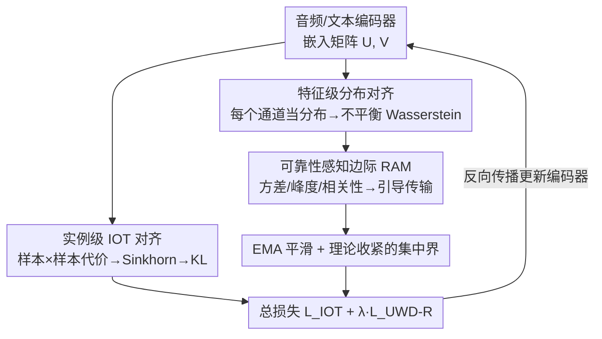

# Beyond Instance-Level Alignment: Dual-Level Optimal Transport for Audio-Text Retrieval

**会议**: ICLR2026  
**OpenReview**: [https://openreview.net/forum?id=cFhcd4WGjO](https://openreview.net/forum?id=cFhcd4WGjO)  
**代码**: 待确认  
**领域**: 音频检索 / 跨模态匹配  
**关键词**: 音频-文本检索, 最优传输, 不平衡 Wasserstein, 通道可靠性, 小批量鲁棒性

## 一句话总结
DART 在传统"实例级"音频-文本对齐之外，再加一层"特征级"对齐——把每个嵌入通道当成一个分布，用不平衡 Wasserstein 距离去配对音频通道和文本通道，并用基于方差/峰度/跨模态相关性的"可靠性边际"引导传输只往稳定语义通道倾斜，从而在小批量、稀缺标签、噪声标签下都拿到 SOTA 检索效果。

## 研究背景与动机
**领域现状**：音频-文本检索（给文本查音频、给音频查文本）现在的主流做法——对比学习、triplet loss、learn-to-match——都可以统一到逆最优传输（Inverse Optimal Transport, IOT）的视角下：把音频/文本编码成向量，用一个可学习的代价矩阵 $C_{ij}=d(f_\theta(x_i),g_\phi(y_j))$ 当作"地面代价"，再用 Sinkhorn 解出耦合矩阵 $\Pi$，让它逼近"对角线为正"的真值匹配。

**现有痛点**：这套范式有两个绑在一起的硬伤。其一，代价是从 mini-batch 估出来的，batch 越小采样方差越大，学到的度量越容易被噪声和偏差带跑。其二，更根本的是它停留在**实例级**：$d(x_i,y_j)$ 把整对样本压成一个标量，隐含假设"所有特征维度同等重要"。但音频和文本嵌入是异质的——有些通道编码稳定的语义（如 "drone" 这个物体身份），有些通道编码模态特有的噪声或瞬变模式。一次性把所有维度求和（$d(x_i,y_j)=\sum_d (x_{id}-y_{jd})^2$），少数高方差噪声通道就能把一对**语义本就匹配**的样本的距离顶上去，让梯度信号失真。

**核心矛盾**：标量化的实例级相似度天然抹掉了"哪个通道可信"的信息；即便先前工作（如 Luong et al. 2024）做了通道加权，最后还是塌缩成一个 pairwise 标量，波动通道依旧耦合在学习信号里——小批量下尤其严重。论文用理论把这点说穿：实例级 IOT 损失的集中界由 $D_{\max}=\max_{(i,j):\tilde\Pi_{ij}>0} d(x_i,y_j)$（匹配对中最大的对齐距离）控制，这是个**极值量**，对离群样本和标签噪声极敏感。

**本文目标**：在不放弃实例级对齐的前提下，引入一种**不受单个最差样本主导**、能识别并下调噪声通道的对齐信号。

**切入角度**：作者把"特征通道"当成一等公民——每个通道在一个 mini-batch 上的取值天然是一个分布，那就可以在音频通道分布和文本通道分布之间做最优传输，让传输计划自己决定哪些通道该被对齐、哪些该被"漏掉"。

**核心 idea**：用"特征级不平衡 Wasserstein 传输 + 可靠性感知边际"做正则项，把对齐的控制量从波动的 $D_{\max}$ 换成传输计划的 Frobenius 范数 $\|P^*\|_F$（一个聚合量），从而把集中界收紧、换来小批量鲁棒性。

## 方法详解

### 整体框架
DART（Dual-level Alignment via Robust Transport）的输入是一个 mini-batch 的音频-文本对，输出是优化好的音频/文本编码器，使两个模态的检索都更准、更稳。整条流水线在每个 batch 上同时跑两条对齐通道并相加成总损失：**实例级**这一路沿用 IOT——编码器产出嵌入矩阵 $U^b\in\mathbb{R}^{k\times d_u}$、$V^b\in\mathbb{R}^{k\times d_v}$，按样本两两算代价、Sinkhorn 求耦合、对真值匹配求 KL，得到 $\mathcal{L}_{\text{IOT}}$；**特征级**这一路是本文新增——把嵌入矩阵的**每一列**（一个通道在 batch 内的取值）当成分布，在音频通道集合和文本通道集合之间建一个特征代价矩阵，用不平衡 Wasserstein 距离（UWD）求传输计划 $P^b$，并用一个由统计量算出的"可靠性边际"替换 UWD 里的均匀边际，把传输质量引向稳定通道，得到 $\mathcal{L}_{\text{UWD-R}}$。两路损失按系数 $\lambda$ 相加，端到端训练；可靠性分数用 EMA 跨 batch 平滑，避免小批量抖动。

### 关键设计

**1. 双层对齐：实例级 IOT 之外再叠一层特征级正则**

直接动机是实例级对齐把整对样本压成标量、被噪声通道带偏，且其集中界受极值 $D_{\max}$ 控制、小批量下方差大。DART 不替换 IOT，而是在它旁边并联一条特征级对齐：实例级负责把"哪条音频配哪条文本"这种全局样本对应锚住（$\mathcal{L}_{\text{IOT}}=\mathrm{KL}(\tilde\Pi^b\|\Pi^{(\theta,\phi)b})$，one-to-one 时退化为 $-\log\Pi^{(\theta,\phi)b}_{ii}$），特征级则作为**结构正则**去过滤掉噪声特征方向。两者互补这一点被消融坐实：只用特征级 $\mathcal{L}_{\text{UWD}}$ 会彻底学不到样本对应（R@1≈0），只用实例级是普通 baseline，二者联合才最好。理论上，这一叠加把对齐的控制量从实例级的 $D_{\max}$ 换成特征级的聚合量，使整体对噪声更不敏感。

**2. 特征级分布对齐：把每个通道当分布，用不平衡 Wasserstein 配对**

这是把"特征通道"提升为匹配单元的关键一步。对音频矩阵 $U^b$、文本矩阵 $V^b$，第 $j$ 列 $U^b(:,j)$ 是第 $j$ 个通道在 batch 内 $k$ 个样本上的取值，被解读为一个 $k$ 维分布。于是构造特征代价矩阵 $C^{(\theta,\phi)b}_{\text{Feature}}\in\mathbb{R}^{d_u\times d_v}$，其 $(i,j)$ 元是第 $i$ 个音频通道分布与第 $j$ 个文本通道分布之间的欧氏距离 $\|U^b(:,i)-V^b(:,j)\|_2$。普通 Wasserstein 要求两边质量守恒，但跨模态通道因为噪声、缺失、尺度差异天然不等量，强行守恒会逼出次优对齐。所以 DART 改用**不平衡** Wasserstein（UWD），把硬约束换成软的 KL 惩罚：

$$P^b=\arg\min_{P^b\ge 0}\ \langle C^{(\theta,\phi)b}_{\text{Feature}}, P^b\rangle + \tau\big(\mathrm{KL}(P^b\mathbf{1}\,\|\,u^b)+\mathrm{KL}((P^b)^\top\mathbf{1}\,\|\,v^b)\big)$$

其中第一项是总传输代价，第二项让传输计划的边际靠近给定的目标边际，$\tau$ 调节"省代价"与"保质量一致"的权衡。允许质量"泄漏"意味着：高代价的噪声通道会被分到更少质量、其虚假对齐被自然压制，而低代价的稳定语义通道被优先匹配。最终特征级损失就是这份最优传输的总代价 $\mathcal{L}_{\text{UWD}}=\langle C^{(\theta,\phi)b}_{\text{Feature}}, P^b\rangle$。

**3. 可靠性感知边际 RAM：用统计量当先验，把传输往可信通道引**

光靠 UWD 隐式过滤还不够，DART 进一步给 UWD 注入"哪个通道更可信"的先验。对第 $j$ 个通道，用三个互补统计量算一个可靠性分数：

$$r_j=\sigma\big(\mathrm{corr}(U^b(:,j),V^b(:,j))-\mathrm{var}(\cdot)-\mathrm{kurt}(\cdot)\big)$$

其中 $\mathrm{corr}$ 是归一化的跨模态相关性（两模态该通道一致则可信），$\mathrm{var}$ 捕捉方差不稳定性，$\mathrm{kurt}$ 度量重尾（离群主导），$\sigma$ 是 sigmoid，$r_j\in(0,1)$ 越大说明该通道越可能编码稳定的跨模态语义。把可靠性向量归一化成概率分布 $u^b=v^b=r/\sum_j r_j$，**替换掉 UWD 里原本的均匀边际**，得到可靠性感知损失 $\mathcal{L}_{\text{UWD-R}}$。这样高可靠性通道拿到更大的边际质量，传输计划被引导着把更多质量分给它们，从而压低代价项、把解约束在语义稳定维度上。消融显示三个统计量缺一不可：单用相关性会在某个检索方向反而掉点（A→T R@1 从 51.52 掉到 50.05，易被 mini-batch 内的伪信号骗），而 EMA 方差和峰度都能稳定地超过均匀基线，三者合起来达到最好的平均 R@1（45.55）。

**4. EMA 平滑与可证明收紧的集中界**

小批量下逐 batch 估的可靠性分数本身会抖，DART 用指数滑动平均把它跨 batch（并跨分布式 worker 聚合）稳住：$r_j^{(t)}=\beta r_j^{(t-1)}+(1-\beta)\hat r_j^{(t)}$，全程取 $\beta=0.9$，让瞬时尖峰/塌陷不会立刻污染边际。理论侧给出了为什么特征级更稳：定理 1 证明实例级 IOT 损失的集中界 $\propto D_{\max}$（匹配对中最大距离）——小 batch 里正确配对常缺席、传输被迫分给更贵的替代项，$D_{\max}$ 被抬高、界变松；定理 2 则证明特征级 UWD 损失的界由 $\|P^*\|_F$（最优传输计划的 Frobenius 范数）控制，是个对所有通道分配求平方和的**聚合量**，偶发的高代价噪声通道只贡献边际影响，大量稳定通道反而降低有效方差。把控制量从"易抖的极值"换成"聚合范数"，正是 DART 在小批量/噪声标签下更鲁棒的根因。

### 损失函数 / 训练策略
总目标把两路损失按 batch 平均后相加：

$$\mathcal{L}_{\text{total}}=\min_{\theta,\phi}\frac{1}{B}\sum_{b=1}^{B}\Big(\mathcal{L}^b_{\text{IOT}}(\theta,\phi)+\lambda\,\mathcal{L}^b_{\text{UWD-R}}(\theta,\phi)\Big)$$

$\lambda$ 平衡实例级与特征级两项。工程上传输计划 $P^b$ 可在 CPU 上用 offloaded OT solver 求、并从计算图 detach，反向传播只让 $C_{\text{Feature}}$ 回传梯度；可靠性统计也能离线预算或更新。因此 $d=512$、$k=32$ 时特征代价矩阵和传输计划各约 1MB，DART 只多约 2MB 显存、几乎零额外 GPU 开销。对超高维编码器（$d>2048$）可先用轻量线性层投到 $d'\le 1024$ 再做特征级 OT，或用 Nyström 类低秩近似。

## 实验关键数据

### 主实验
在 AudioCaps（AuC）与 Clotho（Clo）上按编码器架构分组对比（R@1/R@10，batch size 256，受显存限制的第二组 batch=6）。

| 编码器 / 数据集 | 方法 | A→T R@1 | T→A R@1 |
|---|---|---|---|
| ResNet38+BERT / AuC | Luong et al. 2024 | 49.94 | 39.10 |
| ResNet38+BERT / AuC | DART w/o RAM | 54.44 | 40.20 |
| ResNet38+BERT / AuC | **DART w/ RAM** | **55.27** | **41.67** |
| Beats+BERT / AuC | Chen et al. 2023 | 66.9 | 54.2 |
| Beats+BERT / AuC | **DART w/ RAM** | **72.1** | **56.9** |

ResNet38+BERT 上 DART 比最强基线 A→T R@1 +4.5%、T→A R@1 +1.1%，Clotho 上 R@1/R@10 也领先；即便在 ONE-PEACE 受限 batch 设定下，8 个关键指标里 5 个胜出。

### 小批量 / 噪声 / 半监督鲁棒性（AudioCaps，batch size 32）

| 条件 | 方法 | T→A R@1 | A→T R@1 |
|---|---|---|---|
| 半监督 40% 无标 | Luong et al. 2024 | 28.58 | 35.00 |
| 半监督 40% 无标 | **DART** | **33.24** | **43.67** |
| 噪声 40% | Luong et al. 2024 | 26.20 | 34.37 |
| 噪声 40% | **DART** | **29.67** | **37.09** |

越极端（40% 无标/噪声）DART 领先越明显，印证理论上的小批量鲁棒性。

### 泛化性
- **零样本声音事件检测（ESC-50，batch 128）**：DART R@1=80.75%，超过 triplet(71.25)、contrastive(72.25)、matching loss(79.25)——特征级 $\mathcal{L}_{\text{UWD}}$ 是增益来源。
- **图文检索（MSCOCO）**：DART 在 I→T(21.27)、T→I(23.34) 均超基线（19.15/20.90），说明双层对齐+RAM 不绑定音频域，可迁移到其他异质模态。

### 消融实验

| 配置 | 关键发现 |
|---|---|
| 仅 $\mathcal{L}_{\text{UWD}}$ | R@1≈0，单独特征级无法恢复样本对应 |
| 仅 $\mathcal{L}_{\text{IOT}}$ | 标准基线 |
| IOT + UWD-R（Full） | 最佳，两者互补 |
| RAM→均匀边际 | 检索精度持续下降 |
| RAM 仅 corr | A→T R@1 51.52→50.05，相关性单用不稳 |
| RAM 全量（corr+emavar+kurt） | 平均 R@1 最高 45.55，A→T R@1 达 52.56 |

### 关键发现
- 贡献最大的是"双层"结构本身：去掉实例级则样本对应崩塌，去掉特征级则退回普通 IOT。
- RAM 三统计量分工明确：相关性单用易被 batch 内伪信号骗，方差和峰度负责压高方差/重尾通道，合起来才稳。
- DART 在越苛刻（小 batch、高噪声、稀缺标签）的设定下相对优势越大，与"把控制量从 $D_{\max}$ 换到 $\|P^*\|_F$"的理论一致。

## 亮点与洞察
- **把"通道"当分布做 OT 的视角很巧**：同一个 mini-batch，实例级在行（样本）上配对，特征级在列（通道）上配对，互为正交的两种结构信息，几乎零成本叠加。
- **用不平衡 OT 实现"软过滤噪声通道"**：质量泄漏机制让噪声通道自动被分到更少质量，不需要显式阈值或手工挑通道，可迁移到任何"维度异质"的跨模态对齐场景。
- **理论与工程闭环**：定理把"为什么小批量更鲁棒"落到 $D_{\max}$ vs $\|P^*\|_F$ 的对比上，而工程上靠 detach $P^b$ + CPU offload 把额外显存压到 ~2MB，理论收益没有以显存为代价。
- **RAM 的可靠性分数（方差/峰度/相关性 → sigmoid）**是个通用的"通道可信度"打分，可复用到特征选择、模态融合权重等任务。

## 局限与展望
- 论文承认特征代价矩阵是 $d\times d$，高维编码器（$d>2048$）需先降维或低秩近似才可扩展——降维是否损失语义未充分量化。
- 主实验分组里 batch size 跨度很大（256 vs 6 vs 2），不同组结果不可直接横比；"5/8 指标胜出"的结论需在同 batch 下看。
- 可靠性分数 $r_j$ 的三统计量组合系数（corr 减 var 减 kurt）是固定的减法形式，缺少对该形式的消融或学习化探讨，⚠️ 公式形式以原文为准。
- 理论定理在 $\Pi_{ij}\in[\epsilon,1]$、log 为 $L$-Lipschitz 等假设下成立，实际训练是否满足未实测验证。

## 相关工作与启发
- **vs 逆最优传输 IOT（Shi et al. 2023）**：IOT 把对比/triplet/learn-to-match 统一为学习地面代价 + Sinkhorn，但停在实例级、受 $D_{\max}$ 主导；DART 保留 IOT 当锚点，再并联特征级 UWD 把控制量换成聚合范数。
- **vs 通道加权方法（Luong et al. 2024）**：二者都想区分通道重要性，但 Luong 把加权后的嵌入仍塌缩成一个 pairwise 标量、波动通道依旧耦合在信号里；DART 不塌缩，而是在通道分布之间直接做传输，并用 RAM 先验引导，故在小批量/噪声下更稳。
- **vs 对比学习（CLIP/ALIGN 类）**：对比损失同样只做实例级、隐含所有维度等权，且强依赖大 batch 提供负样本；DART 的特征级正则在 batch=32 时仍稳，正好补上对比学习的小批量短板。

## 评分
- 新颖性: ⭐⭐⭐⭐⭐ "通道当分布 + 不平衡 OT + 可靠性边际"组合在跨模态检索里是新颖且自洽的视角。
- 实验充分度: ⭐⭐⭐⭐ 覆盖 3 个音频基准 + 图文迁移 + 零样本 + 半监督/噪声/小批量，但分组 batch 差异大削弱横比。
- 写作质量: ⭐⭐⭐⭐ 动机—方法—理论闭环清晰，个别公式排版（RAM 减法形式）需对原文确认。
- 价值: ⭐⭐⭐⭐ 即插即用的特征级正则，显存几乎零开销，对小批量/稀缺标签场景实用性强。

<!-- RELATED:START -->

## 相关论文

- [\[ICLR 2026\] VowelPrompt: Hearing Speech Emotions from Text via Vowel-level Prosodic Augmentation](vowelprompt_hearing_speech_emotions_from_text_via_vowel-level_prosodic_augmentat.md)
- [\[ICLR 2026\] EchoMind: An Interrelated Multi-level Benchmark for Evaluating Empathetic Speech Language Models](echomind_an_interrelated_multi-level_benchmark_for_evaluating_empathetic_speech_.md)
- [\[ACL 2026\] Data-efficient Targeted Token-level Preference Optimization for LLM-based Text-to-Speech](../../ACL2026/audio_speech/data-efficient_targeted_token-level_preference_optimization_for_llm-based_text-t.md)
- [\[ICML 2026\] Multimodal Fact-Level Attribution for Verifiable Reasoning](../../ICML2026/audio_speech/multimodal_fact-level_attribution_for_verifiable_reasoning.md)
- [\[ICLR 2026\] DrVoice: Parallel Speech-Text Voice Conversation Model via Dual-Resolution Speech Representations](drvoice_parallel_speech-text_voice_conversation_model_via_dual-resolution_speech.md)

<!-- RELATED:END -->
