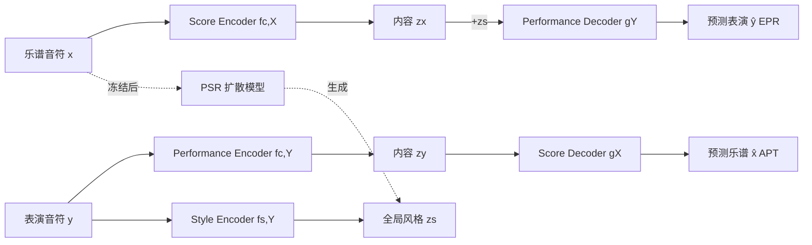

# Bridging Piano Transcription and Rendering via Disentangled Score Content and Style

**会议**: ICLR 2026  
**OpenReview**: [https://openreview.net/forum?id=173Pq3F31r](https://openreview.net/forum?id=173Pq3F31r)  
**代码**: [https://wei-zeng98.github.io/joint-apt-epr/](https://wei-zeng98.github.io/joint-apt-epr/)（demo 页）  
**领域**: 音乐信息检索 / 符号音乐生成与转录  
**关键词**: 表演渲染(EPR), 钢琴转录(APT), 内容-风格解耦, Seq2Seq, 扩散风格推荐  

## 一句话总结
本文把"乐谱→表演"的表情渲染(EPR)与"表演→乐谱"的钢琴转录(APT)这对互逆任务统一进一个 Transformer Seq2Seq 框架，通过解耦"音符级乐谱内容"和"全局表演风格"实现双向建模，并额外训练一个扩散模型从乐谱直接推荐合适风格，让渲染既可控又能自动化。

## 研究背景与动机
- **领域现状**：表情表演渲染(EPR, 谱→演)与自动钢琴转录(APT, 演→谱)是音乐信息检索(MIR)中一对天然互逆的任务——前者给符号乐谱注入富有表情的 timing/力度/articulation 生成 performance MIDI，后者反过来过滤掉这些表情细节恢复底层乐谱。
- **现有痛点**：尽管二者互为逆变换，过往工作几乎都把它们当作两个独立任务分别建模；EPR 系统普遍依赖 **note-level 对齐数据**（需用对齐工具预处理，且对颤音、波音等带时间歧义的技巧不友好），还经常要 composer/performer 标签或人工调表情参数，普通用户难以驾驭。
- **核心矛盾**：EPR 本质是"一对多"（同一乐谱可有多种风格演绎），需要风格作为条件；APT 是"多对一"（要把各种表情都过滤掉只留乐谱）——如何用一个统一表示同时服务这两个方向，且摆脱细粒度对齐，是关键难点。
- **本文目标**：构建一个**只用序列对齐数据**（无需 note-level 对齐）即可联合训练 EPR+APT 的框架，并让风格选择自动化、无需专家标签。
- **核心 idea**：**内容-风格解耦 + 任务对偶**——把乐谱与表演都编码成共享的"音符级内容空间"$Z_c$ 和一个"全局风格向量"$Z_s$，用 EPR/APT/掩码重建四个子任务互相监督；再用**扩散模型从乐谱内容直接生成风格嵌入**(PSR)，模仿钢琴家"看谱即知怎么弹"的能力。

## 方法详解

### 整体框架
框架由两部分组成：(1) 一个基于 Transformer 的**联合 Seq2Seq 模型**，含 5 个组件——Score/Performance/Style 三个编码器与 Score/Performance 两个解码器，联合训练 4 个子任务（掩码乐谱重建、掩码表演重建、EPR、APT）；(2) 一个**独立的扩散式表演风格推荐模型(PSR)**，在联合模型冻结后训练，仅凭乐谱内容生成风格嵌入。乐谱与表演都被表示成等长的音符级序列（乐谱每音符 8 个离散属性、表演 4 个），从而让内容编码器学到与模态无关的内容表示。

### 关键设计

**1. 统一对偶建模：用一套编码器-解码器同时跑 EPR 与 APT。** 作者把乐谱域 $X$ 与表演域 $Y$ 视为由两个互逆过程连接，二者共享音符级内容空间 $Z_c$；EPR 额外依赖风格空间 $Z_s$。配对数据下，内容编码器 $f_{c,X}, f_{c,Y}$ 与风格编码器 $f_{s,Y}$ 给出 $z_x=f_{c,X}(x)$、$z_y=f_{c,Y}(y)$、$z_s=f_{s,Y}(y)$，再解码：EPR 为 $\hat{y}=g_Y(z_x\oplus z_s)$（风格向量广播加到每个时间步），APT 为 $\hat{x}=g_X(z_y)$，均用交叉熵 $L_{EPR}=CE(\hat{y},y)$、$L_{APT}=CE(\hat{x},x)$ 优化。这种"一对多用内容+风格、多对一只用内容"的设计，让两个互逆任务在同一内容空间里互相监督，把 EPR 从依赖 note-level 对齐解放成纯序列对齐任务，同时也让 $z_x$ 与 $z_y$ 被鼓励对齐到同一内容表示。

**2. 掩码重建吃下海量无配对数据。** 配对的谱-演数据稀缺，作者借鉴 MAE 思路引入掩码重建：把输入随机替换部分 token 为 ⟨MASK⟩ 得到 $\tilde{x},\tilde{y}$，让模型重建完整序列——$L_{rec,X}=CE(g_X(f_{c,X}(\tilde{x})),x)$、$L_{rec,Y}=CE(g_Y(f_{c,Y}(\tilde{y})\oplus f_{s,Y}(y)),y)$。由此可把 75,913 份 MuseScore 公共乐谱与从 YouTube 钢琴 cover 转录得到的无配对表演 MIDI 都用上，大幅扩充内容编码器见过的符号结构分布。

**3. 内容-风格解耦的层级化设计 + KL 正则。** 解耦同时靠"训练目标"和"架构层级"双重保证：架构上，内容 $z_c$ 是**音符级序列向量**（编码 pitch/rhythm 等细粒度属性），风格 $z_s$ 是**单个全局向量**（仿 BERT 在 Style Encoder 前置 ⟨CLS⟩ token，取其末层隐状态），层级差异天然把"细粒度内容"和"整体风格"分到不同粒度；训练上，内容编码器被 APT/EPR/重建三类损失逼着只装内容信息。为让风格空间平滑可采样，对 $z_s$ 施加 KL 正则 $L_{KL}=D_{KL}(q(z_s\mid y)\,\|\,\mathcal{N}(0,I))$。总目标 $L_{total}=\underbrace{L_{EPR}+L_{APT}}_{\text{配对}}+\underbrace{L_{rec,X}+L_{rec,Y}}_{\text{无配对}}+\underbrace{L_{KL}}_{\text{正则}}$。

**4. 扩散式风格推荐(PSR)：从乐谱直接"想象"该怎么弹。** 联合模型训好并冻结后，作者另训一个独立模块，建模"给定乐谱 $x$ 的合理风格分布 $p(z_s\mid e_g)$"。它用单独的 score encoder $f_{g,X}$（同样 ⟨CLS⟩ 取全局内容 $e_g$）做条件，用 DDPM 学条件去噪：前向 $z_s^t=\sqrt{\bar\alpha_t}z_s+\sqrt{1-\bar\alpha_t}\epsilon$，去噪网络预测噪声，损失 $L_{PSR}=\mathbb{E}\big[\|\epsilon-g_s(e_g,z_s^t,t)\|_2^2\big]$，其中 ground-truth $z_s$ 取自冻结联合模型。推理时从高斯先验采样并条件于 $e_g$ 迭代去噪得到 $\hat{z}_s$，再把 $(x,\hat{z}_s)$ 喂给 $g_Y$ 合成表演。这一步把"风格选择"自动化，既支持多样化生成又免去 composer 标签或人工调参，让非专家也能做风格感知渲染。

## 实验关键数据

数据集：配对训练/评测用 ASAP（967 段高质量谱-演对，8:1:1 划分，同 Beyer & Dai 2024）；无配对乐谱来自 MuseScore（75,913 份 MusicXML），无配对表演来自 YouTube 钢琴 cover 转录；OOD 评测用 ATEPP（11,674 段、49 钢琴家、25 作曲家，带 composer/performer 标注）。模型每个 Transformer 组件 6 层 8 头、FFN 隐维 3072，用 RoPE + Pre-LN + SwiGLU；3×A5000 训 40k 步。

### 主实验：APT（ASAP，越低越好）

| 方法 | MUSTER $E_{avg}$ | $E_{onset}$ | $E_{offset}$ | ScoreSim $E_{extra}$ | $E_{spell}$ |
|---|---|---|---|---|---|
| Neural (Liu 2022) | 28.04 | 68.28 | 54.11 | 17.67 | 9.71 |
| MuseScore | 23.35 | 47.90 | 49.44 | 16.74 | 9.69 |
| Shibata 2021 (Classical) | 13.95 | 22.58 | 29.84 | 11.28 | – |
| End-to-end (Beyer & Dai 2024) | 14.10 | **17.48** | 32.92 | 11.29 | 14.31 |
| **Ours** | **12.48‡** | 16.26† | **27.30‡** | **9.48‡** | **6.24‡** |

> 在 MUSTER 综合误差 $E_{avg}$、offset 偏差、谱面 extra-note 与 pitch spelling 上均显著优于 end-to-end 强基线（‡ 表 p<0.01），多数子指标取得最优或次优。

### 对比实验：EPR 客观评估（方差 $\sigma^2$ 越接近 Human 越好，KL/MAE 越低越好）

| 方法 | $\sigma^2(O)$ | $\sigma^2(V)$ | KL(D) | KL(V) | MAE(V) |
|---|---|---|---|---|---|
| Human（参考） | 0.12 | 241.04 | – | – | – |
| Score（死板基线） | 0.07 | 1.36 | 13.01 | 13.00 | 29.14 |
| DExter (Zhang 2024) | 0.20 | 238.86 | 1.48 | 2.32 | 24.27 |

> 相比毫无表情的 Score 基线，扩散风格驱动的渲染在力度方差 $\sigma^2(V)$、KL 散度上明显靠近人类分布，说明生成的表演确有合理表情。EPR 还辅以 11 位受过音乐训练者的主观听测（覆盖 Bach/Rachmaninoff/Schubert/Scriabin/Ravel 五位作曲家）。

### 关键发现
- 联合框架在 EPR 与 APT 上都取得**有竞争力**的成绩，且 APT 多项指标显著超越对齐依赖型基线。
- 解耦有效：风格迁移与隐空间可视化均验证内容/风格被分开；学到的风格嵌入同时编码了 performer 与 composer 信息，**作曲家特征更主导**。
- PSR 能仅凭乐谱内容生成风格上"合适"的嵌入，证明"看谱推风格"可行。

## 亮点与洞察
- **任务对偶 = 免费监督信号**：把 EPR/APT 当互逆任务统一建模，类比 ASR↔TTS 的双向训练，让两端互相约束内容表示，是很优雅的弱监督思路。
- **解耦的层级 trick**：内容用"序列向量"、风格用"单个 ⟨CLS⟩ 向量"，靠表示粒度本身实现解耦，比纯靠对抗/互信息损失更稳。
- **把"选风格"建成生成问题**：用扩散从乐谱采样风格，既解决了 EPR 一对多的本质，又把专家标签/手动调参替换成一键自动渲染，落地友好。
- **摆脱 note-level 对齐**：仅用序列对齐就能训 EPR，对颤音/波音等时间歧义技巧更鲁棒，也让海量无配对乐谱/cover 数据可用。

## 局限与展望
- 仅限**符号到符号**（performance MIDI 与 score sheet 之间），未端到端处理原始音频，无配对表演还依赖一个外部 audio-to-MIDI 转录模型，误差会传入。
- 风格是**单一全局向量**，难以刻画乐曲内部段落级（rubato 在不同乐句的变化）的细粒度表情演变。
- 仅在钢琴、且以古典曲目(ASAP/ATEPP)为主验证，跨乐器、跨流派的泛化未充分检验。
- PSR 评估"风格合适性"较难有金标准，主观听测样本(5 曲、11 人)规模有限。

## 相关工作与启发
- **EPR**：从规则系统到 RNN/LSTM、Transformer（Rhyu 2022、Borovik & Viro 2023、Tang 2023），以及 note-level 扩散控制 DExter(Zhang 2024)；本文用 Seq2Seq + 全局风格摆脱细粒度对齐与手工特征。
- **APT**：沿用 Beyer & Dai (2024) 无需对齐的 Seq2Seq 转录范式作为内容建模骨干。
- **解耦表示学习(DRL)**：内容-风格分离在 CV/NLP 已成熟；Zhang & Dixon (2023) 无监督从表演解耦内容/风格，本文则聚焦"从乐谱生成表演"这一更少被探索的方向。
- **跨模态音乐翻译**：受 Jung et al. (2025) "只用序列对齐即可统一跨模态翻译"启发，呼应 alignment-free 监督的趋势。

## 评分
- **新颖性**: ⭐⭐⭐⭐ —— 首次把 EPR 与 APT 统一进单一解耦框架并用任务对偶互相监督，再叠加扩散式风格推荐，组合新颖且切中领域痛点。
- **实验充分度**: ⭐⭐⭐⭐ —— APT/EPR 双任务、客观+主观、解耦可视化与 OOD(ATEPP)均覆盖，统计显著性标注规范；但 EPR 主观样本偏小、缺端到端音频实验。
- **写作质量**: ⭐⭐⭐⭐ —— 动机清晰、对偶/解耦逻辑讲得透，公式与框架图配合好；部分模块（PSR 与联合模型的训练衔接）需对照附录才完全清楚。
- **价值**: ⭐⭐⭐⭐ —— 为符号音乐的双向建模与可控自动渲染提供了实用范式，对音乐教育、再演绎、表演分析等应用有直接意义。

<!-- RELATED:START -->

## 相关论文

- [\[ACL 2026\] FC-TTS: Style and Timbre Control in Zero-Shot Text-to-Speech with Disentangled Speech Representations](../../ACL2026/audio_speech/fc-tts_style_and_timbre_control_in_zero-shot_text-to-speech_with_disentangled_sp.md)
- [\[ICLR 2026\] When Style Breaks Safety: Defending LLMs Against Superficial Style Alignment](when_style_breaks_safety_defending_llms_against_superficial_style_alignment.md)
- [\[ACL 2026\] MSU-Bench: Musical Score Understanding Benchmark](../../ACL2026/audio_speech/musical_score_understanding_benchmark_evaluating_large_language_models39_compreh.md)
- [\[ICLR 2026\] FlexiVoice: Enabling Flexible Style Control in Zero-Shot TTS with Natural Language Instructions](flexivoice_enabling_flexible_style_control_in_zero-shot_tts_with_natural_languag.md)
- [\[ACL 2026\] Style Amnesia: Investigating Speaking Style Degradation and Mitigation in Multi-Turn Spoken Language Models](../../ACL2026/audio_speech/style_amnesia_investigating_speaking_style_degradation_and_mitigation_in_multi-t.md)

<!-- RELATED:END -->
