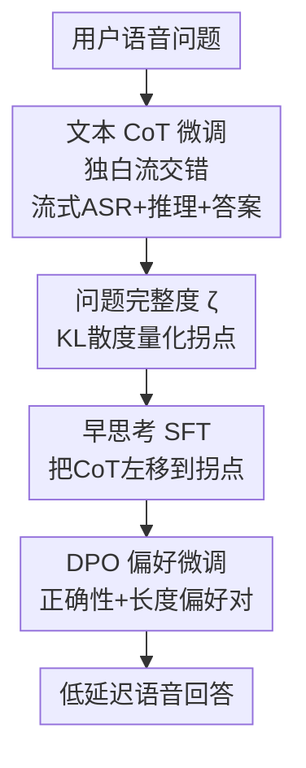

# Can Speech LLMs Think while Listening?

**会议**: ICLR 2026  
**OpenReview**: [https://openreview.net/forum?id=dFVenZdVbX](https://openreview.net/forum?id=dFVenZdVbX)  
**代码**: 无  
**领域**: 语音LLM / 推理 / 多流架构  
**关键词**: 语音LLM, 思维链, 流式ASR, 边听边想, 偏好微调

## 一句话总结
本文在多流语音 LLM（Moshi）的文本独白流里塞入文本思维链，让推理在文本空间进行使准确率平均提升 2.4 倍；又提出基于 KL 散度的「问题完整度」指标，让模型在用户还没说完时就「边听边想」提前开始推理，再配合 DPO 偏好微调，把额外推理延迟降低约 70% 而不损准确率。

## 研究背景与动机
**领域现状**：传统语音助手把 ASR、文本 LLM、TTS 三个模块级联起来，延迟高且误差累积。近年的语音大模型（speech LLM）直接端到端处理语音输入/输出，能同时建模语义和副语言特征，是更优雅的替代方案，在闲聊式对话里表现不错。

**现有痛点**：但语音 LLM 在复杂推理任务（数学、社会/物理常识）上明显落后于同规模的文本 LLM。文本 LLM 早就靠思维链（CoT）大幅提升了推理能力，可 CoT 在语音域几乎只被用在翻译、对话、检测等任务，没人系统研究「多流语音 LLM 该怎么做 CoT」。

**核心矛盾**：在语音交互里，推理和响应延迟是天然对立的。CoT 越长准确率越高，但模型必须「听完问题 → 推理 → 开口回答」串行执行，中间插入一段不发声的推理会显著拉长用户感知到的延迟，破坏对话自然度。已有的「边说边想」（thinking while speaking，如 STITCH、Mini-Omni-Reasoner）让模型一边推理一边发声，但 chunk 大小依赖硬件难调，而且可能把推理过程念出来反而拖慢得到结论的时间。

**本文目标**：拆成两个研究问题——(i) 语音 LLM 该用文本还是语音做推理？(ii) 怎样在引入 CoT 的同时保住语音交互的实时性？

**切入角度**：作者从神经科学的「人类边听边想」现象出发——人往往在问题还没说完时就已经在组织答案了。如果模型也能在用户语音流仍在进行时就提前启动推理，那段推理延迟就能被「藏」进用户说话的时间里。

**核心 idea**：在多流架构的文本独白流里交错放置「流式 ASR 转写 + 文本推理 + 答案文本」，用一个熵/KL 散度定义的「问题完整度」指标判断什么时候信息已经够了、可以提前开始推理，再用 DPO 偏好微调把准确率-延迟的帕累托前沿继续往前推。

## 方法详解

### 整体框架
全文围绕一个目标：让多流语音 LLM 既会推理、又不拖慢响应。整体分四步走。先把基座 Moshi 微调成会在文本独白流里生成文本 CoT 的模型，并把用户语音的流式 ASR 也写进同一条文本流，让推理「看得到」用户在说什么；这一步解决「会不会推理」。接着定义「问题完整度」ζ 来量化问题进行到第几个词时信息已经足够，找到每个样本的「拐点」；这一步解决「什么时候可以提前想」。然后用左移到拐点的训练样本做 SFT，教模型自己预测拐点并提前触发推理；最后用拒绝采样构造正确性/长度两类偏好对做 DPO，让模型在提前推理时既能动态修正、又能压短冗长的推理链。

Moshi 是全双工多流模型，每个时间步同时处理三条对齐的 token 流：用户音频 $A^U$、系统音频 $A^S$、系统文本（文本独白）$T^S$；音频经 Mimi codec 编码成 12.5 Hz、8 codebook 的离散 token，文本流里大量是 [PAD]/[EPAD] 填充 token 以和音频对齐。本文的全部改造都发生在文本独白流上。

### 关键设计

**1. 文本 CoT + 流式 ASR 共用文本独白流：让语音模型在文本空间推理**

针对「语音 LLM 不会复杂推理」这个痛点，作者选择在文本而非语音空间做 CoT，因为文本 token 信息密度远高于语音 token（实验显示语音 CoT 会让整段响应膨胀到 3 倍 token 长度）。具体做法：在 Moshi 的文本独白流上，除了原本和音频对齐的答案文本 $A^T$，再额外允许模型生成不带对应音频的纯推理 token $R^T$，用 `<start_cot>`/`<end_cot>` 把推理段框起来。

更关键的是同时把用户语音的**流式 ASR** 转写 $Q^T$ 也写进同一条文本流。作者发现让模型一边转写用户在说什么、一边推理，能显著提升推理准确率（去掉流式 ASR 后 ARC-E 从 77.7 掉到 55.8）。转写采用按词对齐、右移 $k$ 个 token 做 look-ahead 的流式方式，$k=6$（约 480 ms）在延迟和词错率间取得平衡。于是文本独白流上同时承载了用户转写 $Q^T$、推理 $R^T$ 和答案 $A^T$ 三种内容，为后面「边听边想」时三者交错打下基础。

**2. 问题完整度 ζ：用 KL 散度判断「信息够不够开始想」**

要让模型提前推理，必须先回答「提前到哪一刻合适」。最朴素的办法是固定提前几个词，但它没有语义感知——比如「法国的首都是？」必须等到最后的「法国」才有信息，固定左移会乱套。作者为此定义「问题完整度」ζ 作为语义完整度进度条。

给定问题 $Q_{1:N}$（$N$ 个词）、推理 $R$、答案 $A$，目标是找到拐点 $p$，使得只给前半句也能得到几乎相同的推理与答案：$\Pr[R,A\mid Q_{1:p}] \approx \Pr[R,A\mid Q_{1:N}]$。记 $X_p = \Pr[R,A\mid Q_{0:p}]$（可用外部语言模型估计），则

$$\zeta(p) = 1 - \frac{D_{KL}(X_N \| X_p)}{D_{KL}(X_N \| X_0)},$$

其中 $X_N$、$X_0$ 分别对应给全问题和不给问题两个极端，因此 $\zeta(0)=0$、$\zeta(N)=1$，ζ 越接近 1 表示当前已听到的部分语义越完整。拐点近似取首个越过阈值 $\theta$ 的位置：$\hat p = \min\{p : \zeta(p) \ge \theta\}$。相比固定词数启发式，ζ 给了准确率-延迟权衡更细的可控性（同延迟下 ARC-Easy 准确率高 4%）。

**3. 早思考 SFT：把推理左移到拐点，教模型自己预测「该想了」**

有了拐点，作者把训练样本里的推理 token 左移到拐点处，让推理与用户语音在文本独白流上交错。由于左移后推理 token 会和正在进行的流式 ASR token 抢位置，作者引入 `<switch_cot>`/`<switch_asr>` 两个切换 token，让模型在「转写用户」和「生成推理」两种模式间来回切换：先正常铺用户 ASR token，再把 CoT token 插进空白的 [PAD]/[EPAD] 槽位，每次切换前加切换 token，这样既保住了 ASR 和音频的时间对齐、又把推理藏进了用户说话的间隙。

训练时第一个 `<switch_cot>` 正好落在拐点，模型通过最大化预测这个切换 token 的概率，学会「评估已听到的部分问题、自己判断信息何时足够」。推理阶段不再给拐点，模型只能根据不断到来的部分用户问题在内部预测拐点并自发触发推理——这正是「边听边想」的核心机制。

**4. DPO 偏好微调：拒绝采样造偏好对，同时修对推理、压短长度**

作者发现单靠 SFT 模型难以学好早推理分布：要么无法根据用户新说出的内容动态更新已经开始的 CoT，要么对简单问题生成过长的推理链。于是用拒绝采样构造对比偏好对做 DPO。具体地，对训练子集用 SFT 模型在 $\zeta(p)=\theta$ 处强制提前解码 `<start_cot>` 生成 $K$ 个候选，再选偏好/拒绝样本：为提升自适应性，偏好基于响应正确性（correctness-based）；为降延迟，偏好同时基于推理长度和正确性（length-based）。

DPO 目标为标准形式

$$L_{DPO}(\pi_\Theta;\pi_{ref}) = -\mathbb{E}_{(x,y_w,y_l)}\Big[\log\sigma\big(\beta\log\tfrac{\pi_\Theta(y_w|x)}{\pi_{ref}(y_w|x)} - \beta\log\tfrac{\pi_\Theta(y_l|x)}{\pi_{ref}(y_l|x)}\big)\Big],$$

并叠加对 $y_w$ 的 NLL 项稳定训练：$L_{pref} = L_{DPO} - \lambda\,\mathbb{E}_{(x,y_w)}[\log\pi_\Theta(y_w|x)]$。几个工程细节让训练更稳：只用文本独白流 $T^S$ 计算序列概率、把用户流式 ASR token $Q^T$ 排除在概率计算外（以便区分 $y_w$/$y_l$）、采用长度归一化 DPO。最终正确性偏好把准确率提上去、长度偏好把延迟再压约 70%。

### 损失函数 / 训练策略
SFT 阶段沿用 Moshi 的下一 token NLL 损失；偏好微调阶段用上面的 $L_{pref}$（DPO + NLL 稳定项）。训练数据从 CoT-Collection（1.8M 文本推理样本）改造而来：先去掉问题超过 60 词的样本（剩约 690K），再用 LLM 做「口语化改写」，最后用内部 TTS 把问答转成 24 kHz 单声道音频，使文本推理数据适配语音对话场景。

## 实验关键数据

### 主实验
作者自建 SRQA（口语推理问答）基准，由 ARC-E/ARC-C、PIQA、SIQA、GSM8K 等文本基准经 LLM 改写 + TTS 转成口语形式；准确率用 LLaMA-3.1 405B 做评判（VAD 检测 + Whisper 转写后判分），延迟用 token 数衡量（与硬件解耦）。

| 模型 | ARC-E | ARC-C | SIQA | PIQA | GSM8K | LLaMA-QS |
|------|-------|-------|------|------|-------|----------|
| Moshi（baseline） | 30.2 | 21.5 | 22.8 | 23.8 | 8.7 | 42.8 |
| **Moshi + CoT（本文）** | **77.7** | **59.8** | **56.1** | **56.9** | **16.1** | 57.8 |
| Qwen2-Audio-7B-Instruct | 59.1 | 42.4 | 21.9 | 24.5 | 18.1 | 64.7 |
| Kimi-Audio-7B-Instruct | 83.0 | 71.5 | 32.9 | 34.4 | 15.7 | 61.7 |

本文方法在 Moshi 基座上平均绝对提升约 29.1%，多数任务 2-3 倍涨幅；尽管 Kimi-Audio 预训练数据多达 18T token（本文仅 2.1T），本文在所有推理任务上仍稳居 top-2。

### 消融实验
| 配置 | ARC-E | GSM8K | 说明 |
|------|-------|-------|------|
| Moshi + CoT（完整） | 77.7 | 16.1 | 含流式 ASR（延迟 6 token） |
| w/o 流式用户 ASR | 55.8 | 12.2 | 去掉 ASR 后所有推理任务大跌 |
| Text CoT | – | 17.5 | 文本推理 |
| Speech CoT | – | 17.2 | 语音推理，准确率相当但 token 长 3 倍 |
| No CoT（直接 QA 微调） | – | 3.5 | 反而比 baseline 还低 |

DPO 长度偏好微调（基座 $\theta=0.75$）的效果：

| 评测集 | 准确率 SFT→DPO | 延迟 SFT→DPO |
|--------|----------------|--------------|
| ARC-E | 62.8 → 65.4 | 49.2 → 12.0 |
| ARC-C | 43.2 → 46.0 | 49.9 → 13.2 |
| SIQA | 45.1 → 45.3 | 50.0 → 12.9 |
| GSM8K | 13.8 → 14.7 | 76.0 → 48.6 |

### 关键发现
- **流式 ASR 是推理涨点的关键**：去掉它推理任务全线下跌（ARC-E 77.7→55.8），但事实性任务（LLaMA-QS）几乎不变，说明「让模型一边转写一边想」确实在帮推理而非单纯记忆。look-ahead 延迟从 2 增到 6 token，WER 和准确率同步改善，4 token 后大多饱和（GSM8K 仍持续受益），6 token 时已接近 offline ASR 上限。
- **文本 CoT ≈ 语音 CoT 但更省**：两者 GSM8K 准确率几乎一样（17.5 vs 17.2），但语音 CoT 整段响应 token 长 3 倍，文本 CoT 信息密度优势明显。
- **直接 QA 微调反而掉点**：No CoT 把 GSM8K 拉到 3.5（低于 baseline 8.7），说明涨点来自「会思考」而非训练数据本身——强行让 Moshi「不思考」会损害它原本隐式的推理。
- **ζ 比固定词数启发式更可控**：WordShift 基线在 PIQA/GSM8K 上增大左移词数并不能稳定降延迟（模型学不到模式），而 ζ 随阈值 $\theta$ 从 0.95 降到 0.65 在所有任务上单调降延迟。正确性 DPO 还把模型触发 CoT 的位置和 ground truth 对齐（Start CoT Gap 从 -5.77 收敛到 -1.56），长度 DPO 平均再降 30 token 延迟。

## 亮点与洞察
- **把「神经科学的边听边想」翻译成可训练的目标**：核心巧思是认识到——多流自回归模型本就能与流式输入同步产 token，所以「提前思考」可以被建模为「在合适时刻采样到第一个 `<switch_cot>`」，再用熵/KL 指标给「合适时刻」一个可微的监督信号。
- **问题完整度 ζ 是一个可迁移的「语义进度条」**：用 $1 - D_{KL}(X_N\|X_p)/D_{KL}(X_N\|X_0)$ 量化「听到第 p 个词时离完整还差多少」，思路可迁移到任何流式决策场景（流式翻译何时落笔、增量对话何时打断），不限于语音推理。
- **延迟用 token 数而非秒来报**：把延迟报成 token 数而非绝对秒，使其与 codec/硬件解耦，是个值得借鉴的评测设计；作者还指出一次前向 26 ms < 80 ms/token，意味着可以一次解多个文本 token 进一步加速（留作 future work）。

## 局限与展望
- **依赖合成数据**：训练和评测的口语数据都是文本基准经 LLM 改写 + TTS 合成的，与真实人类自发口语（口音、犹豫、重述、噪声）有分布差距，真实场景表现待验证。
- **拐点估计依赖外部 LM**：ζ 中的 $X_p$ 要用外部语言模型估计，且作者自承 ζ 并非严格单调（句法不完整时有局部波动），拐点选取对阈值 $\theta$ 敏感。
- **GSM8K 等硬推理仍弱**：数学推理准确率只有十几个百分点，远低于文本 LLM，说明文本 CoT 注入还远没把语音 LLM 的推理天花板顶上去。
- **只覆盖单轮**：基准是单轮口语推理，多轮对话中「边听边想」如何与历史上下文/打断交互配合尚未探索。

## 相关工作与启发
- **vs STITCH / Mini-Omni-Reasoner（thinking while speaking）**：它们让模型一边发声一边推理、交错语音响应和推理 chunk，但 chunk 大小依赖硬件难调，且可能把推理念出来反而拖长得到结论的时间。本文反其道而行，提出 thinking while **listening**——在用户还没说完、模型还没开口时就把推理藏进听的阶段，从源头压缩感知延迟。
- **vs Arora et al. / Yuen et al.（用转写做 CoT 中间步）**：他们也用用户语音转写辅助语音 LLM 推理，但用的是 offline ASR（听完再转）。本文用按词对齐、右移 k token 的**流式** ASR，使转写与推理能在听的过程中实时交错。
- **vs 文本 LLM 的 hybrid reasoning（何时/想多久）**：文本域已有大量关于「该不该想、想多长」的研究，本文把这个权衡迁移到语音流式场景，并给出 ζ 指标 + DPO 这条把准确率-延迟帕累托前沿往前推的具体路径。

## 评分
- 新颖性: ⭐⭐⭐⭐⭐ 首个在多流语音 LLM 上做文本 CoT，并提出「边听边想」范式 + 问题完整度指标
- 实验充分度: ⭐⭐⭐⭐ 自建 SRQA 基准 + 多维消融扎实，但缺真实口语数据、硬推理仍弱
- 写作质量: ⭐⭐⭐⭐ 动机清晰、图示直观，ζ 的定义和 token 交错机制讲得明白
- 价值: ⭐⭐⭐⭐⭐ 直击语音助手「会推理却拖延迟」的核心痛点，方法和评测都可迁移

<!-- RELATED:START -->

## 相关论文

- [\[NeurIPS 2025\] Can LLMs Outshine Conventional Recommenders? A Comparative Evaluation](../../NeurIPS2025/audio_speech/can_llms_outshine_conventional_recommenders_a_comparative_evaluation.md)
- [\[ICLR 2026\] Closing the Gap Between Text and Speech Understanding in LLMs](closing_the_gap_between_text_and_speech_understanding_in_llms.md)
- [\[ACL 2026\] StressTest: Can YOUR Speech LM Handle the Stress?](../../ACL2026/audio_speech/stresstest_can_your_speech_lm_handle_the_stress.md)
- [\[ICLR 2026\] The Devil behind the Mask: An Emergent Safety Vulnerability of Diffusion LLMs](the_devil_behind_the_mask_an_emergent_safety_vulnerability_of_diffusion_llms.md)
- [\[ICLR 2026\] When Style Breaks Safety: Defending LLMs Against Superficial Style Alignment](when_style_breaks_safety_defending_llms_against_superficial_style_alignment.md)

<!-- RELATED:END -->
