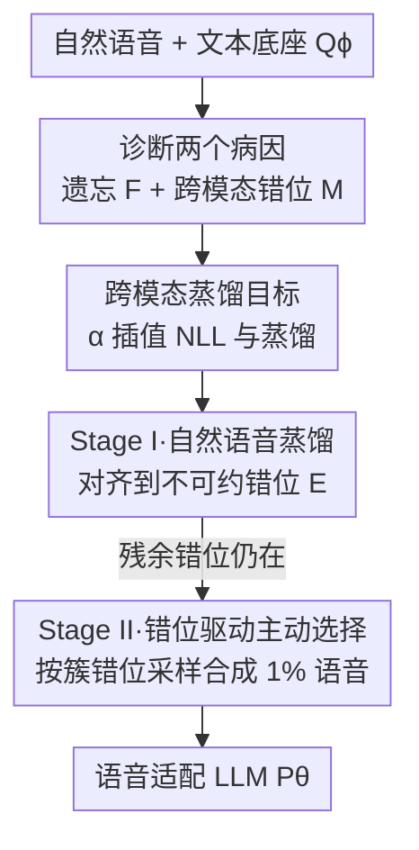

# Closing the Gap Between Text and Speech Understanding in LLMs

**会议**: ICLR2026  
**OpenReview**: [https://openreview.net/forum?id=dDHnO3Vhyj](https://openreview.net/forum?id=dDHnO3Vhyj)  
**代码**: 待确认  
**领域**: 语音 / 多模态 LLM  
**关键词**: 语音适配 LLM, 跨模态蒸馏, 主动数据选择, 灾难性遗忘, 语音语言理解  

## 一句话总结
本文把"语音适配 LLM 在语言理解任务上不如文本原版"这个现象拆解为**遗忘**和**跨模态错位**两个可量化病因，并据此提出 SALAD——先用跨模态蒸馏在自然语音上对齐、再用错位信号驱动的主动选择补一小撮合成语音，只用比同行少一个数量级的语音数据，就让 3B/7B 模型在六个广域知识与推理基准上逼近最强开源模型。

## 研究背景与动机
**领域现状**：把文本 LLM 扩展到语音有两条路。级联式（ASR 转文字再喂给 LLM）能完整保留文本能力，但把说话人、语气这些副语言线索全丢了，做不了自然口语交互；端到端式（直接让 LLM 处理语音表征）保留了这些线索，是近年主流方向。

**现有痛点**：端到端的语音适配 LLM 在"语言理解"这个核心能力上反复掉链子——不仅打不过同容量的文本 LLM，甚至打不过级联系统。作者把这个落差正式命名为**文本-语音理解鸿沟（text–speech understanding gap）**：同一个语言理解任务，语音适配模型处理语音输入的表现，相对原始文本 LLM 处理等价文本输入的表现，掉了多少。

**核心矛盾**：现有缩小鸿沟的办法都很贵。一类靠把整个文本语料库 TTS 合成成语音来对齐训练分布，合成规模动辄等价于上百 B 文本 token，成本高且严重依赖合成数据；另一类靠百万小时级的私有语音数据，根本不可复现。问题根子在于：公开语音/平行语音-文本数据相对文本数据极度稀缺，**而现有方法没搞清楚鸿沟到底由什么驱动，只能靠堆数据硬怼**。

**本文目标**：先把鸿沟拆成可测量的成因，再据此设计样本高效的解法，让公开窄域语音也能把鸿沟压下去。

**切入角度**：作者主张要弥合鸿沟，语音适配模型必须同时做到两件事——（i）保住文本底座的知识（不遗忘），（ii）对语义等价的语音和文本输入给出一致输出（不错位）。于是把这两件事各自定义成一个 KL 散度量，去实测它们和下游鸿沟的相关性。

**核心 idea**：用"跨模态蒸馏（让文本底座当老师）解决遗忘+对齐"，再用"错位信号驱动的主动选择"只合成极少量最该补的语音去填窄域语料的领域缺口，把数据需求砍掉一个数量级。

## 方法详解

### 整体框架
SALAD（Sample-efficient Alignment with Learning through Active selection and cross-modal Distillation）的目标是训练一个语音适配语言模型 $P_\theta$，让它在给定语音输入时预测下一个文本 token 的分布尽量贴近原始文本底座 $Q_\phi$。架构沿用标准三件套：一个轻量的 Mimi 语音 tokenizer 作编码器（训练中冻结）、一个 122M 参数的 transformer 解码器堆栈作适配器、以及语言模型本身（从 Qwen2.5-3B/7B 初始化）。作者故意选了因果、流式友好、表征"不像文本"的简单编码器，把它当作输入对齐的"最坏情况"，以验证方法不靠复杂的表征对齐模块。

整个方法分两条线。**分析线**先把鸿沟拆成两个可测量的病因——遗忘 $F$ 和跨模态错位 $M$，并实测出它们高度预测下游表现，从而得到两条洞见：跨模态蒸馏比极大似然更能压制错位和遗忘；让语音训练数据的领域去匹配文本预训练领域还能再涨。**方法线**据此把训练组织成两阶段：Stage I 在自然语音上用蒸馏目标把模型对齐到 $E$（不可约错位）就饱和，Stage II 再用模型自己的错位信号挑出最该补的领域、只合成 1% 的语音去填，针对性消除残余错位。

### 关键设计

**1. 把鸿沟拆成遗忘和错位两个可测量的 KL 散度**

以前大家只观察到"语音适配模型表现差"，但说不清差在哪里、该治哪里。本文给出两个明确定义。**跨模态错位** $M$ 衡量同一个模型在"喂文本"和"喂等价多模态上下文"时下一 token 分布的差异：

$$M = \sum_{(w,c)\sim Q} D_{KL}\big(P_\theta(w_{i+1}\mid w_{\le i}) \,\|\, P_\theta(w_{i+1}\mid c_{\le i})\big)$$

**遗忘** $F$ 衡量语音适配模型 $P_\theta$ 在纯文本输入上相对原始文本底座 $Q_\phi$ 偏离了多少：

$$F = \sum_{w\sim Q} D_{KL}\big(Q_\phi(w_{i+1}\mid w_{\le i}) \,\|\, P_\theta(w_{i+1}\mid w_{\le i})\big)$$

两者都在一个广域语料（FineWeb-Edu 的文本-语音版）上测量。实证发现它们高度预测下游：语音表现随错位增大而下降（留一交叉验证 $R^2=0.75$），文本表现随遗忘增大而下降（$R^2=0.74$）；偏 $R^2$ 进一步表明错位独立解释语音方差、遗忘独立解释文本方差。这把一个模糊的"鸿沟"变成了两个有抓手、可优化的目标——后面所有设计都直接冲着压这两个量去。

**2. 用 α 插值的训练目标，让蒸馏接管对齐与抗遗忘**

诊断发现：在窄域语音上用标准的极大似然（NLL）训练，错位会随数据量越训越大，越训越差；而用蒸馏目标——让文本底座 $Q_\phi$ 当老师，匹配它在文本位置上的完整输出分布——即便只在窄域数据上训，也能同时改善对齐和遗忘。作者用一个系数 $\alpha\in[0,1]$ 把两者插值：

$$\mathcal{L}(D,\theta) = \alpha\,\mathcal{L}_{\text{DIST}}(D,\theta) + (1-\alpha)\,\mathcal{L}_{\text{NLL}}(D,\theta)$$

其中蒸馏项 $\mathcal{L}_{\text{DIST}}$ 只在交错序列的文本位置上计算 $Q_\phi$ 与 $P_\theta$ 的 KL（用指示函数 $\mathbb{1}_{\{\text{text at }i+1\}}$ 选位置）。训练数据是语音和文本交错的序列（文本段 10–30 词、语音段 5–15 词随机交错）。错位的标度律拟合 $M = E + B\,D^{-\beta}$ 显示：$\alpha>0$ 时错位很早就饱和到不可约项 $E$，且 $\alpha$ 越大 $E$ 越小，所以蒸馏是关于错位最可扩展的目标。这条直接否定了"靠 NLL 多堆数据"的老路。

**3. Stage I：在自然语音上蒸馏，把对齐推到饱和**

第一阶段只在自然语音语料（LibriHeavy + Emilia，约 14 万小时）上最小化 $\mathcal{L}_{\text{DIST}}$，利用蒸馏"早饱和"的良好标度行为，在可负担的预算（24B token）内把错位压到接近不可约项 $E$。这一阶段完全不碰合成数据，靠的是自然语音本身——既保留了副语言信息，又避免了大规模合成的成本和失真。但单靠窄域自然语音，蒸馏会留下一块"残余错位"：自然语音语料只覆盖少数几个领域（图 2 显示 LibriHeavy/Emilia 集中在极少数领域，而文本语料覆盖广），那些没被语音覆盖到的领域，模型对齐不上。

**4. Stage II：用错位信号主动选择该合成哪些语音**

残余错位的根子是领域缺口，但把整个文本语料都合成成语音太贵。作者借鉴 CRISP 的聚类重要性采样，让**模型自己**指出该补哪里。先把广域文本语料 $D_{web}$ 用句向量 + 平衡 k-means 切成 $K=128$ 个簇；关键是没有现成的目标领域分布，于是直接把"每个簇内 $P_\theta$ 与 $Q_\phi$ 的散度"当作"这个簇属于缺失领域的程度"的代理，定义目标分布

$$P_{\text{target}}(c) \propto P_{web}(c)\, f_\gamma(M(c)),\qquad f_\gamma(m)=m^\gamma$$

其中 $M(c)$ 是在小探针集上测的簇内错位，$\gamma$ 控制聚焦强度（$\gamma=0$ 退化为均匀采样，越大越聚焦高错位簇，文中用 $\gamma=5$）。然后按 $P_{\text{target}}$ 反复抽簇、在簇内均匀取文本、合成语音、组成交错上下文，直到耗尽**仅 1%** 于 $D_{speech}$ 的合成预算。为防止遗忘 Stage I 的成果，把这批主动数据 $D_{active}$ 和原自然语音 $D_{speech}$ 合并起来继续蒸馏。这一步把合成数据用在刀刃上——只补模型自认最对不齐的科学、技术性领域。

### 损失函数 / 训练策略
核心目标即式 (4) 的 $\alpha$ 插值损失，SALAD 两阶段都用纯蒸馏（$\alpha=1$）。Stage I 训 24B token，Stage II 再训 1.9B token；Stage II 的合成预算只占 $D_{speech}$ 的 1%，聚类用 BAAI/bge-large-en-v1.5 句向量做 $K=128$ 平衡 k-means，$\gamma=5$。编码器全程冻结，只优化适配器和语言模型。

## 实验关键数据

### 主实验
评测在六个广域知识/推理基准的语音版上进行：StoryCloze、MMSU、OpenBookQA、HellaSwag、ARC-Challenge、PIQA，few-shot 提示、准确率为指标。"Gap"= 文本底座给文本输入的准确率 − 语音适配模型给语音输入的准确率，越低越好。

| 模型 | 语音平均 Acc. | 平均 Gap | 训练语音数据 |
|--------|------|------|----------|
| 级联上限 ASR+Qwen2.5-7B | 79.4 | 2.2 | —（topline 参考）|
| Qwen2-Audio-7B | 53.7 | 17.8 | 大规模 |
| DiVA-Llama3.1-8B | 52.6 | 26.1 | 大规模 |
| GLM-4-Voice-9B | 63.4 | 20.1 | 大规模合成 |
| Qwen2.5-Omni-7B（最强闭配方）| 76.7 | 5.0 | 百万小时级私有 |
| **SALAD-3B**（Stage II）| 72.0 | 4.6 | **少一个数量级** |
| **SALAD-7B**（Stage II）| 75.4 | 6.2 | **少一个数量级** |

SALAD-3B 超过除 Qwen2.5-Omni 外所有更大的端到端基线；在开放训练配方的模型里，SALAD 把鸿沟相对次优模型缩小了 11.7%，逼近最强闭配方系统（差 1.2%），却只用了少一个数量级的数据。

### 消融实验

| 配置 | MMSU | OBQA | ARC-C | 说明 |
|------|---------|------|--------|------|
| Stage II 均匀采样 | 49.5 | 71.9 | 78.9 | 随机选合成数据 |
| Stage II 主动选择 | 52.5 | 76.7 | 79.9 | 错位驱动选择 |

主动选择相对均匀采样在 MMSU、OpenBookQA、ARC-C 上涨幅最大——这几个任务涉及科学问题和技术术语，最可能落在 Stage I 自然语音分布之外，正是主动选择该补的领域，印证了"按错位补领域缺口"的设计逻辑。

文本能力保持上（Table 5，给文本输入测）：SALAD-3B 平均文本 Acc. 76.9、Gap −0.5，SALAD-7B 为 82.2、Gap −0.9，都比基线小得多（GLM-4-Voice-9B 文本 Gap 高达 13.6），说明蒸馏目标有效约束模型忠于老师、几乎不遗忘文本能力。

### 关键发现
- 错位独立解释语音表现方差（偏 $R^2\approx0.56$），遗忘独立解释文本表现方差（偏 $R^2\approx0.32$），两个度量是有效且互补的抓手。
- NLL 在窄域语音上越训错位越大；蒸馏（$\alpha>0$）错位早饱和、$\alpha$ 越大不可约项 $E$ 越小——蒸馏是关于对齐最可扩展的目标。
- 单纯做领域匹配（在 FineWeb-Edu 上用 $\alpha=0$ 训）不能解决错位，必须配合蒸馏才有持续增益。
- 主动选择只在科学/技术性、超出自然语音分布的任务上带来明显增益，符合"按缺口补数据"的预期。

## 亮点与洞察
- **把模糊现象变成两个可优化的量**：用两个 KL 散度把"鸿沟"分解为遗忘和错位，再用回归实证它们各自预测文本/语音表现——这套"先量化病因再对症下药"的方法论本身就很可迁移，任何模态适配/迁移学习掉点都能借鉴。
- **让模型自己当领域探针**：Stage II 没有外部目标领域标注，直接用"簇内 $P_\theta$ 与 $Q_\phi$ 的散度"当作"缺失领域"的代理来重要性采样，把合成预算压到 1%。这种"用模型自身分歧信号驱动主动学习"的思路，能迁移到任何"全量合成太贵、但缺口集中"的场景。
- **故意用最弱编码器证明方法鲁棒**：选因果、流式、不像文本的 Mimi 当"最坏情况"输入，说明 SALAD 不靠复杂表征对齐模块也能 work，对低延迟流式语音交互直接可用。

## 局限与展望
- **只做语音→文本理解**：本文聚焦"以文本为中间表征"反映语言能力，把"生成语音"留给未来工作，因此 SALAD 还不是完整的语音对话系统。
- **仍依赖合成语音**：虽然砍到 1%，Stage II 仍需 TTS 合成，且合成语音缺乏自然副语言丰富度；副语言信息能否在窄域自然语音 + 少量合成里充分保留，文中未深究。
- **英语单语、特定底座**：实验只在英语语料（LibriHeavy/Emilia/FineWeb-Edu）和 Qwen2.5 底座上验证，跨语言、跨底座的泛化性待验证。
- **诊断依赖广域探针集**：$M$、$F$ 的测量和 Stage II 的簇错位都依赖一个能代表广域分布的探针/语料，探针质量差时主动选择可能选偏。

## 相关工作与启发
- **vs 大规模合成路线（GLM-4-Voice / Zeng et al.）**: 他们把整个文本预训练语料 TTS 合成来匹配分布，等价上百 B token，成本巨大且重度依赖合成数据；本文用错位驱动的主动选择只合成 1%，把"领域匹配"做成自适应填缺口，并指出领域匹配必须配合蒸馏才有效。
- **vs 闭配方大数据模型（Qwen2.5-Omni / Kimi）**: 它们靠百万小时级私有语音（可比文本全量预训练预算）取得强表现但不可复现；SALAD 用公开窄域语料、开放配方，逼近其表现（差 1.2%）且数据少一个数量级。
- **vs 表征对齐路线（Tang et al. / Held et al. / Tseng et al.）**: 他们在编码器/适配器上做文章，用大非因果编码器和复杂模块把语音表征"变得像文本"以促进对齐，不适合低延迟流式；本文反其道，用最简单的因果流式编码器，把对齐放到训练目标（蒸馏）和数据选择上去解决。
- **vs 纯跨模态蒸馏（Wang et al. / Held et al.，对应本文 α=1）**: 他们证明了密集监督（匹配完整输出分布）的蒸馏优于监督学习，但都只在窄域有效、留有残余错位；本文补上 Stage II 主动选择专门消除这块残余，并给出错位的标度律解释为什么蒸馏可扩展。

## 评分
- 新颖性: ⭐⭐⭐⭐⭐ 把鸿沟拆成两个可量化病因 + 用模型自身错位信号驱动主动选择，诊断到方法一气呵成。
- 实验充分度: ⭐⭐⭐⭐ 有标度律、回归相关性、主动 vs 均匀消融、文本保持对照，但局限于英语单底座。
- 写作质量: ⭐⭐⭐⭐⭐ "先量化病因、再对症设计"的叙事极清晰，每个设计都能追溯到一条实证洞见。
- 价值: ⭐⭐⭐⭐⭐ 把语音适配 LLM 的数据需求砍掉一个数量级，且配方开放可复现，对低资源语音交互意义大。

<!-- RELATED:START -->

## 相关论文

- [\[ACL 2026\] Closing the Modality Reasoning Gap for Speech Large Language Models](../../ACL2026/audio_speech/closing_the_modality_reasoning_gap_for_speech_large_language_models.md)
- [\[ACL 2026\] Computational Narrative Understanding for Expressive Text-to-Speech](../../ACL2026/audio_speech/computational_narrative_understanding_for_expressive_text-to-speech.md)
- [\[ICLR 2026\] DrVoice: Parallel Speech-Text Voice Conversation Model via Dual-Resolution Speech Representations](drvoice_parallel_speech-text_voice_conversation_model_via_dual-resolution_speech.md)
- [\[ICLR 2026\] Latent Speech-Text Transformer](latent_speech_text_transformer.md)
- [\[ICLR 2026\] Towards True Speech-to-Speech Models Without Text Guidance](towards_true_speech-to-speech_models_without_text_guidance.md)

<!-- RELATED:END -->
