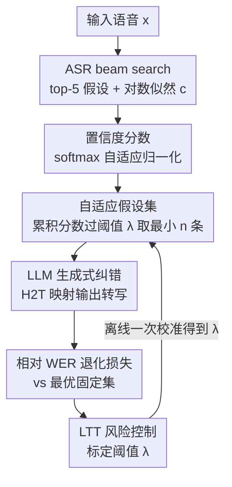

# Confident and Adaptive Generative Speech Recognition via Risk Control

**会议**: ICLR2026  
**OpenReview**: [https://openreview.net/forum?id=ck5T7QeiDh](https://openreview.net/forum?id=ck5T7QeiDh)  
**代码**: https://github.com/amitdamritau/adaptive-ger  
**领域**: 语音识别 / 不确定性量化  
**关键词**: 生成式纠错, 风险控制, Learn then Test, 自适应假设集, ASR

## 一句话总结
针对"用 LLM 对 ASR 的 N-best 假设做生成式纠错（GER）"中固定 N 既浪费算力又可能引入噪声的问题，本文用 ASR 置信度分数自适应地为每条语音决定假设个数，并用 Learn then Test（LTT）风险控制框架给出"相对最优性能退化"的高概率上界，在三个数据集上把平均假设数最多砍掉 52% 的同时保持甚至提升纠错效果。

## 研究背景与动机
**领域现状**：现代 ASR（Whisper、Wav2Vec）在干净语音上已很强，但口音、噪声、同音词、领域漂移仍会让转写出错。近年的主流补救手段是生成式纠错（GER）：让 ASR 用 beam search 产出 top-N 候选转写（N-best 假设），再把这一整组假设喂给一个微调过的 LLM，让它综合所有候选"合成"出一条更好的转写——这就是 HyPoradise 形式化的 hypotheses-to-transcription（H2T）任务。

**现有痛点**：所有这些 GER 方法都用一个**固定**的假设集大小 N（通常 N=5），不管这条语音是清晰好认还是带口音的噪声段都一视同仁。论文用 TedLium-3 画出的曲线显示，样本其实分三类：有的越多假设越好（单调改善），有的加假设不变（性能平台），还有的**top-1 就对、多给假设反而把对的带歪**（性能退化）。固定 N 对前两类是浪费算力，对第三类则是主动引入低质量候选去污染 LLM。

**核心矛盾**：GER 的"信息量"和"噪声"之间存在 trade-off——更多假设带来更多上下文，但也带来更多错误候选，而最优个数是**逐样本变化**的。更要命的是，现有方法对纠错后的效果**没有任何统计保证**，无法回答"我离 oracle（每条都用最优个数）还差多远"。

**本文目标**：把"为每条语音选多少假设"变成一个可自适应、且**带高概率性能保证**的决策问题，既省算力又不掉点。

**切入角度**：作者注意到 ASR 自己输出的对数似然分数本身就携带"这条语音好不好认"的信息——分数高度集中说明候选难分、需要更多上下文；分数差距大说明 top-1 很自信、不必再加。于是用一条基于分数的阈值规则来决定假设个数，再借统计学的**风险控制**给这条规则上保险。

**核心 idea**：用"对累积置信度分数的阈值"替代固定 N 来动态构造假设集，并用 Learn then Test 校准这个阈值，使"相对于最优固定集的 WER 退化"的期望被控制在用户指定水平 $\alpha$ 之下（置信度 $1-\delta$）。

## 方法详解

### 整体框架
方法不改动已有的 H2T/GER 模型，而是在它**前面**插一个"假设集裁剪器"，把原本固定喂 5 条假设改成动态喂 $n$ 条。整条流水线是：ASR 用 beam search 出 top-5 候选并给出每条的对数似然 → 把似然归一化成一组置信度分数 $s$ → 按累积分数过阈值 $\lambda$ 的规则取最小的 $n$ 条假设构成自适应集 $\Gamma_\lambda$ → 喂给微调好的 LLaMA 做生成式纠错。其中唯一需要"学"的就是阈值 $\lambda$，它通过 LTT 在校准集上离线标定一次，标定目标是控制纠错结果相对"该模型在固定集下能达到的最好成绩"的退化幅度。

### 关键设计

**1. 自适应假设集：用累积置信度阈值替代固定 N**

针对"固定 N 对简单样本浪费、对难样本引噪"的痛点，本文不再取定 top-N，而是用一个阈值参数 $\lambda$ 定义假设集 $\Gamma_\lambda(H_N)=\{(\hat y_1,c_1),\dots,(\hat y_n,c_n)\}$，其中集合大小 $n$ 取**满足累积分数达到阈值的最小个数**：

$$n=\min\Big\{\,j:\ \sum_{i=1}^{j} s_i \ge \lambda\,\Big\}$$

$s=(s_1,\dots,s_N)$ 是从 ASR 对数似然归一化来的置信度分数（已按降序排）。直觉是：当 top-1、top-2 就累积了足够置信度（分数集中在前几条）时，$n$ 很小，省下后面的低质量候选；当分数被摊平、前几条都不够自信时，$n$ 自动变大，把更多上下文交给 LLM。$\lambda$ 越大越保守（倾向取更多假设），$\lambda$ 越小越激进。这个裁剪器对底层 H2T 模型完全透明，可即插到任何预训练 GER 模型上。

**2. 相对 WER 退化损失：把"控什么"定义对**

如果直接控制绝对 WER，阈值会强烈依赖数据集难度（TedLium 和 CHiME 的可达 WER 天差地别），缺乏可移植性。本文转而控制**每个样本相对其自身最优固定集成绩的退化**：

$$\ell(\Gamma_\lambda(H_N),y)=\mathrm{WER}\big(M_{H2T}(\Gamma_\lambda(H_N)),y\big)-\min_{j\in[N]}\mathrm{WER}\big(M_{H2T}(H_j),y\big)$$

即"我自适应选出来的集合的 WER"减去"这条样本在 $H_1,\dots,H_N$ 里能达到的最好 WER"。这样损失天然以 0 为参照、对所有数据集同尺度，且**最坏情况下取满 5 条就退化为标准固定-N baseline**，保证不会比现有方法更差。这条损失大体单调（集合越大通常不更糟），但约 20% 样本会违反单调（即小集合反而更好）——而这恰恰是自适应方法能省算力的机会所在，所以作者刻意没把单调性当约束。

**3. LTT 风险控制：给阈值一个高概率保证**

由于损失非单调，传统的 Conformal Risk Control（CRC，要求损失有界且单调）失效。本文改用 Learn then Test（LTT），它把风险控制重写成**多重假设检验**：在离散参数网格 $\Lambda=\{\lambda_1,\dots,\lambda_k\}$ 上，每个 $\lambda_j$ 对应零假设 $H_j: R(\lambda_j)>\alpha$（$R$ 是期望风险），用校准集上的经验风险 $\hat R_m(\lambda_j)$ 经 Hoeffding–Bentkus 不等式算出有效 $p$ 值；为控制族错误率（FWER），采用固定序列检验（FST）——把 $\lambda$ 从最保守往最激进排序，逐个检验、一旦不能拒绝就停在上一个。最终得到的 $\hat\lambda$ 满足高概率保证：

$$P\big(\mathbb{E}[\ell(\Gamma_{\hat\lambda}(H_N),Y)]\le\alpha\big)\ge 1-\delta$$

也就是说，用户给定可容忍的退化上限 $\alpha$ 和失败概率 $\delta$，方法就能在有限校准样本下给出满足该约束的阈值。这是 GER 领域**首次**引入风险控制、拿到分布无关的统计保证。为保证损失有界（LTT 前提），把损失裁剪在 $B=1.25$（验证集上仅不到 0.1% 样本超过此值，偏差可忽略）。

**4. 置信度分数定义：对数据集自适应、且分数无关**

裁剪规则依赖的分数不是裸似然，而是一个复合分数：

$$s=\mathrm{softmax}\Big(\frac{\phi_\gamma(c)}{\tau}\Big)$$

$\phi_\gamma$ 是一个由单参数 $\gamma$ 控制、在两种变换模式间插值的自适应归一化函数，$\tau$ 是温度，二者按数据集语音质量在验证集上选定；同时对 ASR 产生的重复假设施加惩罚以防冗余。作者强调方法**对分数选择不敏感**（score-agnostic）：似然并不总是可靠置信度，任何能给 top-k 假设输出置信度的标定方法（如 canonical calibration）都能无缝接入，本文只是为简单起见用了最常见的似然值。此外还讨论了用 Pareto-Testing 把 $\gamma,\tau,\lambda$ 三参数联合优化的扩展，可免去逐数据集预设参数。

### 损失函数 / 训练策略
LLM 端用 LoRA 微调 LLaMA-2-7B 做 H2T 映射，训练时**固定喂 5 条**假设、用标准 next-token 预测学纠错；推理时才切换到变长自适应集。值得注意的是：整套自适应+风险控制**不需要重训 LLM**，只需在校准集上跑一次 LTT 标定 $\lambda$，因此能直接套到现有 GER 系统上。

## 实验关键数据

### 主实验
三个不同难度的 HyPoradise 数据集，N=5，LLM 为 LoRA 微调的 LLaMA-2-7B；baseline 为 Whisper top-1，$O_{llm}$ 为"每条都给最优个数"的 post-LLM oracle 下界。WER 列下标是相对 vanilla GER 的相对变化，Set Size 列下标是相对固定 N=5 的尺寸缩减。

| 数据集 | Baseline(top-1) | 固定-5 GER | 本文 WER | 平均集合大小 | $\alpha$/$\delta$ | 成功率 |
|--------|------|------|------|------|------|------|
| TedLium-3 | 9.3 | 7.53 | **7.52**（−0.13%） | **2.48**（−50%） | 2.3% / 0.10 | 0.94 |
| CHiME-4 | 11.49 | 6.24 | 6.37（+2.06%） | **3.866**（−23%） | 2.7% / 0.25 | 0.98 |
| CommonVoice | 12.44 | 8.32 | 8.51（+2.28%） | **3.29**（−34%） | 1.9% / 0.10 | 0.92 |

要点：TedLium-3 上**砍掉约一半假设的同时 WER 还略降**；CHiME-4 和 CommonVoice 以 2% 出头的相对 WER 微增换来 23%/34% 的算力节省。摘要给出的最高节省达 52%。所有数据集的经验成功率都稳定高于理论下限 $1-\delta$，证实高概率界在实践中成立（这是先前方法所没有的性质）。

### 消融实验

| 配置 | 结论 |
|------|------|
| 替代问题形式（绝对 WER / 覆盖目标 / bounded-WER 保证） | 均劣于本文的相对退化损失；绝对目标缺乏逐样本优化，bounded-WER 与最终 LLM 质量相关性差 |
| 训练集大小 6×5 矩阵（train 1-5 / dynamic × test 1-5） | 固定-5 训练在所有测试配置上平均 WER 最优，确立"相对最优固定集"这一比较基准的合理性 |
| 更大模型 / 零样本（LLaMA-2-13B 微调、GPT-3.5-turbo 提示） | 性能-效率 trade-off 一致保持，证明跨模型规模与部署场景的普适性 |
| 跨域（语音翻译 GenTranslate） | 成功迁移，省算力的同时保持翻译质量 |
| CRC 实现对比 | CRC 因约 20% 单调性违反**无理论保证**，但经验性能与 LTT 相近——说明两者利用同一套自适应模式，LTT 的额外价值是严格的统计验证 |

### 关键发现
- **分数分布直接决定最优集合大小**：Case 分析（Table 2）显示，分数高度可区分（如 −0.21 vs −0.31）时 top-1 就够、多给假设会把 WER 从 0% 拉到 21%；分数挤在一起（−0.42～−0.51）时需要全集才在第 5 条命中正确词（"gastroliths"）；还有性能平台型样本，自适应识别后用更少假设拿到相同 WER。
- **非单调既是机会也是代价**：约 20% 的非单调样本正是省算力的来源，但 FST"碰到第一个失败就停"可能因局部非单调早停、选出比必要更大的集合——这不破坏理论保证，只是少省点算力；Pareto-Testing 扩展通过把假设排成近单调序列来缓解。
- **保证与经验的差距**来自 Hoeffding–Bentkus 有限样本界的保守性，校准数据越多差距越小。

## 亮点与洞察
- **把"选几条假设"问题转成可统计保证的风险控制**，是这篇最"啊哈"的地方：以往自适应推理大多是启发式的，这里第一次给 GER 的算力分配上了分布无关、有限样本的高概率界。
- **相对退化损失的设计很巧**：用每条样本"自己能达到的最好成绩"做参照，既消除了跨数据集难度差异，又自带"最坏退化为固定-N baseline"的安全网，让方法不可能比现有方法更糟。
- **零重训、即插即用**：只需一次离线校准就能挂到任何已有 H2T 模型上，部署成本极低，这条思路（用模型自带的置信度信号 + 风险控制做自适应计算分配）可迁移到 reasoning/agent 等"按需分配算力"的场景。
- 方法**对置信度分数来源不敏感**，似然不可靠时可换更好的标定分数，留足了工程余地。

## 局限与展望
- **依赖校准集**：需要一份与测试同分布的带标注校准数据来标定 $\lambda$（及 $\gamma,\tau$），分布漂移时保证可能失效；作者也承认非常低的 $\alpha$ 往往不可行（连最保守的全集都有不可消除的退化）。
- **效率受非单调拖累**：FST 早停会让实际节省低于理论上限，虽有 Pareto-Testing 缓解但增加复杂度。
- **参数需逐数据集预设**：主方法的 $\gamma,\tau$ 仍要按数据集语音质量手工选，联合优化只在附录扩展里探索。
- **N 上限固定为 5**：beam search 只取 top-5，更大候选池下的行为未充分验证；且所有保证都是"相对该固定上限"的，并非绝对最优。

## 相关工作与启发
- **vs 传统 LM rescoring**：rescoring 只在已有 N-best 里重排选一条，本文沿用 GER 路线让 LLM 合成新转写，且在其上加了自适应选择与风险控制。
- **vs 固定-N 的 GER（HyPoradise / RobustGER）**：它们对所有输入用同一 N、无任何性能保证；本文逐样本动态定 N，并首次给出高概率 WER 退化界，平均假设数大幅下降。
- **vs CRC（Conformal Risk Control）**：CRC 要求损失单调有界，在本任务约 20% 非单调样本上无保证；本文改用 LTT，通过多重检验处理非单调，拿到无单调性假设的有限样本界。
- **vs 传统不确定性量化（ensemble / MC dropout / 校准）**：这些方法多缺乏理论保证、跨声学条件泛化差；本文的风险控制提供分布无关的原则化保证。

## 评分
- 新颖性: ⭐⭐⭐⭐⭐ 首次把 LTT 风险控制引入 GER，把"选几条假设"做成有统计保证的自适应决策。
- 实验充分度: ⭐⭐⭐⭐ 三数据集 + 多模型/零样本/跨域/CRC 对比 + 30 次重采样，案例分析到位；但 N 仅到 5、参数需逐集预设。
- 写作质量: ⭐⭐⭐⭐ 动机的三类样本图与 Case 分析很清晰，理论部分需要一定背景。
- 价值: ⭐⭐⭐⭐ 零重训即插即用、最多省 52% 算力且有保证，对 ASR 纠错的实际部署有直接价值。

<!-- RELATED:START -->

## 相关论文

- [\[ICLR 2026\] Automatic Stage Lighting Control: Is it a Rule-Driven Process or Generative Task?](automatic_stage_lighting_control_is_it_a_rule-driven_process_or_generative_task.md)
- [\[ICLR 2026\] SpeechOp: Inference-Time Task Composition for Generative Speech Processing](speechop_inference-time_task_composition_for_generative_speech_processing.md)
- [\[NeurIPS 2025\] Enabling Differentially Private Federated Learning for Speech Recognition: Benchmarks, Adaptive Optimizers and Gradient Clipping](../../NeurIPS2025/audio_speech/enabling_differentially_private_federated_learning_for_speech_recognition_benchm.md)
- [\[ICLR 2026\] Discovering and Steering Interpretable Concepts in Large Generative Music Models](discovering_and_steering_interpretable_concepts_in_large_generative_music_models.md)
- [\[ICLR 2026\] MambaVoiceCloning: Efficient and Expressive Text-to-Speech via State-Space Modeling and Diffusion Control](mambavoicecloning_efficient_and_expressive_text-to-speech_via_state-space_modeli.md)

<!-- RELATED:END -->
