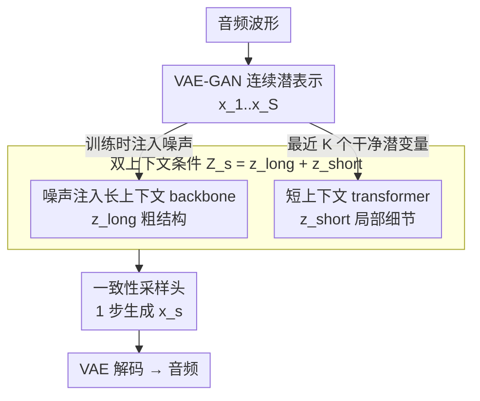

# Continuous Audio Language Models

**会议**: ICLR2026  
**OpenReview**: [https://openreview.net/forum?id=MFrJ3NzA5H](https://openreview.net/forum?id=MFrJ3NzA5H)  
**代码**: https://github.com/kyutai-labs/pocket-tts （Pocket TTS）  
**领域**: 音频语音生成 / 自回归连续建模  
**关键词**: 连续音频语言模型, 一致性模型, VAE, 自回归生成, 语音合成

## 一句话总结
作者提出 CALM（Continuous Audio Language Models），让自回归 Transformer 直接在 VAE 的连续潜空间里逐帧预测音频，用"一致性模型采样头"替代扩散头实现单步生成，从而绕开离散 RVQ token 在音质与算力之间的硬权衡，在语音和音乐上同时拿到更高保真度和更快推理，并据此放出可在笔记本 CPU 上超实时运行的 100M 参数 TTS 模型 Pocket TTS。

## 研究背景与动机
**领域现状**：当下主流的音频生成范式是"音频语言模型"（ALM）——把音频用神经编解码器（如 SoundStream、Mimi）压成离散 token 序列，再像建模文本一样用自回归 Transformer 去预测。为了控制序列长度，编解码器通常用残差矢量量化（RVQ），把每一帧音频压成一个由粗到细的 token 层级 $\{q_{s,k}\}$，$s$ 是时间、$k$ 是码本深度。

**现有痛点**：文本 token 是可逆的，但音频 token 来自有损编解码器、码率有限。想提升音质就得增加码率，也就是加深 RVQ 层级、生成更多 token。可同一帧内不同深度的 token 之间有强依赖，无法完全并行生成，于是音质一上去算力就线性甚至平方级地涨。现有的缓解手段——延迟模式（delay pattern）、RQ-Transformer 深度自回归头——能省一点，但"量化引入的质量-算力权衡"这个根本约束还在，尤其难以在边缘设备上做高质量音频。

**核心矛盾**：有损量化是病根。只要还在离散 token 上建模，高保真就必然要更深的码本、更大的 token 矩阵、更重的采样头。

**本文目标**：彻底绕开量化——直接在连续潜空间里做自回归建模，既要保证音质和稳定性（连续自回归容易误差累积、采样慢），又要把采样头做到足够快、足够轻。

**切入角度**：视觉领域的 GIVT / MAR 已经证明可以自回归地建模 VAE 连续潜变量：用大 Transformer backbone 预测一个中间潜变量 $z_s$，再用一个小 MLP（扩散头）建模 $p(x_s \mid z_s)$。但直接搬到音频会失败——音乐生成会很快发散、采样还慢。作者从这个失败点出发，逐个补齐缺口。

**核心 idea**：用 VAE 连续潜空间替代 RVQ 离散 token，并把扩散采样头换成"一致性模型"做单步生成——在更低算力下拿到比离散模型更高的音质。

## 方法详解

### 整体框架
CALM 要解决的是"如何在连续潜空间里又稳又快地做音频自回归"。整条管线是：原始波形先经 VAE-GAN 编码成连续潜序列 $(x_1,\dots,x_S)$，$x_s\in\mathbb{R}^C$；自回归阶段，一个因果 backbone Transformer 看历史潜变量产出粗粒度的长程上下文 $z_s^{\text{long}}$，一个轻量短上下文 Transformer 看最近若干个"干净"潜变量产出细粒度的 $z_s^{\text{short}}$，二者相加得到条件 $Z_s$；最后一个小 MLP 一致性采样头以 $Z_s$ 为条件、单步从噪声生成下一帧潜变量 $\hat x_s$，再经 VAE 解码回波形。

关键在于训练时对 backbone 的输入历史注入噪声（逼它聚焦粗结构、抗误差累积），而短上下文走的是未加噪的干净潜变量（补回被噪声抹掉的局部细节）——这一"脏长程 + 干净短程"的分工是音乐能稳定生成的核心。此外还有几个工程化创新：Head Batch Multiplier 摊薄训练开销、Gaussian 温度采样换取保真度、Latent CFG 与潜空间蒸馏支撑条件生成与轻量化部署。

### 关键设计

**1. VAE-GAN 连续潜表示：用连续 latent 替代 RVQ 离散 token**

这一步直击"有损量化是病根"的痛点。作者放弃常用的 RVQ-GAN，改用 VAE-GAN 框架：把残差量化瓶颈换成 VAE 瓶颈，用 KL 正则把潜空间约束成高斯先验。VAE 比矢量量化更好训——不会有码本坍塌、不用平衡量化损失、也没有量化训练不稳定的问题，而且在相同潜维度下重建保真度更高。架构上沿用 Mimi 的全因果设计（编码器/解码器里在卷积之外加 Transformer），语音 VAE 还像 Mimi 一样用 WavLM 做语义蒸馏，但不同于 Mimi 只蒸馏第一码本，这里把蒸馏损失扩展到整个潜表示。总损失把时域/频域重建、对抗、特征匹配、KL 正则和语义蒸馏揉在一起：
$$L_{\text{VAE}} = \lambda_t L_t + \lambda_f L_f + \lambda_{\text{adv}} L_{\text{adv}} + \lambda_{\text{feat}} L_{\text{feat}} + \lambda_{\text{KL}} L_{\text{KL}} + \lambda_{\text{distill}} L_{\text{distill}}$$
实测一个 32 维的 VAE 在 MOSNet 音质上与 8-RVQ 的 Mimi 持平，在语义可分性 ABX、PESQ、STOI 上更优——说明把离散瓶颈换成连续瓶颈并没有牺牲表示质量，反而为下游连续建模铺平了道路。

**2. 噪声注入长上下文 backbone + 短上下文 transformer：兼顾粗结构稳定与局部细节**

直接套 MAR 在音乐上会迅速发散，原因是连续自回归对误差累积不鲁棒——一旦某帧预测略有偏差，误差会沿时间放大。作者用两条互补的上下文路解决。长上下文路在训练时对历史输入注入噪声：对每个 $s$ 采样 $k_s\sim U(0,1)$、$\epsilon_s\sim\mathcal N(0,I)$，构造保方差的加噪输入 $\tilde x_s = \sqrt{k_s}\,\epsilon_s + \sqrt{1-k_s}\,x_s$，于是 $z_s^{\text{long}} = T_{\text{long}}(\tilde x_1,\dots,\tilde x_{s-1})$（推理时不加噪）。加噪逼着 backbone 去抓粗结构、对历史扰动更鲁棒，但副作用是它会丢失细粒度信息——单靠它音乐只能保住节奏、十几秒后渐渐归于沉默。

于是补一条短上下文路：一个轻量因果 Transformer 只看最近 $K$ 个**未加噪**的干净潜变量（音乐用 $K=10$，约 0.4 秒），$z_s^{\text{short}} = T_{\text{short}}(x_{s-K},\dots,x_{s-1})$，把噪声注入抹掉的局部高分辨细节补回来。两路相加 $Z_s = z_s^{\text{long}} + z_s^{\text{short}}$ 作为采样头条件。消融显示：只加噪不够、只看短上下文也不够，二者合起来才是高质量音乐生成的关键。$K$ 本身不是敏感超参，但短上下文模块的"有无"是决定性的。

**3. 一致性采样头 + Gaussian 温度采样：单步生成 + 可控多样性**

MAR 的扩散头每帧要几百步去噪，采样太慢。作者把扩散头换成连续时间一致性模型（Lu & Song, 2025 的 TrigFlow 形式）：用 $T=\tfrac\pi2$、$\alpha_t=\cos t$、$\sigma_t=\sin t$，噪声轨迹 $x_t^s=\cos(t)\,x_s+\sin(t)\,\epsilon$，整段序列的一致性损失为
$$L_{\text{CALM}} = \sum_{s=1}^{S}\mathbb E_{t,\epsilon}\Big[e^{w_\psi(t)}\big\|F_\phi(x_t^s,t,Z_s)-F_{\bar\phi}(x_t^s,t,Z_s)-\cos(t)\tfrac{df_{\bar\phi}}{dt}\big\|_2^2 - w_\psi(t)\Big]$$
backbone、短上下文 Transformer、一致性 MLP 与自适应权重 $w_\psi$ 联合训练，地位正好对应离散范式里 backbone + RQ-Transformer 用交叉熵联合训练。推理时单步即可：取 $t=1$、$\epsilon\sim\mathcal N(0,I)$，$\hat x_s = f_\phi(x_1^s=\epsilon,\,t=1,\,Z_s)$。相比 RQ-Transformer 头，采样头提速音乐约 ×20、语音约 ×12。

但一致性模型缺少离散范式里"温度采样"那样的多样性-保真度旋钮，而温度对语音质量很关键。作者给出一个启发式：类比 BigGAN 的截断技巧，不去截断高斯而是直接**缩小高斯噪声的方差**——把标准差设为 $\sqrt\tau$ 在数学上等价于施加温度 $\tau$，这让连续与离散范式的温度数值大致可比。语音续写用 $\tau=0.8$ 效果最好，质量和语义性都明显改善。

**4. Head Batch Multiplier：摊薄 backbone 计算、加速训练收敛**

训练的真正瓶颈是用大因果 Transformer 生成条件 $z_s^{\text{long}}$。作者的观察是：一旦 $z_s^{\text{long}}$ 算出来，它对同一帧的多个噪声样本是复用的。于是每个训练步把 $z_s^{\text{long}}$ 只算一次，却用它做 $N$ 次损失计算，每次独立采不同的噪声水平 $t$ 和 $\epsilon$。这等于在几乎不加 backbone 开销的前提下，把采样头的有效 batch 放大 $N$ 倍——既提效率，又因为对多噪声样本平均损失而稳定了训练。消融与收敛曲线都显示在相当训练成本下收敛更快、终点更好。

**5. Latent CFG 与潜空间蒸馏：条件生成增强 + Pocket TTS 轻量化**

无分类器引导（CFG）能提升条件生成质量，但它依赖在采样轨迹上做引导——而单步一致性模型没有轨迹可引导。作者改为在**潜变量**上做 CFG（称 Latent CFG）：给定条件 $C$ 和系数 $\alpha$，对每个 $s$ 计算 $Z_s^{\text{CFG}} = Z_s^{\varnothing} + \alpha(Z_s^{C}-Z_s^{\varnothing})$，再用它作为一致性头的条件。这避免了在轨迹上引导的不可行性。

选定 $\alpha$ 后还有一招潜空间蒸馏来省推理开销：CFG 推理时要对有/无条件各跑一遍 backbone，batch 翻倍。作者把 CFG 引导后的教师潜表示 $Z_s^{\text{CFG}}$ 用 $\ell_2$ 损失蒸馏进一个学生 backbone，并直接把教师的 MLP 头原样拷给学生——学生只需单次前向就能复现 CFG 效果，推理 batch 减半；学生还可以更浅。Pocket TTS 正是这么来的：把 24 层教师 TTS 蒸馏成 6 层学生（$\alpha=1.5$），得到 100M 参数、能在笔记本 CPU 上超实时运行的开源 TTS。

### 损失函数 / 训练策略
- **VAE-GAN**：式 (2)，时域+频域重建、对抗、特征匹配、KL 正则、（语音）WavLM 语义蒸馏联合训练。
- **CALM 主体**：式 (3) 的连续时间一致性损失，backbone / 短上下文 Transformer / 一致性 MLP / 权重 $w_\psi$ 端到端联合优化；历史输入按 $\tilde x_s=\sqrt{k_s}\epsilon_s+\sqrt{1-k_s}x_s$ 加噪。
- **语音特化**：以预训练 2B 文本 LM（Helium-1）为 backbone，引入"内心独白"（inner monologue）文本流，并让文本流相对音频延迟 2 帧（160ms），解耦高层规划与低层合成。语音任务实测不需要短上下文与噪声注入，架构更简。
- **蒸馏**：Latent CFG 教师 → 学生 backbone（$\ell_2$ 对齐潜表示，复制 MLP 头）。

## 实验关键数据

### 主实验

语音续写（30 秒生成，对比 8-RVQ RQ-Transformer 头）：

| 模型 | 温度 | 采样头提速 | 整体提速 | 采样头耗时占比 | 声学质量(↑) | 意义性 Elo(↑) | 排名 |
|------|------|-----------|---------|----------|------|------|------|
| 参考真值 | – | – | – | – | 4.02 | 2180 | – |
| RQ-Transformer 8 RVQ | 0.8 | ×1.0 | ×1.0 | 26.7% | 2.75 | 1870 | 3 |
| CALM 一致性 1 步 | 1.0 | ×12.3 | ×1.3 | 2.9% | 2.82 | 1947 | 2 |
| CALM 一致性 1 步 | 0.8 | ×12.3 | ×1.3 | 2.9% | **3.45** | **2023** | **1** |

文本转语音（LibriSpeech test-clean）：

| 模型 | 参数量 | WER(↓) | 声学质量(↑) | 说话人相似 Elo(↑) |
|------|--------|--------|------|------|
| F5-TTS (NFE=32) | 336M | 2.42 | 54.7 | 2032 |
| DSM (16 RVQ, CFG=3) | 750M | 1.95 | 60.2 | 2112 |
| DiTAR (NFE=10) | 600M | 2.39 | – | – |
| CALM w/ LSD (NFE=1, CFG=1.5) | 313M | **1.81** | **61.1** | 1966 |

音乐续写（30 秒，对比 RQ-Transformer 32 RVQ 基线）：

| 模型 | 整体提速(↑) | 采样头提速(↑) | 采样头占比 | FAD(↓) | 享受度 Elo(↑) | 排名 |
|------|------|------|------|------|------|------|
| RQ-Transformer 32 RVQ（基线） | ×1.0 | ×1.0 | 57.7% | 1.06 | 1824 | 4 |
| MusicGen Medium | ×1.3 | – | 0.0% | 1.72 | 1761 | 6 |
| CALM 一致性 1 步 | **×2.2** | **×19.3** | 6.6% | 0.83 | 1857 | 2 |
| CALM 一致性 4 步 | ×1.9 | ×5.4 | 20.1% | 0.71 | 1847 | 3 |
| CALM TrigFlow 100 步 | ×0.3 | ×0.2 | 86.6% | **0.64** | **1921** | 1 |

### 消融实验

| 配置 | 现象 | 说明 |
|------|------|------|
| 仅噪声注入（无短上下文） | 音乐只保留节奏、十几秒后归于沉默 | 加噪抹掉细粒度信息，单用不够 |
| 噪声注入 + 短上下文 | 音质最佳 | 干净短程恢复局部细节，是高质量音乐的关键 |
| 无 Head Batch Multiplier | 收敛更慢、终点更差 | 多噪声样本平均损失稳定训练 |
| TrigFlow 头 vs 一致性头 | TrigFlow 音质略高但推理极慢（×0.3 整体） | 保真-速度权衡，实时场景选一致性 |

### 关键发现
- **短上下文 Transformer 贡献最大**：它的有无是音乐能否稳定长时生成的分水岭；而其窗口 $K$ 本身不敏感。
- **采样头是离散范式的算力黑洞**：RQ-Transformer 头在音乐基线里吃掉 57.7% 推理时间，换成一致性头后只占 6.6%，这才是整体提速的来源。
- **温度采样意外有效**：缩小高斯方差等价于施加温度，$\tau=0.8$ 让语音质量和意义性同时提升；CALM 在意义性上甚至超过有文本流引导的离散基线，作者推测是 backbone 把更多容量让给了文本预测。
- **说话人相似度偏低是 VAE 假象**：参考音频过一遍 VAE 后相似度就掉到 0.57，人评里所有方法都"超过"真值，说明声纹其实保留得很好。

## 亮点与洞察
- **把"扩散头"换成"一致性头"是四两拨千斤**：MAR 系方法慢在每帧几百步去噪，单步一致性直接把采样头从推理瓶颈（57.7%）打到边角料（6.6%），且音质不降反升——这是连续音频自回归能落地边缘设备的关键开关。
- **"脏长程 + 干净短程"的双上下文分工很巧**：用噪声注入逼 backbone 抓粗结构抗漂移，再用干净短上下文补细节，正好对冲噪声注入的副作用；这种"一个模块制造问题、另一个模块修复"的互补设计可迁移到任何易误差累积的连续自回归任务。
- **温度采样的连续化翻译**：把离散的温度采样翻译成"缩高斯方差"，并论证 $\sqrt\tau$ 等价性，让连续/离散范式的温度数值可比——一个简单却实用的工程桥。
- **Latent CFG + 潜空间蒸馏闭环**：CFG 不能用在单步轨迹上，就搬到潜变量上；蒸馏再把 CFG 的双前向折叠回单前向，直接产出可在 CPU 超实时跑的 Pocket TTS，从研究到部署一气呵成。

## 局限与展望
- **音乐 VAE 无语义蒸馏**：语音用 WavLM 蒸馏语义，音乐因"语义难定义"被留作未来工作，这可能限制音乐生成的可控性与长程结构。
- **TTS 说话人相似度偏低**：CALM w/ LSD 的 SIM 仅 0.52，虽部分归因于 VAE 重建（参考过 VAE 后只有 0.57），但客观指标上仍逊于离散基线，声纹克隆场景需谨慎。
- **跨任务数值不可直接比大小**：语音/音乐用不同 backbone（2B Helium / 1.35B MusicGen）、不同采样步数与温度，表格里的提速倍数与质量分受任务设置影响，不宜横向硬比。
- **TrigFlow 揭示的上限**：100 步 TrigFlow 头音质最好但慢到 ×0.3，说明单步一致性是在牺牲一点保真换速度；若不计实时约束，仍有质量提升空间。

## 相关工作与启发
- **vs RQ-Transformer / 离散 ALM（MusicGen、Moshi 等）**：它们在有损 RVQ token 上自回归，高保真要加深码本、采样头算力暴涨；CALM 在连续 VAE 潜空间一次出帧，质量-算力权衡更优。
- **vs MAR / GIVT（视觉连续自回归）**：CALM 沿用 MAR 的"backbone 出潜变量 + 小头建分布"骨架，但把扩散头换成一致性头（单步 vs 数百步），并加噪声注入与短上下文解决音频特有的误差累积。
- **vs SALAD / DiTAR（MAR 风格 TTS）**：它们把 MAR 扩散头用于小规模、领域特定的 TTS；CALM 把范式扩展到语音续写（无文本监督）与音乐这类更复杂的域，并验证局部短上下文的重要性（与 DiTAR 的 patch 观察相互印证）。
- **vs Shortcut / 少步扩散（Hang et al. 2025）**：shortcut 把扩散从 100 步压到 8 步；CALM 用一致性做到 1 步且质量比肩最优离散模型，是更激进的加速路线。

## 评分
- 新颖性: ⭐⭐⭐⭐⭐ 首次把连续 VAE 自回归 + 单步一致性头系统性地用到语音与音乐两域，并解决误差累积与采样速度两大拦路虎。
- 实验充分度: ⭐⭐⭐⭐ 覆盖语音续写/TTS/音乐续写四任务、含自动+人评+消融，但部分对比模型闭源、跨任务设置不一。
- 写作质量: ⭐⭐⭐⭐ 动机链与失败点交代清楚，六个创新条理分明；个别消融细节放在附录。
- 价值: ⭐⭐⭐⭐⭐ 直接产出可在 CPU 超实时运行的开源 Pocket TTS，对边缘端高质量音频生成有实打实的工程价值。

<!-- RELATED:START -->

## 相关论文

- [\[ICLR 2026\] JALMBench: Benchmarking Jailbreak Vulnerabilities in Audio Language Models](jalmbench_benchmarking_jailbreak_vulnerabilities_in_audio_language_models.md)
- [\[ICLR 2026\] Music Flamingo: Scaling Music Understanding in Audio Language Models](music_flamingo_scaling_music_understanding_in_audio_language_models.md)
- [\[ICLR 2026\] OWL: Geometry-Aware Spatial Reasoning for Audio Large Language Models](owl_geometry-aware_spatial_reasoning_for_audio_large_language_models.md)
- [\[ICLR 2026\] Measuring Audio's Impact on Correctness: Audio-Contribution-Aware Post-Training of Large Audio Language Models](measuring_audios_impact_on_correctness_audio-contribution-aware_post-training_of.md)
- [\[NeurIPS 2025\] Efficient Speech Language Modeling via Energy Distance in Continuous Latent Space](../../NeurIPS2025/audio_speech/efficient_speech_language_modeling_via_energy_distance_in_continuous_latent_spac.md)

<!-- RELATED:END -->
