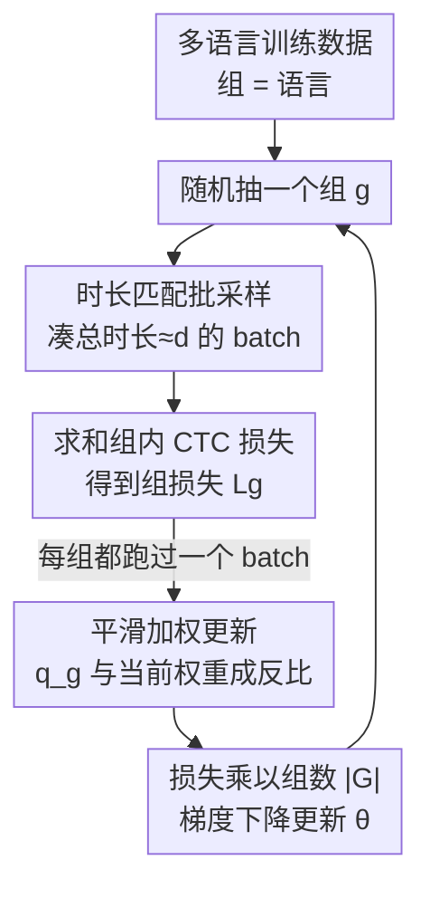

# CTC-DRO: Robust Optimization for Reducing Language Disparities in Speech Recognition

**会议**: ICLR 2026  
**OpenReview**: [https://openreview.net/forum?id=yt40xuRBA9](https://openreview.net/forum?id=yt40xuRBA9)  
**代码**: https://github.com/Bartelds/ctc-dro  
**领域**: 语音识别 / 分布鲁棒优化 / 多语言ASR  
**关键词**: 多语言ASR, CTC, group DRO, 最差组鲁棒性, 平滑加权

## 一句话总结
针对多语言语音识别中各语言性能差异巨大的问题，本文指出 group DRO 在 CTC 损失上失效（CTC 损失随音频长度和语言声学特性变化、组间不可比），提出 CTC-DRO——用「时长匹配批采样」抹平长度带来的损失差异、用「平滑加权更新」防止权重被某个高损失组垄断，在 ML-SUPERB 2.0 五个语言集上把最差语言错误率最多降低 47.1%、平均错误率最多降低 32.9%。

## 研究背景与动机

**领域现状**：多语言 ASR 模型（同时做语言识别 LID + 转写）在不同语言上的表现差距悬殊。当前主流做法是把自监督预训练编码器（XLS-R、MMS）用 CTC 目标微调，相比 Whisper 这类自回归模型推理更快、幻觉更少，被广泛采用。

**现有痛点**：要让最差语言也表现好，一个自然的工具是 group DRO——它在训练时给「高损失组」加更大权重，从而最小化最差组损失。但 group DRO 有个前提：**各组的训练损失必须可比**。在 ASR 里这个前提根本不成立。

**核心矛盾**：CTC 损失 $L_{CTC}=-\log P_{CTC}(Y\mid X)$ 是对所有合法对齐求边缘后取负对数，它**随输入序列长度 $D$ 增长**——序列越长，每条对齐路径是 $D$ 个逐帧概率连乘、值越小，求和后整体概率偏低、损失偏高。于是一个长音频即便错误更少，损失也可能比短音频更高。不同语言的音频时长分布差异巨大（如西班牙语长句多），加上语言声学/语言学特性带来的「不可约损失」差异，使得组间 CTC 损失**系统性不可比**。group DRO 会把权重持续堆给那个「损失最高」的组（哪怕它下游表现其实不差），权重 $q_{g'}$ 像滚雪球一样越滚越大，最终把其他组的权重几乎全抽干，导致其他语言被严重欠训练。

**本文目标**：在不显著增加计算成本的前提下，让 DRO 在 CTC 训练里真正起作用，降低最差语言错误率而不牺牲整体平均。

**切入角度**：问题出在两处——一是损失的「尺度」被音频长度污染，二是 group DRO 的指数加权机制对持续高损失组过度敏感。分别对症下药即可。

**核心 idea**：用「时长匹配批采样」对齐组间损失尺度，再用一个引入平滑系数 $\alpha$ 的广义 group DRO 更新规则，让权重更新与当前权重成反比，防止单个组垄断权重。

## 方法详解

### 整体框架

CTC-DRO 是对 group DRO 训练算法的两处改造，整体仍是「采样一个语言组 → 算这个组的损失 → 更新组权重 → 用加权损失更新模型」的 minimax 在线优化循环，只是把其中的「批采样方式」和「权重更新规则」换掉，且只为每个组维护一个标量权重，几乎零额外开销。

每一步训练：随机抽一个语言组 $g$，用**时长匹配采样器**凑一个总时长约等于固定值 $d$（约 50 秒）的 batch；对 batch 内每条样本算 CTC 损失并**求和**（而非取均值）作为该组损失；当每个组都至少处理过一个 batch 后，用**平滑加权更新**刷新所有组权重 $q_g$；最后把该组损失乘以组数 $|G|$ 再对模型参数 $\theta$ 做梯度下降。

### 关键设计

**1. 时长匹配批采样：抹平 CTC 损失里的长度偏差**

这一步针对「CTC 损失随音频长度变化、组间不可比」的痛点。作者实现了一个新的批采样器：每个 batch 只从单个随机选中的组 $g$ 取样本，并**迭代地往 batch 里加样本，直到总音频时长达到或略微超过设定的目标时长 $d$**。这样每个 batch 的「总时长」大致固定，组间不再因为某语言音频普遍更长就吃亏。

关键细节是损失的聚合方式：含较多短样本的 batch 每条样本 CTC 损失偏低，含较少长样本的 batch 偏高，因此作者**对 batch 内逐样本 CTC 损失求和**（算法第 10 行），用这个 sum 而非 group DRO 用的均值去更新组权重。若某组在一次更新前被多次采样，则把这几次的 summed loss 取平均，相当于变相增大了算权重用的有效 batch size。此外，做模型参数梯度下降前，把损失乘以组数 $|G|$（算法第 21 行），保证 CTC-DRO 的训练损失尺度与不用 DRO 时一致，从而学习率等共享超参不必单独重调。值得强调的是：作者在附录 G 中证明，单纯按 $D$ 或 $U$ 缩放 CTC 损失**不足以**解决组间不可比，所以时长匹配采样是必要而非可有可无的。

**2. 平滑加权更新：防止权重被持续高损失组垄断**

这一步针对「group DRO 把权重持续堆给最高损失组、最终抽干其他组」的痛点。原始 group DRO 的权重更新等价于 Hedge 算法对目标 $\max_q \sum_g q_g L_g$ 的优化，更新量 $\delta q_g \propto q_g \exp(\eta_q L_g)$——权重越大、损失越高，涨得越猛，正反馈失控。本文把更新规则改为引入平滑系数 $\alpha$：

$$q_g \leftarrow \frac{q_g\cdot \exp\!\big(\eta_q \frac{L_g}{q_g+\alpha}\big)}{\sum_{g\in G} q_g\cdot \exp\!\big(\eta_q \frac{L_g}{q_g+\alpha}\big)}$$

直觉上，指数里把 $L_g$ 除以了 $(q_g+\alpha)$：当一个组权重 $q_g$ 已经很大时，它的更新量反而被压小，从而抑制任何组的权重相对其损失变得过大，权重分布更均匀；同时当两个组损失相近、但权重不同时，**权重更低的那个组会得到更大的更新**，避免低权重组被欠训练。$\alpha$ 是连续旋钮：$\alpha\to 0$ 时更新对「当前权重」极敏感，趋向均匀分布；$\alpha\to\infty$ 时退化回原始 group DRO 更新，可见 CTC-DRO 是 group DRO 的严格广义化。

作者进一步证明这个更新并没有破坏 DRO「给高损失组更高权重」的本质：它实际优化的是广义目标 $\max_q \sum_g \log(q_g+\alpha)L_g$，对其取 Lagrangian 求解得到最优解满足 $q_g+\alpha \propto \frac{L_g}{\sum_{g'} L_{g'}}$，即最优权重仍随损失单调增大——只是增长被平滑了。这个平滑更新同时还缓解了转写长度 $U$ 带来的、靠归一化也解决不了的尺度问题。

### 损失函数 / 训练策略
模型在 XLS-R / MMS 自监督编码器上加两层 Transformer + softmax，用 CTC 联合预测语言 token 和字符序列（不设单独 LID 头）。训练 40 个 epoch、保留 dev 损失最低的 checkpoint、跨 16 个 batch 累积梯度、batch 时长设为约 50 秒以适配 A6000 显存。DRO 专属超参在 dev 集上调：$\eta_q\in\{10^{-3},10^{-4}\}$，$\alpha\in\{0.1,0.5,1\}$。

## 实验关键数据

数据集为 ML-SUPERB 2.0（141 种语言、15 个语料库）。主实验随机选 5 个语言集，每集 6 个「语言-语料」对（各 1 小时训练数据，覆盖 CER 高/中/低分位），并对前两集额外测试不平衡（更多数据）设置。指标为最差语言 CER（主指标，越低越好）、平均 CER、LID 准确率。

### 主实验（平衡数据，节选 Table 1）

| 集 | 模型 | 方法 | 最差语言 CER | 平均 CER | LID |
|----|------|------|------|------|-----|
| 5 | XLS-R | Base | 114.8 (JPN) | 29.9 | 89.0 |
| 5 | XLS-R | GDRO | 92.9 (JPN) | 36.8 | 57.7 |
| 5 | XLS-R | **CTC-DRO** | **71.5 (JPN)** | **23.8** | **91.0** |
| 5 | MMS | Base | 90.0 (JPN) | 26.0 | 96.3 |
| 5 | MMS | **CTC-DRO** | **57.5 (JPN)** | **24.3** | 90.5 |
| 2 | XLS-R | Base | 68.8 (YUE) | 19.0 | 94.2 |
| 2 | XLS-R | **CTC-DRO** | **45.0 (YUE)** | **15.8** | 89.3 |

最大提升出现在不平衡设置下 set 2 的 XLS-R：最差语言 CER 相对 baseline 降低 **47.1%**；CTC-DRO 在 14 个设置（7 集 × 2 模型）中有 13 个取得最优平均 CER，最多相对降低 **32.9%**。反观 group DRO，在 14 个设置里有 7 个把最差语言 CER 弄得**更差**（set 2 MMS 不平衡设置下反而恶化 57.5%），且在所有设置都抬高了平均 CER，印证了原始 group DRO 在此场景的失效。

### 消融实验（Table 3，set 5）

| 配置 | 最差语言 CER (XLS-R) | 平均 CER | 说明 |
|------|------|------|------|
| Base | 114.8 | 29.9 | 基线 |
| **CTC-DRO (Full)** | **71.5** | **23.8** | 完整模型 |
| − Dur（去时长匹配） | 115.2 | 50.6 | 长度偏差未抹平，几乎退回基线 |
| − Smooth（去平滑更新） | 194.2 | 61.4 | 权重失控，崩到比基线还差 |

### 关键发现
- **两个组件缺一不可，且平滑更新贡献更大**：去掉任一组件，最差语言 CER 最多上升 171.6%、平均 CER 最多上升 302.9%；去掉平滑更新（−Smooth）的崩坏最严重（XLS-R 最差 CER 飙到 194.2），说明它是核心。注意 −Smooth 仍保留 group DRO 的权重更新，所以不等于回到 baseline。
- **权重轨迹更稳**：训练中 group DRO 的组权重剧烈震荡、长期被单一语言垄断（其他组权重逼近 0），而 CTC-DRO 的权重在各语言间分布更均匀、波动更小，最差语言日语的权重始终稳居前二。
- **可扩展到更多组**：把组数扩到 18 种语言后，CTC-DRO 仍有效，平衡设置下最差语言 CER 相对 baseline 降低 8.9%（MMS）/9.2%（XLS-R），不平衡下 XLS-R 最多降 23.7%。
- **稳定性**：在提升最小的 set 1、set 3 上用 4 个随机种子复测，最大的最差语言增益跨种子稳定。

## 亮点与洞察
- **把「损失不可比」这件事讲透并对症下药**：作者没有泛泛地说 group DRO 不好，而是精确定位到 CTC 损失随长度缩放 + 不可约损失差异这两个根因，再分别用采样和加权两个独立机制各打一个，逻辑闭环很漂亮。
- **平滑更新是 group DRO 的连续广义化**：一个 $\alpha$ 旋钮，$\alpha\to\infty$ 退回原版、$\alpha\to 0$ 趋向均匀，且理论上证明最优解仍 $q_g+\alpha\propto L_g/\sum L$，既保留 DRO 精神又消除其失控，设计很有数学品味。
- **近乎零成本**：只额外维护每组一个标量权重，乘 $|G|$ 的尺度对齐还让学习率等超参无需重调，工程落地友好。
- **可迁移**：凡是「组间训练损失天然不可比」的场景（如医学影像不同模态/设备），这套思路都可能适用。

## 局限与展望
- 实验聚焦相对小规模训练数据（每语言 1–9 小时），虽然作者引用前人说性能差距在大数据下依然存在，但 CTC-DRO 在大规模工业级数据上的增益未直接验证。
- 方法绑定 CTC 目标；对自回归（Whisper 式）模型是否需要、如何适配未讨论。
- 多了一个超参 $\alpha$（外加 $\eta_q$、目标时长 $d$）需要在 dev 集上调，组数很多或语言极不平衡时的调参成本可能上升。
- 评测以 CER 为主、语言集靠随机抽样构造，结论在特定语言组合上的泛化性仍受抽样影响（虽已用多种子缓解）。

## 相关工作与启发
- **vs group DRO（Sagawa et al. 2020）**：group DRO 假设组间损失可比、用 $\exp(\eta_q L_g)$ 指数加权；本文指出该假设在 CTC 上失效，并把更新改为除以 $(q_g+\alpha)$ 的平滑形式 + 时长匹配采样，是对它的严格广义化与修正。
- **vs 损失校准 / 用简单代理模型估组难度（Oren et al. 2019；Słowik & Bottou 2022）**：这些方案要么大幅增加计算、要么需要一个可靠的「组难度」代理模型——而语音领域缺乏这样的模型，CTC-DRO 绕开了对组难度估计的依赖。
- **vs 简单按 $D$/$U$ 缩放 CTC 损失**：作者在附录 G 证明单纯逐样本归一化不足以解决组间不可比，凸显时长匹配采样的必要性。

## 评分
- 新颖性: ⭐⭐⭐⭐ 把 group DRO 与 CTC 不兼容的根因讲清并给出有理论支撑的广义化更新，切口精准。
- 实验充分度: ⭐⭐⭐⭐ 五语言集 × 两模型 × 平衡/不平衡 + 消融 + 权重轨迹 + 扩展到 18 语言 + 多种子，相当扎实。
- 写作质量: ⭐⭐⭐⭐⭐ 从问题诊断到方法到证明层层递进，动机和推导都很清楚。
- 价值: ⭐⭐⭐⭐ 低成本、可落地，且对其他「损失不可比」领域有迁移潜力。

<!-- RELATED:START -->

## 相关论文

- [\[ICLR 2026\] Pay Attention to CTC: Fast and Robust Pseudo-Labelling for Unified Speech Recognition](pay_attention_to_ctc_fast_and_robust_pseudo-labelling_for_unified_speech_recogni.md)
- [\[ICLR 2026\] StableToken: A Noise-Robust Semantic Speech Tokenizer for Resilient SpeechLLMs](stabletoken_a_noise-robust_semantic_speech_tokenizer_for_resilient_speechllms.md)
- [\[ICLR 2026\] AVERE: Improving Audiovisual Emotion Reasoning with Preference Optimization](avere_improving_audiovisual_emotion_reasoning_with_preference_optimization.md)
- [\[ICLR 2026\] Learnable Fractional Superlets with a Spectro-Temporal Emotion Encoder for Speech Emotion Recognition](learnable_fractional_superlets_with_a_spectro-temporal_emotion_encoder_for_speec.md)
- [\[ICLR 2026\] SupCLAP: Controlling Optimization Trajectory Drift in Audio-Text Contrastive Learning with Support Vector Regularization](supclap_controlling_optimization_trajectory_drift_in_audio-text_contrastive_lear.md)

<!-- RELATED:END -->
