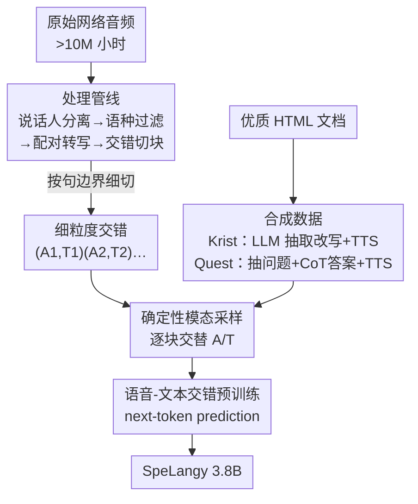

# Data-Centric Lessons To Improve Speech-Language Pretraining

**会议**: ICLR 2026  
**OpenReview**: [https://openreview.net/forum?id=4amNkYCDqX](https://openreview.net/forum?id=4amNkYCDqX)  
**代码**: 无  
**领域**: 语音语言模型 / 多模态预训练  
**关键词**: 语音问答, 数据工程, 语音-文本交错, 合成数据, 模态对齐

## 一句话总结
这篇论文把语言/视觉领域成熟的「数据为中心」方法论系统地搬到语音-语言预训练上，通过受控消融回答「怎么切原始音频、怎么造合成数据、怎么交错采样」三个问题，并把这些结论蒸馏进一个 3.8B 的 SpeechLM（SpeLangy），用更小的体量在口语问答（SQA）上反超 3 倍大的模型 10.2%。

## 研究背景与动机

**领域现状**：口语问答（Spoken Question-Answering, SQA）是语音助手的核心能力，主流做法是「语音编码器 + 连接器 + LLM」，再用语音-文本交错预训练（在交替出现的语音 token 和文本 token 序列上做 next-token prediction）来提升 SQA。近期 Kimi-Audio、GLM-4-Voice、MiMo-Audio 等模型都走这条路。

**现有痛点**：这些工作把**建模选择**（架构、tokenizer）讲得很清楚，但**数据管线**几乎都没有在受控条件下评估过——原始音频该切成多长的块？能不能用纯文本语料反向合成语音数据？模态 token 该怎么交错？这些问题在语音领域基本是空白。

**核心矛盾**：在语言（FineWeb、DCLM）和视觉（DINOv2/v3）领域，数据治理早已被证明是性能提升的首要驱动力，但语音-语言领域缺乏同等严谨的数据消融，导致大家说不清「性能到底从哪来」。同时，真实场景里小模型在语音和文本 token 上同时算 loss 还会出现模态冲突。

**本文目标**：在一个去掉混杂因素（任务干扰、次优数据配比）的干净实验台上，逐一回答三个数据问题：(1) 如何把原始网络音频处理成可训练的交错数据；(2) 如何构造合成数据补充网络爬取数据；(3) 训练时如何在语音和文本模态间交错采样。

**切入角度**：作者刻意把预训练任务**只保留语音-文本交错**这一项，剔除其他 pipeline 常见的任务干扰和数据混合混杂，从而让每个数据变量的因果效应可被单独度量——这是借鉴 DCLM、DataComp 等「单模态干净实验台」的思路。

**核心 idea**：不动模型架构，只动数据——用细粒度交错、合成数据增强、确定性模态采样这三个纯数据层面的干预，系统性地拉高 SQA 性能。

## 方法详解

### 整体框架

整篇工作是一个「受控数据消融 → 蒸馏成最终模型」的两段式研究。固定一个 ~3.8B 的 SpeechLM（1B conformer 语音编码器 + 有限标量量化器输出 12.5Hz 离散语音 token，初始化自一个 2.8B 的纯文本基座 LM，扩词表加入语音 token），只用语音-文本交错任务做预训练，数据混合固定为 60% 纯文本 + 40% 语音-文本。在这个固定台子上，作者沿数据生命周期的三个环节各做一组 A/B 消融：**怎么把原始音频切成交错块**（粗 vs 细）、**怎么用纯文本语料合成语音数据**（Krist / Quest）、**训练时怎么采样模态**（确定性 vs 随机）。每一组都用同一套 SQA 基准（SWQ / STQ / SLQ）和 12 个文本基准评测，确保文本能力不退化。最后把三组消融的获胜配置全部叠加，在 1.67T token 上训练出 SpeLangy。

### 关键设计

**1. 细粒度交错：按句边界切块而非按说话人合并**

原始音频经说话人分离后会得到一段段带转写的片段。先前工作（Kimi-Audio、Baichuan-Audio）的默认做法是把**同一说话人 ID 的连续片段合并**成长块（粗交错，平均块长 19.2s），但没人量化过交错粒度本身的影响。本文反其道而行：不合并、保留分离后的原始短片段，必要时进一步按句子边界切（细交错，平均块长 5.2s）。每个训练样本因此形如 $X_i=\{(A_1,T_1),(A_2,T_2),\dots,(A_n,T_n)\}$，$A$ 是语音块、$T$ 是对应文本块。

之所以细切更好，是因为更短的块意味着语音和文本在序列里**交替得更频繁**，模型被迫在更细的粒度上对齐两个模态，而粗块会让一大段语音后才接文本，跨模态信号稀疏。实验上细交错把 SQA 平均提升 3.1%（37.6%→40.7%）且不损文本性能。这个结论直接推翻了「合并同说话人片段」这一行业默认做法。

**2. 合成数据 Krist + Quest：用纯文本语料反向造干净语音数据**

网络爬取音频虽量大（>10M 小时），但**领域分布严重偏斜**——大头是播客、访谈、脱口秀、独白，集中在娱乐、体育健身、宗教、社交生活，而科技、健康、教育、金融这些下游高优先级领域几乎没有；同时转写模型的幻觉、背景噪声、说话人重叠也带来脏标注。为此作者从优质纯文本语料反向合成两个数据集。**Krist**（Knowledge-Rich Interleaved Speech-Text）：从轻过滤的 WARC 文档出发，用 URL 过滤保留知识密集域，用 gpt-4o-mini 从 HTML 抽取并轻改写文本，按句切块，再用 melo-TTS 合成语音（随机采样 5 种口音提升说话人多样性），产出 ~4.6M 小时。**Quest**（Question-Answering Speech-Text）：因为 Krist 听起来不自然，Quest 显式组织成问答格式——从同一 HTML 池用正则挖问题、gpt-4o 过滤无效问题、gpt-4o 生成带思维链（CoT）的回答，同样切块 + TTS，产出 ~0.9M 小时。

为什么有效：合成数据精准补齐了网络数据欠采样的领域，缩小训练分布与下游评测分布的不匹配。实验上 Quest 把 MMLU 和 SQA 分别拉高 2.1% 和 7.2%（作者推测 QA 格式天然适配下游 SQA 任务），Krist 也带来 0.8% SQA 提升并小幅利好文本基准。

**3. 确定性模态采样：训练时逐块强制交替模态以最大化切换次数**

有了交错样本 $X_i=\{(A_1,T_1),\dots,(A_n,T_n)\}$，训练时还要决定每个块取语音还是文本。先前做法是**随机采样**：每块以 0.5 概率独立选模态（恒以 $A_1$ 开头保证至少一个音频块）。本文提出**确定性采样**：严格交替成 $\{A_1,T_2,A_3,\dots,A_{n-1},T_n\}$，把模态切换次数拉满。两者的期望切换次数差异是关键——确定性为 $n-1$，随机仅为 $\frac{n-1}{2}$。

直觉是：模态切换越频繁，模型越被反复逼着做跨模态对齐，从而学到更强的语音↔文本映射；随机采样常常连续几块同模态，切换稀疏，跨模态学习信号被稀释。实验上确定性采样把 SQA 平均再提 1%（41.4%→42.4%），Fig.4 也证实其切换次数分布明显右移。

### 损失函数 / 训练策略

预训练用标准 next-token prediction，默认在语音和文本 token 上**都**算 loss（支持端到端 SpeechLM）。作者额外消融了「只对文本算 loss、屏蔽语音 token」的 understanding-only 设定（对应 Thinker-Talker 里的 Thinker）：发现三大数据干预在此设定下同样有效（SQA 平均 +9.3%），且加 loss-masking 后绝对性能更高（51.8% vs 42.4%），印证了小模型上语音与文本 token 之间存在模态冲突、同时算 loss 会拖累性能。优化上用 global batch 512、packed 序列长 16384、训练 200k 步、只调 LM 冻结语音 tokenizer。

## 实验关键数据

### 主实验

SpeLangy（3.8B）在三个 SQA 基准上反超更大的基座模型，并逼近经过指令微调的 post-trained 模型：

| 类型 | 模型 | 参数量 | SWQ | STQ | SLQ | 平均 |
|------|------|--------|-----|-----|-----|------|
| Base | Kimi-Audio | 10.5B | 44.0 | 33.8 | 47.0 | 41.6 |
| Base | Qwen-Audio | 8.4B | 45.7 | 30.3 | 46.0 | 40.7 |
| Base | Qwen-2-Audio | 8.4B | 45.7 | 33.4 | 47.0 | 42.0 |
| Base | **SpeLangy** | **3.8B** | 45.7 | 44.6 | 65.0 | **51.8** |
| SFT | Voxtral-mini | 4.7B | 41.6 | 46.6 | 65.3 | 51.2 |
| SFT | GLM-4-Voice | 9.9B | 43.3 | 52.4 | 64.7 | 53.4 |

SpeLangy 比 Kimi-Audio / Qwen-Audio / Qwen-2-Audio 分别高 10.2% / 11.1% / 9.8%，而体量小 2.8× / 2.2× / 2.2×；在未做任何任务微调的情况下逼平强力 post-trained 的 Voxtral-mini、GLM-4-Voice。文本侧（Tab.7）SpeLangy MMLU 67.3、GSM8k 71.9，相比 2.8B 基座（MMLU 62.2、GSM8k 47.1）大幅正向迁移，且与 Gemma-3、Qwen-2.5 同级纯文本模型可比，说明语音训练没有牺牲文本能力。

### 消融实验

三组数据干预逐一验证（SQA 为三基准平均）：

| 干预环节 | 配置 | SQA 平均 | 说明 |
|----------|------|---------|------|
| 交错粒度 | Coarse | 37.6 | 合并同说话人长块（旧默认） |
| 交错粒度 | **Fine** | 40.7 | 句级短块，+3.1% |
| 合成数据 | Web-crawl 100% | 40.7 | 仅网络数据 |
| 合成数据 | +Krist | 41.5 | +0.8% |
| 合成数据 | **+Quest** | 47.9 | +7.2%，QA 格式适配下游 |
| 模态采样 | Stochastic | 41.4 | 每块 0.5 概率独立采样 |
| 模态采样 | **Deterministic** | 42.4 | 逐块交替，+1% |

理解-only 设定（屏蔽语音 loss）下叠加全部干预，SQA 从 42.5% 升到 51.8%（+9.3%），证明结论可迁移；post-training（SFT）后 fine+syn 检查点在文本和音频质量上仍领先 coarse，说明 SQA 准确率可作为后训练质量的良好代理指标。

### 关键发现

- **Quest 贡献最大**：QA 格式的合成数据单独就带来 +7.2% SQA，远超 Krist 的 +0.8%，因为它的「问题→CoT→答案」结构天然贴合下游 SQA 任务形态。
- **为什么有效有两条机制证据**：(1) 模态对齐——细交错把语音条件与文本条件输出分布的 reverse-KLD 从 3.20 降到 2.21，再叠加合成数据降到 1.47；(2) 领域覆盖——网络音频严重偏向娱乐/体育/宗教，而 Krist/Quest 过采样科技、健康、教育、金融等欠采样域，补齐训练-评测分布鸿沟。
- **污染不是主因**：用 6~13-gram 重叠做保守污染检测，SWQ/STQ/SLQ 污染率仅 0.4%/2.5%/7.7%，去污后做显著性检验（$\alpha=0.01$）未见统计显著影响，且合成数据带来的 SLQ 提升（3.7%~19%）远超去污前后差异（≤2%）。

## 亮点与洞察
- **把数据科学方法论严格移植到语音领域**：最大价值不在某个单点技巧，而在第一次给语音-语言交错预训练搭了个干净实验台，逐变量量化数据干预的因果效应——这种「受控消融」范式可直接复用到任何新模态。
- **细交错推翻行业默认**：「合并同说话人片段」被普遍当作理所当然，本文用数据证明反而该细切，这种「质疑默认做法 + 用消融背书」的思路很值得迁移。
- **用纯文本反向造语音数据补领域空洞**：Krist/Quest 展示了一条绕过「某些领域音频根本爬不到」困境的路——从优质文本走 LLM 改写 + TTS，既补领域又去噪。
- **小模型靠数据反超大模型**：3.8B 打过 10.5B，强化了「数据治理 > 单纯堆参数」的结论，对算力受限场景很有启发。

## 局限与展望
- **最优数据混合比例未解**：作者明确承认 Krist/Quest 与网络数据的混合比例存在复杂交互（数据重复 vs 配比），没找到最优混合方案，留给未来工作。
- **合成数据依赖闭源 LLM + TTS**：Krist/Quest 重度依赖 gpt-4o(-mini) 和 melo-TTS，合成质量与成本受这些组件制约，TTS 的口音/自然度也可能成为上限。
- **评测用 cloze-MCQ 而非开放生成**：SQA 用 4 选 1 log-likelihood 评测（chance 25%），与真实开放式语音问答有差距，绝对数字的现实意义需谨慎解读。
- **结论规模依赖**：模态冲突、loss-masking 收益等现象是在 ~3.8B 小模型上观察到的，是否在更大规模仍成立未验证。

## 相关工作与启发
- **vs Kimi-Audio / Baichuan-Audio**: 它们默认合并同说话人片段成粗块、且不公开数据治理细节；本文用受控消融证明细交错更优，并把数据管线全程透明化。
- **vs DCLM / FineWeb（语言数据治理）**: 本文方法论直接师承这些「单模态干净实验台」工作，把数据为中心的范式从文本/视觉扩展到语音-语言这一空白领域。
- **vs Voxtral-mini / GLM-4-Voice（post-trained SpeechLM）**: 它们靠指令微调拿高分；SpeLangy 作为未微调的 base 模型就能逼平，说明把高质量数据「前置」到预训练阶段就能拿到大部分收益。

## 评分
- 新颖性: ⭐⭐⭐⭐ 方法本身不新（细切/合成/采样都是已有手段），但首次在语音-语言领域做系统受控数据消融，方法论贡献扎实。
- 实验充分度: ⭐⭐⭐⭐⭐ 三组消融 + 两种设定迁移 + 后训练验证 + 模态对齐/领域覆盖/污染三重机制分析，非常完整。
- 写作质量: ⭐⭐⭐⭐⭐ 三问题主线清晰，每节带 takeaway，图表自洽。
- 价值: ⭐⭐⭐⭐⭐ 给语音 SpeechLM 社区提供了可复用的数据治理配方，3.8B 反超 3× 大模型很有说服力。

<!-- RELATED:START -->

## 相关论文

- [\[CVPR 2026\] Unlocking Strong Supervision: A Data-Centric Study of General-Purpose Audio Pre-Training Methods](../../CVPR2026/audio_speech/unlocking_strong_supervision_a_data-centric_study_of_general-purpose_audio_pre-t.md)
- [\[AAAI 2026\] End-to-end Contrastive Language-Speech Pretraining Model For Long-form Spoken Question Answering](../../AAAI2026/audio_speech/end-to-end_contrastive_language-speech_pretraining_model_for_long-form_spoken_qu.md)
- [\[ACL 2026\] How Tokenization Limits Phonological Knowledge Representation in Language Models and How to Improve Them](../../ACL2026/audio_speech/how_tokenization_limits_phonological_knowledge_representation_in_language_models.md)
- [\[ICCV 2025\] 2.5 Years in Class: A Multimodal Textbook for Vision-Language Pretraining](../../ICCV2025/audio_speech/25_years_in_class_a_multimodal_textbook_for_visionlanguage_p.md)
- [\[ICLR 2026\] ParaS2S: Benchmarking and Aligning Spoken Language Models for Paralinguistic-Aware Speech-to-Speech Interaction](paras2s_benchmarking_and_aligning_spoken_language_models_for_paralinguistic-awar.md)

<!-- RELATED:END -->
