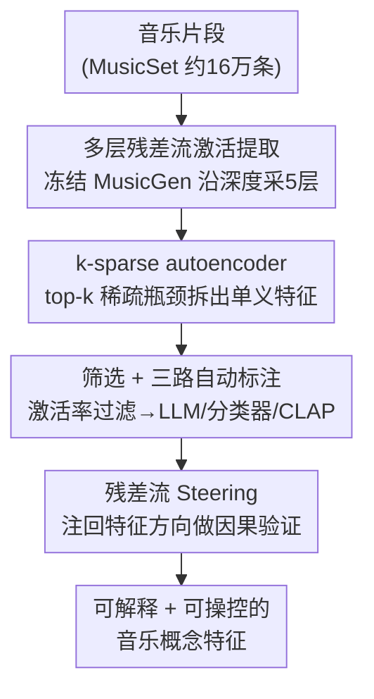

# Discovering and Steering Interpretable Concepts in Large Generative Music Models

**会议**: ICLR2026  
**arXiv**: [2505.18186](https://arxiv.org/abs/2505.18186)  
**代码**: [musicdiscovery.media.mit.edu](https://musicdiscovery.media.mit.edu)  
**领域**: 音频语音  
**关键词**: Sparse Autoencoder, Music Generation, interpretability, MusicGen, Feature Steering

## 一句话总结

首次将 Sparse Autoencoder (SAE) 应用于音频/音乐领域，从自回归音乐生成模型 MusicGen 的残差流中提取可解释的音乐概念特征，并利用这些特征实现可控生成（steering）。

## 背景与动机

- 深度生成模型能产出高质量音乐，暗示其内部已学到音乐结构的隐式理论，但这些内在表征对人类而言仍是黑箱
- 已有 probing 方法只能验证"模型是否编码了我们**已知**的概念"（如和弦、节拍），无法发现模型自行学习到的**未知**结构
- 音乐领域缺乏大规模配对的"音乐-文本"数据，使概念发现尤其困难
- 在 NLP 和视觉领域，SAE 已被证明能从 Transformer 激活中提取可解释的稀疏特征（Templeton et al., 2024），但尚未应用于音频模态

核心动机：**从"模型是否学了 X"转向"模型到底学了什么"**——无监督地发现模型内部编码的全部音乐概念。

## 核心问题

1. 如何从音乐生成模型的中间表征中**无监督**发现可解释的音乐概念？
2. 如何**自动化、大规模**地评估和标注数以千计的潜在特征？
3. 发现的特征是否能**因果性**地控制（steer）生成输出？

## 方法详解

### 整体框架

这篇论文要回答一个问题：一个能写出好音乐的生成模型，内部到底学到了哪些音乐概念，我们能不能把它们读出来、还反过来操控它们？做法是把整件事拆成四步流水线。先把约 16 万条音乐片段喂进**冻结**的 MusicGen，从若干残差流层抓中间激活；再训练一个 k-sparse autoencoder 把这些高度纠缠的激活重写成一组稀疏、单义的特征；接着把成千上万个特征按激活率过滤掉无用的、再用三路自动方法给剩下的命名打分；最后把某个特征的方向重新注回残差流，看它能不能真的左右生成的音乐。前两步负责"提取并解开"表征，第三步负责"筛选并命名"概念，第四步从因果上验证这些概念是不是真的可操作。

### 关键设计

**1. 多层残差流激活提取：给"音乐到底学在哪一层"留好探针**

要发现概念，前提是从生成模型里取出值得分析的中间表征。作者用约 16 万条 ~10 秒音乐片段构成的 MusicSet 数据集（来自 MTG-Jamendo / MusicCaps / MusicBench），分别送入预训练的 MusicGen-Large（MGL，$d=2048$）和 MusicGen-Small（MGS，$d=1024$），整个生成模型保持冻结、只读取激活。激活不是只取一层，而是沿深度均匀采五个残差流层——早期第 2 层、25%/50%/75% 深度层和倒数第 2 层（MGL 取 $\{2,12,24,36,46\}$，MGS 取 $\{2,6,12,18,22\}$）。这样布点是为了让后续分析能比较"概念在浅层还是深层更可解释"，而不必预设答案。

**2. k-sparse autoencoder：用稀疏瓶颈把纠缠的激活拆成单义特征**

残差流激活是高度叠加（superposition）的，一个维度往往同时编码多个概念，没法直接读。作者训练 k-sparse autoencoder 把它重写成一组稀疏激活的特征：编码器 $\mathbf{h}=\text{ReLU}(\mathbf{W}_e\mathbf{x}+\mathbf{b}_e)$ 后再经 top-k 投影，只保留 $k$ 个最大激活、其余置零，解码器 $\hat{\mathbf{x}}=\mathbf{W}_d\mathbf{h}+\mathbf{b}_d$ 在 MSE 重建误差下复原原激活。强制稀疏迫使每个特征承载尽量单一的含义，从而可解释；解码器的每一列 $\mathbf{W}_{d,j}$ 就成了一个特征对应的"方向"，后面 steering 正是复用它。字典维度由扩展因子 $\epsilon\in\{4,32\}$ 控制，稀疏度 $k\in\{32,100\}$，作者扫遍这些组合以观察容量与稀疏度对特征数量与质量的影响。

**3. 筛选 + 三路自动标注：把成千上万特征收敛成可命名的有效概念**

字典里成千上万的特征大多不堪用，且逐一人工命名也不现实，所以这一步要既会"删"又会"命名"。先做激活率筛选：对每个特征统计它在验证集全部 track 上的激活率 $r_i$，按三条启发式规则剔除——$r_i=0$ 的死特征、$r_i>0.25$ 的过于普遍特征（含义太泛而模糊）、$r_i<0.01$ 的过于稀有特征（覆盖样本太少无法可靠解释），把预算集中到既频繁又有区分度的特征上，全流程筛后共留下 4697 个有效特征。再做三路自动标注：生成式标注把每个特征 top-10 最高激活样本的拼接音频送进 Gemini Flash 1.5，让多模态 LLM 给出概念标签、置信度和描述；分类器标注用预训练的 Essentia 音频分类器抽取流派、乐器、情绪等标签；最后对每个候选标签计算其文本与激活样本音频的 CLAP embedding 余弦相似度作为对齐得分，量化标签到底贴不贴音频。两路标签来源加一路客观打分，既覆盖开放式概念又有可比的质量度量。

**4. 残差流 Steering：从因果上验证特征是不是"可操作方向"**

可解释还不等于可控，最后一步要证明发现的特征确实因果地驱动生成。作者在前向推理时把目标特征 $j$ 的解码器方向缩放后注回它所在层的残差流：

$$\mathbf{x}' = \mathbf{x} + \alpha \cdot \beta \cdot \mathbf{W}_{d,j}$$

其中 $\mathbf{W}_{d,j}$ 是设计 2 学到的该特征方向，$\beta$ 是特征 $j$ 的最大激活强度（把注入幅度对齐到该特征的自然量级），$\alpha\in(0,1)$ 是 steering 强度。实验用中性 prompt "Simple melody" 排除文本 prompt 的干扰，对比 $\alpha=0$（基线）与 $\alpha=1$（最大 steering）的输出，若注入后音频朝该特征对应的概念偏移，就说明这个方向是可操作的。

## 实验关键数据

### 特征发现统计

- 筛选后共保留 **4697 个有效特征**
- MGL 远优于 MGS：MGL 在 $\epsilon=32, k=100$ 的 L2 层可产出 2344 个特征；MGS 在所有配置下很少超过 100 个
- 扩展因子 32 配合 k=100 效果最佳

### 自动标注质量

- Essentia 分类器标签的 CLAP 对齐得分整体高于 Gemini 生成标签
- 人工评估（400 特征/方法，80 参与者）：Essentia 置信度 3.96/5（71% > 4分），Gemini 置信度 3.19/5（47% > 4分）

### 层级规律

- MGL 的深层特征具有更高的 CLAP 得分，说明**深层编码更可解释的概念**
- 层预测 MLP 准确率：MGL 50.29%，MGS 40.51%——大模型的特征**跨层分化更明显**

### Steering 效果

- 不同 SAE 配置下，**15%–35% 的特征**展示出正向 steering 改进
- 最佳配置：MGL L36, $\epsilon=32, k=100$ 达 35.1% 正向改进
- 人类听觉测试（10 人 × 10 组）：66/100 次正确识别出 SAE-steered 音频（vs 基线 17 次，随机 17 次），$\chi^2=48.02, p<.0001$

## 亮点

- **首次 SAE 音频应用**：将 NLP/视觉领域的 SAE 可解释性方法成功迁移到音乐生成模型，开辟了新方向
- **无监督概念发现**：不仅能恢复经典音乐概念（太鼓、Hardstyle Techno、巴洛克羽管键琴、摇滚吉他 solo），还能发现**理论尚未编码的新模式**（如"电子 beeps and boops"、"单乐器单音符"、"振荡铃声音色"）
- **完整评估体系**：结合多模态 LLM、预训练分类器、CLAP 对齐和人工验证的多层次评估流水线
- **可控生成验证**：steering 实验从因果层面证明发现的特征确实对应模型内部的**可操作方向**

## 局限与展望

- Steering 成功率仅 15%–35%，多数特征虽可解释但不一定可操控
- 仅在 MusicGen 上验证，未测试 diffusion-based 音乐生成模型或其他架构
- 自动标注仍有局限：Gemini 标签质量不如分类器标签稳定，开放式标签的准确性有待提升
- 特征筛选阈值（1%–25%）为启发式设定，可能遗漏边界情况
- MGS 发现的有效特征极少（多数配置 < 10 个），模型规模的下界效应未充分讨论
- 仅使用无条件音频提取激活，未探索条件生成场景下的特征差异

## 与相关工作的对比

| 方法 | 策略 | 概念来源 | 局限 |
|------|------|----------|------|
| Probing (Wei et al., 2024a; Ma & Xia, 2024) | 有监督探测 | 预定义已知概念 | 只能验证已知概念 |
| DecoderLens (Vásquez et al., 2024) | 中间激活可视化 | 层间"听觉"演变 | 定性分析为主 |
| Concept Bottleneck Models | 瓶颈层约束 | 手工指定概念集 | 需先验知识 |
| 蛋白质语言模型 SAE (Simon & Zou, 2024) | SAE 特征发现 | 无监督 | 领域不同 |
| **本文** | **SAE + 自动标注 + Steering** | **无监督发现** | **首次音频应用，含因果验证** |

## 启发与关联

- SAE 可解释性范式从文本→视觉→蛋白质→音频的拓展路径表明，该方法具有跨模态通用性，有望进一步应用于视频生成、3D 生成等领域
- "模型学到的概念可能超越人类现有理论框架"这一发现，对音乐理论研究具有启发意义——可将 AI 作为发现工具
- Steering 机制提供了一种新的可控生成范式，不依赖文本 prompt 或条件控制信号，而是直接操作内部表征
- 层级分化规律（深层更可解释、大规模模型特征更跨层分化）与 NLP 领域的已有发现一致，进一步支持了 Transformer 的"浅层编码低级特征、深层编码高级语义"假说

## 评分
- 新颖性: 9/10（SAE 首次应用于音频，概念发现+steering 双管齐下）
- 实验充分度: 8/10（多模型、多层、多超参数组合，含人工评估，但仅限 MusicGen）
- 写作质量: 9/10（行文清晰，图表丰富，流水线各步骤阐述完整）
- 价值: 8/10（开辟了音乐模型可解释性新方向，steering 应用有实际价值但成功率尚待提升）

<!-- RELATED:START -->

## 相关论文

- [\[ICLR 2026\] Steering Autoregressive Music Generation with Recursive Feature Machines](steering_autoregressive_music_generation_with_recursive_feature_machines.md)
- [\[ICLR 2026\] Music Flamingo: Scaling Music Understanding in Audio Language Models](music_flamingo_scaling_music_understanding_in_audio_language_models.md)
- [\[AAAI 2026\] Aligning Generative Music AI with Human Preferences: Methods and Challenges](../../AAAI2026/audio_speech/aligning_generative_music_ai_with_human_preferences_methods_and_challenges.md)
- [\[ICLR 2026\] Confident and Adaptive Generative Speech Recognition via Risk Control](confident_and_adaptive_generative_speech_recognition_via_risk_control.md)
- [\[ICLR 2026\] Automatic Stage Lighting Control: Is it a Rule-Driven Process or Generative Task?](automatic_stage_lighting_control_is_it_a_rule-driven_process_or_generative_task.md)

<!-- RELATED:END -->
