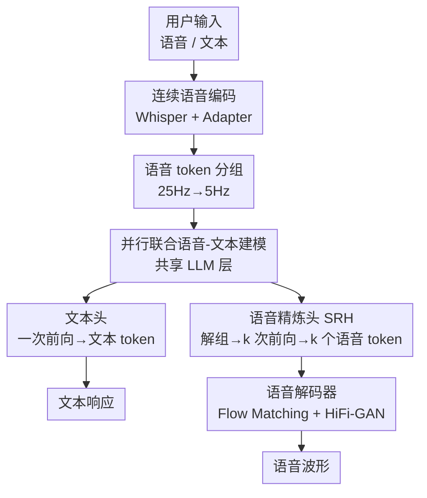

# DrVoice: Parallel Speech-Text Voice Conversation Model via Dual-Resolution Speech Representations

**会议**: ICLR2026  
**OpenReview**: [https://openreview.net/forum?id=h5AiVx0Aiv](https://openreview.net/forum?id=h5AiVx0Aiv)  
**代码**: https://github.com/FunAudioLLM/Fun-Audio-Chat  
**领域**: 语音对话 / 语音基础模型 / 多模态  
**关键词**: 语音-文本联合建模, 双分辨率表示, 端到端语音对话, 语音 token 分组, 并行解码

## 一句话总结
DrVoice 把进入 LLM 的语音帧率从主流的 12.5Hz 压到 5Hz——靠"分组压缩做理解、专门的精炼头按原始帧率做生成"这套双分辨率方案，既省掉近 50% 训练 GPU 时、又缓解了语音 token 和文本 token 的帧率失配，让 7B 规模的开源语音模型在 OpenAudioBench、VoiceBench、UltraEval-Audio、Big Bench Audio 四个榜单上同时刷到 SOTA。

## 研究背景与动机
**领域现状**：端到端（E2E）语音对话把 ASR + LLM + TTS 三段式级联压成一个模型，让 LLM 直接吃语音表示、直接吐语音 token。其中"联合语音-文本模型"（Joint Speech-Text）让 LLM 在每一步同时生成文本 token 和语音 token，二者互相喂回、互相感知，被认为比"文本驱动"（先把文本生成完、再交给语音解码器）更有潜力，因为它能让文本输出反过来被已生成的语音条件化，从而捕捉情感、韵律这类副语言信息。

**现有痛点**：联合建模阵营里的最强者 Kimi-Audio 用的是 **12.5Hz** 的音频表示。这带来两个连锁问题：一是 12.5 个 token/秒的高 token 率直接抬高训练和推理算力；二是语音 token 率（12.5Hz）和文本 token 率（约 3Hz）之间存在严重的**帧率失配**——同样一句话，语音侧的 token 数远多于文本侧，这会稀释语义信息、妨碍 LLM 发挥它本来的文本能力。

**核心矛盾**：语音 token 想要**高帧率**才能保住细粒度声学细节（保证生成质量），但高帧率又**拉远**了它和文本 token 的距离、拖累理解和算力。降帧率（如直接降到 6.25Hz）虽然省算力、贴近文本，但 GLM-4-Voice 的实验表明 12.5Hz/6.25Hz 下 WER 会显著恶化。理解侧想要低帧率、生成侧想要高帧率，这是一对天然的 trade-off。

**本文目标**：在不牺牲语音生成质量的前提下，把进入 LLM 主干的语音帧率压到比所有现有方法都低（5Hz），同时缓解帧率失配、保住 LLM 的语义能力。

**切入角度**：作者的关键观察是——理解和生成对帧率的需求其实是**矛盾的两件事**，那就不该用同一个分辨率去伺候它们。理解可以在低分辨率（分组后）做，生成则在高分辨率（解组后逐 token）做。

**核心 idea**：用"双分辨率语音表示（DRSR）"分而治之——**输入端把 25Hz 语音 token 分组压成 5Hz** 喂给 LLM 做理解，**输出端用一个专门的语音精炼头（SRH）把 LLM 隐状态解组、按原始帧率自回归地逐个吐出语音 token** 做生成。

## 方法详解

### 整体框架
DrVoice 是一个**并行联合语音-文本对话模型**：用户输入（语音或文本）先映射到统一语义空间，由一个多模态 LLM（MLLM）同时产出文本响应和语音响应，二者在每一步并行生成、互相喂回。系统由三大块组成——（1）**语音编码 / 语音分词**：用户端用 Whisper-Large-v3 抽连续特征、助手端用 S3Tokenizer 抽离散语义 token；（2）**MLLM**：一个共享 LLM 层（Qwen2.5 初始化）后面挂两个头——文本头（Text Head）一次前向预测文本 token，语音精炼头（SRH）多次前向预测语音 token；（3）**语音解码**：用 Flow Matching + HiFi-GAN 把语音 token 还原成波形。

整条链路最核心的"双分辨率"体现在：进 LLM 之前，25Hz 的语音 token 被**分组**压成 5Hz（理解侧低分辨率）；出 LLM 之后，共享层隐状态被 SRH **解组**回原始帧率、逐个生成语音 token（生成侧高分辨率）。文本侧和语音侧的 embedding 在每一步相加构成 LLM 输入，形成"并行"结构。

### 关键设计

**1. 双分辨率语音表示 DRSR：理解用低帧率、生成用高帧率，分而治之**

这是全文的核心架构创新，针对的就是"理解想低帧率、生成想高帧率"那对矛盾。作者不再用单一分辨率，而是把链路拆成两段不同分辨率。输入端先采 25Hz（GLM-4-Voice 实验显示 25Hz 与 50Hz 的 WER 几乎无差，但降到 12.5Hz/6.25Hz 会明显变差，所以 25Hz 是质量与长度的甜点），再用一个**分组（Grouping）机制**把连续 $k$ 个语音 token 拼接后线性投影成一个对齐到文本维度的向量：

$$g_i = \text{Linear}\Big(\big\Vert_{j=ik}^{(i+1)k-1} s_j\Big) \in \mathbb{R}^{d_{\text{text}}}$$

其中 $s_j$ 是语音 token，$\Vert$ 是特征拼接，$k$ 是分组因子（由语音/文本 token 率之比决定）。这把语音序列长度从 $T$ 压成 $T/k$，$k=5$ 时正好把 25Hz 压到 5Hz，序列和文本 token 对齐得更好、算力也省下来（实测每个设置下训练 GPU 时减少近 50%）。和 Chen et al. (2024a) 把音频 logits 线性投影成组大小表示做并行多 token 预测不同，DrVoice 没有止步于"分组喂进去"，而是配套设计了解组机制 + SRH 来做生成——这是它和单纯分组方法的根本区别。

**2. 语音精炼头 SRH：解组回原始帧率，自回归逐个吐语音 token**

分组虽然对理解友好，但作者实验发现它在**生成**场景有硬伤：分组不可避免地丢掉了细粒度声学细节。如果生成时还停在分组后的低分辨率上，语音质量就上不去。SRH 就是为这个问题而生的——它把共享 LLM 层（SLLM）的最后隐状态先通过线性投影映射成组大小 embedding：

$$h_{ug} = W_p\, h[\text{SLLM}], \quad W_p \in \mathbb{R}^{d_g \times d_h}$$

再按时间切成 $k$ 份 $H = \text{Split}_k(h_{ug}) = [h_{ug}^{(1)}, \dots, h_{ug}^{(k)}]$（这一步就是"解组 Ungrouping"，把一个低分辨率隐状态展开回 $k$ 个高分辨率位置）。然后 SRH 以 $H$ 为条件、**自回归地**逐个生成原始帧率的语音 token，训练目标是：

$$\mathcal{L}_{\text{SRH}} = -\sum_{i=1}^{T} \log P(s_i \mid s_{<i}, H_{<i})$$

关键在于"自回归"三个字——SRH 生成第 $i$ 个语音 token 时既看前面已生成的语音 token、又看 SLLM 给出的富语义条件 $H$，这比"一次性并行投影出 $k$ 个 token"（即去掉 SRH 时的退化做法：把隐状态投到 $d_{\text{model}} \to k \times d_{\text{speech\_token}}$ 再 split）更能恢复声学细节。论文里 SRH 头本身用一个预训练 TTS 模型初始化。整个 MLLM 用多任务损失把两个头联合优化：

$$\mathcal{L}_{\text{MLLM}} = \lambda \mathcal{L}_{\text{TH}} + \mu \mathcal{L}_{\text{SRH}}$$

其中 $\mathcal{L}_{\text{TH}} = -\sum_i \log P(t_i \mid c_{<i}, g)$ 是文本头的自回归损失，$\lambda, \mu$ 是权重超参。

**3. 并行联合语音-文本建模：文本流当语义脚手架，每步双模态喂回**

这是承袭 Moshi 思路的整体建模骨架，针对的痛点是"语音 token 生成时没有充分利用文本信息"。作者让显式的文本流作为公共语义脚手架来辅助语音生成，并且**只在助手端做模态对齐**——这符合人机交互的非对称性：用户输入通常是单模态（要么语音要么文本），但助手的回答可以是协调好的多模态输出。具体地，每一步把已生成的语音 token $s_t$ 和文本 token $t_t$ 的 embedding 相加作为下一步 LLM 输入：

$$c_t = E_{\text{speech}}(s_t) + E_{\text{text}}(t_t)$$

由于语音 token 和文本 token 序列长度通常不等，短的那一侧用特殊 token `<|SIL|>` 补齐对齐。整个生成是统一的自回归过程 $P(y_t \mid y_{<t}, x) = \prod_i P(y_i \mid y_{<i}, x)$，其中 $y_t = (s_t, t_t)$ 是该步的联合输出。这样语音和文本在单一自回归框架内无缝交织，语音生成能实时被文本条件化、文本也能被语音条件化。

**4. CoM-Mixing 训练：链式模态当课程，七种交互模式按需切换**

这一设计解决两件事：一是提升输出连贯性，二是让模型能根据需求动态切换"纯文本/纯语音/语音+文本"等不同输出模式。链式模态（Chain-of-Modality, CoM）让模型**先生成完整文本响应、再进行并行语音-文本生成**——先用文本把"想说什么"组织清楚，相当于一个中间推理步骤，再去做语音，能改善模态对齐、减少错误。作者把交互需求整理成**七种模式**（如 S2M 语音→语音+文本、S2T 语音→纯文本、STC 语音→文本转写→文本响应→多模态、SAC、SUC 等），用 system prompt 来调控模型该输出哪种模态（例如 prompt 明确要求"同时生成文本和语音 token"）。训练时按这七种模式构造数据变体混合训练（这就是"Mixing"，它同时起到课程学习 + 数据增强的作用）；推理时用户手动在输入前拼上对应 system prompt 即可拿到想要的输出形态。

**5. Core-Cocktail 训练：高学习率冲一把，再和基座 LLM 合并保知识**

作者识别出一个"学习率两难"：高学习率会明显损伤 MLLM（破坏原 LLM 知识），低学习率又训不动（loss 降得极慢）。Core-Cocktail 是针对这个两难的两阶段策略。**第一阶段**用相对高的学习率全参微调整个 MLLM，目标是快速把参数推到 loss landscape 里更有利的区域；但这会带来性能退化，于是中间插入一个**模型合并**步骤——把第一阶段训出的模型 $M_1$ 和预训练基座 LLM $M_0$ 做插值：

$$M_r \leftarrow \alpha M_1 + (1-\alpha) M_0$$

$\alpha$ 越小越偏向保留基座能力，这一步把基座 LLM 的稳健知识重新注回来。**第二阶段**再在合并后的 $M_r$ 上用小学习率全参微调，做精细打磨。这样既享受了高学习率的快速收敛、又避免了它的不稳定和知识遗忘。

### 损失函数 / 训练策略
- **初始化**：Speech Encoder 用 Whisper-Large-v3、共享 LLM 层用 Qwen2.5、SRH 用预训练 TTS 模型；CosyVoice 的 Speech Tokenizer / Detokenizer 全程冻结。
- **总损失**：$\mathcal{L}_{\text{MLLM}} = \lambda \mathcal{L}_{\text{TH}} + \mu \mathcal{L}_{\text{SRH}}$，文本头与语音精炼头多任务联合优化。
- **数据**：约 100K 小时音文配对数据预训练 SRH；后训练用 CosyVoice 为约 3B 文本 token 合成语音，再筛出约 26K 小时做语音对话、约 20K 小时用户语音+1.3B 助手 token 做语音→文本；另加约 10K 小时英文 ASR 数据（Common Voice / MELD / LibriSpeech / SPGISpeech / Voxpopuli）增强真实语音理解。

## 实验关键数据

### 主实验
DrVoice-7B 在四大榜单上同时取得 SOTA，且帧率（FR In/Out）只有 5/5，远低于其他模型的 12.5 或 25。

| 基准（指标） | DrVoice-7B | Kimi-Audio | Step-Audio2-Mini | Qwen2.5-Omni |
|--------|------|------|------|------|
| OpenAudioBench Overall (S2T) | **72.04** | 69.08 | 60.69 | 66.34 |
| VoiceBench Overall (S2T) | **80.17** | 76.93 | 63.84 | 72.83 |
| UltraEval-Audio Overall (S2S) | **56.66** | 42.79 | 46.89 | 50.46 |
| Big Bench Audio Overall | **74.0** | 55.2 | 49.2 | 53.9 |
| 帧率 FR (In/Out) | 5/5 | 12.5/12.5 | 12.5/25+τ | 25/τ |

语音质量上，DrVoice 在 5/5 的超低帧率下 UTMOS 仍达 4.29，与 Qwen2.5-Omni（4.28）相当、远超 Kimi-Audio（3.06）；ASR-WER 为 8.36，体现良好的语音-文本对齐（但仍弱于 Qwen2.5-Omni 的 3.48，作者解释为 Qwen 把文本直接喂给 Talker、而 DrVoice 只把隐状态送给 SRH）。

| 模型 | FR(In/Out)↓ | UTMOS↑ | ASR-WER↓ |
|------|-------------|--------|----------|
| Qwen2.5-Omni | 25/τ | 4.28 | 3.48 |
| Kimi-Audio | 12.5/12.5 | 3.06 | 21.06 |
| Step-Audio2-Mini | 12.5/25+τ | 4.53 | 9.50 |
| **DrVoice** | **5/5** | **4.29** | **8.36** |

### 消融实验
在 DrVoice-Small（1.5B）上以 Llama Questions 为指标（T/S 表示文本/语音得分）：

| 配置 | S2M (T/S) | S2T | T2T | 说明 |
|------|-----------|-----|-----|------|
| DrVoice-Small | 68.67 / 56.00 | 72.33 | 75.33 | 完整模型 |
| w/o CSE | 61.67 / 53.00 | 62.33 | 74.00 | 去连续语音编码，S2T 掉 13.8% |
| w/o SRH-Pretraining | 38.33 / 30.33 | 56.00 | 73.33 | 去 SRH 预训练，生成大幅恶化 |
| w/o SRH | 21.67 / 15.33 | 56.00 | 73.00 | 去语音精炼头，S2M(T) 暴跌 |
| w/o CoM-Mixing | 58.00 / 49.00 | 58.00 | 68.33 | 去混合训练，S2M(T) 掉 15.5% |

### 关键发现
- **SRH 是语音生成的命门**：加上 SRH（对比 w/o SRH-Pretraining 与 w/o SRH）让 S2M(T) 相对提升 76.9%（21.67→38.33）、T2M(T) 提升 31.2%；而 T2T 几乎不变，说明 SRH 只增强语音生成、不干扰文本通路。
- **分组反而提升理解和生成**：与直觉相反，分组因子从 1 升到 5 让 S2T 从 55.67 升到 63.33（相对 +13.7%），S2M 在 $k=5$ 时达到峰值，同时每个设置省下近 50% GPU 时——省算力和涨点同时发生。
- **Core-Cocktail 确实救回了退化**：第一阶段把文本基线从 81.77 砸到 70.19，第二阶段又拉回 74.73，证明合并 + 小学习率二段式有效对冲了激进初训的损伤。
- **CoM 系统提示带来增益**：STC(T) 达 75.67，明显超过直接 S2M(T) 的 68.67，说明模型学会了按 system prompt 切换生成范式。

## 亮点与洞察
- **"理解低帧率、生成高帧率"是个很干净的洞见**：它把"语音 token 既要贴近文本又要保住声学细节"这对长期纠缠的需求，干脆拆成输入侧分组、输出侧解组两段不同分辨率来分别满足，比一味在单一帧率上折中要聪明。
- **省算力和涨点居然不冲突**：分组因子 5 不仅没拖垮生成，反而同时提升理解和生成、还省近一半 GPU 时——这打破了"压缩必然掉点"的惯性预期，值得迁移到其他高 token 率模态（如视频 token）。
- **SRH 的"解组 + 自回归"可复用**：把一个粗粒度隐状态展开成 $k$ 个细粒度位置、再自回归精炼，这套思路对任何"主干在低分辨率工作、但输出要高分辨率细节"的多模态生成都适用。
- **Core-Cocktail 用模型合并治学习率两难**：高学习率冲一把再和基座插值合并，是一个很实用的"既要快又要稳"的工程配方，对所有怕微调毁掉基座知识的场景都有借鉴价值。

## 局限与展望
- **ASR-WER 仍逊于直接喂文本的方案**：作者承认 8.36 的对齐误差弱于 Qwen2.5-Omni（3.48），根因是 DrVoice 只把隐状态送进 SRH 而非把文本直接喂给语音模块——这说明"隐状态条件"在保真度上仍不如"显式文本条件"，是双分辨率换效率付出的代价。
- **依赖大量合成数据**：后训练数据主要来自 CosyVoice 合成（约 3B 文本 token 合成语音再筛），合成数据的分布偏差和真实语音的差距对鲁棒性的影响论文讨论有限。
- **七种交互模式靠手动 prompt 切换**：推理时需要用户手动拼接 system prompt 才能拿到想要的输出形态，缺少自动判别该用哪种模式的机制，落地全双工对话时还需额外调度逻辑。
- **可改进方向**：能否让 SRH 在生成时也显式引用文本 token（而非只用隐状态）来缩小与 Qwen 的对齐差距；以及把分组因子做成自适应（按语音内容复杂度动态调 $k$）而非固定 5。

## 相关工作与启发
- **vs Kimi-Audio**：同属并行联合建模阵营且是前 SOTA，但 Kimi 用 12.5Hz、训练数据和算力都很重，且和文本 token 率（约 3Hz）失配严重；DrVoice 用 DRSR 把 LLM 输入帧率压到 5Hz，省算力、缓解失配，并在四榜全面反超。
- **vs Moshi**：DrVoice 的并行联合建模骨架受 Moshi 启发（文本流当语义脚手架），但 Moshi 用紧凑的 Deep Transformer 仅靠当前步表示预测 $k$ 个 token；DrVoice 改用解组 + SRH 自回归逐个生成，保住更多声学细节。
- **vs Chen et al. (2024a) 的分组方案**：他们把音频 logits 线性投影成组大小表示做并行多 token 预测，止步于"分组进、并行出"；DrVoice 额外设计解组机制 + 专门的 SRH，把生成从"一次并行投影"升级为"自回归精炼"，这是消融里 w/o SRH 暴跌验证的关键差异。
- **vs Qwen2.5-Omni（Thinker-Talker，文本驱动）**：Qwen 的 Thinker 处理理解+文本、Talker 处理语音，但 Thinker 生成时收不到语音 token，限制了对语音生成状态的感知（不利于全双工）；DrVoice 走联合建模，语音和文本每步互相喂回，但代价是语音-文本对齐保真度暂不及直接喂文本的 Qwen。

## 评分
- 新颖性: ⭐⭐⭐⭐⭐ 双分辨率"理解低帧率、生成高帧率"+ 解组 SRH 是干净且有效的架构创新。
- 实验充分度: ⭐⭐⭐⭐⭐ 四大榜单全面 SOTA，消融覆盖 CSE/SRH/SRH 预训练/CoM/分组因子/Core-Cocktail 各部件。
- 写作质量: ⭐⭐⭐⭐ 方法叙述清晰、公式完整；部分训练细节散落附录。
- 价值: ⭐⭐⭐⭐⭐ 5Hz 帧率 + 近 50% GPU 时节省 + 开源 7B SOTA，对落地实时语音对话有很强实用价值。

<!-- RELATED:START -->

## 相关论文

- [\[ACL 2025\] OmniFlatten: An End-to-end GPT Model for Seamless Voice Conversation](../../ACL2025/audio_speech/omniflatten_an_end-to-end_gpt_model_for_seamless_voice_conversation.md)
- [\[ICLR 2026\] Beyond Instance-Level Alignment: Dual-Level Optimal Transport for Audio-Text Retrieval](beyond_instance-level_alignment_dual-level_optimal_transport_for_audio-text_retr.md)
- [\[ICLR 2026\] UniSS: Unified Expressive Speech-to-Speech Translation with Your Voice](uniss_unified_expressive_speech-to-speech_translation_with_your_voice.md)
- [\[ICLR 2026\] Closing the Gap Between Text and Speech Understanding in LLMs](closing_the_gap_between_text_and_speech_understanding_in_llms.md)
- [\[ACL 2026\] FC-TTS: Style and Timbre Control in Zero-Shot Text-to-Speech with Disentangled Speech Representations](../../ACL2026/audio_speech/fc-tts_style_and_timbre_control_in_zero-shot_text-to-speech_with_disentangled_sp.md)

<!-- RELATED:END -->
