# From Natural Alignment to Conditional Controllability in Multimodal Dialogue

**会议**: ICLR 2026  
**OpenReview**: [https://openreview.net/forum?id=fBagP6w6yE](https://openreview.net/forum?id=fBagP6w6yE)  
**代码**: [https://github.com/jessyjinzy/MM-Dia](https://github.com/jessyjinzy/MM-Dia)  
**领域**: 多模态对话生成 / 语音合成 / 数据集与基准  
**关键词**: 多模态对话, 可控语音合成, 影视数据标注, 跨模态风格一致性, MM-DIA  

## 一句话总结
本文提出从影视剧自动构建的大规模表现力多模态对话数据集 MM-DIA（360 小时、5.47 万段对话）及基准 MM-DIA-BENCH，并把"可控多模态对话生成（MDG）"形式化为一个统一的条件生成问题，覆盖显式提示控制与隐式跨模态控制三大任务。

## 研究背景与动机
**领域现状**：对话是人类最自然的交互形式，涉及文本、语音、视觉等多个通道。AIGC 时代的对话研究主要分两条线——一是以 ChatGPT 为代表的**语义生成**（产出连贯、上下文恰当的回复），二是把语义投射到单一模态的**模态映射**（如文本转语音、文本转动作）。两条线都能在隔离模态里产出逼真内容。

**现有痛点**：现有方法都聚焦于"模态隔离"内容的逼真传输，却系统性地忽略了**跨模态的交互风格**建模，导致生成结果表现力与可控性受限。具体卡在三处：(1) 缺高质量原生多模态对话数据——现有数据集来源窄、模态缺失，难以同步采集文本-音频-视觉对话；(2) 缺可扩展的交互级语义标注方法——MELD、MC-EIU 这类人工类别标签既贵又难扩展，还无法刻画人类交互连续、细腻的本质；(3) 缺系统化基准与评测协议——现有基准只关注局部语义连贯和单模态保真，无法评测对话级可控性与跨模态风格一致性。

**核心矛盾**：影视剧素材表现力极强（情绪饱满、张力大、贴近真实交互），但其"为追求感官效果"带来的背景音、突发爆点、含糊低语会破坏 ASR，艺术化运镜造成画外音和闪回，让对话边界检测与说话人归属都变得困难——**最富表现力的数据恰恰最难自动处理**。

**本文目标**：构建大规模表现力多模态对话数据集、引入新标注范式、建立系统化基准，让"可控多模态对话生成"成为可研究、可评测的范式。

**核心 idea**：**(1) 自动化影视数据管线**——用多模态线索鲁棒地切对话边界、归属说话人，从超 700 小时影视剧里蒸馏出同步的音-视-文对话与细粒度交互级标注；**(2) 两套互补的表现力范式**——用"情感三元组 ⟨关系, 交互模式, 情感基调⟩"做结构化标签控制，用"自由风格描述"做逐说话人、逐轮次的细粒度自然语言控制；**(3) 统一 MDG 形式化**——把可控多模态对话生成写成条件分布 $P(Y \mid C, Z)$，并区分显式控制与隐式控制，落地为三个代表性任务。

## 方法详解

### 整体框架
全文由"数据-标注-基准-任务"四块构成。前半部分是一条端到端的影视对话数据管线：从原始影视素材出发，经字幕校准、对话边界提取、句级细粒度标注、对话级表现力标注，产出 MM-DIA 数据集与高表现力子集 MM-DIA-BENCH。后半部分把多模态对话生成统一形式化为条件生成 $P(Y \mid C, Z)$，并实例化为三个任务用以基准测试现有模型。

```mermaid
flowchart TD
    A[原始影视素材<br/>200+电影 / 9 剧集 / 700h+] --> B[Step1 字幕同步校准<br/>多源字幕 + ASR 对齐]
    B --> C[Step2 容差增强场景检测<br/>VLM 判场景 + LLM 切对话边界<br/>动态关键帧缓冲池]
    C --> D[Step3 句级标注<br/>Gemini-2.5-flash 说话人归属<br/>非语言声音 + 说话人可见性]
    D --> E[Step4 对话级表现力标注<br/>Gemini-2.5-pro<br/>情感三元组 + 自由描述]
    E --> F[MM-DIA 5.47万段 / 360h]
    F --> G[MM-DIA-BENCH 309段 双说话人高表现力]
    F --> H[MDG 条件生成 P&#40;Y｜C,Z&#41;]
    H --> T1[Task1 显式控制<br/>风格可控对话语音合成]
    G --> T2[Task2 隐式控制<br/>视觉条件对话语音合成]
    G --> T3[Task3 隐式控制<br/>语音驱动对话视频生成]
```

### 关键设计

**1. 容差增强的对话边界提取：让对话跨越镜头切换而不断裂。** 对话边界与镜头/场景边界本质不同——一段对话可能横跨多个镜头，一个长场景里又可能有多次话题切换。作者先用 VLM 判断场景连续性，再用 LLM 在场景内细化对话边界。关键创新是引入一个带**动态关键帧池的缓冲机制**：不同于传统逐帧匹配（Wu et al.、Xiao et al.），缓冲池允许模型跨越快速运镜、闪回、视角切换等瞬时视觉中断，把本属同一对话的片段重新桥接起来；对超过 90 秒的长场景再用字幕加 LLM 语义过滤切出有意义的对话段，从而在复杂场景中保持对话连续性与完整性。

**2. 多模态说话人归属 + 句级细粒度标注：解决影视特有的"声画不同步"。** 常规自动工具在影视场景里都失效——纯音频 diarization 因噪声而精度低，纯视觉的主动说话人检测又因说话人常不在画面里而不可靠。作者改用 Gemini-2.5-flash，喂入同步的音-视片段加字幕做说话人归属：先给一个预定义的**主角库（Character Bank）**让模型识别已知角色，识别不出时再依据屏幕人物形象临时分配身份。同时标注非语言声音/发声（捕捉细粒度表达线索），并用 Insightface 标注主说话人在对齐关键帧中的可见性，为下游说话头生成等任务铺路。

**3. 对话级表现力的双范式建模：结构化标签 + 自由描述互补。** 作者把"对话表现力"定义为超越语义内容的跨模态交互一致性，并提出两套互补范式联合刻画。其一是**情感三元组控制** $S_{\text{triplet}} = V_R \times V_I \times V_E$，即 ⟨关系 Relationship, 交互模式 Interaction Mode, 情感基调 Emotional Tone⟩，联合建模角色身份、社会互动与情感动态，实现对场景级对话行为的精确控制；其二是**描述控制（Freestyle Description）**，捕捉逐说话人、逐轮次的风格轨迹，支持对单个说话人的独立控制以及同一说话人跨轮次情感流的细粒度建模。两者合起来覆盖了"基于标签的结构化控制"与"基于描述的自然语言控制"。此外还引入两个量化维度——对话级的全局情感强度与说话人级的局部情感波动度（如持续高能对话表现为高强度、低波动），用 Gemini 与人工双重打分。

**4. MDG 统一形式化与三任务实例化：把可控对话生成写成一个条件分布。** 给定多模态上下文 $C = \{C_{txt}, C_{aud}, C_{vis}\}$，目标是生成满足语义连贯、跨模态对齐、可控三条件的对话行为 $Y = \{Y_{txt}, Y_{aud}, Y_{vis}\}$，统一建模为 $P(Y \mid C, Z)$，其中 $Z$ 为显式/隐式风格控制变量。三个任务正好覆盖控制方式与输出模态的不同组合：**Task 1 风格可控对话语音合成**——纯文本条件下从转录 $T$ 与显式风格 $Z_{exp} \in S_{triplet} \cup L_{desc}$ 采样 $\hat{A} \sim P(A \mid T, Z_{exp})$，且把音频建成**连续单遍对话流**而非逐轮拼接，自然内嵌说话人切换与重叠；**Task 2 视觉条件对话语音合成**——隐式控制，从关键帧序列推断潜在风格 $Z_{imp} = \psi(V_{key})$，再生成 $\hat{A} \sim P(A \mid T, \psi(V_{key}))$；**Task 3 语音驱动对话视频生成**——给定音频与转录，合成时间同步且情感一致的对话视频 $\hat{V} \sim P(V \mid A, T, Z)$。

## 实验关键数据

### 数据集统计

| 统计量 | MM-DIA | MM-DIA-BENCH |
|---|---|---|
| 对话总数 | 54,700 | 309 |
| 轮次总数 | 449,138 | 1,851 |
| 总时长 (h) | 360.26 | 1.69 |
| 平均说话人/对话 | 2.29 | 2.00 |
| 平均轮次/对话 | 8.21 | 5.99 |
| 情感强度均分 (Gemini/Human) | 6.76 / 5.22 | 7.81 / 5.74 |
| 情感流波动均分 (Gemini/Human) | 5.32 / 4.36 | 7.45 / 5.68 |
| 说话人可见性 | 部分 | 全部 |

与既有对话数据集相比，MM-DIA 是首个专注"跨模态对话级表现力"的数据集：在文本/视觉/音频三模态齐全的同时，还提供说话人身份(S-ID)、非语言线索(N-V)、说话人可见性(S-V)的音视细节，标注粒度达对话/句双层。

### 主实验：Task 1 显式控制（描述控制，Test 集）

| 模型 | WER↓ | UTMOS↑ | sa-SIM↑ | cp-WER↓ | Human-MOS 质量↑ | Human-MOS 指令遵循↑ |
|---|---|---|---|---|---|---|
| Dia-Base | 19.99 | 2.27 | 0.389 | 51.71 | 2.41 | 2.50 |
| Dia-SFT | 29.07 | 1.97 | 0.447 | 57.81 | 2.89 | 2.88 |
| Higgs-Audio-V2-Base | 31.25 | 3.09 | 0.475 | 104.87 | 3.58 | 3.11 |
| **Higgs-Audio-V2-SFT** | **4.45** | **3.28** | 0.447 | **33.77** | **4.44** | **4.13** |

在 MM-DIA 上微调让 Higgs-Audio 的 WER 从 31.3 降到 4.5、cp-WER 从 104.8 降到 33.8，内容准确度与对话语气转换大幅提升；sa-SIM 轻微下降（0.48→0.45），说明可控性提升与说话人音色一致性之间存在轻度权衡（影视数据说话人与风格变异更大）。

### 隐式控制实验：Task 2 视觉条件语音合成（MM-DIA-BENCH）

| 模型 | WER↓ | sa-SIM↑ | cp-WER↓ | Label-Recall 均值↑ | Gemini 指令遵循↑ |
|---|---|---|---|---|---|
| HarmoniVox（端到端） | 21.22 | 0.62 | 30.98 | 40.47 | 2.41 |
| Cascaded Gemini + Higgs | 5.78 | 0.499 | 16.27 | 42.33 | 3.35 |
| Cascaded GPT + Higgs | 5.79 | 0.476 | 14.58 | **52.17** | **3.52** |

### 关键发现
- **微调有效但需匹配骨干**：两个骨干都从 MM-DIA 微调中获益，但 Higgs-Audio（原生支持条件输入）显著强于 Dia-1.6B（需额外加轻量 adapter 注入风格嵌入），说明数据集与"为条件生成而设计"的骨干配合时增益最大。
- **隐式控制下跨模态风格一致性退化**：Task 2 中级联法整体优于端到端 HarmoniVox；但相比 Task 1 的显式提示，主观 Gemini 打分明显下滑，尤其在音色相似度与指令遵循维度——基础语音质量能保住，可一旦风格线索改为从视觉隐式提供，**跨模态风格一致性就崩**。
- **暴露现有框架的本质短板**：现有方法能产出流畅对话，却难以在跨模态间维持交互级风格对齐，这正是 MM-DIA-BENCH 想揭示的核心挑战。

## 亮点与洞察
- **把"表现力"从语义中剥离出来单独建模**：作者明确区分"模态隔离的内容传输"与"跨模态的交互风格"，并用情感三元组 + 自由描述两套互补范式去刻画后者，这是过往对话生成研究的盲区。
- **用大模型把"难自动化"的影视标注做到人类水平**：容差增强边界检测、主角库引导的说话人归属、Gemini 双层标注，组合起来攻克了影视声画不同步这一老大难，且验证达到人类级一致性。
- **基准的设计意图是"暴露失败"而非刷分**：MM-DIA-BENCH 专选高表现力、双说话人、保证可见性的样本，目的是让现有模型在跨模态风格一致性上现原形，为后续研究指明方向。
- **统一形式化具有可扩展性**：$P(Y \mid C, Z)$ 一个式子统一了语音合成、视觉条件语音、语音驱动视频三类任务，显/隐式控制只是 $Z$ 的来源不同，框架干净。

## 局限与展望
- **标注高度依赖闭源大模型**：管线核心步骤（说话人归属、表现力标注、判分）都依赖 Gemini-2.5 系列，复现成本与可控性受第三方 API 制约。
- **数据源版权与可发布性**：素材来自 200+ 电影与 9 部剧集，影视版权使其大规模公开发布存在现实约束。
- **本文不提出新生成模型，只提供基础设施**：三个任务都是用现有骨干微调/级联做基准，真正能在隐式跨模态控制下维持风格一致的模型仍是开放问题。
- **隐式控制天花板明显**：实验已表明现有框架在视觉/语音隐式条件下风格一致性退化，如何把交互级风格从视觉/韵律中可靠抽取并对齐，是留给社区的核心挑战。

## 相关工作与启发
- **多模态对话数据集**：相比 MELD/MC-EIU（人工切分、人工标签、规模小）与 MovieBench（基于视觉切分、关键帧图像输入），MM-DIA 用同步音-视-图-文多模态输入、Gemini-2.5-pro 标注，首次面向对话级风格标注。
- **多模态对话生成**：口语对话生成（MoonCast、Higgs-Audio、Dia）已能捕捉自然轮替与多说话人音色，影视视频生成（Captain Cinema、SVD）能产出高保真多镜头场景，说话头/视觉感知语音合成则桥接模态；但跨语音-视觉-文本的细粒度交互级控制仍是空白，本文正是为填补这一空白提供数据、管线、基准与任务形式化。
- **启发**：对"风格/交互可控"的多模态生成研究，本文提供了可直接复用的评测床；情感三元组这套结构化 schema 也可能迁移到对话情感识别、社交计算等任务。

## 评分
- **新颖性**: ⭐⭐⭐⭐ — 首个专注跨模态对话级表现力的数据集，"自然对齐到条件可控"的问题定位与情感三元组/自由描述双范式都有原创性；方法主要是大模型管线组合而非全新模型。
- **实验充分度**: ⭐⭐⭐⭐ — 三任务、多骨干、多评测集（Hard/Test/OOD）、客观+Human-MOS+Gemini-as-Judge 多维度评测，并系统验证标注质量达人类水平。
- **写作质量**: ⭐⭐⭐⭐ — 问题拆解清晰（三大挑战对应三大贡献），形式化简洁，图表完整；信息密度高，部分附录细节需查阅。
- **价值**: ⭐⭐⭐⭐⭐ — 提供了可控多模态对话生成稀缺的基础设施（数据/管线/基准/任务），并明确揭示现有框架在隐式跨模态控制下的失败，对推动该方向有长期价值。

<!-- RELATED:START -->

## 相关论文

- [\[ICLR 2026\] FlexiVoice: Enabling Flexible Style Control in Zero-Shot TTS with Natural Language Instructions](flexivoice_enabling_flexible_style_control_in_zero-shot_tts_with_natural_languag.md)
- [\[NeurIPS 2025\] A TRIANGLE Enables Multimodal Alignment Beyond Cosine Similarity](../../NeurIPS2025/audio_speech/a_triangle_enables_multimodal_alignment_beyond_cosine_simila.md)
- [\[ACL 2026\] ImmersiveTTS: Environment-Aware Text-to-Speech with Multimodal Diffusion Transformer and Domain-Specific Representation Alignment](../../ACL2026/audio_speech/immersivetts_environment-aware_text-to-speech_with_multimodal_diffusion_transfor.md)
- [\[ICLR 2026\] When Style Breaks Safety: Defending LLMs Against Superficial Style Alignment](when_style_breaks_safety_defending_llms_against_superficial_style_alignment.md)
- [\[ICLR 2026\] Scalable Multilingual Multimodal Machine Translation with Speech-Text Fusion](scalable_multilingual_multimodal_machine_translation_with_speech-text_fusion.md)

<!-- RELATED:END -->
