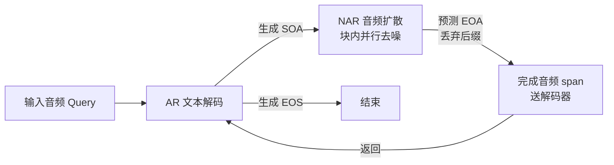

# From Text to Talk: Audio-Language Model Needs Non-Autoregressive Joint Training

**会议**: ICLR 2026  
**OpenReview**: [https://openreview.net/forum?id=e3XLWHFrnr](https://openreview.net/forum?id=e3XLWHFrnr)  
**代码**: [https://github.com/ai4ed/TtT](https://github.com/ai4ed/TtT)  
**领域**: 音频/语音、语音对话大模型  
**关键词**: 语音到语音、音频-语言模型、离散扩散、非自回归生成、联合训练  

## 一句话总结
针对端到端语音对话模型「用同一套自回归目标同时生成文本和音频」的根本错配，TtT 在单个 Transformer 里把文本的自回归（AR）生成与音频的非自回归（NAR）离散扩散统一起来，借助吸收态扩散的「任意顺序 AR」性质给出统一训练目标，并配三条训练策略消除训练-推理鸿沟，让 3B 小模型在 Audio-QA/ASR/AAC/S2S 上超过同尺度甚至部分 7B 基线。

## 研究背景与动机
- **领域现状**：端到端语音到语音（S2S）对话模型（Moshi、GLM-4-Voice、VITA-Audio 等）正取代「ASR→LLM→TTS」的级联管线，用单个模型自回归地交错生成文本 token 与音频 token，再由 codec/扩散解码器还原波形。
- **现有痛点**：这些模型对文本和音频**一律使用相同的 AR 训练目标**，忽视了两种模态生成机制的本质差异。文本是强「目标-目标依赖」（target-target），每个 token 显式依赖前面已生成的 token，错误会沿序列传播（exposure bias）；而音频主要是「源-目标依赖」（source-target），音频输出主要取决于源文本而非前面的音频 token——即便前面音频 token 预测错了，当前音频也应忠实于源文本。
- **核心矛盾**：把纯 AR 目标强加到音频上，会引入不必要的顺序约束，放大误差传播、恶化训练动态。另外文本与音频 tokenization 速率差异巨大，导致最后一个音频 span 长度可变，固定位置预测 ⟨EOA⟩ 会产生位置偏置，难以做内容感知的变长终止。
- **本文目标**：构造一个统一模型，让文本走 AR、音频走 NAR，从而消除「用统一 AR 目标对待两种模态」的错配。
- **核心 idea**：**离散扩散搭桥**——吸收态离散扩散（absorbing discrete diffusion）的训练目标在理论上等价于「任意顺序自回归」（AO-ARM），因此可以用一套统一框架把「文本固定左到右 AR」和「音频任意顺序 AR」纳入同一个偏序因子分解，并证明联合训练目标是目标联合分布负对数似然的**上界**。

## 方法详解

### 整体框架
TtT（Text-to-Talk）从预训练文本 LLM（Qwen2.5-Base）初始化，把音频码本 token 和控制符（⟨SOA⟩/⟨EOA⟩）扩进词表，在**同一个 Transformer** 内交错处理文本 span 和音频 span：文本 span 用标准因果交叉熵（AR）训练，音频 span 用吸收态离散扩散（NAR）训练。推理时模型根据控制 token 在 AR 文本解码与 NAR 音频块状扩散之间动态切换，每个音频 span 立即送入解码器实现低首包延迟的流式合成。

### 关键设计
**1. 统一的 AR-NAR 偏序因子分解与上界保证：把「文本严格有序、音频任意有序」写进同一套概率模型。** 论文用偏序（poset）刻画交错序列：文本 token 内部保持左到右因果，跨 span 保持先后，而**同一音频 span 内的 token 构成反链（antichain）**——彼此无强制顺序，但都条件于跨模态上下文 $T_{\le m}\cup A_{<m}$。任一线性扩展都给出合法的链式分解；对音频 span 在所有排列上取期望，得到顺序边缘化的条件 $\tilde p_\theta(A_m\mid T_{\le m},A_{<m})=\mathbb{E}_{\pi_m}\prod_j q_\theta(a_{m,\pi_m(j)}\mid\cdots)$。由 Jensen 不等式，实际可优化的损失给出目标分布的上界 $L_{\text{Unified}}(x)=L_{\text{AR}}(x)+L_{\text{AO}}(x)\ge -\log\tilde p_\theta(x)$。这条上界既给混合训练提供理论依据，也保证优化可计算目标不会任意偏离理论最优。

**2. 音频的吸收态离散扩散训练：并行掩码 + 任意顺序去噪。** 对每个训练样本采样掩码强度 $\lambda\sim U([0,1])$，**只对音频 token** 以概率 $\lambda$ 独立替换为掩码 $[M]$，文本保持完整；并对序列中所有音频 span 同时施加掩码，一次前向并行训练。模型最小化 $\lambda$-去噪交叉熵，等价于音频上的 AO-ARM 目标 $L_{\text{AO}}(x)=\sum_m\mathbb{E}_{\pi_m}\sum_j -\log q_\theta(a_{m,\pi_m(j)}\mid T_{\le m},A_{<m},a_{m,\pi_m(<j)})$。这种「给定任意可见子集预测被掩码 token」正是推理时块内并行生成的能力来源。

**3. 三条训练策略消除训练-推理鸿沟。** 混合范式下训练时音频被部分掩码、推理时却要在完整 clean 上下文中生成，三条策略分别补齐三种不一致：（i）**BANOM**（批级 AR&NAR 目标混合）以概率 $p_{\text{mix}}$ 跳过加噪、只对文本算 AR 损失，让文本偶尔观察到 clean 音频，对齐推理时「文本条件于已完成音频」的设定；（ii）**PPM**（前缀保留掩码）对 $p_{\text{prefix}}$ 比例样本随机选切点 $m$，保留 $A_{<m}$ 不掩码、只对 $A_{\ge m}$ 加扩散损失，匹配推理时音频 span 顺序生成、每个 span 条件于已生成 clean 前缀的场景；（iii）**SST**（随机 span 截断）以概率 $p_{\text{trunc}}$ 随机截断最后音频 span 并移除原 ⟨EOA⟩，破坏「固定位置预测 ⟨EOA⟩」的位置偏置，迫使模型按语义内容而非位置决定终止，从而支持变长音频生成。

**4. 模态感知注意力：单次前向兼容因果文本与双向音频。** 注意力按三类内容分层：输入 prompt 用标准因果注意力作为文本/音频共享条件；文本 token 严格因果，attend prompt、所有先前 span 与当前 span 内前缀，与 AR 目标一致；音频 token 用混合注意力——对 prompt 与更早 span 因果 attend，而在**同一音频 span 内双向 attend**。这让 NAR 扩散把每个音频 span 当整体建模，支持单次前向并行训练所有音频 span，又避免未来 span 的信息泄漏。

## 实验关键数据
训练语料约 630 万样本（ASR/TTS/audio chat/text chat/AAC/SEC/ASC/交错数据），骨干为 Qwen2.5-Base（1.5B/3B），音频 tokenizer 与解码器直接沿用 GLM-4-Voice。评测覆盖 Audio-QA（ASR-LLM 管线 + Qwen3-30B 评判）、ASR（WER）、AAC（CLAIR-A 评判）与 URO-Bench（端到端 S2S）。

### 主实验表格（架构验证：AR vs NAR vs 混合，节选 3B）

| 模型 | AE.↑ | LQ.↑ | TQA.↑ | WQ.↑ | A2.(WER)↓ | A1.(WER)↓ |
|------|------|------|-------|------|-----------|-----------|
| Qwen2.5-3B (纯 AR) | 14.42 | 10.00 | 0.60 | 0.70 | 54.94 | 72.01 |
| Qwen2.5-3B (纯 NAR) | 11.31 | 0.67 | 1.21 | 0.70 | 212.27 | 160.58 |
| **TtT-3B (AR–NAR)** | **17.46** | **34.68** | **6.53** | **11.61** | **12.53** | **13.65** |

混合架构相对纯 AR 在 Audio-QA 四项分别 +3.04/+24.68/+5.93/+10.91，ASR 上 AISHELL-2/1 的 WER 绝对降低 42.41/58.36 点；纯 NAR 因对天然有序的交错序列施加顺序无关目标而严重退化。

### 消融实验表格（TtT-3B 去掉单条策略，节选）

| 变体 | LQ.↑ | A2.(WER)↓ | A1.(WER)↓ |
|------|------|-----------|-----------|
| 完整 TtT-3B | 34.68 | 12.53 | 13.65 |
| w/o BANOM | 19.87 | 18.58 | 21.35 |
| w/o PPM | 22.79 | 15.63 | 18.83 |
| w/o SST | 10.20 | 25.43 | 31.03 |

三条策略各有正贡献，去掉任一项都明显退化；其中 SST 影响最大——去掉后 LQ. 从 34.68 暴跌到 10.20、AISHELL-2 的 WER 从 12.53 升到 25.43，印证它对缓解 ⟨EOA⟩ 位置偏置、支撑变长生成的关键作用。

### 关键发现
- **小模型打大模型**：在 ≤3B 高效模型组里，Pretrain+TtT（3B）在 Audio-QA 与 ASR 上取得 SOTA，AAC 也有竞争力，并在部分任务上超过 SpeechGPT、Moshi 等 7B 级模型；URO-Bench 上在高效模型组 basic/pro 两难度均为最佳。
- **从零训练即有竞争力**：直接从 Qwen2.5-3B-Base 训练时，TtT 已与纯 AR 基线持平甚至更优；叠加约 200B token 的多模态对齐预训练后，Pretrain+TtT 在 Audio-QA 与 ASR 上一致匹配或超过 Pretrain+AR。
- **感知质量稳定**：TtT 与 Pretrain+TtT 的 NMOS/UTMOS 落在 3.89–4.25，合成质量良好；相比之下 Kimi-Audio 虽任务完成度高却因中英混杂导致感知质量明显偏低。

## 亮点与洞察
- **把模态差异上升为生成范式差异**：明确区分文本的 target-target 与音频的 source-target 依赖，并不是经验性 trick，而是直接映射到「AR vs 任意顺序 AR」的不同因子分解，理论与工程一致。
- **离散扩散=任意顺序 AR 的桥梁用得巧**：借 Ou et al. 的等价性，把扩散纳入统一似然框架，使「单 Transformer 同时学两种范式」有了上界保证，而非简单拼接两个解码器。
- **三条训练策略对症下药**：BANOM/PPM/SST 分别针对「文本看不到 clean 音频」「前缀被掩码」「⟨EOA⟩ 位置偏置」三种训练-推理不一致，且消融显示 SST 尤其关键，体现作者对变长流式生成痛点的精准把握。

## 局限与展望
- 音频 tokenizer 与解码器整体复用 GLM-4-Voice，未联合优化语音表征，感知质量上限受限于现成 codec。
- 评测以 1.5B/3B 规模为主，混合 AR-NAR 在更大规模（7B+）下的可扩展性与收益尚未验证。
- 与最强的 GLM-4-Voice（9B）仍有差距，作者归因于模型规模约 3× 之差，但混合范式能否随规模缩小该差距未知。
- 多模态对齐预训练带来显著提升，但需约 200B token，成本较高；如何在低预算下逼近 Pretrain+TtT 仍待探索。

## 相关工作与启发
- **端到端 S2S 模型**：Moshi、GLM-4-Voice、VITA-Audio、Kimi-Audio、LLaMA-Omni 等均为纯 AR 交错生成，本文正是指出并修复其统一 AR 目标的错配。
- **离散扩散序列建模**：吸收态扩散与 AO-ARM 的等价性（Ou et al., 2024）是本文统一目标的理论基石，也是「NAR 即任意顺序 AR」叙事的来源。
- **NAR 语音/TTS**：FastSpeech 等强调音频的 source-target 依赖，本文将这一观察从 TTS 推广到统一对话模型的音频 span。
- **启发**：在多模态生成里，与其追求「一种解码范式包打天下」，不如按模态的依赖结构选择因子分解方式，再用一个能统一表达多种顺序的目标（如离散扩散）把它们缝合在单一骨干内。

## 评分
- **新颖性**: ⭐⭐⭐⭐ 首次把「文本 AR + 音频 NAR 扩散」统一进单 Transformer 并给出上界证明，理论动机清晰、切入点新。
- **实验充分度**: ⭐⭐⭐⭐ 覆盖 Audio-QA/ASR/AAC/URO-Bench 四类任务、两个规模、纯 AR/纯 NAR/消融/预训练对照齐全；但规模止于 3B，与最强大模型仍有差距。
- **写作质量**: ⭐⭐⭐⭐ 动机—理论—方法—实验逻辑连贯，偏序与上界推导严谨，图示清楚。
- **价值**: ⭐⭐⭐⭐ 让 3B 小模型逼近/超越部分 7B 系统，为高效语音对话模型提供了可复现的混合范式与开源代码。

<!-- RELATED:START -->

## 相关论文

- [\[ICLR 2026\] SmartDJ: Declarative Audio Editing with Audio Language Model](smartdj_declarative_audio_editing_with_audio_language_model.md)
- [\[ACL 2026\] ZipVoice-Dialog: Non-Autoregressive Spoken Dialogue Generation with Flow Matching](../../ACL2026/audio_speech/zipvoice-dialog_non-autoregressive_spoken_dialogue_generation_with_flow_matching.md)
- [\[ICLR 2026\] Measuring Audio's Impact on Correctness: Audio-Contribution-Aware Post-Training of Large Audio Language Models](measuring_audios_impact_on_correctness_audio-contribution-aware_post-training_of.md)
- [\[ICLR 2026\] UALM: Unified Audio Language Model for Understanding, Generation and Reasoning](ualm_unified_audio_language_model_for_understanding_generation_and_reasoning.md)
- [\[ICLR 2026\] Steering Autoregressive Music Generation with Recursive Feature Machines](steering_autoregressive_music_generation_with_recursive_feature_machines.md)

<!-- RELATED:END -->
