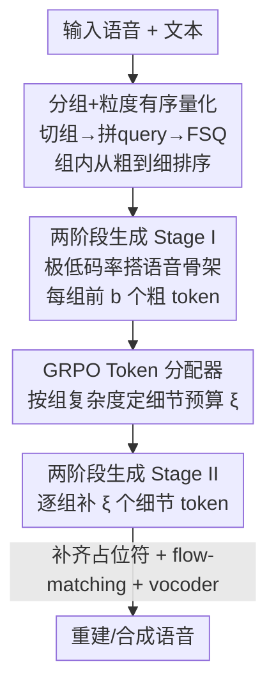

# Gogo: Group-wise Granularity-ordered Codec for Stable and Efficient Speech Generation

**会议**: ICLR 2026  
**OpenReview**: [https://openreview.net/forum?id=JbLmIoWwDC](https://openreview.net/forum?id=JbLmIoWwDC)  
**代码**: Demo 页 https://happycolor.github.io/gogo （无开源仓库）  
**领域**: 语音生成 / 语音编解码器 / 语音语言模型  
**关键词**: 语音 codec、粒度有序量化、两阶段 TTS、token 自适应分配、GRPO

## 一句话总结
本文提出 Gogo——一种把连续若干帧打成「组」、并在组内把 token 按「从粗到细」排序的语音编解码器：粗 token 编码高层语义、细 token 逐步补回声学细节；在此之上构建两阶段语音语言模型 GogoSpeech（先用极低 token 率搭骨架、再补细节）和一个 GRPO 训练的 token 分配器（按各组复杂度动态分配预算），在 47 Hz 的极低 token 率下取得 SOTA 重建质量，并在长语音零样本 TTS 上做到更稳更省。

## 研究背景与动机

**领域现状**：语音语言模型（SLM）把 LLM 范式搬到语音上——先用音频 codec 把波形离散成 token，再像建模文本一样自回归地建模文本+语音 token。这条流水线成败的关键，全压在 codec 身上：它产出的 token 既要含有高层线索（内容、语义、结构属性）让自回归模型好建模，又要保留低层细节（声学波动）保证听感质量。

**现有痛点**：传统 codec（EnCodec、DAC 等）走的是**逐帧量化**——每一帧独立压缩。这套范式重建保真度高，但有很强的「局部性偏置」：每个 token 只盯着一小段波形，很难凝练出高层线索。后来的工作往里塞自监督表示（SpeechTokenizer、Mimi）或 ASR 特征（S3 tokenizer）来注入语义，但**逐帧量化这个底座没动**，学高层信息的能力仍受限。另一个被忽视的问题是语音的信息密度天然**不均匀**：静音段几乎没信息，复杂发音段信息密集，而现有 codec 给所有片段分配同一码率，导致简单段冗余编码、生成效率低。

**核心矛盾**：高保真重建（需要细粒度、高码率的逐帧 token）和高效稳定的自回归建模（需要少量、高层、序列短的 token）之间存在结构性冲突；逐帧范式只能在两端二选一，且无法随信息密度伸缩码率。

**本文目标**：① 打破逐帧量化，让一个 codec 同时产出「适合自回归」的粗 token 和「保细节」的细 token；② 让生成框架能先抓主干再补细节，提升稳定性、缓解误差累积；③ 让码率随语音复杂度自适应，省掉静音等简单段的冗余 token。

**切入角度**：作者观察到，如果把若干连续帧打包成「组」、在组内强行让 token 排成「从粗到细」的顺序，那么前几个 token 自然会去抢着编码全局/高层信息（因为只保留它们也要把 loss 压到最低），后几个 token 才负责补声学细节。这样一来，同一套 token 就内生地分了层，下游可以「按需取用前 k 个」。

**核心 idea**：用「分组 + 组内粒度有序量化」替代逐帧量化，让单一 codec 产出从粗到细的层级 token；再把生成拆成「先搭低码率骨架、后补细节」两阶段，并用强化学习训练的分配器按组复杂度动态决定补多少细节 token。

## 方法详解

### 整体框架

系统由三块串成：**Gogo 编解码器**负责把语音离散成「组内从粗到细」的 token、并能从这些 token 重建回波形；**GogoSpeech**是建在 Gogo token 之上的两阶段语音语言模型，先生成高层骨架、再丰富细节；**Token 分配器**在第二阶段动态决定每个组要补多少细节 token。

具体地，输入波形先取 mel 谱，沿时间轴切成不重叠的「组」（每组 $g$ 帧），每组拼上 $n_q$ 个可学习 query，过 Transformer 编码器后只在 query 位置做有限标量量化（FSQ），得到这一组的 $n_q$ 个 token——它们被训练成从粗到细排列。重建时这些 token 补齐占位符、拼回时间轴，喂给 flow-matching 模型预测 mel 谱，再由 Vocos vocoder 还原波形。在生成端，GogoSpeech 把每组的前 $b$ 个 token 当作「语音骨架」，Stage I 用文本在极低 token 率（约 14 Hz）下逐组生成骨架，Stage II 再逐组把剩余细节 token 补上；token 分配器看着每组骨架，决定这一组到底补几个细节 token，简单段（如静音）少补甚至不补。

### 关键设计

**1. Gogo：分组 + 组内粒度有序量化，让单套 token 自内生分粗细**

这一设计直接针对「逐帧量化学不到高层线索」的痛点。Gogo 不再逐帧独立量化，而是把连续 $g$ 帧的 mel 谱拼成一组 $x_i \in \mathbb{R}^{g\times d}$，再给每组拼上 $n_q$ 个可学习 query，得到 $z_i=\mathrm{Cat}(x_i, q_i)$；Transformer 编码后丢掉 $x_i$ 部分，只对 query 位置做 FSQ，于是每组被压成 $n_q$ 个 token $s_i$。这等于让 query 去「问」整组该记什么，天然能跨帧凝练出全局信息。

要让这 $n_q$ 个 token 真的排成「从粗到细」，靠两个机制。其一是**嵌套 dropout**：训练时均匀采样一个保留数 $n_k\in\{1,\dots,n_q\}$，把后 $(n_q-n_k)$ 个 token 换成 mask。这逼着模型把最关键的高层抽象塞进靠前的 token（因为常常只有它们被保留），把难、易波动的细节甩给靠后的 token。由于靠后 token 很少被保留、梯度更新少，作者再给第 $j$ 个 token 的梯度乘上权重 $w_j = 0.5/(1-(j-1)/n_q)$ 做补偿，更新越少的 token 权重越大。其二是**loss 平衡器**：按当前 $n_k$ 动态调 ASR 损失和 flow-matching（CFM）损失的系数，

$$\lambda_{\mathrm{CFM}} = \lambda_{\min} + \frac{(n_k-1)(\lambda_{\max}-\lambda_{\min})}{n_q-1},\quad \lambda_{\mathrm{ASR}} = \lambda_{\max} - \frac{(n_k-1)(\lambda_{\max}-\lambda_{\min})}{n_q-1}.$$

$n_k$ 小（只留粗 token）时让 $\lambda_{\mathrm{ASR}}$ 占主导，逼粗 token 多记语言内容；$n_k$ 大（细 token 也在）时让 $\lambda_{\mathrm{CFM}}$ 占主导，逼细 token 多管声学细节。重建侧用 conditional flow matching 训练向量场把高斯噪声搬到 mel 分布，损失 $L_{\mathrm{CFM}}=\mathbb{E}\big[\|v_\theta(x_t,\bar x,t)-(x_1-x_0)\|_2^2\big]$，再加上 AR prior 和 ASR 两个辅助模块（分别鼓励 query 学组内时序依赖与语言信息）。探针实验证实这套排序确实生效：前 3 个 token 主要编码时长、清浊比、词数、语言内容等全局高层信息，中间 token 编码语速、jitter、shimmer 等韵律，末 3 个 token 才负责 pitch、能量、谱质心这些细节声学。

**2. GogoSpeech：两阶段「先搭骨架后补细节」生成，把稳定性和效率一起拿到**

有了粒度有序 token，生成就能拆层做。把所有组的 token 摞成矩阵 $S\in\mathbb{R}^{n_g\times n_q}$，每组前 $b$ 个 token $S_{:,1:b}$ 定义为「语音骨架」，承载高层线索（本文 $b=3$，骨架 token 率仅约 14 Hz）。**Stage I** 用一个自回归模型，在文本 $y$ 和语音 prompt 骨架的条件下，逐组生成目标语音骨架 $\tilde S_{:,1:b}$，目标是最小化骨架的负对数似然 $L_{\text{stage1}}=-\sum_i\sum_{t=1}^{b}\log P(\tilde S_{i,t}\mid y, \Gamma(S_{:,1:b}),\dots)$。把第一阶段做在极低特征率上，是因为序列更短、token 更「自回归友好」，自回归预测更稳、误差累积更小——这正是逐帧高码率 token 难以做到的。**Stage II** 再逐组把细节 token $\tilde S_{i,b+1:n_q}$ 补上，条件是完整 prompt、已生成组的全部 token，以及当前组刚生成的骨架，恢复到标准特征率保证高保真。困惑度实验直接支撑这套分层：group-wise token 在所有粒度上困惑度都低于 frame-wise（如第 1 个位置 0.9 vs 2.3，第 7 个 204 vs 442），且粗 token 困惑度远低于细 token，说明「先生成好预测的骨架、再补难预测的细节」是有依据的设计而非拍脑袋。

**3. GRPO 训练的 token 分配器：按组复杂度动态裁细节，省掉静音的冗余**

针对「码率不随信息密度伸缩」的痛点，作者在 Stage II 前加一个分配器 $\pi_\omega$，它读每组骨架 $\tilde S_{i,1:b}$，输出一个预算 $\xi_i\in\{0,1,\dots,n_q-b\}$，决定这一组要生成几个细节 token，被跳过的位置用 mask 填。复杂段（发音密集）多给、简单段（静音）少给甚至不给。训练用改良版 GRPO：因为分配器输出空间很小（只有 $n_q-b+1$ 个离散选择），干脆**枚举**所有选择，分别重建语音再算分。奖励是两项之和——$R_n=-\mathrm{Num}(\bar x)$ 惩罚用掉的 token 数、$R_d=-\mathbb{E}[\|\mathrm{Mel}(w)-\mathrm{Mel}(\bar w)\|_2^2]$ 惩罚重建失真，合成 $R=\lambda_n R_n+\lambda_d R_d$（取 $\lambda_n=0.2,\lambda_d=1.0$）。用组相对优势 $A_j=(R_j-\mathrm{mean}(R))/\mathrm{std}(R)$ 估计优势，由于分配器从零初始化故省掉 KL 惩罚项，最终最大化 $J_{\mathrm{GRPO}}$。这样它学会的是「在保住保真的前提下尽量少用 token」的分配策略，把平均 token 率从 47 Hz 压到 36 Hz 而性能仅微降。

### 损失函数 / 训练策略
- **Gogo**：$L_{\text{Gogo}}=\lambda_{\mathrm{CFM}}L_{\mathrm{CFM}}+\lambda_{\mathrm{AR}}L_{\mathrm{AR}}+\lambda_{\mathrm{ASR}}L_{\mathrm{ASR}}$，其中 $\lambda_{\mathrm{AR}}=0.06$ 且 AR prior 梯度放大 50 倍，$\lambda_{\mathrm{CFM}}/\lambda_{\mathrm{ASR}}$ 由 loss 平衡器随 $n_k$ 动态调（$\lambda_{\min}=0.2,\lambda_{\max}=1.8$）。
- **配置**：24 kHz 音频、100 维 log-mel、hop 256、特征率约 94 Hz；组大小 $g=20$、每组 $n_q=10$ 个 query，故 token 率 $=n_q\times(94/g)=47$ Hz；骨架 $b=3$（约 14 Hz）。GogoSpeech 两阶段都从 LLaMA-3.2-1B 初始化并扩词表，vocoder 用预训练 Vocos。
- **数据**：在 Emilia 英文子集（约 5 万小时）上训练 Gogo / GogoSpeech / 分配器。

## 实验关键数据

### 主实验：codec 重建（LibriTTS test-clean）

| 模型 | TPS | UT-MOS | DNS-MOS | PESQ-WB | SIM | WER |
|------|-----|--------|---------|---------|-----|-----|
| Ground Truth | - | 4.13 | 3.83 | 4.64 | 1.00 | 5.86 |
| DAC (高码率) | 600 | 3.78 | 3.75 | 3.52 | 0.98 | 6.10 |
| MagiCodec | 50 | 4.21 | 3.96 | 2.55 | 0.86 | 7.45 |
| X-codec2 | 50 | 4.17 | 3.90 | 2.45 | 0.83 | 6.40 |
| TAAE | 50 | 4.27 | 3.89 | 2.14 | 0.87 | 8.18 |
| **Gogo** | **47** | **4.19** | **3.99** | **2.59** | **0.91** | **6.35** |

在仅 47 TPS 的极低 token 率下，Gogo 在 50 TPS 档位的大多数指标上领先；其 UT-MOS、DNS-MOS 甚至超过真值录音（作者归因于 flow-matching 解码器的生成特性带来更好听感和抗噪）。

### 分析实验：自回归困惑度（group-wise vs frame-wise）

| 方案 | 位置1 | 位置3 | 位置7 | 位置10 |
|------|-------|-------|-------|--------|
| Frame-wise | 2.3 | 84.4 | 441.8 | 691.4 |
| Group-wise | 0.9 | 42.0 | 204.1 | 228.3 |

group-wise token 在所有粒度上困惑度都更低，说明更「自回归友好」；且粗 token 困惑度远低于细 token，直接为两阶段设计提供依据。

### 零样本 TTS（Seed-TTS test-en）+ 分配器消融

| 模型 | SIM | WER | SIM†(长语音) | WER†(长语音) | RTF | SMOS |
|------|-----|-----|------|------|-----|------|
| CosyVoice 2 | 0.654 | 2.380 | 0.701 | 2.324 | 0.549 | 4.331 |
| FireRedTTS-1S | 0.660 | 2.170 | 0.705 | 2.129 | 0.506 | 4.247 |
| **GogoSpeech (47 Hz)** | **0.667** | 2.394 | **0.725** | **1.788** | 0.535 | **4.381** |
| w/ Allocator (47→36 Hz) | 0.662 | 2.469 | 0.717 | 1.845 | 0.455 | 4.253 |

GogoSpeech 取得最高 SIM 和有竞争力的 WER；在**长语音**上 SIM/WER 双双最佳，印证两阶段设计对生成稳定性的提升。加上分配器后平均 token 率从 47 降到 36 Hz、RTF 也降，性能仅微降，说明分配器拿到了效率—质量的良好折中。

### 关键发现
- **分层 token 真的分了工**：探针实验显示前 3 个 token 管全局/语言、中间管韵律、末 3 个管细节声学——粒度有序不是口号而是可验证的现象。
- **稳定性收益在长语音最明显**：短句各家差距不大，但长语音上两阶段「先骨架后细节」让 GogoSpeech 的 SIM/WER 拉开优势，说明低码率骨架确实缓解了误差累积。
- **分配器几乎免费提效**：47→36 Hz（约 23% token 节省）只换来微小的客观/主观降分，复杂度自适应分配的性价比很高。

## 亮点与洞察
- **用「分组 + query + 嵌套 dropout」把单套 token 内生分粗细**，省去了 RVQ 多层残差或语义/声学双 codec 的拼装，一套 codec 同时服务「好建模」和「保细节」两个目标——这个把表示学习的 nested dropout 嫁接到语音 codec 的做法很巧。
- **把 GRPO 用在「枚举式」小动作空间上**：分配器输出只有 $n_q-b+1$ 个离散选择，干脆枚举全部、各自重建打分，绕开了策略采样的高方差，是 RL 在小决策空间里的务实用法，可迁移到其他「离散预算分配」问题。
- **loss 平衡器把「该学什么」和「保留几个 token」绑定**：随 $n_k$ 在 ASR 与 CFM 损失间滑动权重，等于显式告诉模型「粗 token 该偏语言、细 token 该偏声学」，是让粒度排序落地的关键工程细节。

## 局限与展望
- 作者承认：flow-matching 解码器里的占位符 token 偶尔会引入伪影；Gogo 的 47 Hz 仍高于 25 Hz 的低码率 codec；GogoSpeech 基于 Llama-3.2-1B，能否扩展到更大 LLM 待验证。
- 自己看到的：训练只用 Emilia 英文子集，多语种/跨语种泛化未验证；分配器与 GogoSpeech 解耦训练（GRPO 时 Gogo 冻结），两者联合优化的上限未探。
- 改进思路：把占位符替换成可学习的细节先验以减伪影；探索更激进的骨架码率（<14 Hz）或可变组大小，以进一步压缩长语音的序列长度。

## 相关工作与启发
- **vs SpeechTokenizer / Mimi**：它们仍在逐帧量化的底座上注入自监督/语义信息；Gogo 直接换掉逐帧范式，用分组 + 粒度有序量化从结构上学高层线索，而非外挂语义蒸馏。
- **vs AudioLM 这类分层 SLM**：它们也分「语义→声学」两步，但语义阶段通常和声学阶段同 token 率；GogoSpeech 的骨架阶段把 token 率压到约 14 Hz，更接近文本模态的低率，稳定性收益更直接。
- **vs VRVQ / TFC 等可变码率 codec**：它们让每帧量化器数或帧率按重要度/熵自适应，但未把码率变化和重建质量做联合优化、且在 SLM 生成里效果未充分验证；本文用 GRPO 把「token 数」和「重建失真」一起作为奖励联合优化，并直接在 TTS 生成框架里验证了效率收益。

## 评分
- 新颖性: ⭐⭐⭐⭐⭐ 打破逐帧量化、单套 token 内生分粗细 + 枚举式 GRPO 分配器，思路新颖且自洽。
- 实验充分度: ⭐⭐⭐⭐ codec 重建、困惑度、探针、TTS、分配器消融齐全，但仅英文单一语料、无开源代码。
- 写作质量: ⭐⭐⭐⭐⭐ 动机—方法—验证逻辑清晰，公式与图示到位。
- 价值: ⭐⭐⭐⭐⭐ 低码率下 SOTA 重建 + 稳定高效长语音生成，对 SLM/TTS 流水线有直接借鉴价值。

<!-- RELATED:START -->

## 相关论文

- [\[CVPR 2026\] Hierarchical Codec Diffusion for Video-to-Speech Generation](../../CVPR2026/audio_speech/hierarchical_codec_diffusion_for_video-to-speech_generation.md)
- [\[ICLR 2026\] FlexiCodec: A Dynamic Neural Audio Codec for Low Frame Rates](flexicodec_a_dynamic_neural_audio_codec_for_low_frame_rates.md)
- [\[ICLR 2026\] MambaVoiceCloning: Efficient and Expressive Text-to-Speech via State-Space Modeling and Diffusion Control](mambavoicecloning_efficient_and_expressive_text-to-speech_via_state-space_modeli.md)
- [\[ICLR 2026\] Efficient Audio-Visual Speech Separation with Discrete Lip Semantics and Multi-Scale Global-Local Attention](efficient_audio-visual_speech_separation_with_discrete_lip_semantics_and_multi-s.md)
- [\[ICLR 2026\] PrismAudio: Decomposed Chain-of-Thought and Multi-dimensional Rewards for Video-to-Audio Generation](prismaudio_decomposed_chain-of-thought_and_multi-dimensional_rewards_for_video-t.md)

<!-- RELATED:END -->
