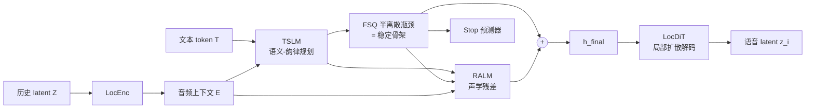

# Hierarchical Semantic-Acoustic Modeling via Semi-Discrete Residual Representations for Expressive End-to-End Speech Synthesis

**会议**: ICLR 2026  
**OpenReview**: [https://openreview.net/forum?id=h5KLpGoqzC](https://openreview.net/forum?id=h5KLpGoqzC)  
**代码**: [https://voxcpm.github.io/VoxCPM-demopage/](https://voxcpm.github.io/VoxCPM-demopage/)（VoxCPM，含 demo）  
**领域**: 语音合成 / TTS / 音频生成  
**关键词**: zero-shot TTS, 端到端语音合成, FSQ 半离散瓶颈, 残差声学建模, 层级语义-声学建模, 局部扩散解码  

## 一句话总结
VoxCPM 用一个**可微的 FSQ 半离散瓶颈**把"语义-韵律规划"和"细粒度声学渲染"在单一端到端模型内自然解耦——TSLM 出稳定语义骨架、RALM 补声学残差、LocDiT 局部扩散出高保真语音 latent，0.5B 模型在 100 万小时数据上训练即拿下开源 zero-shot TTS 的 SOTA，且**完全不依赖外部离散语音 tokenizer**。

## 研究背景与动机
- **领域现状**：现代 TTS 已从"听得清"卷到"像真人"。主流有两条路线：(1) **离散 token 路线**（VALL-E、CosyVoice 系列），把语音用 EnCodec/DAC 等 codec 量化成离散 token、套 LLM 自回归预测，scalable、in-context 能力强；(2) **连续表示路线**（Tacotron2、MELLE、F5-TTS、DiTAR），直接建模 mel/latent，保真度高。
- **现有痛点**：离散路线撞上"**量化天花板**"——压缩不可逆地丢掉细微声学细节；为补救，SOTA 系统改用**多阶段混合管线**（LLM 出离散 token → 独立扩散解码器精修），但这制造了一道**语义-声学鸿沟**：LLM 在抽象离散空间里"不知声学为何物"，扩散模型只做局部精修又"不懂高层语境"，无法端到端优化。连续路线虽避开量化损失，但**语义-韵律规划与声学渲染被强行塞进同一个学习目标**，模型既当全局规划师又当局部渲染师、缺乏天然的架构分工，注意力被低层声学纹理拽走，长序列上误差累积、甚至崩到读不通。
- **核心矛盾**：**表达力 vs 稳定性**——离散稳但牺牲表现力，连续富表现力但因任务纠缠而误差累积。作者进一步点出一个被忽视的瓶颈：直接拿 FSQ/VQ 做离散码本去喂 LLM，维度一升、码本指数爆炸，变成 LLM 根本预测不准的超大稀疏词表。
- **本文目标**：在**单一、端到端可训练**的系统里，对语义-韵律规划与声学渲染做**显式架构分离**，同时既不丢声学细节、又不依赖外部 tokenizer。
- **核心 idea**：**半离散残差表示（semi-discrete residual representation）**。把一个可微 FSQ 层当作**内部瓶颈而非预测目标**，诱导出自然分工——量化后的"骨架"承载稳定语义-韵律内容，连续"残差"承载声学细节；两者求和后引导局部扩散解码器，整套架构在一个简单扩散目标下端到端训练。

## 方法详解

### 整体框架
VoxCPM 是一个**层级自回归**模型，逐 patch 生成连续语音 latent $Z=\{z_1,...,z_M\}$（每个 $z_i\in\mathbb{R}^{P\times D}$ 是 $P$ 帧、$D$ 维 VAE latent 的一段），条件于文本 token $T$，分解为 $p(Z|T)=\prod_i p(z_i|T,Z_{<i})$。每个 patch 的生成核心是把"骨架 + 残差"求和成统一条件信号 $h_i^{\text{final}}$ 去喂局部扩散解码器：

$$z_i \sim \text{LocDiT}(h_i^{\text{final}}),\quad h_i^{\text{final}}=\underbrace{\text{FSQ}(\text{TSLM}(T,E_{<i}))}_{\text{稳定骨架}}+\underbrace{\text{RALM}(\cdot)}_{\text{声学残差}}$$

其中 $E_{<i}=\text{LocEnc}(Z_{<i})$ 是历史音频上下文。四大模块串成一条流水线：LocEnc 压缩历史 latent → TSLM 出语义-韵律表示 → FSQ 卡成半离散骨架 → RALM 补声学残差 → LocDiT 扩散出高保真 latent，梯度（含经 straight-through 的 FSQ）贯穿全程。

### 关键设计

**1. 半离散 FSQ 瓶颈：把量化当"正则"而非"预测目标"，逼出语义稳定性。** 这是全文的命门。TSLM（24 层，从预训练文本 LLM MiniCPM-4-0.5B 初始化，直接吃 BPE 文本 token 而非 phoneme）先产出连续语义-韵律隐状态，FSQ 把每一维做确定性标量量化 $h_{i,j}^{\text{FSQ}}=\Delta\cdot\text{clip}(\text{round}(h_{i,j}^{\text{TSLM}}/\Delta),-L,L)$，前向离散、反向走 straight-through 保持可微。关键在于作者对 FSQ 的**用法颠覆**：传统离散路线把量化后的码当作 LLM 要预测的目标（于是维度一高码本就爆炸），而这里 FSQ **只是数据流中间的一个可微归纳偏置**——类比 RVQ 的第一层，捕获"内容 + 语调"这类粗粒度语义-韵律骨架，给模型一个清晰信号"什么信息该被保留"，从而减轻 TSLM 的建模负担、压制长序列误差累积。它还故意用比标准 FSQ **大得多的维度**（故称 "semi-discrete"，半离散）以保证信息容量。消融印证了这是个"summary space"甜点：维度太低（d4）过度约束、韵律容量不足；太高（d1024）离散强度不够、任务纠缠仍在；d256 最优。

**2. 残差声学建模 RALM：显式分工，专攻骨架丢掉的声学细节。** FSQ 卡掉的细粒度声学信息（说话人音色、谱精细结构、微韵律）由 RALM（6 层，随机初始化）专门找回。它条件于文本部分的 TSLM 隐状态、语音部分的半离散表示、以及历史声学嵌入：$h_i^{\text{residual}}=\text{RALM}(H_{\text{text}}^{\text{TSLM}},H_{<i}^{\text{FSQ}}\oplus E_{<i})$。最终条件 $h_i^{\text{final}}=h_i^{\text{FSQ}}+h_i^{\text{residual}}$ 用**残差相加**把"语义稳定"和"声学表现力"合成一路信号。这套设计催生天然的**劳动分工**：TSLM+FSQ 通路管内容稳定与韵律连贯，RALM 通路管声学表现力与说话人特征——T-SNE 可视化显示 TSLM-FSQ 输出随文本内容聚成语义-韵律结构、RALM 残差则呈强说话人相关变化，分工确实成立。

**3. 局部扩散解码 LocDiT + 流匹配端到端目标：把生成做成"outpainting"。** LocDiT 沿用 DiTAR 的双向 Transformer，在每个 patch 内做全感受野建模；并把**前一个 patch $z_{i-1}$ 作为额外条件**，把任务从"独立生成 patch"改写成"续画（outpainting）"，实测显著提升一致性；同时以一定概率 mask 掉 LM 引导以支持推理期 CFG。整套模型用**条件流匹配**目标端到端训练 $L_{\text{FM}}=\mathbb{E}\big[|v_\theta(z_i^t,t,h_i^{\text{final}},z_{i-1})-\tfrac{d}{dt}(\alpha_t z_i^0+\sigma_t\epsilon)|^2\big]$，再加一个挂在 FSQ 输出上的二元停止损失 $L_{\text{Stop}}$ 判定序列结束，合并目标 $L=L_{\text{FM}}+\lambda L_{\text{Stop}}$。梯度回传穿过整条自回归层级（含 FSQ 的 STE、TSLM、LocEnc），让"规划-稳定-精修"三种角色在统一目标下协同学到。底层另配一个**因果 VAE**（mel 重建 + 多周期/多尺度判别器对抗 + 极小 KL）压到 latent 空间，因果性保证编解码可流式、支持低延迟实时。

## 实验关键数据

### 主实验表格（SEED-TTS-EVAL，开源系统对比，节选）

| 模型 | 参数 | 数据/小时 | EN WER↓ | EN SIM↑ | ZH CER↓ | ZH SIM↑ | Hard CER↓ |
|------|------|-----------|---------|---------|---------|---------|-----------|
| F5-TTS | 0.3B | 100K | 2.00 | 67.0 | 1.53 | 76.0 | 8.67 |
| CosyVoice2 | 0.5B | 170K | 3.09 | 65.9 | 1.38 | 75.7 | 6.83 |
| IndexTTS 2 | 1.5B | 55K | 2.23 | 70.6 | 1.03 | 76.5 | 7.12 |
| FireRedTTS-2 | - | 1.4M | 1.95 | 66.5 | 1.14 | 73.6 | - |
| HiggsAudio-v2 | 3B | 10M | 2.44 | 67.7 | 1.50 | 74.0 | 55.07 |
| **VoxCPM** | **0.5B** | 1.8M | **1.85** | **72.9** | **0.93** | **77.2** | 8.87 |

VoxCPM 以 0.5B 体量在 EN-WER / ZH-CER / 双语 SIM 上同时拿下开源最优，意图明确、说话人相似度高，且不靠堆参数（远小于 1.5B~3B 的对手）。

### 消融实验表格（FSQ 维度 + 核心架构，Emilia 200K 步）

| 设置 | EN-WER↓ | ZH-CER↓ | ZH-hard CER↓ |
|------|---------|---------|--------------|
| default (FSQ d256s9) | **2.98** | **1.77** | **18.19** |
| FSQ d4s9（维度过低） | 5.18 | 4.05 | 19.55 |
| FSQ d1024s9（离散太弱） | 3.07 | 2.38 | 20.38 |
| w/o FSQ（纯连续 d1024s∞） | 3.67 | 2.30 | 24.92 |
| w/o RALM: TSLM(24L) → LocDiT | 4.34 | 3.05 | 25.00 |
| w/o RALM: TSLM(30L 部分LM init) | 4.12 | 3.07 | 26.20 |
| w/o $E_{<i}$ in RALM | 4.91 | 4.94 | 27.17 |
| w/o $h^{\text{residual}}$（TSLM→FSQ→LocDiT） | 3.86 | 3.05 | 23.65 |
| Hierarchical, w/o LM init in TSLM | 5.24 | 2.41 | 24.66 |

### 关键发现
- **FSQ 瓶颈是稳定性的命根**：去掉 FSQ 的纯连续模型在硬样本上崩到 ZH-CER 24.92%，印证"连续空间里语义与声学纠缠 → 误差累积"的核心假设；维度存在甜点（d256 最优）。
- **层级分工 > 单纯堆容量**：单流模型从 24 层加到 30 层只把 EN-WER 从 4.34 降到 4.12（边际收益），而引入层级结构直接降到 2.98——分工才是稳定与表现力的主因；即便 TSLM/RALM 都随机初始化，层级设计仍优于同等单流。
- **残差声学输入不可缺**：去掉 RALM 的原始声学嵌入 $E_{<i}$ 后 ZH-CER 飙到 4.94，说明 RALM 确需细粒度声学信息才能还原音色细节。
- **预训练文本 LLM 初始化关键**：去掉 LM 初始化 EN-WER 从 2.98 退到 5.24，但随机初始化时 SIM 略升，暗示没有语言学先验时模型会把更多容量挪去建声学。
- **真实场景鲁棒**：CV3-EVAL 上 ZH-CER 3.40% / EN-WER 4.04%，CV3-Hard-EN WER 7.89% 甚至超过闭源 CosyVoice 3；DNSMOS 偏低是因为它**忠实克隆了 prompt 录音环境**（prompt 本身 DNSMOS 就低）。

## 亮点与洞察
- **把"量化"从预测目标降格为正则化瓶颈**，一举绕开离散路线的码本爆炸问题，又借到离散表示的稳定性——这是对 FSQ/VQ 用法的一个聪明重定位。
- **"半离散 + 残差"= 在单一端到端框架内实现功能解耦而非架构碎片化**，既拿到多阶段管线的分工好处，又免去阶段间不可端到端优化、依赖外部 tokenizer 的弊病。
- **直接吃 BPE 文本 + 预训练 LLM 初始化**，省掉 phonemizer，文本理解更强；DiTAR 的 phoneme 路线虽稳定性略好但不通用。
- 工程上是个**可流式、低延迟、0.5B、开源**的实用系统，数据效率高（Emilia 100K 小时即与 170K 小时的对手抗衡）。

## 局限与展望
- DNSMOS 在 CV3-Hard 上偏低（虽有"忠实克隆低质 prompt"的合理解释），客观音质指标上对某些 NAR 模型（如 MaskGCT）仍有差距。
- 中文 N-MOS 自然度略逊 IndexTTS 2，作者归因于 prompt 本身有口齿不清/单调音色——但也意味着对 prompt 质量较敏感。
- 依赖 1M+ 小时大规模数据与 40×H100 才能拿到最强结果，复现成本高；FSQ 维度等关键超参需要细调（甜点窄）。
- 因果 VAE、CFG 等细节堆叠，系统组件较多；端到端虽简化了管线但单次前向链路更长。

## 相关工作与启发
- **离散 token TTS**：VALL-E、AudioLM、CosyVoice 1/2/3、SparkTTS、FireRedTTS、IndexTTS2——量化天花板是它们共同的痛，催生混合管线。
- **连续表示 TTS**：Tacotron2、MELLE、NaturalSpeech2、VoiceBox、F5-TTS、**DiTAR**（patch 化因果 LM + 局部扩散，VoxCPM 的 LocDiT 直接借鉴）、VibeVoice——但普遍存在语义-声学纠缠。
- **层级/残差 TTS**：HierSpeech++、HALL-E、MARS6、QTTS 等做过分层或残差量化，但少有把"显式残差设计 + 半离散瓶颈"统一进端到端框架、实现免外部依赖的隐式解耦——这正是本文的卡位点。
- **启发**：可微量化瓶颈作为"诱导分工的归纳偏置"这一思路，可能迁移到其他需要"全局规划 + 局部渲染"解耦的连续自回归生成任务（视频、动作、音乐）。

## 评分
- **新颖性**: ⭐⭐⭐⭐ — "FSQ 当正则瓶颈而非预测目标 + 残差声学建模"的组合在 TTS 里是有辨识度的新卡位，重定位了量化的角色；单点技术多为已有组件（FSQ/DiTAR/流匹配）的巧妙重组。
- **实验充分度**: ⭐⭐⭐⭐⭐ — 1M+ 小时大规模训练 + 两个 benchmark + 主客观评测 + 极其细致的消融（FSQ 维度扫描、层级 vs 容量对照、各输入项剥离、初始化对照、T-SNE 分工验证），证据链完整有说服力。
- **写作质量**: ⭐⭐⭐⭐ — 动机与"任务纠缠→误差累积"的论证清晰，方法公式与图配合到位；组件偏多、术语密集，初读需要消化。
- **价值**: ⭐⭐⭐⭐⭐ — 0.5B 开源拿下 zero-shot TTS SOTA、免外部 tokenizer、可流式低延迟，对工业落地与社区都很实用，且提供了一条解耦表达力/稳定性的可复用思路。

<!-- RELATED:START -->

## 相关论文

- [\[NeurIPS 2025\] E2E-VGuard: Adversarial Prevention for Production LLM-based End-To-End Speech Synthesis](../../NeurIPS2025/audio_speech/e2e-vguard_adversarial_prevention_for_production_llm-based_end-to-end_speech_syn.md)
- [\[ICLR 2026\] MambaVoiceCloning: Efficient and Expressive Text-to-Speech via State-Space Modeling and Diffusion Control](mambavoicecloning_efficient_and_expressive_text-to-speech_via_state-space_modeli.md)
- [\[ACL 2026\] VoxMind: An End-to-End Agentic Spoken Dialogue System](../../ACL2026/audio_speech/voxmind_an_end-to-end_agentic_spoken_dialogue_system.md)
- [\[ICLR 2026\] AC-Foley: Reference-Audio-Guided Video-to-Audio Synthesis with Acoustic Transfer](ac-foley_reference-audio-guided_video-to-audio_synthesis_with_acoustic_transfer.md)
- [\[AAAI 2026\] End-to-end Contrastive Language-Speech Pretraining Model For Long-form Spoken Question Answering](../../AAAI2026/audio_speech/end-to-end_contrastive_language-speech_pretraining_model_for_long-form_spoken_qu.md)

<!-- RELATED:END -->
