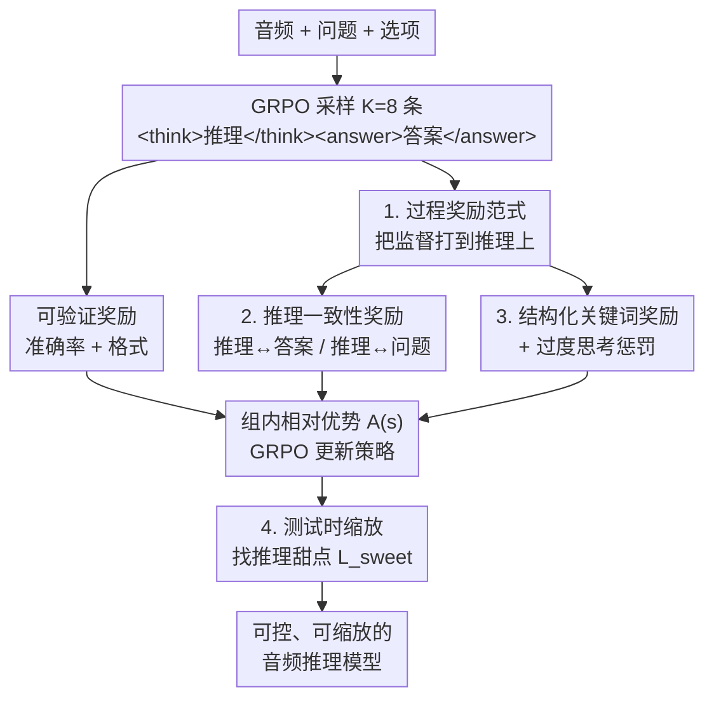

# Incentivizing Consistent, Effective and Scalable Reasoning Capability in Audio LLMs via Reasoning Process Rewards

**会议**: ICLR 2026  
**OpenReview**: [https://openreview.net/forum?id=DUr48hxO2h](https://openreview.net/forum?id=DUr48hxO2h)  
**领域**: 音频语音 / LLM推理  
**关键词**: 音频大模型, 推理过程奖励, GRPO, 测试时缩放, 反向缩放

## 一句话总结
针对音频 LLM「让它思考反而越想越差」（test-time inverse scaling）的怪象，本文用 GRPO 在线强化学习配上一套**奖励推理过程本身**（一致性 / 结构化模式 / 因果逻辑 / 领域知识 / 过度思考惩罚）的多面奖励，把推理从负担变成增益，在 MMAU、MMSU 上刷到 SOTA 并超过 GPT-4o Audio 与 Gemini 2.5 Pro。

## 研究背景与动机
**领域现状**：音频大模型（Audio LLM，如 Qwen2.5-Omni、GPT-4o Audio、Gemini 2.5）已经能做接近人类水平的声学理解，研究前沿正从「听懂」转向「对声音世界做推理」。在文本领域，chain-of-thought（CoT）几乎是推理能力的万灵药。

**现有痛点**：但 CoT 搬到音频上经常**反向起效**——加了思考过程的版本反而比直接答题更差，而且推理链越长结果越烂。本文第一个系统地把这个现象命名为 **test-time inverse scaling（测试时反向缩放）**。作者诊断发现：这不是推理本身的能力极限，而是训练方式的问题——模型在没人教它「怎么想」的情况下被强行要求「想一想」，于是产出幻觉化、前后不一致、逻辑松散的推理链，错误在长链上不断累积。

**核心矛盾**：现有训练范式都治不了这个病根。SFT 在 CoT 数据上微调只是让模型**背模板**，学会写出看起来像样、实则脆弱的推理痕迹；而 RLVR（可验证奖励强化学习，如 R1-AQA、Ke-Omni-R）只盯着**最终答案对不对 + 格式合不合规**这种结果型信号，根本不去惩罚逻辑谬误、也不奖励连贯的分析过程。结果就是模型可以靠错误或无关的推理「蒙对」答案，inconsistency 和 hallucination 始终没解决。

**本文目标**：把推理从一个不可控、随机涌现的现象，变成一种**可控、可训练、可缩放**的技能；具体要同时解决推理-答案不一致、缺乏结构化推理、以及反向缩放三大失效模式。

**切入角度**：既然结果型奖励只监督「终点」，那就把监督信号直接打到**推理过程**上——对推理的语义一致性、结构模式、逻辑深度逐项给出细粒度反馈。

**核心 idea**：从「验证结果」转向「奖励推理过程」（outcome verification → rewarding the reasoning process），用 GRPO + 一套多面奖励套件把推理塑造成可控技能，并在测试时找到模型各自的「推理甜点」（reasoning sweet spot）。

## 方法详解

### 整体框架
CESAR（Consistent, Effective and Scalable Audio Reasoners）的输入是音频-问答样本 $(a_i, q_i, C_i, y_i)$（音频、问题、四选项、标准答案），要训练一个 Audio LLM $\pi_\theta$，让它按 `<think>推理</think><answer>答案</answer>` 的结构化格式同时产出推理链 $t_i$ 和答案 $\hat{y}_i$，从而能把「推理质量」和「答案正确性」分开评估。

整条管线是一个**在线强化学习闭环**：对每个样本用当前策略采样 $K=8$ 条回答，用一套**多面奖励套件**给每条回答打分，再用 GRPO 算组内相对优势、更新策略。这套奖励是关键——它在传统可验证奖励（准确率 + 格式）之外，额外塞进了三类**推理过程奖励**：推理-答案/问题一致性、结构化关键词（模式 + 逻辑 + 领域）、以及过度思考惩罚。训练完后，再通过**测试时缩放**扫描不同的最大思考长度，找出性能峰值所在的「推理甜点」，无需再训练就能进一步提分。

### 关键设计

**1. 从结果奖励到过程奖励的总奖励分解：把监督信号直接打到推理链上**

传统 RLVR 的奖励是 $R_{\text{RLVR}}(s_i) = \mathbb{I}[\hat{y}_i = y_i] + \mathbb{I}[\text{ValidFormat}(s_i)]$，只看答案对不对、格式合不合规，于是模型分不清「真推理」和「碰巧蒙对」，推理行为随机涌现、无法控制。本文把总奖励拆成两块互补的部分：

$$R_{\text{total}}(s_i) = \underbrace{\alpha_1 R_{\text{acc}} + \alpha_2 R_{\text{format}}}_{\text{可验证奖励}} + \underbrace{\alpha_3 R_{\text{consistency}} + \alpha_4 R_{\text{keywords}} + \alpha_5 R_{\text{overthinking}}}_{\text{推理过程奖励}}$$

其中 $s_i = (t_i, \hat{y}_i)$ 是完整输出。可验证奖励保住正确性底线（$R_{\text{acc}} = \mathbb{I}[\hat{y}_i = y_i]$ 防止学出「精致但错误」的推理，$R_{\text{format}}$ 强制 `<think>/<answer>` 标签结构、防止模型绕过推理直接答题）；推理过程奖励则专门塑造推理的质量、一致性与简洁度。权重上准确率最重 $\alpha_1 = 5.0$，其余 $\alpha_{2\text{-}5} = 1.0$——既让过程奖励发挥作用，又不让模型为了「想得漂亮」而牺牲答对率。这一分解是全文的范式转变：监督不再只落在终点，而是覆盖整条推理路径。

**2. 推理一致性奖励：堵住「想的是三、答的是二」这类推理-答案脱节**

最致命的失效模式是 reasoning-answer inconsistency——模型推理里明明分析出「电话响了三次」，最终答案却莫名其妙输出「2」；以及推理跑题、与问题无关时极易产生幻觉。一致性奖励用双向语义对齐同时管住这两头：

$$R_{\text{consistency}}(s_i) = \text{Sim}_{\text{semantic}}(t_i, \hat{y}_i) + \text{Sim}_{\text{semantic}}(t_i, Q_i)$$

其中 $Q_i = (q_i, C_i)$ 是问题加选项的完整上下文。前一项 $\text{Sim}(t_i, \hat{y}_i)$ 逼推理链必须真正支撑它自己的结论，防止推理与答案脱节；后一项 $\text{Sim}(t_i, Q_i)$ 把推理锚定在题目和选项上，压制跑题和幻觉。语义相似度用概念重叠（如重叠词）实现：

$$\text{Sim}_{\text{semantic}}(x, y) = \frac{\text{ConceptOverlap}(x, y)}{\max(|\text{Concepts}(x)|, |\text{Concepts}(y)|)}$$

归一化把分数限制在 $[0,1]$。这等于给「系统性地从前提推出结论」和「碰巧答对」之间划了一条可优化的界线。

**3. 结构化关键词奖励 + 过度思考惩罚：一边奖励有章法的分析，一边惩罚啰嗦空转**

光保证一致还不够，推理还得有结构、有深度，但又不能无限拉长。本文用「正向奖励结构 + 反向惩罚冗长」的两手策略。正向的关键词奖励作为认知脚手架，由三部分组成：

$$R_{\text{keywords}}(s_i) = R_{\text{pattern}}(s_i) + R_{\text{logic}}(s_i) + R_{\text{domain}}(s_i)$$

$R_{\text{pattern}}$ 奖励结构化推理架构（顺序组织、对比分析、系统评估、显式论证等模式被检测到就加分）；$R_{\text{logic}}$ 奖励标志深层逻辑的语言标记（演绎、前提建立、假设推理、证据性结论）；$R_{\text{domain}}$ 用带权重的 $R_{\text{domain}} = \sum_d w_d \cdot \mathbb{I}[\text{Term}_d \in t_i]$ 奖励模型动用声学、音乐、语音、环境音等领域术语，让推理扎根于信号级专业知识而非泛泛套话。

反向的过度思考惩罚则盯住「越想越多、错误越积越多」这个反向缩放的直接元凶：

$$R_{\text{overthinking}}(s_i) = f_{\text{length}}(|t_i|) = 1 - \frac{|t_i|}{L_{\text{max\_output}}}$$

这是一个随推理长度线性衰减的惩罚（$L_{\text{max\_output}}$ 实践中取 256），专治循环推理、重复分析、离题展开。它逼模型学会**在合适深度收住**，培养一种「知道什么时候该停」的元认知，从而避免幻觉在长链上累积。

**4. 测试时缩放与推理甜点：训练好的模型在推理长度上存在一个性能峰值**

光把推理训好还要能在推理时「解锁」它。本文定义测试时缩放：在不同的最大思考长度 $L_{\text{max\_think}}$ 下评估性能 $P(L_{\text{max\_think}}) = \mathbb{E}[\mathbb{I}[\hat{y}=y] \mid |t| \le L_{\text{max\_think}}]$，并把性能峰值处的长度称为**推理甜点** $L_{\text{sweet}} = \arg\max_L P(L)$。这一分析本身既是诊断工具（用来揭示反向缩放：差模型随长度坍塌或剧烈震荡），也是免训练的提分手段——CESAR 的性能会随推理长度稳步爬升到峰值，且带过度思考惩罚的完整版能在**更短的链长（约 35–40 token）**上找到更优的甜点、拿到更高的峰值准确率，而基线模型要么坍塌要么毫无收益。

### 损失函数 / 训练策略
用 GRPO 实现过程导向控制：对每个样本采样 $K=8$ 条回答，优化 $L_{\text{GRPO}} = L_{\text{PG}}^{\text{multi-faceted}} + \beta \cdot L_{\text{KL}}$。策略梯度项 $L_{\text{PG}} = -\mathbb{E}[\sum_k A(s^{(k)}) \log \pi_\theta(s^{(k)} \mid a, q, C)]$，优势函数用**组内相对**形式 $A(s_i^{(k)}) = R_{\text{total}}(s_i^{(k)}) - \frac{1}{K}\sum_j R_{\text{total}}(s_i^{(j)})$，让模型分辨同一题里高质量与低质量推理；KL 正则 $L_{\text{KL}} = \mathbb{E}[\text{KL}(\pi_\theta \| \pi_{\text{ref}})]$ 维持训练稳定。此外对训练集做**答案不变的数据增广**：用模板 $T = \{T_1, \dots, T_M\}$ 对每个问题生成多种语言变体 $q'_{i,k} = T_k(q_i, C_i)$、保持音频与答案不变，逼模型学底层推理模式而非表层文本相关性。基座模型为 Qwen2.5-Omni-7B，训练用 AVQA 数据集。

## 实验关键数据

### 主实验
在 OOD 的 MMAU Test-mini（1k 题，覆盖语音/声音/音乐 27 种推理技能）上，CESAR 刷到 SOTA，超过 GPT-4o Audio 与 Gemini 2.5 Pro：

| 方法 | 推理 | Sound | Music | Speech | 总准确率 |
|------|------|-------|-------|--------|---------|
| **CESAR** | ✓ | 83.48 | 73.05 | 74.77 | **77.10** |
| CESAR | ✗ | 79.88 | 67.96 | 73.27 | 73.70 |
| CESAR w/o 过度思考惩罚 | ✓ | 81.98 | 70.06 | 77.48 | 76.50 |
| Ke-Omni-R（RL 基线） | ✓ | 79.28 | 70.06 | 74.47 | 74.60 |
| Gemini 2.5 Pro | - | 75.08 | 68.26 | 71.47 | 71.60 |
| GPT-4o Audio | - | 64.56 | 56.29 | 66.67 | 62.50 |
| Qwen2.5-Omni-7B（基座） | ✓ | 69.07 | 59.58 | 66.97 | 65.20 |
| Qwen2.5-Omni-7B（基座） | ✗ | 72.37 | 64.37 | 69.07 | 68.60 |

值得注意的是基座模型「加推理（65.20）反而比不加（68.60）更差」，正是 test-time inverse scaling 的直接证据；而 CESAR 加推理（77.10）显著高于不加（73.70），说明病被治好了。在 MMSU（5k 题，区分感知与推理任务）上，CESAR 推理任务整体 81.07、逼近人类（86.77），语义推理甚至超人类；感知任务也领先同尺寸竞品，但相对人类仍有「感知瓶颈」。在「野外」难基准 MMAU-Pro 上，CESAR 以 56.4% 成为最强 7B 模型，超过 GPT-4o Audio（52.5）与 Audio Flamingo 3（51.7），仅次于 Gemini 2.5 Flash（59.2）。

### 消融实验
| 配置 | MMAU 总准确率 | 说明 |
|------|--------------|------|
| CESAR（完整，含 OP） | 77.10 | 甜点链长仅约 35–40 token |
| CESAR w/o 过度思考惩罚（OP） | 76.50 | 峰值更低、且需更长推理链 |
| Ke-Omni-R（仅结果奖励 RL） | 74.60 | 缺过程奖励 |
| Qwen2.5-Omni-7B（基座 + 推理） | 65.20 | 反向缩放，越想越差 |

AI-as-judge（GPT-4o Audio 评判）与人类评测进一步从「质量」而非「准确率」角度验证：人类评测中 CESAR 对基座 Qwen2.5-Omni 的推理过程胜率 **88.60%**，对强 RL 基线 Ke-Omni-R 胜率 **63.10%**（基于 3 名标注者、3000+ 次盲评判断）。

### 关键发现
- **过度思考惩罚（OP）是「甜点」的关键**：去掉它峰值从 77.1% 降到 76.5%，且需要更长的推理链才到峰值；加上它能用约 35–40 token 的短链拿到更高峰值，说明「会收住」比「想得多」更重要。
- **过程奖励 vs 结果奖励的代差**：CESAR（77.10）相对仅用结果奖励的 Ke-Omni-R（74.60）的优势，在「指令遵循」「开放式问答」等推理密集类目上尤其明显，证明过程奖励培养出更鲁棒、可泛化的推理。
- **协同效应**：增强推理同时提升了多模态推理与底层感知能力——CESAR 不加推理的版本（73.70）也比基座高出一大截，说明过程训练实打实改造了模型的认知能力而非只学了套花招。

## 亮点与洞察
- **命名并诊断了 test-time inverse scaling**：第一次系统指出「音频里加 CoT 反而更差」不是推理无用，而是没教好怎么推理——把一个反直觉现象归因到可解的训练问题，本身就是很漂亮的问题定义。
- **奖励「过程」而非「结果」的可迁移范式**：把一致性、结构模式、逻辑、领域知识、长度惩罚都做成可计算的奖励项塞进 GRPO，这套思路不限于音频，任何「答案对但推理烂」的 RLVR 场景都能借鉴。
- **一致性奖励用概念重叠近似语义对齐**：不依赖额外打分模型、纯轻量词重叠就堵住了推理-答案脱节，简单且可复现，是个实用 trick。
- **「推理甜点」把测试时缩放变成免训练提分旋钮**：训练时用长度惩罚校准、测试时扫长度找峰值，揭示了模型存在最优推理深度这一可利用的结构。

## 局限与展望
- **感知瓶颈**：作者承认推理已近人类水平，但感知任务相对人类仍有可观差距，是实现全面人类级音频理解的下一关键障碍。
- **奖励项多为基于关键词/模式检测的代理信号**：结构化模式、逻辑、领域奖励都靠词表/模式命中近似，可能被模型「刷词」骗分，且语义相似度用概念重叠是粗近似（⚠️ 公式与实现细节以原文为准）。
- **任务形态较窄**：主要在多选 QA（四选项）上验证，奖励设计（尤其准确率二值奖励）对开放式生成、多轮对话的适配性尚待检验。
- **可改进方向**：把代理式关键词奖励换成更强的过程评判模型、或把一致性/逻辑奖励做成可学习的而非硬编码词表，可能进一步减少 reward hacking。

## 相关工作与启发
- **vs SFT-on-CoT（Ma et al. 2025、Xie et al. 2025）**：他们在 CoT 数据上监督微调，本文用过程奖励 RL；区别在于 SFT 只教模型**模仿推理模板**、脆弱且不泛化，而 CESAR 直接奖励推理的内在质量，培养真正的分析能力。
- **vs RLVR / Ke-Omni-R、R1-AQA（Li et al.、Zhao et al. 2025）**：他们也用 GRPO 但只给结果奖励（答案 + 格式），本文在此之上增加推理过程奖励；优势是治好了结果奖励无法触及的推理-答案不一致与反向缩放，劣势是奖励工程更复杂、引入更多代理信号。
- **vs 文本域 o1 / DeepSeek-R1**：它们证明 RL 能在文本里养出强推理，本文把这一思路落到音频模态，并额外发现了音频特有的反向缩放问题与对应的过程奖励解法。

## 评分
- 新颖性: ⭐⭐⭐⭐⭐ 首次命名诊断音频反向缩放，并提出从结果到过程的奖励范式转变。
- 实验充分度: ⭐⭐⭐⭐⭐ 三个基准 + 测试时缩放 + AI 评判 + 3000+ 人类盲评，验证全面。
- 写作质量: ⭐⭐⭐⭐ 问题定义清晰、动机有力，奖励项的代理实现细节略显粗糙。
- 价值: ⭐⭐⭐⭐⭐ 7B 模型超 GPT-4o Audio / Gemini 2.5 Pro，过程奖励范式可迁移到其他 RLVR 场景。

<!-- RELATED:START -->

## 相关论文

- [\[ICLR 2026\] UALM: Unified Audio Language Model for Understanding, Generation and Reasoning](ualm_unified_audio_language_model_for_understanding_generation_and_reasoning.md)
- [\[ICLR 2026\] OWL: Geometry-Aware Spatial Reasoning for Audio Large Language Models](owl_geometry-aware_spatial_reasoning_for_audio_large_language_models.md)
- [\[ICLR 2026\] PrismAudio: Decomposed Chain-of-Thought and Multi-dimensional Rewards for Video-to-Audio Generation](prismaudio_decomposed_chain-of-thought_and_multi-dimensional_rewards_for_video-t.md)
- [\[ICLR 2026\] STAR-Bench: Probing Deep Spatio-Temporal Reasoning as Audio 4D Intelligence](star-bench_probing_deep_spatio-temporal_reasoning_as_audio_4d_intelligence.md)
- [\[ICLR 2026\] AVERE: Improving Audiovisual Emotion Reasoning with Preference Optimization](avere_improving_audiovisual_emotion_reasoning_with_preference_optimization.md)

<!-- RELATED:END -->
