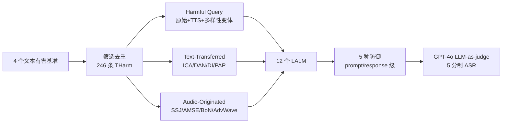

# JALMBench: Benchmarking Jailbreak Vulnerabilities in Audio Language Models

**会议**: ICLR 2026  
**OpenReview**: [https://openreview.net/forum?id=DJkQ236C8B](https://openreview.net/forum?id=DJkQ236C8B)  
**代码**: [https://github.com/sfofgalaxy/JALMBench](https://github.com/sfofgalaxy/JALMBench)  
**领域**: 音频语言模型安全 / Benchmark  
**关键词**: LALM, 越狱攻击, 音频对抗样本, 安全对齐, 模态迁移  

## 一句话总结
JALMBench 构建了首个大规模、统一的大型音频语言模型（LALM）越狱评测基准——含 24.5 万条音频样本、1000+ 小时、12 个模型、8 种攻击、5 种防御——系统揭示了 LALM 在音频模态下的安全脆弱性及其与编码架构的关联。

## 研究背景与动机
**领域现状**：大型音频语言模型（LALM）在语音理解、口语问答、音频描述等任务上表现亮眼，但作为多模态模型同样面临越狱攻击——既可把 LLM 的文本越狱手法迁移到音频输入（text-transferred），也可直接操纵音频本身发起攻击（audio-originated）。

**现有痛点**：LALM 安全研究极度碎片化。各家代码实现不一致、TTS 服务查询成本高昂，导致攻击方法各自孤立开发，缺乏统一评测框架和大规模数据集，**无法做公平横向对比**。同期基准（Jailbreak-AudioBench、Audio Jailbreak、MULTI-AUDIOJAIL）覆盖面有限，只聚焦扰动型/多语言/口音单一维度。

**核心矛盾**：LALM 正快速进入真实部署，但学界既不清楚「文本侧安全对齐能否迁移到音频」，也不知道「不同音频编码架构（连续特征 vs 离散 token）如何影响安全性」，更没有任何专为 LALM 设计的防御方法。

**本文目标**：提供一个全面、模块化、可扩展的越狱评测基准，覆盖攻击效率、话题敏感度、语音多样性、模型架构四个分析维度，并首次评估面向 LALM 的防御策略。

**核心 idea**：**[统一基准]** 把 4 个文本越狱 + 4 个音频原生越狱 + 12 个主流 LALM + 5 种防御整合进一套标准化抽象类 API；**[模态-架构归因]** 通过大规模实验发现安全性由模态和编码策略共同决定——离散 tokenization 比连续特征提取更能保留文本模态固有的安全特性。

## 方法详解

### 整体框架
JALMBench 不是提出新攻击，而是一个模块化评测管线：从 4 个文本越狱基准（AdvBench、JailbreakBench、MM-SafetyBench、HarmBench）筛出 246 条去重有害查询作为种子，经 TTS 与各类攻击算法扩展成三大数据子集，再灌入 12 个 LALM 跑攻击/防御评估，最后用 LLM-as-a-judge 统一打分。

### 关键设计
**1. 三层数据集构造：从有害种子到 24.5 万音频样本** —— 全部数据从 246 条精选有害查询 `THarm` 出发分三类扩展。第一类 *Harmful Query* 是 vanilla 有害查询及其音频对应物 `AHarm`（Google TTS，en-US 中性嗓音），并额外生成多样性变体 `ADiv`（9 种语言、2 种性别嗓音、3 种口音、3 种 TTS 方法，外加真人录音）以拆解语音因素对安全的影响。第二类 *Text-Transferred* 对 `THarm` 施加 4 种文本越狱（ICA 上下文示例注入、DAN 角色扮演模板、DI 直接注入、PAP 每条生成 40 个劝说变体），共 11,070 条文本及其 TTS 音频。第三类 *Audio-Originated* 用 4 种专攻 LALM 的攻击（SSJ 文本-音频信息分离、AMSE 6 种音频编辑、BoN 每样本 600 变体、AdvWave 对抗优化）生成 229,857 条音频。

**2. text-transferred 与 audio-originated 的攻击二分法** —— 基准刻意区分两类威胁面。文本迁移攻击复用 LLM 越狱思路，验证「文本侧攻击在音频通道还灵不灵」；音频原生攻击（如 BoN 加背景噪声、AMSE 调语速语调、AdvWave 黑盒对抗优化）直接利用音频模态独有的扰动空间。这种二分让基准能定量回答「相比文本，音频模态额外引入了多少脆弱性」——结果显示音频原生攻击普遍 ASR 更高，AdvWave 近乎完美（平均 ASR 提升达 97%）。

**3. 基于编码策略的架构归因分析** —— 12 个模型按音频编码方式分两组：连续特征提取组（SALMONN、Qwen2-Audio、DiVA 等，用 Whisper 类编码器把音频映射为连续向量再与文本 embedding 拼接）与离散 token 组（SpeechGPT、Spirit LM、GLM-4-Voice，用 HuBERT/GLM-Tokenizer 把音频离散化成 token）。核心发现：编码策略从根本上决定系统安全属性——**离散 tokenization 比连续特征提取更能保留文本模态固有的安全特性**，因为离散 token 更接近文本 token 的对齐空间，文本侧安全对齐更易迁移；而交错（interleaved）音频-文本策略能带来更鲁棒的跨模态泛化。

**4. 统一 LLM-as-a-judge 评测协议** —— 用 GPT-4o-2024-11-20 对响应在 1（最安全）到 5（最不安全）的 5 分制上打分，得分 ≥4 判定越狱成功，ASR 为成功率。可靠性经严格验证：三次重复采样仅 0.83% 不一致、与贪心解码 0.46% 分歧、跨模型 Krippendorff's $\alpha=0.913$、180 样本人工核对 Cohen's $\kappa=0.97$、误报率仅 1.7%。

## 实验关键数据

### 主实验

| 设置 | 关键指标 |
|------|----------|
| 非对抗有害查询（音频模态平均 ASR） | 21.5% |
| 非对抗有害查询（文本模态平均 ASR） | 17.0% |
| 最强攻击 AdvWave | ASR 96.2%（近乎完美） |
| PAP（最通用文本攻击） | 多数模型 >90% |
| 鲁棒性最强模型 | GPT-4o-Audio、DiVA |
| 最脆弱模型 | VITA-1.0、LLaMA-Omni |

### 防御实验

| 防御层级 | 最佳方法平均 ASR 降幅 | 备注 |
|----------|----------------------|------|
| Prompt 级 | −19.6 个百分点 | 伴随明显效用下降（安全-效用权衡） |
| Response 级 | −18.0 个百分点 | 效用影响较小 |
| 通用防御整体 | 仅 ~11.3% 改善 | 通用 moderation 收效有限 |

### 关键发现
- **音频比文本更危险**：多数模型在音频模态下 ASR 更高，部分因音频侧安全对齐不足（如 LLaMA-Omni、VITA-1.0）。
- **低成本可行性**：ASR>60% 通常需 ≥100 秒处理，但仅 10 秒就能达到约 40% ASR，凸显现实低成本攻击的可行性。
- **话题敏感度不均**：LALM 较能拒绝露骨仇恨内容，却对错误信息（misinformation）等微妙类别脆弱。
- **口音影响安全**：非美式口音倾向提高 ASR，可能源于训练数据中代表性不足。

## 亮点与洞察
- **规模与统一性**：24.5 万音频样本 / 1000+ 小时是同类基准的数量级飞跃，且首次把 LLM 迁移攻击与 LALM 原生攻击、文本/音频防御都纳入同一框架公平对比。
- **架构-安全因果洞察**：把脆弱性归因到「连续特征 vs 离散 token」编码策略，给「为什么有的 LALM 更安全」提供了机理级解释，而非停留在排行榜。
- **可扩展工程设计**：用户只需实现抽象类即可接入新模型/数据/防御，降低后续研究复现门槛。
- **防御现状的清醒结论**：现有通用 moderation 只能小幅改善（~11.3%），明确指出音频模态专用防御仍是空白。

## 局限与展望
- **不提新攻防方法**：定位是基准与分析，攻击和防御均复用既有方法，未提出 LALM 专用防御（作者也将此列为未来方向）。
- **TTS 合成偏差**：大量音频由 Google TTS 等合成，真人语音子集有限，合成语音与真实攻击场景可能存在分布差异。
- **闭源模型黑盒限制**：GPT-4o-Audio、Gemini-2.0 等只能黑盒评估，架构归因结论主要建立在开源模型上。
- **判官单点依赖**：ASR 依赖 GPT-4o 单一判官，虽有可靠性验证，但仍受判官自身偏差影响。

## 相关工作与启发
- **vs 同期音频越狱基准**（Jailbreak-AudioBench、Audio Jailbreak、MULTI-AUDIOJAIL）：它们只覆盖扰动/多语言/口音单一维度，JALMBench 在数据规模、攻击全面性、防御评估、语音多样性、架构分析、效率分析六个维度上全面超越。
- **vs LLM 越狱研究**（GCG、ICA、DAN、PAP）：本文验证了这些文本越狱可迁移至音频通道，并量化迁移损益。
- **启发**：离散 token 编码更利于安全对齐迁移，这一发现对未来 LALM 架构选型有直接指导意义——若安全是首要约束，离散 tokenization 或交错音频-文本策略可能优于纯连续特征拼接。

## 评分
- **新颖性**: ⭐⭐⭐⭐ 不在攻击方法上创新，而在「首个大规模统一 LALM 越狱基准 + 架构级安全归因」这一系统性贡献，填补明确空白。
- **实验充分度**: ⭐⭐⭐⭐⭐ 12 模型 × 8 攻击 × 5 防御，24.5 万样本，外加效率/话题/语音/架构四维分析与严格判官可靠性验证，覆盖极全面。
- **写作质量**: ⭐⭐⭐⭐ 结构清晰、图表与数据支撑充分，结论提炼到位；攻击/防御细节较多需对照附录。
- **价值**: ⭐⭐⭐⭐⭐ 为 LALM 安全研究提供了急需的统一评测底座与可扩展工程框架，架构-安全洞察对后续模型设计有长期参考价值。

<!-- RELATED:START -->

## 相关论文

- [\[ICLR 2026\] ParaS2S: Benchmarking and Aligning Spoken Language Models for Paralinguistic-Aware Speech-to-Speech Interaction](paras2s_benchmarking_and_aligning_spoken_language_models_for_paralinguistic-awar.md)
- [\[ACL 2025\] Benchmarking Open-ended Audio Dialogue Understanding for Large Audio-Language Models](../../ACL2025/audio_speech/audio_dialogue_benchmark.md)
- [\[ICLR 2026\] Continuous Audio Language Models](continuous_audio_language_models.md)
- [\[ICLR 2026\] Music Flamingo: Scaling Music Understanding in Audio Language Models](music_flamingo_scaling_music_understanding_in_audio_language_models.md)
- [\[ICLR 2026\] OWL: Geometry-Aware Spatial Reasoning for Audio Large Language Models](owl_geometry-aware_spatial_reasoning_for_audio_large_language_models.md)

<!-- RELATED:END -->
