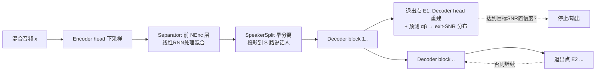

# Knowing When to Quit: Probabilistic Early Exits for Speech Separation Networks

**会议**: ICLR 2026  
**OpenReview**: [https://openreview.net/forum?id=RKzBRfV6J8](https://openreview.net/forum?id=RKzBRfV6J8)  
**代码**: 待确认  
**领域**: 语音分离 / 动态推理 / 概率建模  
**关键词**: 语音分离, 早退出 (early-exit), 不确定性建模, Student-t 似然, 动态计算, TasNet  

## 一句话总结
本文提出 PRESS：用一个"信号 + 误差方差"的概率模型为语音分离网络的每个早退出点估计出**可解释的预测 SNR 分布**，从而在推理时按"达到目标信噪比的置信度"决定何时停止计算，在不损失重建质量的前提下实现动态算力伸缩。

## 研究背景与动机
- **领域现状**：单通道语音分离自 TasNet 以来由深度网络主导，Conv-TasNet、SepFormer、SepReformer 等不断在"每单位算力的分离质量"上刷新 SOTA。但这些都是**静态网络**——计算量和参数量在设计时就固定，无法对"无重叠语音 / 低噪声 / 静音"等简单输入自适应减算力。
- **现有痛点**：这种刚性算力预算让它们很难部署到手机、助听器等嵌入式与异构设备上，这些场景恰恰需要按资源/功耗动态伸缩。早退出 (early-exit) 是引入动态性的一条路，但已有早退出方案有两类硬伤——(1) 通过损失函数**隐式**定义退出条件（重建损失 + 利用率损失的凸组合），性能-算力权衡在训练时就被冻结、推理时无法调整；(2) 基于相邻退出点表征的相似度退出，但这种条件**不挂钩任何性能指标**，不可解释。
- **核心矛盾**：既想让退出条件**直接锚定到可解释的性能度量**（比如"误差已经低于目标 SNR"），又不想要 target 信号（推理时未知），还要避免多目标加权调参的脆弱性。
- **本文目标**：设计一个**带早退出能力**的分离/增强网络，并配一套**不确定性感知的概率框架**，让退出条件能以"期望信噪比"的语言表达，且训练时无需在重建质量与退出精度之间手工调权重。
- **核心 idea**：**概率化建模目标信号与误差方差**——对每个退出点同时预测干净语音估计 $\hat{x}_i$ 和误差方差 $\sigma_i^2$，对方差加共轭逆 Gamma 先验并积分掉，得到 Student-t 似然作为唯一训练目标；再用该分布**推导出预测 SNR 的解析分布**，把"是否退出"变成"目标 SNR 被达到的置信度是否够高"这一可解释判据。

## 方法详解

### 整体框架
PRESS (PRobabilistic Early-exit for Speech Separation) 由两部分组成：一是**概率语音建模**层（提供训练目标 + 退出判据），二是**PRESS-Net 架构**（一个 encoder–separator–decoder 设计，separator 内不做下采样，沿深度方向插入多个能"提前重建"的退出点）。训练时所有退出点共享一个 Student-t 似然目标，求和即可（无需逐退出加权）；推理时每个退出点输出 $(\hat{x}_i,\alpha_i,\beta_i)$，据此评估预测 SNR 是否以足够置信度超过目标，满足则停止后续计算。

### 关键设计

**1. Student-t 似然：一个目标同时学重建与不确定性。** 把目标 $x_j$ 建模为以估计 $\hat{x}_i$ 为均值、$\sigma_i^2$ 为方差的高斯，再对 $\sigma_i^2$ 加共轭逆 Gamma 先验 $\mathrm{InvGam}(\alpha_i,\beta_i)$，积分掉方差后得到多元 Student-t 似然 $L_i = \mathrm{St}(x_j\mid\hat{x}_i,2\alpha_i,\frac{\beta_i}{\alpha_i}I)$，其对数似然 $\ln L_i \propto -(\alpha_i+\tfrac{T}{2})\ln(1+\tfrac{\|x_j-\hat{x}_i\|_2^2}{2\beta_i}) - \tfrac{T}{2}\ln\beta_i + \cdots$。这一项天然在"压低误差/方差比"和"惩罚低估方差"之间取得平衡，因此**单一目标就同时学到了重建质量和误差的不确定性**，省掉了重建损失 + 利用率损失加权这种脆弱配方。多说话人用 uPIT 分配 target，多退出时把所有退出点联合做同一组置换（说话人不能在相邻退出间互换），全部退出与说话人的似然直接相加。

**2. 由分布推导的三个 SNR-like 退出条件。** 有了对 $x_j$ 与误差的分布假设，误差能量等量服从（非中心）卡方分布，因而 SNR、SNRi 都能写成卡方变量之比；当帧长 $T$ 很大时比值集中到条件均值，退化为**平移 Gamma 分布**——如 $\mathrm{SNR}\xrightarrow{T\to\infty}1+z_{\text{SNR}}$，$z_{\text{SNR}}\sim\mathrm{Gam}(\alpha_i,\tfrac{\|\hat{x}_i\|_2^2}{\beta_i T})$。这让退出条件**直接表达为预测信噪比的解析分布**，可以对任意目标电平 $t$ 算出"SNR≥t"的置信度。但单用 SNR 或 SNRi 都会在静音/无干扰时退化（分子趋零），所以再补一个**参考响度条件** $\mathrm{SNR}_{\text{ref}}$：拿固定参考功率 $P_{\text{ref}}^2$ 比预测噪声能量，使"当预测噪声足够安静时也能退出"。

**3. 乐观-悲观两级聚合的统一退出判据。** 对单个说话人，三个条件取互补 CDF 的**最大值**（max）—— $p(\mathrm{SNR}_{\text{exit}}\ge t)=\max\{p(\mathrm{SNR}\ge t),\,p(\mathrm{SNRi}\ge t),\,p(\mathrm{SNR}_{\text{ref}}\ge t)\}$，即**乐观**地"任一条件满足即可退"；跨说话人再取**最小值**（min）并要求超过置信阈值 $p$：$\min_i p(\mathrm{SNR}_{\text{exit}}\ge t)\ge p$，即**悲观**地"所有说话人都满足才退"。一个判据里同时给出了目标电平 $t$（要多干净）和置信度 $p$（多确定），两者**推理时都可调**，性能-算力权衡不再被训练冻结。

**4. PRESS-Net：为"提前重建"而设计的无下采样分离器。** 沿用 SepReformer 的 encoder-separator-decoder 与早分离 (early split)，但 separator 内部**刻意不做下采样**，以便任意深度的退出点都能重建出无明显上采样伪影的语音。由此中间时间分辨率很高、自注意力的二次复杂度不可承受，于是改用**带自门控的线性 RNN** 作主干，配少量跨说话人注意力（线性RNN:说话人注意 = 5:1）。深层稳定性靠 LayerScale（每通道缩放 $\gamma$ 初始化 $10^{-5}$，初始近似恒等映射）+ pre-norm + RMSNorm。前 $N_{\text{Enc}}$ 层处理混合，`SpeakerSplit` 把表征投到 $S$ 路说话人后独立处理，每隔若干 decoder block 放一个退出点（用独立 decoder head 重建并预测逆 Gamma 参数）。

**5. 块级似然与校准微调。** 全局单一 $\sigma_i^2$ 假设误差平稳，对真实音频不现实；**块级似然**改为每 $T$ 个连续样本用独立 $\sigma_{i,b}^2$ 建模（仅控制哪些样本归哪组参数，不要求网络分块跑）。校准用 PIT（把预测 CDF 作用在实测平均误差功率 $\hat{\sigma}_i^2$ 上，理想下应均匀）和 CRPS 评估。论文发现在 4 秒片段上训练后模型对全长音频**校准不佳**，仅用约 3% 额外训练步在全长音频上微调即可让预测分布良好校准，且分离性能也显著提升。

## 实验关键数据

### 主实验表格（WSJ0-2mix / Libri2Mix / WHAM! / WHAMR! 语音分离，SI-SNRi dB）

| 模型 | WSJ0-2mix | Libri2Mix | WHAM! | WHAMR! | #Params(M) | GMAC/s |
|---|---|---|---|---|---|---|
| Conv-TasNet | 15.3 | 12.2 | 12.7 | 8.3 | 5.1 | 10.5 |
| SepFormer | 20.4 | 19.2 | 14.7 | 14.0 | 26.0 | 86.9 |
| SepReformer (T) | 22.4 | 19.7 | 17.2 | – | 3.7 | 10.4 |
| SepReformer (M) | 24.2 | 22.0 | 17.8 | – | 17.3 | 81.3 |
| **PRESS-4 @4 (S)** | 22.91 | 20.04 | 16.49 | 14.54 | 3.4 | 11.3 |
| **PRESS-12 @8 (M)** | 23.47 | 20.42 | 16.57 | 14.67 | 15.6 | 54.4 |
| **PRESS-12 @12 (M)** | 24.28 | 20.88 | 16.65 | 14.69 | 22.4 | 79.7 |
| **PRESS-4 @4 (S) + FT** | 23.41 | 21.01 | 17.25 | 15.13 | 3.4 | 11.3 |
| **PRESS-12 @12 (M) + FT** | 24.36 | 21.29 | 17.49 | 15.67 | 22.4 | 79.7 |

> 一个网络在多个退出点（@4/@8/@12）输出，分离质量随深度单调上升；小模型 PRESS-4 已与同级 SepReformer (T) 相当，全长微调 (+FT) 进一步逼近/超过更大的静态模型。

### 消融实验表格（PRESS-4 (S)，WSJ0-2mix）

| 训练配置消融 | SI-SNRi | SDRi | #Params |
|---|---|---|---|
| (a) SI-SNR 损失 | 22.95 | 23.1 | 3.55M |
| (b) 正态似然 | 22.42 | 22.58 | 3.55M |
| (c) t-似然 + 逐退出 uPIT | 21.1 | 20.97 | 3.55M |
| (d) t-似然 + 6 退出 | 22.89 | 23.01 | 3.57M |
| (e) t-似然 + 12 退出 | 22.9 | 22.99 | 3.66M |
| (f) t-似然 + 200K 微调 | 22.9 | 23.11 | 3.55M |

| 块大小 T | SI-SNRi | 感受野 |
|---|---|---|
| 8000 | 22.82 | 1000ms |
| 2000 | 22.79 | 250ms |
| 500 | 22.69 | 62ms |

### 关键发现
- **(a)** Student-t 似然可直接替换 SI-SNR 而不损失性能（即便它不是尺度不变的）；**(b)** 简单正态似然反而更差（误差未做对数缩放）。
- **(c)** 把相邻退出点**联合置换**至关重要——允许说话人在退出间互换会破坏早分离设计，性能掉到 21.1。
- **(d)(e)** 退出点从 4 增到 6/12 不损害任一退出点性能，支撑了训练 12 退出的大模型。
- 动态推理（图 3/4）：用概率退出条件按目标电平动态选退出点，效率曲线**优于所有静态退出点连成的曲线**；单退出模型在深退出处反而不如联合训练模型。
- **语音增强**（DNS2020，把去噪当作"语音+噪声"两源分离）：PRESS-12 @12 (M) 达 SI-SDR 22.15、STOI 97.13，在同等 GMAC/s 下与 TF-Locoformer/ZipEnhancer 等竞争力相当。

## 亮点与洞察
- **把"退出与否"翻译成一句人话**：不是"两层表征相似度小于阈值"，而是"我有 90% 把握误差已低于 22 dB"——退出条件首次同时挂钩**可解释的性能指标**和**可调的置信度**。
- **一个似然顶替多目标加权**：传统早退出要在重建损失和利用率损失间手工调凸组合且训练时冻结；本文用 Student-t 似然让"重建质量 + 不确定性"在单目标里自洽，权衡推到推理时再选。
- **架构与判据互相成全**：为了能在浅退出点重建好语音，separator 干脆不下采样，逼出了"用线性 RNN 替代自注意力"的高效主干设计；早分离 + 联合置换又保证了退出点之间说话人身份一致。
- **校准是被认真对待的一等公民**：用 PIT/CRPS 量化预测方差是否可信，并发现训练-推理长度不匹配会破坏校准、用极少步全长微调即可修复——这对"基于置信度退出"的可靠性是必要支撑。

## 局限与展望
- **逐说话人独立退出尚未实现**：当前跨说话人取 min（所有人都满足才退），论文明确把"让每个说话人单独早退"列为重要future work。
- **大 $T$ 近似**：SNR 分布退化为平移 Gamma 依赖"帧长很大"的渐近，短块/低延迟在线场景下近似质量与退出可靠性需更谨慎。
- **校准依赖微调**：4 秒片段训练直接用于全长音频会失校，必须额外全长微调才校准良好，说明对训练-推理分布偏移较敏感。
- **增强任务感知质量偏弱**：DNS2020 上 WB-PESQ（如 PRESS-12 3.10）低于专用增强 SOTA（TF-Locoformer 3.72），把增强当两源分离在感知指标上还有差距。

## 相关工作与启发
- **早退出谱系**：图像分类用 entropy 退出 (BranchyNet)、语言模型 Sparse Universal Transformer 用 stick-breaking 停机概率、语音分离用相邻块欧氏距离或学习门控退出——本文的差异是**用概率似然给出可解释、性能锚定、推理可调**的退出条件。
- **TasNet 家族与 SepReformer**：架构主体源自 SepReformer 的早分离 + U-net 风格栈 + LayerScale，但用线性 RNN 替自注意力、separator 不下采样以服务"提前重建"。
- **不确定性/迭代细化**：与 SepIt（用互信息界 SNR 决定停机）、DiffSep/DiffWave（扩散模型可变步数换质量）、PDRE（迭代预测 GMM 但未探索停机准则）相呼应——本文补上了"基于校准的概率 SNR 置信度"这一明确停机判据。
- **启发**：把"动态计算的退出条件"建模成"对性能指标的预测分布"，是一条可迁移到其他回归式任务（如超分、语音增强、时序预测）的通用范式——只要任务有可表达为信噪比/误差比的质量度量。

## 评分
- **新颖性**: ⭐⭐⭐⭐ 把早退出条件重构为"预测 SNR 的解析分布 + 可调置信度"，用 Student-t 似然统一重建与不确定性，思路干净且少见。
- **实验充分度**: ⭐⭐⭐⭐ 覆盖 4 个分离 + 1 个增强语料，主实验/消融/校准/动态效率曲线齐备；增强感知指标偏弱、逐说话人退出未做，略留缺口。
- **写作质量**: ⭐⭐⭐⭐ 概率推导清晰、图（重建谱图 + 退出分布、效率曲线、校准曲线）直观，方法与架构的因果联系讲得透。
- **价值**: ⭐⭐⭐⭐ 面向助听器/手机等资源受限场景的可解释动态分离，单网络多退出 + 推理可调权衡有较强落地潜力。

<!-- RELATED:START -->

## 相关论文

- [\[ICLR 2026\] Toward Complex-Valued Neural Networks for Waveform Generation](toward_complex-valued_neural_networks_for_waveform_generation.md)
- [\[ICLR 2026\] MAPSS: Manifold-Based Assessment of Perceptual Source Separation](mapss_manifold-based_assessment_of_perceptual_source_separation.md)
- [\[ICLR 2026\] Efficient Audio-Visual Speech Separation with Discrete Lip Semantics and Multi-Scale Global-Local Attention](efficient_audio-visual_speech_separation_with_discrete_lip_semantics_and_multi-s.md)
- [\[ICLR 2026\] When and Where to Reset Matters for Long-Term Test-Time Adaptation](when_and_where_to_reset_matters_for_long-term_test-time_adaptation.md)
- [\[ICLR 2026\] When Style Breaks Safety: Defending LLMs Against Superficial Style Alignment](when_style_breaks_safety_defending_llms_against_superficial_style_alignment.md)

<!-- RELATED:END -->
