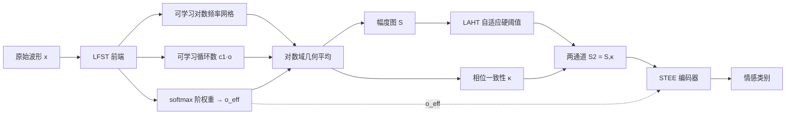

# Learnable Fractional Superlets with a Spectro-Temporal Emotion Encoder for Speech Emotion Recognition

**会议**: ICLR 2026  
**OpenReview**: [https://openreview.net/forum?id=uZGEEL20mU](https://openreview.net/forum?id=uZGEEL20mU)  
**代码**: [https://github.com/alaaNfissi/LFST-for-SER](https://github.com/alaaNfissi/LFST-for-SER)  
**领域**: 语音情感识别 / 可学习时频前端  
**关键词**: speech emotion recognition, learnable front-end, fractional superlet, time-frequency analysis, phase congruency  

## 一句话总结
把经典"超分辨小波"（superlet）改造成完全可微、端到端可学的时频前端 LFST，让频率网格、每频带循环数、分数阶混合权重都由数据学出来，再配一个轻量的 STEE 编码器，用极小参数量在三个语音情感数据集上刷出 SOTA。

## 研究背景与动机
**领域现状**：语音情感识别（SER）的成败很大程度取决于前端如何把原始波形展开成时频（TF）结构。主流前端要么是固定窗长的 STFT / mel 谱，要么是小波变换，要么直接上 wav2vec 2.0 / HuBERT 这类大型自监督模型。

**现有痛点**：(1) STFT 的窗长是死的——长窗频率分辨率高但抹掉短暂事件，短窗反之，情感线索恰恰横跨从微韵律到谱包络的多个时间尺度；(2) 经典小波在高频段循环数太少，频率分辨率退化；(3) 已有的 superlet（用多个不同循环数的小波做几何平均，兼顾时间锐度与频率集中度）以及分数阶 superlet 虽然缓解了"分带"伪影，但阶数、循环数、权重全靠手调，**不是可微的、不能端到端训练**；(4) 自监督大模型虽强，却算力昂贵、可解释性差。

**核心矛盾**：时间分辨率与频率分辨率的取舍长期被当成一个**固定的设计选择**写死在前端里，无法随信号统计和任务目标自适应。

**本文目标**：把这个"时频折中"从固定先验变成**数据驱动的归纳偏置**——让前端自己学该在哪些频带、用多锐的时间/多窄的频率去看信号。

**核心 idea**：**[可学习分数阶 superlet]** 用 softmax 归一化的权重在离散阶上做凸组合，得到每个频带连续可变的"有效阶数"，再用对数域几何平均聚合多个循环数的 Morlet 响应，把频率网格、循环数、阶权重全部塞进反向传播一起训练。

## 方法详解

### 整体框架
系统由两部分串联：前端 **LFST**（Learnable Fractional Superlet Transform）把原始波形变成两通道时频图——幅度 $S$ 和相位一致性 $\kappa$；编码器 **STEE**（Spectro-Temporal Emotion Encoder）消化这两通道、配合有效阶数 $o_{\text{eff}}$ 做 FiLM 调制，最后输出情感类别。整条链路用 focal loss 端到端训练，LFST 的所有参数（频率网格、循环数、阶权重、阈值）都参与梯度更新。

### 关键设计

**1. 学习一整个单纯形上的分数阶混合：从"相邻阶插值"到"全阶凸组合"** 经典分数阶 superlet 只在相邻整数阶 $\{o_i, o_i+1\}$ 之间插值，参与的循环数集合仍在整数处跳变，本质是分段的。本文给每个频带 $f_i$ 的每个阶 $o\in\{1,\dots,O\}$ 学一组 logits $\theta_{i,o}$，经 softmax 得到落在单纯形上的权重 $w_{i,o}=\exp(\theta_{i,o})/\sum_{o'}\exp(\theta_{i,o'})$。幅度用对数域加权几何平均聚合 $S_{f_i}(t)=\exp\!\big(\sum_o w_{i,o}\log(|W_{i,o}(t)|+\varepsilon)\big)$，并定义有效阶数 $o_{\text{eff}}(f_i)=\sum_o o\,w_{i,o}\in[1,O]$。这样每个频带得到的是跨所有阶的真正连续混合，彻底消除分带伪影，且对数域流式累加（不显式构造 $[B,F,O,T]$ 大张量）保证数值稳定。

**2. 可学习的对数频率网格与每频带循环数** 频率网格不再均匀写死，而是学一组正增量铺在对数频率上：$\log f_i=\log f_{\min}+\sum_{j<i}\delta_j$，其中 $\delta_j\propto\mathrm{softplus}(\vartheta_{\delta,j})$，配合归一化和累加保证严格单调、端点精确锚定在 $[f_{\min},f_{\max}]$。每频带的基础循环数同样可学：$c_1(f_i)=1+\mathrm{softplus}(\vartheta_{c,i})\ge1$，高阶按经典乘性结构 $c_o=o\cdot c_1$ 展开。这让分辨率自动向音高/共振峰所在的频段集中，正是情感线索最密集的地方。

**3. 加权相位一致性通道 κ** 除了幅度，作者用同一组阶权重度量跨阶的相位对齐程度：$\kappa_{f_i}(t)=\big|\sum_o w_{i,o}\,W_{i,o}(t)/(|W_{i,o}(t)|+\varepsilon)\big|^2\in[0,1]$。它本质是把每个阶的单位相量按权重相加再取模——各阶相位越一致，$\kappa$ 越接近 1。这个通道能压制宽带冲击噪声（让 Happy 的假阳性减少），与 $S$ 拼成两通道输入，并和 $o_{\text{eff}}$ 一起去驱动编码器里的 FiLM 门控。

**4. 可学习非对称硬阈值 LAHT** 只作用在幅度 $S$ 上的逐元素平滑硬阈值去噪器。阈值由原始参数经 softplus 加 tanh 偏置构造并夹到 $[\varepsilon,\tau_{\max}]$，门控用带斜率 $\gamma$ 的稳定快速 sigmoid $\sigma_\gamma(z)=\frac12(\tanh(\frac\gamma2 z)+1)$ 实现近二值但连续可导的开关，映射为 $\mathrm{LAHT}(u)=\sigma_\gamma(u_+-\tau_+)u_+-\sigma_\gamma(u_--\tau_-)u_-$。小系数被推向 0、大系数以单位增益通过，从而在保留瞬态的同时稀疏化、去噪时频激活，对低信噪比的电话录音（NSPL-CRISE）尤其有效。

**5. 紧凑的 STEE 编码器** 用一连串 TF 感知的轻量模块消化两通道图：先是只沿时间的深度卷积 stem（提每频带时间微模式、不早做跨带混合）→ 沿频率的谱残差块（抓短程跨带相关）→ 两个 TF-hybrid 残差块加 SE 通道重标定 → **自适应 FiLM 频率门控**（用 $S,\kappa$ 的时间均值/对数标准差再融合 $o_{\text{eff}}$，经 Linear(5→1) 和 $F\to C$ 投影生成通道门，实现内容感知与阶感知的调制）→ 时间方向定步长降采样后的局部轴向自注意力（只沿时间、线性代价）→ 注意力统计池化（学习加权的均值与标准差）+ 线性分类头。所有卷积都是深度卷积或 1×1，注意力是 1D 局部的，因此参数量比自监督大模型小几个数量级。

## 实验关键数据

### 主实验表格（与 SOTA 对比）

| 方法 | NSPL Acc | NSPL F1 | IEMOCAP Acc | IEMOCAP F1 | EMO-DB Acc | EMO-DB F1 |
|------|----------|---------|-------------|------------|------------|-----------|
| Mirsamadi et al. (2017) | 51.3 | 52.1 | 63.5 | 63.8 | — | — |
| Li et al. (2019) | 68.7 | 69.3 | 81.6 | 82.1 | — | — |
| Zhao et al. (2019) | 67.2 | 67.9 | 52.1 | 52.4 | — | — |
| Tuncer et al. (2021) | — | — | — | — | 88.35 | 88.35 |
| Liu & Kexin (2022) | — | — | — | — | 89.13 | 89.4 |
| **LFST+STEE (ours)** | **76.9** | **76.6** | **87.5** | **86.8** | **91.4** | **90.4** |

三个数据集全部刷新 SOTA；IEMOCAP 上 Cohen's κ=0.833、EMO-DB κ=0.898、NSPL κ=0.708，McNemar 检验相对多数类基线 $p<10^{-30}$ 起，证明增益并非来自类别先验。

### 消融实验表格（相同 STEE，只换前端）

| 前端 | NSPL Acc | NSPL F1 | IEMOCAP Acc | IEMOCAP F1 | EMO-DB Acc | EMO-DB F1 |
|------|----------|---------|-------------|------------|------------|-----------|
| STFT+STEE | 73.1 | 72.7 | 84.8 | 84.0 | 89.0 | 88.2 |
| Wavelet+STEE (Morlet) | 74.6 | 74.6 | 85.4 | 84.8 | 90.1 | 89.5 |
| Fixed superlet+STEE | 74.9 | 74.7 | 86.0 | 85.1 | 90.1 | 89.8 |
| LEAF+STEE | 72.5 | 72.1 | 84.9 | 84.1 | 89.0 | 88.2 |
| **LFST+STEE (ours)** | **76.9** | **76.6** | **87.5** | **86.8** | **91.4** | **90.4** |

容量匹配（同一 STEE 主干、同超参）下，前端从 STFT → 小波 → 固定 superlet → LFST 单调提升，证明增益主要归功于可学习前端而非编码器容量。

### 关键发现
- **误差画像随前端而变**：STFT 在 IEMOCAP 上 Happy↔Angry 混淆更重；小波改善谐波跟踪但瞬态锐度差、Angry 错误上升；固定 superlet 介于两者之间；LEAF 在紧凑 STEE 下退化得像 STFT。
- **各模块各司其职**：学到的分数阶混合锐化窄带准平稳内容（提升 Neutral/Sad），同时保留瞬态时间锐度（利于 Angry/Happy）；$\kappa$ 通道压制宽带冲击；LAHT 抑制低信噪比激活；学到的对数频率网格把分辨率集中到音高/共振峰附近。
- **窄带电话场景最受益**：8 kHz 嘈杂的 NSPL-CRISE 上 LFST 的相对优势最明显，说明可学习去噪+自适应分辨率对真实劣质数据价值更高。

## 亮点与洞察
- **把信号处理的"先验"变成可学的"参数"**：分数阶 superlet 此前是手调的离线工具，本文用 softmax 单纯形 + 对数域几何平均把它整体塞进反向传播，思路干净且数学上有 admissibility / 连续性 / 近似解析性的理论支撑。
- **可解释性与效率兼得**：$o_{\text{eff}}$ 直接告诉你每个频带在用多锐的分析，频率网格可视化能对上音高/共振峰，参数量却比自监督模型小几个数量级。
- **相位一致性通道是被低估的免费信息**：复用同一组阶权重就能算出一个抗宽带噪声的可微通道，几乎零额外参数。

## 局限与展望
- **前端计算开销换结构性**：LFST 每频带要做多阶复卷积，FLOPs/延迟/显存比 STFT、LEAF 更高（附录有量化），是用算力换可解释的时频表示。
- **未与自监督大模型同台**：为公平做容量匹配消融，作者刻意没和微调后的 wav2vec 2.0 / HuBERT 比，把 LFST 接入 SSL 流水线留作未来工作。
- **NSPL-CRISE 为私有数据**：电话场景的结果难以被外部复现，且仅在三个相对小规模数据集上验证，in-the-wild、跨语种迁移仍待检验。

## 相关工作与启发
- **可微前端谱系**：LEAF（参数化 Gabor 滤波器）、SincNet（可学 sinc 带通）开了可学前端的先河，但缺少跨频带连续可调的超分辨机制；SigWavNet、多级小波包则预定义了滤波器形状或层级。LFST 用 superlet 原理同时学频率网格、循环数、分数阶权重，时频铺贴比固定基或全局参数化滤波器组更灵活。
- **启发**：这条"把经典变换可微化再端到端学"的路线对其他领域（EEG、振动信号、雷达）同样适用——凡是有成熟手调时频工具的地方，都可能用类似的 softmax-over-阶 + 对数域聚合改造成可学前端。

## 评分
- **新颖性**: ⭐⭐⭐⭐ 把分数阶 superlet 整体可微化、学习全阶单纯形混合 + 相位一致性通道是干净且少见的贡献，虽建立在 superlet/LEAF/SincNet 等已有工作之上。
- **实验充分度**: ⭐⭐⭐⭐ 三数据集 SOTA + 容量匹配前端消融 + 统计检验（McNemar、CI、Cohen's κ）扎实，但数据集规模偏小、未与自监督大模型对比、含私有数据。
- **写作质量**: ⭐⭐⭐⭐ 数学推导（admissibility、连续性、稳定性条件）与工程实现（数值稳定参数化）都交代清楚，图示完整。
- **价值**: ⭐⭐⭐⭐ 给参数高效、可解释的 SER 提供了一条有理论支撑的实用路线，"经典变换可微化"的范式可迁移到更广的信号领域。

<!-- RELATED:START -->

## 相关论文

- [\[ICLR 2026\] AVERE: Improving Audiovisual Emotion Reasoning with Preference Optimization](avere_improving_audiovisual_emotion_reasoning_with_preference_optimization.md)
- [\[AAAI 2026\] Cross-Space Synergy: A Unified Framework for Multimodal Emotion Recognition in Conversation](../../AAAI2026/audio_speech/cross-space_synergy_a_unified_framework_for_multimodal_emotion_recognition_in_co.md)
- [\[ICLR 2026\] EmotionThinker: Prosody-Aware Reinforcement Learning for Explainable Speech Emotion Reasoning](emotionthinker_prosody-aware_reinforcement_learning_for_explainable_speech_emoti.md)
- [\[AAAI 2026\] Do LLMs Feel? Teaching Emotion Recognition with Prompts, Retrieval, and Curriculum Learning](../../AAAI2026/audio_speech/do_llms_feel_teaching_emotion_recognition_with_prompts_retrieval_and_curriculum_.md)
- [\[ICML 2026\] Sparse Autoencoders for Interpretable Emotion Control in Text-to-Speech](../../ICML2026/audio_speech/sparse_autoencoders_for_interpretable_emotion_control_in_text-to-speech.md)

<!-- RELATED:END -->
