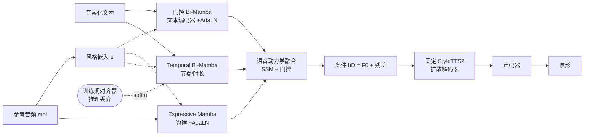

# MambaVoiceCloning: Efficient and Expressive Text-to-Speech via State-Space Modeling and Diffusion Control

**会议**: ICLR 2026  
**OpenReview**: [https://openreview.net/forum?id=0oXyMbPMtP](https://openreview.net/forum?id=0oXyMbPMtP)  
**代码**: [https://github.com/sahilkumar15/MVC](https://github.com/sahilkumar15/MVC)  
**领域**: 语音合成 / 状态空间模型 / 扩散 TTS  
**关键词**: Mamba, State-Space Model, Text-to-Speech, Diffusion, StyleTTS2, 流式合成, 长文本鲁棒性  

## 一句话总结
MVC 把扩散 TTS 的整条**条件路径（文本/节奏/韵律）在推理时做成纯 SSM（Mamba）**，去掉所有注意力与显式循环，仅靠训练期一个用完即弃的轻量对齐器，在固定 StyleTTS2 解码器/声码器下取得对 StyleTTS2、VITS、Mamba-注意力混合体的小幅但统计显著的质量提升，同时把编码器压到 21M 参数、吞吐提升 1.6×。

## 研究背景与动机
- **领域现状**：扩散式 TTS 在自然度和表现力上已很强，但条件编码器（文本、时长、韵律建模）普遍依赖 Transformer 注意力或循环模块。
- **现有痛点**：注意力带来 $O(T^2)$ 的算力/显存开销与全局上下文混合，不利于流式；循环结构则存在长程漂移与状态不稳定。线性注意力虽降渐近复杂度，但仍保留全局交互，流式仍棘手。已有的 Mamba-TTS（如 Jiang/Zhang 2024）**在推理时仍是混合的**——时长或风格模块依旧用注意力，限制了流式稳定性。
- **核心矛盾**：扩散解码器本身才是延迟主导项，所以编码器侧效率成为部署关键；但能否把条件路径**完全**去注意力、去循环又不掉质量，此前没人验证过。
- **本文目标**：在严格匹配的 mel→扩散→声码器流水线下（解码器/声码器固定不动，只改条件路径），验证扩散 TTS 能否采用**推理期全 SSM** 的条件栈。
- **核心 idea**：**[纯 SSM 条件栈]** 三个选择性 SSM 模块——门控双向 Mamba 文本编码器、训练期单调对齐器监督的 Temporal Bi-Mamba、带 AdaLN 调制的 Expressive Mamba——配合**门控前后向融合**替代以往的纯拼接融合，对齐器仅训练期存在、推理期丢弃。

## 方法详解

### 整体框架
从音素化文本和参考音频出发，MVC 产出三条条件流：门控 Bi-Mamba 文本编码器（音素建模）、Temporal Bi-Mamba（节奏/时长对齐）、作用于 mel 的 Expressive Mamba（韵律控制）。三流在"语音动力学"阶段融合后送入**固定的 StyleTTS2 扩散解码器+声码器**合成波形。训练时有一个轻量注意力对齐器提供音素-帧软监督，**推理时彻底移除**，使整个编码器在 $O(T)$ 内运行、无注意力图、激活有界。由于解码器/声码器在 MVC 与所有 baseline 间完全一致，MOS/WER/音高稳定性/运行时的差异可直接归因于条件栈设计。

### 关键设计

**1. 门控双向 Mamba 文本编码器：用门控融合替代拼接，稳住长程韵律。** 文本编码器把自注意力换成前后向两个 Uni-Mamba 选择性扫描 $h_f=\mathrm{Mamba}_f(x),\, h_b=\mathrm{Mamba}_b(x)$，获得 $O(T_x)$ 复杂度与数值稳定的循环动态。关键在于不像以往 bi-Mamba 那样简单拼接，而是引入门控融合 $h_T=\big(\sigma(W_g[h_f;h_b])\odot[h_f;h_b]\big)W_o$，让门控根据局部句法线索调制前后向上下文，从而在 2–6 分钟长段落里保持稳定门控模式、不塌缩、抑制漂移。随后再叠加 AdaLN 注入说话人/风格：$\mathrm{AdaLN}(z,e)=\gamma(e)\odot\mathrm{LN}(z)+\beta(e)$。消融（Table 8）显示去掉门控或 AdaLN 任一项都会显著拉低长文本 MOS 并抬高音高 RMSE，这套"门控+AdaLN"组合是以往 Mamba-TTS 所没有的。

**2. Expressive Mamba 韵律编码器：纯 SSM 注入说话人韵律。** 给定 mel 特征 $M$ 与风格嵌入 $e$，先做带 AdaLN 条件的门控变换得到风格化输入 $h_{M,s}$，再过一个 Mamba 块 $h_E=\mathrm{Mamba}(h_{M,s})$。它完全不含注意力，专门捕捉长输入上缓慢变化的韵律动态。component-removal 消融里，去掉它在 OOD 数据上造成最大的 CMOS 跌幅（−0.41），说明韵律路径是维持挑战性文本自然度的核心。

**3. 训练期对齐器 + Temporal Bi-Mamba：把对齐知识"蒸"进 SSM，推理零注意力。** Temporal Bi-Mamba 建模节奏与音素-时长对齐：风格嵌入广播到帧、经浅门控变换得 $h_S$，前后向 Mamba 加局部 Conv1D 捕捉时序，输出线性融合 $h_B=[h_f;h_b]W_f$（这里刻意不再加第二层门控，因为韵律解耦已由上游完成，加门控只增显存不增益）。训练时一个 2 层 4 头、隐藏 256 的小 Transformer 对齐器用单调对齐损失把 token 编码映射到帧级权重 $\alpha\in\mathbb{R}^{T_m\times T_x}$，给出 $h_A=\alpha\, h_{T,s}$；**推理期对齐器整个丢弃**。作者扰动对齐图证明 MVC 容忍中等对齐噪声（WER 升 <0.4、MOS 降 <0.05），从而保住"推理全 SSM"的部署承诺。

**4. SSM-only 韵律/动力学路径与流式：状态跨块续传换有界显存。** 音高建模融合 $h_E,h_B$ 得 $h_P$ 后线性预测 $F0=h_P W_F+b_F$，避免额外的注意力音高预测器；语音动力学阶段由 Conv1D+SSM 的时序预测器产出节奏感表示，再与 $h_P$ 门控融合得最终条件 $h_D=[\hat F0; n]$ 送入扩散解码器——整条路径在推理时保持线性时间、无注意力。流式时把双向文本编码器换成因果 Uni-Mamba，块边界处 SSM 状态**不重置地向前续传**，并用 look-ahead $L$ 提供未来 $L$ 秒 mel 帧防止边界处过早决策，$L\ge0.5$s 即可保持感知平滑。

## 实验关键数据
训练集 LJSpeech（24h/1 人）+ LibriTTS（245h/1151 人），评测 VCTK 零样本、CSS10（ES/DE/FR）跨语言、2–6 分钟 Gutenberg 长文本。所有模型共享 mel 前端、5 步扩散调度、声码器与优化计划，质量差异只反映条件栈设计。

### 主实验
LibriTTS 未见说话人主观分（MOS-N/MOS-S，越高越好）：

| Model | MOS-N ↑ | MOS-S ↑ |
|---|---|---|
| Ground Truth | 4.60 | 4.35 |
| VITS | 3.69 | 3.54 |
| StyleTTS2 | 4.15 | 4.03 |
| **MVC (ours)** | **4.22** | **4.07** |

LJSpeech 客观指标（三种子均值）：

| Model | F0 RMSE ↓ | MCD ↓ | WER ↓ | PESQ ↑ | RTF ↓ |
|---|---|---|---|---|---|
| VITS | 0.667 | 4.97 | 7.23% | 3.64 | 0.0211 |
| StyleTTS2 | 0.651 | 4.93 | 6.50% | 3.79 | 0.0174 |
| **MVC** | 0.653 | **4.91** | 6.52% | **3.85** | **0.0169** |

长文本（短≤10s / 长>60s）MOS 与 RTF：

| Model | MOS-short | MOS-long | RTF-short | RTF-long |
|---|---|---|---|---|
| StyleTTS2 | 4.15 | 3.91 | 0.0185 | 0.0200 |
| **MVC** | **4.22** | **4.16** | **0.0177** | **0.0170** |

### 消融实验
组件移除（OOD 集，相对完整 MVC 的 CMOS-N 跌幅）：

| 移除组件 | CMOS-N 跌幅 |
|---|---|
| Bi-Mamba 文本编码器 | −0.38 |
| Expressive Mamba 韵律 | **−0.41** |
| Temporal Bi-Mamba | −0.36 |

融合/条件消融（LJSpeech 长文本）：

| 变体 | MOS-long ↑ | Pitch RMSE ↓ | RTF ↓ |
|---|---|---|---|
| **MVC（门控+AdaLN）** | **4.16** | **1.92** | **0.0177** |
| 仅门控（无 AdaLN） | 4.02 | 2.04 | 0.0186 |
| 仅 AdaLN（无门控） | 3.95 | 2.22 | 0.0198 |
| 纯拼接（都无） | 3.64 | 2.89 | 0.0216 |

### 关键发现
- **延迟瓶颈在扩散而非编码器**：500 条 LJSpeech 上扩散解码器占 54.2% 延迟、Mamba 编码栈占 31.4%、声码器 14.4%，所以端到端 RTF 增益温和，但 SSM-only 降低峰值显存、提升条件吞吐。
- **门控+AdaLN 不可或缺**：纯拼接变体长文本 MOS 仅 3.64，远逊完整 MVC 的 4.16——光把注意力换成双向 SSM 不够，门控与风格调制才是追平甚至略超 Transformer 质量的关键。
- **深度甜点在 6 层**：文本编码器 6 层在质量-效率上最优；BiLSTM 同容量下 MOS 最低、RTF 最高，证明选择性扫描比循环堆叠更高效。
- **流式优雅退化**：look-ahead 从 2.0s 降到 0.25s，WER 从 7.3% 升到 11.2%、MOS 从 3.91 降到 3.74，$L\ge0.5$s 即感知平滑。

## 亮点与洞察
- **"推理期全 SSM"是干净的可证伪命题**：以往 Mamba-TTS 都偷偷在时长/风格上留注意力，MVC 第一个把文本+节奏+韵律整条路径都做成 SSM，并用训练期对齐器扰动实验证明不依赖完美对齐。
- **严格协议匹配的诚实定位**：固定解码器/声码器、统一数据与优化，明确把 NaturalSpeech 3/CosyVoice 3/HiggsAudio-V2 列为"靠规模而非架构"的上下文参考而非数值 baseline，把贡献限定为"编码器侧重设计"，避免了不公平比较。
- **门控融合的价值被消融量化**：把"换 SSM"与"加门控+AdaLN"拆开，明确指出前者不够、后者才补回质量，对后续 Mamba-序列建模有借鉴意义。

## 局限与展望
- 只做条件效率，不做细粒度情感控制——AdaLN 提供的是全局而非逐段表现力风格线索。
- 仅在英文数据上训练；跨语言（CSS10）虽泛化尚可，但德语长复合词的重音/停顿仍有偏差。
- **扩散解码器仍是延迟主导项**，编码器提速对端到端 RTF 改善有限，真正的部署收益更多在显存与吞吐。
- 增益绝对值偏小（MOS≈+0.07、RTF≈−0.0005），作者自承是"编码器侧精修"而非范式转变。
- 涉及语音克隆伦理：作者称兼容水印/取证检测并随码发布水印与披露工具，但负责任部署仍需说话人显式同意。

## 相关工作与启发
- **vs. 注意力 TTS（Tacotron/JETS/StyleTTS2）**：强对齐与风格建模但二次复杂度、全局交互不利流式，催生了对线性时间、有界激活条件栈的需求。
- **vs. Mamba 混合体（Jiang/Zhang 2024）**：MVC 用门控前后向融合 + AdaLN 替代纯拼接 bi-Mamba，并用容量匹配 baseline（Hybrid-Mamba、Concat-only）隔离"去注意力"的架构效应。
- **启发**：状态空间模型在序列条件任务里要发挥优势，需配合门控与条件调制（AdaLN）等机制，单纯替换 backbone 往往不足以追平 Transformer；"训练期重模块、推理期蒸成轻量 SSM"是值得推广的部署范式。

## 评分
- **新颖性**: ⭐⭐⭐ — "推理期全 SSM 条件栈"是干净且此前未验证的命题，门控融合+AdaLN 组合有新意，但整体是已有组件（Mamba/StyleTTS2/AdaLN）的精致重组，非范式创新。
- **实验充分度**: ⭐⭐⭐⭐ — 协议匹配严格，覆盖 ID/OOD/零样本/跨语言/长文本/流式，消融到组件级、深度级、融合级，统计检验（Holm–Bonferroni、三种子）扎实。
- **写作质量**: ⭐⭐⭐⭐ — 诚实交代增益小、明确划定 baseline 边界、主张可证伪，论证克制不夸大。
- **价值**: ⭐⭐⭐ — 作为可即插入的高效条件模块对部署友好（显存/吞吐/长文本稳定），但因扩散仍主导延迟、增益绝对值小，实际冲击力偏向工程精修而非突破。

<!-- RELATED:START -->

## 相关论文

- [\[ICLR 2026\] VibeVoice: Expressive Podcast Generation with Next-Token Diffusion](vibevoice_expressive_podcast_generation_with_next-token_diffusion.md)
- [\[ICLR 2026\] Scaling Speech Tokenizers with Diffusion Autoencoders](scaling_speech_tokenizers_with_diffusion_autoencoders.md)
- [\[NeurIPS 2025\] Efficient Speech Language Modeling via Energy Distance in Continuous Latent Space](../../NeurIPS2025/audio_speech/efficient_speech_language_modeling_via_energy_distance_in_continuous_latent_spac.md)
- [\[ICLR 2026\] Hierarchical Semantic-Acoustic Modeling via Semi-Discrete Residual Representations for Expressive End-to-End Speech Synthesis](hierarchical_semantic-acoustic_modeling_via_semi-discrete_residual_representatio.md)
- [\[ICLR 2026\] TASTE: Text-Aligned Speech Tokenization and Embedding for Spoken Language Modeling](taste_text-aligned_speech_tokenization_and_embedding_for_spoken_language_modelin.md)

<!-- RELATED:END -->
