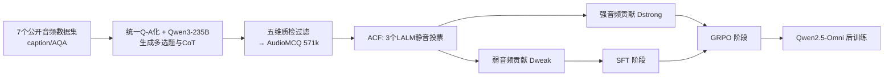

# Measuring Audio's Impact on Correctness: Audio-Contribution-Aware Post-Training of Large Audio Language Models

**会议**: ICLR 2026  
**OpenReview**: [https://openreview.net/forum?id=sJ0jUO9Mxr](https://openreview.net/forum?id=sJ0jUO9Mxr)  
**代码**: 待确认  
**领域**: 音频语言模型 / 后训练  
**关键词**: Large Audio Language Models, Post-Training, Audio-Contribution, GRPO, SFT-to-RL, AudioMCQ  

## 一句话总结
本文揭示音频语言模型（LALM）普遍存在"零音频贡献"现象——把音频换成静音也能答对题，进而提出按"音频贡献度"切分数据的过滤方法与 Weak-to-Strong / Mixed-to-Strong 两段式后训练范式，配合 57 万条 AudioMCQ 数据集，在四大音频理解基准上刷到 SOTA。

## 研究背景与动机
**领域现状**：大型音频语言模型（LALM）是多模态 AI 的重要前沿，处理 ASR、音频描述、音乐理解等多种任务。预训练成本高昂，因此后训练（SFT、RL）成为提升性能的高性价比方向。近期 R1-AQA、Omni-R1 等用 GRPO 强化学习，SARI、Step-Audio2 等用 SFT+RL 多阶段范式，都取得了进展。

**现有痛点**：尽管多阶段范式（SFT 后接 RL）用了更多数据，却**未必稳定超过单阶段后训练**，这等于给后训练的数据规模设了一个隐形上限。原因有二：一是缺乏大规模高质量的 LALM 后训练数据集；二是"如何在 SFT 与 RL 两个阶段之间分配数据"这个核心问题几乎没被系统研究过。

**核心矛盾**：模型常常**不听音频就能答对题**。作者把音频替换成 30 秒静音后评测主流 LALM，发现在 MMAU-test-mini 上平均仍有 49.8% 准确率（随机猜只有 25.5%），MMAR、MMSU 也明显高于随机。这说明很多"音频问答"其实是靠文本线索或预训练知识答出来的，音频根本没起作用——作者称之为**零音频贡献（zero audio-contribution）现象**。

**本文目标**：构建大规模数据集 + 量化每条样本的"音频贡献度" + 据此设计更优的 SFT-to-RL 数据分配策略。

**核心 idea**：**【数据分配视角】** 把音频贡献弱（不听也能答对）的数据用于 SFT 打基础，把音频贡献强（必须听才能答对）的数据留给 RL 阶段精炼感知能力，让两个阶段各取所需。

## 方法详解

### 整体框架
方法由三块串成：先用 7 个公开音频数据集经统一 Q-A 化、Qwen3-235B 生成多选题与思维链、五维质检过滤，构建出 57.1 万条 **AudioMCQ** 数据集；再用 3 个 LALM 在静音输入下投票，把每条样本按"是否必须听音频才能答对"切成**弱/强音频贡献**两个子集（Audio-Contribution Filtering, ACF）；最后据此设计 **Weak-to-Strong** 与 **Mixed-to-Strong** 两段式后训练，在 Qwen2.5-Omni 上微调。

### 关键设计

**1. AudioMCQ 数据集：从描述到高质量多选题的流水线**　六个源数据集只有"音频-描述"对而没有现成问答，作者先用统一模板把它们转成 Q-A 格式，再用 Qwen3-235B 把每条 $(a_i, q_i, c_i)$ 生成为带四个选项（一正三误）和问题类型 $t_i$ 的多选题 $g(a_i,q_i,c_i)=(a_i,q_i^{new},c_i,O_i,y_i,t_i)$，类型空间按数据集特性区分（如 TACOS 只生成 Temporal 时序题）。同时引入**三阶段结构化思维链**——问题类型分析 $r_{1i}$、音频内容分析 $r_{2i}$、答案选择 $r_{3i}$——并用 Qwen3-235B 蒸馏出更短的非结构化 CoT $R^{simple}$ 以支持高效推理研究。最后每条样本经答案一致性、干扰项质量、语言流畅度、推理逻辑、简化推理质量五个维度打分，任一维 <4 即丢弃，得到 571,118 条数据。

**2. 音频贡献度量与零音频贡献现象**　作者把"音频起没起作用"形式化为可计算的指标。给定样本，设 $\hat{y}(a_i,q_i,O_i)$ 为正常输入下的预测、$\hat{y}(0,q_i,O_i)$ 为把音频换成 30 秒**静音** $0$ 后的预测，则音频贡献定义为

$$AC(a_i,q_i,O_i)=\mathbb{I}[\hat{y}(a_i,q_i,O_i)=y_i]-\mathbb{I}[\hat{y}(0,q_i,O_i)=y_i]$$

当 $AC=0$（两种输入预测相同）即为零音频贡献。值得一提的是，作者特意用**静音**而非 MMAU/RUListening 采用的高斯噪声做替换，以更干净地隔离纯文本推理能力。进一步把零贡献拆成两种成因：**Explicit Logical Reasoning**（问题文本里就有线索可直接推出答案）与 **Implicit Knowledge Retrieval**（靠预训练知识猜中），在弱贡献子集中后者占比高达 68.9%。

**3. Audio-Contribution Filtering（ACF）切分数据**　用三个不同的 LALM（A-Flamingo2、R1-AQA、Kimi-Audio）在静音输入下分别作答并投票。设第 $j$ 个模型的正确性指标 $C_j(q_i,O_i,y_i)=\mathbb{I}[y_j(0,q_i,O_i)=y_i]$，切分规则为

$$ACF(q_i,O_i,y_i)=\begin{cases}\text{Weak} & \text{if }\sum_{j=1}^{3}C_j\geq 2\\ \text{Strong} & \text{otherwise}\end{cases}$$

即三个模型里至少两个不听音频就能答对 → 归为**弱音频贡献** $D_{weak}$；否则归为**强音频贡献** $D_{strong}$。这个切分揭示了数据集的内在差异：TACOS（时序推理）强贡献样本高达 73.3%，CompA-R（组合推理）弱贡献样本高达 75.5%；同样把 ACF 用到评测基准上，得到 MMAU-ACstrong 等更严格的"真听懂"评测子集。

**4. Weak-to-Strong / Mixed-to-Strong 两段式后训练**　基于"弱贡献数据适合打基础、强贡献数据适合精炼感知"的洞察，设计两条范式：**Weak-to-Strong** 先在弱贡献数据上 SFT、再在强贡献数据上 GRPO；**Mixed-to-Strong** 先在混合贡献数据上 SFT、再在强贡献数据上 GRPO；并以 Mixed-to-Mixed 为基线。RL 阶段采用 GRPO，用同一问题的多个采样输出的平均奖励作为 baseline（省去价值网络），优化目标为

$$J_{GRPO}(\theta)=\mathbb{E}\Big[\tfrac{1}{G}\sum_{i=1}^{G}\tfrac{1}{|o_i|}\sum_{t=1}^{|o_i|}\big(\min(\rho_{i,t}\hat{A}_{i,t},\text{clip}(\rho_{i,t},1-\epsilon,1+\epsilon)\hat{A}_{i,t})-\beta D_{KL}[\pi_\theta\|\pi_{ref}]\big)\Big]$$

其中 $\rho_{i,t}$ 为新旧策略概率比、$\hat{A}_{i,t}$ 为组内相对优势。所有实验固定 SFT 用 313,177 条、SFT/GRPO 数据不重叠以保证公平比较。

## 实验关键数据

### 主实验表格（Qwen2.5-Omni backbone）

| 方法 | MMAU-test-mini | MMAU | MMAR | MMSU |
|---|---|---|---|---|
| Qwen2.5-Omni（backbone） | 71.5 | 71.0 | 56.7 | 60.6 |
| Audio Flamingo 3 | 73.3 | 72.4 | 60.1 | 62.3 |
| Omni-R1 | 77.0 | 75.0 | 63.4 | – |
| Audio-Thinker | 78.0 | 75.4 | 65.3 | – |
| Gemini-2.0-Flash | 70.5 | 67.0 | 65.6 | 51.0 |
| **Weak AC SFT + Strong AC GRPO** | **78.2** | **75.6** | 65.3 | 69.3 |
| **Mix AC SFT + Strong AC GRPO** | 76.4 | 75.1 | **67.0** | **71.7** |

Weak-to-Strong 在 MMAU 系列拿到 78.2% / 75.6% 的 SOTA；Mixed-to-Strong 在 MMAR / MMSU 拿到 67.0% / 71.7% 的 SOTA。凭 AudioMCQ 还拿下 DCASE 2025 音频问答挑战赛全球第一。

### 消融实验表格（数据质量验证与范式对比）

| 训练策略 | MMAU-test-mini | MMAU | MMAR | MMSU |
|---|---|---|---|---|
| All Data SFT（2000 步） | 75.2 | 75.0 | 64.6 | 64.0 |
| All Data GRPO（1200 步） | 78.1 | 75.4 | 63.0 | 70.2 |
| Mix AC SFT + Mix AC GRPO（基线） | 74.2 | 74.4 | 64.9 | 69.2 |
| Weak AC SFT + Strong AC GRPO | 78.2 | 75.6 | 65.3 | 69.3 |
| Mix AC SFT + Strong AC GRPO | 76.4 | 75.1 | 67.0 | 71.7 |

仅用全量数据 GRPO 就把 MMSU 首次推过 70%（70.2%，较 SFT 的 64% 提升 6.2 个百分点）；两段式范式相比 Mixed-to-Mixed 基线在各基准上都有进一步提升。

### 关键发现
- 静音输入下主流 LALM 在 MMAU-test-mini 仍达 49.8%（随机 25.5%），**零音频贡献现象普遍存在**，且 Sound/Music 类问题比 Speech 类更容易"不听也答对"。
- 不同范式在不同基准上的优劣，**与下游任务自身的音频贡献特性相关**：MMAU-test-mini 弱贡献样本多（53.9%），MMAR 强贡献样本多（67.1%），因此 Weak-to-Strong 与 Mixed-to-Strong 各自在对应基准上更强。
- 把强贡献数据留给 RL 阶段是关键——RL 在"必须听音频"的样本上精炼感知能力，收益最大。

## 亮点与洞察
- **把"音频有没有用"变成可计算指标**：用静音替换 + 指示函数差，给出 $AC$ 的简洁定义，并用多模型投票做数据切分，思路朴素但极具操作性。
- **数据分配的新视角**：不再笼统讨论 SFT/RL 该用多少数据，而是按"音频贡献度"这一语义属性分配，回答了"哪类数据该进哪个阶段"。
- **静音 vs 高斯噪声的细节**：用纯静音隔离文本推理，比噪声替换更干净，体现了对评测污染的敏感。
- **数据集与基准双重贡献**：57 万条 AudioMCQ + 三个 ACstrong 严格评测子集，对社区有长期价值。

## 局限与展望
- 弱/强贡献的切分依赖三个特定 LALM 的能力，**投票模型一旦更换，切分结果可能漂移**，标签并非绝对客观。
- 实验主要在 Qwen2.5-Omni 单一 backbone 上验证，跨架构/跨规模的普适性尚待检验。
- 为聚焦感知保真度，正式评测里**排除了 CoT**，因此数据集的思维链标注价值未在主结果中充分体现。
- "两个阶段、贡献度二分"仍较粗粒度，未来可探索连续贡献度加权、课程式渐进切分或多于两阶段的分配。

## 相关工作与启发
本文延续了 R1-AQA、Omni-R1 把 GRPO 引入音频问答、以及 SARI、Step-Audio2 的 SFT+RL 多阶段范式，但首次系统回答"两阶段数据如何分配"。其"零音频贡献"诊断与 MMAU、RUListening 用噪声替换检测捷径学习的思路一脉相承，启发是：**多模态后训练应先量化每个模态的真实贡献，再据此设计训练课程**——这一框架可迁移到视觉/视频 LLM 的"零视觉贡献"诊断与数据分配。

## 评分
- **新颖性**: ⭐⭐⭐⭐ "音频贡献度"指标与按贡献切分数据的 SFT-to-RL 范式视角新颖，把一个常被忽视的捷径学习问题转化为可操作的训练策略。
- **实验充分度**: ⭐⭐⭐⭐ 四大基准 SOTA + 多范式消融 + DCASE 冠军，证据扎实；但仅单一 backbone，跨模型验证略欠。
- **写作质量**: ⭐⭐⭐⭐ 动机—诊断—方法—验证逻辑清晰，公式与图表规范，定义形式化到位。
- **价值**: ⭐⭐⭐⭐ 57 万条数据集 + 严格评测子集 + 通用的"模态贡献度感知后训练"思路，对音频乃至多模态社区均有借鉴价值。

<!-- RELATED:START -->

## 相关论文

- [\[ICLR 2026\] OWL: Geometry-Aware Spatial Reasoning for Audio Large Language Models](owl_geometry-aware_spatial_reasoning_for_audio_large_language_models.md)
- [\[ACL 2026\] Temporal Contrastive Decoding: A Training-Free Method for Large Audio-Language Models](../../ACL2026/audio_speech/temporal_contrastive_decoding_a_training-free_method_for_large_audio-language_mo.md)
- [\[ICLR 2026\] Music Flamingo: Scaling Music Understanding in Audio Language Models](music_flamingo_scaling_music_understanding_in_audio_language_models.md)
- [\[ICLR 2026\] From Text to Talk: Audio-Language Model Needs Non-Autoregressive Joint Training](from_text_to_talk_audio-language_model_needs_non-autoregressive_joint_training.md)
- [\[ICLR 2026\] JALMBench: Benchmarking Jailbreak Vulnerabilities in Audio Language Models](jalmbench_benchmarking_jailbreak_vulnerabilities_in_audio_language_models.md)

<!-- RELATED:END -->
