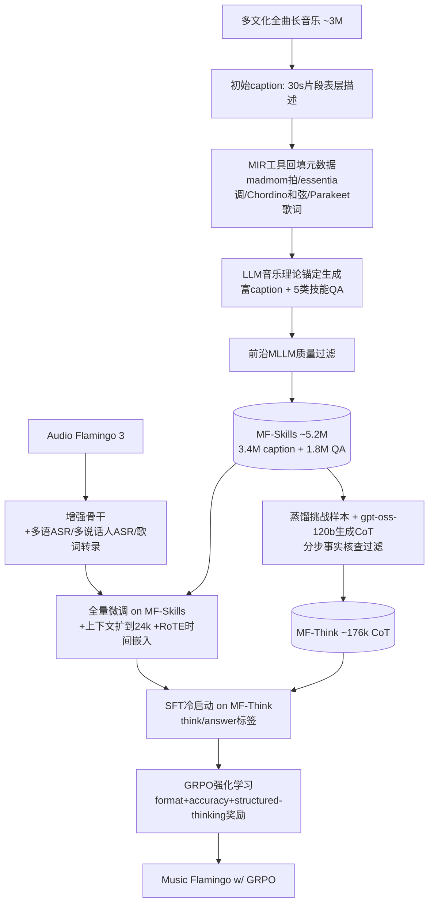

# Music Flamingo: Scaling Music Understanding in Audio Language Models

**会议**: ICLR 2026  
**OpenReview**: [https://openreview.net/forum?id=RS7T9S16Bl](https://openreview.net/forum?id=RS7T9S16Bl)  
**代码 / 项目主页**: [https://research.nvidia.com/labs/adlr/MF/](https://research.nvidia.com/labs/adlr/MF/)  
**领域**: 音频语言模型 / 音乐理解 / 多模态  
**关键词**: Large Audio-Language Model, Music Understanding, Chain-of-Thought, GRPO, MF-Skills, MF-Think  

## 一句话总结
通过构建 500 万级别的多文化、全曲长、分层标注音乐数据集（MF-Skills + MF-Think），并在增强版 Audio Flamingo 3 骨干上叠加「SFT → CoT 冷启动 → GRPO 强化学习」的训练配方，Music Flamingo 让音频语言模型从"识别表层属性"跃升到"像训练有素的音乐家一样进行分层、理论感知的音乐推理"，在 12+ 音乐理解与推理基准上刷新 SOTA。

## 研究背景与动机
**领域现状**：音频语言模型（ALM/LALM）近年在语音、环境声理解上突飞猛进，但音乐始终是块硬骨头。音乐的核心属性——调式、速度、和声、配器、人声风格——在非音乐音频里根本不存在，需要专门的推理能力；而从语音/声音任务迁移过来的"captioning、转录、检索"在音乐上也得另起炉灶。

**现有痛点**：作者把问题根源归到**数据**上。当前主流音乐 caption 数据大多源自 MusicCaps 这类早期数据集，继承了它"短、表层、概括"的风格缺陷——只描述大致的曲风/速度/配器，缺失小节级时间定位、和声与曲式结构、人声/歌词对齐、文化语境，而且偏重纯器乐片段。这导致模型学不到音乐的分层本质（表层属性→中层结构→高层语义）。架构上，很多音乐 LLM 还在用 CLAP 这类不捕获口语内容与低层音高的编码器，进一步限制了人声音色与歌词对齐的学习。

**核心矛盾**：即便最前沿的 LALM，给一首广为人知的歌写 caption 时也常常输出短而泛的描述、把速度或调式认错，甚至靠文本先验而非真正的听觉分析。而 Audio Flamingo 系列从 v1 到 v3，语音和环境声数据大幅增长，音乐数据却只涨了约 10%——**音乐理解的 scaling 一直被高质量数据稀缺卡住**。

**本文目标**：把音乐 captioning、QA 这类传统任务**重新定义为以推理为中心的形式**，让模型必须分层、逐步地连接表层与高层信息，产出像音乐家一样的连贯叙述。

**核心 idea**：**[数据 + 推理双轮驱动]** 一手做大规模、多文化、分层标注的数据（用 MIR 工具回填可靠低层属性 + LLM 合成富 caption/QA），一手用「CoT 冷启动 + GRPO 自定义奖励」把推理能力显式注入，再配合上下文扩展与时间感知表示，让模型真正"听懂"全曲。

## 方法详解

### 整体框架
Music Flamingo 由两条管线构成：**标注管线**把多文化音乐切片经过"初始 caption → MIR 元数据回填 → LLM 生成富 caption/QA → 质量过滤"产出 MF-Skills，并从中蒸馏出理论锚定的 CoT 数据集 MF-Think；**训练管线**则从增强版 Audio Flamingo 3 骨干出发，先在 MF-Skills 上全量微调建立"音乐基础模型"，再经 MF-Think 的 SFT 冷启动注入结构化推理，最后用 GRPO 配合自定义奖励强化逐步推理。

### 关键设计

**1. 增强的 Audio Flamingo 3 骨干：先补口语短板再谈音乐。** 作者意识到歌曲与纯器乐的本质区别是"有人声"——人声不仅带歌词，还携带音色、风格与表现力变化，这要求骨干具备远超以往 baseline 的口语理解力。于是在 AF3 原有训练数据之上，跨所有微调阶段加入大规模多语 ASR（Emilia、CoVoST、MUST、Amazon-SIFT）以覆盖全球人声多样性；在第三阶段再加多说话人 ASR（CHIME、Switchboard、AliMeeting），让模型能解析轮流发声与重叠人声——这对理解二重唱与合唱至关重要；同时补入音素识别、歌词转录等以语音为中心的技能，强化人声内容与音乐语境的对齐。这一步产出的不是最终模型，而是"音乐专门化"的更强起点。

**2. MF-Skills 标注管线：用 MIR 工具当"事实锚"，让 LLM 只负责组织表达。** 直接让 LLM 听音频写 caption 容易幻觉低层属性（认错调式/速度），作者用四阶段流水线规避：先用前沿音乐模型为 30s 片段生成短表层 caption（最小化幻觉），再用 **madmom（拍）、essentia（调式）、Chordino（和弦）、Parakeet（歌词）** 等传统 MIR 工具抽取可靠低层元数据，然后把"初始 caption + 元数据"喂给具备音乐理论 grounding 的 LLM，产出覆盖六大维度（低层信息/配器与制作/歌词与主题/曲式与动态/理论洞见/整体情绪与语境）的富 caption（平均 451.65 词），QA 则针对 AF3 在 MMAU 等基准上暴露的技能缺口，定向生成五类技能题：时序理解、属性识别、和声与理论分析、歌词与人声 grounding、对比与结构推理。最后用前沿 MLLM 做质量过滤。最终数据约 5.2M（3.4M caption + 1.8M QA），且覆盖多文化（印度拉格、非洲复合节奏等被以往西方主导数据忽略的内容）。作者还顺手重写了 MSD、Music4All、AudioSkills-XL 等已有数据集，纠正速度/调式误标并把 MCQ 改造得更难猜（加入更多干扰项以削弱语言先验）。

**3. 长上下文 + RoTE 时间感知表示：让模型"听得久"且"对得准时间"。** AF3 骨干最大上下文仅 8,192 token、约 10 分钟音频，而全曲长歌可达 20 分钟、caption 也长得多，作者把上下文扩到约 **24k token** 并采用全分片训练应对显存。更关键的是音乐理解需要细粒度时间感知（和弦进行、速度/调式变化、人声动态），为此引入 **Rotary Time Embeddings (RoTE)**：标准 RoPE 的旋转角依赖 token 索引 $i$，即 $\theta \leftarrow -i \cdot 2\pi$；RoTE 改用 token 的绝对时间戳 $\tau_i$，即 $\theta \leftarrow -\tau_i \cdot 2\pi$。对于以固定 40ms 步长产生的音频 token，插值出离散时间位置 $\tau_i$ 送入 RoTE 模块，得到轻量且时间锚定的表示，使模型能把描述对齐到具体时刻。

**4. CoT 冷启动 + GRPO 自定义奖励：把推理显式"逼"出来。** 音乐 caption 生成本质上要求模型把表层属性（速度、调式）逐步连接到高层结构（和声、曲式、制作、歌词）再组织成连贯叙述——这是个非平凡推理过程。作者先用 gpt-oss-120b 从 MF-Skills 中挑出最具挑战的样本，结合元数据生成长的理论锚定推理链，再把每条链切成小步、用 post-SFT 的 MF 模型对照音频做 Yes/No 事实核查，轻微错误改写、>30% 步骤错误的丢弃，得到约 176k 条 MF-Think。训练时先做 SFT 冷启动（用 `<think></think>` 与 `<answer></answer>` 标签结构化输出）作为 RL 的预热，再用 GRPO 优化。GRPO 无需价值网络，用同一问题 $G=5$ 个采样输出的平均奖励估计优势，目标函数为
$$J(\theta)=\mathbb{E}_{q,\{o_i\}}\Big[\frac{1}{G}\sum_{i=1}^{G}\min\Big(\frac{\pi_\theta(o_i|q)}{\pi_{\theta_{old}}(o_i|q)}A_i,\ \text{clip}\big(\tfrac{\pi_\theta(o_i|q)}{\pi_{\theta_{old}}(o_i|q)},1-\epsilon,1+\epsilon\big)A_i\Big)-\beta D_{KL}(\pi_\theta\|\pi_{ref})\Big]$$
优势 $A_i$ 用组内奖励归一化 $A_i=\frac{r_i-\text{mean}(\{r\})}{\text{std}(\{r\})}$。奖励设计是点睛之笔：**Format Reward**（严格遵守 think/answer 标签结构得 1，否则 0）；**Accuracy Reward**（QA 任务直接比对 answer 标签内归一化预测与真值）；**Structured Thinking Reward**（caption 这类开放长文本无法直接判对错，于是先用 gpt-oss-120b 为 caption 生成结构化真值元数据——Genre/BPM/Key/Meter/Structure/Instruments/Vocal Character/Lyric Themes/Theory/Mix Notes/Dynamics，再对生成 caption 在每个类别做字符串匹配，按匹配词数 / 总类别数归一化得分）。QA 子集用 format+accuracy，caption 子集用 format+structured-thinking。

## 实验关键数据

### 主实验表格（Table 1，与最强 LALM 对比，仅列各任务前一名基线）

| 任务类别 | 数据集 | 指标 | 最强先前模型 | Music Flamingo |
|---|---|---|---|---|
| QA/推理 | MMAU-Music (full \| mini) | ACC ↑ | AF3: 73.95 \| 74.47 | **76.83 \| 76.35** |
| QA/推理 | MMAU-Pro-Music | ACC ↑ | Gemini-2.5 Flash: 64.90 | **65.60** |
| QA/推理 | MuChoMusic | ACC ↑ | Qwen3-O: 52.10 | **74.58** |
| QA/推理 | MMAR (Music) | ACC ↑ | Qwen2.5-O: 46.12 | **48.66** |
| QA/推理 | Music Instruct | GPT5 ↑ | AF3: 92.7 | **97.1** |
| QA/推理 | Music AVQA | ACC ↑ | AF3: **76.7** | 73.6 |
| 字幕 | SongCaps (Human \| Coverage \| Correctness) | Score ↑ | AF3: 6.5 \| 6.7 \| 6.2 | **8.3 \| 8.8 \| 8.0** |
| MIR | NSynth (Source \| Instrument) | ACC ↑ | AF3: 65.5 \| 78.9 | **75.89 \| 80.76** |
| MIR | GTZAN (Genre) | ACC ↑ | Pengi: 80.00 | **84.45** |
| MIR | Medley-Solos-DB | ACC ↑ | AF2: 85.80 | **90.86** |
| MIR | MusicCaps | GPT5 ↑ | Qwen3-O: 7.2 | **8.8** |
| 歌词转录 | Opencpop (中文) | WER ↓ | GPT-4o: 53.7 | **12.9** |
| 歌词转录 | MUSDB18 (英文) | WER ↓ | GPT-4o: 32.7 | **19.6** |

### 消融实验（GRPO 推理的增益）

| 设置 | MMAU-Pro-Music ACC | MuChoMusic ACC |
|---|---|---|
| 无 RL（不带 thinking traces） | 63.9 | 69.5 |
| 完整 Music Flamingo (w/ GRPO) | **65.6** | **74.58** |

### 关键发现
- **几乎全面 SOTA**：在 QA、推理、MIR、歌词转录四大类基准上压过开源与闭源模型，唯一明显落后的是 Music AVQA（73.6 vs AF3 的 76.7）。
- **歌词转录是断崖式领先**：中文 Opencpop WER 从 GPT-4o 的 53.7 降到 12.9，英文 MUSDB18 从 32.7 降到 19.6——这直接验证了"先补多语/多说话人 ASR 骨干"策略的价值。
- **推理确实带来增益**：去掉 GRPO 思维链后，难基准 MMAU-Pro-Music 掉 1.7、MuChoMusic 掉 5 个点，越难的基准 RL 收益越大。
- **专家评测更买账**：训练有素的音乐家在 SongCaps 上给 8.3（AF3 仅 6.5），LLM-as-judge 的覆盖度 8.8、正确性 8.0 也全面领先，说明输出不只是刷分而是真的更准更全。

## 亮点与洞察
- **"重新定义任务"是真正的杠杆**：作者把"音乐 captioning"从一句话概括重塑为"必须逐层推理的开放探索任务"，这个 reframing 才是后续数据与训练设计的源头——它承认一首歌的描述不是单一答案而是受理论、感知、艺术性塑造的解释谱系。
- **MIR 工具 + LLM 的分工很聪明**：让确定性的 MIR 工具负责"事实"（拍/调/和弦/歌词），LLM 只负责"组织与叙述"，从源头压制了低层属性幻觉，是个可复用的数据合成范式。
- **Structured Thinking Reward 解决了长文本无法判分的难题**：把开放 caption 拆成可匹配的结构化元数据类别再归一化打分，给"奖励难以定义的生成任务"提供了一个务实模板。
- **RoTE 让时间锚定几乎零成本**：仅把 RoPE 的索引依赖换成绝对时间戳，就让模型获得细粒度时序感知，对和弦进行、调式变化这类时间敏感任务很关键。

## 局限与展望
- **文化覆盖仍不均衡**：对欠表征或分布偏斜的文化传统理解有限，需要进一步扩充全球多样化音乐训练数据。
- **专项技能有缺口**：如细粒度钢琴技法识别等乐器特定技能仍弱。
- **技能广度待拓展**：要实现更全面的音乐理解，还需覆盖更多音乐技能维度。
- 此外，数据合成重度依赖 gpt-oss-120b 与前沿 MLLM 的判断，质量上限与偏差受这些"教师"约束；Music AVQA 上的退步也提示某些多模态对齐场景下专门化可能带来负迁移。

## 相关工作与启发
- **承接 Audio Flamingo 系列**：直接以 AF3 为骨干并诊断其音乐短板，是"通用 LALM → 领域专门化"的典型路径。
- **对照纯 MIR 传统**：key/chord/tempo 检测、歌词转录在 MIR 里有长期积累，本文把这些工具当"标注引擎"而非终点，把它们的可靠性嫁接到 LLM 的表达力上。
- **GRPO + 规则奖励路线**：沿用 DeepSeek-R1 式的 format/accuracy 规则奖励并扩展出 structured-thinking 奖励，展示了 RLVR 范式向"奖励难定义的生成任务"迁移的可行做法。
- **启发**：对任何"垂直领域多模态理解"，本文给出的配方颇具普适性——用领域确定性工具回填事实锚 → LLM 合成富监督 → CoT 冷启动 → 自定义可验证奖励的 RL，值得在医学、遥感等领域复用。

## 评分
- **新颖性**: ⭐⭐⭐⭐ 单点技术（GRPO、RoTE、MIR 工具回填）多为已有组件的组合，但"把音乐理解重定义为推理任务 + 大规模多文化分层数据 + structured-thinking 奖励"的整体方案在音乐 LALM 上是开创性的，且开源数据与配方价值高。
- **实验充分度**: ⭐⭐⭐⭐⭐ 覆盖 12+ 基准横跨 QA/推理/MIR/歌词转录，对比近 20 个开闭源 LALM，含人工专家评测、LLM-as-judge 与 GRPO 消融，证据链完整。
- **写作质量**: ⭐⭐⭐⭐ 动机层层递进、图示清晰、方法叙述详尽，定性对比（图 1/3）很有说服力；少数实现细节（context 扩展工程、各阶段超参）下放附录。
- **价值**: ⭐⭐⭐⭐⭐ 开源代码、训练配方与 MF-Skills/MF-Think 数据集，既给出新基准（SongCaps）又给出强基础模型，对音乐理解社区是稀缺的高质量公共资产。

<!-- RELATED:START -->

## 相关论文

- [\[ICLR 2026\] YuE: Scaling Open Foundation Models for Long-Form Music Generation](yue_scaling_open_foundation_models_for_long-form_music_generation.md)
- [\[ICLR 2026\] UALM: Unified Audio Language Model for Understanding, Generation and Reasoning](ualm_unified_audio_language_model_for_understanding_generation_and_reasoning.md)
- [\[ICLR 2026\] Measuring Audio's Impact on Correctness: Audio-Contribution-Aware Post-Training of Large Audio Language Models](measuring_audios_impact_on_correctness_audio-contribution-aware_post-training_of.md)
- [\[ICLR 2026\] Query-Guided Spatial-Temporal-Frequency Interaction for Music Audio-Visual Question Answering](query-guided_spatial-temporal-frequency_interaction_for_music_audio-visual_quest.md)
- [\[ICLR 2026\] Discovering and Steering Interpretable Concepts in Large Generative Music Models](discovering_and_steering_interpretable_concepts_in_large_generative_music_models.md)

<!-- RELATED:END -->
