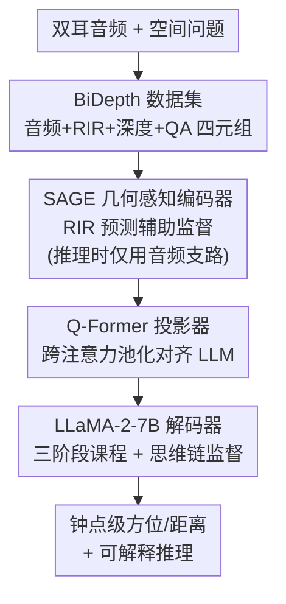

# OWL: Geometry-Aware Spatial Reasoning for Audio Large Language Models

**会议**: ICLR 2026  
**OpenReview**: [https://openreview.net/forum?id=zPv46YKv3w](https://openreview.net/forum?id=zPv46YKv3w)  
**代码**: https://github.com/BASHLab/OWL  
**领域**: 音频语音 / 音频大模型 / 空间推理  
**关键词**: 双耳音频, 空间推理, 几何感知编码器, 思维链, 声音事件定位

## 一句话总结
本文提出几何感知的双耳音频编码器 SAGE 和空间音频大模型 OWL：训练时借助房间脉冲响应（RIR）和全景深度图把声学特征对齐到 3D 几何，推理时只用音频，再配合"空间锚定的思维链 + 课程学习"实现钟点级方位估计与可解释的多步空间推理，在 DoA 误差和空间问答上大幅超过 BAT。

## 研究背景与动机
**领域现状**：音频大语言模型（ALLM）把音频编码器接到 LLM 上，已经能做声音事件识别、说话人属性、音频对话等感知类任务。但相比视觉语言模型，音频侧明显落后，尤其在需要"空间"理解的任务上。代表性工作 BAT 第一次展示了从双耳音频做空间问答的能力。

**现有痛点**：BAT 这类方法有两个硬伤。其一是**定位太粗**——它把整个场景只切成"前/后/左/右"四个大区，无法支持精细的声源追踪、相对距离估计和多源消歧。其二是编码器**只用音频训练**，缺少几何信息。

**核心矛盾**：作者把问题归结为两条根因。(i) **缺乏几何接地**：现有编码器只抓频谱和时序模式，却忽略了真正决定声音如何传播的几何线索——直达混响比、混响时间 RT60、房间结构等，于是模型能认出"是什么声音"，却答不出"哪个声源更近""声音来自左还是右"。(ii) **单步推理**：现有 ALLM 把问题直接映射到答案，没有中间推理步骤，遇到多源场景或需要逐步空间推理的问题就崩。

**本文目标**：(1) 让音频编码器学到几何感知的声学表示，但推理时不依赖额外几何输入；(2) 让 ALLM 能把复杂空间问题拆成可解释的子步骤；(3) 提供能支撑大规模训练与评测的数据。

**切入角度**：作者观察到——几何信息（RIR、深度图）在仿真训练阶段是可获得的"特权信息"，可以用它做辅助监督把几何"灌"进音频编码器；而真正部署时只需要音频。同时，空间推理天然适合用思维链分解（先定位、再比较、最后下结论）。

**核心 idea**：用"几何条件训练的编码器（SAGE）"代替"纯音频编码器"来解决几何接地，用"空间锚定的思维链 + 三阶段课程"代替"单步映射"来解决推理缺失。

## 方法详解

### 整体框架
OWL 要解决的是：给一段双耳音频和一个空间问题，输出钟点级的方位/距离，并给出可解释的推理过程。整体分三块串起来：先用 **SAGE** 把双耳波形编码成"几何感知的声学表示"，再用 **Q-Former 投影器** 把这些声学特征压缩并对齐到 LLM 的词嵌入空间，最后用 **LLaMA-2-7B 解码器** 结合文本提示生成答案。其中 SAGE 的几何能力来自训练时一个**辅助的 RIR 预测任务**（吃深度图），但推理时这条几何支路被丢掉、只留音频编码器。整个 OWL 再用**三阶段课程**从感知一路训到思维链推理。支撑这一切的是作者自建的 **BiDepth** 数据集（≈110 万条 QA 四元组）。

### 关键设计

**1. SAGE：用 RIR 预测当辅助任务，把几何"灌"进音频编码器**

针对"缺乏几何接地"这个痛点，SAGE 的关键思路是引入一个**特权监督**：双耳 RIR 预测。它由两个联合优化的模块组成——一个**双耳音频编码器** $\phi_a(\cdot)$ 吃双耳波形 $B \in \mathbb{R}^{2\times L}$，输出嵌入 $h_a \in \mathbb{R}^{C\times T}$，同时支撑声音事件分类、DoA 估计、距离预测三个任务（其中方位被离散成 360 个 1° 的箱、仰角 180 箱、距离 [0,10]m 量化成 21 箱）；另一个 **RIR 预测模块**用 ResNet-18 编码全景深度图 $D_i$ 得到 $h_d=\phi_d(D_i)$，与音频特征融合后再用转置卷积头重建双耳 RIR $\bar R=\psi_d(h_d,h_a)$。

感知侧损失是三任务加权交叉熵 $L_{\text{binaural}}=\alpha_1 L_{cls}+\alpha_2 L_{dis}+\alpha_3 L_{doa}$；几何侧损失把 $\ell_1$ 项和**能量衰减曲线（EDC）损失**结合：

$$L_{\text{geo}} = \|R-\bar R\|_1 + \lambda L_{\text{EDC}}(R,\bar R)$$

其中 $L_{\text{EDC}}$ 用 Schroeder 反向积分算法度量预测与真实衰减曲线的差异。之所以用 EDC 而不是 RT60 这种标量描述符，是因为 EDC 可微，且能捕捉更丰富的混响结构（直达混响比 DRR、早期衰减时间 EDT）。总目标 $L=\eta_1 L_{\text{binaural}}+\eta_2 L_{\text{geo}}$。关键在于：这条几何支路只在训练时存在，**推理时只用 $\phi_a$**，于是几何知识被"内化"进了音频编码器，部署时无需任何深度图。

**2. 空间锚定的思维链：把"定位—比较—下结论"拆成可解释步骤**

针对"单步推理"痛点，OWL 不再把问题直接映射到答案，而是先定位每个声源（如"猫叫在 8 点钟、1.5m"），再做相对比较，最后给出结论（"8 点钟在左、1 点钟不在，所以猫叫在听者左侧"）。这套思维链的特点是**锚定到声源位置**——每一步中间推理都绑定具体的方位和距离，而不是泛泛的文字推理。监督方式是在 Type IV 数据里同时监督中间推理步骤和最终答案，从而强迫模型把预测落到结构化的空间比较上，而非直接分类。这正好补上了音频 CoT 的空白（此前只有 Audio Flamingo 3 在简单感知问题上尝试过 CoT，没有空间接地）。

**3. Q-Former 投影 + 冻结编码器：在对齐 LLM 的同时保住几何特征**

投影器 $\psi(\cdot)$ 基于 Q-Former，用 $Q$ 个可学习 query token 做跨注意力池化，把 $h_a$ 投影成 $z_q\in\mathbb{R}^{Q\times d}$，既对齐到 LLM 嵌入空间又压缩了序列长度。选 Q-Former 而非轻量的线性/MLP 适配器，是因为它的选择性跨注意力池化能更好保留空间线索。LLM 用 LLaMA-2-7B（与 BAT 对齐以公平比较），通过 LoRA 做参数高效微调；而 SAGE 的音频编码器 $\phi_a$ **保持冻结**，确保不破坏预训练阶段学到的几何感知特征。最终 $y=\Pi(z_q,x_t)$。

**4. 三阶段课程学习：从感知到关系再到思维链，逐级加难**

直接上多步推理会让模型抄"关系捷径"、绕过真正的几何感知，因此 OWL 用三阶段课程（见下方训练策略）。这是把感知能力当地基、关系推理当承重墙、CoT 当顶层的渐进式训练，消融显示缺了任何一阶段都会明显掉点。

### 损失函数 / 训练策略
OWL 用三阶段课程训练（Stage 1 还内部从单源热身再到双源）：

| 阶段 | 题型 | 声源 | 训练样本 | 作用 |
|------|------|------|----------|------|
| Stage 1 | I, II | 单源热身→双源 | 270K + 270K | 感知预训练：稳住事件识别与 DoA，避免过早学关系捷径 |
| Stage 2 | III | 双源 | 300K | 相对几何预训练：内化左右/远近等关系 |
| Stage 3 | IV | 双源 | 250K | CoT 指令微调：同时监督推理步骤与最终答案 |

每阶段都最小化标准自回归交叉熵：

$$L(\phi_a,\psi,\Pi) = \sum_{s\in\{1,2,3,4\}} \mathbb{E}_{(B^r(t),q,y)\sim D_s}\left[-\sum_{t=1}^{T}\log\Pi(y_t|y_{<t}, q, z_q)\right]$$

训练时 $\psi$ 从头训、$\Pi$ 用 LoRA 微调、$\phi_a$ 始终冻结。

## 实验关键数据

### 主实验
SAGE 在 SELD 上对比 SELDNet / Spatial-AST（BiDepth，含深度训练）：

| 方法 | mAP ↑ | ER20° ↓ | MAE ↓ | DER ↓ |
|------|-------|---------|-------|-------|
| SELDNet | 39.46 | 53.21 | 38.71 | 53.38 |
| Spatial-AST | 49.17 | 41.94 | 27.24 | 39.21 |
| **SAGE（音频+深度）** | **49.81** | **28.13** | **21.67** | **14.32** |

相对 Spatial-AST，SAGE 的事件检测只小涨约 1.6–1.7%，但定位大幅改善：ER20° 降 23.61%、MAE 降 25.52%、DER 降 31.34%；跨数据集迁移时 DER 相对降幅高达 82%。说明几何监督主要帮的是空间定位而非事件识别。

OWL 在 BiDepth 上对比基线（节选 12-bin 方位精度与推理精度）：

| 方法 | DoA Acc（双源）↑ | Type III BA ↑ | Type IV BA ↑ |
|------|------------------|---------------|--------------|
| BAT | 35.29*（4-bin）| 69.46 | 61.29 |
| OWL w/o CoT | 34.24（12-bin）| 74.29 | 65.27 |
| **OWL w/ CoT** | **34.31** | **77.89** | **76.53** |

OWL 在 12-bin 精细方位下达 46.15%、4-bin 粗粒度下达 77.21%（BAT 仅 71.59% 4-bin）；论文称感知 QA 上超 BAT 46.4%、空间推理上超 24.9%（约 25%），DoA 平均误差降 11°。在 SpatialSoundQA 上零样本同样超 BAT（DoA 75.54→78.31，DER 29.16→26.14）。

### 消融实验
SAGE 损失分量消融（BiDepth）：

| 配置 | mAP ↑ | ER20° ↓ | MAE ↓ | DER ↓ | 说明 |
|------|-------|---------|-------|-------|------|
| 仅 $L_{\text{binaural}}$ ($\eta_2{=}0$) | 49.75 | 36.89 | 26.32 | 17.11 | 无几何监督，定位误差高 |
| $\lambda=0$（去 EDC） | 49.73 | 36.79 | 26.12 | 16.71 | 对检测几乎无影响，定位受损更大 |
| $\eta_2=1e{-}2$ | 49.81 | 28.13 | 21.67 | 14.32 | 几何对齐到位，全面降误差且保住 mAP |

OWL 课程阶段消融：去掉 Stage 1 热身则检测崩塌（mAP 32.92/8.97）；加回 Stage 1 恢复检测（33.27/17.19）；Stage 2 把 Type III BA 提到 74.29；完整三阶段达 Type III BA 77.89、Type IV（检测 79.04 / 方向 86.76 / BA 76.53）。

### 关键发现
- **几何监督主要提升定位而非检测**：mAP 几乎不动，但 ER20°/MAE/DER 大降——这印证了"几何线索决定声音如何传播、从而决定空间推理"的假设。
- **EDC 损失不可或缺**：去掉 EDC 项后检测不变但定位明显变差，说明可微的衰减曲线监督比 RT60 标量更能传递混响几何。
- **课程缺一不可**：跳过单源热身会让检测直接崩，跳过关系阶段则推理无法泛化，验证了"感知→关系→CoT"的渐进必要性。
- **CoT 是纯加分项**：加 CoT 监督把推理精度再提约 11.26%，且连带改善检测和 DoA。

## 亮点与洞察
- **特权信息训练范式很优雅**：用"训练时有、推理时无"的 RIR/深度做辅助监督，把几何知识蒸进音频编码器，部署零额外成本——这个思路可迁移到任何"训练时多模态、部署时单模态"的场景。
- **EDC 损失替代 RT60**：把一个不可微的标量声学描述符换成可微的曲线匹配损失，是让几何监督能端到端反传的关键工程巧思。
- **空间锚定 CoT**：让推理每一步都绑定具体方位/距离，而非自由文本，既提升了可解释性又约束了模型不抄捷径，是音频 CoT 的首个有效范式。
- **钟点制表达**：把方位用"几点钟"、距离用对话式米数表达，既贴合人类近似习惯又方便 LLM 生成。

## 局限与展望
- **依赖仿真数据**：BiDepth 全部由 SoundSpaces + Matterport3D 仿真生成，真实环境（真实录音、真实房间材质）下的鲁棒性未验证。
- **闭源模型只比了检测**：Gemini 系列因 API 限制只报告了事件检测，无法在 DoA/距离/推理上直接对照，比较不够完整。
- **双源为主**：课程和评测主要在单/双源场景，更密集的多源混叠（3+ 声源）和强噪声/强混响下能否保持钟点级精度存疑。
- **LLM 与编码器规模固定**：为对齐 BAT 用 LLaMA-2-7B 且冻结编码器，未探索更大 LLM 或联合微调编码器能否进一步释放几何特征。

## 相关工作与启发
- **vs BAT**：BAT 首次做双耳空间问答，但定位只有四区、单步推理、编码器纯音频训练；OWL 用几何条件训练 + 空间 CoT，做到 12 区精细定位和多步推理，感知/推理全面领先。
- **vs Spatial-AST / SELDNet**：传统 SELD 方法任务专一、只用音频、无几何接地；SAGE 用 LLM 框架对齐音频与环境几何，并把能力从检测/定位延伸到可解释的多步推理。
- **vs Audio Flamingo 3**：AF3 是此前唯一在音频上尝试 CoT 的工作，但仅限简单感知问题、无空间接地；OWL 首次引入几何感知的音频 CoT。

## 评分
- 新颖性: ⭐⭐⭐⭐⭐ 几何感知音频编码器 + 空间 CoT + 百万级几何接地数据集，三件套在音频空间推理上是首创组合。
- 实验充分度: ⭐⭐⭐⭐ 两个 benchmark、多组开闭源基线、损失与课程双消融充分，但闭源对比受限、缺真实数据验证。
- 写作质量: ⭐⭐⭐⭐ 动机—方法—实验逻辑清晰，图表与公式齐全。
- 价值: ⭐⭐⭐⭐⭐ 公开 BiDepth 数据集与代码，为音频空间推理提供了可复现的几何接地基础设施。

<!-- RELATED:START -->

## 相关论文

- [\[ICLR 2026\] Measuring Audio's Impact on Correctness: Audio-Contribution-Aware Post-Training of Large Audio Language Models](measuring_audios_impact_on_correctness_audio-contribution-aware_post-training_of.md)
- [\[ICLR 2026\] Stitch: Simultaneous Thinking and Talking with Chunked Reasoning for Spoken Language Models](stitch_simultaneous_thinking_and_talking_with_chunked_reasoning_for_spoken_langu.md)
- [\[ACL 2026\] Closing the Modality Reasoning Gap for Speech Large Language Models](../../ACL2026/audio_speech/closing_the_modality_reasoning_gap_for_speech_large_language_models.md)
- [\[ICML 2026\] Two-Dimensional Quantization for Geometry-Aware Audio Coding](../../ICML2026/audio_speech/two-dimensional_quantization_for_geometry-aware_audio_coding.md)
- [\[ICLR 2026\] UALM: Unified Audio Language Model for Understanding, Generation and Reasoning](ualm_unified_audio_language_model_for_understanding_generation_and_reasoning.md)

<!-- RELATED:END -->
