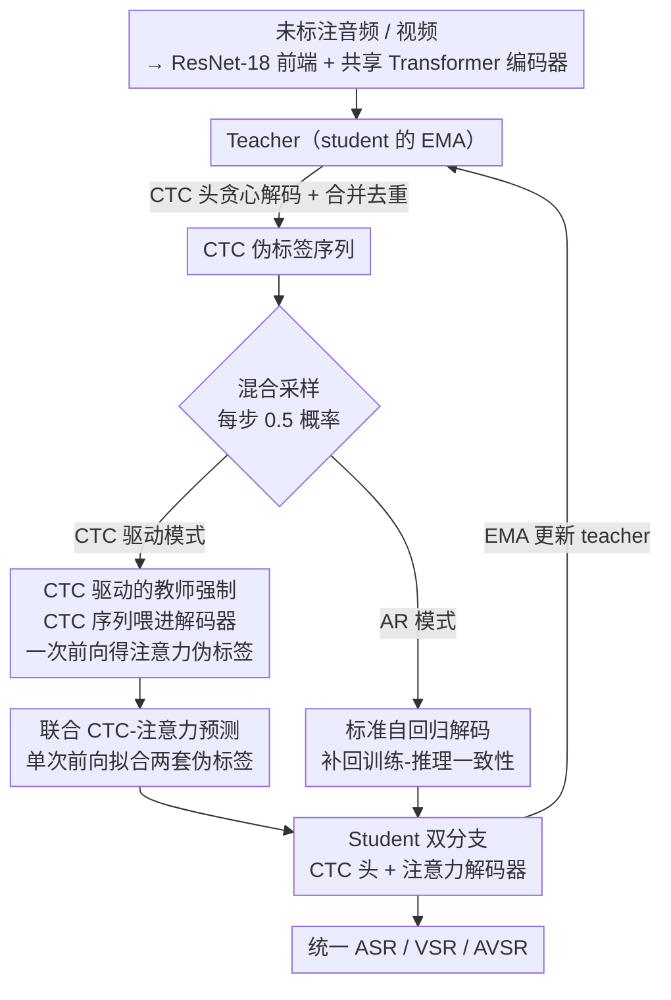

# Pay Attention to CTC: Fast and Robust Pseudo-Labelling for Unified Speech Recognition

**会议**: ICLR 2026  
**arXiv**: [2602.19316](https://arxiv.org/abs/2602.19316)  
**代码**: 无（基于 USR 框架扩展）  
**领域**: 音频语音  
**关键词**: 统一语音识别, CTC, 伪标签, 音视频语音识别, 分布外鲁棒性

## 一句话总结

提出 USR 2.0，用 CTC 驱动的教师强制替代自回归伪标签生成，注意力伪标签在单次前向传播中完成，训练速度提升近 2×，通过 CTC-注意力联合预测增强分布外鲁棒性，在 LRS3/LRS2/WildVSR 上实现 ASR/VSR/AVSR 三任务统一模型 SOTA。

## 研究背景与动机

统一语音识别（USR）用单一模型同时执行 ASR（音频）、VSR（唇读）和 AVSR（音视频），通过半监督伪标签达到 SOTA。但 USR 存在两个关键瓶颈：

**自回归伪标签代价高昂**：注意力分支需每 token 一次前向传播，CTC 解码比 AR 快约 40×

**解耦监督致分布外脆弱**：CTC 和注意力分支独立训练，注意力解码器在长序列/噪声/新域下产生级联错误，且错误通过 EMA 自我强化

核心观察：CTC 在分布外场景显著更鲁棒（单调对齐+条件独立），注意力在分布内质量更高。能否结合两者优势？

## 方法详解

### 整体框架

USR 2.0 要修的是统一语音识别（USR）半监督训练里的两个老毛病：注意力分支生成伪标签必须逐 token 自回归，慢得离谱（CTC 解码比自回归快约 40×）；而 CTC 头和注意力解码器各练各的（解耦监督），让注意力解码器在长序列、噪声、新域下级联出错，错误又通过 EMA 自我强化。它沿用 USR 的 student-teacher 框架——模态特定 ResNet-18 前端接共享 Transformer 编码器，下游分出 CTC 头与注意力解码器双分支，teacher 是 student 的 EMA（$\tau$ 按 0.998→1 余弦调度），标注数据用真实标签、未标注数据用伪标签。

真正的改动集中在「伪标签怎么生成」和「两条分支怎么耦合」。对每条未标注输入，teacher 先做 CTC 贪心解码并合并去重，得到一条 CTC 伪标签序列；随后每个训练步以 0.5 概率在两种模式间切换：**CTC 驱动模式**把这条 CTC 序列整体喂进解码器做教师强制，一次前向就算出注意力伪标签，student 解码器在同一次前向里同时拟合 CTC 与注意力两套伪标签；**AR 模式**退回标准自回归解码，补回被砍掉的训练-推理一致性。两种模式里总有一条分支给另一条提供监督，把原本解耦的 CTC 与注意力绑成耦合，这正是鲁棒性提升的来源。

### 关键设计

**1. CTC 驱动的教师强制：用一次前向算出注意力伪标签，砍掉逐 token 的自回归**

注意力分支生成伪标签的传统做法是自回归解码，每个 token 都要把已生成的前缀喂回解码器再前向一次：$\tilde{y}_u^{Att} = \arg\max_{y_u} P_{Att}(y_u | \tilde{y}_{<u}^{Att}, x; \theta_T)$，这正是 USR 训练慢的根源。USR 2.0 换了一个输入：先对 CTC 头做贪心解码并合并去重得到一条完整序列 $\tilde{y}^{CTC} = \text{collapse}(\tilde{y}_{1:L})$，再把这条 CTC 序列整体当作解码器的强制输入，一次性算出每个位置的注意力目标：

$$\tilde{y}^{CTC} = \text{collapse}(\tilde{y}_{1:L}), \quad \tilde{y}_u^{Att} = \arg\max_{y_u} P_{Att}(y_u | \tilde{y}_{<u}^{CTC}, x; \theta_T)$$

这样做的前提是一个反直觉的判断：CTC 前缀本身可能不具备全局连贯性，但在伪标签场景里根本不需要连贯——teacher 和 student 面对的是同一条 CTC 前缀，知识迁移照样成立，student 学到的是「从一段连贯的 CTC 前缀，映射到 teacher 在该条件下的有效下一 token 预测」这条稳定的映射关系。更关键的副产品是长度对齐：两种伪标签都按 CTC 序列长度 $U_{CTC}$ 展开，于是 student 解码器能在**单次前向传播**里同时拟合 CTC 伪标签和注意力伪标签，既继承 CTC 的鲁棒性，又保留注意力的表达能力。

**2. 混合采样策略：用 0.5 概率在两种模式间切换，补回被砍掉的训练-推理一致性**

CTC 驱动的教师强制虽然快，但它让训练时的解码器输入（CTC 前缀）和推理时的输入（自回归生成的前缀）不一致，引入曝光偏差。USR 2.0 的对策是每一步以 0.5 概率随机选一种模式训练。CTC 驱动模式下，解码器同时接受注意力伪标签和 CTC 伪标签的监督，而 CTC 分支只信 CTC 伪标签（因为此时注意力伪标签可能不连贯）：

$$\mathcal{L}^{CTC,m} = \text{CTC}(\hat{y}^{CTC,m}, \tilde{y}^{CTC})$$
$$\mathcal{L}^{Att,m} = 0.5 \cdot \text{CE}(\hat{y}^{Att,m}, \tilde{y}^{Att}) + 0.5 \cdot \text{CE}(\hat{y}^{Att,m}, \tilde{y}^{CTC})$$

另一半概率落到 AR 模式，走标准的自回归解码来缓解上述不匹配，此时注意力伪标签是连贯的，于是 CTC 分支反过来同时接受两种伪标签：

$$\mathcal{L}^{CTC,m} = 0.5 \cdot \text{CTC}(\hat{y}^{CTC,m}, \tilde{y}^{CTC}) + 0.5 \cdot \text{CTC}(\hat{y}^{CTC,m}, \tilde{y}^{Att})$$
$$\mathcal{L}^{Att,m} = \text{CE}(\hat{y}^{Att,m}, \tilde{y}^{Att})$$

精妙之处在于：不论哪种模式，CTC 分支和注意力分支总有一方给另一方提供监督信号，两条分支因此被绑成**耦合**而非各练各的解耦——这正是 USR 原本鲁棒性差的病根所在。

**3. 联合 CTC-注意力预测：让解码器在一次前向里同时吐出鲁棒和表达两套预测**

得益于设计 1 的长度对齐，CTC 驱动模式下两种伪标签长度一致，student 解码器可以在单次前向传播中同时预测 CTC 伪标签（负责鲁棒性）和注意力伪标签（负责表达能力）。训练过程因此自然地把两条分支的优势揉进同一个解码器，而不需要在推理时再做额外的分支融合。

### 损失函数 / 训练策略

- 联合 CTC-注意力训练：CTC 权重 0.1，注意力 CE + 标签平滑 0.1
- 模态权重：视觉 0.3，音频/音视频 0.7
- 未标注-标注损失比：视觉 0.97，音频/音视频 0.75
- 置信度过滤阈值 0.8，序列级 CTC 置信度 = token 平均对数概率
- 推理：ESPnet 联合解码，beam=40，CTC 权重 0.1
- 词表：1000 token SentencePiece
- 模型规模：Base / Base+ / Large / Huge 四档

## 实验关键数据

### 主实验

**表1：分布内性能（LRS3 WER%，低资源 30h）**

| 方法 | 统一模型 | VSR↓ | ASR↓ | AVSR↓ |
|------|---------|------|------|-------|
| AV-HuBERT | ✗ | 51.8 | 4.9 | 4.7 |
| BRAVEn | ✗ | 43.4 | 4.0 | 4.0 |
| USR | ✓ | 36.0 | 3.2 | 3.0 |
| **USR 2.0** | **✓** | **36.2** | **3.0** | **2.9** |

**表2：Huge 模型最终结果（LRS3）**

| VSR | ASR | AVSR |
|-----|-----|------|
| **17.6** | **0.9** | **0.8** |

**表3：分布外鲁棒性（greedy 解码 WER%）**

| 方法 | LibriSpeech | WildVSR | AVSpeech |
|------|-------------|---------|----------|
| AV-HuBERT | 29.1 | 82.4 | 26.0 |
| USR | 25.3 | 80.0 | 34.7 |
| **USR 2.0** | **15.4** | **73.7** | **25.0** |

**表4：噪声鲁棒性（LRS3 ASR，beam=30）**

| 方法 | 10dB | 5dB | 0dB | -5dB | 平均 |
|------|------|-----|-----|------|------|
| USR | 5.8 | 14.3 | 48.5 | 104.4 | 43.3 |
| **USR 2.0** | **5.2** | **13.4** | **44.0** | **94.4** | **39.3** |

### 消融实验

**长序列鲁棒性**：
- USR 在 >155 帧（超训练分布）时 WER 急剧上升
- USR 2.0 保持稳定至 600 帧
- 增大 beam 可缩小差距但代价是显著延迟/内存开销

**Beam Size 敏感性**：
- USR 2.0 在 greedy/小 beam 下已优异
- USR 需 beam≥30 才能接近 USR 2.0 greedy 性能

**混合采样概率**：固定 0.5 与自适应调度表现相当，采用更简单方案。

### 关键发现

1. **CTC 驱动伪标签不需全局连贯性**：teacher/student 共享 CTC 前缀条件，局部条件正确即可
2. **耦合 vs 解耦**：CTC-注意力耦合监督是鲁棒性提升关键——两分支互相"校正"
3. **速度提升是间接收益来源**：更快伪标签→可扩展到更大模型/数据→Huge 模型的成功
4. **greedy 解码性能是半监督核心**：伪标签每训练步生成，greedy 质量直接决定训练效果

## 亮点与洞察

- **"连贯性在伪标签中不必要"**：反直觉但逻辑自洽——teacher forcing 下共享 CTC 前缀，"不连贯的正确"足够
- **效率和质量双赢**：不是效率-质量权衡，而是更好的伪标签策略同时提升两者
- **CTC 的被低估价值**：条件独立假设虽限制序列建模，但在半监督/OOD 场景中鲁棒性极其宝贵
- **统一模型实用价值**：单一模型 ASR/VSR/AVSR，VSR 17.6%、AVSR 0.8% 具有强部署价值

## 局限与展望

1. 混合采样频率固定 0.5，不同训练阶段最优比例可能不同
2. CTC 在严重噪声（-5dB）下仍有退化，可能传播错误到注意力分支
3. 推理仍需 beam search（beam=40），延迟改善有限
4. 仅验证英语，声调语言等跨语言适用性待探索
5. 1000 token 词表对大词汇量任务可能不足

## 相关工作与启发

- **USR** 是直接前身，本文精确诊断其解耦监督和 AR 瓶颈
- **AV-HuBERT** 等自监督方法统一预训练但微调时分离为多模型
- **Scheduled Sampling** 的曝光偏差缓解思路被借鉴但针对不同类型偏差
- 启发："伪标签不需要完美"可推广到其他 teacher-student 框架

## 评分

- 新颖性: ⭐⭐⭐⭐ — CTC 驱动教师强制思路简洁有效
- 技术深度: ⭐⭐⭐⭐ — 混合采样的损失设计精巧
- 实验充分度: ⭐⭐⭐⭐⭐ — ID/OOD/噪声/长序列/beam/多规模全面覆盖
- 实用价值: ⭐⭐⭐⭐⭐ — 训练 2× faster + 统一模型 SOTA

<!-- RELATED:START -->

## 相关论文

- [\[ACL 2026\] Pseudo2Real: Task Arithmetic for Pseudo-Label Correction in Automatic Speech Recognition](../../ACL2026/audio_speech/pseudo2real_task_arithmetic_for_pseudo-label_correction_in_automatic_speech_reco.md)
- [\[ICLR 2026\] StableToken: A Noise-Robust Semantic Speech Tokenizer for Resilient SpeechLLMs](stabletoken_a_noise-robust_semantic_speech_tokenizer_for_resilient_speechllms.md)
- [\[ICLR 2026\] UniSS: Unified Expressive Speech-to-Speech Translation with Your Voice](uniss_unified_expressive_speech-to-speech_translation_with_your_voice.md)
- [\[ICML 2026\] Attend to Anything: Foundation Model for Unified Human Attention Modeling](../../ICML2026/audio_speech/attend_to_anything_foundation_model_for_unified_human_attention_modeling.md)
- [\[ACL 2025\] MultiMed: Multilingual Medical Speech Recognition via Attention Encoder Decoder](../../ACL2025/audio_speech/multimed_multilingual_medical_speech_recognition_via_attention_encoder_decoder.md)

<!-- RELATED:END -->
