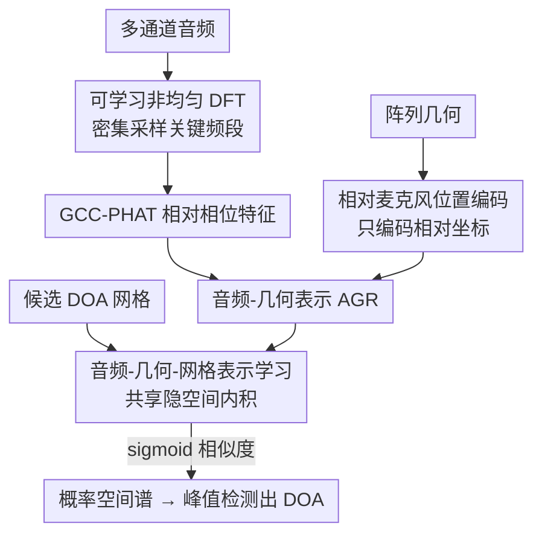

# Physics-Informed Audio-Geometry-Grid Representation Learning for Universal Sound Source Localization

**会议**: ICLR 2026  
**OpenReview**: [https://openreview.net/forum?id=bWXpJFesLS](https://openreview.net/forum?id=bWXpJFesLS)  
**代码**: 待确认  
**领域**: 音频表示学习 / 声源定位  
**关键词**: 声源定位, 表示学习, 物理先验, 麦克风阵列, 几何不变

## 一句话总结
本文提出 AGG-RL，把"音频-几何表示"和"网格表示"投影到共享隐空间、用内积相似度生成空间谱，再配上两个物理先验组件（可学习非均匀 DFT 与相对麦克风位置编码），实现了**跨任意阵列几何、任意 DOA 网格都不用重训**的通用声源定位，在未见过的阵列上显著超过现有方法。

## 研究背景与动机

**领域现状**：声源定位（SSL）要估计声源的到达方向（DOA）。传统方法（GCC-PHAT、MUSIC、SRP-PHAT）靠麦克风间的相位差（IPD）来推时延差（TDOA）。深度网络方法学到更鲁棒的表示，往往胜过传统方法，已经成为主流。

**现有痛点**：绝大多数 DNN 方法被两个东西"钉死"——① 依赖**特定的麦克风阵列几何**（换个阵列就要重训）；② 依赖**预定义的 DOA 网格**（换个网格分辨率也要重训）。已有的"几何不变"方法和"网格灵活"方法各自缓解了一半，但没有一个能同时对任意几何、任意网格都鲁棒。

**核心矛盾**：DNN-SSL 的输出范式本身就有取舍。回归式直接预测三维坐标，分辨率理论无限但可解释性差、受最大声源数约束；分类式把空间离散成固定网格，输出可解释的空间谱、不绑声源数，但分辨率被网格上限卡死、换网格要重训；模板匹配能在任意网格上做但它优化的是 IPD 估计而非 DOA，且要对每个麦克风对算 pairwise 输出，计算量爆炸。三者都没能既灵活又准。

**频率维度还藏着一个物理矛盾**：低频无混叠但 TDOA 分辨率粗，高频分辨率细但容易**空间混叠**（相位被卷绕到 $[-\pi,\pi)$，同一个 IPD 对应多个 TDOA）。混叠条件 $f \le f_{max} = \tfrac{v}{2r}$ 取决于麦克风间距 $r$，而真实阵列间距千差万别，所以"哪段频率信息量大"是随阵列变化的。

**本文目标**：造一个**通用** SSL——同一个模型，不重训就能换阵列几何、换 DOA 网格，还要兼顾分类式的可解释性。

**切入角度**：作者把问题拆成"表示对齐"——既然要灵活网格，就别把网格写死进输出层，而是让模型分别学"音频+几何的表示"和"网格的表示"，二者在共享隐空间里比相似度。同时把物理知识（TDOA 只依赖相对坐标、关键相位信息集中在某些频段）作为**归纳偏置**塞进特征提取，而不是让网络从零硬学。

**核心 idea**：用"音频-几何表示 × 网格表示的相似度"代替"固定网格分类头"，并用两个可学习的物理先验组件（非均匀 DFT、相对位置编码）引导表示往声学上有意义的方向收敛。

## 方法详解

### 整体框架
AGG-RL 接收三样输入：多通道音频信号、麦克风阵列几何、候选 DOA 网格；输出是网格上每个候选方向的概率空间谱。它由两条网络组成：**AuGeonet**（音频-几何表示网络 $A(\cdot)$）从音频和阵列几何里抽出音频-几何表示（AGR）；**Gridnet**（网格表示网络 $G(\cdot)$）把候选 DOA 编码成网格表示（GR）。两种表示投影到同一个隐空间，用带缩放的内积衡量相似度，内积越大代表该方向有声源的可能性越高，经 sigmoid 得到 $[0,1]$ 的空间谱。监督信号是带不同波束宽度的"软标签 oracle 空间谱"，让模型学到音频-几何-网格三者之间的关系。

AuGeonet 内部再嵌两个物理先验：可学习非均匀 DFT（LNuDFT）替换标准 DFT 来抽相位特征，相对麦克风位置编码（rMPE）替换绝对位置编码来注入几何。整条链路是"音频→LNuDFT 谱→GCC-PHAT 相对相位特征 + rMPE 几何编码→AGR"，与"候选 DOA→正弦编码→Gridnet→GR"并行，最后在隐空间相遇。

### 关键设计

**1. 可学习非均匀 DFT（LNuDFT）：让网络自己把频率 bin 密集分配到信息量大的频段**

针对的痛点是：标准 DFT 频率 bin 是均匀的，但 SSL 里真正携带相位线索的频段会随阵列间距/混叠条件变化，均匀采样浪费了表达力。LNuDFT 把"相邻频率 bin 的间隔"做成可学习参数。第 $c$ 通道的频域表示为 $X_c[k,l]=\sum_{n=0}^{N-1} x_c[n+Nl]\,w[n]\cdot e^{-j2\pi \frac{n}{N}\nu_k}$，其中 $\nu_k$ 是第 $k$ 个 bin 的位置（映射到物理频率 $f_k=\tfrac{\nu_k}{N}f_s$）。当 $\nu_k=k$ 时退化为标准 DFT。为保证单调有序且不越过 Nyquist 上限，$\nu_k$ 被定义为正增量的累积和 $\nu_k=\nu_{k-1}+a_{k-1},\ a_k>0$，每次梯度更新后把增量裁剪到 $(\epsilon_{min},\epsilon_{max})$ 并归一化使 $\nu_k \le \tfrac{N}{2}$。

初始化很关键：用一个 logit 映射把 bin 在中频段密集分配，$\hat\nu_k=\ln\!\big(\tfrac{\tilde\nu_k}{1-\tilde\nu_k}\big)$，再归一化到 $[0,K-1]$。LNuDFT 可以高效地实现成 1D 卷积（基函数当卷积核）。这样训练完后，bin 会自动聚到物理上有意义的频段，既保留了相位信息又提升了鲁棒性和可解释性——消融显示其 logit 初始化对"未见阵列"的泛化尤为有利。

**2. 相对相位特征 + 相对麦克风位置编码（rMPE）：让几何注入与 TDOA 的物理本性对齐**

针对的痛点是：TDOA/IPD 在物理上**只依赖麦克风的相对坐标**，但此前 GI-DOAEnet 用的是绝对位置编码（aMPE），与这个物理事实不匹配，换阵列时泛化差。本文先在相位特征侧用 GCC-PHAT 替换原始 DFT 系数，强调相位差、压制幅度变化；并采用**参考通道方案**把 pairwise 的 $O(C^2)$ 复杂度降到 $O(C)$（参考麦克风取最靠近阵列中心者），定义 $\hat X^{GCC}_c[k,l]=\tfrac{X_c X_{\bar c}^*}{|X_c||X_{\bar c}|}$，实部虚部拼接，输入维度降到 $C-1$。

在几何侧，rMPE 只编码每个麦克风相对参考通道的坐标 $\tilde x_c=x_c-x_{\bar c}$ 等，再转成球坐标 $(\tilde r_c,\tilde\vartheta_c,\tilde\varphi_c)$，用正弦编码（相位调制 PM / 频率调制 FM 两种映射 $h_{PM},h_{FM}$）得到 $P\in\mathbb{R}^{(C-1)\times M}$，与特征和通道级多头自注意力（CW-MHSA）对齐提供位置线索。GCC-PHAT 和 rMPE 都是"相对"的，作者推测这正好缓解了 MHSA 外推到比训练时更长序列（更多通道）时性能下降的问题，从而显著改善对未见阵列的泛化。默认用 FM 版 rMPE（预实验略优）。

**3. 音频-几何-网格表示学习（AGG-RL）：用表示相似度取代固定网格分类头**

针对的痛点是：分类式 SSL 把网格写死进输出层，换网格要重训。AGG-RL 把候选 DOA 也编码成表示来"对齐"。第 $d$ 个候选方向（方位 $\theta_d$、俯仰 $\phi_d$）先编码成 $G$ 维正弦向量 $\hat G_d$，再过 Gridnet 得到 $G_{d,o}=G_o(\hat G_d;\Psi_o)$。给定 AuGeonet 的 AGR $A\in\mathbb{R}^{O\times G\times L}$，空间谱由缩放内积加 sigmoid 得到：$\hat S_{d,o,l}=\sigma\!\big(\tfrac{G_{d,o}^\top A_{o,l}}{\sqrt{G}}\big)\in[0,1]$，除以 $\sqrt{G}$ 控制内积方差以稳定优化。这样 AGR 被推着在真实声源方向与 GR 对齐、在非声源方向背离；而 GR 独立于音频和几何地表示候选 DOA，于是网格可以随意换、不用重训。

候选 DOA 用 Fibonacci 球面点近似均匀覆盖，训练时随机旋转网格做数据增强；监督用不同波束宽度的 oracle 空间谱作软标签，喂进加权 BCE 损失（偏重正样本）；推理时对最后一层输出跑迭代峰值检测找出多个声源 DOA。整体既保住了分类式的可解释性，又拿到了灵活网格 + 几何不变的能力。

### 损失函数 / 训练策略
监督信号是带不同波束宽度参数的 oracle 空间谱软标签，用加权二元交叉熵（weighted BCE）强调正样本。训练采用深度监督课程学习（DSCL）框架，输出多个分支（输出数 $O$）。所有 DNN 方法用相同 DFT 参数（$N=512, K=257, H=128$）、Hann 窗、因果设置；LNuDFT 初始化 $\epsilon_{start}=0.15,\epsilon_{end}=0.95$，约束 $\epsilon_{min}=0.01,\epsilon_{max}=100$，默认 $D=2048$ 网格点。

## 实验关键数据

### 主实验
在 4 个评测集上比较：NAO robot、Eigenmike（真实 LOCATA 录音，Eigenmike 为未见阵列）、Dynamic-S（合成，seen 通道数 4–12）、Dynamic-U（合成，unseen 通道数 13–16）。指标为 MAE（角度误差，越低越好）和 ACC10（10° 内命中率，越高越好）。

| 方法 | NAO MAE | NAO ACC10 | Eigenmike MAE | Eigenmike ACC10 | Dyn-S MAE | Dyn-U MAE |
|------|---------|-----------|---------------|-----------------|-----------|-----------|
| SRP-PHAT$_{2048}$ | 21.77 | 67.84 | 26.88 | 53.22 | 43.89 | 38.40 |
| Unet | 10.89 | 86.25 | 14.89 | 65.82 | 19.94 | 19.15 |
| Neural-SRP | 9.72 | 78.66 | 52.75 | 22.16 | 19.60 | 21.18 |
| GI-DOAEnet$_{FM}$ | 11.31 | 77.36 | 93.61 | 0.00 | 15.49 | 54.81 |
| **Proposed** | **8.25** | **90.78** | **11.24** | **72.17** | **10.32** | **14.12** |

最醒目的是**未见阵列 Eigenmike**：GI-DOAEnet 的 MAE 直接崩到 93.61°（ACC10=0），Neural-SRP 也崩到 52.75°，而本文稳在 11.24°、ACC10=72.17%。在 seen 条件下本文也全面领先。本文承认 unseen 比 seen 略差，存在 seen/unseen gap，但仍优于所有 baseline。

### 消融实验

| 配置 | Eigenmike MAE | Dyn-U MAE | 说明 |
|------|---------------|-----------|------|
| Proposed (FM rMPE) | 11.24 | 14.12 | 完整模型 |
| (i) rMPE-PM | 13.42 | 12.46 | 换 PM 编码，多数集略差 |
| (ii) DFT + aMPE | 111.21 | 87.71 | 去掉 GCC-PHAT+rMPE，全面崩 |
| (iii) DFT + GCC-PHAT | 16.53 | 17.90 | 去掉 LNuDFT，多数集变差 |
| (iv) LNuDFT + 均匀初始化 | 15.13 | 23.03 | 未见集明显掉点 |
| (v) NuDFT + logit 初始化(冻结) | 17.34 | **11.83** | Dyn-U 最佳，初始化即有信息 |
| (vi) 固定网格 (D=2048) | 13.58 | 13.84 | 去掉 AGG-RL，真实集变差 |
| (viii) Gridnet 用原始笛卡尔坐标 | 11.87 | 23.10 | Dyn-U 大掉点 |

### 关键发现
- **相对表示是泛化的命门**：实验 (ii) 把 GCC-PHAT 和 rMPE 同时换回标准 DFT + 绝对编码后，Eigenmike MAE 从 11.24° 暴涨到 111.21°，证明"相对相位 + 相对位置编码"是缓解 CW-MHSA 在更多通道上外推退化的关键。
- **LNuDFT 帮未见阵列**：实验 (iii)(iv) 显示去掉 LNuDFT 或用均匀初始化，在 Eigenmike/Dynamic-U 这类未见条件上明显掉点；可视化表明训好的 bin 确实密集聚在物理上有信息的频段。
- **AGG-RL 帮真实数据**：实验 (vi) 换成固定网格后在 Dynamic-S（匹配训练条件）甚至更好，但在真实数据集上退化，说明灵活网格机制对真实场景泛化至关重要。

## 亮点与洞察
- **把物理事实写进归纳偏置而非让网络硬学**：TDOA 只依赖相对坐标 → 就用相对位置编码；关键相位信息集中在某些频段 → 就让 DFT bin 可学习地往那聚。这种"物理先验 + 可训练适配"的折中很优雅，可迁移到任何依赖几何/频率结构的信号任务。
- **用表示相似度解耦输出网格**：把"网格"从输出层里拿出来、变成可编码可比较的表示，是绕过"换网格要重训"的巧妙做法，思路类似 CLIP 式的双塔对齐，可启发其他需要灵活输出空间的离散预测任务。
- **参考通道方案**把 GCC-PHAT 从 $O(C^2)$ 降到 $O(C)$，对大阵列（如 32 通道 Eigenmike）的可扩展性是实打实的工程价值。

## 局限与展望
- 作者承认 LNuDFT 的 logit 初始化映射函数和超参是**经验选的**，最优初始化策略仍是开放问题；实验 (v) 甚至显示冻结的 logit 初始化在 Dynamic-U 上最好，说明初始化的影响还没吃透。
- 存在明显的 **seen/unseen 性能 gap**，未见阵列上虽超 baseline 但仍比 seen 差。
- 评测只用了非移动声源、最多两个说话人；移动声源、更多声源数下的表现未充分验证。
- 物理先验目前只覆盖"频率非均匀"和"相对几何"两点，混响/噪声等其他声学因素未被显式建模进先验。

## 相关工作与启发
- **vs GI-DOAEnet (aMPE)**：本文直接构建在它之上，但把绝对位置编码 aMPE 换成相对的 rMPE、把标准 DFT 换成 LNuDFT。GI-DOAEnet 在 seen 条件还行，一到未见阵列 MAE 就崩到 90°+，本文的"相对化"改造正是补这个洞。
- **vs 模板匹配 (IPDnet)**：模板匹配也能任意网格不重训，但它优化 IPD 而非直接 DOA、且要 pairwise 计算（2 通道就 23.2 GFLOPs），本文直接预测候选 DOA、无需手工模板和 pairwise，计算上更可行。
- **vs 回归式 (Neural-SRP)**：回归式分辨率理论无限但受最大声源数约束、可解释性差；本文保留分类式的可解释空间谱，同时拿到灵活网格能力。

## 评分
- 新颖性: ⭐⭐⭐⭐⭐ 把物理先验（非均匀 DFT、相对位置编码）与双塔表示对齐结合做通用 SSL，组合新颖且动机扎实
- 实验充分度: ⭐⭐⭐⭐ seen/unseen 真实+合成 4 集 + 8 项消融，覆盖全面；移动/多声源场景略欠
- 写作质量: ⭐⭐⭐⭐ 物理推导清晰、消融对应到每个组件，公式较密但逻辑连贯
- 价值: ⭐⭐⭐⭐⭐ "换阵列/换网格都不重训"对真实部署是刚需，未见阵列上数量级的优势很有说服力

<!-- RELATED:START -->

## 相关论文

- [\[CVPR 2026\] How Far Can We Go With Synthetic Data for Audio-Visual Sound Source Localization?](../../CVPR2026/audio_speech/how_far_can_we_go_with_synthetic_data_for_audio-visual_sound_source_localization.md)
- [\[CVPR 2025\] Object-aware Sound Source Localization via Audio-Visual Scene Understanding](../../CVPR2025/audio_speech/object-aware_sound_source_localization_via_audio-visual_scene_understanding.md)
- [\[CVPR 2025\] Improving Sound Source Localization with Joint Slot Attention on Image and Audio](../../CVPR2025/audio_speech/improving_sound_source_localization_with_joint_slot_attention_on_image_and_audio.md)
- [\[ICLR 2026\] OWL: Geometry-Aware Spatial Reasoning for Audio Large Language Models](owl_geometry-aware_spatial_reasoning_for_audio_large_language_models.md)
- [\[ICLR 2026\] PACE: Pretrained Audio Continual Learning](pace_pretrained_audio_continual_learning.md)

<!-- RELATED:END -->
