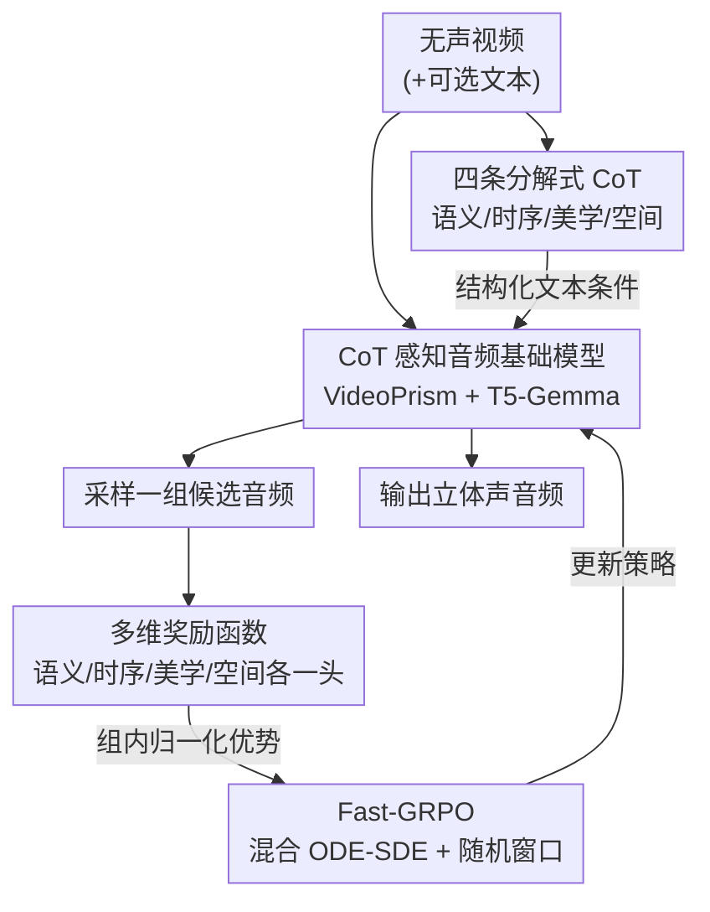

# PrismAudio: Decomposed Chain-of-Thought and Multi-dimensional Rewards for Video-to-Audio Generation

**会议**: ICLR 2026  
**OpenReview**: [https://openreview.net/forum?id=cIfDKEbAky](https://openreview.net/forum?id=cIfDKEbAky)  
**代码**: 项目页 https://PrismAudio.github.io （代码待确认）  
**领域**: 视频到音频生成 / 多模态  
**关键词**: 视频配音, 思维链分解, 多维奖励, GRPO, 流匹配扩散

## 一句话总结
PrismAudio 把视频配音（V2A）拆成语义、时序、美学、空间四条专门的思维链（CoT），每条 CoT 配一个对应的奖励函数，再用高效的 Fast-GRPO 做多维强化学习对齐，在 VGGSound 和自建的 AudioCanvas 上四个感知维度同时刷到 SOTA，且参数更少、推理更快。

## 研究背景与动机
**领域现状**：视频到音频生成（V2A，也叫 video foley）要从一段无声视频（外加可选文本）合成声音。一个"好"的配音必须同时满足四个人类感知维度：语义一致（声音对得上画面里的物体/事件）、时序同步（声音的起止节拍对得上画面动作）、美学质量（听感丰富、自然、有制作感）、空间准确（立体声的左右声像与画面方位一致）。主流方法从早期纯视觉条件（Diff-Foley、V2A-Mapper）演进到显式文本条件（MMAudio、MovieGen Audio），最近 ThinkSound 引入了多模态大模型的思维链推理，先做结构化的"音频规划"再渲染，显著提升了可解释性。

**现有痛点**：作者指出现有方法（尤其 ThinkSound）有三个硬伤。其一是**单体式规划**——所有音频分析都在一条推理路径里生成，把语义理解、同步、空间、美学这些本质不同的分析任务揉成一团，复杂场景下容易顾此失彼甚至产生多模态幻觉。其二是**目标纠缠**——把这几个相互竞争的感知目标塞进一个统一的重建损失里优化，模型学不到随上下文变化的权衡，最终退化成只优化信号级重建。其三是**缺乏人类偏好对齐**——只对着文本匹配训练，没有机制去学"人耳听起来满意"，结果技术上正确但感知上平庸。

**核心矛盾**：四个感知目标本身是相互依赖且互相牵制的。比如只盯着语义一致，可能生成一个对得上但平淡无味（美学差）的声音；或者声音类型对了但时序对不上。单一损失/单一奖励无法在这些竞争目标间找到合适的权衡点。

**本文目标**：让模型在四个维度上**同时**给出高质量推理、并**同时**优化四个维度的人类偏好，而不是在一个维度上提升、却牺牲其它维度。

**切入角度**：作者的观察是——不同的感知维度需要根本不同的分析框架（语义靠内容识别、空间靠方位定位逻辑、美学靠主观质量评估），那就不该混在一条推理里。把推理拆开，再让每条拆出来的推理对准一个专门的奖励信号，就能用多维强化学习把"推理"和"偏好"一起优化。

**核心 idea**：用"分解式思维链 + 维度对齐的多维奖励 + 高效 GRPO"替代"单体推理 + 单一重建损失"，让四个维度各管各的、又能联合对齐人类偏好。

## 方法详解

### 整体框架
PrismAudio 建立在一个 CoT 感知的音频基础模型之上，整条管线分三步：先升级一个能吃结构化推理文本、能理解视频的**音频基础模型**；再把单体推理**分解成四条专门 CoT**（语义/时序/美学/空间），用 Gemini 2.5 Pro 造数据、微调 VideoLLaMA2 来生成这四条 CoT；最后用 **Fast-GRPO** 做多维强化学习后训练——每条 CoT 配一个对应的奖励函数，采样一组候选音频、算多维加权奖励、做组内归一化得到优势，再用混合 ODE-SDE 采样高效地更新策略。输入是无声视频（+可选文本），输出是与画面在四个维度上都对齐的（立体声）音频。

### 关键设计

**1. CoT 感知音频基础模型：换掉看不懂视频、读不懂推理的编码器**

ThinkSound 这类模型用基于多扩散 Transformer + 流匹配（flow matching）的骨干，但有两个短板会拖累多维推理：视频理解不足、文本编码器吃不下结构化推理文本。PrismAudio 做两处针对性替换。视频侧，把逐帧当静态图处理的 CLIP 编码器换成 **VideoPrism**——一个专为视频设计、在大规模视频上预训练的统一 ViT 编码器，能捕捉物体、动作、环境上下文这些多维推理真正需要的时序语义。文本侧，把标准 T5 升级成 **T5-Gemma**，它把 decoder-only 大模型的推理能力蒸进 encoder-decoder 架构，从而能正确地把含逻辑结构、因果关系的 CoT 文本作为条件喂给生成模型。这两处替换是后面"多维推理 + 多维奖励"能跑起来的地基：编码器看不懂视频、读不懂推理，再精巧的 CoT 分解也是无源之水。

**2. 多维思维链分解：把一条单体推理拆成四条专门 CoT**

这一步直击"单体规划"痛点。作者先用 **Gemini 2.5 Pro** 的多模态理解能力构造高质量 CoT 训练数据，再用这批数据微调开源的 **VideoLLaMA2**，让它针对一段视频生成四条彼此独立、各有分工的推理文本：**语义 CoT** 识别音频事件及其特征（"马开始跑、强劲马蹄声、最后停下伴随喘息"）；**时序 CoT** 确定事件的先后节奏（"先慢步、再加速成稳定节奏、最后慢下来停住"）；**美学 CoT** 关注音质（"清脆的马蹄声、自然的混响、均衡的响度"）；**空间 CoT** 分析声像方位（"声音从左侧平移过中间、淡出到右侧"）。四条 CoT 按固定顺序拼接成多维 CoT，作为增强的结构化文本条件去微调音频基础模型。消融显示这种分解相比单体 CoT 在语义（CLAP 0.52 vs 0.46）和美学（CE 4.26 vs 3.79）上明显更好——单体推理块顾不过来相互竞争的目标，会产生维度间干扰。

**3. 多维奖励函数：每条 CoT 配一个对准它的现成评估器**

光分解推理不够，还得让每个维度有自己的"打分人"，才能做有针对性的偏好优化，破解"目标纠缠"。作者为四个维度各设计一个奖励，且刻意复用领域里成熟的专用模型：**语义奖励**用 MS-CLAP 测音频-文本对齐；**时序奖励**用 Synchformer 检测音视频同步；**美学奖励**用 Meta Audiobox Aesthetics（一个无参考、训练来预测人类 MOS 的模型）；**空间奖励**用 StereoCRW 验证方向定位准确度。四个奖励头 $\{R_k\}_{k=1}^{K}$ 分别对应四条 CoT，让"推理什么"和"用什么标准奖励"一一对齐，这种 **CoT-奖励对应关系**正是多维 RL 能联合提升所有维度而不是此消彼长的关键。

**4. Fast-GRPO：把随机探索压进一个小随机窗口，让多维 RL 训得起**

把 GRPO 用到扩散/流匹配模型上有个效率瓶颈：流匹配生成本是确定性 ODE，要做 RL 得把它等价改写成 SDE 才有随机性可优化，而 Flow-GRPO 这类做法在**每一步去噪都做 SDE 采样**来算策略比率，开销巨大。Fast-GRPO 的核心思路是**把随机性和优化只限制在一小段、计算便宜的片段里**。具体做两件事。其一是**混合 ODE-SDE 采样器**：每次迭代随机采一个起点 $\ell \in \{0,\dots,T-w\}$，定义一个宽度 $w \ll T$ 的优化窗口 $W(\ell)=\{\ell,\dots,\ell+w-1\}$；窗口外用确定性 ODE 步 $x_{t+1}=x_t+v_\theta(x_t,t,c)\Delta t$，窗口内才用带噪 SDE 步 $x_{t+1}=x_t+\mu_{\text{SDE}}\Delta t+\sigma_t\sqrt{\Delta t}\,\varepsilon_t$。窗口内的 SDE 步诱导出一个可解析的高斯策略 $\pi_\theta(x_{t+1}\mid x_t,c)=\mathcal{N}(\mu_\theta,(\sigma_t^2\Delta t)I)$，于是 GRPO 的策略比率 $r_t(\theta)$ 有闭式解。其二是**随机窗口调度**：窗口位置每轮随机放，保证整条轨迹都有机会被探索到，同时把策略模型的函数求值次数从 $T$ 降到 $w$，复杂度近线性。

为支持多维优化，作者对每个候选先算加权总奖励 $R_{\text{total}}^i=\sum_{k=1}^{K}\lambda_k R_k(x_T^i,c)$，再用组内均值方差做归一化得到优势：

$$A_i = \frac{R_{\text{total}}^i - \mu_{\text{group}}}{\sigma_{\text{group}} + \epsilon}$$

其中 $\mu_{\text{group}},\sigma_{\text{group}}$ 是同一 prompt 下 $N$ 个候选总奖励的均值与标准差，$\epsilon$（如 $10^{-6}$）保数值稳定。最终目标是把 GRPO 目标限制在窗口内的 SDE 步上做带裁剪的优化：

$$\mathcal{J}_{\text{Fast-GRPO}}(\theta)=\mathbb{E}\Big[\tfrac{1}{N}\sum_{i}\tfrac{1}{w}\sum_{t\in W(\ell)}\min\big(r_t^i(\theta)A_i,\ \mathrm{clip}(r_t^i(\theta),1-\varepsilon,1+\varepsilon)A_i\big)\Big]$$

这种设计在理论上保持了正确奖励计算所需的终端数据分布（附录证明），既保留了 GRPO 的组内归一化稳定性，又通过权重 $\lambda_k$ 实现有原则的多目标权衡。

### 一个完整示例
以"一匹马奔跑"的视频为例：四条 CoT 分别产出——语义 CoT「马起步、强劲马蹄、最后停下伴喘息」、时序 CoT「先慢步→加速到稳定节奏→减速停住」、美学 CoT「清脆马蹄声、自然混响、均衡响度」、空间 CoT「声音从左平移过中央、淡出到右」。四条拼成多维 CoT 喂给基础模型，模型用 ODE 快速跑完大部分去噪步、只在随机落点的小窗口里用 SDE 探索，采样出一组（$N$ 个）候选音频。四个奖励头分别给每个候选打分：某候选 $A=0.63$、另一个 $A=0.41$、再一个 $A=0.25$（组内归一化后的优势），Fast-GRPO 据此只在窗口内的几步上更新策略，把模型推向四个维度都更好的那批候选。

## 实验关键数据

### 主实验
在域内 VGGSound 测试集上，PrismAudio 用最少的参数（518M）在四个感知维度全面领先，且推理最快（0.63s）：

| 方法 | 参数 | CLAP↑(语义) | DeSync↓(时序) | CRW↓(空间) | MOS-Q↑ | MOS-C↑ | Time(s)↓ |
|------|------|------|------|------|------|------|------|
| MMAudio | 1.03B | 0.40 | 0.46 | - | 3.95 | 4.03 | 1.30 |
| ThinkSound（前 SOTA） | 1.3B | 0.43 | 0.55 | 13.47 | 4.05 | 4.18 | 1.07 |
| **PrismAudio** | **518M** | **0.47** | **0.41** | **7.72** | **4.21** | **4.22** | **0.63** |
| PrismAudio w/o CoT-RL | 518M | 0.42 | 0.51 | 10.29 | 4.02 | 4.11 | 0.63 |

在域外、更难的 AudioCanvas 基准上，多数 baseline 显著退化（ThinkSound 的 DeSync 崩到 0.80、CRW 崩到 22.82），而 PrismAudio 保持稳定，甚至在语义和同步上超过真值（作者注：因为 RL 能显式优化这些代理指标，而真值含被指标惩罚的自然变化；高 MOS 证明这种控制确实带来更好的人耳听感）：

| 方法 | CLAP↑ | DeSync↓ | CE↑ | CRW↓ | MOS-Q↑ | MOS-C↑ |
|------|------|------|------|------|------|------|
| ThinkSound | 0.48 | 0.80 | 4.10 | 22.82 | 3.79 | 3.80 |
| **PrismAudio** | **0.52** | **0.36** | **4.26** | **12.87** | **4.12** | **4.01** |
| PrismAudio w/o CoT-RL | 0.42 | 0.44 | 3.81 | 15.30 | 3.91 | 3.85 |

### 消融实验

**CoT 推理策略**（AudioCanvas）：

| 配置 | CLAP↑ | DeSync↓ | CE↑ | CRW↓ | 说明 |
|------|------|------|------|------|------|
| Baseline (No CoT) | 0.42 | 0.44 | 3.81 | 15.30 | 无推理，全维度最差 |
| Random CoT | 0.44 | 0.41 | 3.78 | 13.79 | 概念对但结构乱，仅略好于基线 |
| Monolithic CoT (ThinkSound式) | 0.46 | 0.38 | 3.79 | 13.02 | 单体推理 |
| **MultiCoT (本文)** | **0.52** | **0.36** | **4.26** | **12.87** | 分解式推理全面领先 |

**多维 vs 单维奖励**（AudioCanvas，展示"目标纠缠"）：

| 奖励聚焦 | CLAP↑ | DeSync↓ | PQ↑ | CRW↓ | FD↓ | 现象 |
|------|------|------|------|------|------|------|
| Baseline (No RL) | 0.47 | 0.42 | 6.45 | 15.30 | 1.90 | 起点 |
| Semantic Only | **0.54** | 0.58 | 6.62 | 11.89 | 1.84 | 语义最高但时序崩坏 |
| Aesthetic Only | 0.46 | 0.42 | **7.06** | 13.51 | 4.50 | PQ 超高但 FD 翻倍（脱离内容） |
| Spatial Only | 0.47 | 0.42 | 6.44 | **11.88** | 1.77 | 空间最好但语义/美学平 |
| **Multi-dimensional** | 0.52 | **0.36** | 6.68 | 12.87 | 1.53 | 唯一全维度均衡提升 |

### 关键发现
- **分解式推理 + 多维奖励是涨点主力**：去掉 CoT-RL 后，基础模型虽已是强 baseline（部分指标已超前 SOTA），但加回 CoT-RL 后所有维度进一步提升，MOS-Q/MOS-C 相对涨 4.7%/2.7%；在更难的 AudioCanvas 上这一增益更被放大。
- **单维奖励必然顾此失彼**：只奖励语义会把时序 DeSync 从 0.42 推高到 0.58；只奖励美学会把分布指标 FD 从 1.90 翻到 4.50（声音好听但与画面脱节）。只有多维奖励能同时改善四个维度。
- **Fast-GRPO 又快又好**：在语义奖励上，Fast-GRPO 仅 200 步就超过 Flow-GRPO 600+ 步才达到的平台（~0.47），且最终奖励更高（~0.51 vs 0.47），说明混合 ODE-SDE 不只省算力还带来更优的优化结果。

## 亮点与洞察
- **"分解推理 ↔ 对齐奖励"一一对应**：把单体 CoT 拆成四条、再给每条配一个现成的专用评估器当奖励头，是个很干净的解耦——既保住了可解释性，又让多目标 RL 有了独立的、可加权的优化信号。这个"推理维度 = 奖励维度"的对应关系是全文最 aha 的设计。
- **用随机小窗口把扩散 RL 的算力打下来**：Fast-GRPO 只在随机落点的 $w$ 步窗口里做 SDE 探索、其余走确定性 ODE，把策略模型 NFE 从 $T$ 降到 $w$，这个 trick 可迁移到任何流匹配/扩散模型的 GRPO 训练，不限于 V2A。
- **复用成熟评估器当奖励**：直接拿 MS-CLAP / Synchformer / Audiobox-Aesthetics / StereoCRW 当奖励，省掉训练奖励模型的成本，也让"对齐目标"和"评测指标"天然一致——这点对其它多维感知任务（如视频生成、TTS）很有借鉴价值。

## 局限与展望
- 作者承认"超过真值"的现象部分源于 RL 显式优化代理指标，而这些指标本身不完美——意味着对奖励模型的过拟合风险存在，泛化到未被指标覆盖的感知方面时未必稳。
- 多维奖励的权重 $\lambda_k$ 是人为设定的超参，论文没深入讨论如何自适应地学这些权衡权重，不同任务/场景下可能需要重新调。
- 整条管线依赖多个外部大模型（Gemini 2.5 Pro 造数据、VideoLLaMA2 生成 CoT、四个奖励评估器），工程链条长、复现成本高；CoT 数据质量受教师模型上限约束。
- 评测仍主要在 VGGSound（域内）+ AudioCanvas（域外）两个集合上，空间维度的真值标注与 StereoCRW 指标本身的可靠性还较新，结论的稳健性有待更多立体声场景验证。

## 相关工作与启发
- **vs ThinkSound**：两者都用 CoT 做 V2A 规划，但 ThinkSound 是单体推理 + 统一重建损失、无偏好对齐；PrismAudio 把推理分解成四维、给每维配奖励、用 RL 对齐人类偏好，直接解决了单体推理的维度间干扰和目标纠缠。
- **vs Flow-GRPO / DanceGRPO**：它们把流匹配 ODE 全程改写成 SDE、每步都采样做单目标优化；Fast-GRPO 只在随机小窗口做 SDE，复杂度近线性，且首次扩展到多维奖励分解。
- **vs MMAudio / MovieGen Audio**：这些是带文本条件的扩散 V2A，但仍是不可解释的"黑箱"且只优化重建；PrismAudio 用显式分解 CoT 保留可解释性，并用多维 RL 对齐感知偏好。

## 评分
- 新颖性: ⭐⭐⭐⭐⭐ 首个把专门化 CoT 分解与多维 RL 对齐结合进 V2A 的框架，Fast-GRPO 也是扎实的效率创新
- 实验充分度: ⭐⭐⭐⭐⭐ 域内域外双基准、四维客观+主观 MOS、CoT 策略与单/多维奖励的系统消融都齐全
- 写作质量: ⭐⭐⭐⭐ 动机推导清晰、图表完整，但术语密集、依赖大量外部模型，复现门槛偏高
- 价值: ⭐⭐⭐⭐⭐ 用更少参数刷到四维 SOTA，且 Fast-GRPO 与"推理-奖励对齐"思路可迁移到更广的多目标生成任务

<!-- RELATED:START -->

## 相关论文

- [\[NeurIPS 2025\] ThinkSound: Chain-of-Thought Reasoning in Multimodal Large Language Models for Audio Generation and Editing](../../NeurIPS2025/audio_speech/thinksound_chain-of-thought_reasoning_in_multimodal_large_language_models_for_au.md)
- [\[ICLR 2026\] SyncTrack: Rhythmic Stability and Synchronization in Multi-Track Music Generation](synctrack_rhythmic_stability_and_synchronization_in_multi-track_music_generation.md)
- [\[ICLR 2026\] Flow2GAN: Hybrid Flow Matching and GAN with Multi-Resolution Network for Few-step High-Fidelity Audio Generation](flow2gan_hybrid_flow_matching_and_gan_with_multi-resolution_network_for_few-step.md)
- [\[ICLR 2026\] AC-Foley: Reference-Audio-Guided Video-to-Audio Synthesis with Acoustic Transfer](ac-foley_reference-audio-guided_video-to-audio_synthesis_with_acoustic_transfer.md)
- [\[ICML 2026\] Two-Dimensional Quantization for Geometry-Aware Audio Coding](../../ICML2026/audio_speech/two-dimensional_quantization_for_geometry-aware_audio_coding.md)

<!-- RELATED:END -->
