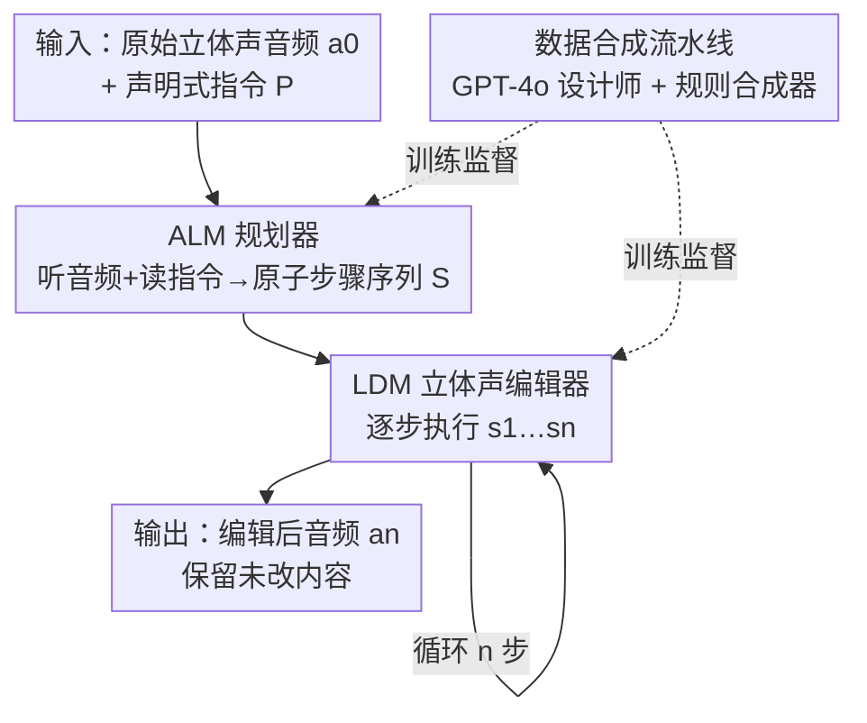

# SmartDJ: Declarative Audio Editing with Audio Language Model

**会议**: ICLR 2026  
**OpenReview**: [https://openreview.net/forum?id=eNmANCkefl](https://openreview.net/forum?id=eNmANCkefl)  
**论文**: [项目页](https://waves.seas.upenn.edu/projects/smartdj)  
**代码**: 待确认  
**领域**: 音频编辑 / 音频语言模型 / 扩散模型  
**关键词**: 声明式编辑, 立体声音频, 音频语言模型, 潜在扩散, 原子编辑操作

## 一句话总结
SmartDJ 提出"声明式音频编辑"范式——用户只说想要的结果（如"把这段录音变成晴朗森林"），由音频语言模型（ALM）当规划器把高层指令拆成一串原子编辑步骤，再交给立体声潜在扩散模型（LDM）逐步执行，在感知质量、空间真实感和语义对齐上全面超过此前的音频编辑方法。

## 研究背景与动机
**领域现状**：文本驱动的音频生成和编辑近年进展很快，出现了一批基于扩散模型的方法（Audit、WavCraft、AudioEditor 等），能根据文字指令对音频做增删改。

**现有痛点**：这些方法有两个硬伤。其一，它们只认"模板化"的低层指令，比如"add the sound of birds""remove the sound of rain"——用户必须自己想清楚每一步怎么做、按程序化（procedural）的方式一步步下命令。其二，它们几乎都只处理单声道（mono）音频，丢掉了双耳时间差/强度差这些空间听觉线索，结果即使语义正确，听起来也是"平的"，无法支撑 VR/AR 的沉浸感。

**核心矛盾**：声明式编辑要求系统能从"目标"自动桥接到"操作序列"。当用户说"把我放进音乐厅"时，系统得自己推理：哪些声音要去掉、哪些要保留、音量怎么调、什么时候引入新事件、空间位置怎么移。纯扩散模型缺乏这种推理能力，看不懂抽象指令；纯语言模型虽能解析文字，却没有对音频本身的感知（grounding），不知道原始音频里到底有哪些声音事件该压制或保留。两者各缺一半。

**本文目标**：构建一个既能理解自然语言声明式指令、又能感知音频内容、还能输出立体声编辑结果的统一框架。

**切入角度**：作者借鉴多模态大模型在视觉编辑中"用 VLM 引导扩散模型"的成功经验，把音频语言模型（ALM）引入音频编辑回路，让它同时"听"原始音频和"读"指令，充当规划器。

**核心 idea**：用"规划器 ALM + 执行器 LDM"的分工，把音频编辑从程序化任务变成声明式任务——ALM 负责"想清楚要做哪几步"（结果用自然语言表达，可被用户检查/修改），LDM 负责"把每一步精确做出来"。

## 方法详解

### 整体框架
SmartDJ 要解决的是：给定原始立体声音频 $a_0$ 和一句高层声明式指令 $P$，产出满足 $P$ 且保留未编辑内容的目标音频 $a_n$。它把这件事拆成"规划"和"执行"两段串行。

第一段，ALM 同时吃进原始音频 $a_0$ 和指令 $P$，输出一串原子编辑步骤 $S=\{s_1,s_2,\dots,s_n\}$，每一步都是一个具体可执行的小操作（增、删、抽取、调音量、改方向、时移、加混响、改音色）。第二段，LDM 编辑器按顺序逐步执行这些步骤，产生中间结果 $a_1,a_2,\dots,a_n$，其中 $a_n$ 即最终编辑音频。整个过程形式化为：

$$\{s_1,\dots,s_n\}=\mathrm{ALM}(a_0;P),\qquad a_i=\mathrm{LDM}(a_{i-1};s_i),\ i=1,\dots,n$$

关键之处在于 ALM 和 LDM **分开训练**，中间表示是自然语言的原子步骤——用户可以在 LDM 执行前介入、检查或改写计划，实现人在回路。而要训练这套系统，需要"声明式指令 ↔ 原子步骤序列 ↔ 编辑前后音频"的配对数据，公开数据集里没有，所以作者还设计了一条可扩展的数据合成流水线来造监督信号。

### 关键设计

**1. ALM 规划器：把声明式目标翻译成可执行的原子步骤**

这一步直接解决"扩散模型看不懂抽象指令"的痛点。ALM 先用预训练音频编码器 CLAP 把 $a_0$ 编成音频嵌入 $z_a$，通过 adapter 层注入 LLM；指令 $P$ 则被分词成嵌入序列 $(p_1,\dots,p_k)$ 当作文本上下文。模型以自回归方式生成对应原子步骤 $S$ 的 token 序列，训练目标是标准的下一 token 预测：

$$L_{\mathrm{ALM}}=-\sum_{t=1}^{l}\log P_\theta(r'_t=r_t\mid z_a,r_{1:t-1},p_{1:k})$$

其中 $r$、$r'$ 分别是原子步骤文本的真值与预测 token。为高效微调，CLAP 编码器冻结，LLM 只对一小部分层做 LoRA，adapter 层则全量微调。ALM 初始化自 AF2（Audio Flamingo 2，3B 参数）。这样设计的好处是 ALM 既"听得见"原始音频里有哪些事件，又"读得懂"用户想要的结果，从而能推理出该删哪个、该加哪个——这是纯文本 LLM（缺音频 grounding）和纯扩散模型（缺推理）都做不到的。

**2. 立体声潜在扩散编辑器：逐步执行并保住空间线索**

这一步解决"如何把单步操作精确做出来、且不破坏其余内容和空间感"。编辑器用立体声音频 VAE（基于 1D-CNN、连续 VAE 瓶颈、snake 激活，参考 DAC / Stable-Audio-Open）把立体声 $a\in\mathbb{R}^{2\times L}$ 压成潜在 $\hat a\in\mathbb{R}^{C\times L'}$，$C=128$、$L'=L/480$，压缩比 $7.5\times$。第 $i$ 步编辑时，把上一步潜在 $\hat a_{i-1}$ 与一个随机噪声潜在 $\hat a'_i$ 沿通道拼成 $[\hat a_{i-1};\hat a'_i]\in\mathbb{R}^{2C\times L'}$ 输入扩散 Transformer（DiT），步骤文本 $s_i$ 经 FLAN-T5 编码后通过交叉注意力注入，时间步 $t$ 经 AdaLN 注入。训练用去噪损失：

$$L_{\mathrm{LDM}}=\mathbb{E}_{\epsilon,t,s_i,\hat a_{i-1},\hat a'_i}\big\|\epsilon-\epsilon_\theta(t,E_{\text{text}}(s_i),[\hat a_{i-1};\hat a'_i])\big\|^2$$

推理用 DDIM 采样 + classifier-free guidance，引导尺度 $\omega$ 在条件与无条件预测间插值。把 $\hat a_{i-1}$ 作为条件拼进输入，是为了"以原音频为基底做编辑"而非凭空重生成，从而保留未编辑内容；用 DiT + 立体声 VAE（保留相位信息）则让编辑同时在语义上精确、在空间上连贯——这正是 Audit 那种"VAE 在梅尔谱上操作、丢相位"做不到的。

**3. 设计师—合成器数据流水线：无中生有造出声明式编辑监督数据**

声明式编辑的训练数据"指令 ↔ 原子序列 ↔ 编辑轨迹音频"现实中几乎不存在，这一步把它规模化造出来。流水线分两角，恰好镜像模型的"规划—执行"结构。**GPT-4o 当设计师**：随机采样 $K$ 个带标签的单事件音频片段（如 car engine、bell ring、goat bleat），把标签喂给 GPT-4o，让它设计一条声明式指令 $P$（如"Make this sound like a countryside morning"）并拆解成原子步骤序列 $S$。**信号处理当合成器**：先把 $K$ 个片段叠加合成原始音频 $a_0$（空间效果用方向相关的相位和幅度在双声道渲染），然后按每个 $s_i$ 逐步重新合成——若 $s_i$ 改已有事件就调它的音量/方向，若是 add 就按标签从库里检索新片段并叠加。因为每个事件都是独立可编辑参数，改一个事件不会动到其余声源，于是能精确生成完整编辑轨迹 $a_1,\dots,a_n$。这种"事件级参数化合成"是数据可规模化的关键，最终造出 240k 训练对、2k 评测对（声明式任务），单步编辑对更扩到 1M。

### 损失函数 / 训练策略
ALM 与 LDM 分开训练。ALM 在 240k 声明式编辑对上训练 20 epoch、batch 24，学习率 1e-5；LDM 在 1M 单步编辑对上训练 50 万次迭代、batch 256，学习率 5e-5，用 velocity prediction 和 CFG rescaling 抑制过曝，10% 文本替换为空串以学无条件分布。优化器均为 AdamW，硬件为 4 张 NVIDIA L40S。

## 实验关键数据

### 主实验
声明式指令编辑：所有方法都用同一套 ALM 生成的原子步骤来引导（因为没有别的方法能直接看懂声明式指令），与 1k 参考音频比较。

| 框架 | 方法 | 需训练 | 速度 | FD ↓ | FAD ↓ | KL ↓ | LSD ↓ | CLAP ↑ |
|------|------|:---:|------|------|------|------|------|------|
| w/o ALM | Audit (端到端) | ✓ | 2.07s | 28.56 | 10.00 | 3.07 | 1.93 | 0.11 |
| w/ ALM | SDEdit | ✗ | 301s | 19.66 | 3.71 | 3.25 | 2.22 | 0.17 |
| w/ ALM | ZETA | ✗ | 356s | 20.74 | 3.73 | 2.92 | 2.21 | 0.20 |
| w/ ALM | AudioEditor | ✗ | 406s | 19.91 | 4.99 | 3.21 | 2.08 | 0.19 |
| w/ ALM | Audit | ✓ | 11.6s | 21.50 | 5.67 | 2.80 | 1.49 | 0.18 |
| w/ ALM | **SmartDJ** | ✓ | 13.1s | **10.60** | **1.52** | 2.84 | **1.40** | **0.21** |

SmartDJ 在 FD、FAD、LSD 上最低、CLAP 最高（语义对齐最好），KL 也很低；速度（13.1s 完成整条指令）远快于免训练基线（300s+），仅略慢于端到端 Audit，但质量碾压。

单步编辑（节选 add 与 remove/extract，含空间指标 GCC/CRW/FSAD）：

| 方法 | 任务 | FD ↓ | FAD ↓ | KL ↓ | GCC ↓ | CRW ↓ | FSAD ↓ |
|------|------|------|------|------|------|------|------|
| Audit | Add | 27.82 | 5.11 | 1.94 | 74.37 | 217.49 | 0.21 |
| **SmartDJ** | Add | **17.74** | **2.07** | **1.38** | **39.05** | **65.90** | **0.02** |
| Audit | Remove/Extract | 42.48 | 6.73 | 1.96 | 62.06 | 132.72 | 0.67 |
| **SmartDJ** | Remove/Extract | **20.27** | **2.29** | **0.95** | **5.22** | **16.55** | **0.01** |

在 Volume / Time / Reverb / Timbre / Change Direction 各项上，SmartDJ 同样大幅领先，尤其空间指标（GCC、CRW、FSAD）数量级优势明显——作者归因于 Audit 的 VAE 在梅尔谱上丢了相位，而 SmartDJ 的 DiT + 立体声 VAE 保留了相位与跨注意力条件。

### 消融实验

| 配置 / 实验 | 关键指标 | 说明 |
|------|---------|------|
| ALM 步骤生成质量 | BERTScore F1 = 91.5%（P 91.8% / R 92.0%） | 按操作类型分组比对生成计划与真值，语义高度一致 |
| Round-trip 多轮编辑 | LSD 全程最低 | "加 A 再删 A"循环 5 轮，SmartDJ 偏离原音频最小 |
| 人评 A/B（19 人 ×20 对） | 胜率 77%–96% | 质量与对齐两维度全面优于 SDEdit/ZETA/AE/Audit，$p<0.001$ |

### 关键发现
- **空间线索是 SmartDJ 拉开差距的核心**：在 GCC/CRW/FSAD 等立体声指标上往往是数量级领先，根因是保留相位的立体声 VAE + DiT，而梅尔谱基线先天丢相位。
- **多轮编辑不漂移**：round-trip 实验证明逐步编辑后未改内容仍保持，得益于"以 $\hat a_{i-1}$ 为条件做编辑"而非重生成。
- **ALM 会"翻车"在矛盾指令上**：附录失败分析指出，当指令自相矛盾时 ALM 无法完全理解，是当前规划器的短板。

## 亮点与洞察
- **"声明式 vs 程序化"的范式切换**很有启发：把"用户报结果、系统想步骤"做成 ALM+LDM 分工，中间用自然语言原子步骤当接口，天然支持人在回路检查/改写——这套"规划器输出可读中间表示"的思路可迁移到视频、3D 等其他编辑任务。
- **数据流水线与模型结构同构**（设计师↔规划器、合成器↔执行器）：用 GPT-4o 造指令+规则合成器渲染音频，靠"事件级独立参数化"保证改一个不动其余，优雅地造出了原本不存在的声明式编辑监督数据。
- **立体声 + 空间指标**：把空间听觉线索当一等公民，引入 GCC/CRW/FSAD 评测并保留相位，填补了此前音频编辑只做单声道的空白。

## 局限与展望
- **依赖合成数据**：训练监督来自 GPT-4o 设计 + 规则合成器，真实复杂声场（混响交叠、非独立声源）与合成分布的差距未充分检验。
- **ALM 处理矛盾/模糊指令能力有限**：作者承认对自相矛盾的声明式指令理解会失败。
- **两段分开训练**虽换来模块化和可干预，但 ALM 规划误差会直接传给 LDM 且无端到端反馈纠正；级联多步也带来误差累积风险。
- **改进思路**：引入规划-执行联合微调或反馈回路、在真实录音上做域适配、让 ALM 对歧义指令主动澄清。

## 相关工作与启发
- **vs Audit**：Audit 用端到端扩散 + 固定模板指令、单声道梅尔谱（丢相位）；SmartDJ 用 ALM 规划 + 立体声潜在扩散保相位，既懂声明式指令又保空间感，质量与空间指标全面胜出。
- **vs WavCraft**：WavCraft 用 GPT API 解析指令，但要求用户给出完全指定的程序化提示；SmartDJ 真正接受高层抽象的声明式目标并自动拆解。
- **vs AudioEditor / ZETA / SDEdit**：这些是把图像编辑技巧（DDPM 反演、null-text 反演、注意力操控）搬到单声道音频的免训练方法，需 token 级精确改动、难处理声明式指令且推理极慢（300s+）；SmartDJ 训练得到的立体声编辑器又快又好。

## 评分
- 新颖性: ⭐⭐⭐⭐⭐ 首个声明式立体声音频编辑框架，ALM+LDM 分工 + 同构数据流水线均属首创
- 实验充分度: ⭐⭐⭐⭐⭐ 声明式 + 8 类单步操作 + 空间指标 + 人评 + 多轮稳定性，覆盖全面
- 写作质量: ⭐⭐⭐⭐ 框架清晰、动机有力，部分细节（声场合成、失败案例）放在附录
- 价值: ⭐⭐⭐⭐⭐ 范式切换对 VR/AR、影视后期等沉浸式音频应用有直接落地价值

<!-- RELATED:START -->

## 相关论文

- [\[ICLR 2026\] UALM: Unified Audio Language Model for Understanding, Generation and Reasoning](ualm_unified_audio_language_model_for_understanding_generation_and_reasoning.md)
- [\[ICLR 2026\] From Text to Talk: Audio-Language Model Needs Non-Autoregressive Joint Training](from_text_to_talk_audio-language_model_needs_non-autoregressive_joint_training.md)
- [\[ICLR 2026\] Measuring Audio's Impact on Correctness: Audio-Contribution-Aware Post-Training of Large Audio Language Models](measuring_audios_impact_on_correctness_audio-contribution-aware_post-training_of.md)
- [\[ACL 2025\] Towards Reliable Large Audio Language Model](../../ACL2025/audio_speech/towards_reliable_large_audio_language_model.md)
- [\[ICLR 2026\] JALMBench: Benchmarking Jailbreak Vulnerabilities in Audio Language Models](jalmbench_benchmarking_jailbreak_vulnerabilities_in_audio_language_models.md)

<!-- RELATED:END -->
