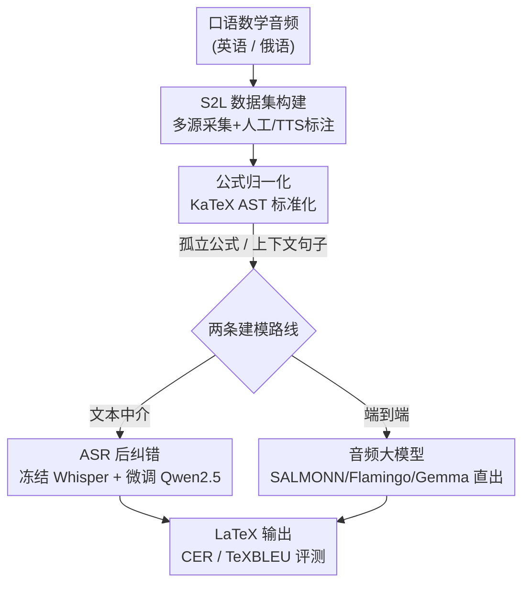

# Speech-to-LaTeX: New Models and Datasets for Converting Spoken Equations and Sentences

**会议**: ICLR 2026  
**OpenReview**: [https://openreview.net/forum?id=gk8WMxzIQP](https://openreview.net/forum?id=gk8WMxzIQP)  
**代码**: https://github.com/dkorzh10/speech2latex （有）  
**领域**: 语音识别 / 多模态 / 数据集  
**关键词**: 语音转LaTeX, 口语数学表达, ASR后纠错, 音频大模型, 多语言数据集

## 一句话总结
本文针对"把口头念出来的数学公式/句子转写成 LaTeX"这一被忽视的任务，构建了首个大规模开源数据集（英俄双语、6.6 万条人工标注 + 57.1 万条合成音频），并系统比较了"ASR 后纠错"和"端到端音频大模型"两条路线，其中 SALMONN 在自建 S2L-equations 上把字符错误率（CER）从 MathSpeech 的 64% 压到 17.5%。

## 研究背景与动机
**领域现状**：现代语音识别（Whisper、Wav2Vec2）在通用语音上表现很强，但一遇到数学内容就崩——简单符号（$+$、$\pi$、$\sqrt{\ }$）还能识别，复杂或嵌套的表达式（分式套根号、上下标、希腊字母）基本无能为力。把口语数学转成 LaTeX（Speech-to-LaTeX, 简称 S2L）在自动课堂转录、科研笔记、多模态助手等场景里都是刚需，却几乎没人系统研究。

**现有痛点**：唯一较成体系的前作 MathSpeech 用"ASR 后纠错"思路，但有四个硬伤：(1) 依赖**两路 ASR** 转写当输入，又重又慢；(2) 只支持**孤立公式**，不处理带上下文的数学句子；(3) 不支持多语言；(4) 测试集只有 1.1k 条、没有公开训练数据，训练语料是用 TTS 把 MathBridge 公式念出来的、且不开源。整个领域既缺数据、又缺端到端的现代建模方案。

**核心矛盾**：口语数学本身充满**歧义**——同一句话可以对应多个合法 LaTeX。比如"kappa"既可能是 $\kappa$ 也可能是 $\varkappa$；"one over x plus two"可以是 $\frac{1}{x}+2$、$\frac{1}{x+2}$ 或 $1/x+2$。这意味着任务不是简单的"转写"，而是要在语音里推断出严格的符号结构，且评测指标（如 CER）会因为这种歧义被人为推高，难以反映真实质量。

**本文目标**：(1) 造一个足够大、足够多样、且**开源**的口语数学数据集，覆盖孤立公式和上下文句子两种形态、英俄两种语言；(2) 系统比较多条建模路线，建立可复现的 baseline。

**切入角度**：作者认为 S2L 卡住的根本原因是"没有数据"，所以先解决数据，再在数据之上把"ASR 后纠错"和"端到端音频大模型"两条路线都跑通对比，而不是只押注某一条。

**核心 idea**：用"人工标注 + 大规模 TTS 合成"混合造数据，叠加"冻结 ASR + 微调小 LLM 做后纠错"与"音频大模型端到端直出 LaTeX"两条互补路线，第一次把 S2L 做成一个有数据、有 benchmark、有强 baseline 的完整任务。

## 方法详解

### 整体框架
整篇工作可以拆成"先造数据、再跑两条建模路线"两大块。数据侧从 MathBridge、TextTeller、Proof-Pile-2 等来源采集公式与句子，配上参考读法，再经过 KaTeX 归一化清洗，最后用众包人工标注 + 多套 TTS 合成两种方式录成音频，形成 S2L-equations（孤立公式）和 S2L-sentences（上下文句子）两个子集。建模侧拿到一段口语音频后走两条路：一条是**ASR 后纠错**（Whisper 先转成文本，再让微调过的 Qwen2.5 把文本改写成 LaTeX），另一条是**端到端音频大模型**（音频编码器 + adapter 把波形直接喂给 LLM，跳过显式转写）。两条路最后都输出 LaTeX，用 CER 和 TeXBLEU 评测。

### 关键设计

**1. S2L 双子集数据集：用人工 + 合成混合标注解决"口语数学无数据"**

最核心的贡献不是模型而是数据。作者要解决的痛点很直接：S2L 此前根本没有可训练的大规模语料。他们从三类来源取材——MathBridge（大规模公式-读法对，但质量参差，存在"文字冒充公式""非法 LaTeX""缺读法""重复""读法里混 LaTeX""公式-读法错配"等七类毛病）、TextTeller（OCR 研究里的复杂公式，抽 9.4k 条并用 GPT-4 生成每条 4 种读法，2 英 2 俄）、以及 Proof-Pile-2 的 arXiv 子集（抽上下文数学句子）。原始 MathBridge 2300 万条经启发式过滤 + LaTeX 编译检查清到 150 万条有效样本，其中 40 万条用 TTS 配音。最终数据集分两个子集：**S2L-equations**（约 1.07 万条孤立公式）和 **S2L-sentences**（约 1.24 万条上下文句子，每句还按公式数量做了分层平衡，并加入 1.4k 条无公式负样本）。标注上走两条腿：人工众包（33 名标注者、每条最多 3 人念，人工抽检 10%、拒绝率超 15% 只保留通过部分）共约 6.6 万条人工音频；TTS 合成（主用开源 XTTSv2，辅以 SaluteSpeech 等商用 API，多套合成嗓音）扩出约 57.1 万条。这种"少量高质量人工 + 大量廉价合成"的组合，既保证了真实读音的多样性，又把规模撑到了能训模型的量级，作者实测合成数据训练的模型能较好泛化到人工测试集、没有剧烈掉点。

**2. 基于 KaTeX AST 的公式归一化：消解"同义不同写"对训练和评测的污染**

口语数学的歧义会被 LaTeX 的书写自由度放大——`\int_{a}^{b} f(x) dx` 和 `\int_a^bf(x)dx` 表示同一个积分，却有很高的 CER；大小写（$\phi$ vs $\Phi$）、字体（$\mathcal{R}$ vs $R$）也都会制造虚假差异。如果不处理，训练标签自相矛盾、评测指标失真。作者用一个 KaTeX 的 fork 把所有公式解析成抽象语法树（AST）再重建，统一记号、消除多余空格、补齐必需的花括号、统一算子名（如 `\underset{\xi}{\max}` 归一成 `\max_{\xi}`）。这一步把 S2L-equations 上的 CER 直接降了约 1%。归一化不仅清洗了训练数据，也用在评测阶段——预测和参考都先归一化再算指标，这样和 MathSpeech 对比才公平（正是这一步把 MathSpeech 在 S2L-equations 上的 CER 从 92% "改善"到 64%，但仍远逊于本文模型）。

**3. ASR 后纠错与端到端音频大模型两条互补路线：在同一数据上对照建模空间**

作者没有只押一条路，而是把两条主流范式都跑通对比。**ASR 后纠错**：先用冻结的 Whisper-Large v3 把音频转成文本（实测它对希腊字母和结构化表达式的转写最准，优于 Canary、WavLM、Wav2Vec2），再把转写喂给**微调过的 Qwen2.5 / Qwen2.5-Math（0.5B/1.5B/7B）**改写成 LaTeX——这条路能借助 LLM 在海量文本数学语料上的先验，且不需要昂贵的音频标注，但天花板被 ASR 转写质量卡死。**端到端音频大模型**：用 SALMONN-13B、Qwen-Audio、Gemma-3n、Audio Flamingo-3，音频编码器先抽特征、经 adapter 对齐到 LLM 的 token 空间，再与文本 prompt 的 token 拼接送进 LLM 直接解码出 LaTeX，绕开了显式转写这个信息瓶颈；这些模型用 LoRA 微调、冻结音频编码器和 adapter。两条路的对照实验本身就是贡献：结果显示端到端的 SALMONN 全面胜出，说明跳过文本中介、让模型直接从声学信号推断符号结构，对这个高歧义任务更有利。

### 损失函数 / 训练策略
所有音频统一重采样到 16kHz；S2L-equations 标签里额外去掉 `$` 符号。ASR 侧 Whisper 冻结、只微调后纠错 LLM（小模型全量微调，7B 用 LoRA）；音频大模型侧冻结音频编码器与 adapter、只用 LoRA 微调 LLM。数据划分用三种策略检验泛化：(i) **公式不相交划分**（train/test 公式完全不重叠，测"是否只是背公式"）；(ii) **来源划分**（test 全是人工音频，train 分别用合成/人工/混合，测"合成数据能否泛化到真人"）；(iii) **单语 vs 双语**（测英俄混训是否更好）。

## 实验关键数据

### 主实验
S2L-equations（英语测试集，指标 CER，越低越好；TeXBLEU 越高越好）：

| 模型 | 训练数据 | CER (Mix) | TeXBLEU (Mix) |
|------|---------|-----------|---------------|
| MathSpeech | MS-train | 64.04 | 83.71 |
| Qwen2.5-0.5B | Mix-full | 27.21 | 90.20 |
| Qwen2.5-1.5B | Mix-full | 25.69 | 90.70 |
| Flamingo-3-8B | Mix | 23.25 | 91.32 |
| Gemma-3n-8B | Mix-full | 34.24 | 89.15 |
| **SALMONN-13B** | Mix-full | **17.50** | **93.68** |

与 MathSpeech 的跨 benchmark 对比（CER）：

| 模型 | MathSpeech benchmark | S2L-equations |
|------|----------------------|---------------|
| MathSpeech | 27.7% | 64.0% |
| Qwen2.5-0.5B | 30.0% | 27.2% |
| SALMONN | 27.7% | 17.5% |

可以看到：在 MathSpeech 自己的 benchmark 上，本文模型与 MathSpeech 打平（27.7% vs 27.7%/30.0%）；但在更难、更多样的 S2L-equations 上，本文模型把 MathSpeech 的 64.0% 拉开 36 个百分点以上（SALMONN 仅 17.5%），且 MathSpeech 有 1.2 亿参数 + 800 万训练样本，本文 0.5B 模型只用了约 55 万样本就反超。

### S2L-sentences 与消融
S2L-sentences（人工测试集，CER，"Eq."=只看句中公式，"Text"=只看文字部分）：

| 模型 | 训练 | Sent. CER | Text CER | Eq. CER |
|------|------|-----------|----------|---------|
| Qwen2.5-0.5B | H | 29.18 | 23.13 | 56.93 |
| Qwen2.5-Math-1.5B | H | 23.78 | 18.80 | 45.48 |
| Qwen2.5-7B (LoRA) | Mix | 18.75 | 12.36 | 43.75 |
| **SALMONN-13B** | Mix | **15.43** | **9.57** | **39.68** |
| Qwen2.5-1.5B (5-shot) | H | 27.94 | 20.50 | 63.99 |

### 关键发现
- **端到端 > 后纠错**：SALMONN-13B 在两个子集上都最优（公式 CER 17.5% / 句中公式 39.7%、文字 9.6%），跳过文本中介确实更适合高歧义任务；而 Flamingo-3 只与小后纠错模型持平，Gemma、Qwen-Audio 反而更差，说明不是所有音频大模型都吃这套。
- **合成数据有用但要看语言**：英语上加 40 万 TTS 样本能提升指标，但俄语测试反而变差，作者归因于语言不平衡。
- **微调 ≫ few-shot**：5-shot / 25-shot 提示远不如微调，只有 Qwen2.5-7B（25-shot）在句中公式上勉强追到 47%。
- **句中公式比孤立公式更难**：同一公式嵌进句子上下文后，CER 明显升高（孤立 17.5% → 句中 39.7%），上下文反而增加了切分和识别难度。
- **数学专用模型没明显优势**：Qwen2.5-Math-1.5B 并不稳定优于 Qwen2.5-1.5B，作者推测因为输入是自然语言读法而非数学表达式，数学预训练用不上；多语言训练也不总有益。
- **生成 LaTeX 多数可编译**：预测公式的 KaTeX 编译成功率 98%–99.5%，失败主要是括号问题；给 tokenizer 额外加 `{ } ^ _` 等符号 token 并无可测提升。

## 亮点与洞察
- **指标失真的诚实讨论**：作者反复强调"高 CER 不代表质量差"，因为口语数学本身一对多歧义。这种对评测局限的坦诚，比单纯刷低数字更有价值——他们甚至给出 SALMONN 的预测样例表，让读者直观判断"54.5% CER 的 $E=F/q$"其实语义没错。
- **小模型反超大模型的样本效率证据**：0.5B + 55 万样本反超 1.2 亿 + 800 万样本的 MathSpeech，说明在这个任务上数据质量/多样性比参数量和样本量更关键。
- **"先解决数据"的研究范式**：面对一个 underexplored 任务，作者的选择是先把数据基建做扎实再谈建模，这套"人工 + TTS 混合标注 + AST 归一化清洗"的流程可直接迁移到其他低资源结构化转写任务（如口语化学式、口语代码）。
- **可复用 trick**：用 KaTeX AST 重建做归一化，对任何需要比较 LaTeX 的任务（OCR、生成、评测）都能降噪。

## 局限与展望
- **歧义没有根治**：模型仍无法在"念法不带括号"时可靠恢复结构（如"2 squared from x plus 1"对应 $\frac{2}{x^2+1}$ 还是 $\frac{2}{x^2}+1$），这是任务本身的天花板，作者只能部分缓解。
- **合成数据的偏置**：大量公式和读法由 GPT-4 生成，可能引入分布偏置；虽然混入真实学术数据和众包语音做缓解，但合成主导仍可能限制泛化边界。
- **语言覆盖有限**：只做了英俄两语，且俄语上合成数据反而有害，多语言扩展还需更细的平衡策略。
- **句中公式仍弱**：上下文句子里的公式 CER 近 40%，离实用还有距离；如何利用上下文反哺公式识别（而非被上下文干扰）是明确的改进方向。
- **大模型未充分发挥**：7B 模型用 LoRA + 冻结，未必比全量微调的小模型强，更大规模的全量微调可能还有空间。

## 相关工作与启发
- **vs MathSpeech**：MathSpeech 用双路 ASR + 两个 T5-small 做后纠错，只支持孤立英文公式、训练数据不开源；本文只用单路 ASR、支持公式 + 句子 + 英俄双语、数据全开源，且在更难的测试集上大幅领先（17.5% vs 64.0%）。
- **vs MathBridge**：MathBridge 解决的是纯文本的 Text-to-LaTeX（没有音频），且数据质量差、重复多；本文把它当作公式来源之一，经重度清洗后用于 S2L 音频任务。
- **vs Spoken-MQA**：那条线关注口语数学**推理**（算术为主），缺 LaTeX 风格的符号表达式；本文专注符号转写，互补而非重叠。
- **vs 通用音频大模型（SALMONN/Qwen-Audio）**：这些模型本不是为数学 LaTeX 设计的，缺符号精度控制；本文证明只要有对的数据 + LoRA 微调，SALMONN 这类模型能成为 S2L 的强 baseline。

## 评分
- 新颖性: ⭐⭐⭐⭐ 首个大规模开源 S2L 数据集 + 双语 + 句子级任务，填补明显空白，但建模上是已有范式的组合应用。
- 实验充分度: ⭐⭐⭐⭐⭐ 两子集、三种划分、多模型规模、后纠错 vs 端到端全面对照，并诚实讨论指标局限。
- 写作质量: ⭐⭐⭐⭐ 任务动机和数据流程讲得清楚，对歧义和指标失真的讨论尤其加分。
- 价值: ⭐⭐⭐⭐⭐ 开源数据 + benchmark + 强 baseline，为后续 S2L 研究提供了完整基建。

<!-- RELATED:START -->

## 相关论文

- [\[ICLR 2026\] ParaS2S: Benchmarking and Aligning Spoken Language Models for Paralinguistic-Aware Speech-to-Speech Interaction](paras2s_benchmarking_and_aligning_spoken_language_models_for_paralinguistic-awar.md)
- [\[ICLR 2026\] Stitch: Simultaneous Thinking and Talking with Chunked Reasoning for Spoken Language Models](stitch_simultaneous_thinking_and_talking_with_chunked_reasoning_for_spoken_langu.md)
- [\[ICLR 2026\] TASTE: Text-Aligned Speech Tokenization and Embedding for Spoken Language Modeling](taste_text-aligned_speech_tokenization_and_embedding_for_spoken_language_modelin.md)
- [\[ICLR 2026\] Towards True Speech-to-Speech Models Without Text Guidance](towards_true_speech-to-speech_models_without_text_guidance.md)
- [\[ICML 2025\] Long-Form Speech Generation with Spoken Language Models](../../ICML2025/audio_speech/long-form_speech_generation_with_spoken_language_models.md)

<!-- RELATED:END -->
