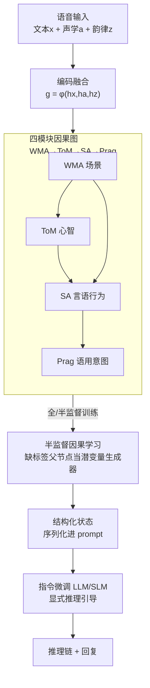

# Speech World Model: Causal State–Action Planning with Explicit Reasoning for Speech

**会议**: ICLR 2026  
**OpenReview**: [https://openreview.net/forum?id=YGUKPGO182](https://openreview.net/forum?id=YGUKPGO182)  
**代码**: https://github.com/eureka235/eureka235.github.io  
**领域**: 语音理解 / 多模态 / 世界模型  
**关键词**: 语音语言模型, 因果图, 世界模型, 显式推理, 半监督学习

## 一句话总结
本文提出 Speech World Model（SWM），把语音理解拆成「世界模型激活 / 心智理论 / 言语行为 / 语用意图」四个模块，让它们通过一张因果有向无环图相互推断状态，再把这张图推出的结构化状态作为显式提示喂给指令微调的（语音）大模型，从而以仅 20 GPU 时的极低成本逼近 Gemini 2.5 Pro 的语音推理能力。

## 研究背景与动机
**领域现状**：当前主流语音语言模型（SLM）走的是「语音编码器 + 大语言模型」的级联范式，把语音理解当成一个黑盒：编码器把音频压成 token，LLM 在 token 上做识别、情感分类、意图识别等一系列任务，最后把这些孤立任务的输出拼在一起当作「推理结果」。

**现有痛点**：这种拼装式做法有两个硬伤。其一，它把 ASR、情感识别、言语行为识别、意图识别当成互不相干的独立任务，**忽略了这些语音成分之间内在的依赖关系**——比如说话人从中性变愤怒，会直接改变这句话的言语行为类型（陈述意见 → 投诉/升级）。其二，真实语音数据往往只有**部分模块有标注**（例如场景标签 WMA 经常缺失），级联模型在稀疏监督下推理能力很弱，容易产生幻觉，还存在「文本主导偏置」——只盯着说了什么、忽略怎么说的。

**核心矛盾**：到底是真推理还是高级的模式匹配？作者认为根因在于现有系统**没有把语音各维度之间的因果结构显式建模出来**。Chain-of-Thought 提示是一条平行思路，它靠扩张搜索空间来提升推理，但搜索过程**不以人类语音感知原理为根基**，且计算开销大。

**本文目标**：(1) 构造一个能显式表示语音潜在状态、并刻画状态间因果流动的结构；(2) 在仅有部分标注的数据上也能可靠推断缺失模块；(3) 用这个结构去约束 LLM 的推理链，让推理更可解释、幻觉更少。

**切入角度**：从认知科学借力——人类语音感知被认为是**分层、模块化**的（声学、语言、副语言处理），且各模块通过因果与互惠关系交互；同时 World Model 的思想认为「下一状态可由当前状态条件预测」。两者结合，语音理解天然存在一套因果依赖结构。

**核心 idea**：用一张**认知接地的因果图**把语音理解因子化成四个模块状态，把「动作」重新定义为「一个状态对另一个状态施加的因果影响」，先训出这张图作为「认知状态搜索空间」，再把它的输出当显式引导喂给指令微调的 SLM。

## 方法详解

### 整体框架
SWM 是一个**两阶段**系统。第一阶段训练一张语音世界模型因果图：把文本 $x$、声学 $a$、韵律 $z$ 编码并融合成 $g=\phi(h_x,h_a,h_z)$，图中四个节点（WMA / ToM / SA / Prag）各自是一个神经网络分类器，每个节点的状态 $S_v$ 由它在因果图中的父节点状态加融合特征推出，从而把语音理解变成一条可解释的状态推断链。第二阶段冻结这张图，把它推出的结构化状态（状态节点 + 信息流）序列化进 prompt，对（语音）大模型做指令微调，让它产出一段透明的因果推理 trace 加一句面向用户的回复。

整条管线的输入是一段语音（及其转写），输出是「四个模块的离散状态 + 推理链 + 回复」。中间的关键是那张因果图：它既是把语音感知拆模块的载体，又是在半监督下把缺标签模块「补」出来的生成结构。

### 关键设计

**1. 四模块认知因果图：把语音理解因子化成「在哪/是谁/做什么/为什么」**

针对级联模型把语音当黑盒、忽略成分间依赖的痛点，作者把语音理解显式拆成四个潜变量模块，并按认知链条排成一张有向无环图 $G=(V,E)$。四个模块分别是：World Model Activation（WMA，情境接地，激活相关知识分区，如 SmartHome / Finance / Alarm）、Theory of Mind（ToM，说话人的内在情感与人格状态）、Speech Act（SA，这句话的言外行为，如提问/命令/断言）、Pragmatic Intent（Prag，说话人想达到的真实目的，如用提问来求助或讽刺）。它们不是随意挑的，而是覆盖「where → who → what → why」的层次认知链，对应通信标准模型与认知语用学。每个节点是一个离散类别分类器，节点状态由其父节点决定：

$$S_v = f_v\big(\{S_u : u \in \mathrm{Pa}(v)\},\, A_{u\to v}\big)$$

其中 $A_{u\to v}$ 是父节点 $u$ 对 $v$ 的「动作」。整张图的联合后验按 DAG 分解为 $p(Z|X)=p(z_{WMA}|X)\cdot p(z_{ToM}|X)\cdot p(z_{SA}|z_{WMA},z_{ToM},X)\cdot p(z_{Prag}|z_{SA},z_{ToM},z_{WMA},X)$。相比把四件事独立预测，显式建模因果依赖让收敛更快，也让推理链可解释。

**2. 把「动作」重定义为状态间的因果影响：World Model 视角下的前向动力学**

这是本文最关键的概念创新。传统世界模型里「动作」指外部指令，但语音里没有这样的外部动作。作者把整个系统看成一个**前向动力学模型**：当前潜在状态加上一个动作得到下一个潜在状态，而这里的「动作」被理解为**一个状态节点对另一个状态节点施加的因果影响**。例如 ToM 从 neutral 跳到 anger，下游 SA 就可能从 Statement-opinion 变成 Complaint/Escalate——这个状态转移本身就是「动作」。这样一来，语音理解被纳入 World Model 的统一框架（生成式世界模型 ↔ 语言世界模型 ↔ 本文因果图），「ΔState → Action」让因果图天然成为潜变量的生成结构，为后面半监督补标签埋下伏笔。

**3. 半监督因果训练 + 边级 teacher forcing：让缺标签的父节点被子节点的监督「带飞」**

针对真实语音只有部分标注（WMA 尤其常缺）的痛点，作者设计了多任务 + 半监督联合训练。多任务监督损失只对有标签的节点算交叉熵：$L_{sup}=\sum_{i=1}^{N}\sum_{v\in V} m_{i,v}\,\mathrm{CE}(y_{i,v},S_{i,v})$，其中 $m_{i,v}$ 标记样本 $i$ 的节点 $v$ 是否有标签。训练时按边做 teacher forcing：子节点以概率 $\tau_{i,u\to v}\sim\mathrm{Bernoulli}(p_{u\to v})$ 接收真值父状态，否则接收父节点的预测分布。关键在半监督部分——当父节点 $j$ 无标签、其子节点 $k$ 有标签时，**关掉这条边的 teacher forcing**（$p_{j\to k}=0$），强迫子节点依赖父节点的连续预测 $S_{i,j}$，于是子节点的损失会顺着链式法则把梯度回传到无标签父节点的参数 $\theta_j$（式 5），让无标签父节点充当「潜变量生成器」。一句话概括：多任务监督保证「有标签就学」，半监督保证「没标签也能靠孩子学」，两者合起来才能在残缺标注下训出稳定的因果图。

**4. 因果图引导的显式推理指令微调：把结构化状态当 prompt 喂给 SLM**

光有因果图还不够，要把它的结构化输出转成人能读的分析。作者冻结训好的图，把它推出的状态序列化进 prompt，对大模型做 LoRA 指令微调，逼它输出「一步步推理 trace + 一句回复」。提供两种设定：**language-only** 用纯文本 LLM（Llama3.1-8B）对图的符号输出 $I(G(x))$ 做推理，目标 $L_{IT}(\theta)=-\sum\log p_\theta(y\,|\,\mathrm{Instr},\,I(G(x)))$；**multi-modal** 用语音大模型（Qwen2-Audio）把符号状态直接接地到原始声学信号上，目标 $L_{IT}(\theta)=-\sum\log p_\theta(y\,|\,\mathrm{Instr},\,x,\,S_{WMA},S_{ToM},S_{SA},S_{Prag})$。后者迫使 SLM 把「说了什么」「怎么说的」和因果图给出的「为什么」联合起来，正是这种显式结构引导让模型减少幻觉、缓解文本主导偏置。

### 损失函数 / 训练策略
两阶段训练：阶段一因果图用带时序注意力的 MLP 分类器，在全监督与半监督下用 $L_{sup}$（式 3）+ 半监督链式梯度（式 5）训练，单张 A6000 上 2.07h 收敛，比 Random Graph 基线（10.39h）快约 5×。阶段二对 Llama3.1-8B（language-only，19h）和 Qwen2-Audio（multi-modal，24.6h）用 LoRA 做指令微调，损失为式 7 / 式 8 的交叉熵。标签构造用 Vicuna-13b-v1.5 作教师模型做两阶段补标签（约束解码 + 推理/回复合成）。

## 实验关键数据

数据集：MELD、IEMOCAP（情感）、SLURP（口语理解，含意图与动作）、VoxCeleb（说话人识别）。评测指标：节点用 Accuracy / 加权 F1；边用 Average Causal Effect（ACE，干预后效应幅度）和 Intervention Consistency Score（ICS，效应方向与假设是否一致）；指令微调用 GPT-4o 当裁判（Model-as-Judge），总分 $= 0.6\times R_s + 0.4\times R_p$（推理分 $R_s$ + 回复分 $R_p$）。

### 主实验
语音理解与推理对比（M.J. 总分为主指标，EM=情感提及率，EA=情感分类准确率）：

| 方法 | 提示风格 | 总分 ↑ | 推理分 $R_s$ | 回复分 $R_p$ | EM(%) | EA(%) |
|------|---------|--------|------|------|-------|-------|
| **SWM (Llama3.1-8B)** | CoT | **7.81** | 7.84 | 7.76 | 97.80 | 66.26 |
| **SWM (Qwen2-Audio)** | CoT | 7.59 | 7.26 | 8.08 | 91.80 | **71.02** |
| Tuned Baseline (Qwen2-Audio-CoT) | CoT | 5.18 | 4.76 | 5.82 | 92.11 | 34.72 |
| Qwen2-Audio | Direct | 2.63 | 2.08 | 3.47 | 5.14 | 15.38 |
| Voxtral | CoT | 2.92 | 2.52 | 3.52 | 10.89 | 5.56 |
| GPT-4o | CoT | 7.41 | 6.98 | 8.06 | 68.20 | 45.16 |
| Gemini 2.5 Pro | CoT | 8.12 | 8.02 | 8.28 | 82.47 | 51.29 |

SWM 显著超过所有开源 SLM 和自家的 Tuned Baseline，逼近 Gemini 2.5 Pro（8.12），且在情感识别（EA）上**超过所有专有模型**（71.02% vs Gemini 51.29%）。

### 消融实验
因果图节点准确率与边有效性（半监督行的灰底模块是训练时未标注、靠因果结构补出来的）：

| 设定 | WMA | ToM | SA | Prag | Ave. ACE(%) | Ave. ICS(%) |
|------|-----|-----|-----|------|------|------|
| 全监督因果图 | 69.4 | 73.5 | 65.3 | 81.4 | 23.57 | 43.29 |
| 半监督（WMA 潜变量） | 34.8 | 75.0 | 70.7 | 83.2 | 21.71 | 26.9 |
| 半监督（ToM 潜变量） | 69.1 | 43.3 | 69.6 | 83.5 | 21.98 | 28.9 |
| 半监督（SA 潜变量） | 69.3 | 77.0 | 34.4 | 82.5 | 21.65 | 29.3 |
| Random Graph | 69.7 | 74.0 | 67.5 | 83.6 | – | – |

### 关键发现
- **因果图 vs 随机图**：两者节点准确率相当，但因果图训练成本低约 5×；且 Random Graph 的主导信息流随 teacher-forcing 比例剧烈乱跳（表 2），说明它在利用虚假相关、是黑盒；因果图的 ACE/ICS 则稳定，捕捉到了不变的因果机制。
- **解耦性**：当某模块（如 ToM）无监督时，ACE 的下降**局部化**到与该节点相连的边（ToM→SA），其他通路（WMA→SA）不受影响——证明模块学到了解耦表示，能靠因果结构推断缺失状态而非整体崩塌。
- **显式引导是关键**：Tuned Baseline 用相同高质量指令数据微调已超过其他开源模型（5.18），但完整 SWM 再大幅领先，说明真正驱动推理能力的是因果图的显式引导，而非仅靠好数据。情感识别提升尤为明显，归因于图作为「结构锚点」显式解耦了情感状态（ToM），缓解文本主导偏置。

## 亮点与洞察
- **把「动作」重定义为状态间因果影响**：这是把 World Model 框架迁到语音的关键一招——语音没有外部动作，但状态转移（中性→愤怒带动陈述→投诉）本身就是动作，既优雅又让因果图成了潜变量生成器。
- **半监督的边级梯度技巧**：关掉某条边的 teacher forcing 就能让无标签父节点被有标签子节点的梯度反传更新，这个「靠孩子养父母」的机制可迁移到任何带依赖结构、标注残缺的多任务场景。
- **小模型靠认知先验以小博大**：仅 20 GPU 时就逼近 Gemini 2.5 Pro，说明结构化认知先验是参数堆叠之外的一条高性价比路线。
- **可解释 + 可反事实干预**：因果图天然支持对某个状态做干预、观察下游变化，给语音理解带来了级联黑盒做不到的透明性。

## 局限与展望
- 作者承认：当前只有四个模块，更丰富的状态能更好刻画复杂语音动态。
- 因果图是**预定义**的，无法适应未见过的依赖关系；未来可学自适应因果结构。
- 指令微调严重依赖标签生成流水线（Vicuna 教师补标签），其错误会同时污染推理与回复两端。
- 自己发现的：节点准确率本身并不算高（SA 仅 65.3%、半监督下潜变量模块掉到 34% 左右），最终推理分高更多靠 LLM 端的指令微调放大，因果图的「准」和推理的「好」之间的因果链条还可以再剖析；评测高度依赖 GPT-4o 当裁判，存在裁判偏置。

## 相关工作与启发
- **vs Chain-of-Thought 提示**：CoT 靠扩张搜索空间提升目标导向推理，但搜索过程不以人类语音感知原理为根基且开销大；SWM 用认知接地的因果图把搜索空间约束到「人类对齐」的区域，更高效更可解释。
- **vs 级联 SLM（Qwen2-Audio / Voxtral）**：它们把多任务输出拼装当推理、忽略成分间依赖；SWM 显式建模四模块的因果依赖，在稀疏监督下也能推断缺失状态。
- **vs Random Graph 基线**：全连接图能学任意依赖但结构不稳定、利用虚假相关；SWM 的认知先验 DAG 收敛快 5× 且因果效应稳定。
- **vs 图像/语言世界模型（Garrido et al., LeCun）**：SWM 把「前向潜在动力学」这一世界模型核心思想首次落到语音的离散认知状态上，提出首个基于图的模块化语音显式推理模型。

## 评分
- 新颖性: ⭐⭐⭐⭐⭐ 首个把因果图 + 世界模型「动作=状态间因果影响」思想落到语音显式推理的工作，概念框架新颖。
- 实验充分度: ⭐⭐⭐⭐ 覆盖四个数据集、对比开源/专有模型、有半监督与因果效应分析，但节点准确率偏低、评测依赖 LLM 裁判。
- 写作质量: ⭐⭐⭐⭐ 认知科学动机讲得清楚，图示丰富，但部分公式与符号细节散在附录。
- 价值: ⭐⭐⭐⭐⭐ 20 GPU 时逼近 Gemini 2.5 Pro，为可解释、低成本语音推理提供了有说服力的新范式。

<!-- RELATED:START -->

## 相关论文

- [\[ICLR 2026\] MambaVoiceCloning: Efficient and Expressive Text-to-Speech via State-Space Modeling and Diffusion Control](mambavoicecloning_efficient_and_expressive_text-to-speech_via_state-space_modeli.md)
- [\[ICLR 2026\] UALM: Unified Audio Language Model for Understanding, Generation and Reasoning](ualm_unified_audio_language_model_for_understanding_generation_and_reasoning.md)
- [\[AAAI 2026\] HPSU: A Benchmark for Human-Level Perception in Real-World Spoken Speech Understanding](../../AAAI2026/audio_speech/hpsu_a_benchmark_for_human-level_perception_in_real-world_spoken_speech_understa.md)
- [\[AAAI 2026\] DeformTrace: A Deformable State Space Model with Relay Tokens for Temporal Forgery Localization](../../AAAI2026/audio_speech/deformtrace_a_deformable_state_space_model_with_relay_tokens_for_temporal_forger.md)
- [\[ICLR 2026\] DrVoice: Parallel Speech-Text Voice Conversation Model via Dual-Resolution Speech Representations](drvoice_parallel_speech-text_voice_conversation_model_via_dual-resolution_speech.md)

<!-- RELATED:END -->
