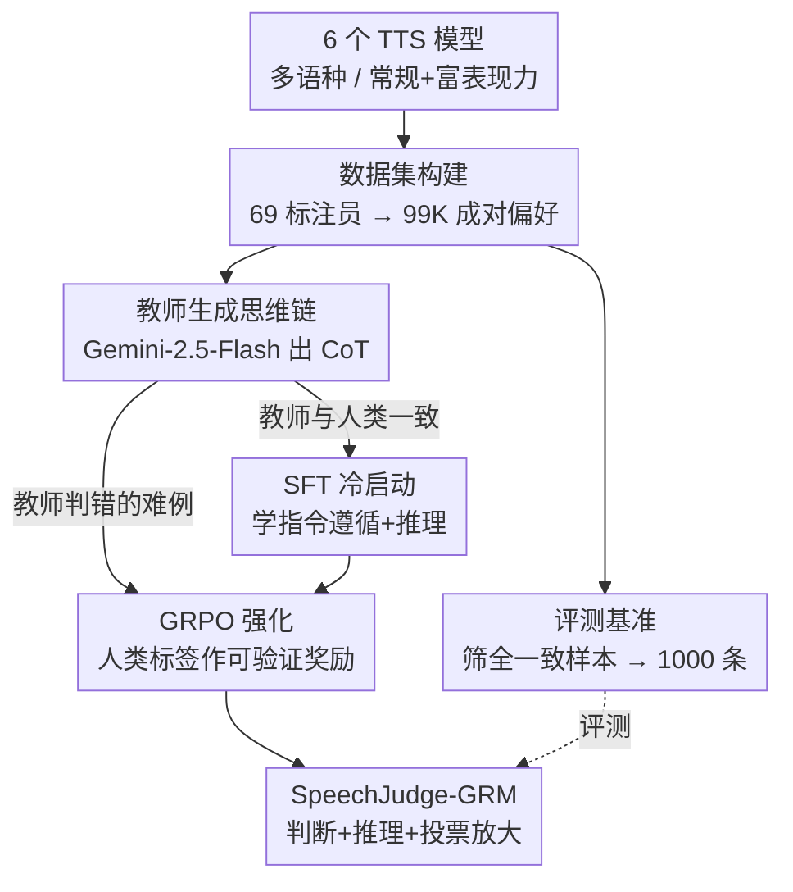

# SpeechJudge: Towards Human-Level Judgment for Speech Naturalness

**会议**: ICLR 2026  
**OpenReview**: [https://openreview.net/forum?id=I9ED9VWZq6](https://openreview.net/forum?id=I9ED9VWZq6)  
**代码**: https://github.com/AmphionTeam/SpeechJudge  
**领域**: 语音合成 / 奖励模型 / 人类偏好对齐  
**关键词**: 语音自然度、人类偏好数据集、生成式奖励模型、GRPO、AudioLLM

## 一句话总结
为了给语音合成补上"大规模自然度人类偏好语料"这块缺失的拼图，本文一次性放出数据集（99K 偏好对）、评测基准（1000 条高一致性样本）和奖励模型三件套，并用"SFT 冷启动 + GRPO 强化"两阶段把 Qwen2.5-Omni-7B 训成生成式奖励模型 SpeechJudge-GRM，在判别语音哪个更自然这个任务上达到 77.2%（推理时投票后 79.4%）准确率，显著超过经典 Bradley-Terry 奖励模型（72.7%）。

## 研究背景与动机
**领域现状**：文本、图像、视频生成早就有了 Pick-a-Pic、ImageReward、VideoReward 这类大规模人类偏好语料，配合 RLHF/奖励模型把生成模型对齐到人的口味。语音合成里，"自然度（naturalness）"一直是衡量质量最核心、最通用的主观指标，但偏好数据这一环却一直缺位。

**现有痛点**：语音领域已有的人类反馈语料要么是早期的 MOS 数据集（用的 TTS 模型老旧、只有逐条打分而非成对偏好、规模小），要么聚焦在某个狭窄属性上——低层声学质量、可懂度（intelligibility）、口语对话的指令遵循等。真正围绕"整体自然度"建立的大规模成对偏好语料，以及据此训练的奖励模型，几乎是空白。

**核心矛盾**：没有人类偏好语料，就无法训练真正贴合人耳感知的自动评判器；而现成的客观指标（WER、SIM、FAD）和 MOS 预测器（UTMOS、DNSMOS）跟人类偏好只有弱相关，面对当代先进 TTS 模型生成的两条语音，常常只有 50%~60% 的判对率，接近瞎猜。即便是最强的 AudioLLM——Gemini-2.5-Flash——和人类的一致率也不到 70%。自动评判语音自然度，还远没到能用的水平。

**本文目标**：把这个缺口一次补齐，拆成三个子问题——(1) 造一个大规模、成对、覆盖多模型多语种多风格的自然度偏好数据集；(2) 从中筛出高质量子集做成一个有区分度的评测基准，量化现有方法到底差多少；(3) 训一个真正能逼近人类判断的奖励模型。

**切入角度**：作者观察到，虽然现成 AudioLLM 零样本判自然度只有 60% 出头，但它们已经展现出"显著潜力"（远好于客观指标的随机水平），说明 AudioLLM 内在的音频理解能力是有的，缺的是被"激发（elicit）"出来对齐人类偏好的判断能力。

**核心 idea**：用"自建的 99K 人类偏好数据"把一个通用 AudioLLM 后训练成生成式奖励模型（GRM）——先用强教师模型的思维链做 SFT 冷启动，再把人类标签当作可验证奖励、对教师都判错的难例做 GRPO 强化，从而让模型既能给出判断又能给出可解释的推理，还支持推理时投票放大。

## 方法详解

### 整体框架
SpeechJudge 是"数据集 → 基准 → 奖励模型"三位一体的工程。先用 6 个不同架构的零样本 TTS 模型在多语种、常规/富表现力两种风格下合成语音对，招募 69 名标注员花两个月做"可懂度逐条标 + 自然度成对标"，得到 99K 偏好对（SpeechJudge-Data）；再从中筛出标注员高度一致的 1000 条做成评测基准（SpeechJudge-Eval），系统性地把客观指标、MOS 预测器、Deepfake 检测器、各路 AudioLLM 拉出来遛一遍，证明这个任务有多难；最后把人类偏好喂给一个两阶段后训练流程，把 Qwen2.5-Omni-7B 炼成生成式奖励模型 SpeechJudge-GRM。奖励模型本身的训练是核心 pipeline：教师模型 Gemini-2.5-Flash 给每条样本生成思维链，按"教师判断是否和人类一致"把数据劈成两半——一致的拿去 SFT 冷启动，不一致的（难例）留给 GRPO 强化，用人类标签做可验证奖励。

### 关键设计

**1. SpeechJudge-Data：用多样化合成 + 成对人标，造出 99K 自然度偏好语料**

针对"语音领域根本没有大规模成对自然度偏好数据"这个空白，作者把数据多样性做到了极致。合成端选了 6 个覆盖三种架构的零样本 TTS 模型——自回归类（ARS、CosyVoice2、CosyVoice2-INTP、Ints-INTP）、流匹配类（F5-TTS）、掩码生成类（MaskGCT），让被比较的语音对在"生成器画风"上充分铺开；参考语音同时取常规（Emilia-Large）和富表现力（情感、口音、耳语、游戏角色音）两类；目标文本覆盖中、英、中英混合，并设计单语（en2en、zh2zh）与跨语（zh2en、en2zh 等）两种合成场景。语音对既有同模型内（intra-model）也有跨模型（inter-model）配对。标注上，给定一个三元组 $(t, a_1, a_2)$，标注员做两件事：对可懂度做二分类（语音是否准确读出文本、有无增删错读），对自然度做五档 CMOS（Comparative MOS）成对打分判哪个更像真人。每条样本平均 2.49 人标，分歧时引入第三人。最终 99K 对，市场价值估算超 50 万人民币——这个规模和成对偏好的形式，正是过去 MOS 数据集所不具备的。

**2. SpeechJudge-Eval：用"全员一致"筛出高质量地面真值，暴露现有方法的天花板**

光有数据还不够，评测基准必须"干净"才有说服力。作者把任务收敛成最朴素的形式——给定文本 $t$ 和一对语音 $(a_1, a_2)$，判哪个更自然，是个"赢/输"二分类，准确率定义为 $\text{Accuracy} = \frac{1}{|D|}\sum_{d} \mathbb{I}(y_M = y_H)$，其中 $y_M$、$y_H$ 分别是模型和人类的答案。为保证地面真值可靠，作者先剔除带"Tie"的样本，再只保留标注全员一致（Full Agreement）的样本，按风格（常规/富表现力）和三种语言比例采样，最终凑成 1000 条。把这把尺子架上去后结论很扎心：客观指标和 MOS 预测器普遍不到 60%、时常接近瞎猜；Deepfake 检测器擅长辨"机器 vs 真人"，但比较两条都由机器生成的语音时与自然度目标不对齐；AudioLLM 是最有希望的一档，多个模型能超过 60%，但最强的 Gemini-2.5-Flash 总体也只有 69.1%。这张"难度地图"既论证了任务价值，也直接为下一步选教师模型（Gemini-2.5-Flash）提供了依据。

**3. 两阶段后训练（SFT 冷启动 + GRPO 强化）：把通用 AudioLLM 炼成生成式奖励模型**

作者最初想直接对 Qwen2.5-Omni 做 RLVR（用人类偏好当可验证奖励的强化学习），但发现它的指令遵循和推理能力太弱，冷启动不动，于是改成"SFT + RL"两阶段（基于 Qwen2.5-Omni-7B 的 Thinker，LoRA 微调）。SFT 阶段用 Gemini-2.5-Flash 当教师：对每条样本用 CoT 提示 $I_{CoT}$ 生成带推理的输出 $O_{teacher}$，从中解析出偏好 $y_M$。若教师和人类一致（$y_M = y_H$），就把 $[I_{CoT}, O_{teacher}]$ 拼成一条 SFT 样本（只对 $O_{teacher}$ 段做下一 token 预测），教模型"怎么有条理地说出判断理由"；若教师判错，这条样本被定义为难例，留给 RL 阶段。RL 阶段把人类偏好当可验证奖励，在 SFT 模型基础上跑 GRPO：对每条难例让策略模型多次 rollout，第 $i$ 次解析出偏好 $y_M^i$，按规则给奖励——$y_M^i = y_H$ 给 $+1$，否则 $-1$，只约束最终判断对齐人类、放手让模型自行优化推理过程。这样设计的妙处在于"分工明确"：教师能教会的简单样本走模仿学习，教师都搞不定的难例走强化学习，正好把训练资源压在最有价值的边界上。由于 GRM 是生成式的，推理时还能多次采样做多数投票（Voting@10）进一步抬准确率，这是只输出一个标量的 BTRM 给不了的。

### 损失函数 / 训练策略
SFT 阶段是标准的下一 token 预测，但只在教师输出段 $O_{teacher}$ 上计算损失。RL 阶段用 GRPO，奖励为规则化的 $r = +1\,(y_M^i = y_H)$ 或 $-1\,(\text{否则})$。训练数据 SpeechJudge-Data (train) 的构造：先剔除全分歧（FD）样本，对 FA/WA/WD 三档用标注员多数投票定标签，再排除"Tie"，只留偏好数据。SFT 与 RL 两阶段均用 LoRA 微调。基线 SpeechJudge-BTRM 则在同一个 Qwen2.5-Omni-7B 上加一层线性输出标量奖励，用同样的数据和 LoRA 训练，作为公平对照。

## 实验关键数据

### 主实验：现有方法在 SpeechJudge-Eval 上的表现（节选）
| 类别 | 模型 | 常规 | 富表现力 | 总体 |
|------|------|------|---------|------|
| 客观指标 | WER | 59.3 | 57.0 | 57.9 |
| 客观指标 | SIM | 47.5 | 42.5 | 44.5 |
| MOS 预测器 | UTMOS | 54.0 | 53.5 | 53.7 |
| Deepfake | AASIST | 40.5 | 50.8 | 46.7 |
| 开源 AudioLLM | Kimi-Audio-7B | 65.5 | 68.0 | 67.0 |
| 闭源 AudioLLM | GPT-4o Audio | 71.5 | 64.7 | 67.4 |
| 闭源 AudioLLM | **Gemini-2.5-Flash** | 73.5 | 66.2 | **69.1** |

最强模型 Gemini-2.5-Flash 总体也只有 69.1%，与人类一致率不到 70%；客观指标/MOS 预测器普遍接近随机猜测。

### 奖励模型对比
| 模型 | 常规 | 富表现力 | 总体 |
|------|------|---------|------|
| Qwen2.5-Omni-7B（零样本） | 62.0 | 59.7 | 60.6 |
| Gemini-2.5-Flash（教师） | 73.5 | 66.2 | 69.1 |
| SpeechJudge-BTRM | 77.5 | 69.5 | 72.7 |
| SpeechJudge-GRM (SFT) | 77.8 | 73.7 | 75.3 |
| &nbsp;&nbsp;w/ Voting@10 | 77.4 | 77.6 | 77.6 |
| **SpeechJudge-GRM (SFT+RL)** | 79.0 | 76.0 | **77.2** |
| &nbsp;&nbsp;**w/ Voting@10** | 80.5 | 78.7 | **79.4** |

### 消融与下游验证
| 配置 | 关键指标 | 说明 |
|------|---------|------|
| BTRM vs GRM(SFT) | 72.7 → 75.3 | 换成生成式 + CoT，总体 +2.6 |
| GRM(SFT) → (SFT+RL) | 75.3 → 77.2 | 难例上 GRPO 强化再 +1.9 |
| 单次 → Voting@10 | +约 2 个百分点 | 生成式特性带来的推理时放大 |
| TTS 后训练 w/ GRM(online) | N-CMOS 0.25 | 当作在线 DPO 奖励，自然度提升最大 |

### 关键发现
- **生成式 + 强化各贡献一截**：从 BTRM 的 72.7% 到 GRM(SFT) 的 75.3%（生成式 CoT 贡献），再到 SFT+RL 的 77.2%（难例 GRPO 贡献），两步叠加共 +4.5 个百分点，且富表现力子集涨幅更明显（69.5→76.0）。
- **推理时投票几乎免费涨点**：Voting@10 把 SFT 模型从 75.3% 抬到 77.6%、把 SFT+RL 从 77.2% 抬到 79.4%，这是标量 BTRM 结构上做不到的。
- **能当奖励函数真正改善 TTS**：把 GRM 作为在线 DPO 奖励后训练一个全新的 Qwen2.5-0.5B-TTS（未参与建数据），自然度 N-CMOS 达到 0.25（最高），且说话人相似度不降反略升，证明它不只是"会评判"，还能"驱动生成变好"。
- **富表现力语音更难**：无论人类标注一致率还是模型判别准确率，富表现力子集都明显低于常规子集，说明带情感/口音/耳语的语音评判本质上更难。

## 亮点与洞察
- **"教师对/错"天然劈数据**：用教师模型判断是否与人类一致，把数据自动切成"能模仿的简单样本（SFT）"和"要强化的难例（RL）"，省去了人工划难度，且让强化学习的算力精准压在边界上——这个思路可迁移到任何"有强教师 + 有人类地面真值"的偏好建模任务。
- **生成式奖励模型的两个额外红利**：相比只吐标量的 BTRM，GRM 既给可解释的 CoT，又能靠推理时多数投票几乎免费抬准确率，把"评判质量"变成了可以用算力换的量。
- **基准的"全员一致"过滤很关键**：只保留标注全一致样本作地面真值，让 1000 条基准既干净又有区分度，直接把"现有方法到底差多少"量化得明明白白，是这类评测可信度的核心 trick。
- **从评判到生成闭环**：把奖励模型回插进 TTS 后训练（离线/在线 DPO），证明"判得准"能转化成"生成得更自然"，让这套数据-基准-奖励真正形成对齐闭环。

## 局限与展望
- **只聚焦自然度单一维度**：可懂度虽也标了，但奖励模型主攻自然度；多维度（韵律、情感保真、说话人一致等）联合建模尚未展开。
- **依赖强闭源教师**：SFT 冷启动重度依赖 Gemini-2.5-Flash 生成 CoT，教师的偏见/盲区可能被继承，且复现成本和可得性受限。
- **数据偏向中英**：语种集中在中、英及中英混合，对其他语言/方言的泛化未验证。
- **下游 TTS 验证规模有限**：后训练实验只在一个 0.5B 小模型上做，能否扩展到更大、更强的 TTS 仍待观察。
- **改进思路**：把可懂度与自然度做成多目标奖励、用开源教师替代闭源、引入更多语种与副语言风格、在更大 TTS 上验证在线 DPO 的稳定性。

## 相关工作与启发
- **vs MOS 数据集（UTMOS/DNSMOS 训练语料）**: 它们用老旧 TTS、只给逐条标量分、规模小；本文用 6 个先进 TTS、给成对偏好、99K 规模，且实测这些 MOS 预测器在新基准上接近随机猜测，说明旧范式跟不上当代生成模型。
- **vs AudioJudge（并行工作）**: AudioJudge 用提示工程评估 AudioLLM 当评判器的能力与局限；本文不止评估，而是真正后训练出一个对齐人类的奖励模型，并把它用作 TTS 后训练的奖励函数。
- **vs SpeechJudge-BTRM（自身基线）**: BTRM 在同一底座加线性层输出标量奖励，72.7%；GRM 改成生成式 + CoT + 难例 GRPO，77.2%（投票 79.4%），且支持解释与推理时放大——直接论证了"生成式奖励模型 > 经典 Bradley-Terry"在语音自然度上的优势。
- **vs 文本/图像 RLHF（ImageReward、Pick-a-Pic 等）**: 把成熟的"人类偏好语料 + 奖励模型 + RLVR"范式系统性移植到语音合成，填上了这条赛道长期缺失的偏好数据拼图。

## 评分
- 新颖性: ⭐⭐⭐⭐ 不是发明新算法，而是补齐语音自然度偏好数据这块空白并配套基准+奖励模型，"系统性填空"价值很高
- 实验充分度: ⭐⭐⭐⭐⭐ 横扫四类现有方法做基准、奖励模型逐阶段消融、再到下游 TTS 后训练闭环验证，链条完整
- 写作质量: ⭐⭐⭐⭐ 三件套动机清晰、表格扎实，难例划分与两阶段逻辑讲得透
- 价值: ⭐⭐⭐⭐⭐ 数据集/基准/模型全开源，对语音合成对齐研究是直接可用的基础设施

<!-- RELATED:START -->

## 相关论文

- [\[ICLR 2026\] VowelPrompt: Hearing Speech Emotions from Text via Vowel-level Prosodic Augmentation](vowelprompt_hearing_speech_emotions_from_text_via_vowel-level_prosodic_augmentat.md)
- [\[AAAI 2026\] HPSU: A Benchmark for Human-Level Perception in Real-World Spoken Speech Understanding](../../AAAI2026/audio_speech/hpsu_a_benchmark_for_human-level_perception_in_real-world_spoken_speech_understa.md)
- [\[ICLR 2026\] TTSDS2: Resources and Benchmark for Evaluating Human-Quality Text to Speech Systems](ttsds2_resources_and_benchmark_for_evaluating_human-quality_text_to_speech_syste.md)
- [\[ICLR 2026\] Human Behavior Atlas: Benchmarking Unified Psychological and Social Behavior Understanding](human_behavior_atlas_benchmarking_unified_psychological_and_social_behavior_unde.md)
- [\[ICLR 2026\] Beyond Instance-Level Alignment: Dual-Level Optimal Transport for Audio-Text Retrieval](beyond_instance-level_alignment_dual-level_optimal_transport_for_audio-text_retr.md)

<!-- RELATED:END -->
