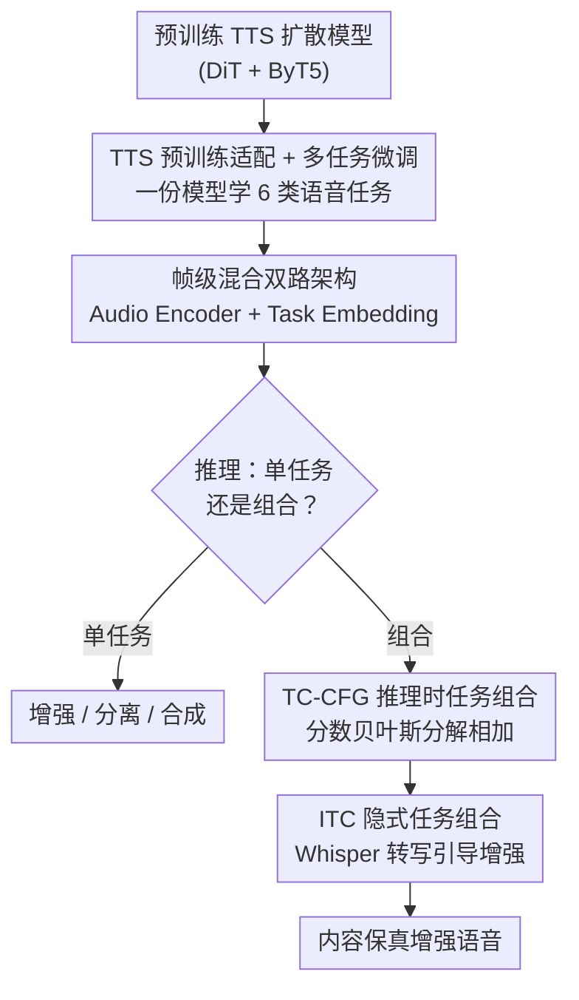

# SpeechOp: Inference-Time Task Composition for Generative Speech Processing

**会议**: ICLR 2026  
**OpenReview**: [https://openreview.net/forum?id=eLsEjjFODE](https://openreview.net/forum?id=eLsEjjFODE)  
**项目页**: [https://justinlovelace.github.io/projects/speechop](https://justinlovelace.github.io/projects/speechop)  
**领域**: 语音处理 / 扩散模型 / 生成式语音  
**关键词**: 潜空间扩散、多任务语音处理、TTS 预训练、推理时任务组合、无分类器引导

## 一句话总结
SpeechOp 把一个预训练好的 TTS 扩散模型改造成"万能语音处理器"，用一份多任务潜空间扩散模型同时做合成、增强、分离等任务；更关键的是提出 TC-CFG 引导策略，让这些独立学到的能力在**推理时**自由组合（如用 ASR 转写的文本去引导增强），在语音增强的内容保真上达到 SOTA（WER 相对 HiFi-GAN-2 降低 46%）。

## 研究背景与动机

**领域现状**：生成式 TTS（Text-to-Speech）这几年突飞猛进，核心原因是它能吃下海量"野生"数据——有声书、播客等几万小时的语料，让模型学到跨各种声学条件、各种说话人的鲁棒语音表征。

**现有痛点**：但语音到语音（Speech-to-Speech, S2S）任务——语音增强、说话人分离、前景/背景分离——却没这么幸运。这些任务通常需要"退化语音 ↔ 干净语音"的成对数据，规模化采集极贵，于是只能在小规模、靠模拟退化合成的专用数据集上训练。数据一稀缺，生成式 S2S 模型就容易"脑补"——把原始说话人身份和语音内容篡改掉。而在语音增强这种场景里，**忠实保留内容和音色恰恰是命根子**。

**核心矛盾**：TTS 拥有海量数据带来的丰富语音理解，S2S 任务却被数据稀缺卡死；二者明明都在同一个语音潜空间里建模，却各练各的、互不相通。更进一步，即便想把"增强"和"用文本恢复内容"这两种能力拼起来用，主流做法（如 Fugatto 的分数平均）会把 TTS 那个为"生成"学到的宽泛声学先验，混进增强模型那个为"重建"学到的录音棚级窄先验里，反而把输出质量拉低。

**本文目标**：(1) 让 S2S 任务白嫖 TTS 预训练的语音理解；(2) 让独立训练的多种语音能力在推理时**正确地**组合，而不是粗暴平均。

**切入角度**：作者先做了个动机实验——拿预训练的 DiT TTS 主干去初始化单任务增强/分离模型，发现增强收敛快 4×、分离快 8×，且分离的 MCD/WER 大幅改善。这说明 TTS 预训练对 S2S 存在强正迁移。既然如此，不如把一个 TTS 模型直接微调成统一的多任务处理器。

**核心 idea**：用预训练 TTS 适配出一个多任务潜空间扩散模型（SpeechOp），并用基于贝叶斯分解的 TC-CFG，把"增强分数"和"TTS 判别式内容引导"在推理时干净地相加，而不是把两个生成先验混在一起。

## 方法详解

### 整体框架

SpeechOp 是一个建在压缩音频潜空间上的多任务潜空间扩散模型。音频先用 DAC 变分自编码器压成低维潜表示，核心是一个 20 层的 Diffusion Transformer（DiT，419M），扩展后能同时处理 TTS（输入文本转写）和 S2S（输入源音频，如带噪语音）两条路径。文本路径用冻结的 ByT5-base 编码器抽字符级表征，经 cross-attention 注入 DiT；语音路径额外挂一个 8 层 Audio Encoder（71M，随机初始化）处理源音频。一个可学习的 Task Embedding 通过自适应归一化（AdaLN）同时调制 Audio Encoder 和 DiT，告诉模型当前在做哪个任务（增强/分离/匹配……）。训练分两阶段：先 TTS 预训练，再多任务微调（TTS 与 S2S 等频采样，增强和分离这两个最难的任务三倍上采样）。

真正的亮点在推理阶段：训练时各任务是分开学的，但因为它们共享同一个扩散框架，推理时可以把多个任务的分数函数按 TC-CFG 公式组合起来，凭空"造"出训练时没见过的新任务（如文本引导的增强、个性化增强）。其中最实用的一条流水线是 ITC——用 Whisper/WhisperX 把带噪语音自动转写，再把这份（含噪的）转写当作 TC-CFG 的内容引导去做增强。

### 关键设计

**1. TTS 预训练适配 + 两阶段多任务微调：用海量 TTS 数据补 S2S 数据的窟窿**

S2S 任务苦于成对数据稀缺，而 TTS 坐拥几万小时野生语料学到的语音理解，作者要做的就是把后者迁移给前者。具体把一个预训练 DiT TTS 主干当起点，先 TTS 预训练，再做多任务微调：此阶段 Audio Encoder 和 DiT 主干联合优化，TTS 与 S2S 数据等频采样，并对最难的增强、说话人分离做三倍上采样。这一步之所以有效，作者用对照实验证明了——TTS 初始化让增强收敛快 4×、分离快 8×，分离的 MCD 从 22.95 降到 4.46、WER 从 17.8% 降到 8.5%，因为它消除了随机初始化模型在学"内容解耦"时产生的伪影。反过来，多任务训练还**反哺**了 TTS 本身：见过增强、分离这些声学操作后，SpeechOp 的零样本 TTS 在所有 MOS 指标和说话人相似度上都涨了。

**2. 帧级混合的双路架构 + Task Embedding：让一份扩散模型干所有任务**

要在同一个网络里塞下 TTS（文本→语音）和 S2S（语音→语音），关键是处理两种截然不同的条件输入。文本侧走 ByT5 cross-attention；语音侧因为源音频和目标音频天生帧级对齐，作者干脆不上复杂的对齐机制，而用一个极简的"帧级混合"——把 Audio Encoder 的输出表征**直接加到**扩散潜变量上，再送进 DiT 去噪。任务身份则交给可学习的 Task Embedding：DiT 把它和 timestep embedding 相加、走 AdaLN 调制（沿用原始 DiT 的类别嵌入思路），Audio Encoder 则直接拿它做自适应归一化。需要额外提示的任务（如说话人分离要参考样本、声学匹配要目标声学示例）就把提示拼接到源音频和噪声潜变量前头，保持帧级对齐。这套设计的好处是简单且统一——一个 Task Embedding 切换就能让模型在增强、分离间无缝切换。

**3. TC-CFG：把任务组合从"混先验"改成"加判别引导"**

这是全文的理论核心。要同时做"增强 + 用文本恢复内容"，前人（Fugatto、组合扩散）的做法是对两个分数加权平均：$s^{avg}_\theta(z_t|y,w) = (1-\alpha)s^{enh}_\theta(z_t|y) + \alpha s^{tts}_\theta(z_t|w)$。问题在于这把 TTS 那个为生成学的宽泛声学先验，硬塞进增强模型那个为重建学的窄先验里，污染了输出。作者改用贝叶斯规则分解目标分数（假设给定 $z_t$ 时转写 $w$ 与带噪音频 $y$ 条件独立）：

$$\nabla_{z_t}\log p(z_t|y,w) = \nabla_{z_t}\log p(z_t|y) + \nabla_{z_t}\log p(w|z_t)$$

第一项是增强分数，只管声学质量；第二项 $\nabla_{z_t}\log p(w|z_t)$ 是个**判别式引导**——它问的不是"TTS 会怎么生成"，而是"当前潜变量 $z_t$ 有多可能对应转写 $w$"。这第二项用无分类器引导（CFG）近似：$\nabla_{z_t}\log p(w|z_t) \approx \gamma(s^{tts}_\theta(z_t|w) - s^{tts}_\theta(z_t))$，代回得到最终组合分数：

$$s^{CFG}_\theta(z_t|y,w) \approx s^{enh}_\theta(z_t|y) + \gamma(s^{tts}_\theta(z_t|w) - s^{tts}_\theta(z_t))$$

作者把它叫 TC-CFG（Task-Composition CFG）。关键差别在于：CFG 那个差分项**只隔离出文本条件的方向**，把 TTS 的完整声学先验抵消掉了，于是既拿到了内容对齐，又不污染增强的声学先验。引导强度 $\gamma$ 还是个旋钮——调大偏向内容恢复（更像 TTS），调小偏向声学保真（更像增强）。一个 1D 高斯混合的玩具实验直观说明了这点：分数平均会把分布"抹糊"偏离目标，TC-CFG 则在满足判别信号的同时守住增强分布。

**4. ITC：用 Whisper 转写自动驱动增强，白嫖网络级语音理解**

传统的"转写条件 S2S"模型有两个死穴：一是缺成对的"带噪-干净-转写"数据，二是 ASR 转写一旦出错，就会和声学输入打架、还会把错误传播下去，且推理时没法调节文本 vs 声学的权重。ITC（Implicit Task Composition）绕开了这些：增强模型本身训练时**根本不需要转写**，推理时才用一个 SOTA 判别式 ASR（Whisper/WhisperX）把带噪语音自动转成（含噪的）转写 $w$，再通过 TC-CFG 把这份转写当内容引导喂进增强。这样就把 ASR 模型从网络级海量数据学到的内容理解，稳健地"嫁接"到了 SpeechOp 的生成能力上；而 $\gamma$ 旋钮让模型能在"转写不完全可信"时平衡声学信息与文本引导。实验里即便用从带噪音频转出的不完美 Whisper 转写，WER 也从无转写的 8.1% 降到 2.9%，逼近用金标转写的 2.1%。

### 损失函数 / 训练策略
训练用去噪分数匹配（DSM）损失 $L_{DSM}(x) = \mathbb{E}_{t,x,\epsilon}[w(\lambda_t)\cdot\|s_\theta(z_t;\lambda) - \nabla_{z_t}\log q(z_t|x)\|_2^2]$，采用 velocity 参数化 $v=\alpha_t\epsilon - \sigma_t x$ 稳定训练；噪声调度用偏移余弦（s=0.5），损失加权用 bias=-2.5 的 Sigmoid 权重聚焦感知相关噪声级。为支持推理时 CFG，训练中以 10% 概率随机丢弃条件（源音频和转写）。TTS 路径里 75% 样本做 inpainting（一半模拟语音提示、一半模拟语音编辑），时长用 mode=0.01、concentration=5 的 Beta 分布偏向短提示的难例。

## 实验关键数据

### 主实验

语音增强（核心战场，关注内容保真 WER）：

| 模型 | PESQ ↑ | MCD ↓ | SpBS ↑ | WER ↓ |
|------|--------|-------|--------|-------|
| 带噪源音频 | 1.12 | 11.22 | .888 | 3.3 |
| SGMSE+ | 1.98 | 5.28 | .923 | 5.7 |
| HiFi-GAN-2 | 2.23 | 4.40 | .934 | 5.4 |
| SpeechOp（无转写） | 2.00 | 4.83 | .908 | 8.1 |
| SpeechOp + ITC（Whisper） | 2.05 | 4.85 | .928 | **2.9** |
| + 说话人个性化 | 2.12 | 4.69 | .926 | **2.4** |
| SpeechOp（金标转写，上界） | 2.06 | 4.83 | .931 | 2.1 |

ITC 把 WER 打到 2.9%，相对 HiFi-GAN-2 的 5.4% 降低 46%；主观 MOS（3.89）与 HiFi-GAN-2（3.90）持平，但内容准确度全面领先。

零样本 TTS（验证多任务训练反哺 TTS）：SpeechOp 相对自家 TTS Baseline 在 MOS-Q +0.22、MOS-VS +0.36、MOS-SS +0.32、说话人相似度 SIM +0.05，几乎不损失可懂度——多任务训练让 TTS 也更自然。

### 消融实验

任务组合方式对比（金标转写下，TC-CFG vs 分数平均 TC-Avg）：

| 配置 | PESQ ↑ | MCD ↓ | SpBS ↑ | WER ↓ | 说明 |
|------|--------|-------|--------|-------|------|
| SpeechOp（无转写） | 2.00 | 4.83 | .908 | 8.1 | 增强基线 |
| SpeechOp（TC-Avg 分数平均） | 1.88 | 5.24 | .909 | 3.4 | 内容变好但声学退化 |
| SpeechOp（TC-CFG，本文） | 2.06 | 4.83 | .931 | **2.1** | 全面占优 |
| Δ(TC-CFG vs TC-Avg) | +.18 | -0.42 | +.022 | -1.3 | — |

TC-Avg 虽然把 WER 从 8.1% 降到 3.4%，但 MCD 从 4.83 涨到 5.24、PESQ 从 2.00 跌到 1.88——印证了"混入 TTS 宽泛先验会污染增强先验"。TC-CFG 则在 WER（2.1%，比 TC-Avg 再降 38%）和声学保真上**同时**改善。

TTS 初始化消融：增强收敛快 4×、分离快 8×；分离 MCD 22.95→4.46、WER 17.8%→8.5%。

### 关键发现
- **TC-CFG 是真正的方法贡献**：同样有文本引导，分数平均会牺牲声学换内容，TC-CFG 靠"判别式引导"把二者解耦，做到鱼与熊掌兼得。
- **信号指标 vs 感知质量的错配**：在说话人分离上，SpeechOp 的主观 MOS 全面碾压 SepFormer（总分 3.57 vs 3.28），但客观 SI-SDRi/MCD 反而低（WSJ0-2Mix 上 SI-SDRi 仅 0.23 vs 11.86）。这是生成式方法的已知现象——它优先自然度和感知质量，而非严格的混合一致性，传统信号指标会"误伤"生成输出。
- **$\gamma$ 旋钮带来可控性**：同一模型靠调引导强度，就能在"声学保真"和"内容恢复"间滑动，这是固定的转写条件模型给不了的。

## 亮点与洞察
- **把组合扩散从"混先验"纠正成"加判别引导"**：TC-CFG 的贝叶斯分解很优雅——核心洞察是"TTS 模型不该贡献它的生成先验，而该贡献它的判别能力（判断 $z_t$ 像不像转写 $w$）"，CFG 差分项恰好抽出这个方向。这个思路可迁移到任何"想用生成模型 A 引导生成模型 B、但不想让 A 的先验污染 B"的组合场景。
- **ITC 是"训练免转写、推理才借 ASR"的巧妙解耦**：增强模型训练时完全不碰转写，推理时才让 Whisper 来补内容，既绕开了稀缺的三元组数据，又白嫖了 ASR 的网络级知识，还天然容忍 ASR 错误（靠 $\gamma$ 调节信任度）。
- **多任务训练反哺单任务**：让 TTS 见过增强/分离后，TTS 自己也变好了——"学会处理脏数据"反过来让"生成干净数据"更鲁棒，这是个反直觉但很实用的副产品。

## 局限与展望
- **客观信号指标差**：说话人分离的 SI-SDRi、MCD 等明显落后于判别式 SepFormer，生成式路线在严格信号重建上仍有硬伤，部分应用（要求波形级保真）未必能接受。
- **分离评测偏理想**：当前用的是完全重叠的合成混合（LibriMix、WSJ0-2Mix），作者也承认现实里的部分重叠对话场景尚未验证，需要结合 diarization-assisted ASR 提供说话人归属的转写。
- **规模受限**：419M 参数、约 45k 小时数据，落后于 DiTTo-TTS（740M、约 56k 小时）等更大模型，作者把"scaling 到更大数据"列为未来工作。
- **依赖外部 ASR 质量**：ITC 的内容保真上界本质被 Whisper 转写质量决定，极端噪声下 ASR 失灵时引导价值会打折。

## 相关工作与启发
- **vs Fugatto / 组合扩散（分数平均）**: 它们对分数加权平均来组合任务，会把不同任务的生成先验混在一起；本文用 TC-CFG 的贝叶斯分解只保留判别式引导项，消融里 WER 与声学保真双双胜出（2.1% vs 3.4% WER，且 MCD/PESQ 更好）。
- **vs UniAudio / SpeechFlow**: 它们从零追求广覆盖任务或研究新预训练范式；本文不追求任务数量最大化，而是聚焦"如何高效复用已有 TTS 预训练 + 精巧组合"来对症 S2S 数据稀缺。
- **vs 转写条件 S2S 模型**: 那类模型把转写当固定条件训练，ASR 出错时声学/文本会打架且无法调节权重；ITC + TC-CFG 把转写做成推理时可调强度的引导，更灵活、更鲁棒。

## 评分
- 新颖性: ⭐⭐⭐⭐⭐ TC-CFG 的贝叶斯分解 + ITC 的训练免转写解耦，理论与实用兼具
- 实验充分度: ⭐⭐⭐⭐ TTS/增强/编辑/分离全覆盖，但分离客观指标短板与现实场景验证留作未来工作
- 写作质量: ⭐⭐⭐⭐⭐ 动机实验→架构→TC-CFG 推导→玩具实验→真实评测，逻辑链清晰
- 价值: ⭐⭐⭐⭐⭐ "推理时组合"为语音处理提供了一种数据高效、可控的新范式

<!-- RELATED:START -->

## 相关论文

- [\[ICLR 2026\] Automatic Stage Lighting Control: Is it a Rule-Driven Process or Generative Task?](automatic_stage_lighting_control_is_it_a_rule-driven_process_or_generative_task.md)
- [\[ICLR 2026\] Confident and Adaptive Generative Speech Recognition via Risk Control](confident_and_adaptive_generative_speech_recognition_via_risk_control.md)
- [\[ICLR 2026\] Improving Black-Box Generative Attacks via Generator Semantic Consistency](improving_black-box_generative_attacks_via_generator_semantic_consistency.md)
- [\[ICLR 2026\] MMSU: A Massive Multi-task Spoken Language Understanding and Reasoning Benchmark](mmsu_a_massive_multi-task_spoken_language_understanding_and_reasoning_benchmark.md)
- [\[ICLR 2026\] When and Where to Reset Matters for Long-Term Test-Time Adaptation](when_and_where_to_reset_matters_for_long-term_test-time_adaptation.md)

<!-- RELATED:END -->
