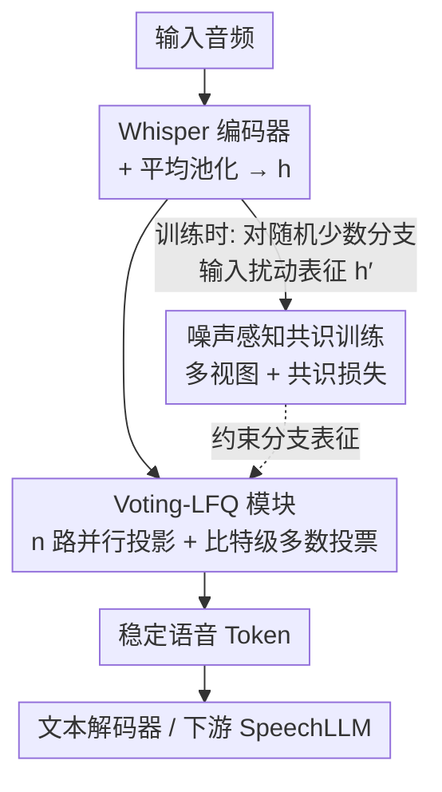

# StableToken: A Noise-Robust Semantic Speech Tokenizer for Resilient SpeechLLMs

**会议**: ICLR 2026  
**OpenReview**: [https://openreview.net/forum?id=17DNmdQ9aU](https://openreview.net/forum?id=17DNmdQ9aU)  
**代码**: https://github.com/Tencent/StableToken  
**领域**: 语音 / 音频  
**关键词**: 语义语音 tokenizer、噪声鲁棒性、比特级投票、共识训练、SpeechLLM

## 一句话总结
针对语义语音 tokenizer「对人耳听不出来的微小噪声极其脆弱、token 序列会剧烈跳变」这一痛点，StableToken 用「多分支量化 + 可微比特级多数投票」的 Voting-LFQ 架构加上「噪声感知共识训练」，把噪声下的 Unit Edit Distance 从 26.17% 降到 10.17%（相对降 60%+），并直接带动下游 SpeechLLM 在 ASR/SER/TTS 上的鲁棒性大涨。

## 研究背景与动机

**领域现状**：现代 SpeechLLM 普遍把连续音频先用一个离散语音 tokenizer 转成 token 序列再喂给 LLM。其中**有监督语义 tokenizer**（如 S3 Tokenizer、CosyVoice2、GLM-4-Voice-Tokenizer）成了主流：它们在一个端到端 ASR 模型里嵌一个 VQ 量化器，用 ASR 损失直接优化，产出低比特率、语义对齐、与 LLM 高度兼容的离散 token。

**现有痛点**：作者发现这些「号称编码语义」的 tokenizer 其实非常不鲁棒——哪怕在信噪比很高、人完全听得清的情况下加一点点声学扰动，输出的 token 序列也会大面积变化（Figure 1 里同一句话的 token 几乎全变）。token 一抖，语音-文本对齐就被打乱，LLM 被迫从「不一致甚至混乱」的输入流里学习，真实嘈杂环境下性能急剧退化。

**核心矛盾**：脆弱性来自两个根因。其一是**架构缺陷**——单路径量化没有容错能力，量化边界附近的一点扰动会被无可避免地放大成一个完全不同的 token。其二是**监督信号太远**——标准 ASR 损失只监督最终转写文本，对中间 token 是否稳定毫不关心，于是模型会收敛到「功能正确但表征脆弱」的解。

**本文目标**：要同时治这两个病——既要让架构本身有容错冗余，又要给中间 token 一个显式的、要它对噪声不变的监督。

**切入角度**：直觉上「离线集成多个模型再投票」似乎能修架构脆弱，但行不通：推理成本暴涨、独立训练的模型量化边界各自为政难以对齐、而且 token 级多数投票粒度太粗。另一个直觉「对干净/带噪音频加 token 级一致性损失」又会在离散码上产生不稳定梯度、难训练。这些朴素方案都失败，说明需要一个**架构与训练协同设计**的新范式。

**核心 idea**：把投票塞进量化器内部、并下沉到**比特级**——用多分支并行 + 可微的比特级多数投票实现「天生容错」，再配一个「让少数分支看带噪输入、强制它们向干净共识对齐」的共识训练，二者互为支撑。

## 方法详解

### 整体框架
StableToken 沿用「在端到端 ASR 模型里嵌语义 tokenizer」的范式：预训练语音编码器（基于 whisper-large-v3）把音频编码成隐状态序列，经平均池化得到每个时间步的紧凑表征 $h \in \mathbb{R}^D$，再由量化器把 $h$ 变成离散 token，token 经文本解码器做 ASR 监督。它的关键改动只在量化器这一环：把原本「一步到位」的单路径量化器，换成多分支的 **Voting-LFQ 模块**；并在训练时套上 **噪声感知共识训练**，给每个分支一个显式的「向共识对齐」的信号。架构提供投票的结构、训练信号释放架构的潜力，二者深度耦合。

### 关键设计

**1. Voting-LFQ 模块：用比特级多数投票把单路径量化的脆弱性换成冗余容错**

这一设计直接治「单路径量化没容错」的架构病。它不再把 $h$ 一步映射成一个 token，而是先用 $n$ 个并行线性投影层造出 $n$ 个独立「视角」：第 $i$ 个分支算 $p_i = W_i h + b_i$（$W_i, b_i$ 各自可学），再用 $\mathrm{sign}$ 函数把每个 $p_i$ 二值化成 $B_i \in \{-1,+1\}^d$，并借**直通估计器（STE）**让不可导的 sign 也能端到端训练。

关键在于投票发生在**比特维度**而非 token 维度。训练时对每一维 $j$ 把各分支的比特做平均得到实值分数 $(s_{\text{final}})_j = \frac{1}{n}\sum_{i=1}^{n}(B_i)_j$——这个软分数能表达「所有分支对这一位有多大共识/置信度」，给优化提供比硬性 ±1 更细腻的反馈。推理时再多走一步，对聚合分数取符号得到最终共识比特 $(B_{\text{final}})_j = \mathrm{sign}((s_{\text{final}})_j)$，最后把 $\{-1,+1\}$ 映射到 $\{0,1\}$、当二进制数读出整数索引 $k \in \{0,\dots,2^d-1\}$ 作为 token（实验里 $d=13$，对应词表 8192）。用**奇数个分支**强制严格多数规则，于是容错能力极强：不仅少数分支因噪声出错时能被纠正，即便多数分支在 token 级被噪声带偏，只要底层**比特级**错误是稀疏的，真 token 仍可被恢复——因为不同 token 间往往只差几个比特。这种比特级纠错正是它远胜「token 级多数投票太粗」的地方，而且推理时只多了几层线性投影，额外参数和算力几乎可忽略。

**2. 噪声感知共识训练：让少数带噪分支向干净多数的共识对齐，给中间 token 一个显式的不变性监督**

这一设计治「ASR 损失离 token 太远」的监督病。每次前向，对输入音频 $w$ 用波形级随机增广 $A(\cdot)$（如加高斯噪声）造一个扰动版 $w' = A(w)$，二者分别过编码器得到 $h$ 和 $h'$。然后**随机挑一个少数子集 $k$ 个分支（$k < n/2$）喂带噪表征 $h'$，其余 $n-k$ 个多数分支喂干净表征 $h$**。多视图本身只是把噪声「注入」进来，真正的监督来自**共识损失**：先在线地把全部 $n$ 个分支的预量化向量求平均得到动态目标 $\bar{p}_{\text{all}} = \frac{1}{n}\sum_{j=1}^{n}p_j$，再罚每个分支偏离这个全局均值：

$$\mathcal{L}_{\text{consensus}} = \frac{1}{n}\sum_{i=1}^{n}\lVert p_i - \bar{p}_{\text{all}}\rVert_2^2.$$

因为多数分支看的是干净输入，它们把全局均值 $\bar{p}_{\text{all}}$ 牢牢锚定在「干净答案」附近、不被带噪输入污染；于是少数带噪分支被迫学出与干净共识一致的表征，等价于**学会忽略扰动**。注意损失作用在连续向量 $p_i$ 上而非二值化后的码，这避开了「直接对离散码加一致性约束会产生不稳定梯度」的坑，给出更平滑有效的梯度。这与设计 1 是一体的：投票架构提供了「多分支可对齐」的结构，共识损失才有施力点。

### 损失函数 / 训练策略
最终目标把 ASR 任务损失、共识损失和 LFQ 标准正则项加权求和：

$$\mathcal{L}_{\text{total}} = \mathcal{L}_{\text{ASR}} + \lambda_1 \mathcal{L}_{\text{consensus}} + \lambda_2 \mathcal{L}_{\text{commitment}} + \lambda_3 \mathcal{L}_{\text{codebook}}.$$

其中 $\mathcal{L}_{\text{ASR}}$ 是对真值转写的交叉熵；沿用 LFQ 框架的承诺损失 $\mathcal{L}_{\text{commitment}}$ 让隐状态贴近量化表征，码本熵损失 $\mathcal{L}_{\text{codebook}}$ 促进离散码均匀使用；$\lambda_{1,2,3}$ 为平衡系数。模型在 15 万小时多样语音语料上预训练，帧率 25Hz，主实验取投票分支数 $N=5$。

## 实验关键数据

### 主实验
**tokenizer 级噪声鲁棒性（UED%，越低越好，FLEURS 基准，多种合成+真实噪声平均）**：

| 类型 | 模型 | 词表 | 高斯 | 真实噪声 | 真实(OOD) | Avg. |
|------|------|------|------|---------|-----------|------|
| SSL | R-Spin | 2048 | 21.56 | 15.08 | 14.75 | 16.48 |
| 有监督 | S3 Tokenizer | 4096 | 35.40 | 23.88 | 24.58 | 26.17 |
| 有监督 | GLM-4-Voice-Token. | 16384 | 42.44 | 27.67 | 28.62 | 31.10 |
| 有监督 | CosyVoice2 | 6561 | 54.67 | 31.76 | 32.13 | 38.66 |
| **本文** | **StableToken** | **8192** | **12.93** | **10.65** | **10.96** | **10.17** |

StableToken 把平均 UED 砍到 10.17%，比最强有监督 baseline（S3，26.17%）相对降 **61%**，甚至优于专门做鲁棒的 SSL 模型 R-Spin（16.48%）；且这是在**更大词表**（8192，决策空间更细、维持 token 不变性本应更难）下取得的，OOD 真实噪声也照样保持，泛化性强。

**重建保真度（WER↓ / MOS↑，LibriSpeech + SEED）**：

| 模型 | LS-clean WER | LS-other WER | LS-clean MOS | SEED-zh MOS |
|------|--------------|--------------|--------------|-------------|
| GLM-4-Voice-Token. | 4.04 | 9.33 | 4.07 | 4.10 |
| S3 Tokenizer | 5.78 | 13.38 | 3.40 | 3.31 |
| CosyVoice2 | 4.25 | 9.68 | 3.36 | 3.58 |
| **StableToken** | **3.84** | **7.99** | **4.09** | **4.18** |

鲁棒性的飞跃没有牺牲重建质量，WER 与 MOS 双双最优——稳健与保真兼得。

**下游 SpeechLLM（统一 Qwen2.5-3B 骨干，CHiME-4 ASR / SEED-TTS）**：

| Tokenizer | CHiME-4 Test-Real WER↓ | SEED-TTS-ZH WER↓ | SEED-TTS-ZH MOS↑ |
|-----------|------------------------|------------------|------------------|
| CosyVoice2 | 59.83 | 9.89 | 3.37 |
| GLM-4-Voice | 51.08 | 5.26 | 3.85 |
| **StableToken** | **35.90** | **3.02** | **4.08** |

下游 ASR 在 CHiME-4 上相对次优 baseline 降约 30%；在 0dB SNR 的 OOD 真实噪声下 WER 20.34% vs baseline 29.94%（相对降 30%+），且随噪声增强差距越拉越大；TTS 的 WER 也大幅下降、MOS 提升。

### 消融实验
顺序消融（逐步移除组件，UED% 取若干噪声平均、WER 为训练验证集）：

| 配置 | 高斯 UED | 真实(OOD) UED | LS-Other WER | 说明 |
|------|---------|---------------|--------------|------|
| StableToken (Full) | 12.93 | 10.96 | 4.68 | 完整模型 |
| w/o 共识损失 | 24.80 | 17.43 | 4.88 | 去掉显式分支一致性，鲁棒性大跌 |
| w/o 噪声感知训练 | 30.77 | 21.51 | 5.52 | 再去多视图，语义保持也变差 |
| w/o 多分支(单路径) | 34.53 | 24.47 | 5.85 | 退回单分支，整体最差 |

**投票分支数 $N$ 的影响**：$N$ 从 3 增到 5，鲁棒性与语义保持都明显提升；再增到 7 只有边际收益却带来额外算力，故取 $N=5$。

### 关键发现
- **共识损失贡献最大**：去掉后 OOD UED 从 10.96% 跳到 17.43%，说明「强制分支间显式达成一致」是稳定性的核心来源。
- **三个组件各司其职且层层递进**：共识损失管 token 稳定，噪声感知多视图训练额外护住语义保真（去掉后 WER 明显上升），多分支架构则既是训练策略的结构前提、又在推理时充当集成纠错。
- **噪声越大优势越明显**：干净音频上各 tokenizer 差不多，但 SNR 越低、StableToken 与 baseline 的下游性能差距越大——正契合「为真实嘈杂环境造稳健模型」的目标。
- **比特级纠错可直观验证**：案例研究显示，即便某个噪声分支在 token 级整体出错，只要错的比特稀疏，比特级投票仍能把多数位投回干净参考的取值，恢复出正确 token。

## 亮点与洞察
- **把「集成投票」下沉到比特级、塞进量化器内部**：既绕开了离线集成「推理贵、边界难对齐、token 级投票太粗」三大障碍，又拿到了 token 级集成给不了的细粒度纠错——只要比特错误稀疏，多数分支翻车也能救回 token，这是最「啊哈」的设计。
- **架构与训练协同设计**：多分支不是单纯堆容量，而是为共识损失提供「可对齐的多个视角」这一结构；训练信号又反过来把架构潜力释放出来，二者缺一不可（消融里去任一个都明显掉点）。
- **共识损失作用在连续预量化向量上**：用「干净多数当锚、带噪少数被拉齐」的在线均值目标，巧妙规避了直接约束离散码的不稳定梯度问题，这个「在哪个表征层施加一致性」的选择很可迁移到其它离散表征学习任务。
- **稳健不牺牲保真、推理几乎零额外开销**：UED 砍 60% 的同时 WER/MOS 仍最优，且只多几层线性投影，工程上很有吸引力。

## 局限与展望
- 鲁棒性增益依赖训练时的波形级增广 $A(\cdot)$（主要是加噪类扰动），对训练分布之外、结构性更强的失真（如强混响、严重丢包、码率压缩失真）能否同样稳健，正文未充分展开。
- 比特级纠错的前提是「比特错误保持稀疏」；当噪声极强到比特错误不再稀疏时，投票同样会失效，这条边界（如极低 SNR 下的崩溃点）缺少系统刻画。
- 词表用 $\{0,1\}^d$ 当二进制数直接读索引，规模随 $d$ 指数增长且码空间结构由比特决定，码本利用率/语义结构是否因此受限值得进一步分析（虽有码本熵损失约束）。
- 分支数、$k$（带噪分支数）、各 $\lambda$ 的联合敏感性只给了 $N$ 的扫描，其余超参的鲁棒性区间可再补。

## 相关工作与启发
- **vs 单路径有监督语义 tokenizer（S3 Tokenizer / CosyVoice2 / GLM-4-Voice-Tokenizer）**：它们靠单路径 VQ + ASR 损失，量化边界附近一点扰动就被放大成完全不同的 token；StableToken 用多分支比特级投票引入容错冗余，UED 相对降 60%+，是同范式下的鲁棒性升级。
- **vs 离线模型集成**：朴素集成推理贵、独立模型量化边界难对齐、token 级投票粒度粗；本文把投票内化进单个量化器的比特维度，推理几乎零开销且粒度更细。
- **vs 对离散码直接加一致性损失**：直接约束离散输出会产生不稳定梯度难训练；本文把共识损失放到连续预量化向量、并用 STE 处理 sign，训练更平滑。
- **vs SSL 鲁棒 tokenizer（R-Spin / NAST）**：它们在 SSL 路线上改善鲁棒性，但本文在有监督语义路线上以更大词表取得更低 UED（10.17% vs 16.48%），并直接验证了到下游 SpeechLLM 的传导。

## 评分
- 新颖性: ⭐⭐⭐⭐⭐ 把集成投票下沉到比特级并与共识训练协同设计，思路清晰且解决了真实痛点。
- 实验充分度: ⭐⭐⭐⭐⭐ tokenizer 级 + 三类下游任务 + 顺序消融 + 投票数扫描 + 案例研究，链条完整。
- 写作质量: ⭐⭐⭐⭐⭐ 痛点-根因-朴素方案为何失败-本文方案的论证逻辑很顺。
- 价值: ⭐⭐⭐⭐⭐ 即插即用的稳健语音 tokenizer，对真实嘈杂场景的 SpeechLLM 有直接工程价值。

<!-- RELATED:START -->

## 相关论文

- [\[ICLR 2026\] Pay Attention to CTC: Fast and Robust Pseudo-Labelling for Unified Speech Recognition](pay_attention_to_ctc_fast_and_robust_pseudo-labelling_for_unified_speech_recogni.md)
- [\[ICML 2026\] Focus Then Listen: An Empirical Study of Plug-and-Play Audio Enhancer for Noise-Robust Large Audio Language Models](../../ICML2026/audio_speech/focus_then_listen_an_empirical_study_of_plug-and-play_audio_enhancer_for_noise-r.md)
- [\[ICLR 2026\] Improving Black-Box Generative Attacks via Generator Semantic Consistency](improving_black-box_generative_attacks_via_generator_semantic_consistency.md)
- [\[ICLR 2026\] Hierarchical Semantic-Acoustic Modeling via Semi-Discrete Residual Representations for Expressive End-to-End Speech Synthesis](hierarchical_semantic-acoustic_modeling_via_semi-discrete_residual_representatio.md)
- [\[ACL 2025\] On the Robust Approximation of ASR Metrics](../../ACL2025/audio_speech/on_the_robust_approximation_of_asr_metrics.md)

<!-- RELATED:END -->
