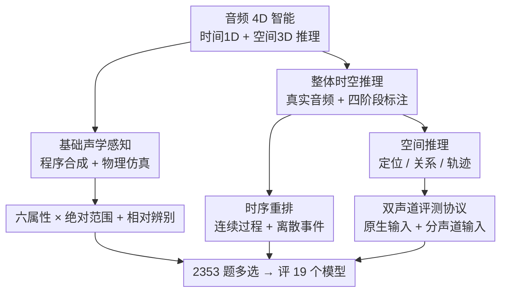

# STAR-Bench: Probing Deep Spatio-Temporal Reasoning as Audio 4D Intelligence

**会议**: ICLR 2026  
**OpenReview**: [https://openreview.net/forum?id=Ts6j3GoZDE](https://openreview.net/forum?id=Ts6j3GoZDE)  
**代码**: https://github.com/InternLM/StarBench  
**领域**: 音频理解 / 多模态评测  
**关键词**: 音频 4D 智能、时空推理、听觉感知基准、双声道空间推理、LALM 评测

## 一句话总结
本文提出"音频 4D 智能"（在时间 1D + 三维空间 3D 上对声源动态做物理化推理）的概念，并构建 STAR-Bench 基准——用程序合成 + 四阶段人工标注两条管线造出 2353 道题，专门考那些"难以用文字描述"的细粒度听觉线索；评测 19 个音频大模型发现，连最强的 Gemini 2.5 Pro 也只有 49.6% 平均准确率，远低于人类的 ~79%。

## 研究背景与动机
**领域现状**：多模态大模型（MLLM）和大音频语言模型（LALM）发展很快，社区也涌现了一批音频基准（AIR-Bench、MMAU、MMAR 等），从 ASR、声音事件分类一路做到"音频推理"。表面上看，模型在这些榜单上分数节节高，似乎已经"听懂"了音频。

**现有痛点**：作者做了一个戳破假象的实验——用 Gemini 2.5 Pro 先把 MMAU / MMAR 里的音频转成详细文字 caption，再让模型**只看 caption**答题，准确率相比直接听原音频仅下降 5.9% / 9.0%。这说明现有基准考的主要是"能被文字无损转写的语义内容"（什么声音、什么事件），而不是听觉本身。可人类听觉远不止于此：人能从倒水声的动态变化判断容器水位，能从背后由远及近的引擎声推断车辆轨迹和距离——这些都是**难以语言化**的深层听觉线索。

**核心矛盾**：现有基准在"语义可转写性"这条捷径上被刷分，掩盖了模型在细粒度感知与物理推理上的真实缺陷；同时几乎所有 LALM 在预处理时把多声道音频**平均成单声道**，直接丢掉了空间推理所需的双耳线索，使得"空间听觉"根本无法被评测。

**本文目标**：① 形式化定义"音频 4D 智能"；② 造一个专门考非语言化听觉线索、覆盖时间与三维空间深层推理的基准；③ 系统评测现有模型并定位它们到底卡在哪。

**切入角度**：作者认为，要真正衡量 4D 智能，必须刻意挑那些 caption 写不清的题——如果一道题"听文字描述就能做对"，那它就不合格。于是基准设计的第一原则就是：**用 caption 答题应当大幅掉分**（本文实测时间任务掉 31.5%、空间任务掉 35.2%，远大于旧基准的个位数），以此证明基准聚焦在了非语言化线索上。

**核心 idea**：把听觉智能拆成"基础声学感知（六属性的绝对范围 + 相对辨别）"和"整体时空推理（时序重排 + 三维空间推理）"两个层级，用程序合成（精确可控）+ 真实音频四阶段标注（生态有效）两条管线造题，逼模型综合调用"细粒度感知 / 世界知识 / 多步推理"三种能力。

## 方法详解

### 整体框架
STAR-Bench 是一个**分层评测基准**，不是一个模型。它把"音频 4D 智能"分成两个互补的层级：底层是**基础声学感知**（Foundational Acoustic Perception），用完全参数化的合成音频，定量测模型对 6 个核心属性（音高 pitch、响度 loudness、时长 duration、方位角 azimuth、仰角 elevation、距离 distance）的感知；上层是**整体时空推理**（Holistic Spatio-Temporal Reasoning），用真实世界音频，测时序推理（音频片段重排）和空间推理（静态定位、多源关系、动态轨迹）。两个层级由两条不同的数据管线生产，最后统一成 2353 道多选题，用分类准确率评测。

设计哲学是金字塔式：底层感知是上层推理的地基——一个模型若连"这两段声音哪个音高更高"都听不准，就不可能在"通过多普勒效应重建汽车轨迹"这种题上做对。每道整体推理题都被刻意设计成需要"细粒度感知 + 世界知识 + 多步推理"三者同时在线，缺一即错。

### 关键设计

**1. 基础声学感知：把人类听力学测试搬给大模型**

底层痛点是：要测推理，得先确认模型"听得见、听得准"，但现有基准从不定量考这些。本文用"目标化合成"造可控样本——非空间属性（响度/音高/时长）直接合成纯正弦波并指定参数；空间属性（方位/仰角/距离）用 Pyroomacoustics 物理仿真引擎渲染声场。在此之上设两个子任务：**绝对感知范围**借鉴人类听力图（audiogram）思路，合成 125 Hz–8000 Hz、−10 到 110 dB HL 的正弦波，让模型判断"清晰的 beep 在前半段、后半段还是不存在"，空间上则要求把声源归入 4 个 90° 象限、判断仰角（上/平/下）和距离档（近/中/远，0–10m）；**相对辨别灵敏度**类比人类的"恰可觉差"（JND），给一段含两个声音的音频，让模型按某属性比较二者，每个属性设 4–6 个难度级，Level 1 是对照组（非空间属性 $\Delta=0$ 即完全相同，空间属性给亚阈值差异）用来检测瞎猜，后续级别逐级拉大差异 $\Delta$。通过分析模型在不同 $\Delta$ 下的准确率，就能像测人耳一样量化它的感知范围与灵敏度——这是现有基准完全没有的定量维度。

**2. 整体时空推理：用"片段重排"和"双声道"逼出深层线索**

上层痛点是：旧基准的"时序题"多停在感知层（某声音何时出现、谁先谁后），"空间题"多是单源定位，都不需要真正的物理因果或立体声推理。本文为时序设计**音频片段重排**（Audio Segment Reordering）：挑选具有强时序唯一性、语义清晰、逻辑普适的事件，每个切成 3 段打乱输入，让模型仅凭音频内容还原原始顺序；任务分两大类——**连续过程**（如倒水、烧水、汽车经过，靠多普勒频移、能量衰减等连续声学演化推理）和**离散事件序列**（如工具操作、日常脚本、因果触发，靠功能/惯例/因果知识）。空间推理则覆盖单源静态定位、多源空间关系、动态轨迹跟踪三个子类，难度递增到需要把空间与时间线索结合。

更关键的是空间评测的**双声道协议**。作者先做了个揭露性实验：构造 20 个伪立体声（原音频放左声道、其相位取反放右声道），人类轻松能做声音事件分类，但模型因单声道平均时信号相消而几乎全错（Gemini 2.5 Pro 20%、GPT-4o-audio 和 Qwen-2.5-Omni 都是 0%，专门的空间模型 BAT 才 100%）。基于此，空间题用两种输入：**原生输入**直接喂立体声、测模型默认管线的内在能力；**分声道输入**把左右声道分开并加文字说明（"Audio 1 是左耳、Audio 2 是右耳"），作为消融来看——当双耳信息在输入端被保留时，模型究竟有没有一丝空间能力。

**3. 四阶段数据管线 + 人类表现兜底，保证题目"难且可解"**

造高质量真实音频题的痛点是：既要难（非语言化）、又要保证人类能做对（否则就是噪声而非智能短板）。本文用四阶段管线：① **分类体系构建与数据溯源**——领域专家协同 Gemini 2.5 Pro 搭分层任务体系，从 Clotho、FSD50K（时序）、STARSS23 及网络音频（空间）等真实语料采候选；② **AI 辅助自动过滤**——三级漏斗，先按时长/能量等基本属性剔除，再用 LLM（DeepSeek-V3）基于文本元数据初筛并给理由，最后用多模态模型（Gemini 2.5 Pro）综合音频+元数据+LLM 输出给出判定、质量分和初步分类；③ **人工标注与质控**——招募并培训 10 名标注员，AI 信息仅作辅助参考，经两轮审核（标注员交叉验证达成共识 + 三位专家随机抽检）；④ **人类表现最终验证**——让领域专家当考生做题，**只保留至少 2/3 专家能独立答对的题**，从而确保每道题都"良定义、人类可解"。底层合成题的难度级也由专家校准、人类测试校验。

### 关键发现：基准为什么"考得准"
- **caption 掉分实验**是基准合法性的核心证据：旧基准（MMAU/MMAR）用 caption 答题只掉 5.9%/9.0%，而 STAR-Bench 时序题掉 31.5%、空间题掉 35.2%，证明它真的在考非语言化听觉线索而非文字可转写语义。

## 实验关键数据

### 主实验
评测 19 个模型（16 开源 + 3 闭源），主指标为多次扰动下的平均准确率 AA（%），MA=类均准确率，OA=整体准确率。

| 模型 | 基础感知 MA | 时序推理 MA | 空间推理 OA | 总均值 |
|------|------------|------------|------------|--------|
| 人类 | 75.60 | 88.00 | 73.72 | **79.11** |
| Gemini 2.5 Pro（最强模型） | 46.64 | 58.52 | 43.62 | **49.59** |
| Gemini 2.5 Flash | 39.72 | 30.70 | 28.35 | 32.92 |
| GPT-4o Audio | 31.76 | 19.44 | 41.70 | 30.97 |
| MiDashengLM（最强开源）| 33.24 | 16.30 | 44.29 | 31.28 |
| Qwen-2.5-Omni | 30.90 | 16.96 | 37.25 | 28.37 |
| BAT（空间专用）| 12.87 | 0.00 | 0.00 | 4.29 |
| 随机猜测 | 25.33 | 14.29 | 33.33 | 24.32 |

关键结论：① **基准很难**——最强的 Gemini 2.5 Pro 总均值仅 49.59%，与人类 79.11% 差 ~30 个点，多数开源模型接近随机猜测；② **闭源 vs 开源分层明显**——闭源模型靠知识与推理在时序任务上领先（Gemini 2.5 Pro 时序 58.52%），但空间任务上几乎所有模型都很差（多声道信息被丢）；③ **"think"模式反而更差**——Audio Flamingo 3 和 Xiaomi-MiMo-Audio 的 think 变体均低于不思考版本，说明在感知与知识地基不牢时，强行推理无益甚至有害。

### 误差分析（200 个失败样本）
对 Gemini 2.5 Pro、GPT-4o-audio、Qwen-2.5-Omni 在时序/空间各采样的失败案例做人工归因：

| 模型 | 任务 | 主导错误类型 | 占比 |
|------|------|-------------|------|
| Gemini 2.5 Pro | 时序 | 感知错误（perception error） | 84% |
| GPT-4o Audio | 时序 | 感知错误 | 70% |
| Qwen-2.5-Omni | 时序 | 知识缺口（knowledge gap） | 54% |
| Gemini 2.5 Pro | 空间 | 感知错误 | 59% |
| Qwen-2.5-Omni | 空间 | 感知错误 | 81% |

### 关键发现
- **闭源模型的瓶颈已上移到"细粒度感知"**：Gemini 2.5 Pro 知识与推理都很强，错误 84% 来自感知——它是唯一能给出细致声学描述、从而把题做对的模型，印证"世界知识深植于细粒度音频-文本描述能力之中"。
- **开源模型三项能力（感知/知识/推理）全面薄弱**：Qwen-2.5-Omni 时序错误中 54% 是知识缺口，推理因缺乏物理世界 grounding 而貌似合理实则错误。
- **空间能力普遍缺失**：除 BAT 外几乎所有模型把多声道平均成单声道，丢掉双耳线索；且常出现"视觉中心幻觉"（如"根据视频里车的轨迹……"），疑似把视觉空间推理误用到了纯音频输入上。

## 亮点与洞察
- **用"caption 能否答对"反向定义基准质量**：把"用 caption 答题应当大幅掉分"作为造题的硬性合法性检验，是一个非常巧妙、可迁移的基准设计原则——它直接量化了"这个基准到底考没考非语言化线索"，任何想造"真·感知"基准的工作都能借用。
- **把人类听力学（audiogram、JND）整套范式搬给大模型**：用纯正弦波 + 难度分级量化模型的"听力范围"和"辨别灵敏度"，让原本模糊的"感知能力"变得像测人耳一样可量化。
- **伪立体声相消实验**：一个 20 样本的小实验就干净利落地证明了"单声道平均预处理"是空间推理的根本瓶颈，并直接催生了原生/分声道双协议——这种"先证明问题存在、再据此设计评测"的思路很值得学。
- **人类表现兜底（2/3 专家答对才保留）**：把"人类可解"做成硬门槛，确保失败确实反映模型短板而非题目噪声。

## 局限与展望
- **作者承认**：基准聚焦评测与诊断，给出了三条改进方向（增强稠密音频描述、提升多音频推理、放弃声道平均预处理），但未提供训练方案或可直接提升模型的方法。
- **规模与覆盖**：2353 题、空间推理仅 502 题，相对模型能力空间仍偏小；真实音频来源（FSD50K/Clotho 等）常被用于预训练，虽然任务形式刻意偏离传统 QA，但潜在数据泄漏风险难以完全排除。
- **评测形式**：全部为多选题、按选项字符串匹配判分，可能低估/高估开放生成式模型的真实推理质量；"think"模式更差的结论也可能与多选题形式交互有关。
- **改进思路**：可补充原生多声道架构的模型对照、引入开放式生成评分、扩大空间动态轨迹题量，并把"人类听力图"维度做成可持续追踪的能力雷达。

## 相关工作与启发
- **vs MMAU / MMAR / MMAU-Pro**：它们也含时序/空间题，但时序多停在"何时发生、谁先谁后"的感知层，空间多为单源定位且常不需要立体声线索；STAR-Bench 的时序题要求理解跨片段的物理原理与因果动态、空间题显式强调立体声推理，并提供定量属性评测与鲁棒（多次扰动）评测——这正是表 1 里它在 6 个维度全 ✓ 而旧基准多为 ✗/部分支持的原因。
- **vs BAT（空间音频专用模型）**：BAT 在伪立体声实验中能 100% 分类，说明原生多声道处理是空间能力的关键；但 BAT 在 STAR-Bench 整体时序/空间任务上几乎全 0，说明"会处理立体声"远不等于"具备 4D 推理"，二者是互补而非替代关系。

## 评分
- 新颖性: ⭐⭐⭐⭐⭐ 首次形式化"音频 4D 智能"并用 caption 掉分实验严格界定评测范围，问题定义本身就有开创性。
- 实验充分度: ⭐⭐⭐⭐⭐ 评测 19 个模型、含误差归因、消融与人类基线，证据链完整。
- 写作质量: ⭐⭐⭐⭐ 结构清晰、动机有力；任务子类繁多，初读需对照图表。
- 价值: ⭐⭐⭐⭐⭐ 揭示了当前音频大模型在细粒度感知与空间推理上的系统性短板，并给出明确的前进方向。

<!-- RELATED:START -->

## 相关论文

- [\[ICLR 2026\] Unmute the Patch Tokens: Rethinking Probing in Multi-Label Audio Classification](unmute_the_patch_tokens_rethinking_probing_in_multi-label_audio_classification.md)
- [\[ICLR 2026\] UALM: Unified Audio Language Model for Understanding, Generation and Reasoning](ualm_unified_audio_language_model_for_understanding_generation_and_reasoning.md)
- [\[ICLR 2026\] Query-Guided Spatial-Temporal-Frequency Interaction for Music Audio-Visual Question Answering](query-guided_spatial-temporal-frequency_interaction_for_music_audio-visual_quest.md)
- [\[ICLR 2026\] OWL: Geometry-Aware Spatial Reasoning for Audio Large Language Models](owl_geometry-aware_spatial_reasoning_for_audio_large_language_models.md)
- [\[ICML 2026\] Probing Cross-modal Information Hubs in Audio-Visual LLMs](../../ICML2026/audio_speech/probing_cross-modal_information_hubs_in_audio-visual_llms.md)

<!-- RELATED:END -->
